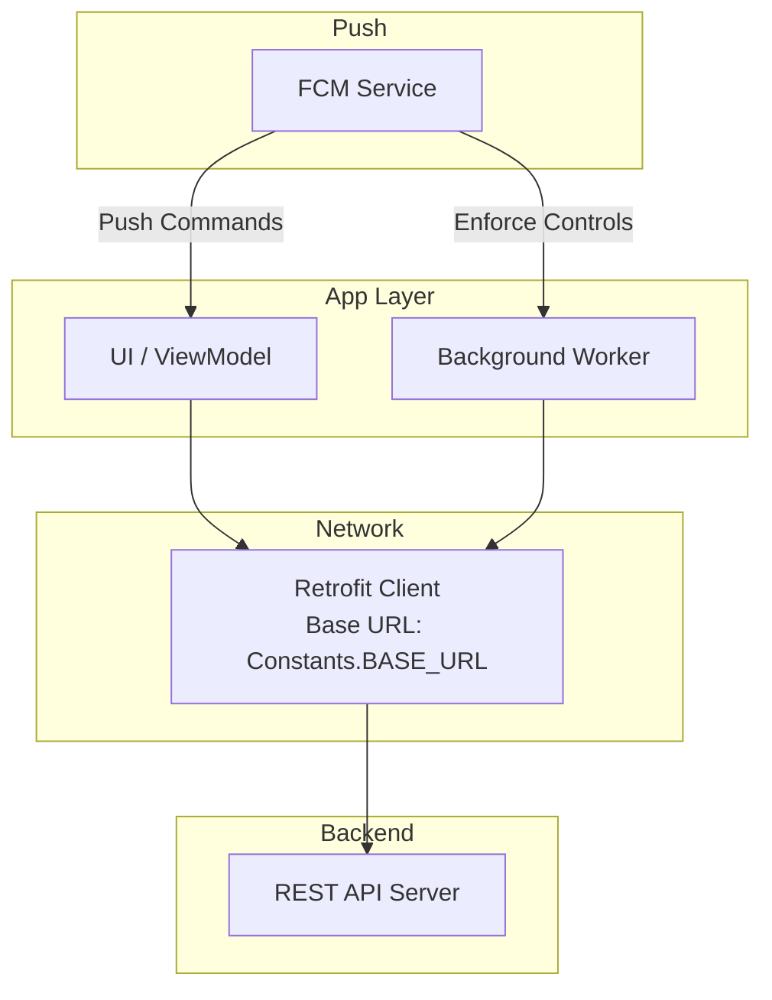
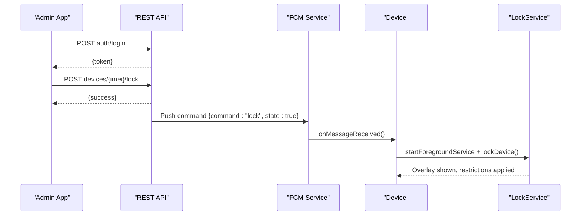
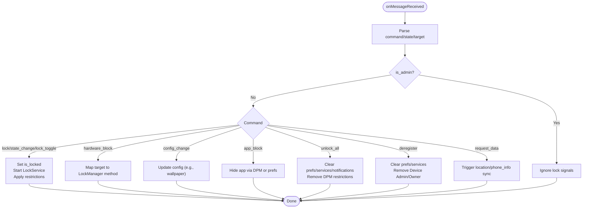
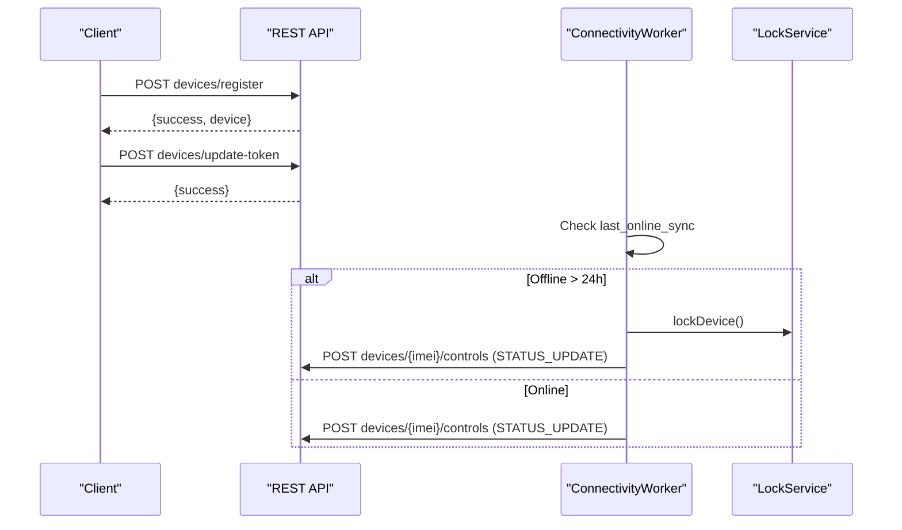
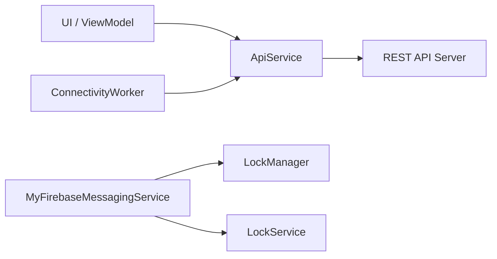

# API Integration

<cite>
**Referenced Files in This Document**
- [ApiService.kt](file://app/src/main/java/com/pksafe/lock/manager/data/ApiService.kt)
- [Models.kt](file://app/src/main/java/com/pksafe/lock/manager/data/Models.kt)
- [MyFirebaseMessagingService.kt](file://app/src/main/java/com/pksafe/lock/manager/service/MyFirebaseMessagingService.kt)
- [LockService.kt](file://app/src/main/java/com/pksafe/lock/manager/service/LockService.kt)
- [ConnectivityWorker.kt](file://app/src/main/java/com/pksafe/lock/manager/service/ConnectivityWorker.kt)
- [Constants.kt](file://app/src/main/java/com/pksafe/lock/manager/util/Constants.kt)
- [network_security_config.xml](file://app/src/main/res/xml/network_security_config.xml)
</cite>

## Table of Contents
1. [Introduction](#introduction)
2. [Project Structure](#project-structure)
3. [Core Components](#core-components)
4. [Architecture Overview](#architecture-overview)
5. [Detailed Component Analysis](#detailed-component-analysis)
6. [Dependency Analysis](#dependency-analysis)
7. [Performance Considerations](#performance-considerations)
8. [Troubleshooting Guide](#troubleshooting-guide)
9. [Conclusion](#conclusion)
10. [Appendices](#appendices)

## Introduction
This document describes the RESTful API integration and Firebase Cloud Messaging (FCM) integration used by PK Locker to manage devices, synchronize status, and execute remote control commands. It covers HTTP endpoints, request/response schemas, authentication via Authorization headers, FCM message handling, device lifecycle management, EMI payment tracking, bulk operations, error handling, offline behavior, rate limiting considerations, versioning notes, and client implementation guidance for efficient network communication.

## Project Structure
The integration spans:
- API definitions and data models for REST endpoints
- Retrofit-based clients invoked from UI components and background workers
- FCM service that receives push commands and enforces device controls
- Background connectivity worker that reports device status and enforces offline locking
- Network security configuration allowing local HTTP for development while enforcing HTTPS elsewhere

**Diagram sources**
- [ApiService.kt:11-185](file://app/src/main/java/com/pksafe/lock/manager/data/ApiService.kt#L11-L185)
- [Constants.kt:3-10](file://app/src/main/java/com/pksafe/lock/manager/util/Constants.kt#L3-L10)
- [ConnectivityWorker.kt:15-71](file://app/src/main/java/com/pksafe/lock/manager/service/ConnectivityWorker.kt#L15-L71)
- [MyFirebaseMessagingService.kt:20-224](file://app/src/main/java/com/pksafe/lock/manager/service/MyFirebaseMessagingService.kt#L20-L224)

**Section sources**
- [ApiService.kt:11-185](file://app/src/main/java/com/pksafe/lock/manager/data/ApiService.kt#L11-L185)
- [Constants.kt:3-10](file://app/src/main/java/com/pksafe/lock/manager/util/Constants.kt#L3-L10)
- [ConnectivityWorker.kt:15-71](file://app/src/main/java/com/pksafe/lock/manager/service/ConnectivityWorker.kt#L15-L71)
- [MyFirebaseMessagingService.kt:20-224](file://app/src/main/java/com/pksafe/lock/manager/service/MyFirebaseMessagingService.kt#L20-L224)

## Core Components
- REST API client interface with typed endpoints for authentication, device management, EMI, key orders, and admin actions.
- Data models representing requests and responses for all endpoints.
- FCM service handling push commands to lock/unlock devices, apply hardware restrictions, block apps, update config, and deregister devices.
- Connectivity worker reporting device status and enforcing offline locks when disconnected beyond a threshold.
- Lock service overlay and enforcement logic triggered by FCM or local conditions.

**Section sources**
- [ApiService.kt:11-185](file://app/src/main/java/com/pksafe/lock/manager/data/ApiService.kt#L11-L185)
- [Models.kt:7-255](file://app/src/main/java/com/pksafe/lock/manager/data/Models.kt#L7-L255)
- [MyFirebaseMessagingService.kt:20-224](file://app/src/main/java/com/pksafe/lock/manager/service/MyFirebaseMessagingService.kt#L20-L224)
- [ConnectivityWorker.kt:15-71](file://app/src/main/java/com/pksafe/lock/manager/service/ConnectivityWorker.kt#L15-L71)
- [LockService.kt:41-330](file://app/src/main/java/com/pksafe/lock/manager/service/LockService.kt#L41-L330)

## Architecture Overview
PK Locker uses a hybrid architecture:
- REST API over HTTPS for device registration, status sync, and control commands.
- FCM for real-time push commands to enforce device state changes instantly.
- Background worker ensures offline safety by locking devices after prolonged disconnection and reporting status when online.

**Diagram sources**
- [ApiService.kt:13-17](file://app/src/main/java/com/pksafe/lock/manager/data/ApiService.kt#L13-L17)
- [ApiService.kt:46-56](file://app/src/main/java/com/pksafe/lock/manager/data/ApiService.kt#L46-L56)
- [MyFirebaseMessagingService.kt:22-68](file://app/src/main/java/com/pksafe/lock/manager/service/MyFirebaseMessagingService.kt#L22-L68)
- [LockService.kt:50-80](file://app/src/main/java/com/pksafe/lock/manager/service/LockService.kt#L50-L80)

## Detailed Component Analysis

### REST API Endpoints
Authentication
- POST auth/login
  - Request: LoginRequest
  - Response: LoginResponse
  - Auth: None
- POST auth/register
  - Request: SignupRequest
  - Response: SignupResponse
  - Auth: None

Device Management
- POST devices/register
  - Headers: Authorization: Bearer <token>
  - Request: DeviceRegistrationRequest
  - Response: RegistrationResponse
- GET devices
  - Headers: Authorization: Bearer <token>
  - Response: DeviceListResponse
- GET devices/deregistered
  - Headers: Authorization: Bearer <token>
  - Response: DeviceListResponse
- GET devices/stats
  - Headers: Authorization: Bearer <token>
  - Response: StatsResponse
- GET devices/dashboard-analytics
  - Headers: Authorization: Bearer <token>
  - Response: StatsResponse
- POST devices/{imei}/lock
  - Headers: Authorization: Bearer <token>
  - Path: imei
  - Response: RegistrationResponse
- POST devices/{imei}/unlock
  - Headers: Authorization: Bearer <token>
  - Path: imei
  - Response: RegistrationResponse
- POST devices/{imei}/controls
  - Headers: Authorization: Bearer <token>
  - Path: imei
  - Request: AdvancedControlRequest
  - Response: RegistrationResponse
- POST devices/update-token
  - Headers: Authorization: Bearer <token>
  - Body: Map<String, String>
  - Response: RegistrationResponse
- POST devices/update-shopkeeper-token
  - Headers: Authorization: Bearer <token>
  - Body: Map<String, String>
  - Response: RegistrationResponse
- POST devices/{imei}/sim-changed
  - Path: imei
  - Body: Map<String, String>
  - Response: RegistrationResponse
- POST devices/{imei}/location
  - Path: imei
  - Body: Map<String, String>
  - Response: RegistrationResponse
- POST devices/{imei}/unlock-all
  - Headers: Authorization: Bearer <token>
  - Path: imei
  - Response: RegistrationResponse
- POST devices/{imei}/deregister
  - Headers: Authorization: Bearer <token>
  - Path: imei
  - Response: RegistrationResponse
- GET devices/public/{imei}
  - Headers: Authorization: Bearer <token>
  - Path: imei
  - Response: CustomerDeviceResponse

EMI Management
- GET emis/device/{imei}
  - Headers: Authorization: Bearer <token>
  - Path: imei
  - Response: DeviceEmiScheduleResponse
- POST emis/{emiId}/mark-paid
  - Headers: Authorization: Bearer <token>
  - Path: emiId
  - Response: RegistrationResponse
- POST emis/device/{imei}
  - Headers: Authorization: Bearer <token>
  - Path: imei
  - Request: RescheduleEmiRequest
  - Response: RegistrationResponse

Key Orders
- POST key-orders/checkout-safepay
  - Headers: Authorization: Bearer <token>
  - Body: Map<String, String>
  - Response: KeyCheckoutResponse
- POST key-orders/verify-safepay
  - Headers: Authorization: Bearer <token>
  - Body: Map<String, String>
  - Response: RegistrationResponse
- POST key-orders/free-test-keys
  - Headers: Authorization: Bearer <token>
  - Body: Map<String, String>
  - Response: RegistrationResponse
- POST key-orders/wallet-pay
  - Headers: Authorization: Bearer <token>
  - Body: WalletPayRequest
  - Response: WalletPayResponse
- GET key-orders/history
  - Headers: Authorization: Bearer <token>
  - Response: KeyHistoryResponse

Admin Key Management
- GET admin/key-orders
  - Headers: Authorization: Bearer <token>
  - Response: KeyOrderListResponse
- POST key-orders/request
  - Headers: Authorization: Bearer <token>
  - Body: KeyRequest
  - Response: KeyOrderListResponse
- POST admin/key-orders/{id}/approve
  - Headers: Authorization: Bearer <token>
  - Path: id
  - Response: GenericResponse
- POST admin/key-orders/{id}/reject
  - Headers: Authorization: Bearer <token>
  - Path: id
  - Body: Map<String, String>
  - Response: GenericResponse

Notes
- Base URL is defined centrally; see Constants.
- All protected endpoints require Authorization header with Bearer token.
- Responses generally include success flags and messages; some return structured data objects.

**Section sources**
- [ApiService.kt:11-185](file://app/src/main/java/com/pksafe/lock/manager/data/ApiService.kt#L11-L185)
- [Models.kt:7-255](file://app/src/main/java/com/pksafe/lock/manager/data/Models.kt#L7-L255)
- [Constants.kt:3-10](file://app/src/main/java/com/pksafe/lock/manager/util/Constants.kt#L3-L10)

### FCM Push Command Handling
Connection establishment
- The app registers MyFirebaseMessagingService to receive RemoteMessage events.
- On receiving a message, the service parses command, state, target, and optional fields.

Message formats and event types
- command values:
  - lock, state_change, lock_toggle: set device locked state
  - hardware_block: apply per-target restrictions (usb, camera, settings, auto_lock, alarm, install, uninstall, calls, reset, boot)
  - config_change: update configuration (e.g., wallpaper url)
  - app_block: hide/block specific apps by key
  - unlock_all: clear all restrictions and stop lock services
  - deregister: fully release device privileges and remove admin/owner
  - request_data: trigger one-time data requests (location, phone_info)

Real-time interaction patterns
- Lock flow: command=lock/state_change sets is_locked flag, starts LockService foreground service, triggers full-screen lock overlay, applies hardware restrictions via LockManager.
- Unlock flow: stops LockService, clears restrictions, cancels notifications.
- Hardware blocks: map targets to LockManager methods to enforce USB, camera, install/uninstall, calls, factory reset, safe boot, etc.
- App blocking: attempts Device Owner hiding; falls back to SharedPrefs-based blocklist if not owner.
- Unlock all: synchronously clears prefs, stops services, cancels notifications, then asynchronously clears Device Policy Manager restrictions and unhides apps.
- Deregister: clears all prefs, stops services, removes Device Admin and Device Owner so the customer can uninstall normally.

**Diagram sources**
- [MyFirebaseMessagingService.kt:22-224](file://app/src/main/java/com/pksafe/lock/manager/service/MyFirebaseMessagingService.kt#L22-L224)

**Section sources**
- [MyFirebaseMessagingService.kt:22-224](file://app/src/main/java/com/pksafe/lock/manager/service/MyFirebaseMessagingService.kt#L22-L224)

### Device Lifecycle Management
Registration
- Use POST devices/register with Authorization header and DeviceRegistrationRequest body including IMEI(s), device info, customer details, EMI parameters, and FCM token.
- Response includes success flag and device summary.

Activation and Control
- Use POST devices/{imei}/lock or unlock to change device state.
- Use POST devices/{imei}/controls with AdvancedControlRequest to send granular control actions.

Status Synchronization
- Use POST devices/update-token to refresh FCM tokens.
- Use POST devices/{imei}/sim-changed and POST devices/{imei}/location to report SIM and location changes.

Bulk Operations
- Use POST devices/{imei}/unlock-all to clear all restrictions remotely.
- Use POST devices/{imei}/deregister to fully release device privileges.

Offline Capability
- ConnectivityWorker monitors last sync time; if offline beyond threshold, it locally locks the device and attempts to notify server.
- Heartbeat updates last_online_sync when online.

**Diagram sources**
- [ApiService.kt:20-24](file://app/src/main/java/com/pksafe/lock/manager/data/ApiService.kt#L20-L24)
- [ApiService.kt:65-69](file://app/src/main/java/com/pksafe/lock/manager/data/ApiService.kt#L65-L69)
- [ApiService.kt:77-87](file://app/src/main/java/com/pksafe/lock/manager/data/ApiService.kt#L77-L87)
- [ApiService.kt:89-99](file://app/src/main/java/com/pksafe/lock/manager/data/ApiService.kt#L89-L99)
- [ConnectivityWorker.kt:17-71](file://app/src/main/java/com/pksafe/lock/manager/service/ConnectivityWorker.kt#L17-L71)
- [LockService.kt:111-148](file://app/src/main/java/com/pksafe/lock/manager/service/LockService.kt#L111-L148)

**Section sources**
- [ApiService.kt:20-99](file://app/src/main/java/com/pksafe/lock/manager/data/ApiService.kt#L20-L99)
- [ConnectivityWorker.kt:17-71](file://app/src/main/java/com/pksafe/lock/manager/service/ConnectivityWorker.kt#L17-L71)
- [LockService.kt:111-148](file://app/src/main/java/com/pksafe/lock/manager/service/LockService.kt#L111-L148)

### EMI Payment Tracking
Endpoints
- GET emis/device/{imei}: retrieve detailed schedule and summary for a device’s EMI plan.
- POST emis/{emiId}/mark-paid: mark an installment as paid.
- POST emis/device/{imei}: reschedule EMI plan with new tenure, amounts, and dates.

Schemas
- DeviceEmiScheduleResponse contains device identifiers, totals, balance, summary counts, and list of installments.
- EmiInstallmentItem includes due date, amount, and status.
- RescheduleEmiRequest includes tenure, amounts, and optional start date.

Usage pattern
- Fetch schedule before displaying EMI details.
- Mark payments upon successful transactions.
- Reschedule plans when renegotiating terms.

**Section sources**
- [ApiService.kt:112-129](file://app/src/main/java/com/pksafe/lock/manager/data/ApiService.kt#L112-L129)
- [Models.kt:123-173](file://app/src/main/java/com/pksafe/lock/manager/data/Models.kt#L123-L173)

### Bulk Device Operations
- Unlock all: POST devices/{imei}/unlock-all clears all restrictions immediately.
- Deregister: POST devices/{imei}/deregister removes device privileges and allows uninstallation.
- Advanced controls: POST devices/{imei}/controls supports targeted actions via action/state pairs.

Operational notes
- These endpoints are typically invoked by admin workflows.
- Responses follow standard success/message pattern.

**Section sources**
- [ApiService.kt:58-99](file://app/src/main/java/com/pksafe/lock/manager/data/ApiService.kt#L58-L99)

### Authentication Methods
- Authorization header: Bearer <token> required for most endpoints.
- Tokens obtained via POST auth/login and stored locally for subsequent requests.
- Token updates: POST devices/update-token and POST devices/update-shopkeeper-token.

Security considerations
- Ensure HTTPS usage; base URL points to production endpoint.
- Local development may use HTTP for private ranges per network security config.

**Section sources**
- [ApiService.kt:13-17](file://app/src/main/java/com/pksafe/lock/manager/data/ApiService.kt#L13-L17)
- [ApiService.kt:65-75](file://app/src/main/java/com/pksafe/lock/manager/data/ApiService.kt#L65-L75)
- [Constants.kt:3-10](file://app/src/main/java/com/pksafe/lock/manager/util/Constants.kt#L3-L10)
- [network_security_config.xml:9-27](file://app/src/main/res/xml/network_security_config.xml#L9-L27)

### Error Handling Strategies
- Network errors: catch exceptions around Retrofit calls; log and surface user-friendly messages.
- Non-success responses: check response.isSuccessful and handle codes/messages accordingly.
- Offline locking: ConnectivityWorker enforces local lock if offline beyond threshold; attempts to report status when possible.
- Graceful fallbacks: FCM app blocking falls back to SharedPrefs if Device Owner not available.

Retry mechanisms
- No explicit retry policy in current code; consider implementing exponential backoff at the client layer for transient failures.
- ConnectivityWorker runs periodically; leverage WorkManager retries for robustness.

**Section sources**
- [ConnectivityWorker.kt:17-71](file://app/src/main/java/com/pksafe/lock/manager/service/ConnectivityWorker.kt#L17-L71)
- [MyFirebaseMessagingService.kt:101-119](file://app/src/main/java/com/pksafe/lock/manager/service/MyFirebaseMessagingService.kt#L101-L119)

### Rate Limiting Considerations
- Not explicitly implemented in client code.
- Recommendations:
  - Implement client-side throttling for frequent status updates.
  - Batch requests where possible.
  - Respect server-side rate limits; add jitter to retries.

[No sources needed since this section provides general guidance]

### Versioning Information
- Base URL points to a production endpoint; no explicit version path segment in current endpoints.
- Migration guidance:
  - Introduce versioned routes (e.g., /api/v1/) when evolving APIs.
  - Maintain backward compatibility for critical control endpoints.
  - Deprecate old endpoints gradually with deprecation headers.

[No sources needed since this section provides general guidance]

### Client Implementation Guidelines
- Use centralized base URL from Constants to avoid duplication.
- Always attach Authorization header for protected endpoints.
- Handle both success and failure paths; update UI states accordingly.
- For FCM:
  - Parse command fields safely; support legacy payloads.
  - Enforce administrative device protection to ignore lock commands.
  - Use foreground services and high-priority notifications for critical lock events.
- For offline capability:
  - Track last_online_sync; lock locally if offline too long.
  - Report status when connectivity returns.

**Section sources**
- [Constants.kt:3-10](file://app/src/main/java/com/pksafe/lock/manager/util/Constants.kt#L3-L10)
- [MyFirebaseMessagingService.kt:22-45](file://app/src/main/java/com/pksafe/lock/manager/service/MyFirebaseMessagingService.kt#L22-L45)
- [ConnectivityWorker.kt:17-71](file://app/src/main/java/com/pksafe/lock/manager/service/ConnectivityWorker.kt#L17-L71)

## Dependency Analysis
Components interact as follows:
- UI and background workers create Retrofit instances using Constants.BASE_URL and call ApiService endpoints.
- FCM service invokes LockManager to enforce restrictions and starts/stops LockService.
- ConnectivityWorker coordinates offline locking and status reporting via ApiService.

**Diagram sources**
- [ApiService.kt:11-185](file://app/src/main/java/com/pksafe/lock/manager/data/ApiService.kt#L11-L185)
- [ConnectivityWorker.kt:15-71](file://app/src/main/java/com/pksafe/lock/manager/service/ConnectivityWorker.kt#L15-L71)
- [MyFirebaseMessagingService.kt:20-224](file://app/src/main/java/com/pksafe/lock/manager/service/MyFirebaseMessagingService.kt#L20-L224)
- [LockService.kt:41-330](file://app/src/main/java/com/pksafe/lock/manager/service/LockService.kt#L41-L330)

**Section sources**
- [ApiService.kt:11-185](file://app/src/main/java/com/pksafe/lock/manager/data/ApiService.kt#L11-L185)
- [ConnectivityWorker.kt:15-71](file://app/src/main/java/com/pksafe/lock/manager/service/ConnectivityWorker.kt#L15-L71)
- [MyFirebaseMessagingService.kt:20-224](file://app/src/main/java/com/pksafe/lock/manager/service/MyFirebaseMessagingService.kt#L20-L224)
- [LockService.kt:41-330](file://app/src/main/java/com/pksafe/lock/manager/service/LockService.kt#L41-L330)

## Performance Considerations
- Reuse Retrofit instances instead of creating per-call instances to reduce overhead.
- Minimize payload sizes; only send necessary fields.
- Coalesce frequent status updates; batch location/sim changes when appropriate.
- Use foreground services judiciously; ensure notifications are concise and non-intrusive.
- Avoid heavy operations on main thread; offload to background dispatchers.

[No sources needed since this section provides general guidance]

## Troubleshooting Guide
Common issues and resolutions:
- FCM commands ignored on admin devices: verify is_admin flag; admin devices intentionally ignore lock signals.
- Lock overlay not showing: ensure LockService started as foreground; check notification channels and permissions.
- App blocking not effective: confirm Device Owner privileges; fall back to SharedPrefs-based blocklist.
- Offline lock not triggering: verify last_online_sync updates and ConnectivityWorker scheduling.
- Network errors: check BASE_URL, internet connectivity, and network security configuration for local HTTP allowances.

**Section sources**
- [MyFirebaseMessagingService.kt:40-45](file://app/src/main/java/com/pksafe/lock/manager/service/MyFirebaseMessagingService.kt#L40-L45)
- [LockService.kt:54-80](file://app/src/main/java/com/pksafe/lock/manager/service/LockService.kt#L54-L80)
- [ConnectivityWorker.kt:17-71](file://app/src/main/java/com/pksafe/lock/manager/service/ConnectivityWorker.kt#L17-L71)
- [network_security_config.xml:9-27](file://app/src/main/res/xml/network_security_config.xml#L9-L27)

## Conclusion
PK Locker integrates REST APIs and FCM to provide robust device management, real-time control, and offline safety. The API surface covers authentication, device lifecycle, EMI tracking, key orders, and admin operations. FCM enables immediate enforcement of device policies, while background workers maintain integrity during connectivity outages. Following the guidelines here will help implement reliable, secure, and performant integrations.

[No sources needed since this section summarizes without analyzing specific files]

## Appendices

### Protocol-Specific Examples
- Device registration: POST devices/register with DeviceRegistrationRequest including IMEI, device model, customer info, EMI parameters, and FCM token.
- Status synchronization: POST devices/update-token to refresh FCM token; POST devices/{imei}/sim-changed and POST devices/{imei}/location to report changes.
- Remote control commands: POST devices/{imei}/controls with AdvancedControlRequest specifying action and state; FCM pushes corresponding commands to devices.
- EMI payment tracking: GET emis/device/{imei} to fetch schedule; POST emis/{emiId}/mark-paid to record payments; POST emis/device/{imei} to reschedule plans.
- Bulk operations: POST devices/{imei}/unlock-all to clear restrictions; POST devices/{imei}/deregister to release device privileges.

[No sources needed since this section provides general guidance]