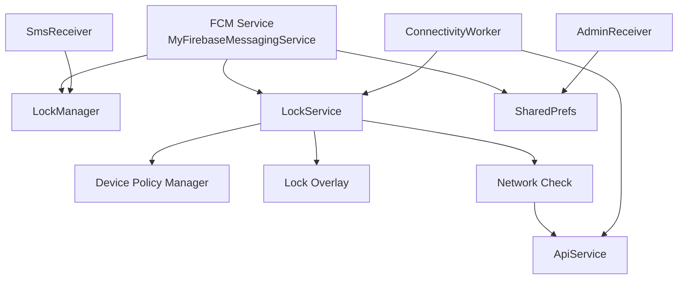
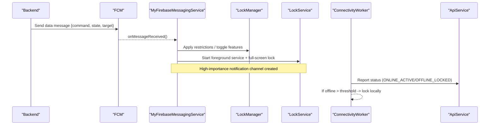
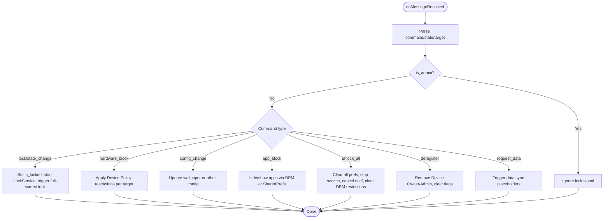
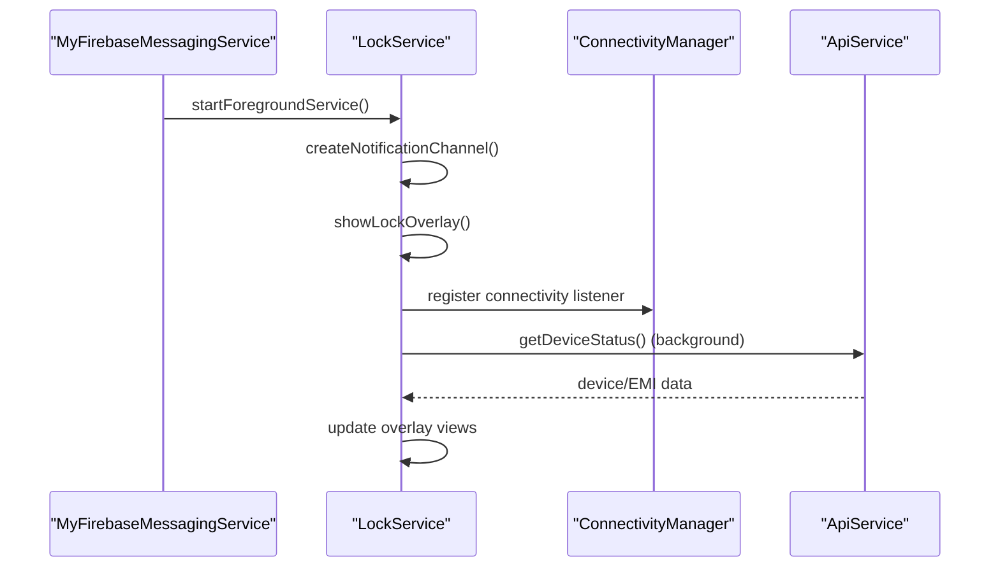
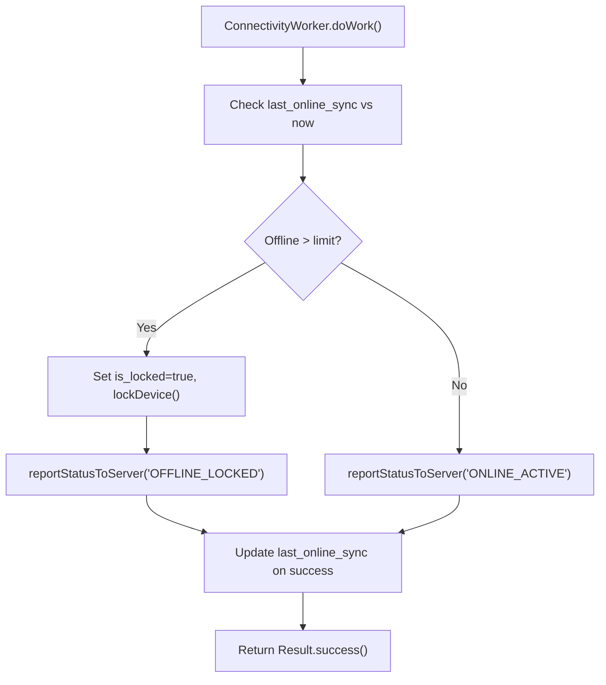
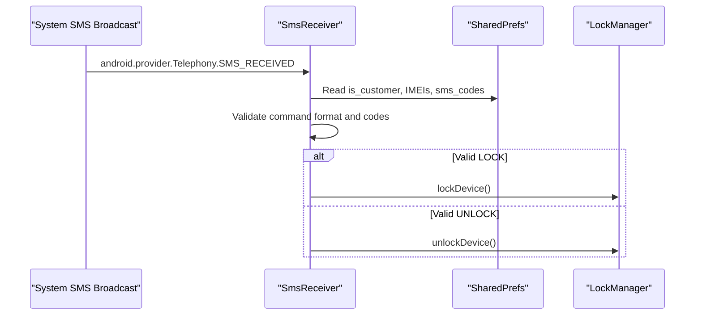
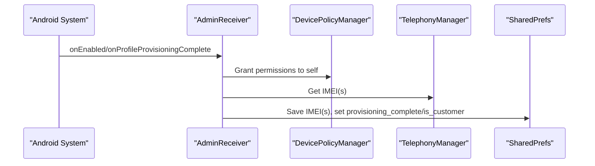
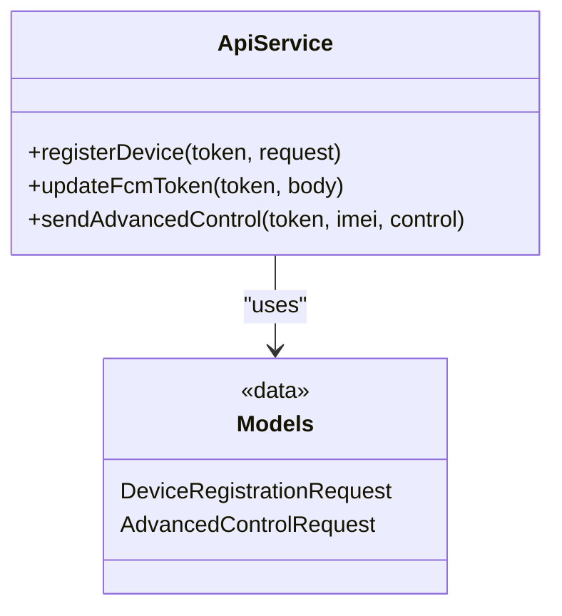
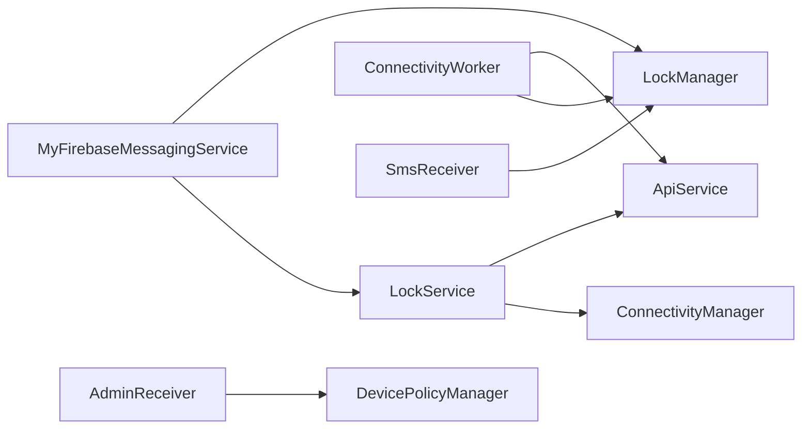

# Firebase Cloud Messaging

<cite>
**Referenced Files in This Document**
- [MyFirebaseMessagingService.kt](file://app/src/main/java/com/pksafe/lock/manager/service/MyFirebaseMessagingService.kt)
- [LockService.kt](file://app/src/main/java/com/pksafe/lock/manager/service/LockService.kt)
- [SmsReceiver.kt](file://app/src/main/java/com/pksafe/lock/manager/receiver/SmsReceiver.kt)
- [LockManager.kt](file://app/src/main/java/com/pksafe/lock/manager/util/LockManager.kt)
- [ApiService.kt](file://app/src/main/java/com/pksafe/lock/manager/data/ApiService.kt)
- [Models.kt](file://app/src/main/java/com/pksafe/lock/manager/data/Models.kt)
- [ConnectivityWorker.kt](file://app/src/main/java/com/pksafe/lock/manager/service/ConnectivityWorker.kt)
- [AdminReceiver.kt](file://app/src/main/java/com/pksafe/lock/manager/receiver/AdminReceiver.kt)
- [google-services.json](file://app/google-services.json)
</cite>

## Table of Contents
1. [Introduction](#introduction)
2. [Project Structure](#project-structure)
3. [Core Components](#core-components)
4. [Architecture Overview](#architecture-overview)
5. [Detailed Component Analysis](#detailed-component-analysis)
6. [Dependency Analysis](#dependency-analysis)
7. [Performance Considerations](#performance-considerations)
8. [Troubleshooting Guide](#troubleshooting-guide)
9. [Conclusion](#conclusion)
10. [Appendices](#appendices)

## Introduction
This document explains how the application integrates Firebase Cloud Messaging (FCM) to handle push notifications for device control, status updates, and administrative alerts. It covers FCM token registration concepts, message payload structures, notification types, connection establishment with Firebase services, message routing, offline queuing strategies, error handling, retry mechanisms, and fallback to SMS-based commands when network is unavailable. It also includes performance optimization techniques for efficient message handling and battery usage considerations.

## Project Structure
The FCM integration spans several components:
- Message reception and dispatching: MyFirebaseMessagingService
- Lock enforcement overlay and foreground service: LockService
- Offline SMS fallback: SmsReceiver
- Device policy and hardware controls: LockManager
- Backend API contracts for token updates and advanced controls: ApiService and Models
- Background connectivity and offline guard: ConnectivityWorker
- Admin provisioning and IMEI capture: AdminReceiver
- Firebase configuration: google-services.json

**Diagram sources**
- [MyFirebaseMessagingService.kt:22-224](file://app/src/main/java/com/pksafe/lock/manager/service/MyFirebaseMessagingService.kt#L22-L224)
- [LockService.kt:50-314](file://app/src/main/java/com/pksafe/lock/manager/service/LockService.kt#L50-L314)
- [LockManager.kt:111-192](file://app/src/main/java/com/pksafe/lock/manager/util/LockManager.kt#L111-L192)
- [ConnectivityWorker.kt:17-71](file://app/src/main/java/com/pksafe/lock/manager/service/ConnectivityWorker.kt#L17-L71)
- [SmsReceiver.kt:44-143](file://app/src/main/java/com/pksafe/lock/manager/receiver/SmsReceiver.kt#L44-L143)
- [AdminReceiver.kt:16-36](file://app/src/main/java/com/pksafe/lock/manager/receiver/AdminReceiver.kt#L16-L36)

**Section sources**
- [MyFirebaseMessagingService.kt:22-224](file://app/src/main/java/com/pksafe/lock/manager/service/MyFirebaseMessagingService.kt#L22-L224)
- [LockService.kt:50-314](file://app/src/main/java/com/pksafe/lock/manager/service/LockService.kt#L50-L314)
- [SmsReceiver.kt:44-143](file://app/src/main/java/com/pksafe/lock/manager/receiver/SmsReceiver.kt#L44-L143)
- [LockManager.kt:111-192](file://app/src/main/java/com/pksafe/lock/manager/util/LockManager.kt#L111-L192)
- [ApiService.kt:11-185](file://app/src/main/java/com/pksafe/lock/manager/data/ApiService.kt#L11-L185)
- [Models.kt:177-219](file://app/src/main/java/com/pksafe/lock/manager/data/Models.kt#L177-L219)
- [ConnectivityWorker.kt:17-71](file://app/src/main/java/com/pksafe/lock/manager/service/ConnectivityWorker.kt#L17-L71)
- [AdminReceiver.kt:16-36](file://app/src/main/java/com/pksafe/lock/manager/receiver/AdminReceiver.kt#L16-L36)
- [google-services.json:1-67](file://app/google-services.json#L1-L67)

## Core Components
- MyFirebaseMessagingService: Receives FCM data messages, parses command fields, enforces admin protection, and triggers lock/unlock, hardware blocks, app blocking, config changes, deregistration, and data requests. Also creates a high-priority notification channel and full-screen intent for critical lock events.
- LockService: Foreground service that displays a persistent lock overlay, enforces restrictions, and refreshes EMI and shop details from the backend. It handles auto-lock on connectivity loss if enabled.
- SmsReceiver: Offline fallback that processes SMS commands (LOCK/UNLOCK) using deterministic codes derived from IMEI or server-provided codes saved locally.
- LockManager: Applies Device Policy Manager restrictions (camera, USB, install/uninstall, factory reset, safe boot, outgoing calls), manages app hiding via Device Owner, toggles warning alarm, sets wallpaper, and supports self-deactivation.
- ApiService and Models: Define endpoints for device registration, token updates, advanced controls, EMI operations, and key management. Includes AdvancedControlRequest used by background workers to report status.
- ConnectivityWorker: Periodically checks connectivity; if offline beyond a threshold, locks device locally and attempts to report status to server; otherwise sends heartbeat.
- AdminReceiver: On admin enable/provisioning completion, fetches and stores IMEI(s) and grants necessary permissions to self as Device Owner.

**Section sources**
- [MyFirebaseMessagingService.kt:22-224](file://app/src/main/java/com/pksafe/lock/manager/service/MyFirebaseMessagingService.kt#L22-L224)
- [LockService.kt:50-314](file://app/src/main/java/com/pksafe/lock/manager/service/LockService.kt#L50-L314)
- [SmsReceiver.kt:44-143](file://app/src/main/java/com/pksafe/lock/manager/receiver/SmsReceiver.kt#L44-L143)
- [LockManager.kt:111-192](file://app/src/main/java/com/pksafe/lock/manager/util/LockManager.kt#L111-L192)
- [ApiService.kt:11-185](file://app/src/main/java/com/pksafe/lock/manager/data/ApiService.kt#L11-L185)
- [Models.kt:177-219](file://app/src/main/java/com/pksafe/lock/manager/data/Models.kt#L177-L219)
- [ConnectivityWorker.kt:17-71](file://app/src/main/java/com/pksafe/lock/manager/service/ConnectivityWorker.kt#L17-L71)
- [AdminReceiver.kt:16-36](file://app/src/main/java/com/pksafe/lock/manager/receiver/AdminReceiver.kt#L16-L36)

## Architecture Overview
The system uses FCM as the primary real-time channel for device control and status updates. When a data message arrives, MyFirebaseMessagingService routes it to appropriate handlers in LockManager and starts LockService to enforce restrictions and display the lock overlay. For offline scenarios, ConnectivityWorker enforces local locking and attempts to sync status, while SmsReceiver provides an SMS-based fallback for lock/unlock without internet. AdminReceiver ensures device provisioning and IMEI availability for secure code generation and reporting.

**Diagram sources**
- [MyFirebaseMessagingService.kt:22-224](file://app/src/main/java/com/pksafe/lock/manager/service/MyFirebaseMessagingService.kt#L22-L224)
- [LockService.kt:50-314](file://app/src/main/java/com/pksafe/lock/manager/service/LockService.kt#L50-L314)
- [ConnectivityWorker.kt:17-71](file://app/src/main/java/com/pksafe/lock/manager/service/ConnectivityWorker.kt#L17-L71)
- [ApiService.kt:58-69](file://app/src/main/java/com/pksafe/lock/manager/data/ApiService.kt#L58-L69)

## Detailed Component Analysis

### FCM Message Handling and Routing
- Entry point: onMessageReceived parses data fields such as command, state, and target.
- Command categories:
  - Lock/unlock: "lock", "state_change", "lock_toggle"
  - Hardware blocks: "hardware_block" with targets like usb, camera, settings, auto_lock, alarm, install/uninstall, calls, reset, boot
  - Config changes: "config_change" (e.g., wallpaper URL)
  - App blocking: "app_block" per app key
  - Unlock all: "unlock_all" clears all restrictions
  - Deregister: "deregister" removes Device Owner/Admin and clears flags
  - Data requests: "request_data" for location/phone info placeholders
- Admin protection: Administrative devices ignore remote lock signals.
- Notification: Creates a high-importance channel and posts a full-screen lock notification to ensure visibility.

**Diagram sources**
- [MyFirebaseMessagingService.kt:22-224](file://app/src/main/java/com/pksafe/lock/manager/service/MyFirebaseMessagingService.kt#L22-L224)

**Section sources**
- [MyFirebaseMessagingService.kt:22-224](file://app/src/main/java/com/pksafe/lock/manager/service/MyFirebaseMessagingService.kt#L22-L224)

### Lock Enforcement and Foreground Service
- LockService runs as a foreground service with a persistent notification and displays a lock overlay that prevents navigation and captures unlock input.
- It registers a connectivity receiver to auto-lock when internet disconnects (if enabled).
- It refreshes EMI and shop details from the backend and updates the overlay accordingly.

**Diagram sources**
- [MyFirebaseMessagingService.kt:226-290](file://app/src/main/java/com/pksafe/lock/manager/service/MyFirebaseMessagingService.kt#L226-L290)
- [LockService.kt:50-314](file://app/src/main/java/com/pksafe/lock/manager/service/LockService.kt#L50-L314)
- [ApiService.kt:101-109](file://app/src/main/java/com/pksafe/lock/manager/data/ApiService.kt#L101-L109)

**Section sources**
- [LockService.kt:50-314](file://app/src/main/java/com/pksafe/lock/manager/service/LockService.kt#L50-L314)

### Offline Queuing and Heartbeat Strategy
- ConnectivityWorker periodically checks connectivity. If offline beyond a configured threshold, it locks the device locally and attempts to report status to the server. Otherwise, it sends a heartbeat indicating the device is active.
- Uses ApiService.sendAdvancedControl with AdvancedControlRequest to communicate status updates.

**Diagram sources**
- [ConnectivityWorker.kt:17-71](file://app/src/main/java/com/pksafe/lock/manager/service/ConnectivityWorker.kt#L17-L71)
- [ApiService.kt:58-69](file://app/src/main/java/com/pksafe/lock/manager/data/ApiService.kt#L58-L69)
- [Models.kt:216-219](file://app/src/main/java/com/pksafe/lock/manager/data/Models.kt#L216-L219)

**Section sources**
- [ConnectivityWorker.kt:17-71](file://app/src/main/java/com/pksafe/lock/manager/service/ConnectivityWorker.kt#L17-L71)

### SMS-Based Fallback for Lock/Unlock
- SmsReceiver intercepts SMS broadcasts and validates LOCK/UNLOCK commands against deterministic codes derived from IMEI or server-provided codes stored in SharedPrefs.
- On valid commands, it aborts the broadcast to hide from default SMS apps and triggers LockManager to apply or remove restrictions.

**Diagram sources**
- [SmsReceiver.kt:44-143](file://app/src/main/java/com/pksafe/lock/manager/receiver/SmsReceiver.kt#L44-L143)
- [LockManager.kt:111-148](file://app/src/main/java/com/pksafe/lock/manager/util/LockManager.kt#L111-L148)

**Section sources**
- [SmsReceiver.kt:44-143](file://app/src/main/java/com/pksafe/lock/manager/receiver/SmsReceiver.kt#L44-L143)

### Device Provisioning and IMEI Capture
- AdminReceiver triggers IMEI retrieval upon admin enable or provisioning completion and saves them to SharedPrefs. It also grants necessary permissions to itself as Device Owner.

**Diagram sources**
- [AdminReceiver.kt:16-36](file://app/src/main/java/com/pksafe/lock/manager/receiver/AdminReceiver.kt#L16-L36)
- [AdminReceiver.kt:43-101](file://app/src/main/java/com/pksafe/lock/manager/receiver/AdminReceiver.kt#L43-L101)

**Section sources**
- [AdminReceiver.kt:16-36](file://app/src/main/java/com/pksafe/lock/manager/receiver/AdminReceiver.kt#L16-L36)
- [AdminReceiver.kt:43-101](file://app/src/main/java/com/pksafe/lock/manager/receiver/AdminReceiver.kt#L43-L101)

### FCM Token Registration and Updates
- The project defines an endpoint to update the FCM token on the server and includes fcmToken in device registration payloads. While explicit token acquisition code is not present in the analyzed files, the integration points exist for registering and updating tokens via the backend APIs.

**Diagram sources**
- [ApiService.kt:20-75](file://app/src/main/java/com/pksafe/lock/manager/data/ApiService.kt#L20-L75)
- [Models.kt:177-219](file://app/src/main/java/com/pksafe/lock/manager/data/Models.kt#L177-L219)

**Section sources**
- [ApiService.kt:20-75](file://app/src/main/java/com/pksafe/lock/manager/data/ApiService.kt#L20-L75)
- [Models.kt:177-219](file://app/src/main/java/com/pksafe/lock/manager/data/Models.kt#L177-L219)

## Dependency Analysis
- MyFirebaseMessagingService depends on LockManager for device policy actions and on LockService to enforce lock UI and foreground presence. It also relies on SharedPrefs for admin/device flags.
- LockService depends on Network connectivity checks and ApiService to refresh EMI/shop data.
- ConnectivityWorker depends on ApiService to report status and on LockManager to enforce local locks.
- SmsReceiver depends on LockManager and SharedPrefs for offline command execution.
- AdminReceiver depends on DevicePolicyManager and TelephonyManager to provision and capture IMEI.

**Diagram sources**
- [MyFirebaseMessagingService.kt:22-224](file://app/src/main/java/com/pksafe/lock/manager/service/MyFirebaseMessagingService.kt#L22-L224)
- [LockService.kt:50-314](file://app/src/main/java/com/pksafe/lock/manager/service/LockService.kt#L50-L314)
- [ConnectivityWorker.kt:17-71](file://app/src/main/java/com/pksafe/lock/manager/service/ConnectivityWorker.kt#L17-L71)
- [SmsReceiver.kt:44-143](file://app/src/main/java/com/pksafe/lock/manager/receiver/SmsReceiver.kt#L44-L143)
- [AdminReceiver.kt:16-36](file://app/src/main/java/com/pksafe/lock/manager/receiver/AdminReceiver.kt#L16-L36)

**Section sources**
- [MyFirebaseMessagingService.kt:22-224](file://app/src/main/java/com/pksafe/lock/manager/service/MyFirebaseMessagingService.kt#L22-L224)
- [LockService.kt:50-314](file://app/src/main/java/com/pksafe/lock/manager/service/LockService.kt#L50-L314)
- [ConnectivityWorker.kt:17-71](file://app/src/main/java/com/pksafe/lock/manager/service/ConnectivityWorker.kt#L17-L71)
- [SmsReceiver.kt:44-143](file://app/src/main/java/com/pksafe/lock/manager/receiver/SmsReceiver.kt#L44-L143)
- [AdminReceiver.kt:16-36](file://app/src/main/java/com/pksafe/lock/manager/receiver/AdminReceiver.kt#L16-L36)

## Performance Considerations
- Use high-importance notification channels only for critical security alerts to avoid unnecessary wake-ups.
- Minimize work in onMessageReceived; delegate heavy tasks to background threads or services.
- Avoid holding long-lived wake locks; use short durations and release promptly.
- Batch or throttle network requests; leverage ConnectivityWorker’s periodic strategy instead of frequent polling.
- Prefer Device Owner APIs for app hiding and restrictions to reduce overhead compared to accessibility-based approaches.
- Cache frequently accessed data (shop name, EMI amounts) in SharedPrefs and refresh opportunistically.
- Ensure foreground service notifications are minimal and non-intrusive to conserve battery.

[No sources needed since this section provides general guidance]

## Troubleshooting Guide
- FCM message ignored on admin devices: Verify is_admin flag in SharedPrefs; admin devices intentionally ignore lock signals.
- Lock overlay not appearing: Ensure LockService is started as foreground and notification channel exists; check permissions for overlay drawing.
- SMS fallback not working: Confirm is_customer flag, IMEI(s) present, and correct SMS codes in SharedPrefs; validate command format and code matching.
- Offline lock not triggered: Check ConnectivityWorker scheduling and last_online_sync timestamp; verify network capability detection.
- Restrictions not applied: Ensure Device Admin/Owner privileges are active; confirm DPM calls succeed and log errors appropriately.
- Token updates failing: Validate Authorization header and endpoint usage; ensure fcmToken is included in registration payloads.

**Section sources**
- [MyFirebaseMessagingService.kt:40-45](file://app/src/main/java/com/pksafe/lock/manager/service/MyFirebaseMessagingService.kt#L40-L45)
- [LockService.kt:107-123](file://app/src/main/java/com/pksafe/lock/manager/service/LockService.kt#L107-L123)
- [SmsReceiver.kt:44-143](file://app/src/main/java/com/pksafe/lock/manager/receiver/SmsReceiver.kt#L44-L143)
- [ConnectivityWorker.kt:17-71](file://app/src/main/java/com/pksafe/lock/manager/service/ConnectivityWorker.kt#L17-L71)
- [LockManager.kt:111-192](file://app/src/main/java/com/pksafe/lock/manager/util/LockManager.kt#L111-L192)
- [ApiService.kt:20-75](file://app/src/main/java/com/pksafe/lock/manager/data/ApiService.kt#L20-L75)

## Conclusion
The application implements a robust FCM-driven device control system with strong offline resilience via SMS fallback and background connectivity checks. It leverages Android Device Policy Manager for secure restrictions, maintains a persistent lock overlay for enforcement, and synchronizes state with the backend through well-defined API contracts. Proper admin protections, high-priority notifications, and careful resource management ensure reliable operation across online and offline conditions.

[No sources needed since this section summarizes without analyzing specific files]

## Appendices

### FCM Payload Structures and Notification Types
- Data message fields commonly used:
  - command: "lock", "state_change", "lock_toggle", "hardware_block", "config_change", "app_block", "unlock_all", "deregister", "request_data"
  - state: boolean-like string ("true"/"1") indicating on/off for certain commands
  - target: feature identifier (e.g., "usb", "camera", "settings", "auto_lock", "alarm", "install", "uninstall", "calls", "reset", "boot", or app keys like "whatsapp", "facebook")
  - url: optional field for config changes (e.g., wallpaper URL)
- Notification types:
  - Critical lock alert: high-importance channel, full-screen intent, ongoing notification
  - Security active: persistent foreground notification during lock overlay
  - EMI reminders: displayed within lock overlay content refreshed from backend

**Section sources**
- [MyFirebaseMessagingService.kt:22-224](file://app/src/main/java/com/pksafe/lock/manager/service/MyFirebaseMessagingService.kt#L22-L224)
- [LockService.kt:107-123](file://app/src/main/java/com/pksafe/lock/manager/service/LockService.kt#L107-L123)
- [LockService.kt:170-188](file://app/src/main/java/com/pksafe/lock/manager/service/LockService.kt#L170-L188)

### Error Handling and Retry Mechanisms
- Graceful logging and exception handling around DPM calls, service starts, and network requests.
- ConnectivityWorker retries status reporting on subsequent runs; local lock enforced if offline beyond threshold.
- SMS fallback provides deterministic lock/unlock without network dependency.

**Section sources**
- [LockManager.kt:151-192](file://app/src/main/java/com/pksafe/lock/manager/util/LockManager.kt#L151-L192)
- [ConnectivityWorker.kt:17-71](file://app/src/main/java/com/pksafe/lock/manager/service/ConnectivityWorker.kt#L17-L71)
- [SmsReceiver.kt:44-143](file://app/src/main/java/com/pksafe/lock/manager/receiver/SmsReceiver.kt#L44-L143)

### Background Processing Workflows
- LockService background refresh of EMI and shop data via Retrofit and Gson.
- ConnectivityWorker periodic checks and status reporting.
- AdminReceiver provisioning flow to capture IMEI and grant permissions.

**Section sources**
- [LockService.kt:240-314](file://app/src/main/java/com/pksafe/lock/manager/service/LockService.kt#L240-L314)
- [ConnectivityWorker.kt:17-71](file://app/src/main/java/com/pksafe/lock/manager/service/ConnectivityWorker.kt#L17-L71)
- [AdminReceiver.kt:16-36](file://app/src/main/java/com/pksafe/lock/manager/receiver/AdminReceiver.kt#L16-L36)