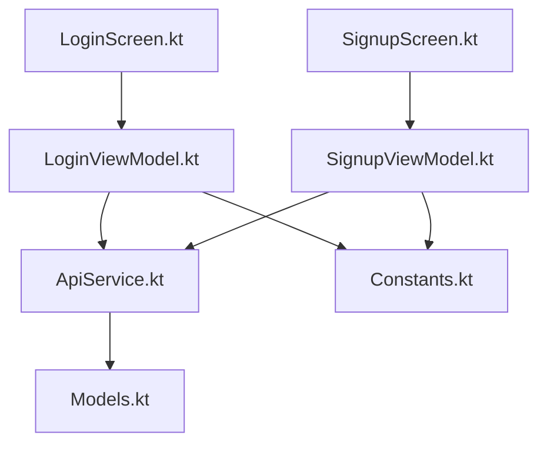
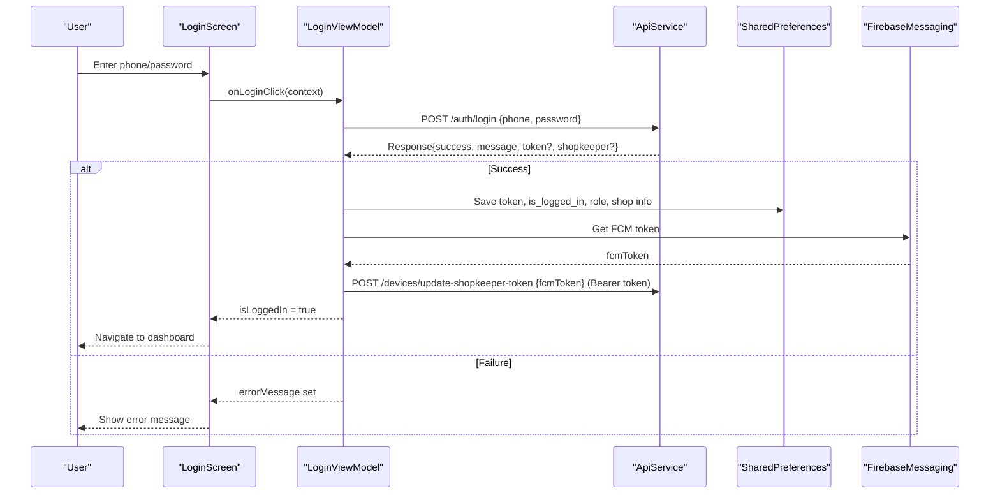
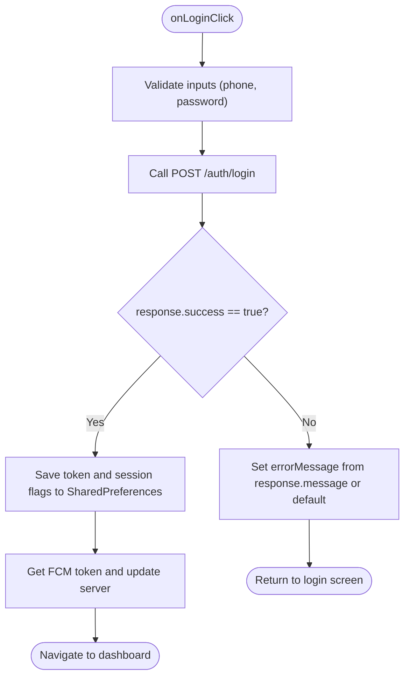
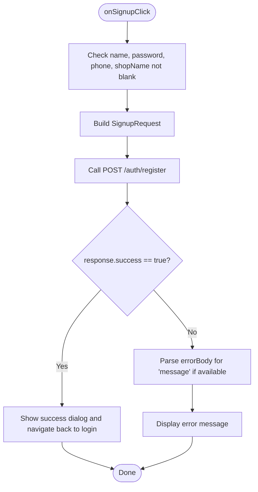
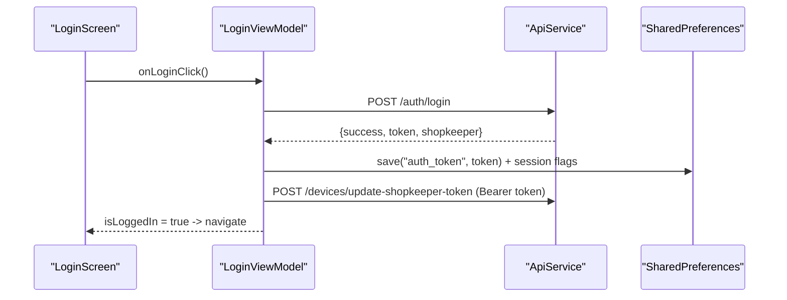
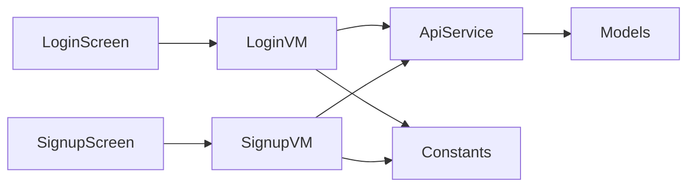

# Authentication Endpoints

<cite>
**Referenced Files in This Document**
- [ApiService.kt](file://app/src/main/java/com/pksafe/lock/manager/data/ApiService.kt)
- [Models.kt](file://app/src/main/java/com/pksafe/lock/manager/data/Models.kt)
- [LoginViewModel.kt](file://app/src/main/java/com/pksafe/lock/manager/ui/login/LoginViewModel.kt)
- [SignupViewModel.kt](file://app/src/main/java/com/pksafe/lock/manager/ui/login/SignupViewModel.kt)
- [LoginScreen.kt](file://app/src/main/java/com/pksafe/lock/manager/ui/login/LoginScreen.kt)
- [SignupScreen.kt](file://app/src/main/java/com/pksafe/lock/manager/ui/login/SignupScreen.kt)
- [Constants.kt](file://app/src/main/java/com/pksafe/lock/manager/util/Constants.kt)
</cite>

## Table of Contents
1. [Introduction](#introduction)
2. [Project Structure](#project-structure)
3. [Core Components](#core-components)
4. [Architecture Overview](#architecture-overview)
5. [Detailed Component Analysis](#detailed-component-analysis)
6. [Dependency Analysis](#dependency-analysis)
7. [Performance Considerations](#performance-considerations)
8. [Troubleshooting Guide](#troubleshooting-guide)
9. [Conclusion](#conclusion)

## Introduction
This document describes PK Locker’s authentication endpoints for shopkeeper account management, focusing on:
- POST /auth/login for user authentication
- POST /auth/register for new shopkeeper account creation
- Request/response schemas, error handling, and token storage in SharedPreferences
- Automatic FCM token update after login
- Security considerations based on the client implementation

The documentation is derived from the Android app code that calls the backend API.

## Project Structure
Authentication-related code is organized into:
- Data layer: Retrofit interface and data models for requests/responses
- UI layer: Compose screens for login and signup
- ViewModels: Business logic for calling APIs and persisting tokens
- Configuration: Base URL for the API server

**Diagram sources**
- [LoginScreen.kt:40-170](file://app/src/main/java/com/pksafe/lock/manager/ui/login/LoginScreen.kt#L40-L170)
- [LoginViewModel.kt:15-88](file://app/src/main/java/com/pksafe/lock/manager/ui/login/LoginViewModel.kt#L15-L88)
- [SignupScreen.kt:28-188](file://app/src/main/java/com/pksafe/lock/manager/ui/login/SignupScreen.kt#L28-L188)
- [SignupViewModel.kt:14-76](file://app/src/main/java/com/pksafe/lock/manager/ui/login/SignupViewModel.kt#L14-L76)
- [ApiService.kt:11-17](file://app/src/main/java/com/pksafe/lock/manager/data/ApiService.kt#L11-L17)
- [Models.kt:8-20](file://app/src/main/java/com/pksafe/lock/manager/data/Models.kt#L8-L20)
- [Constants.kt:3-10](file://app/src/main/java/com/pksafe/lock/manager/util/Constants.kt#L3-L10)

**Section sources**
- [ApiService.kt:11-17](file://app/src/main/java/com/pksafe/lock/manager/data/ApiService.kt#L11-L17)
- [Models.kt:8-20](file://app/src/main/java/com/pksafe/lock/manager/data/Models.kt#L8-L20)
- [LoginViewModel.kt:15-88](file://app/src/main/java/com/pksafe/lock/manager/ui/login/LoginViewModel.kt#L15-L88)
- [SignupViewModel.kt:14-76](file://app/src/main/java/com/pksafe/lock/manager/ui/login/SignupViewModel.kt#L14-L76)
- [LoginScreen.kt:40-170](file://app/src/main/java/com/pksafe/lock/manager/ui/login/LoginScreen.kt#L40-L170)
- [SignupScreen.kt:28-188](file://app/src/main/java/com/pksafe/lock/manager/ui/login/SignupScreen.kt#L28-L188)
- [Constants.kt:3-10](file://app/src/main/java/com/pksafe/lock/manager/util/Constants.kt#L3-L10)

## Core Components
- API endpoints:
  - POST /auth/login: authenticates a shopkeeper with phone and password
  - POST /auth/register: creates a new shopkeeper account
- Data models:
  - LoginRequest: phone, password
  - LoginResponse: success flag, message, optional JWT token, optional shopkeeper object
  - SignupRequest: name, password, phone, shopName, role (default "shopkeeper"), optional referredByPhone
  - SignupResponse: success flag, message, optional shopkeeper object
- Persistence:
  - After successful login, the app stores the auth token and user/session flags in SharedPreferences under key "PKLockerPrefs"
  - The stored token is later used as Authorization header for protected endpoints

**Section sources**
- [ApiService.kt:11-17](file://app/src/main/java/com/pksafe/lock/manager/data/ApiService.kt#L11-L17)
- [Models.kt:8-20](file://app/src/main/java/com/pksafe/lock/manager/data/Models.kt#L8-L20)
- [LoginViewModel.kt:40-59](file://app/src/main/java/com/pksafe/lock/manager/ui/login/LoginViewModel.kt#L40-L59)

## Architecture Overview
The authentication flow uses Retrofit to call the backend API, processes responses in ViewModels, and persists session state locally.

**Diagram sources**
- [LoginViewModel.kt:30-86](file://app/src/main/java/com/pksafe/lock/manager/ui/login/LoginViewModel.kt#L30-L86)
- [ApiService.kt:11-17](file://app/src/main/java/com/pksafe/lock/manager/data/ApiService.kt#L11-L17)
- [Models.kt:8-20](file://app/src/main/java/com/pksafe/lock/manager/data/Models.kt#L8-L20)

## Detailed Component Analysis

### POST /auth/login
- Purpose: Authenticate a shopkeeper using phone number and password
- Request body schema:
  - phone: string
  - password: string
- Response format:
  - success: boolean
  - message: string
  - token: string (JWT; present on success)
  - shopkeeper: object with fields like id, name, phone, shopName, role
- Error handling:
  - If response is not successful or success flag is false, the ViewModel sets an error message
  - Connection errors are caught and surfaced to the UI
- Token storage:
  - On success, the token is saved to SharedPreferences under key "auth_token"
  - Additional session flags are stored: is_logged_in, is_admin (based on role), is_customer, is_locked, settings_blocked, auto_lock_enabled
  - Shop details (shop_name, shop_phone) are also persisted
- Post-login actions:
  - Retrieves the device’s FCM token and updates it via POST /devices/update-shopkeeper-token with Authorization header "Bearer <token>"

**Diagram sources**
- [LoginViewModel.kt:30-86](file://app/src/main/java/com/pksafe/lock/manager/ui/login/LoginViewModel.kt#L30-L86)

**Section sources**
- [ApiService.kt:11-17](file://app/src/main/java/com/pksafe/lock/manager/data/ApiService.kt#L11-L17)
- [Models.kt:8-20](file://app/src/main/java/com/pksafe/lock/manager/data/Models.kt#L8-L20)
- [LoginViewModel.kt:30-86](file://app/src/main/java/com/pksafe/lock/manager/ui/login/LoginViewModel.kt#L30-L86)

### POST /auth/register
- Purpose: Create a new shopkeeper account
- Required fields:
  - name: string
  - password: string
  - phone: string
  - shopName: string
  - role: string (defaults to "shopkeeper")
  - referredByPhone: string (optional)
- Response format:
  - success: boolean
  - message: string
  - shopkeeper: object (optional)
- Validation and error handling:
  - Client-side validation ensures all required fields are non-blank before sending
  - Server errors are parsed when possible to extract a message; otherwise generic messages are shown
  - Network exceptions are caught and displayed to the user

**Diagram sources**
- [SignupViewModel.kt:32-74](file://app/src/main/java/com/pksafe/lock/manager/ui/login/SignupViewModel.kt#L32-L74)

**Section sources**
- [ApiService.kt:11-17](file://app/src/main/java/com/pksafe/lock/manager/data/ApiService.kt#L11-L17)
- [Models.kt:8-20](file://app/src/main/java/com/pksafe/lock/manager/data/Models.kt#L8-L20)
- [SignupViewModel.kt:32-74](file://app/src/main/java/com/pksafe/lock/manager/ui/login/SignupViewModel.kt#L32-L74)

### Authentication Flow Examples
- Login sequence:
  - User enters phone and password in LoginScreen
  - LoginViewModel validates input and calls POST /auth/login
  - On success, token and session flags are saved to SharedPreferences
  - App retrieves FCM token and updates server with Authorization header
  - UI navigates to dashboard
- Token storage:
  - Stored in SharedPreferences under key "auth_token"
  - Other keys include is_logged_in, is_admin, is_customer, is_locked, settings_blocked, auto_lock_enabled, shop_name, shop_phone
- Automatic token refresh:
  - The client does not implement automatic JWT refresh in the login flow
  - It only updates the FCM token post-login
  - Protected endpoints require Authorization header with Bearer token

**Diagram sources**
- [LoginViewModel.kt:30-86](file://app/src/main/java/com/pksafe/lock/manager/ui/login/LoginViewModel.kt#L30-L86)
- [ApiService.kt:11-17](file://app/src/main/java/com/pksafe/lock/manager/data/ApiService.kt#L11-L17)

**Section sources**
- [LoginViewModel.kt:30-86](file://app/src/main/java/com/pksafe/lock/manager/ui/login/LoginViewModel.kt#L30-L86)
- [ApiService.kt:11-17](file://app/src/main/java/com/pksafe/lock/manager/data/ApiService.kt#L11-L17)

### Security Considerations
- Password hashing:
  - The client sends passwords in plaintext to the server; ensure the backend enforces secure hashing (e.g., bcrypt/argon2) and TLS for transport
- Rate limiting:
  - No client-side rate limiting is implemented for login attempts; consider adding throttling or exponential backoff to mitigate brute-force attempts
- Session management:
  - Tokens are stored in SharedPreferences; protect this storage by ensuring the app targets modern Android security practices and avoids logging sensitive values
  - Implement token expiration handling and re-authentication flows on the client side
  - Use HTTPS for all API calls (BASE_URL points to a production endpoint)
- Authorization headers:
  - Protected endpoints require Authorization header with Bearer token; ensure tokens are attached consistently

[No sources needed since this section provides general guidance]

## Dependency Analysis
- UI components depend on ViewModels for business logic
- ViewModels depend on ApiService for network calls
- ApiService depends on data Models for request/response mapping
- All network calls use BASE_URL configured in Constants

**Diagram sources**
- [LoginScreen.kt:40-170](file://app/src/main/java/com/pksafe/lock/manager/ui/login/LoginScreen.kt#L40-L170)
- [SignupScreen.kt:28-188](file://app/src/main/java/com/pksafe/lock/manager/ui/login/SignupScreen.kt#L28-L188)
- [LoginViewModel.kt:15-88](file://app/src/main/java/com/pksafe/lock/manager/ui/login/LoginViewModel.kt#L15-L88)
- [SignupViewModel.kt:14-76](file://app/src/main/java/com/pksafe/lock/manager/ui/login/SignupViewModel.kt#L14-L76)
- [ApiService.kt:11-17](file://app/src/main/java/com/pksafe/lock/manager/data/ApiService.kt#L11-L17)
- [Models.kt:8-20](file://app/src/main/java/com/pksafe/lock/manager/data/Models.kt#L8-L20)
- [Constants.kt:3-10](file://app/src/main/java/com/pksafe/lock/manager/util/Constants.kt#L3-L10)

**Section sources**
- [ApiService.kt:11-17](file://app/src/main/java/com/pksafe/lock/manager/data/ApiService.kt#L11-L17)
- [Models.kt:8-20](file://app/src/main/java/com/pksafe/lock/manager/data/Models.kt#L8-L20)
- [LoginViewModel.kt:15-88](file://app/src/main/java/com/pksafe/lock/manager/ui/login/LoginViewModel.kt#L15-L88)
- [SignupViewModel.kt:14-76](file://app/src/main/java/com/pksafe/lock/manager/ui/login/SignupViewModel.kt#L14-L76)
- [LoginScreen.kt:40-170](file://app/src/main/java/com/pksafe/lock/manager/ui/login/LoginScreen.kt#L40-L170)
- [SignupScreen.kt:28-188](file://app/src/main/java/com/pksafe/lock/manager/ui/login/SignupScreen.kt#L28-L188)
- [Constants.kt:3-10](file://app/src/main/java/com/pksafe/lock/manager/util/Constants.kt#L3-L10)

## Performance Considerations
- Network calls are suspended functions; ensure they run off the main thread (as done in ViewModels)
- Avoid repeated Retrofit instances; reuse a single instance per module or process
- Minimize SharedPreferences writes; batch updates where possible
- Consider caching strategies for frequent reads (e.g., device stats) to reduce network load

[No sources needed since this section provides general guidance]

## Troubleshooting Guide
- Common issues:
  - Invalid credentials: The login flow sets an error message from the server response or defaults to a generic message
  - Connection failures: Exceptions are caught and surfaced as connection error messages
  - Signup failures: Errors are parsed when possible; otherwise generic messages are shown
- Debugging tips:
  - Verify BASE_URL configuration
  - Check SharedPreferences keys after login to ensure token and flags are stored correctly
  - Confirm Authorization header usage for protected endpoints

**Section sources**
- [LoginViewModel.kt:77-86](file://app/src/main/java/com/pksafe/lock/manager/ui/login/LoginViewModel.kt#L77-L86)
- [SignupViewModel.kt:54-70](file://app/src/main/java/com/pksafe/lock/manager/ui/login/SignupViewModel.kt#L54-L70)
- [Constants.kt:3-10](file://app/src/main/java/com/pksafe/lock/manager/util/Constants.kt#L3-L10)

## Conclusion
PK Locker’s authentication endpoints for shopkeepers are implemented with clear request/response models and straightforward client-side flows:
- POST /auth/login authenticates users and persists tokens and session state
- POST /auth/register creates accounts with required fields validated on the client
- Tokens are stored in SharedPreferences and used for subsequent authenticated requests
- Security best practices should be enforced on the server side (password hashing, rate limiting, HTTPS) and complemented by client-side safeguards (input validation, error handling)

[No sources needed since this section summarizes without analyzing specific files]