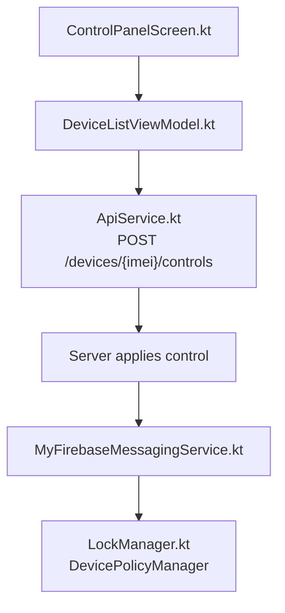
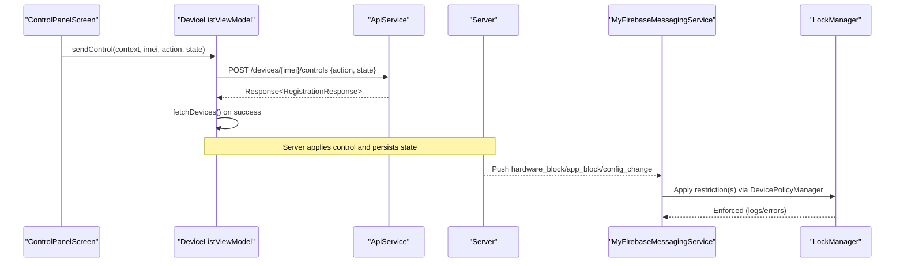
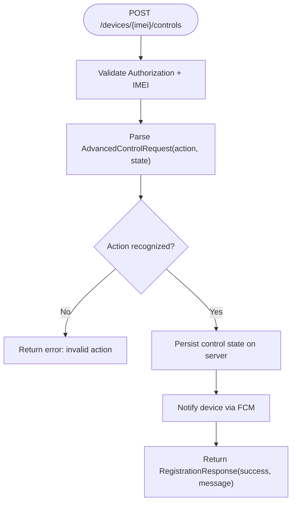
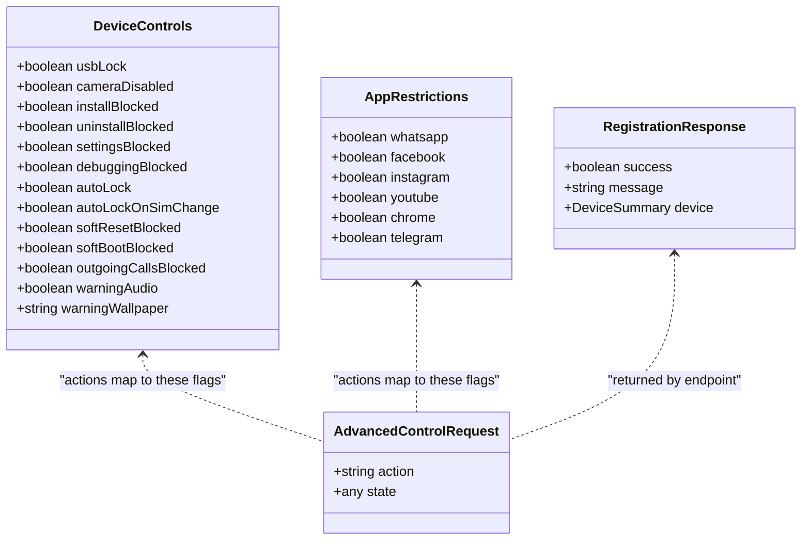
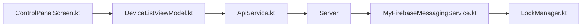

# Advanced Hardware Controls

<cite>
**Referenced Files in This Document**
- [ApiService.kt](file://app/src/main/java/com/pksafe/lock/manager/data/ApiService.kt)
- [Models.kt](file://app/src/main/java/com/pksafe/lock/manager/data/Models.kt)
- [DeviceListViewModel.kt](file://app/src/main/java/com/pksafe/lock/manager/ui/devices/DeviceListViewModel.kt)
- [ControlPanelScreen.kt](file://app/src/main/java/com/pksafe/lock/manager/ui/devices/ControlPanelScreen.kt)
- [LockManager.kt](file://app/src/main/java/com/pksafe/lock/manager/util/LockManager.kt)
- [MyFirebaseMessagingService.kt](file://app/src/main/java/com/pksafe/lock/manager/service/MyFirebaseMessagingService.kt)
</cite>

## Table of Contents
1. [Introduction](#introduction)
2. [Project Structure](#project-structure)
3. [Core Components](#core-components)
4. [Architecture Overview](#architecture-overview)
5. [Detailed Component Analysis](#detailed-component-analysis)
6. [Dependency Analysis](#dependency-analysis)
7. [Performance Considerations](#performance-considerations)
8. [Troubleshooting Guide](#troubleshooting-guide)
9. [Conclusion](#conclusion)
10. [Appendices](#appendices)

## Introduction
This document explains PK Locker’s advanced device control operations exposed via the POST /devices/{imei}/controls endpoint. It covers the request schema, supported control actions, response structure, and practical use cases such as disabling camera for security, preventing factory resets during EMI payments, and restricting USB debugging to prevent unauthorized access.

## Project Structure
The advanced controls flow spans UI, ViewModel, API layer, and device enforcement:
- UI triggers a control action (e.g., toggle camera block).
- ViewModel constructs an AdvancedControlRequest and calls the API.
- The server applies the requested control and returns a standardized response.
- Device-side services enforce restrictions using Android DevicePolicyManager and related APIs.

**Diagram sources**
- [ControlPanelScreen.kt:315-336](file://app/src/main/java/com/pksafe/lock/manager/ui/devices/ControlPanelScreen.kt#L315-L336)
- [DeviceListViewModel.kt:173-195](file://app/src/main/java/com/pksafe/lock/manager/ui/devices/DeviceListViewModel.kt#L173-L195)
- [ApiService.kt:58-63](file://app/src/main/java/com/pksafe/lock/manager/data/ApiService.kt#L58-L63)
- [MyFirebaseMessagingService.kt:69-119](file://app/src/main/java/com/pksafe/lock/manager/service/MyFirebaseMessagingService.kt#L69-L119)
- [LockManager.kt:204-261](file://app/src/main/java/com/pksafe/lock/manager/util/LockManager.kt#L204-L261)

**Section sources**
- [ApiService.kt:58-63](file://app/src/main/java/com/pksafe/lock/manager/data/ApiService.kt#L58-L63)
- [DeviceListViewModel.kt:173-195](file://app/src/main/java/com/pksafe/lock/manager/ui/devices/DeviceListViewModel.kt#L173-L195)
- [ControlPanelScreen.kt:315-336](file://app/src/main/java/com/pksafe/lock/manager/ui/devices/ControlPanelScreen.kt#L315-L336)

## Core Components
- AdvancedControlRequest: Minimal payload with action and state fields used to toggle or set specific controls.
- DeviceControls: Represents current device control flags returned by the server (e.g., usbLock, cameraDisabled, installBlocked, settingsBlocked, debuggingBlocked, autoLockOnSimChange, softResetBlocked, softBootBlocked, outgoingCallsBlocked).
- AppRestrictions: Per-app toggles (whatsapp, facebook, instagram, youtube, chrome, telegram).
- RegistrationResponse: Standardized success/failure envelope returned by the endpoint.

Key capabilities mapped from code:
- Camera enable/disable
- USB data transfer disable (USB Terminal Block)
- App install/uninstall blocking
- System settings lock
- Debugging features block (ADB/debugging)
- Auto-lock on SIM change
- Factory reset prevention (soft reset blocked)
- Safe boot prevention (soft boot blocked)
- Outgoing call blocking
- Warning audio/wallpaper

**Section sources**
- [Models.kt:78-101](file://app/src/main/java/com/pksafe/lock/manager/data/Models.kt#L78-L101)
- [Models.kt:216-219](file://app/src/main/java/com/pksafe/lock/manager/data/Models.kt#L216-L219)
- [ApiService.kt:58-63](file://app/src/main/java/com/pksafe/lock/manager/data/ApiService.kt#L58-L63)

## Architecture Overview
The endpoint is invoked by the dashboard UI through a ViewModel that serializes an AdvancedControlRequest. The server processes the request and pushes device-side enforcement via Firebase Cloud Messaging. On-device, LockManager uses Android DevicePolicyManager to apply restrictions.

**Diagram sources**
- [ControlPanelScreen.kt:315-336](file://app/src/main/java/com/pksafe/lock/manager/ui/devices/ControlPanelScreen.kt#L315-L336)
- [DeviceListViewModel.kt:173-195](file://app/src/main/java/com/pksafe/lock/manager/ui/devices/DeviceListViewModel.kt#L173-L195)
- [ApiService.kt:58-63](file://app/src/main/java/com/pksafe/lock/manager/data/ApiService.kt#L58-L63)
- [MyFirebaseMessagingService.kt:69-119](file://app/src/main/java/com/pksafe/lock/manager/service/MyFirebaseMessagingService.kt#L69-L119)
- [LockManager.kt:204-261](file://app/src/main/java/com/pksafe/lock/manager/util/LockManager.kt#L204-L261)

## Detailed Component Analysis

### Endpoint: POST /devices/{imei}/controls
- Purpose: Apply advanced device controls to a registered device identified by IMEI.
- Authentication: Authorization header required (Bearer token).
- Request body: AdvancedControlRequest with:
  - action: string identifying the control to toggle/set (e.g., "cameraDisabled", "usbLock", "installBlocked", "settingsBlocked", "debuggingBlocked", "autoLockOnSimChange", "softResetBlocked", "softBootBlocked", "outgoingCallsBlocked", or app-specific keys like "instagram", "whatsapp").
  - state: boolean value indicating enable/disable for the given action.
- Response: RegistrationResponse with success flag, message, and optional device summary.

**Diagram sources**
- [ApiService.kt:58-63](file://app/src/main/java/com/pksafe/lock/manager/data/ApiService.kt#L58-L63)
- [Models.kt:216-219](file://app/src/main/java/com/pksafe/lock/manager/data/Models.kt#L216-L219)

**Section sources**
- [ApiService.kt:58-63](file://app/src/main/java/com/pksafe/lock/manager/data/ApiService.kt#L58-L63)
- [Models.kt:216-219](file://app/src/main/java/com/pksafe/lock/manager/data/Models.kt#L216-L219)

### Control Actions and Effects
Supported actions and their effects are derived from the UI and device enforcement logic:

- cameraDisabled: Enables/disables camera access via DevicePolicyManager.setCameraDisabled.
- usbLock: Disables USB file transfer via DISALLOW_USB_FILE_TRANSFER.
- installBlocked: Blocks app installation via DISALLOW_INSTALL_UNKNOWN_SOURCES and DISALLOW_INSTALL_APPS.
- uninstallBlocked: Blocks app uninstallation via DISALLOW_UNINSTALL_APPS.
- settingsBlocked: Persists a setting to restrict system settings changes; enforced by AntiUninstallService and other guards.
- debuggingBlocked: Blocks ADB/debugging via DISALLOW_DEBUGGING_FEATURES.
- autoLockOnSimChange: Toggles automatic locking when SIM changes.
- softResetBlocked: Prevents factory reset via DISALLOW_FACTORY_RESET.
- softBootBlocked: Prevents safe boot via DISALLOW_SAFE_BOOT.
- outgoingCallsBlocked: Blocks outgoing calls via DISALLOW_OUTGOING_CALLS.
- App-specific blocks: whatsapp, facebook, instagram, youtube, chrome, telegram — hide apps via setApplicationHidden or fallback blocking.

**Diagram sources**
- [Models.kt:78-101](file://app/src/main/java/com/pksafe/lock/manager/data/Models.kt#L78-L101)
- [Models.kt:216-219](file://app/src/main/java/com/pksafe/lock/manager/data/Models.kt#L216-L219)

**Section sources**
- [Models.kt:78-101](file://app/src/main/java/com/pksafe/lock/manager/data/Models.kt#L78-L101)
- [LockManager.kt:204-261](file://app/src/main/java/com/pksafe/lock/manager/util/LockManager.kt#L204-L261)
- [MyFirebaseMessagingService.kt:69-119](file://app/src/main/java/com/pksafe/lock/manager/service/MyFirebaseMessagingService.kt#L69-L119)

### Request Payload Examples
Below are example payloads demonstrating different control combinations. Replace placeholders with actual values.

- Disable camera for security:
  - action: "cameraDisabled"
  - state: true

- Enable USB terminal block to prevent PC data access:
  - action: "usbLock"
  - state: true

- Prevent factory reset during EMI payments:
  - action: "softResetBlocked"
  - state: true

- Restrict USB debugging to prevent unauthorized access:
  - action: "debuggingBlocked"
  - state: true

- Block Instagram usage:
  - action: "instagram"
  - state: true

- Block WhatsApp system-wide:
  - action: "whatsapp"
  - state: true

- Enable auto-lock on SIM change:
  - action: "autoLockOnSimChange"
  - state: true

- Block outgoing calls:
  - action: "outgoingCallsBlocked"
  - state: true

- Block app installation:
  - action: "installBlocked"
  - state: true

- Block app uninstallation:
  - action: "uninstallBlocked"
  - state: true

- Lock system settings:
  - action: "settingsBlocked"
  - state: true

- Prevent safe boot:
  - action: "softBootBlocked"
  - state: true

Note: Each action toggles the corresponding control flag on the device. Combine multiple actions in separate requests to achieve complex control sets.

**Section sources**
- [ControlPanelScreen.kt:315-336](file://app/src/main/java/com/pksafe/lock/manager/ui/devices/ControlPanelScreen.kt#L315-L336)
- [DeviceListViewModel.kt:173-195](file://app/src/main/java/com/pksafe/lock/manager/ui/devices/DeviceListViewModel.kt#L173-L195)
- [Models.kt:78-101](file://app/src/main/java/com/pksafe/lock/manager/data/Models.kt#L78-L101)

### Response Structures and Status Codes
- Success: HTTP 2xx with RegistrationResponse containing success: true and a descriptive message.
- Failure: Non-2xx status codes or success: false with a message indicating the failure reason (e.g., invalid action, authentication error, device not reachable).

After a successful control application, the client refreshes device state by fetching the updated device list to reflect new control flags.

**Section sources**
- [DeviceListViewModel.kt:173-195](file://app/src/main/java/com/pksafe/lock/manager/ui/devices/DeviceListViewModel.kt#L173-L195)
- [Models.kt:205-215](file://app/src/main/java/com/pksafe/lock/manager/data/Models.kt#L205-L215)

### Practical Use Cases
- Disable camera for security:
  - Send action "cameraDisabled" with state true.
  - Effect: Camera access disabled via DevicePolicyManager until re-enabled.

- Prevent factory resets during EMI payments:
  - Send action "softResetBlocked" with state true.
  - Effect: Factory reset blocked via DISALLOW_FACTORY_RESET until re-enabled.

- Restrict USB debugging to prevent unauthorized access:
  - Send action "debuggingBlocked" with state true.
  - Effect: ADB/debugging features blocked via DISALLOW_DEBUGGING_FEATURES until re-enabled.

- Block specific apps (e.g., Instagram):
  - Send action "instagram" with state true.
  - Effect: App hidden/blocked via setApplicationHidden or fallback mechanisms.

- Auto-lock on SIM change:
  - Send action "autoLockOnSimChange" with state true.
  - Effect: Device automatically locks when SIM changes.

**Section sources**
- [LockManager.kt:204-261](file://app/src/main/java/com/pksafe/lock/manager/util/LockManager.kt#L204-L261)
- [MyFirebaseMessagingService.kt:69-119](file://app/src/main/java/com/pksafe/lock/manager/service/MyFirebaseMessagingService.kt#L69-L119)

## Dependency Analysis
- UI depends on ViewModel to construct and send control requests.
- ViewModel depends on ApiService to serialize AdvancedControlRequest and handle responses.
- Server enforces controls and notifies devices via FCM.
- MyFirebaseMessagingService maps incoming messages to LockManager methods.
- LockManager uses Android DevicePolicyManager to apply restrictions.

**Diagram sources**
- [ControlPanelScreen.kt:315-336](file://app/src/main/java/com/pksafe/lock/manager/ui/devices/ControlPanelScreen.kt#L315-L336)
- [DeviceListViewModel.kt:173-195](file://app/src/main/java/com/pksafe/lock/manager/ui/devices/DeviceListViewModel.kt#L173-L195)
- [ApiService.kt:58-63](file://app/src/main/java/com/pksafe/lock/manager/data/ApiService.kt#L58-L63)
- [MyFirebaseMessagingService.kt:69-119](file://app/src/main/java/com/pksafe/lock/manager/service/MyFirebaseMessagingService.kt#L69-L119)
- [LockManager.kt:204-261](file://app/src/main/java/com/pksafe/lock/manager/util/LockManager.kt#L204-L261)

**Section sources**
- [ApiService.kt:58-63](file://app/src/main/java/com/pksafe/lock/manager/data/ApiService.kt#L58-L63)
- [DeviceListViewModel.kt:173-195](file://app/src/main/java/com/pksafe/lock/manager/ui/devices/DeviceListViewModel.kt#L173-L195)
- [MyFirebaseMessagingService.kt:69-119](file://app/src/main/java/com/pksafe/lock/manager/service/MyFirebaseMessagingService.kt#L69-L119)
- [LockManager.kt:204-261](file://app/src/main/java/com/pksafe/lock/manager/util/LockManager.kt#L204-L261)

## Performance Considerations
- Batch control updates: Issue multiple control requests only when necessary; prefer minimal round-trips.
- State synchronization: After successful control application, always refresh device state to avoid UI drift.
- Device permissions: Some controls require Device Owner privileges; ensure prerequisites are met to avoid retries and delays.
- Network resilience: Handle timeouts and retries gracefully; log failures for diagnostics.

[No sources needed since this section provides general guidance]

## Troubleshooting Guide
Common issues and resolutions:
- Invalid action: Ensure the action matches supported control keys (e.g., cameraDisabled, usbLock, installBlocked, settingsBlocked, debuggingBlocked, autoLockOnSimChange, softResetBlocked, softBootBlocked, outgoingCallsBlocked, or app keys like instagram, whatsapp).
- Missing permissions: Controls like USB, factory reset, and safe boot require Device Owner privileges; verify admin activation and device owner status.
- FCM delivery: If device does not respond, check connectivity and FCM registration; server may retry or queue notifications.
- Logs: Inspect logs for errors in device enforcement (e.g., USB block error, camera block error) to identify permission or OS version constraints.

**Section sources**
- [LockManager.kt:204-261](file://app/src/main/java/com/pksafe/lock/manager/util/LockManager.kt#L204-L261)
- [MyFirebaseMessagingService.kt:69-119](file://app/src/main/java/com/pksafe/lock/manager/service/MyFirebaseMessagingService.kt#L69-L119)

## Conclusion
PK Locker’s advanced device controls provide fine-grained management of critical device features via a simple, extensible request schema. By leveraging Android DevicePolicyManager and FCM, the system can enforce security policies such as camera blocking, USB debugging restrictions, and factory reset prevention—essential for protecting devices during EMI payments and other high-risk scenarios.

[No sources needed since this section summarizes without analyzing specific files]

## Appendices

### Supported Control Actions Summary
- cameraDisabled: Toggle camera access.
- usbLock: Toggle USB file transfer.
- installBlocked: Toggle app installation.
- uninstallBlocked: Toggle app uninstallation.
- settingsBlocked: Toggle system settings changes.
- debuggingBlocked: Toggle ADB/debugging features.
- autoLockOnSimChange: Toggle auto-lock on SIM change.
- softResetBlocked: Toggle factory reset prevention.
- softBootBlocked: Toggle safe boot prevention.
- outgoingCallsBlocked: Toggle outgoing call blocking.
- App keys: whatsapp, facebook, instagram, youtube, chrome, telegram.

**Section sources**
- [Models.kt:78-101](file://app/src/main/java/com/pksafe/lock/manager/data/Models.kt#L78-L101)
- [ControlPanelScreen.kt:315-336](file://app/src/main/java/com/pksafe/lock/manager/ui/devices/ControlPanelScreen.kt#L315-L336)