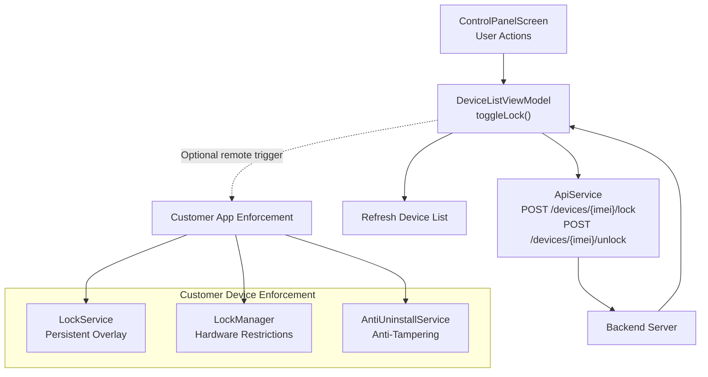
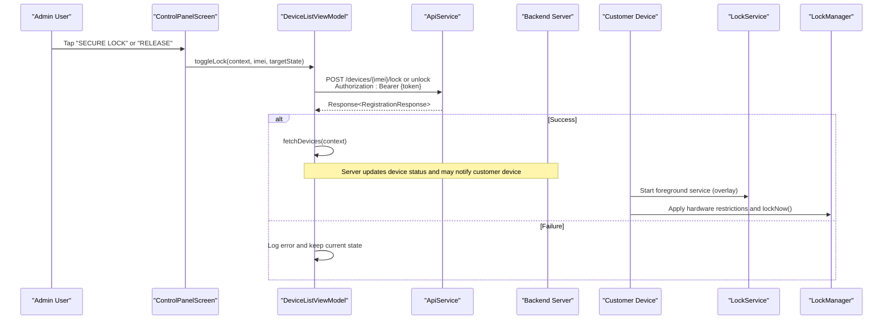
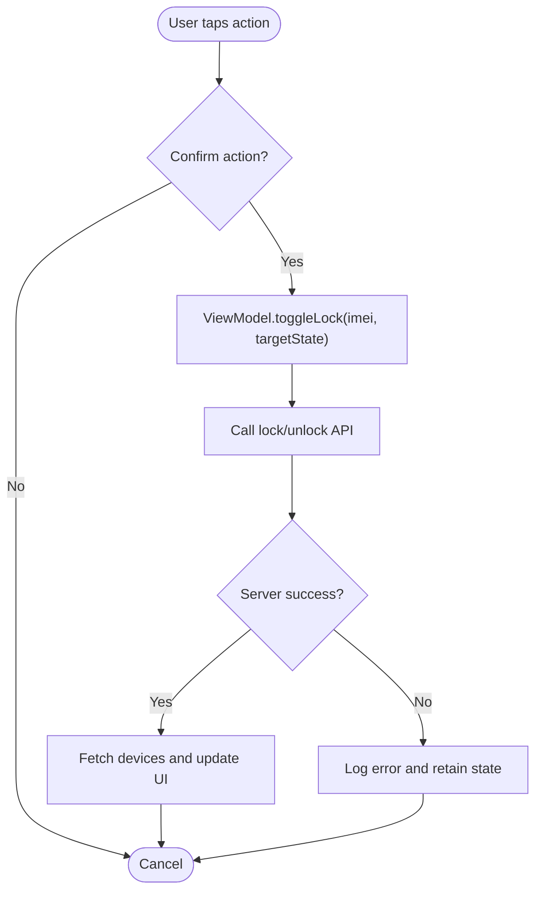
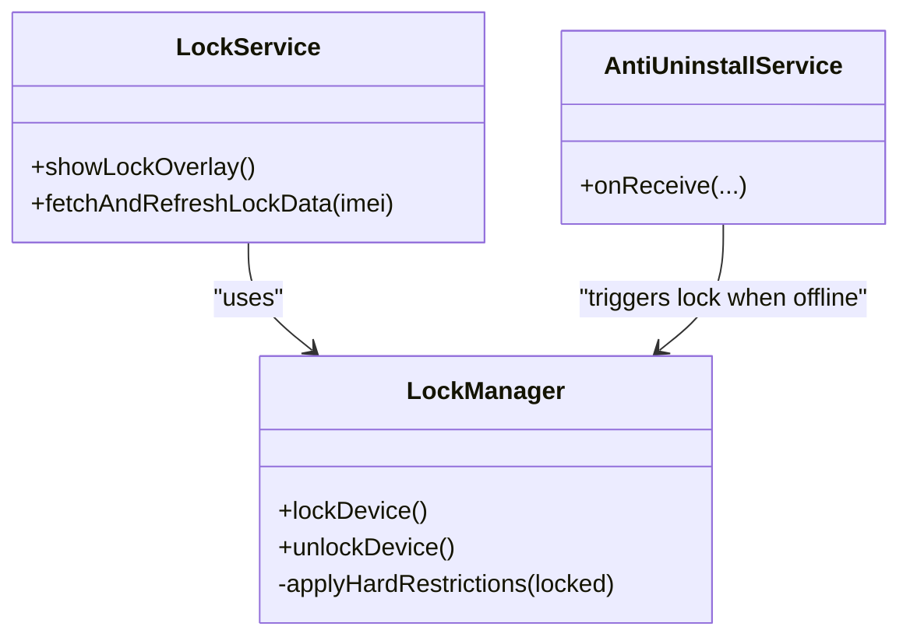
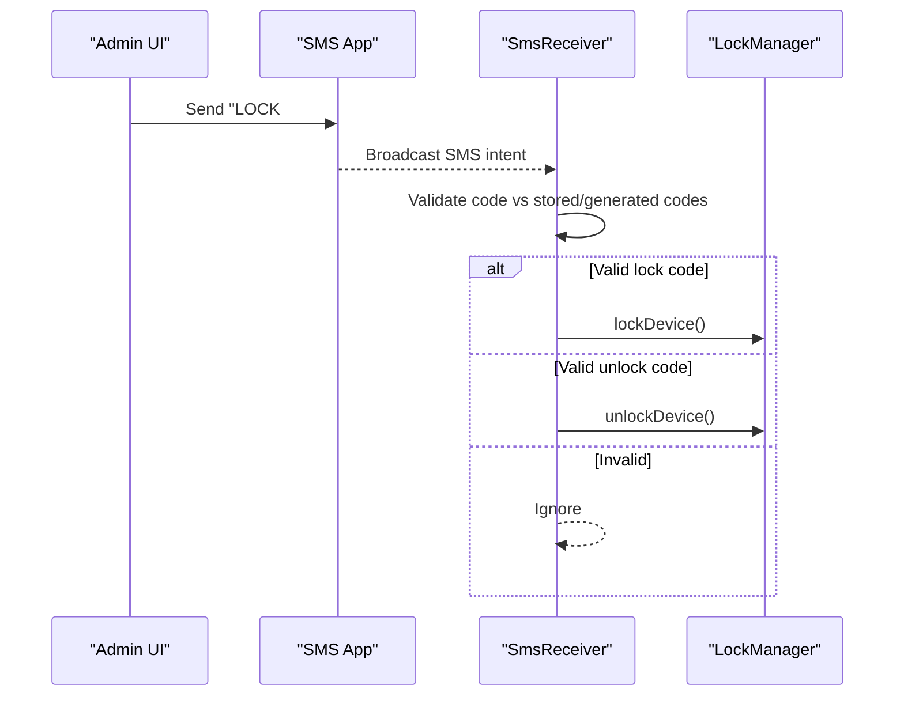
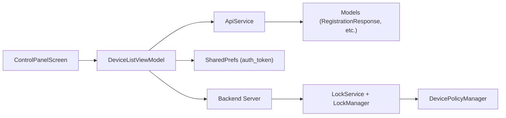

# Basic Lock/Unlock Operations

<cite>
**Referenced Files in This Document**
- [ApiService.kt](file://app/src/main/java/com/pksafe/lock/manager/data/ApiService.kt)
- [Models.kt](file://app/src/main/java/com/pksafe/lock/manager/data/Models.kt)
- [DeviceListViewModel.kt](file://app/src/main/java/com/pksafe/lock/manager/ui/devices/DeviceListViewModel.kt)
- [ControlPanelScreen.kt](file://app/src/main/java/com/pksafe/lock/manager/ui/devices/ControlPanelScreen.kt)
- [LockService.kt](file://app/src/main/java/com/pksafe/lock/manager/service/LockService.kt)
- [LockManager.kt](file://app/src/main/java/com/pksafe/lock/manager/util/LockManager.kt)
- [AntiUninstallService.kt](file://app/src/main/java/com/pksafe/lock/manager/service/AntiUninstallService.kt)
- [SmsReceiver.kt](file://app/src/main/java/com/pksafe/lock/manager/receiver/SmsReceiver.kt)
</cite>

## Table of Contents
1. Introduction
2. Project Structure
3. Core Components
4. Architecture Overview
5. Detailed Component Analysis
6. Dependency Analysis
7. Performance Considerations
8. Troubleshooting Guide
9. Conclusion

## Introduction
This document explains PK Locker’s basic device lock and unlock operations as implemented in the Android application. It focuses on:
- POST /devices/{imei}/lock: initiating immediate device lockdown, including persistent overlay activation, hardware restriction enforcement, and anti-tampering measures.
- POST /devices/{imei}/unlock: removing all restrictions and restoring full device functionality.

It also covers request/response examples (IMEI parameter usage, authentication headers, response structures), error handling for invalid IMEI formats, unauthorized access attempts, and device offline scenarios, with implementation references from the actual codebase.

## Project Structure
The lock/unlock flow spans UI, ViewModel, API layer, and system-level enforcement components:
- UI triggers lock/unlock actions via a confirmation dialog and delegates to the ViewModel.
- The ViewModel calls Retrofit endpoints defined in ApiService.
- On successful server-side lock, the customer device enforces local restrictions via LockService and LockManager.
- Anti-tampering and auto-lock behaviors are enforced by background services and receivers.

**Diagram sources**
- [ControlPanelScreen.kt:75-98](file://app/src/main/java/com/pksafe/lock/manager/ui/devices/ControlPanelScreen.kt#L75-L98)
- [DeviceListViewModel.kt:143-171](file://app/src/main/java/com/pksafe/lock/manager/ui/devices/DeviceListViewModel.kt#L143-L171)
- [ApiService.kt:46-56](file://app/src/main/java/com/pksafe/lock/manager/data/ApiService.kt#L46-L56)
- [LockService.kt:125-234](file://app/src/main/java/com/pksafe/lock/manager/service/LockService.kt#L125-L234)
- [LockManager.kt:110-148](file://app/src/main/java/com/pksafe/lock/manager/util/LockManager.kt#L110-L148)
- [AntiUninstallService.kt:89-115](file://app/src/main/java/com/pksafe/lock/manager/service/AntiUninstallService.kt#L89-L115)

**Section sources**
- [ControlPanelScreen.kt:75-98](file://app/src/main/java/com/pksafe/lock/manager/ui/devices/ControlPanelScreen.kt#L75-L98)
- [DeviceListViewModel.kt:143-171](file://app/src/main/java/com/pksafe/lock/manager/ui/devices/DeviceListViewModel.kt#L143-L171)
- [ApiService.kt:46-56](file://app/src/main/java/com/pksafe/lock/manager/data/ApiService.kt#L46-L56)

## Core Components
- API Endpoints:
  - POST /devices/{imei}/lock: Requires Authorization header; returns RegistrationResponse.
  - POST /devices/{imei}/unlock: Requires Authorization header; returns RegistrationResponse.
- Request/Response Models:
  - Authorization: Bearer token passed via @Header("Authorization").
  - Path Parameter: imei string identifying the target device.
  - Response: RegistrationResponse(success, message, device).
- UI Flow:
  - Control panel shows “SECURE LOCK” and “RELEASE” buttons with confirmation dialogs.
  - ViewModel toggles lock state and refreshes device list after success.
- Enforcement:
  - LockService provides a persistent overlay and notification.
  - LockManager applies hardware restrictions and locks the screen.
  - AntiUninstallService enforces auto-lock when offline if configured.

**Section sources**
- [ApiService.kt:46-56](file://app/src/main/java/com/pksafe/lock/manager/data/ApiService.kt#L46-L56)
- [Models.kt:205-215](file://app/src/main/java/com/pksafe/lock/manager/data/Models.kt#L205-L215)
- [ControlPanelScreen.kt:178-200](file://app/src/main/java/com/pksafe/lock/manager/ui/devices/ControlPanelScreen.kt#L178-L200)
- [DeviceListViewModel.kt:143-171](file://app/src/main/java/com/pksafe/lock/manager/ui/devices/DeviceListViewModel.kt#L143-L171)
- [LockService.kt:125-234](file://app/src/main/java/com/pksafe/lock/manager/service/LockService.kt#L125-L234)
- [LockManager.kt:110-148](file://app/src/main/java/com/pksafe/lock/manager/util/LockManager.kt#L110-L148)
- [AntiUninstallService.kt:89-115](file://app/src/main/java/com/pksafe/lock/manager/service/AntiUninstallService.kt#L89-L115)

## Architecture Overview
The lock/unlock operation is a coordinated sequence across UI, network, and device enforcement layers.

**Diagram sources**
- [ControlPanelScreen.kt:75-98](file://app/src/main/java/com/pksafe/lock/manager/ui/devices/ControlPanelScreen.kt#L75-L98)
- [DeviceListViewModel.kt:143-171](file://app/src/main/java/com/pksafe/lock/manager/ui/devices/DeviceListViewModel.kt#L143-L171)
- [ApiService.kt:46-56](file://app/src/main/java/com/pksafe/lock/manager/data/ApiService.kt#L46-L56)
- [LockService.kt:125-234](file://app/src/main/java/com/pksafe/lock/manager/service/LockService.kt#L125-L234)
- [LockManager.kt:110-148](file://app/src/main/java/com/pksafe/lock/manager/util/LockManager.kt#L110-L148)

## Detailed Component Analysis

### Endpoint Definitions and Usage
- POST /devices/{imei}/lock
  - Headers: Authorization: Bearer {token}
  - Path: imei (string)
  - Response: RegistrationResponse{success, message, device?}
- POST /devices/{imei}/unlock
  - Headers: Authorization: Bearer {token}
  - Path: imei (string)
  - Response: RegistrationResponse{success, message, device?}

Implementation references:
- Endpoint declarations and signatures: [ApiService.kt:46-56](file://app/src/main/java/com/pksafe/lock/manager/data/ApiService.kt#L46-L56)
- Response model: [Models.kt:205-215](file://app/src/main/java/com/pksafe/lock/manager/data/Models.kt#L205-L215)

Request examples (conceptual):
- Lock: POST /devices/{imei}/lock with Authorization: Bearer <token>, path param imei=<device_imei>
- Unlock: POST /devices/{imei}/unlock with Authorization: Bearer <token>, path param imei=<device_imei>

Response example (conceptual):
- { "success": true, "message": "Device locked", "device": { "id": "...", "imei": "...", "customerName": "...", "smsCodes": {...} } }

**Section sources**
- [ApiService.kt:46-56](file://app/src/main/java/com/pksafe/lock/manager/data/ApiService.kt#L46-L56)
- [Models.kt:205-215](file://app/src/main/java/com/pksafe/lock/manager/data/Models.kt#L205-L215)

### UI Trigger and Confirmation Flow
- Control panel exposes two primary actions:
  - “SECURE LOCK”: initiates lock workflow with confirmation dialog.
  - “RELEASE”: initiates unlock workflow with confirmation dialog.
- On confirm, the ViewModel executes toggleLock which calls the appropriate endpoint based on target state and refreshes the device list upon success.

**Diagram sources**
- [ControlPanelScreen.kt:75-98](file://app/src/main/java/com/pksafe/lock/manager/ui/devices/ControlPanelScreen.kt#L75-L98)
- [DeviceListViewModel.kt:143-171](file://app/src/main/java/com/pksafe/lock/manager/ui/devices/DeviceListViewModel.kt#L143-L171)

**Section sources**
- [ControlPanelScreen.kt:75-98](file://app/src/main/java/com/pksafe/lock/manager/ui/devices/ControlPanelScreen.kt#L75-L98)
- [DeviceListViewModel.kt:143-171](file://app/src/main/java/com/pksafe/lock/manager/ui/devices/DeviceListViewModel.kt#L143-L171)

### Device Enforcement on Lock
When a device is locked (either via server command or locally triggered), the following enforcement occurs:
- Persistent overlay: LockService starts a foreground service and displays an overlay that blocks navigation and requires a security code to dismiss.
- Hardware restrictions: LockManager applies device policy restrictions such as disabling camera, blocking USB file transfer, preventing factory reset, safe mode, ADB/debugging, and more.
- Screen lock: The device is locked immediately after applying restrictions.

**Diagram sources**
- [LockService.kt:125-234](file://app/src/main/java/com/pksafe/lock/manager/service/LockService.kt#L125-L234)
- [LockManager.kt:110-192](file://app/src/main/java/com/pksafe/lock/manager/util/LockManager.kt#L110-L192)
- [AntiUninstallService.kt:89-115](file://app/src/main/java/com/pksafe/lock/manager/service/AntiUninstallService.kt#L89-L115)

**Section sources**
- [LockService.kt:125-234](file://app/src/main/java/com/pksafe/lock/manager/service/LockService.kt#L125-L234)
- [LockManager.kt:110-192](file://app/src/main/java/com/pksafe/lock/manager/util/LockManager.kt#L110-L192)
- [AntiUninstallService.kt:89-115](file://app/src/main/java/com/pksafe/lock/manager/service/AntiUninstallService.kt#L89-L115)

### Offline SMS-Based Lock/Unlock
For scenarios without internet connectivity, the app supports offline SMS commands:
- The UI can prefill SMS messages containing lock/unlock codes derived from device IMEIs and stored preferences.
- SmsReceiver validates incoming SMS against expected codes and triggers local enforcement accordingly.

**Diagram sources**
- [ControlPanelScreen.kt:571-623](file://app/src/main/java/com/pksafe/lock/manager/ui/devices/ControlPanelScreen.kt#L571-L623)
- [SmsReceiver.kt:63-93](file://app/src/main/java/com/pksafe/lock/manager/receiver/SmsReceiver.kt#L63-L93)
- [LockManager.kt:110-148](file://app/src/main/java/com/pksafe/lock/manager/util/LockManager.kt#L110-L148)

**Section sources**
- [ControlPanelScreen.kt:571-623](file://app/src/main/java/com/pksafe/lock/manager/ui/devices/ControlPanelScreen.kt#L571-L623)
- [SmsReceiver.kt:63-93](file://app/src/main/java/com/pksafe/lock/manager/receiver/SmsReceiver.kt#L63-L93)
- [LockManager.kt:110-148](file://app/src/main/java/com/pksafe/lock/manager/util/LockManager.kt#L110-L148)

## Dependency Analysis
Key dependencies and relationships:
- UI depends on ViewModel for business logic and API calls.
- ViewModel depends on ApiService for network operations and uses shared preferences for auth tokens.
- ApiService defines endpoints and models used throughout the app.
- Enforcement components depend on Android Device Policy Manager and system services.

**Diagram sources**
- [DeviceListViewModel.kt:33-63](file://app/src/main/java/com/pksafe/lock/manager/ui/devices/DeviceListViewModel.kt#L33-L63)
- [ApiService.kt:46-56](file://app/src/main/java/com/pksafe/lock/manager/data/ApiService.kt#L46-L56)
- [Models.kt:205-215](file://app/src/main/java/com/pksafe/lock/manager/data/Models.kt#L205-L215)
- [LockManager.kt:110-192](file://app/src/main/java/com/pksafe/lock/manager/util/LockManager.kt#L110-L192)

**Section sources**
- [DeviceListViewModel.kt:33-63](file://app/src/main/java/com/pksafe/lock/manager/ui/devices/DeviceListViewModel.kt#L33-L63)
- [ApiService.kt:46-56](file://app/src/main/java/com/pksafe/lock/manager/data/ApiService.kt#L46-L56)
- [Models.kt:205-215](file://app/src/main/java/com/pksafe/lock/manager/data/Models.kt#L205-L215)
- [LockManager.kt:110-192](file://app/src/main/java/com/pksafe/lock/manager/util/LockManager.kt#L110-L192)

## Performance Considerations
- Network calls are executed on background threads using coroutines; ensure proper cancellation and avoid redundant refreshes.
- UI state is updated only after successful server responses to minimize flicker and inconsistent states.
- Enforcement operations (overlay start, restrictions) should be performed promptly but with robust error handling to prevent ANRs.
- For offline modes, SMS-based flows reduce network dependency and improve responsiveness.

[No sources needed since this section provides general guidance]

## Troubleshooting Guide
Common issues and handling strategies:
- Invalid IMEI format:
  - Ensure the IMEI path parameter is correctly formatted before calling the API. Validation should occur at the UI layer prior to invoking toggleLock.
- Unauthorized access attempts:
  - If the Authorization header is missing or invalid, the server will reject requests. The ViewModel logs errors and retains current state; ensure tokens are present in SharedPrefs.
- Device offline scenarios:
  - If the device cannot reach the server, consider using offline SMS commands. The app supports sending lock/unlock SMS with generated codes and validating them locally.
  - Auto-lock can be triggered when connectivity is lost if enabled; AntiUninstallService monitors connectivity and can enforce locking.

Error handling references:
- ViewModel catches exceptions and logs errors while refreshing device lists to maintain consistency.
- LockService and LockManager log failures during enforcement and continue gracefully where possible.

**Section sources**
- [DeviceListViewModel.kt:143-171](file://app/src/main/java/com/pksafe/lock/manager/ui/devices/DeviceListViewModel.kt#L143-L171)
- [AntiUninstallService.kt:89-115](file://app/src/main/java/com/pksafe/lock/manager/service/AntiUninstallService.kt#L89-L115)
- [LockService.kt:240-314](file://app/src/main/java/com/pksafe/lock/manager/service/LockService.kt#L240-L314)
- [LockManager.kt:110-192](file://app/src/main/java/com/pksafe/lock/manager/util/LockManager.kt#L110-L192)

## Conclusion
PK Locker’s basic lock/unlock operations integrate a clear UI flow, robust API definitions, and strong device enforcement mechanisms. The endpoints POST /devices/{imei}/lock and POST /devices/{imei}/unlock provide secure control over device states, supported by persistent overlays, hardware restrictions, and anti-tampering safeguards. Proper authentication, error handling, and offline capabilities ensure reliable operation across diverse environments.

[No sources needed since this section summarizes without analyzing specific files]