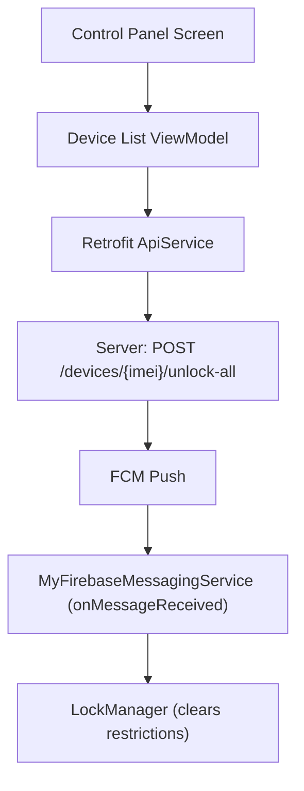
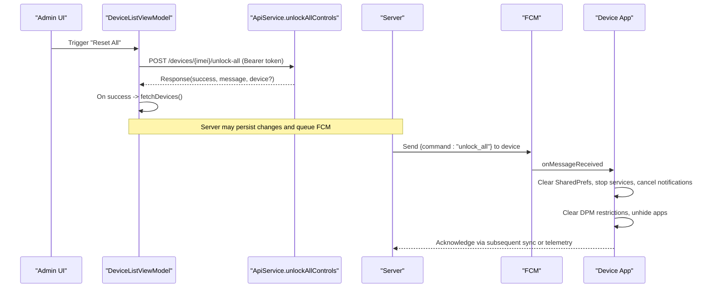
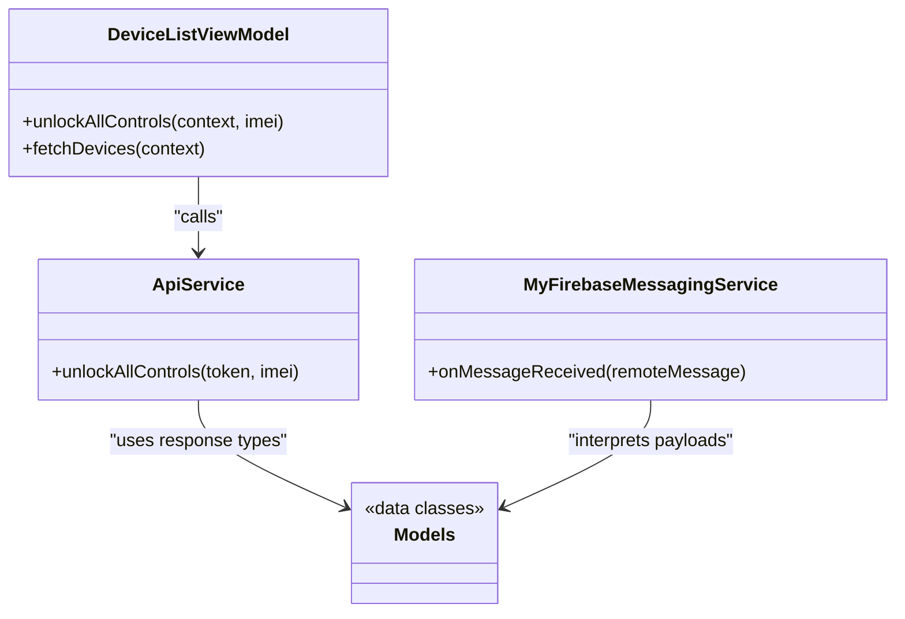

# Bulk Device Operations

<cite>
**Referenced Files in This Document**
- [ApiService.kt](file://app/src/main/java/com/pksafe/lock/manager/data/ApiService.kt)
- [Models.kt](file://app/src/main/java/com/pksafe/lock/manager/data/Models.kt)
- [DeviceListViewModel.kt](file://app/src/main/java/com/pksafe/lock/manager/ui/devices/DeviceListViewModel.kt)
- [ControlPanelScreen.kt](file://app/src/main/java/com/pksafe/lock/manager/ui/devices/ControlPanelScreen.kt)
- [MyFirebaseMessagingService.kt](file://app/src/main/java/com/pksafe/lock/manager/service/MyFirebaseMessagingService.kt)
</cite>

## Table of Contents
1. Introduction
2. Project Structure
3. Core Components
4. Architecture Overview
5. Detailed Component Analysis
6. Dependency Analysis
7. Performance Considerations
8. Troubleshooting Guide
9. Conclusion

## Introduction
This document explains PK Locker’s bulk device management operations with a focus on the POST /devices/{imei}/unlock-all endpoint. It covers how this endpoint is used to simultaneously remove all restrictions from a device, its role in emergency unlock scenarios and administrative bulk workflows, request/response patterns, error handling strategies, integration guidance, and performance considerations including rate limiting.

## Project Structure
The Android client exposes an API surface for device control via Retrofit interfaces. The bulk unlock capability is defined as a dedicated endpoint that triggers a server-side operation to clear all controls for a given IMEI and propagate the change to devices via FCM.

**Diagram sources**
- [ApiService.kt:89-93](file://app/src/main/java/com/pksafe/lock/manager/data/ApiService.kt#L89-L93)
- [DeviceListViewModel.kt:197-220](file://app/src/main/java/com/pksafe/lock/manager/ui/devices/DeviceListViewModel.kt#L197-L220)
- [MyFirebaseMessagingService.kt:120-168](file://app/src/main/java/com/pksafe/lock/manager/service/MyFirebaseMessagingService.kt#L120-L168)

**Section sources**
- [ApiService.kt:89-93](file://app/src/main/java/com/pksafe/lock/manager/data/ApiService.kt#L89-L93)
- [DeviceListViewModel.kt:197-220](file://app/src/main/java/com/pksafe/lock/manager/ui/devices/DeviceListViewModel.kt#L197-L220)
- [MyFirebaseMessagingService.kt:120-168](file://app/src/main/java/com/pksafe/lock/manager/service/MyFirebaseMessagingService.kt#L120-L168)

## Core Components
- API definition for bulk unlock:
  - Endpoint: POST /devices/{imei}/unlock-all
  - Method signature exposed by the client: unlockAllControls(token, imei)
- Data models:
  - Request/Response types are consistent with other device endpoints; responses include success flag and message.
- UI entry point:
  - Control panel provides a “Reset All” action that invokes the bulk unlock flow.
- Client orchestration:
  - ViewModel launches the network call, handles success/failure, and refreshes device state.
- Device-side enforcement:
  - FCM handler processes “unlock_all” command to clear all restrictions on the device.

**Section sources**
- [ApiService.kt:89-93](file://app/src/main/java/com/pksafe/lock/manager/data/ApiService.kt#L89-L93)
- [Models.kt:205-219](file://app/src/main/java/com/pksafe/lock/manager/data/Models.kt#L205-L219)
- [ControlPanelScreen.kt:262-279](file://app/src/main/java/com/pksafe/lock/manager/ui/devices/ControlPanelScreen.kt#L262-L279)
- [DeviceListViewModel.kt:197-220](file://app/src/main/java/com/pksafe/lock/manager/ui/devices/DeviceListViewModel.kt#L197-L220)
- [MyFirebaseMessagingService.kt:120-168](file://app/src/main/java/com/pksafe/lock/manager/service/MyFirebaseMessagingService.kt#L120-L168)

## Architecture Overview
The bulk unlock workflow spans UI, client networking, server processing, and device-side enforcement via push notifications.

**Diagram sources**
- [DeviceListViewModel.kt:197-220](file://app/src/main/java/com/pksafe/lock/manager/ui/devices/DeviceListViewModel.kt#L197-L220)
- [ApiService.kt:89-93](file://app/src/main/java/com/pksafe/lock/manager/data/ApiService.kt#L89-L93)
- [MyFirebaseMessagingService.kt:120-168](file://app/src/main/java/com/pksafe/lock/manager/service/MyFirebaseMessagingService.kt#L120-L168)

## Detailed Component Analysis

### Endpoint Definition: POST /devices/{imei}/unlock-all
- Purpose: Remove all restrictions for a specific device identified by IMEI.
- Authentication: Authorization header with Bearer token.
- Path parameter: imei
- Response model: Consistent with other device endpoints (success, message, optional device summary).

Implementation reference:
- [ApiService.kt:89-93](file://app/src/main/java/com/pksafe/lock/manager/data/ApiService.kt#L89-L93)
- [Models.kt:205-219](file://app/src/main/java/com/pksafe/lock/manager/data/Models.kt#L205-L219)

**Section sources**
- [ApiService.kt:89-93](file://app/src/main/java/com/pksafe/lock/manager/data/ApiService.kt#L89-L93)
- [Models.kt:205-219](file://app/src/main/java/com/pksafe/lock/manager/data/Models.kt#L205-L219)

### UI Integration: Control Panel “Reset All”
- User action: A confirmation dialog triggers the bulk unlock.
- Flow: Calls ViewModel method which performs the network call and refreshes device list on success.

Implementation references:
- [ControlPanelScreen.kt:262-279](file://app/src/main/java/com/pksafe/lock/manager/ui/devices/ControlPanelScreen.kt#L262-L279)
- [DeviceListViewModel.kt:197-220](file://app/src/main/java/com/pksafe/lock/manager/ui/devices/DeviceListViewModel.kt#L197-L220)

**Section sources**
- [ControlPanelScreen.kt:262-279](file://app/src/main/java/com/pksafe/lock/manager/ui/devices/ControlPanelScreen.kt#L262-L279)
- [DeviceListViewModel.kt:197-220](file://app/src/main/java/com/pksafe/lock/manager/ui/devices/DeviceListViewModel.kt#L197-L220)

### Device-Side Enforcement: FCM “unlock_all” Command
- When the server sends an “unlock_all” command, the app clears all restrictions in a deterministic order:
  - Immediately clear SharedPrefs flags and blocked apps set
  - Stop lock overlay service and cancel notifications
  - Clear DevicePolicyManager restrictions (camera, USB, install/uninstall, calls, reset, boot)
  - Unhide previously blocked apps after a short delay
- This ensures immediate restoration of device functionality during emergencies.

Implementation reference:
- [MyFirebaseMessagingService.kt:120-168](file://app/src/main/java/com/pksafe/lock/manager/service/MyFirebaseMessagingService.kt#L120-L168)

**Section sources**
- [MyFirebaseMessagingService.kt:120-168](file://app/src/main/java/com/pksafe/lock/manager/service/MyFirebaseMessagingService.kt#L120-L168)

### Request/Response Examples
- Individual unlock:
  - Endpoint: POST /devices/{imei}/unlock
  - Use when unlocking a single restriction or toggling lock state for one device.
  - Reference: [ApiService.kt:52-56](file://app/src/main/java/com/pksafe/lock/manager/data/ApiService.kt#L52-L56)
- Bulk unlock:
  - Endpoint: POST /devices/{imei}/unlock-all
  - Removes all restrictions at once; ideal for emergency or administrative resets.
  - Reference: [ApiService.kt:89-93](file://app/src/main/java/com/pksafe/lock/manager/data/ApiService.kt#L89-L93)
- Responses:
  - Both endpoints return a response with success flag and message; bulk unlock may also include device summary depending on server implementation.
  - Reference: [Models.kt:205-219](file://app/src/main/java/com/pksafe/lock/manager/data/Models.kt#L205-L219)

**Section sources**
- [ApiService.kt:52-56](file://app/src/main/java/com/pksafe/lock/manager/data/ApiService.kt#L52-L56)
- [ApiService.kt:89-93](file://app/src/main/java/com/pksafe/lock/manager/data/ApiService.kt#L89-L93)
- [Models.kt:205-219](file://app/src/main/java/com/pksafe/lock/manager/data/Models.kt#L205-L219)

### Error Handling and Rollback Strategies
- Network errors:
  - ViewModel catches exceptions and refreshes device list to revert UI state to the latest known good state.
  - Reference: [DeviceListViewModel.kt:197-220](file://app/src/main/java/com/pksafe/lock/manager/ui/devices/DeviceListViewModel.kt#L197-L220)
- Partial failures:
  - If the server supports partial results, clients should inspect the response and reconcile state by fetching the latest device data.
  - Reference: [DeviceListViewModel.kt:197-220](file://app/src/main/java/com/pksafe/lock/manager/ui/devices/DeviceListViewModel.kt#L197-L220)
- Device-side rollback:
  - In case of incomplete clearing, the ordered sequence in FCM handler ensures critical restrictions are removed first, minimizing risk.
  - Reference: [MyFirebaseMessagingService.kt:120-168](file://app/src/main/java/com/pksafe/lock/manager/service/MyFirebaseMessagingService.kt#L120-L168)

**Section sources**
- [DeviceListViewModel.kt:197-220](file://app/src/main/java/com/pksafe/lock/manager/ui/devices/DeviceListViewModel.kt#L197-L220)
- [MyFirebaseMessagingService.kt:120-168](file://app/src/main/java/com/pksafe/lock/manager/service/MyFirebaseMessagingService.kt#L120-L168)

### Implementation Guidance for Administrative Workflows and Emergency Procedures
- Administrative bulk operations:
  - Use POST /devices/{imei}/unlock-all to quickly restore full device functionality across multiple incidents.
  - Integrate with admin dashboards to trigger the endpoint with proper authorization and logging.
  - Reference: [ApiService.kt:89-93](file://app/src/main/java/com/pksafe/lock/manager/data/ApiService.kt#L89-L93)
- Emergency response procedures:
  - Prioritize immediate device usability; rely on FCM “unlock_all” to clear restrictions rapidly.
  - Ensure admin devices are protected from unintended remote locking (already handled in messaging service).
  - Reference: [MyFirebaseMessagingService.kt:40-45](file://app/src/main/java/com/pksafe/lock/manager/service/MyFirebaseMessagingService.kt#L40-L45), [MyFirebaseMessagingService.kt:120-168](file://app/src/main/java/com/pksafe/lock/manager/service/MyFirebaseMessagingService.kt#L120-L168)

**Section sources**
- [ApiService.kt:89-93](file://app/src/main/java/com/pksafe/lock/manager/data/ApiService.kt#L89-L93)
- [MyFirebaseMessagingService.kt:40-45](file://app/src/main/java/com/pksafe/lock/manager/service/MyFirebaseMessagingService.kt#L40-L45)
- [MyFirebaseMessagingService.kt:120-168](file://app/src/main/java/com/pksafe/lock/manager/service/MyFirebaseMessagingService.kt#L120-L168)

## Dependency Analysis
The bulk unlock feature depends on several components working together:

**Diagram sources**
- [ApiService.kt:89-93](file://app/src/main/java/com/pksafe/lock/manager/data/ApiService.kt#L89-L93)
- [DeviceListViewModel.kt:197-220](file://app/src/main/java/com/pksafe/lock/manager/ui/devices/DeviceListViewModel.kt#L197-L220)
- [MyFirebaseMessagingService.kt:120-168](file://app/src/main/java/com/pksafe/lock/manager/service/MyFirebaseMessagingService.kt#L120-L168)
- [Models.kt:205-219](file://app/src/main/java/com/pksafe/lock/manager/data/Models.kt#L205-L219)

**Section sources**
- [ApiService.kt:89-93](file://app/src/main/java/com/pksafe/lock/manager/data/ApiService.kt#L89-L93)
- [DeviceListViewModel.kt:197-220](file://app/src/main/java/com/pksafe/lock/manager/ui/devices/DeviceListViewModel.kt#L197-L220)
- [MyFirebaseMessagingService.kt:120-168](file://app/src/main/java/com/pksafe/lock/manager/service/MyFirebaseMessagingService.kt#L120-L168)
- [Models.kt:205-219](file://app/src/main/java/com/pksafe/lock/manager/data/Models.kt#L205-L219)

## Performance Considerations
- Network efficiency:
  - Prefer bulk unlock for mass resets to reduce repeated individual calls.
  - After successful bulk unlock, refresh device lists once to minimize redundant requests.
  - Reference: [DeviceListViewModel.kt:197-220](file://app/src/main/java/com/pksafe/lock/manager/ui/devices/DeviceListViewModel.kt#L197-L220)
- Rate limiting:
  - Implement server-side rate limits per shopkeeper/admin to prevent abuse and ensure fair usage.
  - Consider throttling bulk operations during peak times and providing backoff hints in responses.
- Device-side performance:
  - The FCM handler clears restrictions in a prioritized order to minimize downtime and avoid blocking operations on the main thread where possible.
  - Reference: [MyFirebaseMessagingService.kt:120-168](file://app/src/main/java/com/pksafe/lock/manager/service/MyFirebaseMessagingService.kt#L120-L168)

[No sources needed since this section provides general guidance]

## Troubleshooting Guide
- Common issues:
  - Network failure: ViewModel logs errors and refreshes device list to revert UI state.
    - Reference: [DeviceListViewModel.kt:197-220](file://app/src/main/java/com/pksafe/lock/manager/ui/devices/DeviceListViewModel.kt#L197-L220)
  - Incomplete device unlock: Check FCM logs for “unlock_all” processing and verify each step in the messaging service.
    - Reference: [MyFirebaseMessagingService.kt:120-168](file://app/src/main/java/com/pksafe/lock/manager/service/MyFirebaseMessagingService.kt#L120-L168)
- Diagnostic steps:
  - Verify Authorization header presence and validity.
  - Confirm IMEI path parameter correctness.
  - Inspect server response for success flag and message.
  - Validate device-side state by checking SharedPrefs and DPM settings post-command.

**Section sources**
- [DeviceListViewModel.kt:197-220](file://app/src/main/java/com/pksafe/lock/manager/ui/devices/DeviceListViewModel.kt#L197-L220)
- [MyFirebaseMessagingService.kt:120-168](file://app/src/main/java/com/pksafe/lock/manager/service/MyFirebaseMessagingService.kt#L120-L168)

## Conclusion
POST /devices/{imei}/unlock-all provides a robust mechanism for bulk device unlocks, essential for emergency scenarios and administrative operations. The client integrates this endpoint through a clear UI flow, while the server coordinates device updates via FCM to ensure rapid and reliable restriction removal. Proper error handling, state reconciliation, and performance considerations help maintain operational stability and user trust.

[No sources needed since this section summarizes without analyzing specific files]