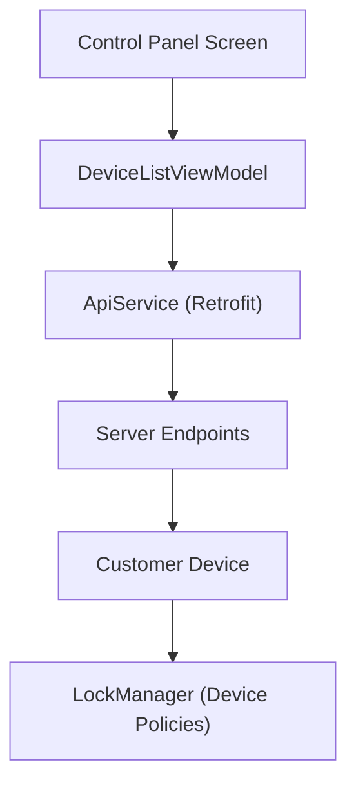
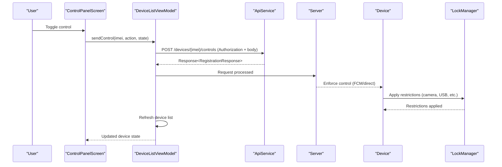
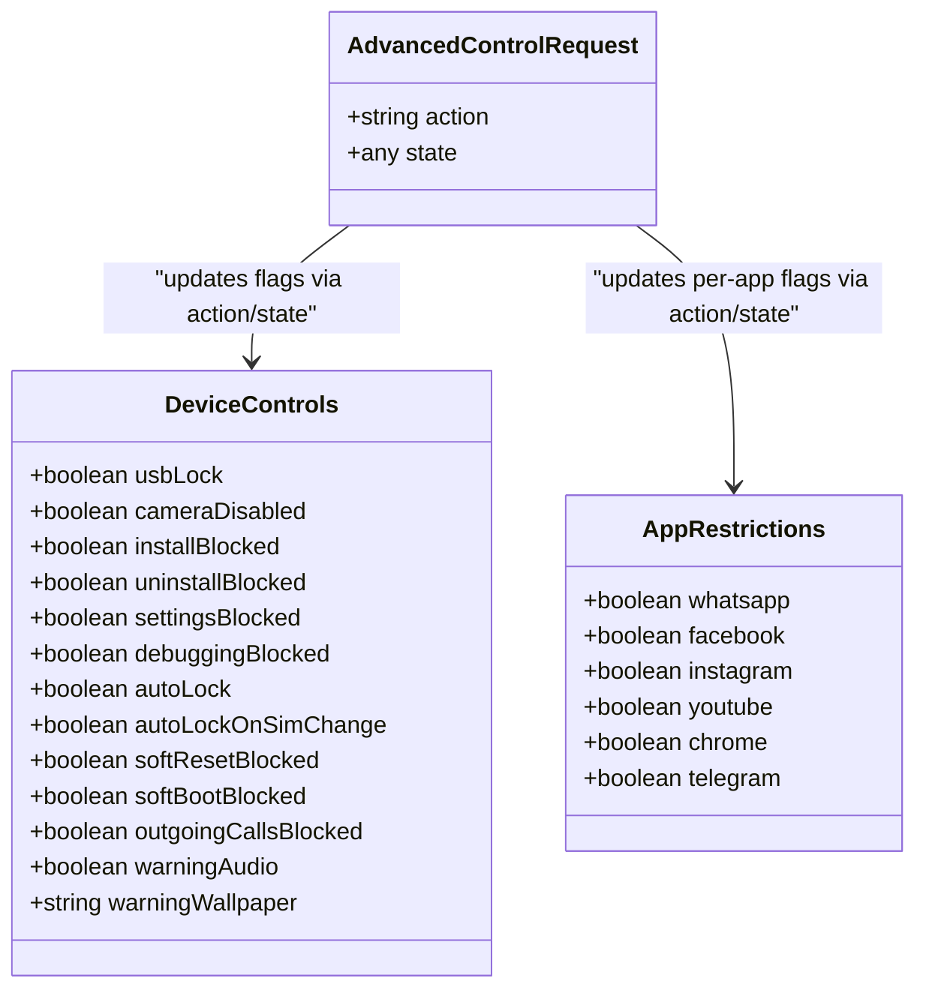

# Device Control Operations

<cite>
**Referenced Files in This Document**
- [ApiService.kt](file://app/src/main/java/com/pksafe/lock/manager/data/ApiService.kt)
- [Models.kt](file://app/src/main/java/com/pksafe/lock/manager/data/Models.kt)
- [DeviceListViewModel.kt](file://app/src/main/java/com/pksafe/lock/manager/ui/devices/DeviceListViewModel.kt)
- [LockManager.kt](file://app/src/main/java/com/pksafe/lock/manager/util/LockManager.kt)
- [ControlPanelScreen.kt](file://app/src/main/java/com/pksafe/lock/manager/ui/devices/ControlPanelScreen.kt)
</cite>

## Table of Contents
1. Introduction
2. Project Structure
3. Core Components
4. Architecture Overview
5. Detailed Component Analysis
6. Dependency Analysis
7. Performance Considerations
8. Troubleshooting Guide
9. Conclusion

## Introduction
This document describes PK Locker’s device control endpoints for remotely locking and unlocking devices, as well as advanced hardware controls. It covers:
- POST /devices/{imei}/lock to initiate a lockdown with immediate effect, persistent overlay activation, and enforcement of hardware restrictions.
- POST /devices/{imei}/unlock to remove all restrictions and restore full functionality.
- POST /devices/{imei}/controls for advanced control operations including camera enable/disable, USB debugging toggle, factory reset prevention, app blocking, and system modification protection.
- The AdvancedControlRequest schema used by the controls endpoint.
- POST /devices/{imei}/unlock-all for bulk unlocking of all restrictions on a device.
It also provides comprehensive examples for each operation, including request payloads, response structures, and error handling scenarios such as invalid IMEI, unauthorized access, and device offline conditions.

## Project Structure
The device control features are implemented across these key areas:
- API definitions (Retrofit interfaces) define the HTTP endpoints and request/response types.
- View models orchestrate calls to the API and refresh UI state after successful operations.
- The LockManager enforces device-level policies and hardware restrictions when lock/unlock or controls are applied.
- The UI triggers control actions via switches and buttons that call into the view model.

**Diagram sources**
- [ApiService.kt:46-93](file://app/src/main/java/com/pksafe/lock/manager/data/ApiService.kt#L46-L93)
- [DeviceListViewModel.kt:143-220](file://app/src/main/java/com/pksafe/lock/manager/ui/devices/DeviceListViewModel.kt#L143-L220)
- [LockManager.kt:111-192](file://app/src/main/java/com/pksafe/lock/manager/util/LockManager.kt#L111-L192)

**Section sources**
- [ApiService.kt:46-93](file://app/src/main/java/com/pksafe/lock/manager/data/ApiService.kt#L46-L93)
- [DeviceListViewModel.kt:143-220](file://app/src/main/java/com/pksafe/lock/manager/ui/devices/DeviceListViewModel.kt#L143-L220)
- [LockManager.kt:111-192](file://app/src/main/java/com/pksafe/lock/manager/util/LockManager.kt#L111-L192)

## Core Components
- API Layer: Retrofit interface defines endpoints for lock, unlock, controls, and unlock-all. All control endpoints require an Authorization header with a Bearer token.
- ViewModel Layer: Encapsulates business logic for invoking endpoints, handling responses, and refreshing device lists.
- Enforcement Layer: LockManager applies device policy restrictions and overlays based on server commands.

Key responsibilities:
- POST /devices/{imei}/lock: Initiates lockdown; device starts overlay service, applies hard restrictions, and locks the screen.
- POST /devices/{imei}/unlock: Stops overlay service, removes restrictions, and clears locked state.
- POST /devices/{imei}/controls: Applies granular controls like camera disable, USB file transfer block, install/uninstall blocks, settings block, debugging block, safe boot block, outgoing calls block, and app-specific blocks.
- POST /devices/{imei}/unlock-all: Clears all active controls and restrictions for a device.

**Section sources**
- [ApiService.kt:46-93](file://app/src/main/java/com/pksafe/lock/manager/data/ApiService.kt#L46-L93)
- [DeviceListViewModel.kt:143-220](file://app/src/main/java/com/pksafe/lock/manager/ui/devices/DeviceListViewModel.kt#L143-L220)
- [LockManager.kt:111-192](file://app/src/main/java/com/pksafe/lock/manager/util/LockManager.kt#L111-L192)

## Architecture Overview
The flow from UI to device enforcement is as follows:
- User toggles a control in the Control Panel.
- DeviceListViewModel constructs an AdvancedControlRequest and sends it to the server via ApiService.
- Server processes the request and instructs the target device (via FCM or direct network).
- On the device, LockManager applies the requested restrictions using Android Device Policy Manager and related APIs.
- After success, the UI refreshes device state to reflect changes.

**Diagram sources**
- [DeviceListViewModel.kt:173-195](file://app/src/main/java/com/pksafe/lock/manager/ui/devices/DeviceListViewModel.kt#L173-L195)
- [ApiService.kt:58-63](file://app/src/main/java/com/pksafe/lock/manager/data/ApiService.kt#L58-L63)
- [LockManager.kt:151-192](file://app/src/main/java/com/pksafe/lock/manager/util/LockManager.kt#L151-L192)

## Detailed Component Analysis

### Endpoint: POST /devices/{imei}/lock
- Purpose: Initiate device lockdown immediately.
- Behavior:
  - Starts the overlay service to present a persistent lock screen.
  - Applies deep hardware restrictions (camera disabled, USB file transfer blocked, factory reset blocked, safe boot blocked, debugging features blocked, status bar disabled, keyguard behavior adjusted).
  - Triggers immediate device lock via policy manager.
- Authentication: Requires Authorization header with Bearer token.
- Path parameter: imei (string).
- Response: RegistrationResponse indicating success and optional device summary.

Example request:
- Method: POST
- URL: /devices/{imei}/lock
- Headers: Authorization: Bearer <token>
- Body: None

Example response:
- success: boolean
- message: string
- device: { id, imei, customerName, smsCodes? }

Error handling:
- Invalid IMEI: Server returns failure with descriptive message; UI should display error and not change local state.
- Unauthorized access: Missing or invalid token results in authentication error; prompt user to re-authenticate.
- Device offline: If device cannot receive command, server may queue or return pending; UI should indicate retry later.

**Section sources**
- [ApiService.kt:46-50](file://app/src/main/java/com/pksafe/lock/manager/data/ApiService.kt#L46-L50)
- [DeviceListViewModel.kt:143-171](file://app/src/main/java/com/pksafe/lock/manager/ui/devices/DeviceListViewModel.kt#L143-L171)
- [LockManager.kt:111-134](file://app/src/main/java/com/pksafe/lock/manager/util/LockManager.kt#L111-L134)
- [LockManager.kt:151-192](file://app/src/main/java/com/pksafe/lock/manager/util/LockManager.kt#L151-L192)

### Endpoint: POST /devices/{imei}/unlock
- Purpose: Remove all restrictions and restore full device functionality.
- Behavior:
  - Stops the overlay service.
  - Removes all hard restrictions applied during lock.
  - Clears locked state in local preferences.
- Authentication: Requires Authorization header with Bearer token.
- Path parameter: imei (string).
- Response: RegistrationResponse indicating success and optional device summary.

Example request:
- Method: POST
- URL: /devices/{imei}/unlock
- Headers: Authorization: Bearer <token>
- Body: None

Example response:
- success: boolean
- message: string
- device: { id, imei, customerName, smsCodes? }

Error handling:
- Invalid IMEI: Server returns failure; do not update UI state.
- Unauthorized access: Authentication error; prompt user to re-authenticate.
- Device offline: Command queued or delayed; UI indicates pending or retry later.

**Section sources**
- [ApiService.kt:52-56](file://app/src/main/java/com/pksafe/lock/manager/data/ApiService.kt#L52-L56)
- [DeviceListViewModel.kt:143-171](file://app/src/main/java/com/pksafe/lock/manager/ui/devices/DeviceListViewModel.kt#L143-L171)
- [LockManager.kt:136-148](file://app/src/main/java/com/pksafe/lock/manager/util/LockManager.kt#L136-L148)

### Endpoint: POST /devices/{imei}/controls
- Purpose: Apply advanced control operations to a device.
- Supported actions include:
  - Camera enable/disable
  - USB file transfer block (USB Terminal Block)
  - Application install block
  - Application uninstall block
  - System settings block
  - Debugging features block (ADB/debugging)
  - Safe boot block
  - Outgoing calls block
  - App-specific blocks (e.g., whatsapp, instagram, facebook, youtube, chrome, telegram)
- Authentication: Requires Authorization header with Bearer token.
- Path parameter: imei (string).
- Request body: AdvancedControlRequest with fields:
  - action: string (control key)
  - state: any (boolean or other type depending on action)
- Response: RegistrationResponse indicating success and optional device summary.

AdvancedControlRequest schema:
- action: string — identifies the control to apply (e.g., "cameraDisabled", "usbLock", "installBlocked", "uninstallBlocked", "settingsBlocked", "debuggingBlocked", "safeBootBlocked", "outgoingCallsBlocked", "whatsapp", "instagram", "facebook", "youtube", "chrome", "telegram").
- state: any — typically boolean true/false to enable or disable the control.

Examples:
- Disable camera:
  - Method: POST
  - URL: /devices/{imei}/controls
  - Headers: Authorization: Bearer <token>
  - Body: { "action": "cameraDisabled", "state": true }
- Enable USB file transfer:
  - Method: POST
  - URL: /devices/{imei}/controls
  - Headers: Authorization: Bearer <token>
  - Body: { "action": "usbLock", "state": false }
- Block Instagram:
  - Method: POST
  - URL: /devices/{imei}/controls
  - Headers: Authorization: Bearer <token>
  - Body: { "action": "instagram", "state": true }

Error handling:
- Invalid IMEI: Server returns failure; UI shows error and retains current state.
- Unauthorized access: Authentication error; prompt user to re-authenticate.
- Device offline: Command queued or delayed; UI indicates pending or retry later.

Notes:
- Some controls require Device Owner privileges to fully enforce (e.g., USB file transfer, install/uninstall blocks, safe boot, outgoing calls). If Device Owner is not available, enforcement may be limited or fall back to alternative mechanisms.

**Section sources**
- [ApiService.kt:58-63](file://app/src/main/java/com/pksafe/lock/manager/data/ApiService.kt#L58-L63)
- [Models.kt:216-219](file://app/src/main/java/com/pksafe/lock/manager/data/Models.kt#L216-L219)
- [DeviceListViewModel.kt:173-195](file://app/src/main/java/com/pksafe/lock/manager/ui/devices/DeviceListViewModel.kt#L173-L195)
- [ControlPanelScreen.kt:315-336](file://app/src/main/java/com/pksafe/lock/manager/ui/devices/ControlPanelScreen.kt#L315-L336)
- [LockManager.kt:204-261](file://app/src/main/java/com/pksafe/lock/manager/util/LockManager.kt#L204-L261)

### Endpoint: POST /devices/{imei}/unlock-all
- Purpose: Bulk unlock all controls and restrictions for a device.
- Behavior:
  - Clears all active controls and restrictions.
  - Resets device state to fully unlocked.
- Authentication: Requires Authorization header with Bearer token.
- Path parameter: imei (string).
- Response: RegistrationResponse indicating success and optional device summary.

Example request:
- Method: POST
- URL: /devices/{imei}/unlock-all
- Headers: Authorization: Bearer <token>
- Body: None

Example response:
- success: boolean
- message: string
- device: { id, imei, customerName, smsCodes? }

Error handling:
- Invalid IMEI: Server returns failure; UI displays error and does not change state.
- Unauthorized access: Authentication error; prompt user to re-authenticate.
- Device offline: Command queued or delayed; UI indicates pending or retry later.

**Section sources**
- [ApiService.kt:89-93](file://app/src/main/java/com/pksafe/lock/manager/data/ApiService.kt#L89-L93)
- [DeviceListViewModel.kt:197-220](file://app/src/main/java/com/pksafe/lock/manager/ui/devices/DeviceListViewModel.kt#L197-L220)

### Data Models and Control Mapping
- DeviceControls includes flags for usbLock, cameraDisabled, installBlocked, uninstallBlocked, settingsBlocked, debuggingBlocked, autoLock, autoLockOnSimChange, softResetBlocked, softBootBlocked, outgoingCallsBlocked, warningAudio, warningWallpaper.
- AppRestrictions includes per-app flags for whatsapp, facebook, instagram, youtube, chrome, telegram.
- These flags correspond to control actions sent via AdvancedControlRequest.

**Diagram sources**
- [Models.kt:78-101](file://app/src/main/java/com/pksafe/lock/manager/data/Models.kt#L78-L101)
- [Models.kt:216-219](file://app/src/main/java/com/pksafe/lock/manager/data/Models.kt#L216-L219)

**Section sources**
- [Models.kt:78-101](file://app/src/main/java/com/pksafe/lock/manager/data/Models.kt#L78-L101)
- [Models.kt:216-219](file://app/src/main/java/com/pksafe/lock/manager/data/Models.kt#L216-L219)

## Dependency Analysis
- DeviceListViewModel depends on ApiService to invoke endpoints and on LockManager indirectly through server-side enforcement.
- ApiService defines the contract for endpoints and data types.
- LockManager implements enforcement using Android Device Policy Manager and related services.
- ControlPanelScreen triggers control actions which are routed through DeviceListViewModel.

**Diagram sources**
- [DeviceListViewModel.kt:143-220](file://app/src/main/java/com/pksafe/lock/manager/ui/devices/DeviceListViewModel.kt#L143-L220)
- [ApiService.kt:46-93](file://app/src/main/java/com/pksafe/lock/manager/data/ApiService.kt#L46-L93)
- [LockManager.kt:111-192](file://app/src/main/java/com/pksafe/lock/manager/util/LockManager.kt#L111-L192)

**Section sources**
- [DeviceListViewModel.kt:143-220](file://app/src/main/java/com/pksafe/lock/manager/ui/devices/DeviceListViewModel.kt#L143-L220)
- [ApiService.kt:46-93](file://app/src/main/java/com/pksafe/lock/manager/data/ApiService.kt#L46-L93)
- [LockManager.kt:111-192](file://app/src/main/java/com/pksafe/lock/manager/util/LockManager.kt#L111-L192)

## Performance Considerations
- Network latency: Ensure retries and timeouts are configured appropriately for control requests.
- Device capability: Some controls require Device Owner privileges; if unavailable, enforcement may be partial. Check device capabilities before issuing certain controls.
- Batch operations: Use unlock-all to minimize multiple individual control calls when resetting a device.
- UI responsiveness: Avoid blocking the main thread; use asynchronous calls in ViewModels.

[No sources needed since this section provides general guidance]

## Troubleshooting Guide
Common issues and resolutions:
- Invalid IMEI:
  - Symptom: Server returns failure with message indicating invalid identifier.
  - Resolution: Verify IMEI format and ensure it matches a registered device. Retry after correction.
- Unauthorized access:
  - Symptom: Authentication error due to missing or invalid token.
  - Resolution: Re-authenticate the user and refresh the Authorization header.
- Device offline:
  - Symptom: Commands not applied immediately; server may queue or delay processing.
  - Resolution: Implement retry logic and notify users that actions will apply once the device reconnects.
- Insufficient privileges:
  - Symptom: Certain controls fail to enforce (e.g., USB file transfer, install/uninstall blocks).
  - Resolution: Ensure Device Owner privileges are granted; otherwise, fallback behaviors may apply.

**Section sources**
- [DeviceListViewModel.kt:143-220](file://app/src/main/java/com/pksafe/lock/manager/ui/devices/DeviceListViewModel.kt#L143-L220)
- [LockManager.kt:204-261](file://app/src/main/java/com/pksafe/lock/manager/util/LockManager.kt#L204-L261)

## Conclusion
PK Locker’s device control endpoints provide robust remote management capabilities:
- Immediate lockdown and unlock with persistent overlay and hardware restriction enforcement.
- Granular controls for camera, USB, app installation/uninstallation, system settings, debugging, safe boot, outgoing calls, and app-specific blocks.
- Bulk unlock-all for quick restoration of full device functionality.
Proper error handling ensures resilience against invalid inputs, authentication failures, and device connectivity issues. The architecture cleanly separates API definitions, business logic, and enforcement layers for maintainability and scalability.