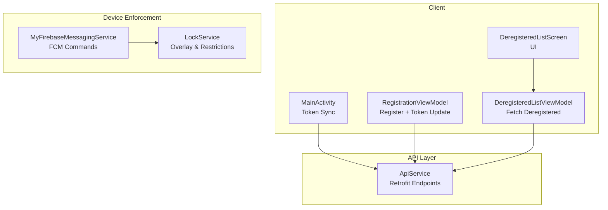
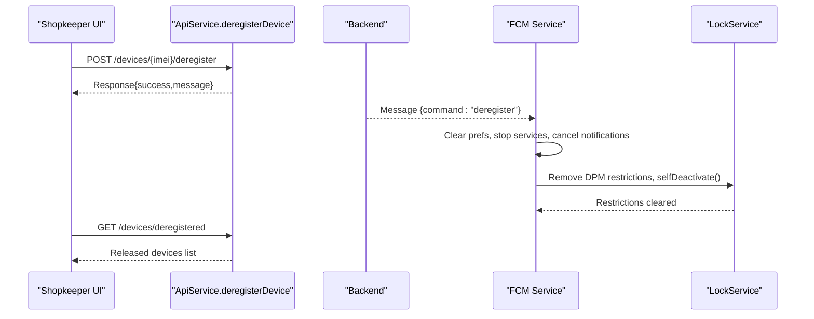
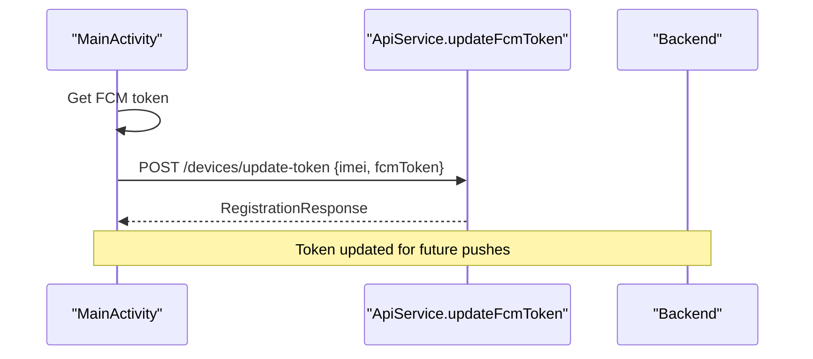
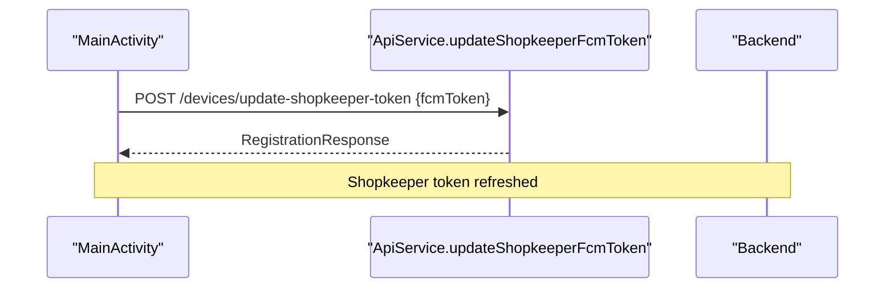
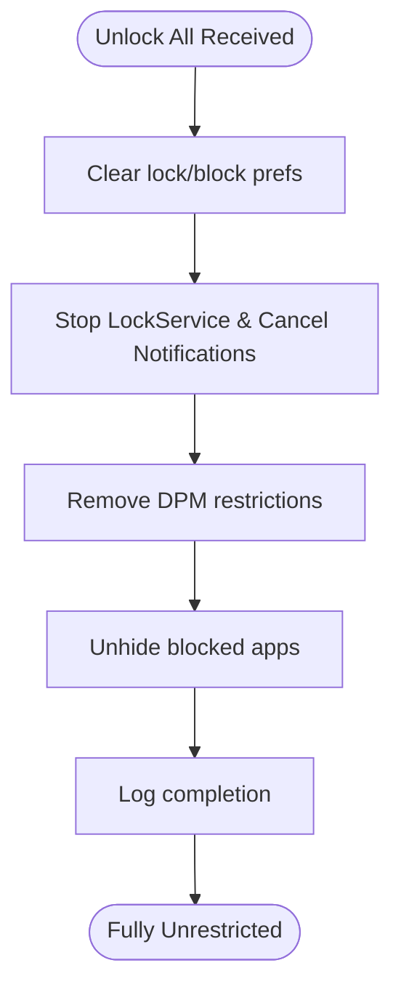
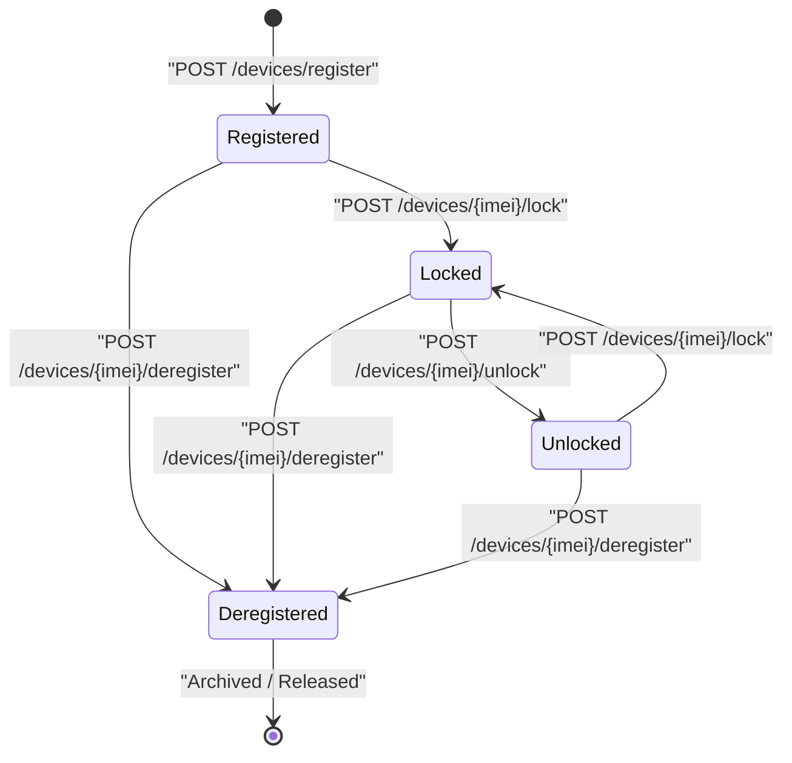
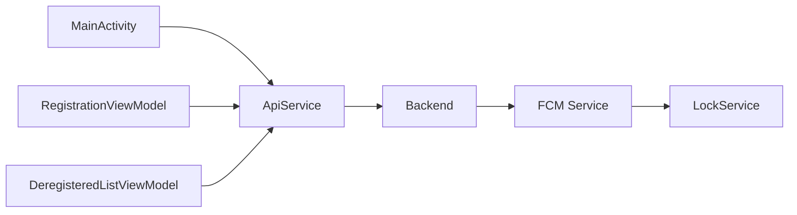

# Device Lifecycle Management

<cite>
**Referenced Files in This Document**
- [ApiService.kt](file://app/src/main/java/com/pksafe/lock/manager/data/ApiService.kt)
- [Models.kt](file://app/src/main/java/com/pksafe/lock/manager/data/Models.kt)
- [MyFirebaseMessagingService.kt](file://app/src/main/java/com/pksafe/lock/manager/service/MyFirebaseMessagingService.kt)
- [LockService.kt](file://app/src/main/java/com/pksafe/lock/manager/service/LockService.kt)
- [MainActivity.kt](file://app/src/main/java/com/pksafe/lock/manager/MainActivity.kt)
- [DeregisteredListScreen.kt](file://app/src/main/java/com/pksafe/lock/manager/ui/deregister/DeregisteredListScreen.kt)
- [DeregisteredListViewModel.kt](file://app/src/main/java/com/pksafe/lock/manager/ui/deregister/DeregisteredListViewModel.kt)
- [RegistrationViewModel.kt](file://app/src/main/java/com/pksafe/lock/manager/ui/registration/RegistrationViewModel.kt)
- [device_admin_policies.xml](file://app/src/main/res/xml/device_admin_policies.xml)
</cite>

## Table of Contents
1. Introduction
2. Project Structure
3. Core Components
4. Architecture Overview
5. Detailed Component Analysis
6. Dependency Analysis
7. Performance Considerations
8. Troubleshooting Guide
9. Conclusion
10. Appendices

## Introduction
This document explains PK Locker’s device lifecycle management endpoints and flows for deactivating devices and managing tokens. It covers:
- POST /devices/{imei}/deregister: removing a device from active management, cleaning restrictions, releasing keys, and archiving history.
- POST /devices/update-token: updating Firebase Cloud Messaging (FCM) tokens when a device migrates to a new account or reinstalls the app.
- POST /devices/update-shopkeeper-token: updating shopkeeper-level FCM tokens across multiple devices.
- POST /devices/{imei}/unlock-all: emergency bulk unlock operations during transfers or troubleshooting.

It also documents the full lifecycle from registration through deregistration, including state transitions, data retention considerations, rollback procedures, audit logging, and compliance reporting requirements.

## Project Structure
The Android client exposes Retrofit endpoints for device lifecycle operations and handles token synchronization. The FCM service enforces device controls and processes deregistration commands locally. UI components provide visibility into deregistered devices and support operational workflows.



**Diagram sources**
- [MainActivity.kt:331-365](file://app/src/main/java/com/pksafe/lock/manager/MainActivity.kt#L331-L365)
- [RegistrationViewModel.kt:128-160](file://app/src/main/java/com/pksafe/lock/manager/ui/registration/RegistrationViewModel.kt#L128-L160)
- [DeregisteredListViewModel.kt:31-58](file://app/src/main/java/com/pksafe/lock/manager/ui/deregister/DeregisteredListViewModel.kt#L31-L58)
- [ApiService.kt:19-99](file://app/src/main/java/com/pksafe/lock/manager/data/ApiService.kt#L19-L99)
- [MyFirebaseMessagingService.kt:169-211](file://app/src/main/java/com/pksafe/lock/manager/service/MyFirebaseMessagingService.kt#L169-L211)
- [LockService.kt:125-234](file://app/src/main/java/com/pksafe/lock/manager/service/LockService.kt#L125-L234)

**Section sources**
- [ApiService.kt:19-99](file://app/src/main/java/com/pksafe/lock/manager/data/ApiService.kt#L19-L99)
- [MainActivity.kt:331-365](file://app/src/main/java/com/pksafe/lock/manager/MainActivity.kt#L331-L365)
- [DeregisteredListViewModel.kt:31-58](file://app/src/main/java/com/pksafe/lock/manager/ui/deregister/DeregisteredListViewModel.kt#L31-L58)

## Core Components
- API surface for device lifecycle:
  - Register device, list devices, stats, analytics
  - Lock/unlock per device
  - Advanced controls
  - Token updates (device and shopkeeper)
  - SIM change and location notifications
  - Bulk unlock and deregister
- Data models for device responses, controls, and registration payloads
- FCM command handling for lock/unlock, app blocks, hardware blocks, deregistration, and unlock-all
- Lock overlay service enforcing runtime restrictions
- UI for viewing deregistered devices

**Section sources**
- [ApiService.kt:19-99](file://app/src/main/java/com/pksafe/lock/manager/data/ApiService.kt#L19-L99)
- [Models.kt:45-121](file://app/src/main/java/com/pksafe/lock/manager/data/Models.kt#L45-L121)
- [MyFirebaseMessagingService.kt:47-223](file://app/src/main/java/com/pksafe/lock/manager/service/MyFirebaseMessagingService.kt#L47-L223)
- [LockService.kt:125-234](file://app/src/main/java/com/pksafe/lock/manager/service/LockService.kt#L125-L234)

## Architecture Overview
The lifecycle spans server-side endpoints defined in the client’s API interface and on-device enforcement via FCM and services.

```mermaid
sequenceDiagram
participant Admin as "Shopkeeper App"
participant API as "ApiService"
participant Server as "Backend"
participant FCM as "FCM Service"
participant Lock as "LockService"
Admin->>API : POST /devices/register
API-->>Admin : RegistrationResponse
Note over Admin,Server : Device is now managed; FCM token associated
Admin->>API : POST /devices/{imei}/deregister
API-->>Admin : RegistrationResponse
Server-->>FCM : Command "deregister"
FCM->>Lock : Clear restrictions, remove admin/owner
Lock-->>FCM : Done
Admin->>API : GET /devices/deregistered
API-->>Admin : List of released devices
```

**Diagram sources**
- [ApiService.kt:20-99](file://app/src/main/java/com/pksafe/lock/manager/data/ApiService.kt#L20-L99)
- [MyFirebaseMessagingService.kt:169-211](file://app/src/main/java/com/pksafe/lock/manager/service/MyFirebaseMessagingService.kt#L169-L211)
- [DeregisteredListViewModel.kt:31-58](file://app/src/main/java/com/pksafe/lock/manager/ui/deregister/DeregisteredListViewModel.kt#L31-L58)

## Detailed Component Analysis

### Endpoint: POST /devices/{imei}/deregister
Purpose: Remove a device from active management, clean all restrictions, release keys, and archive device history.

- Client call:
  - Defined in ApiService with path parameter IMEI and Authorization header.
  - Returns a standard response envelope indicating success/failure and optional device summary.

- On-device behavior (triggered by server via FCM):
  - Clears all shared preferences related to locking and blocking.
  - Stops the lock overlay service and cancels notifications.
  - Removes Device Policy Manager restrictions and uninstalls Device Owner/Admin roles so the customer can uninstall normally.
  - Logs completion for auditability.

- Post-deregistration visibility:
  - Clients can query GET /devices/deregistered to view released devices.



**Diagram sources**
- [ApiService.kt:95-99](file://app/src/main/java/com/pksafe/lock/manager/data/ApiService.kt#L95-L99)
- [MyFirebaseMessagingService.kt:169-211](file://app/src/main/java/com/pksafe/lock/manager/service/MyFirebaseMessagingService.kt#L169-L211)
- [DeregisteredListViewModel.kt:31-58](file://app/src/main/java/com/pksafe/lock/manager/ui/deregister/DeregisteredListViewModel.kt#L31-L58)

**Section sources**
- [ApiService.kt:95-99](file://app/src/main/java/com/pksafe/lock/manager/data/ApiService.kt#L95-L99)
- [MyFirebaseMessagingService.kt:169-211](file://app/src/main/java/com/pksafe/lock/manager/service/MyFirebaseMessagingService.kt#L169-L211)
- [DeregisteredListScreen.kt:42-108](file://app/src/main/java/com/pksafe/lock/manager/ui/deregister/DeregisteredListScreen.kt#L42-L108)

### Endpoint: POST /devices/update-token
Purpose: Update FCM token for a specific device when it migrates to a new account or reinstalls the app.

- Client flow:
  - MainActivity obtains the current FCM token and calls updateFcmToken with Authorization header and a body containing imei and fcmToken.
  - RegistrationViewModel also triggers this after successful device registration if a token is available.

- Expected server behavior:
  - Associates the new token with the device record for push delivery.



**Diagram sources**
- [MainActivity.kt:331-365](file://app/src/main/java/com/pksafe/lock/manager/MainActivity.kt#L331-L365)
- [ApiService.kt:65-69](file://app/src/main/java/com/pksafe/lock/manager/data/ApiService.kt#L65-L69)
- [RegistrationViewModel.kt:128-160](file://app/src/main/java/com/pksafe/lock/manager/ui/registration/RegistrationViewModel.kt#L128-L160)

**Section sources**
- [MainActivity.kt:331-365](file://app/src/main/java/com/pksafe/lock/manager/MainActivity.kt#L331-L365)
- [ApiService.kt:65-69](file://app/src/main/java/com/pksafe/lock/manager/data/ApiService.kt#L65-L69)
- [RegistrationViewModel.kt:128-160](file://app/src/main/java/com/pksafe/lock/manager/ui/registration/RegistrationViewModel.kt#L128-L160)

### Endpoint: POST /devices/update-shopkeeper-token
Purpose: Update shopkeeper-level FCM token used to reach multiple devices under that shopkeeper.

- Client flow:
  - MainActivity detects shopkeeper context and calls updateShopkeeperFcmToken with Authorization header and a body containing fcmToken.

- Expected server behavior:
  - Updates the shopkeeper’s token mapping so subsequent broadcasts or targeted messages can reach devices.



**Diagram sources**
- [MainActivity.kt:478-493](file://app/src/main/java/com/pksafe/lock/manager/MainActivity.kt#L478-L493)
- [ApiService.kt:71-75](file://app/src/main/java/com/pksafe/lock/manager/data/ApiService.kt#L71-L75)

**Section sources**
- [MainActivity.kt:478-493](file://app/src/main/java/com/pksafe/lock/manager/MainActivity.kt#L478-L493)
- [ApiService.kt:71-75](file://app/src/main/java/com/pksafe/lock/manager/data/ApiService.kt#L71-L75)

### Endpoint: POST /devices/{imei}/unlock-all
Purpose: Emergency bulk unlock operation to clear all restrictions for a device during transfers or troubleshooting.

- Client call:
  - Defined in ApiService with path parameter IMEI and Authorization header.

- On-device behavior (triggered by server via FCM):
  - Immediately clears all shared preferences related to locks and blocks.
  - Stops the lock overlay service and cancels notifications.
  - Removes Device Policy Manager restrictions (camera, USB, install/uninstall, calls, factory reset, safe boot).
  - Unhides blocked apps and logs completion.



**Diagram sources**
- [ApiService.kt:89-93](file://app/src/main/java/com/pksafe/lock/manager/data/ApiService.kt#L89-L93)
- [MyFirebaseMessagingService.kt:120-168](file://app/src/main/java/com/pksafe/lock/manager/service/MyFirebaseMessagingService.kt#L120-L168)

**Section sources**
- [ApiService.kt:89-93](file://app/src/main/java/com/pksafe/lock/manager/data/ApiService.kt#L89-L93)
- [MyFirebaseMessagingService.kt:120-168](file://app/src/main/java/com/pksafe/lock/manager/service/MyFirebaseMessagingService.kt#L120-L168)

### Full Lifecycle: Registration to Deregistration
- Registration:
  - Shopkeeper registers a device via POST /devices/register.
  - Optionally syncs FCM token for the device immediately after registration.
- Active Management:
  - Devices receive lock/unlock, app/hardware block, and control commands via FCM.
  - LockService enforces overlay and restrictions while locked.
- Deregistration:
  - POST /devices/{imei}/deregister removes device from active management.
  - Server instructs device to fully release restrictions and remove Device Owner/Admin.
  - Released devices appear in GET /devices/deregistered.



**Diagram sources**
- [ApiService.kt:20-99](file://app/src/main/java/com/pksafe/lock/manager/data/ApiService.kt#L20-L99)
- [MyFirebaseMessagingService.kt:47-223](file://app/src/main/java/com/pksafe/lock/manager/service/MyFirebaseMessagingService.kt#L47-L223)

**Section sources**
- [ApiService.kt:20-99](file://app/src/main/java/com/pksafe/lock/manager/data/ApiService.kt#L20-L99)
- [MyFirebaseMessagingService.kt:47-223](file://app/src/main/java/com/pksafe/lock/manager/service/MyFirebaseMessagingService.kt#L47-L223)

## Dependency Analysis
- ApiService defines the contract for all device lifecycle endpoints used by UI and background tasks.
- MainActivity coordinates token synchronization for both device and shopkeeper contexts.
- MyFirebaseMessagingService interprets server commands to enforce or remove device controls.
- LockService provides persistent overlay and runtime enforcement.
- DeregisteredListViewModel and Screen expose deregistered device history to operators.



**Diagram sources**
- [MainActivity.kt:331-365](file://app/src/main/java/com/pksafe/lock/manager/MainActivity.kt#L331-L365)
- [RegistrationViewModel.kt:128-160](file://app/src/main/java/com/pksafe/lock/manager/ui/registration/RegistrationViewModel.kt#L128-L160)
- [DeregisteredListViewModel.kt:31-58](file://app/src/main/java/com/pksafe/lock/manager/ui/deregister/DeregisteredListViewModel.kt#L31-L58)
- [ApiService.kt:19-99](file://app/src/main/java/com/pksafe/lock/manager/data/ApiService.kt#L19-L99)
- [MyFirebaseMessagingService.kt:169-211](file://app/src/main/java/com/pksafe/lock/manager/service/MyFirebaseMessagingService.kt#L169-L211)
- [LockService.kt:125-234](file://app/src/main/java/com/pksafe/lock/manager/service/LockService.kt#L125-L234)

**Section sources**
- [ApiService.kt:19-99](file://app/src/main/java/com/pksafe/lock/manager/data/ApiService.kt#L19-L99)
- [MyFirebaseMessagingService.kt:169-211](file://app/src/main/java/com/pksafe/lock/manager/service/MyFirebaseMessagingService.kt#L169-L211)

## Performance Considerations
- Token updates should be throttled to avoid excessive network calls; rely on FCM token change events.
- Bulk unlock and deregistration perform multiple system calls; ensure they run off the main thread where applicable and handle exceptions gracefully.
- Avoid repeated polling; prefer event-driven updates via FCM for critical actions like unlock-all and deregister.
- Minimize UI work during restriction changes; batch UI updates after system calls complete.

[No sources needed since this section provides general guidance]

## Troubleshooting Guide
Common issues and resolutions:
- Token not syncing:
  - Ensure Authorization header is present and valid.
  - Verify FCM token retrieval succeeds before calling update endpoints.
  - Check logs for errors during token sync.

- Deregistration not taking effect:
  - Confirm server sends "deregister" command via FCM.
  - Verify device clears restrictions and removes Device Owner/Admin.
  - Use GET /devices/deregistered to confirm device appears in released list.

- Bulk unlock fails:
  - Ensure FCM command reaches device.
  - Check that LockService stops and notifications are canceled.
  - Validate DPM restrictions are removed and apps unhided.

- Compliance and policies:
  - Device admin policies must be active for deep restrictions; verify provisioning completes successfully.

**Section sources**
- [MainActivity.kt:331-365](file://app/src/main/java/com/pksafe/lock/manager/MainActivity.kt#L331-L365)
- [MyFirebaseMessagingService.kt:169-211](file://app/src/main/java/com/pksafe/lock/manager/service/MyFirebaseMessagingService.kt#L169-L211)
- [device_admin_policies.xml:1-12](file://app/src/main/res/xml/device_admin_policies.xml#L1-L12)

## Conclusion
PK Locker’s device lifecycle endpoints enable secure, auditable management of devices from registration to deregistration. Token management ensures reliable push delivery across migrations and reinstalls. Emergency unlock and deregistration flows provide robust operational controls, with clear on-device enforcement and post-action visibility for compliance and auditing.

[No sources needed since this section summarizes without analyzing specific files]

## Appendices

### API Reference Summary
- POST /devices/register: Register a device with device details and optional FCM token.
- GET /devices: List active devices.
- GET /devices/deregistered: List deregistered devices.
- POST /devices/{imei}/lock: Lock a device.
- POST /devices/{imei}/unlock: Unlock a device.
- POST /devices/{imei}/controls: Send advanced control actions.
- POST /devices/update-token: Update device FCM token.
- POST /devices/update-shopkeeper-token: Update shopkeeper FCM token.
- POST /devices/{imei}/sim-changed: Notify SIM change.
- POST /devices/{imei}/location: Notify location update.
- POST /devices/{imei}/unlock-all: Emergency bulk unlock.
- POST /devices/{imei}/deregister: Remove device from active management.

**Section sources**
- [ApiService.kt:19-99](file://app/src/main/java/com/pksafe/lock/manager/data/ApiService.kt#L19-L99)

### Data Models Overview
- DeviceResponse includes device attributes, controls, app restrictions, location, geofence, and history.
- DeviceControls enumerates lockable features such as USB, camera, install/uninstall, settings, debugging, auto-lock, soft resets, outgoing calls, and warning media.
- RegistrationResponse indicates success, message, and optional device summary.

**Section sources**
- [Models.kt:45-121](file://app/src/main/java/com/pksafe/lock/manager/data/Models.kt#L45-L121)
- [Models.kt:177-215](file://app/src/main/java/com/pksafe/lock/manager/data/Models.kt#L177-L215)

### Operational Examples and Best Practices
- Rollback procedure:
  - If deregistration partially applies, re-run unlock-all to clear any residual restrictions, then reattempt deregistration.
  - Verify device appears in deregistered list and restrictions are fully removed.

- Audit logging:
  - Rely on FCM logs for command receipt and execution steps.
  - Capture endpoint call outcomes and error codes for traceability.

- Compliance reporting:
  - Track device states via GET /devices and GET /devices/deregistered.
  - Maintain records of token updates and bulk operations for audits.

[No sources needed since this section provides general guidance]