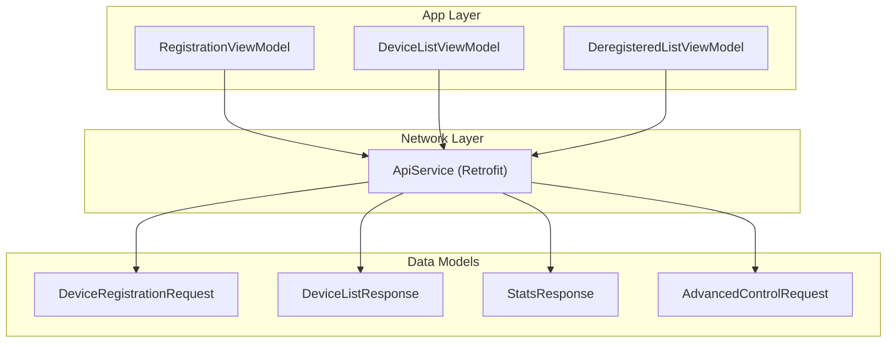
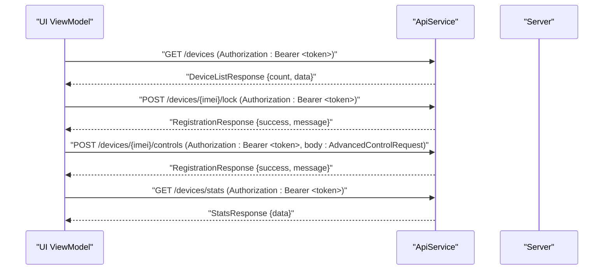
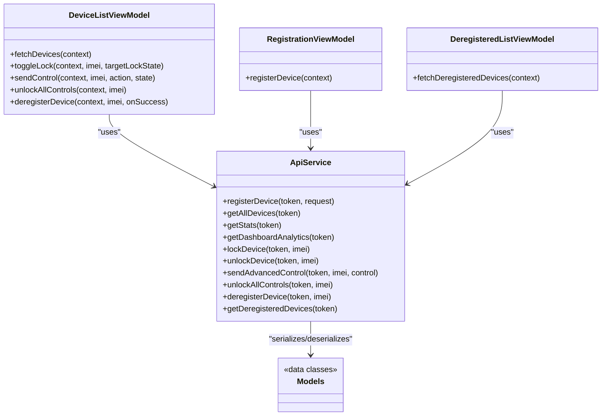

# Device Management Endpoints

<cite>
**Referenced Files in This Document**
- [ApiService.kt](file://app/src/main/java/com/pksafe/lock/manager/data/ApiService.kt)
- [Models.kt](file://app/src/main/java/com/pksafe/lock/manager/data/Models.kt)
- [DeviceListViewModel.kt](file://app/src/main/java/com/pksafe/lock/manager/ui/devices/DeviceListViewModel.kt)
- [RegistrationViewModel.kt](file://app/src/main/java/com/pksafe/lock/manager/ui/registration/RegistrationViewModel.kt)
- [DeregisteredListViewModel.kt](file://app/src/main/java/com/pksafe/lock/manager/ui/deregister/DeregisteredListViewModel.kt)
- [ConnectivityWorker.kt](file://app/src/main/java/com/pksafe/lock/manager/service/ConnectivityWorker.kt)
</cite>

## Table of Contents
1. [Introduction](#introduction)
2. [Project Structure](#project-structure)
3. [Core Components](#core-components)
4. [Architecture Overview](#architecture-overview)
5. [Detailed Component Analysis](#detailed-component-analysis)
6. [Dependency Analysis](#dependency-analysis)
7. [Performance Considerations](#performance-considerations)
8. [Troubleshooting Guide](#troubleshooting-guide)
9. [Conclusion](#conclusion)

## Introduction
This document describes PK Locker’s device management endpoints as used by the Android application to manage the full lifecycle of devices from registration through control, monitoring, and deregistration. It focuses on the Retrofit API surface and how the app consumes these endpoints for shopkeeper workflows such as enrolling devices, retrieving device lists, locking/unlocking devices, applying advanced controls, and performing bulk operations.

## Project Structure
The device management functionality is implemented via a Retrofit interface and consumed by UI ViewModels:
- API definitions are centralized in the ApiService interface.
- Data models define request/response payloads for device registration, device listings, stats, and advanced controls.
- ViewModels orchestrate network calls, handle authentication tokens, and refresh UI state after successful operations.

**Diagram sources**
- [ApiService.kt:19-99](file://app/src/main/java/com/pksafe/lock/manager/data/ApiService.kt#L19-L99)
- [Models.kt:177-219](file://app/src/main/java/com/pksafe/lock/manager/data/Models.kt#L177-L219)

**Section sources**
- [ApiService.kt:19-99](file://app/src/main/java/com/pksafe/lock/manager/data/ApiService.kt#L19-L99)
- [Models.kt:177-219](file://app/src/main/java/com/pksafe/lock/manager/data/Models.kt#L177-L219)

## Core Components
- Registration flow: Collects IMEI, customer details, EMI info, and optional images; sends POST /devices/register with Authorization header.
- Device listing: GET /devices returns a paginated-like response envelope containing count and data array; used to display all devices associated with the authenticated shopkeeper.
- Control endpoints: POST /devices/{imei}/lock and POST /devices/{imei}/unlock toggle device lock state.
- Advanced controls: POST /devices/{imei}/controls applies hardware restrictions, app blocking, and system modification prevention toggles via an action/state payload.
- Monitoring: GET /devices/stats and GET /devices/dashboard-analytics provide business intelligence metrics.
- Lifecycle management: POST /devices/{imei}/deregister removes a device; POST /devices/{imei}/unlock-all clears all active controls for a device.

**Section sources**
- [ApiService.kt:19-99](file://app/src/main/java/com/pksafe/lock/manager/data/ApiService.kt#L19-L99)
- [Models.kt:46-76](file://app/src/main/java/com/pksafe/lock/manager/data/Models.kt#L46-L76)
- [Models.kt:78-101](file://app/src/main/java/com/pksafe/lock/manager/data/Models.kt#L78-L101)
- [Models.kt:23-44](file://app/src/main/java/com/pksafe/lock/manager/data/Models.kt#L23-L44)

## Architecture Overview
The app uses Bearer token authentication for protected endpoints. ViewModels retrieve the token from local storage and attach it to each request. After successful mutations, they refresh the device list or navigate accordingly. Background workers also use the same API to report status updates using advanced controls.

**Diagram sources**
- [DeviceListViewModel.kt:33-41](file://app/src/main/java/com/pksafe/lock/manager/ui/devices/DeviceListViewModel.kt#L33-L41)
- [DeviceListViewModel.kt:143-171](file://app/src/main/java/com/pksafe/lock/manager/ui/devices/DeviceListViewModel.kt#L143-L171)
- [DeviceListViewModel.kt:173-195](file://app/src/main/java/com/pksafe/lock/manager/ui/devices/DeviceListViewModel.kt#L173-L195)
- [ApiService.kt:26-63](file://app/src/main/java/com/pksafe/lock/manager/data/ApiService.kt#L26-L63)

## Detailed Component Analysis

### Endpoint: POST /devices/register
Purpose: Enroll a new device under the authenticated shopkeeper account. Captures IMEI(s), device metadata, customer information, EMI details, and optional images. The server associates the device with the shopkeeper based on the authorization context.

Key behaviors observed in the app:
- Requires Authorization header with Bearer token.
- Request body includes IMEI(s), brand/model/version, customer name/CNIC/phone, product name, EMI fields, FCM token, guarantor info, and base64 images for profile and CNIC proof.
- On success, the app may update FCM token mapping for the newly registered IMEI.

Request example (conceptual):
- Headers: Authorization: Bearer <token>
- Body: imei, imei2?, brand?, model?, androidVersion?, customerName, cnic, phoneNumber, productName?, emiTenure?, totalPrice?, downPayment?, balance?, emiStartDate?, emiAmount?, fcmToken?, guarantor{name,mobile,address,cnicProofImage?}, profilePicture?, cnicProofImage?

Response example (conceptual):
- success: boolean
- message: string
- device?: {id, imei, customerName, smsCodes?}

Error scenarios:
- Missing or invalid token: handled by server; client shows error message.
- Validation failures (e.g., missing required fields): server returns failure; client displays message.

Retry logic:
- The ViewModel does not implement automatic retries; errors are surfaced to the user. Implement exponential backoff at the network layer if needed.

**Section sources**
- [ApiService.kt:20-24](file://app/src/main/java/com/pksafe/lock/manager/data/ApiService.kt#L20-L24)
- [Models.kt:177-219](file://app/src/main/java/com/pksafe/lock/manager/data/Models.kt#L177-L219)
- [RegistrationViewModel.kt:77-156](file://app/src/main/java/com/pksafe/lock/manager/ui/registration/RegistrationViewModel.kt#L77-L156)

### Endpoint: GET /devices
Purpose: Retrieve all devices associated with the authenticated shopkeeper. Returns a response envelope with count and data array.

Filtering and pagination:
- The current interface does not expose query parameters for filtering or pagination. Filtering/pagination would need to be added to the server endpoint and reflected in the ApiService signature.

Request example (conceptual):
- Headers: Authorization: Bearer <token>

Response example (conceptual):
- success: boolean
- count: integer
- data: array of DeviceResponse objects

Error scenarios:
- Unauthorized: missing or invalid token.
- Network errors: connection timeouts or DNS failures.

Retry logic:
- No built-in retry in the ViewModel; consider adding retry with backoff at the Retrofit level.

**Section sources**
- [ApiService.kt:26-29](file://app/src/main/java/com/pksafe/lock/manager/data/ApiService.kt#L26-L29)
- [Models.kt:46-76](file://app/src/main/java/com/pksafe/lock/manager/data/Models.kt#L46-L76)
- [DeviceListViewModel.kt:33-41](file://app/src/main/java/com/pksafe/lock/manager/ui/devices/DeviceListViewModel.kt#L33-L41)

### Endpoint: POST /devices/{imei}/lock
Purpose: Remotely lock a specific device identified by IMEI.

Request example (conceptual):
- Headers: Authorization: Bearer <token>
- Path: imei

Response example (conceptual):
- success: boolean
- message: string
- device?: {id, imei, customerName, smsCodes?}

Error scenarios:
- Invalid IMEI or device not found.
- Unauthorized access.

Retry logic:
- No automatic retry; the UI refreshes the device list after success.

**Section sources**
- [ApiService.kt:46-50](file://app/src/main/java/com/pksafe/lock/manager/data/ApiService.kt#L46-L50)
- [DeviceListViewModel.kt:143-171](file://app/src/main/java/com/pksafe/lock/manager/ui/devices/DeviceListViewModel.kt#L143-L171)

### Endpoint: POST /devices/{imei}/unlock
Purpose: Remotely unlock a specific device identified by IMEI.

Request example (conceptual):
- Headers: Authorization: Bearer <token>
- Path: imei

Response example (conceptual):
- success: boolean
- message: string
- device?: {id, imei, customerName, smsCodes?}

Error scenarios:
- Invalid IMEI or device not found.
- Unauthorized access.

Retry logic:
- No automatic retry; the UI refreshes the device list after success.

**Section sources**
- [ApiService.kt:52-56](file://app/src/main/java/com/pksafe/lock/manager/data/ApiService.kt#L52-L56)
- [DeviceListViewModel.kt:143-171](file://app/src/main/java/com/pksafe/lock/manager/ui/devices/DeviceListViewModel.kt#L143-L171)

### Endpoint: POST /devices/{imei}/controls
Purpose: Apply advanced control operations to a device. Supports toggling hardware restrictions, app blocking, and preventing system modifications via an action/state payload.

Supported actions (observed usage):
- STATUS_UPDATE: Used by background worker to report device online/offline status.
- Other control toggles: The app constructs AdvancedControlRequest(action, state) to apply various restrictions.

Request example (conceptual):
- Headers: Authorization: Bearer <token>
- Path: imei
- Body: {action: string, state: any}

Response example (conceptual):
- success: boolean
- message: string
- device?: {id, imei, customerName, smsCodes?}

Error scenarios:
- Unsupported action or invalid state.
- Unauthorized access.

Retry logic:
- No automatic retry; the UI refreshes the device list after success.

**Section sources**
- [ApiService.kt:58-63](file://app/src/main/java/com/pksafe/lock/manager/data/ApiService.kt#L58-L63)
- [Models.kt:216-219](file://app/src/main/java/com/pksafe/lock/manager/data/Models.kt#L216-L219)
- [DeviceListViewModel.kt:173-195](file://app/src/main/java/com/pksafe/lock/manager/ui/devices/DeviceListViewModel.kt#L173-L195)
- [ConnectivityWorker.kt:49-71](file://app/src/main/java/com/pksafe/lock/manager/service/ConnectivityWorker.kt#L49-L71)

### Endpoint: GET /devices/stats
Purpose: Retrieve statistics for business intelligence related to devices and keys.

Request example (conceptual):
- Headers: Authorization: Bearer <token>

Response example (conceptual):
- success: boolean
- data: DashboardData {android, ios, devices{total, locked, deregistered}, analytics?}

Error scenarios:
- Unauthorized access.

Retry logic:
- No automatic retry; typical dashboard polling can be implemented at the UI layer.

**Section sources**
- [ApiService.kt:36-39](file://app/src/main/java/com/pksafe/lock/manager/data/ApiService.kt#L36-L39)
- [Models.kt:23-44](file://app/src/main/java/com/pksafe/lock/manager/data/Models.kt#L23-L44)

### Endpoint: GET /devices/dashboard-analytics
Purpose: Retrieve detailed analytics for business insights.

Request example (conceptual):
- Headers: Authorization: Bearer <token>

Response example (conceptual):
- success: boolean
- data: DashboardData including analytics.monthlyCollection, collectionRate, highRiskCount, overdueTrend, bestCustomers, deviceStats

Error scenarios:
- Unauthorized access.

Retry logic:
- No automatic retry; consider periodic refresh in the dashboard UI.

**Section sources**
- [ApiService.kt:41-44](file://app/src/main/java/com/pksafe/lock/manager/data/ApiService.kt#L41-L44)
- [Models.kt:23-44](file://app/src/main/java/com/pksafe/lock/manager/data/Models.kt#L23-L44)

### Endpoint: POST /devices/{imei}/deregister
Purpose: Remove a device from active management (deregistration).

Request example (conceptual):
- Headers: Authorization: Bearer <token>
- Path: imei

Response example (conceptual):
- success: boolean
- message: string
- device?: {id, imei, customerName, smsCodes?}

Error scenarios:
- Invalid IMEI or device not found.
- Unauthorized access.

Retry logic:
- No automatic retry; UI navigates or refreshes upon success.

**Section sources**
- [ApiService.kt:95-99](file://app/src/main/java/com/pksafe/lock/manager/data/ApiService.kt#L95-L99)
- [DeviceListViewModel.kt:222-245](file://app/src/main/java/com/pksafe/lock/manager/ui/devices/DeviceListViewModel.kt#L222-L245)

### Endpoint: POST /devices/{imei}/unlock-all
Purpose: Bulk operation to clear all active controls for a device.

Request example (conceptual):
- Headers: Authorization: Bearer <token>
- Path: imei

Response example (conceptual):
- success: boolean
- message: string
- device?: {id, imei, customerName, smsCodes?}

Error scenarios:
- Invalid IMEI or device not found.
- Unauthorized access.

Retry logic:
- No automatic retry; UI refreshes the device list after success.

**Section sources**
- [ApiService.kt:89-93](file://app/src/main/java/com/pksafe/lock/manager/data/ApiService.kt#L89-L93)
- [DeviceListViewModel.kt:197-220](file://app/src/main/java/com/pksafe/lock/manager/ui/devices/DeviceListViewModel.kt#L197-L220)

## Dependency Analysis
The following diagram maps how ViewModels depend on ApiService and data models to execute device management workflows.

**Diagram sources**
- [DeviceListViewModel.kt:18-31](file://app/src/main/java/com/pksafe/lock/manager/ui/devices/DeviceListViewModel.kt#L18-L31)
- [RegistrationViewModel.kt:56-61](file://app/src/main/java/com/pksafe/lock/manager/ui/registration/RegistrationViewModel.kt#L56-L61)
- [DeregisteredListViewModel.kt:22-29](file://app/src/main/java/com/pksafe/lock/manager/ui/deregister/DeregisteredListViewModel.kt#L22-L29)
- [ApiService.kt:19-99](file://app/src/main/java/com/pksafe/lock/manager/data/ApiService.kt#L19-L99)
- [Models.kt:177-219](file://app/src/main/java/com/pksafe/lock/manager/data/Models.kt#L177-L219)

**Section sources**
- [DeviceListViewModel.kt:18-31](file://app/src/main/java/com/pksafe/lock/manager/ui/devices/DeviceListViewModel.kt#L18-L31)
- [ApiService.kt:19-99](file://app/src/main/java/com/pksafe/lock/manager/data/ApiService.kt#L19-L99)
- [Models.kt:177-219](file://app/src/main/java/com/pksafe/lock/manager/data/Models.kt#L177-L219)

## Performance Considerations
- Token handling: All protected endpoints require Authorization headers. Ensure tokens are cached securely and refreshed when expired.
- List refresh strategy: After mutation endpoints (lock/unlock/controls/deregister/unlock-all), the app refreshes the device list to reflect accurate state. Avoid excessive polling; prefer event-driven updates where possible.
- Background reporting: ConnectivityWorker reports device status via advanced controls periodically. Rate-limiting should be considered to avoid unnecessary network load.
- Payload size: Registration includes base64-encoded images; ensure compression or alternative upload strategies for large payloads.

[No sources needed since this section provides general guidance]

## Troubleshooting Guide
Common issues and resolutions:
- Authentication failures: Ensure a valid Bearer token is present in the Authorization header. If missing, prompt re-login.
- Network errors: Handle exceptions gracefully; show user-friendly messages and optionally retry with backoff.
- Invalid IMEI: Validate IMEI format before sending requests; handle server-side validation errors.
- Control failures: Verify action/state combinations are supported; log and surface error messages to users.

Operational notes:
- After successful mutations, the app refreshes device lists to maintain consistency.
- For offline scenarios, the app may rely on local states and sync when connectivity resumes.

**Section sources**
- [DeviceListViewModel.kt:143-171](file://app/src/main/java/com/pksafe/lock/manager/ui/devices/DeviceListViewModel.kt#L143-L171)
- [DeviceListViewModel.kt:173-195](file://app/src/main/java/com/pksafe/lock/manager/ui/devices/DeviceListViewModel.kt#L173-L195)
- [DeviceListViewModel.kt:197-220](file://app/src/main/java/com/pksafe/lock/manager/ui/devices/DeviceListViewModel.kt#L197-L220)
- [DeviceListViewModel.kt:222-245](file://app/src/main/java/com/pksafe/lock/manager/ui/devices/DeviceListViewModel.kt#L222-L245)
- [RegistrationViewModel.kt:77-156](file://app/src/main/java/com/pksafe/lock/manager/ui/registration/RegistrationViewModel.kt#L77-L156)

## Conclusion
PK Locker’s device management endpoints enable comprehensive control over device enrollment, retrieval, locking/unlocking, advanced controls, analytics, and deregistration. The Android app implements these endpoints via a centralized Retrofit interface and consumes them through ViewModels that handle authentication, error handling, and UI state synchronization. To enhance reliability and scalability, consider adding robust retry mechanisms, input validation, and efficient polling strategies.

[No sources needed since this section summarizes without analyzing specific files]