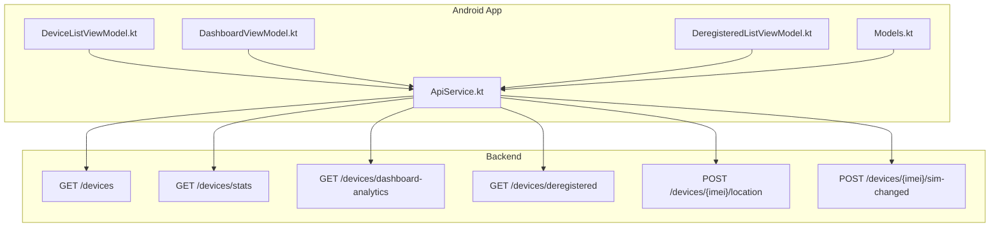
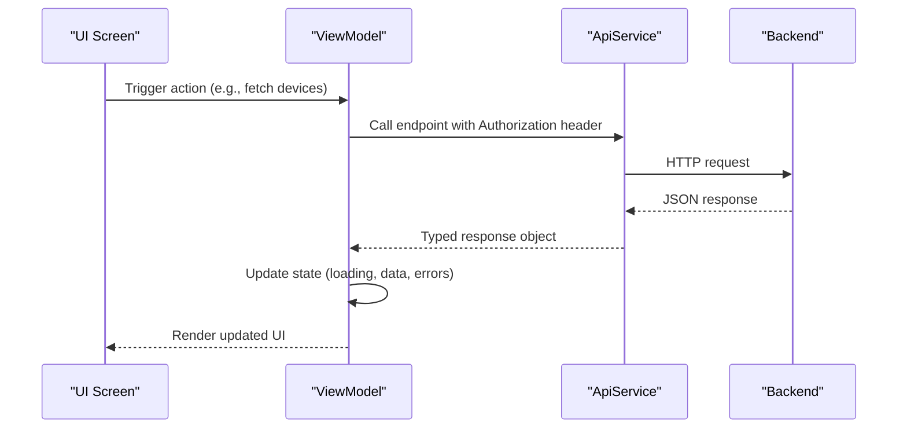
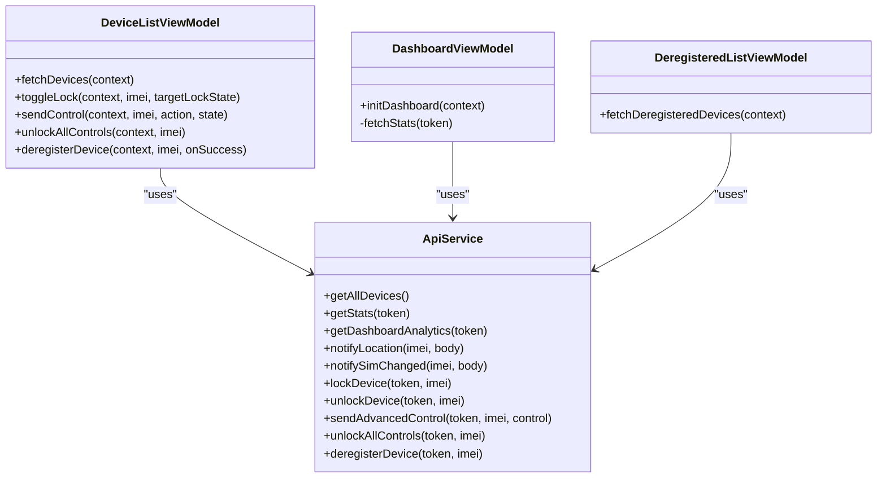

# Device Monitoring and Analytics

<cite>
**Referenced Files in This Document**
- [ApiService.kt](file://app/src/main/java/com/pksafe/lock/manager/data/ApiService.kt)
- [Models.kt](file://app/src/main/java/com/pksafe/lock/manager/data/Models.kt)
- [DeviceListViewModel.kt](file://app/src/main/java/com/pksafe/lock/manager/ui/devices/DeviceListViewModel.kt)
- [DashboardViewModel.kt](file://app/src/main/java/com/pksafe/lock/manager/ui/dashboard/DashboardViewModel.kt)
- [DeregisteredListViewModel.kt](file://app/src/main/java/com/pksafe/lock/manager/ui/deregister/DeregisteredListViewModel.kt)
</cite>

## Table of Contents
1. [Introduction](#introduction)
2. [Project Structure](#project-structure)
3. [Core Components](#core-components)
4. [Architecture Overview](#architecture-overview)
5. [Detailed Component Analysis](#detailed-component-analysis)
6. [Dependency Analysis](#dependency-analysis)
7. [Performance Considerations](#performance-considerations)
8. [Troubleshooting Guide](#troubleshooting-guide)
9. [Conclusion](#conclusion)
10. [Appendices](#appendices)

## Introduction
This document describes PK Locker’s device monitoring and analytics endpoints used by the shopkeeper application to manage devices, track status, and analyze business metrics. It covers:
- Listing devices with filtering support
- Aggregate statistics for active locks and unlock rates
- Dashboard analytics including revenue tracking and lifecycle insights
- Deregistered device management
- Location tracking and SIM change detection
- Examples for dashboard queries, statistical analysis, and real-time monitoring scenarios with error handling and pagination guidance

## Project Structure
The Android app defines API contracts and UI logic that call backend endpoints for device management and analytics. The key files are:
- API interface defining endpoints and request/response types
- Data models describing responses for devices, stats, and analytics
- ViewModels orchestrating network calls and state updates
- Screens invoking ViewModels to render dashboards and device lists

**Diagram sources**
- [ApiService.kt:10-116](file://app/src/main/java/com/pksafe/lock/manager/data/ApiService.kt#L10-L116)
- [Models.kt:22-43](file://app/src/main/java/com/pksafe/lock/manager/data/Models.kt#L22-L43)

**Section sources**
- [ApiService.kt:10-116](file://app/src/main/java/com/pksafe/lock/manager/data/ApiService.kt#L10-L116)
- [Models.kt:22-43](file://app/src/main/java/com/pksafe/lock/manager/data/Models.kt#L22-L43)

## Core Components
- API Interface: Declares endpoints for authentication, device control, analytics, deregistration, location, and SIM change notifications.
- Data Models: Define response structures for stats, analytics, device listings, and EMI schedules.
- ViewModels: Encapsulate network calls, token handling, loading states, and error messages; trigger refreshes after mutations.

Key responsibilities:
- DeviceListViewModel: Fetches all devices, toggles lock/unlock, sends advanced controls, unlocks all controls, and deregisters devices.
- DashboardViewModel: Fetches aggregate stats and displays them on the dashboard.
- DeregisteredListViewModel: Fetches deregistered devices list.

**Section sources**
- [DeviceListViewModel.kt:33-64](file://app/src/main/java/com/pksafe/lock/manager/ui/devices/DeviceListViewModel.kt#L33-L64)
- [DashboardViewModel.kt:32-64](file://app/src/main/java/com/pksafe/lock/manager/ui/dashboard/DashboardViewModel.kt#L32-L64)
- [DeregisteredListViewModel.kt:31-57](file://app/src/main/java/com/pksafe/lock/manager/ui/deregister/DeregisteredListViewModel.kt#L31-L57)

## Architecture Overview
The app uses Retrofit to call backend endpoints defined in ApiService. ViewModels handle authentication tokens from local storage and update UI state based on success or failure. Responses are mapped to strongly typed data classes for consistent consumption across screens.

**Diagram sources**
- [DeviceListViewModel.kt:33-64](file://app/src/main/java/com/pksafe/lock/manager/ui/devices/DeviceListViewModel.kt#L33-L64)
- [DashboardViewModel.kt:46-64](file://app/src/main/java/com/pksafe/lock/manager/ui/dashboard/DashboardViewModel.kt#L46-L64)
- [ApiService.kt:22-44](file://app/src/main/java/com/pksafe/lock/manager/data/ApiService.kt#L22-L44)

## Detailed Component Analysis

### GET /devices — List Devices
Purpose:
- Retrieve all devices associated with the authenticated shopkeeper account.
- Supports client-side filtering by name or IMEI; server-side filters for status, registration date, and model can be added via query parameters if supported by the backend.

Endpoint details:
- Method: GET
- Path: /devices
- Headers: Authorization: Bearer <token>
- Response: List of devices with fields such as imei, customerName, phoneNumber, brand, model, androidVersion, status, registeredAt, and more.

Usage in app:
- DeviceListViewModel.fetchDevices obtains the token from SharedPreferences and calls getAllDevices. On success, it populates the device list; on failure, sets an error message.

Filtering examples:
- Status filter: ?status=Locked or ?status=Unlocked
- Registration date range: ?registeredFrom=YYYY-MM-DD&registeredTo=YYYY-MM-DD
- Model filter: ?model=Pixel%207

Error handling:
- If no token is present, the ViewModel sets an authentication error.
- Network or server errors set a user-friendly message and clear the list.

Pagination:
- If the backend supports pagination, add page and pageSize parameters and handle empty pages gracefully.

**Section sources**
- [ApiService.kt:22-23](file://app/src/main/java/com/pksafe/lock/manager/data/ApiService.kt#L22-L23)
- [DeviceListViewModel.kt:33-64](file://app/src/main/java/com/pksafe/lock/manager/ui/devices/DeviceListViewModel.kt#L33-L64)
- [Models.kt:48-76](file://app/src/main/java/com/pksafe/lock/manager/data/Models.kt#L48-L76)

### GET /devices/stats — Aggregate Statistics
Purpose:
- Obtain aggregate statistics including total devices, locked devices, and deregistered counts.

Endpoint details:
- Method: GET
- Path: /devices/stats
- Headers: Authorization: Bearer <token>
- Response: StatsResponse containing device counts and platform keys usage.

Usage in app:
- DashboardViewModel.fetchStats calls getStats with the Authorization header and updates dashboardData on success.

Metrics available:
- Total devices
- Locked devices
- Deregistered devices
- Platform keys totals, used, and available

Error handling:
- Sets an error message when the response indicates failure or connection issues.

**Section sources**
- [ApiService.kt:25-28](file://app/src/main/java/com/pksafe/lock/manager/data/ApiService.kt#L25-L28)
- [DashboardViewModel.kt:46-64](file://app/src/main/java/com/pksafe/lock/manager/ui/dashboard/DashboardViewModel.kt#L46-L64)
- [Models.kt:22-31](file://app/src/main/java/com/pksafe/lock/manager/data/Models.kt#L22-L31)

### GET /devices/dashboard-analytics — Detailed Analytics
Purpose:
- Provide detailed analytics for business intelligence, including revenue tracking, collection rates, high-risk counts, overdue trends, best customers, and device lifecycle insights.

Endpoint details:
- Method: GET
- Path: /devices/dashboard-analytics
- Headers: Authorization: Bearer <token>
- Response: DashboardAnalytics with fields like monthlyCollection, collectionRate, highRiskCount, overdueTrend, bestCustomers, and deviceStats.

Usage in app:
- The endpoint is declared in ApiService; integration can be wired into DashboardViewModel similarly to stats fetching.

Business insights:
- Monthly collection amount and rate
- High-risk device count
- Overdue trend per month
- Top customers by amount
- Device stats breakdown (locked vs unlocked)

Error handling:
- Handle non-success responses and display appropriate messages.

**Section sources**
- [ApiService.kt:42-44](file://app/src/main/java/com/pksafe/lock/manager/data/ApiService.kt#L42-L44)
- [Models.kt:33-43](file://app/src/main/java/com/pksafe/lock/manager/data/Models.kt#L33-L43)

### GET /devices/deregistered — Deregistered Devices
Purpose:
- Retrieve the list of deregistered devices for lifecycle management and reactivation workflows.

Endpoint details:
- Method: GET
- Path: /devices/deregistered
- Headers: Authorization: Bearer <token>
- Response: List of deregistered devices with device details.

Usage in app:
- DeregisteredListViewModel.fetchDeregisteredDevices calls getDeregisteredDevices and updates the list on success.

Lifecycle operations:
- Deregister a device via POST /devices/{imei}/deregister
- Reactivate by re-registering or using backend-specific reactivation endpoints

Error handling:
- Authentication checks and error messages are handled in the ViewModel.

**Section sources**
- [DeregisteredListViewModel.kt:31-57](file://app/src/main/java/com/pksafe/lock/manager/ui/deregister/DeregisteredListViewModel.kt#L31-L57)
- [ApiService.kt:95-99](file://app/src/main/java/com/pksafe/lock/manager/data/ApiService.kt#L95-L99)

### POST /devices/{imei}/location — Location Tracking
Purpose:
- Report device location for tracking and geofencing features.

Endpoint details:
- Method: POST
- Path: /devices/{imei}/location
- Body: Map containing location coordinates and metadata (e.g., latitude, longitude, timestamp).

Usage in app:
- notifyLocation is defined in ApiService for reporting location updates.

Operational notes:
- Use this endpoint periodically or on significant movement events.
- Ensure proper error handling for network failures and invalid payloads.

**Section sources**
- [ApiService.kt:83-87](file://app/src/main/java/com/pksafe/lock/manager/data/ApiService.kt#L83-L87)

### POST /devices/{imei}/sim-changed — SIM Change Detection
Purpose:
- Notify the backend when a SIM change is detected to enforce policies (e.g., auto-lock).

Endpoint details:
- Method: POST
- Path: /devices/{imei}/sim-changed
- Body: Map containing SIM change details.

Usage in app:
- notifySimChanged is defined in ApiService for SIM change notifications.

Operational notes:
- Combine with auto-lock-on-SIM-change policy if enabled.
- Handle errors and retry strategies appropriately.

**Section sources**
- [ApiService.kt:77-81](file://app/src/main/java/com/pksafe/lock/manager/data/ApiService.kt#L77-L81)

### Additional Device Controls
- Lock/Unlock: POST /devices/{imei}/lock and POST /devices/{imei}/unlock
- Advanced Control: POST /devices/{imei}/controls with action/state payload
- Unlock All Controls: POST /devices/{imei}/unlock-all
- Update FCM Token: POST /devices/update-token and POST /devices/update-shopkeeper-token

These are used by DeviceListViewModel to toggle states and refresh device lists after successful operations.

**Section sources**
- [ApiService.kt:46-75](file://app/src/main/java/com/pksafe/lock/manager/data/ApiService.kt#L46-L75)
- [DeviceListViewModel.kt:143-220](file://app/src/main/java/com/pksafe/lock/manager/ui/devices/DeviceListViewModel.kt#L143-L220)

## Dependency Analysis
The following diagram shows how ViewModels depend on ApiService and how data flows through the system.

**Diagram sources**
- [ApiService.kt:22-116](file://app/src/main/java/com/pksafe/lock/manager/data/ApiService.kt#L22-L116)
- [DeviceListViewModel.kt:33-244](file://app/src/main/java/com/pksafe/lock/manager/ui/devices/DeviceListViewModel.kt#L33-L244)
- [DashboardViewModel.kt:32-64](file://app/src/main/java/com/pksafe/lock/manager/ui/dashboard/DashboardViewModel.kt#L32-L64)
- [DeregisteredListViewModel.kt:31-57](file://app/src/main/java/com/pksafe/lock/manager/ui/deregister/DeregisteredListViewModel.kt#L31-L57)

**Section sources**
- [ApiService.kt:22-116](file://app/src/main/java/com/pksafe/lock/manager/data/ApiService.kt#L22-L116)
- [DeviceListViewModel.kt:33-244](file://app/src/main/java/com/pksafe/lock/manager/ui/devices/DeviceListViewModel.kt#L33-L244)
- [DashboardViewModel.kt:32-64](file://app/src/main/java/com/pksafe/lock/manager/ui/dashboard/DashboardViewModel.kt#L32-L64)
- [DeregisteredListViewModel.kt:31-57](file://app/src/main/java/com/pksafe/lock/manager/ui/deregister/DeregisteredListViewModel.kt#L31-L57)

## Performance Considerations
- Batch requests where possible to reduce network overhead.
- Implement caching for static or infrequently changing data (e.g., device lists) with cache-busting for critical updates.
- Use pagination for large device lists to improve load times and memory usage.
- Debounce location updates to avoid excessive network calls.
- Retry failed requests with exponential backoff for robustness.

[No sources needed since this section provides general guidance]

## Troubleshooting Guide
Common issues and resolutions:
- Authentication required: Ensure a valid token is stored and passed in the Authorization header.
- Server errors: Check response codes and messages; log and display user-friendly errors.
- Connection failures: Implement retry logic and offline fallbacks where applicable.
- Empty lists: Verify backend availability and ensure proper filtering parameters.

Operational tips:
- After lock/unlock actions, always refresh the device list to reflect accurate state.
- For deregistration, confirm success before updating UI and provide feedback to users.

**Section sources**
- [DeviceListViewModel.kt:33-64](file://app/src/main/java/com/pksafe/lock/manager/ui/devices/DeviceListViewModel.kt#L33-L64)
- [DashboardViewModel.kt:46-64](file://app/src/main/java/com/pksafe/lock/manager/ui/dashboard/DashboardViewModel.kt#L46-L64)
- [DeregisteredListViewModel.kt:31-57](file://app/src/main/java/com/pksafe/lock/manager/ui/deregister/DeregisteredListViewModel.kt#L31-L57)

## Conclusion
PK Locker’s device monitoring and analytics endpoints enable comprehensive management and insight into device lifecycles, operational status, and business performance. The Android app integrates these endpoints through a clean API layer and reactive ViewModels, providing a responsive and reliable user experience. Proper error handling, pagination, and performance optimizations ensure scalability and maintainability.

[No sources needed since this section summarizes without analyzing specific files]

## Appendices

### Example Scenarios

#### Dashboard Queries
- Fetch aggregate stats: GET /devices/stats with Authorization header.
- Fetch detailed analytics: GET /devices/dashboard-analytics with Authorization header.
- Display platform keys usage and device counts on the dashboard.

#### Statistical Analysis
- Compute unlock rates from stats: unlocked = total - locked; unlock rate = unlocked / total.
- Track overdue trends from dashboard analytics to identify risk patterns.
- Monitor high-risk counts to prioritize interventions.

#### Real-Time Monitoring
- Periodically poll GET /devices to detect status changes.
- Report location updates via POST /devices/{imei}/location.
- Notify SIM changes via POST /devices/{imei}/sim-changed to enforce policies.

#### Error Handling and Pagination
- Validate tokens and handle missing credentials gracefully.
- Implement pagination parameters (page, pageSize) for large datasets.
- Show loading indicators and error messages during network operations.

[No sources needed since this section provides general guidance]