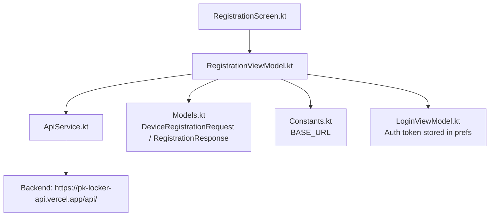
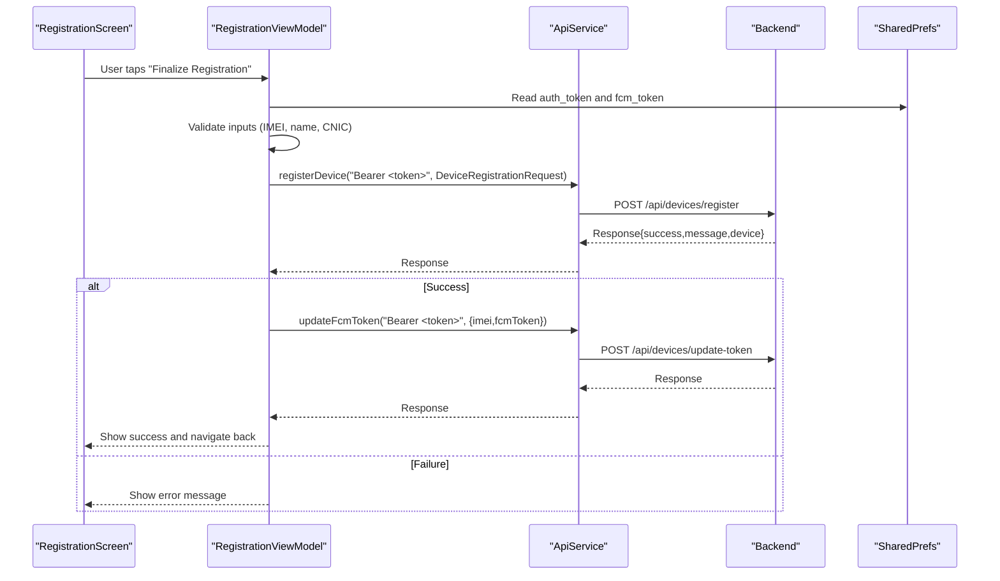
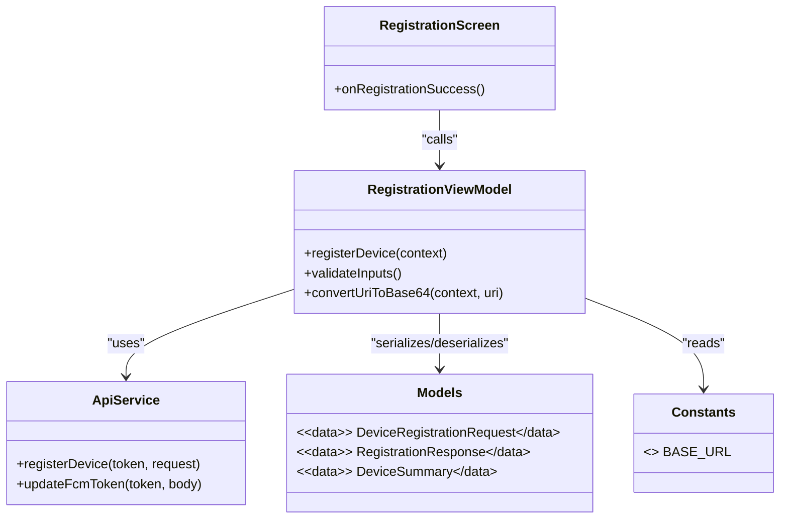

# Device Registration Endpoints

<cite>
**Referenced Files in This Document**
- [ApiService.kt](file://app/src/main/java/com/pksafe/lock/manager/data/ApiService.kt)
- [Models.kt](file://app/src/main/java/com/pksafe/lock/manager/data/Models.kt)
- [RegistrationViewModel.kt](file://app/src/main/java/com/pksafe/lock/manager/ui/registration/RegistrationViewModel.kt)
- [RegistrationScreen.kt](file://app/src/main/java/com/pksafe/lock/manager/ui/registration/RegistrationScreen.kt)
- [Constants.kt](file://app/src/main/java/com/pksafe/lock/manager/util/Constants.kt)
- [LoginViewModel.kt](file://app/src/main/java/com/pksafe/lock/manager/ui/login/LoginViewModel.kt)
</cite>

## Table of Contents
1. Introduction
2. Project Structure
3. Core Components
4. Architecture Overview
5. Detailed Component Analysis
6. Dependency Analysis
7. Performance Considerations
8. Troubleshooting Guide
9. Conclusion

## Introduction
This document describes PK Locker’s device registration endpoints with a focus on the POST /devices/register flow used by shopkeepers to enroll devices. It covers authentication requirements, request and response schemas, data collected during enrollment (IMEI, model, OS version, customer details), FCM token handling, error scenarios, and retry/error handling patterns implemented in the Android client.

## Project Structure
The device registration feature is implemented in the Android app using Retrofit for HTTP calls and Compose UI for the registration screen. The key files are:
- API interface defining the registerDevice endpoint and related services
- Data models for request/response payloads
- View model orchestrating validation, network calls, and post-registration steps
- Screen composing the user inputs and triggering registration
- Constants providing the base URL for the backend

**Diagram sources**
- [RegistrationScreen.kt:248-269](file://app/src/main/java/com/pksafe/lock/manager/ui/registration/RegistrationScreen.kt#L248-L269)
- [RegistrationViewModel.kt:77-156](file://app/src/main/java/com/pksafe/lock/manager/ui/registration/RegistrationViewModel.kt#L77-L156)
- [ApiService.kt:20-24](file://app/src/main/java/com/pksafe/lock/manager/data/ApiService.kt#L20-L24)
- [Models.kt:177-215](file://app/src/main/java/com/pksafe/lock/manager/data/Models.kt#L177-L215)
- [Constants.kt:3-9](file://app/src/main/java/com/pksafe/lock/manager/util/Constants.kt#L3-L9)
- [LoginViewModel.kt:46-58](file://app/src/main/java/com/pksafe/lock/manager/ui/login/LoginViewModel.kt#L46-L58)

**Section sources**
- [ApiService.kt:20-24](file://app/src/main/java/com/pksafe/lock/manager/data/ApiService.kt#L20-L24)
- [Models.kt:177-215](file://app/src/main/java/com/pksafe/lock/manager/data/Models.kt#L177-L215)
- [RegistrationViewModel.kt:77-156](file://app/src/main/java/com/pksafe/lock/manager/ui/registration/RegistrationViewModel.kt#L77-L156)
- [RegistrationScreen.kt:248-269](file://app/src/main/java/com/pksafe/lock/manager/ui/registration/RegistrationScreen.kt#L248-L269)
- [Constants.kt:3-9](file://app/src/main/java/com/pksafe/lock/manager/util/Constants.kt#L3-L9)
- [LoginViewModel.kt:46-58](file://app/src/main/java/com/pksafe/lock/manager/ui/login/LoginViewModel.kt#L46-L58)

## Core Components
- Endpoint: POST /devices/register
  - Defined in ApiService with Authorization header and JSON body
- Request schema: DeviceRegistrationRequest
  - Includes IMEI(s), device metadata, customer identity, financial terms, optional images, and guarantor info
- Response schema: RegistrationResponse
  - Contains success flag, message, and minimal device summary including SMS codes when available
- Authentication: Authorization header with Bearer token obtained from shopkeeper login
- Post-registration: Optional FCM token update for the newly registered IMEI

**Section sources**
- [ApiService.kt:20-24](file://app/src/main/java/com/pksafe/lock/manager/data/ApiService.kt#L20-L24)
- [Models.kt:177-215](file://app/src/main/java/com/pksafe/lock/manager/data/Models.kt#L177-L215)
- [LoginViewModel.kt:46-58](file://app/src/main/java/com/pksafe/lock/manager/ui/login/LoginViewModel.kt#L46-L58)

## Architecture Overview
The registration flow starts at the UI, validates inputs, builds a request payload, sends it via Retrofit with an Authorization header, and handles success or failure states. On success, the view model may update the FCM token for the device.

**Diagram sources**
- [RegistrationScreen.kt:248-269](file://app/src/main/java/com/pksafe/lock/manager/ui/registration/RegistrationScreen.kt#L248-L269)
- [RegistrationViewModel.kt:77-156](file://app/src/main/java/com/pksafe/lock/manager/ui/registration/RegistrationViewModel.kt#L77-L156)
- [ApiService.kt:20-24](file://app/src/main/java/com/pksafe/lock/manager/data/ApiService.kt#L20-L24)
- [ApiService.kt:65-69](file://app/src/main/java/com/pksafe/lock/manager/data/ApiService.kt#L65-L69)
- [Constants.kt:3-9](file://app/src/main/java/com/pksafe/lock/manager/util/Constants.kt#L3-L9)

## Detailed Component Analysis

### Endpoint: POST /devices/register
- Path: /devices/register
- Method: POST
- Headers: Authorization: Bearer <shopkeeper_token>
- Body: DeviceRegistrationRequest
- Response: RegistrationResponse

Authentication
- The Authorization header must contain a valid shopkeeper token. The token is retrieved from local preferences after successful login.

Request fields (DeviceRegistrationRequest)
- imei: Primary device identifier (required by client validation)
- imei2: Secondary IMEI (optional)
- brand: Device brand (optional)
- model: Device model (optional)
- androidVersion: OS version string (optional)
- customerName: Customer full name (required by client validation)
- cnic: National ID number (validated length by client)
- phoneNumber: Contact phone (optional)
- productName: Product/model name (optional)
- totalPrice, downPayment, balance: Financial terms (optional; balance computed if needed)
- emiTenure, emiStartDate, emiAmount: EMI schedule fields (optional)
- fcmToken: Optional FCM token associated with the device
- profilePicture, cnicProofImage: Base64-encoded images (optional)
- guarantor: Guarantor object with name, mobile, address, and optional CNIC proof image (optional)

Response fields (RegistrationResponse)
- success: Boolean indicating outcome
- message: Human-readable status or error message
- device: Optional DeviceSummary containing id, imei, customerName, and smsCodes (when provided)

Notes
- The client constructs the request from form inputs and performs numeric cleaning and EMI calculations before sending.
- On success, the client optionally updates the FCM token for the newly registered IMEI.

**Section sources**
- [ApiService.kt:20-24](file://app/src/main/java/com/pksafe/lock/manager/data/ApiService.kt#L20-L24)
- [Models.kt:177-215](file://app/src/main/java/com/pksafe/lock/manager/data/Models.kt#L177-L215)
- [RegistrationViewModel.kt:91-156](file://app/src/main/java/com/pksafe/lock/manager/ui/registration/RegistrationViewModel.kt#L91-L156)

### Client-side Validation and Input Handling
- Required checks enforced in the view model:
  - IMEI must not be blank
  - Customer name must not be blank
  - CNIC length must meet minimum threshold
- Numeric fields are cleaned (commas/spaces removed) and parsed safely with defaults.
- Images are converted to Base64 strings before inclusion in the request.

Error messages are surfaced to the UI via a message state and success/failure flags.

**Section sources**
- [RegistrationViewModel.kt:165-179](file://app/src/main/java/com/pksafe/lock/manager/ui/registration/RegistrationViewModel.kt#L165-L179)
- [RegistrationViewModel.kt:91-156](file://app/src/main/java/com/pksafe/lock/manager/ui/registration/RegistrationViewModel.kt#L91-L156)
- [RegistrationScreen.kt:248-269](file://app/src/main/java/com/pksafe/lock/manager/ui/registration/RegistrationScreen.kt#L248-L269)

### FCM Token Registration Flow
- After a successful registration, if an FCM token is available locally, the client calls updateFcmToken with the IMEI and token.
- This ensures the server can push notifications to the device post-enrollment.

**Section sources**
- [ApiService.kt:65-69](file://app/src/main/java/com/pksafe/lock/manager/data/ApiService.kt#L65-L69)
- [RegistrationViewModel.kt:131-147](file://app/src/main/java/com/pksafe/lock/manager/ui/registration/RegistrationViewModel.kt#L131-L147)

### Authentication Requirements
- Shopkeeper login stores a token in shared preferences under a specific key.
- The registerDevice call prepends “Bearer ” to the token when setting the Authorization header.

**Section sources**
- [LoginViewModel.kt:46-58](file://app/src/main/java/com/pksafe/lock/manager/ui/login/LoginViewModel.kt#L46-L58)
- [RegistrationViewModel.kt:77-86](file://app/src/main/java/com/pksafe/lock/manager/ui/registration/RegistrationViewModel.kt#L77-L86)
- [ApiService.kt:20-24](file://app/src/main/java/com/pksafe/lock/manager/data/ApiService.kt#L20-L24)

### Error Scenarios and Handling
- Missing or invalid input:
  - The client prevents submission if required fields are missing or invalid and shows an error message.
- Network failures:
  - Exceptions are caught and surfaced to the UI with a generic error message.
- Server errors:
  - If the response indicates failure, the message field is displayed to the user.

Retry logic
- The current implementation does not implement automatic retries. Errors are presented to the user for manual retry.

Note on duplicate IMEI and invalid formats
- These validations are typically enforced server-side. The client relies on the response message to inform users about such issues.

**Section sources**
- [RegistrationViewModel.kt:144-156](file://app/src/main/java/com/pksafe/lock/manager/ui/registration/RegistrationViewModel.kt#L144-L156)
- [RegistrationViewModel.kt:165-179](file://app/src/main/java/com/pksafe/lock/manager/ui/registration/RegistrationViewModel.kt#L165-L179)

### Example Flows

Successful registration
- Steps:
  - User fills device and customer details, scans or enters IMEI, and submits.
  - Client validates inputs, reads auth token, and calls registerDevice.
  - Backend responds with success and device summary.
  - Client optionally updates FCM token and navigates back.

Failure due to network error
- Steps:
  - An exception occurs during the network call.
  - Client sets failure state and displays a connection error message.

Failure due to server validation (e.g., duplicate IMEI or invalid format)
- Steps:
  - The server returns success=false with a descriptive message.
  - Client displays the message to the user.

[No sources needed since this section provides conceptual examples]

## Dependency Analysis
- RegistrationScreen depends on RegistrationViewModel to orchestrate business logic.
- RegistrationViewModel depends on:
  - ApiService for network operations
  - Models for request/response types
  - Shared preferences for tokens and FCM token
  - Constants for BASE_URL
- ApiService defines the endpoint contract and uses Gson serialization.

**Diagram sources**
- [RegistrationScreen.kt:248-269](file://app/src/main/java/com/pksafe/lock/manager/ui/registration/RegistrationScreen.kt#L248-L269)
- [RegistrationViewModel.kt:77-156](file://app/src/main/java/com/pksafe/lock/manager/ui/registration/RegistrationViewModel.kt#L77-L156)
- [ApiService.kt:20-24](file://app/src/main/java/com/pksafe/lock/manager/data/ApiService.kt#L20-L24)
- [Models.kt:177-215](file://app/src/main/java/com/pksafe/lock/manager/data/Models.kt#L177-L215)
- [Constants.kt:3-9](file://app/src/main/java/com/pksafe/lock/manager/util/Constants.kt#L3-L9)

**Section sources**
- [RegistrationScreen.kt:248-269](file://app/src/main/java/com/pksafe/lock/manager/ui/registration/RegistrationScreen.kt#L248-L269)
- [RegistrationViewModel.kt:77-156](file://app/src/main/java/com/pksafe/lock/manager/ui/registration/RegistrationViewModel.kt#L77-L156)
- [ApiService.kt:20-24](file://app/src/main/java/com/pksafe/lock/manager/data/ApiService.kt#L20-L24)
- [Models.kt:177-215](file://app/src/main/java/com/pksafe/lock/manager/data/Models.kt#L177-L215)
- [Constants.kt:3-9](file://app/src/main/java/com/pksafe/lock/manager/util/Constants.kt#L3-L9)

## Performance Considerations
- Keep request payloads concise; avoid large Base64 images unless necessary.
- Ensure network calls are executed off the main thread (Retrofit suspend functions handle this).
- Avoid redundant FCM token updates; only send when a token is present and relevant.

[No sources needed since this section provides general guidance]

## Troubleshooting Guide
Common issues and how they are handled in the client:
- Missing authorization token:
  - The view model checks for a stored token and prompts the user to log in again if absent.
- Invalid inputs:
  - Validation prevents submission and shows specific messages (IMEI, name, CNIC).
- Network errors:
  - Exceptions are caught and displayed; no automatic retry is implemented.
- Server-side validation failures:
  - The response message is shown to the user; typical cases include duplicate IMEI or invalid formats.

Recommended actions:
- Verify connectivity and server availability.
- Re-login if the token is missing or expired.
- Correct any invalid inputs and retry.
- For persistent failures, check server logs for detailed error messages.

**Section sources**
- [RegistrationViewModel.kt:77-86](file://app/src/main/java/com/pksafe/lock/manager/ui/registration/RegistrationViewModel.kt#L77-L86)
- [RegistrationViewModel.kt:144-156](file://app/src/main/java/com/pksafe/lock/manager/ui/registration/RegistrationViewModel.kt#L144-L156)
- [RegistrationViewModel.kt:165-179](file://app/src/main/java/com/pksafe/lock/manager/ui/registration/RegistrationViewModel.kt#L165-L179)

## Conclusion
PK Locker’s device registration endpoint enables shopkeepers to enroll devices securely with proper authentication and rich metadata. The Android client enforces input validation, manages authentication tokens, and handles errors gracefully. While automatic retry logic is not implemented, the client surfaces clear feedback to guide users through corrective actions. Successful registrations may also synchronize FCM tokens to enable remote notifications.

[No sources needed since this section summarizes without analyzing specific files]