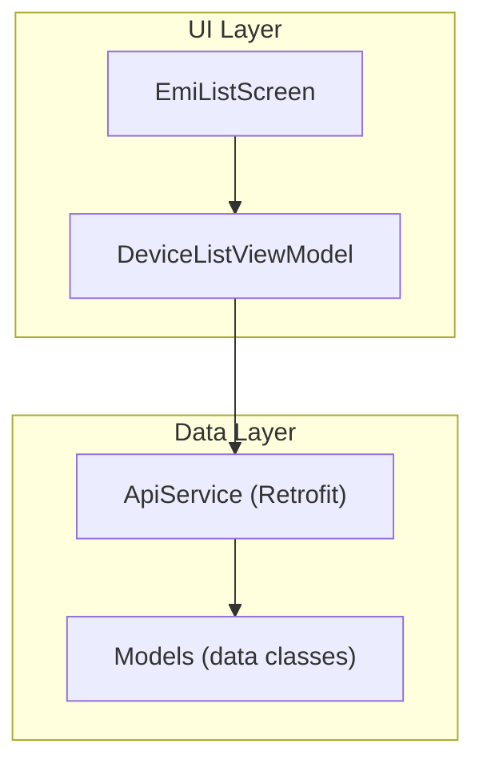
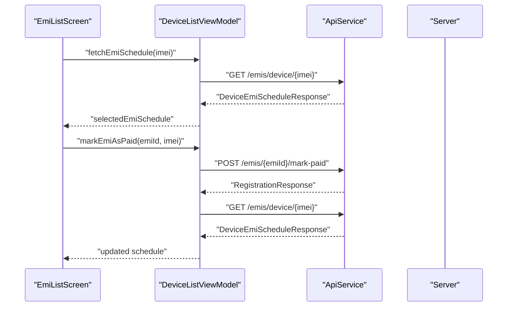
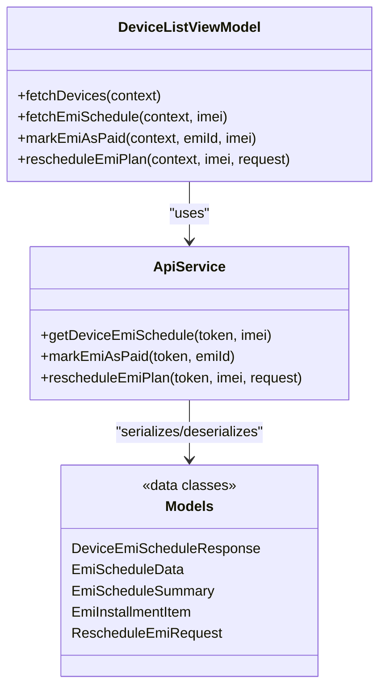

# EMI Management Endpoints

<cite>
**Referenced Files in This Document**
- [ApiService.kt](file://app/src/main/java/com/pksafe/lock/manager/data/ApiService.kt)
- [Models.kt](file://app/src/main/java/com/pksafe/lock/manager/data/Models.kt)
- [DeviceListViewModel.kt](file://app/src/main/java/com/pksafe/lock/manager/ui/devices/DeviceListViewModel.kt)
- [EmiListScreen.kt](file://app/src/main/java/com/pksafe/lock/manager/ui/emi/EmiListScreen.kt)
</cite>

## Table of Contents
1. [Introduction](#introduction)
2. [Project Structure](#project-structure)
3. [Core Components](#core-components)
4. [Architecture Overview](#architecture-overview)
5. [Detailed Component Analysis](#detailed-component-analysis)
6. [Dependency Analysis](#dependency-analysis)
7. [Performance Considerations](#performance-considerations)
8. [Troubleshooting Guide](#troubleshooting-guide)
9. [Conclusion](#conclusion)

## Introduction
This document describes PK Locker’s EMI management endpoints and their usage within the Android application. It focuses on:
- Retrieving EMI schedules for a device by IMEI
- Marking an individual EMI payment as completed
- Rescheduling EMI plans (tenure, amount, balance adjustments)

It also outlines request/response schemas derived from the app’s data models, typical workflows, error handling patterns, and integration points with payment gateways and notifications used elsewhere in the app.

## Project Structure
The EMI functionality is implemented across:
- API definitions for EMI endpoints
- Data models representing EMI schedules, summaries, and installments
- A ViewModel orchestrating calls to fetch schedules, mark payments, and reschedule plans
- UI screens that display upcoming EMIs and trigger actions

**Diagram sources**
- [ApiService.kt:111-129](file://app/src/main/java/com/pksafe/lock/manager/data/ApiService.kt#L111-L129)
- [Models.kt:123-173](file://app/src/main/java/com/pksafe/lock/manager/data/Models.kt#L123-L173)
- [DeviceListViewModel.kt:66-141](file://app/src/main/java/com/pksafe/lock/manager/ui/devices/DeviceListViewModel.kt#L66-L141)
- [EmiListScreen.kt:37-98](file://app/src/main/java/com/pksafe/lock/manager/ui/emi/EmiListScreen.kt#L37-L98)

**Section sources**
- [ApiService.kt:111-129](file://app/src/main/java/com/pksafe/lock/manager/data/ApiService.kt#L111-L129)
- [Models.kt:123-173](file://app/src/main/java/com/pksafe/lock/manager/data/Models.kt#L123-L173)
- [DeviceListViewModel.kt:66-141](file://app/src/main/java/com/pksafe/lock/manager/ui/devices/DeviceListViewModel.kt#L66-L141)
- [EmiListScreen.kt:37-98](file://app/src/main/java/com/pksafe/lock/manager/ui/emi/EmiListScreen.kt#L37-L98)

## Core Components
- ApiService defines three EMI-related endpoints:
  - GET /emis/device/{imei}
  - POST /emis/{emiId}/mark-paid
  - POST /emis/device/{imei}
- Models define EMI schedule responses, installment items, summaries, and reschedule request payloads.
- DeviceListViewModel implements:
  - Fetching EMI schedules per IMEI
  - Marking an EMI as paid
  - Rescheduling EMI plans
- EmiListScreen provides the UI for viewing upcoming EMIs and triggering “Mark as Paid”.

**Section sources**
- [ApiService.kt:111-129](file://app/src/main/java/com/pksafe/lock/manager/data/ApiService.kt#L111-L129)
- [Models.kt:123-173](file://app/src/main/java/com/pksafe/lock/manager/data/Models.kt#L123-L173)
- [DeviceListViewModel.kt:66-141](file://app/src/main/java/com/pksafe/lock/manager/ui/devices/DeviceListViewModel.kt#L66-L141)
- [EmiListScreen.kt:100-214](file://app/src/main/java/com/pksafe/lock/manager/ui/emi/EmiListScreen.kt#L100-L214)

## Architecture Overview
The EMI flow uses Retrofit to call backend endpoints defined in ApiService. The ViewModel handles authentication tokens, network calls, and state updates. UI components consume this state to render schedules and trigger actions.

**Diagram sources**
- [DeviceListViewModel.kt:70-117](file://app/src/main/java/com/pksafe/lock/manager/ui/devices/DeviceListViewModel.kt#L70-L117)
- [ApiService.kt:111-122](file://app/src/main/java/com/pksafe/lock/manager/data/ApiService.kt#L111-L122)

## Detailed Component Analysis

### Endpoint: GET /emis/device/{imei}
Purpose: Retrieve the full EMI schedule for a device identified by IMEI, including summary and installment list.

Request
- Method: GET
- Path: /emis/device/{imei}
- Headers: Authorization: Bearer {token}
- Path parameter:
  - imei: string

Response
- success: boolean
- data: EmiScheduleData
  - imei: string
  - customerName: string
  - totalPrice: number
  - downPayment: number
  - balance: number
  - summary: EmiScheduleSummary
    - total: integer
    - paid: integer
    - unpaid: integer
    - paidTotal: number
    - unpaidTotal: number
  - schedule: List<EmiInstallmentItem>
    - _id: string
    - installmentNumber: integer
    - dueDate: string (ISO date-time)
    - amount: number
    - status: string (e.g., "Paid", "Unpaid")

Usage in app
- ViewModel fetches schedule and stores it in selectedEmiSchedule for UI consumption.

Error handling
- Network or server errors set errorMessage; UI can show connection or server error messages.

**Section sources**
- [ApiService.kt:111-116](file://app/src/main/java/com/pksafe/lock/manager/data/ApiService.kt#L111-L116)
- [Models.kt:123-147](file://app/src/main/java/com/pksafe/lock/manager/data/Models.kt#L123-L147)
- [DeviceListViewModel.kt:70-91](file://app/src/main/java/com/pksafe/lock/manager/ui/devices/DeviceListViewModel.kt#L70-L91)

### Endpoint: POST /emis/{emiId}/mark-paid
Purpose: Mark a specific EMI installment as paid. After marking, the client refreshes the schedule to reflect updated status.

Request
- Method: POST
- Path: /emis/{emiId}/mark-paid
- Headers: Authorization: Bearer {token}
- Path parameter:
  - emiId: string

Response
- success: boolean
- message: string
- device: DeviceSummary (optional)

Behavior
- On success, the ViewModel re-fetches the schedule for the same IMEI and refreshes the device list to keep totals consistent.

Error handling
- If response.success is false, errorMessage is set using the server-provided message.
- Exceptions are caught and surfaced as connection errors.

**Section sources**
- [ApiService.kt:118-122](file://app/src/main/java/com/pksafe/lock/manager/data/ApiService.kt#L118-L122)
- [Models.kt:205-215](file://app/src/main/java/com/pksafe/lock/manager/data/Models.kt#L205-L215)
- [DeviceListViewModel.kt:93-117](file://app/src/main/java/com/pksafe/lock/manager/ui/devices/DeviceListViewModel.kt#L93-L117)

### Endpoint: POST /emis/device/{imei}
Purpose: Reschedule an EMI plan for a device. Allows adjusting tenure, amounts, and recalculating balances.

Request
- Method: POST
- Path: /emis/device/{imei}
- Headers: Authorization: Bearer {token}
- Path parameter:
  - imei: string
- Body: RescheduleEmiRequest
  - emiTenure: integer
  - emiAmount: number
  - totalPrice: number
  - downPayment: number
  - balance: number
  - emiStartDate: string? (optional ISO date-time)

Response
- success: boolean
- message: string
- device: DeviceSummary (optional)

Behavior
- On success, the ViewModel re-fetches the schedule and refreshes the device list.

Error handling
- Errors surface via errorMessage with server message or connection error.

**Section sources**
- [ApiService.kt:124-129](file://app/src/main/java/com/pksafe/lock/manager/data/ApiService.kt#L124-L129)
- [Models.kt:226-233](file://app/src/main/java/com/pksafe/lock/manager/data/Models.kt#L226-L233)
- [DeviceListViewModel.kt:119-141](file://app/src/main/java/com/pksafe/lock/manager/ui/devices/DeviceListViewModel.kt#L119-L141)

### Request/Response Schemas
- EMI Schedule Response: DeviceEmiScheduleResponse containing EmiScheduleData with summary and schedule list.
- Installment Item: EmiInstallmentItem includes id, installmentNumber, dueDate, amount, status.
- Reschedule Request: RescheduleEmiRequest includes tenure, amounts, and optional start date.

These types are defined in the data models and consumed by the ViewModel and UI.

**Section sources**
- [Models.kt:123-147](file://app/src/main/java/com/pksafe/lock/manager/data/Models.kt#L123-L147)
- [Models.kt:226-233](file://app/src/main/java/com/pksafe/lock/manager/data/Models.kt#L226-L233)

### Payment Gateway Integration and Receipts
- The app integrates with a key-order payment gateway via:
  - Checkout endpoint returning orderId, amount, tracker, and checkoutUrl
  - Verification endpoint to confirm payment
  - Wallet pay endpoint supporting mobile wallets
- While these are not EMI-specific, they demonstrate the pattern for payment initiation and verification used elsewhere in the app.

Notes
- For EMI payments, the mark-paid endpoint is used to record completion.
- Receipt generation is not explicitly modeled in the EMI endpoints; however, similar key-order flows include fields like paymentProofImage in related models.

**Section sources**
- [ApiService.kt:132-154](file://app/src/main/java/com/pksafe/lock/manager/data/ApiService.kt#L132-L154)
- [Models.kt:201-211](file://app/src/main/java/com/pksafe/lock/manager/data/Models.kt#L201-L211)
- [Models.kt:221-232](file://app/src/main/java/com/pksafe/lock/manager/data/Models.kt#L221-L232)

### Automated Reminders and Notifications
- The app includes Firebase messaging services and notification channels for critical alerts.
- These mechanisms can be leveraged to send reminders for upcoming or overdue EMIs, though EMI-specific reminder logic is not present in the examined files.

**Section sources**
- [MyFirebaseMessagingService.kt:248-282](file://app/src/main/java/com/pksafe/lock/manager/service/MyFirebaseMessagingService.kt#L248-L282)

## Dependency Analysis
- UI depends on ViewModel for state and actions.
- ViewModel depends on ApiService for network operations.
- ApiService depends on Retrofit and data models for serialization/deserialization.
- Models define the contract between client and server for EMI operations.

**Diagram sources**
- [DeviceListViewModel.kt:18-31](file://app/src/main/java/com/pksafe/lock/manager/ui/devices/DeviceListViewModel.kt#L18-L31)
- [ApiService.kt:111-129](file://app/src/main/java/com/pksafe/lock/manager/data/ApiService.kt#L111-L129)
- [Models.kt:123-173](file://app/src/main/java/com/pksafe/lock/manager/data/Models.kt#L123-L173)
- [Models.kt:226-233](file://app/src/main/java/com/pksafe/lock/manager/data/Models.kt#L226-L233)

**Section sources**
- [DeviceListViewModel.kt:18-31](file://app/src/main/java/com/pksafe/lock/manager/ui/devices/DeviceListViewModel.kt#L18-L31)
- [ApiService.kt:111-129](file://app/src/main/java/com/pksafe/lock/manager/data/ApiService.kt#L111-L129)
- [Models.kt:123-173](file://app/src/main/java/com/pksafe/lock/manager/data/Models.kt#L123-L173)
- [Models.kt:226-233](file://app/src/main/java/com/pksafe/lock/manager/data/Models.kt#L226-L233)

## Performance Considerations
- Use caching strategies for EMI schedules to reduce repeated network calls when navigating back to the screen.
- Debounce rapid reschedule requests to avoid redundant recalculations.
- Batch UI updates after successful mark-paid and reschedule operations to minimize reflows.
- Ensure token retrieval is efficient and cached securely to avoid repeated lookups.

[No sources needed since this section provides general guidance]

## Troubleshooting Guide
Common issues and handling patterns:
- Authentication missing: ViewModel checks for token before making calls; shows “Authentication required” if absent.
- Network failures: Exceptions are caught and errorMessage is set; UI should display connection errors.
- Server errors: When response.success is false, errorMessage is populated with server message; handle gracefully in UI.
- Post-action refresh: After mark-paid or reschedule, the ViewModel re-fetches schedule and device list to ensure consistency.

Operational tips:
- Validate inputs (IMEI, emiId) before calling endpoints.
- Provide user feedback during loading states (isFetchingEmi).
- Log detailed errors for debugging while keeping user-facing messages concise.

**Section sources**
- [DeviceListViewModel.kt:33-64](file://app/src/main/java/com/pksafe/lock/manager/ui/devices/DeviceListViewModel.kt#L33-L64)
- [DeviceListViewModel.kt:70-141](file://app/src/main/java/com/pksafe/lock/manager/ui/devices/DeviceListViewModel.kt#L70-L141)

## Conclusion
PK Locker’s EMI management endpoints provide a clear interface for retrieving schedules, marking payments, and rescheduling plans. The app’s architecture cleanly separates UI, state management, and networking layers, enabling robust handling of success and error cases. While EMI-specific receipt generation and automated reminders are not fully implemented in the examined code, the existing payment and notification infrastructure offers a foundation for extending these capabilities.

[No sources needed since this section summarizes without analyzing specific files]