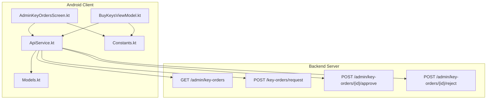
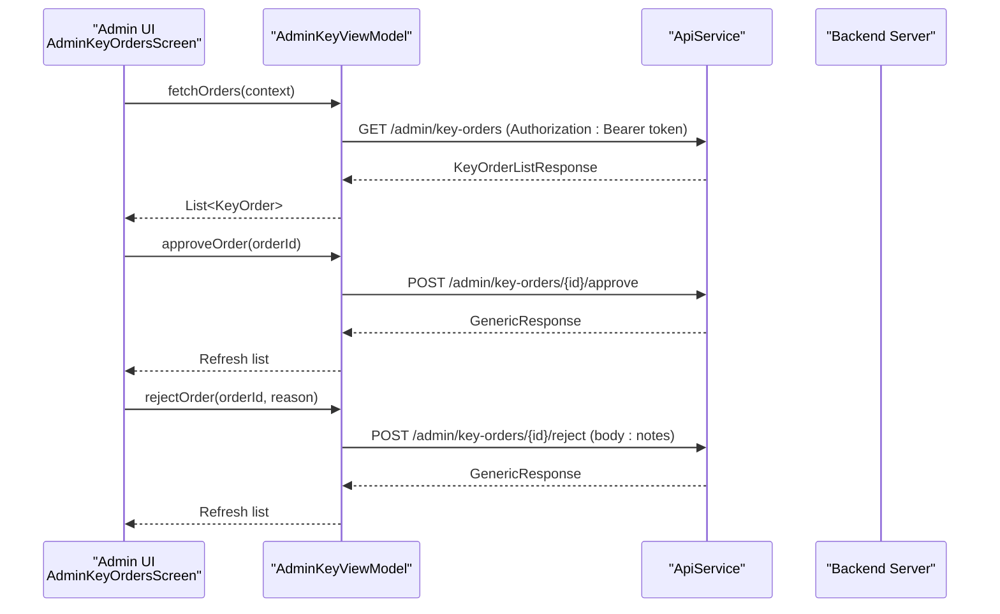
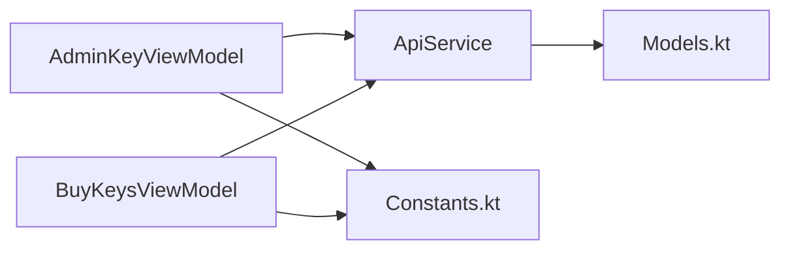

# Admin Key Management Endpoints

<cite>
**Referenced Files in This Document**
- [ApiService.kt](file://app/src/main/java/com/pksafe/lock/manager/data/ApiService.kt)
- [Models.kt](file://app/src/main/java/com/pksafe/lock/manager/data/Models.kt)
- [AdminKeyOrdersScreen.kt](file://app/src/main/java/com/pksafe/lock/manager/ui/keys/AdminKeyOrdersScreen.kt)
- [BuyKeysViewModel.kt](file://app/src/main/java/com/pksafe/lock/manager/ui/keys/BuyKeysViewModel.kt)
- [Constants.kt](file://app/src/main/java/com/pksafe/lock/manager/util/Constants.kt)
</cite>

## Table of Contents
1. [Introduction](#introduction)
2. [Project Structure](#project-structure)
3. [Core Components](#core-components)
4. [Architecture Overview](#architecture-overview)
5. [Detailed Component Analysis](#detailed-component-analysis)
6. [Dependency Analysis](#dependency-analysis)
7. [Performance Considerations](#performance-considerations)
8. [Troubleshooting Guide](#troubleshooting-guide)
9. [Conclusion](#conclusion)
10. [Appendices](#appendices)

## Introduction
This document describes the administrative key management endpoints exposed by PK Locker’s backend as consumed by the Android client. It focuses on:
- GET /admin/key-orders: retrieving all key orders with filtering and status tracking for administrative oversight
- POST /key-orders/request: submitting new key requests with validation, approval workflow initiation, and audit logging
- POST /admin/key-orders/{id}/approve: order approval including validation checks, key allocation, notification sending, and status updates
- POST /admin/key-orders/{id}/reject: order rejection workflows including reason capture, user notification, and audit trail maintenance

It also covers examples, bulk processing considerations, permission requirements, error handling strategies, security considerations, access controls, and compliance requirements for administrative functions.

## Project Structure
The relevant client-side implementation is organized into:
- API definitions (Retrofit interface)
- Data models for requests/responses
- UI view models that orchestrate network calls
- Constants for server base URL

**Diagram sources**
- [ApiService.kt:161-184](file://app/src/main/java/com/pksafe/lock/manager/data/ApiService.kt#L161-L184)
- [AdminKeyOrdersScreen.kt:49-100](file://app/src/main/java/com/pksafe/lock/manager/ui/keys/AdminKeyOrdersScreen.kt#L49-L100)
- [BuyKeysViewModel.kt:47-81](file://app/src/main/java/com/pksafe/lock/manager/ui/keys/BuyKeysViewModel.kt#L47-L81)
- [Models.kt:221-254](file://app/src/main/java/com/pksafe/lock/manager/data/Models.kt#L221-L254)
- [Constants.kt:3-10](file://app/src/main/java/com/pksafe/lock/manager/util/Constants.kt#L3-L10)

**Section sources**
- [ApiService.kt:161-184](file://app/src/main/java/com/pksafe/lock/manager/data/ApiService.kt#L161-L184)
- [AdminKeyOrdersScreen.kt:49-100](file://app/src/main/java/com/pksafe/lock/manager/ui/keys/AdminKeyOrdersScreen.kt#L49-L100)
- [BuyKeysViewModel.kt:47-81](file://app/src/main/java/com/pksafe/lock/manager/ui/keys/BuyKeysViewModel.kt#L47-L81)
- [Models.kt:221-254](file://app/src/main/java/com/pksafe/lock/manager/data/Models.kt#L221-L254)
- [Constants.kt:3-10](file://app/src/main/java/com/pksafe/lock/manager/util/Constants.kt#L3-L10)

## Core Components
- ApiService defines the HTTP endpoints used by the app, including admin key management endpoints.
- Models define request/response structures for key orders and related data.
- AdminKeyOrdersScreen orchestrates fetching orders and performing approve/reject actions.
- BuyKeysViewModel handles key request submission and history retrieval.
- Constants provides the backend base URL configuration.

**Section sources**
- [ApiService.kt:161-184](file://app/src/main/java/com/pksafe/lock/manager/data/ApiService.kt#L161-L184)
- [Models.kt:221-254](file://app/src/main/java/com/pksafe/lock/manager/data/Models.kt#L221-L254)
- [AdminKeyOrdersScreen.kt:49-100](file://app/src/main/java/com/pksafe/lock/manager/ui/keys/AdminKeyOrdersScreen.kt#L49-L100)
- [BuyKeysViewModel.kt:47-81](file://app/src/main/java/com/pksafe/lock/manager/ui/keys/BuyKeysViewModel.kt#L47-L81)
- [Constants.kt:3-10](file://app/src/main/java/com/pksafe/lock/manager/util/Constants.kt#L3-L10)

## Architecture Overview
The admin key management flow involves the Android UI calling Retrofit-defined endpoints to perform CRUD-like operations on key orders. The backend is expected to enforce authorization, validate inputs, manage order state transitions, allocate keys, send notifications, and maintain audit logs.

**Diagram sources**
- [AdminKeyOrdersScreen.kt:49-100](file://app/src/main/java/com/pksafe/lock/manager/ui/keys/AdminKeyOrdersScreen.kt#L49-L100)
- [ApiService.kt:161-184](file://app/src/main/java/com/pksafe/lock/manager/data/ApiService.kt#L161-L184)

## Detailed Component Analysis

### Endpoint: GET /admin/key-orders
Purpose:
- Retrieve all key orders for administrative review.
- Supports filtering capabilities at the backend level (e.g., by status).
- Provides order status tracking and administrative oversight features.

Request:
- Method: GET
- Path: /admin/key-orders
- Headers: Authorization: Bearer <token>
- Query parameters: Not defined in client; backend may support filters such as status or date range.

Response:
- Success wrapper with a list of KeyOrder entries.
- Each KeyOrder includes identifiers, shopkeeper summary, platform, quantities, amounts, status, optional payment proof image, and timestamps.

Client behavior:
- AdminKeyViewModel fetches orders using the Authorization header from shared preferences.
- On success, it updates the UI with the list; otherwise sets an error message.

Example usage:
- From the admin screen, call fetchOrders(context) to load pending/approved/rejected orders.

Security and permissions:
- Requires a valid bearer token with administrative privileges.
- Backend should enforce role-based access control (RBAC) to restrict this endpoint to admins.

Error handling:
- Network errors and non-success responses are caught and surfaced as error messages in the UI.

**Section sources**
- [ApiService.kt:161-165](file://app/src/main/java/com/pksafe/lock/manager/data/ApiService.kt#L161-L165)
- [Models.kt:221-244](file://app/src/main/java/com/pksafe/lock/manager/data/Models.kt#L221-L244)
- [AdminKeyOrdersScreen.kt:49-68](file://app/src/main/java/com/pksafe/lock/manager/ui/keys/AdminKeyOrdersScreen.kt#L49-L68)

### Endpoint: POST /key-orders/request
Purpose:
- Submit a new key request for administrative approval.
- Validates request payload and initiates approval workflow.
- Creates audit log entries for traceability.

Request:
- Method: POST
- Path: /key-orders/request
- Headers: Authorization: Bearer <token>
- Body: KeyRequest with numKeys, paymentProofImage, and platform.

Validation:
- Client enforces presence of payment screenshot before submission.
- Backend should validate numeric ranges, required fields, and image format/content.

Approval workflow:
- Upon successful submission, the order enters a Pending state awaiting admin review.
- Audit logging records requester identity, timestamp, and request details.

Example usage:
- BuyKeysViewModel constructs KeyRequest and calls submitKeyRequest; on success, shows confirmation and refreshes history.

Security and permissions:
- Requires authenticated user token.
- Backend should ensure the requester has permission to submit key requests.

Error handling:
- Client displays network or server errors via message states.

**Section sources**
- [ApiService.kt:167-171](file://app/src/main/java/com/pksafe/lock/manager/data/ApiService.kt#L167-L171)
- [Models.kt:250-254](file://app/src/main/java/com/pksafe/lock/manager/data/Models.kt#L250-L254)
- [BuyKeysViewModel.kt:47-81](file://app/src/main/java/com/pksafe/lock/manager/ui/keys/BuyKeysViewModel.kt#L47-L81)

### Endpoint: POST /admin/key-orders/{id}/approve
Purpose:
- Approve a pending key order.
- Performs validation checks, allocates keys, sends notifications, and updates order status.

Request:
- Method: POST
- Path: /admin/key-orders/{id}/approve
- Headers: Authorization: Bearer <token>

Processing:
- Validate order existence and current status (must be Pending).
- Allocate requested keys to the shopkeeper account.
- Send notification to the requester about approval.
- Update order status to Approved and record audit entry.

Example usage:
- AdminKeyViewModel.approveOrder invokes the endpoint with orderId; on success, refreshes the order list.

Security and permissions:
- Requires administrative privileges.
- Backend must enforce RBAC and prevent unauthorized approvals.

Error handling:
- If invalid or already processed, return appropriate error response.
- Client catches exceptions and surfaces error messages.

**Section sources**
- [ApiService.kt:173-177](file://app/src/main/java/com/pksafe/lock/manager/data/ApiService.kt#L173-L177)
- [AdminKeyOrdersScreen.kt:70-84](file://app/src/main/java/com/pksafe/lock/manager/ui/keys/AdminKeyOrdersScreen.kt#L70-L84)

### Endpoint: POST /admin/key-orders/{id}/reject
Purpose:
- Reject a pending key order.
- Captures rejection reason, notifies the requester, and maintains audit trail.

Request:
- Method: POST
- Path: /admin/key-orders/{id}/reject
- Headers: Authorization: Bearer <token>
- Body: Map with "notes" containing the rejection reason.

Processing:
- Validate order existence and current status (must be Pending).
- Record rejection reason in audit log.
- Send notification to the requester explaining rejection.
- Update order status to Rejected.

Example usage:
- AdminKeyViewModel.rejectOrder sends orderId and reason; on success, refreshes the order list.

Security and permissions:
- Requires administrative privileges.
- Backend must enforce RBAC and prevent unauthorized rejections.

Error handling:
- Handle invalid IDs or statuses; return meaningful error messages.
- Client catches exceptions and displays errors.

**Section sources**
- [ApiService.kt:179-184](file://app/src/main/java/com/pksafe/lock/manager/data/ApiService.kt#L179-L184)
- [AdminKeyOrdersScreen.kt:86-100](file://app/src/main/java/com/pksafe/lock/manager/ui/keys/AdminKeyOrdersScreen.kt#L86-L100)

### Data Models
KeyOrder:
- Represents a key order with id, shopkeeper summary, platform, numKeys, unitPrice, totalAmount, status, optional paymentProofImage, and createdAt.

ShopkeeperSummary:
- Contains shopkeeper identification and contact info.

KeyOrderListResponse:
- Wraps success flag and list of KeyOrder entries.

GenericResponse:
- Standard success/message wrapper for approve/reject operations.

KeyRequest:
- Request body for submitting key orders with numKeys, paymentProofImage, and platform.

**Section sources**
- [Models.kt:221-254](file://app/src/main/java/com/pksafe/lock/manager/data/Models.kt#L221-L254)

## Dependency Analysis
The client components depend on each other and on the backend endpoints as follows:

**Diagram sources**
- [AdminKeyOrdersScreen.kt:43-47](file://app/src/main/java/com/pksafe/lock/manager/ui/keys/AdminKeyOrdersScreen.kt#L43-L47)
- [BuyKeysViewModel.kt:26-31](file://app/src/main/java/com/pksafe/lock/manager/ui/keys/BuyKeysViewModel.kt#L26-L31)
- [ApiService.kt:161-184](file://app/src/main/java/com/pksafe/lock/manager/data/ApiService.kt#L161-L184)
- [Models.kt:221-254](file://app/src/main/java/com/pksafe/lock/manager/data/Models.kt#L221-L254)
- [Constants.kt:3-10](file://app/src/main/java/com/pksafe/lock/manager/util/Constants.kt#L3-L10)

**Section sources**
- [AdminKeyOrdersScreen.kt:43-47](file://app/src/main/java/com/pksafe/lock/manager/ui/keys/AdminKeyOrdersScreen.kt#L43-L47)
- [BuyKeysViewModel.kt:26-31](file://app/src/main/java/com/pksafe/lock/manager/ui/keys/BuyKeysViewModel.kt#L26-L31)
- [ApiService.kt:161-184](file://app/src/main/java/com/pksafe/lock/manager/data/ApiService.kt#L161-L184)
- [Models.kt:221-254](file://app/src/main/java/com/pksafe/lock/manager/data/Models.kt#L221-L254)
- [Constants.kt:3-10](file://app/src/src/main/java/com/pksafe/lock/manager/util/Constants.kt#L3-L10)

## Performance Considerations
- Pagination: For large order lists, implement server-side pagination to reduce payload size and improve UI responsiveness.
- Caching: Cache recent orders locally to minimize repeated network calls during admin sessions.
- Image handling: Optimize payment proof images (compression, thumbnails) to reduce bandwidth and memory usage.
- Concurrency: Use background coroutines for network calls to keep UI responsive.
- Retry logic: Implement exponential backoff for transient network failures.

[No sources needed since this section provides general guidance]

## Troubleshooting Guide
Common issues and resolutions:
- Authentication failures: Ensure Authorization header contains a valid bearer token retrieved from shared preferences.
- Empty order list: Verify backend availability and check for error messages set in the UI state.
- Approval/rejection errors: Confirm order status is Pending and that the admin has sufficient privileges.
- Network errors: Check connectivity and retry with appropriate error messaging.

Operational tips:
- Log request/response metadata (without sensitive data) for debugging.
- Provide clear user-facing messages for failed operations.
- Monitor backend logs for validation and business rule violations.

**Section sources**
- [AdminKeyOrdersScreen.kt:56-68](file://app/src/main/java/com/pksafe/lock/manager/ui/keys/AdminKeyOrdersScreen.kt#L56-L68)
- [BuyKeysViewModel.kt:66-81](file://app/src/main/java/com/pksafe/lock/manager/ui/keys/BuyKeysViewModel.kt#L66-L81)

## Conclusion
PK Locker’s admin key management endpoints provide a robust foundation for overseeing key order lifecycles. The client implements secure, token-based interactions with well-defined request/response models. The backend should enforce strong authorization, comprehensive validation, reliable key allocation, timely notifications, and thorough audit logging to meet operational and compliance needs.

[No sources needed since this section summarizes without analyzing specific files]

## Appendices

### Example Operations
- Fetch all orders: Call getAdminKeyOrders with Authorization header; display results in admin UI.
- Submit key request: Build KeyRequest with numKeys and paymentProofImage; call submitKeyRequest; show confirmation and refresh history.
- Approve order: Call approveKeyOrder with orderId; refresh order list upon success.
- Reject order: Call rejectKeyOrder with orderId and notes; refresh order list upon success.

**Section sources**
- [ApiService.kt:161-184](file://app/src/main/java/com/pksafe/lock/manager/data/ApiService.kt#L161-L184)
- [AdminKeyOrdersScreen.kt:70-100](file://app/src/main/java/com/pksafe/lock/manager/ui/keys/AdminKeyOrdersScreen.kt#L70-L100)
- [BuyKeysViewModel.kt:47-81](file://app/src/main/java/com/pksafe/lock/manager/ui/keys/BuyKeysViewModel.kt#L47-L81)

### Bulk Processing Capabilities
- Consider adding batch endpoints for approve/reject multiple orders to streamline admin workflows.
- Implement idempotency keys to safely handle retries and duplicate submissions.
- Provide progress indicators and transactional guarantees for bulk operations.

[No sources needed since this section provides general guidance]

### Permission Requirements
- All admin endpoints require administrative privileges enforced by the backend.
- Tokens must be validated and associated with roles; only admins can access approve/reject endpoints.
- Enforce least privilege principles and log all administrative actions.

[No sources needed since this section provides general guidance]

### Error Handling Strategies
- Validate inputs on both client and server sides.
- Return structured error responses with actionable messages.
- Surface errors to users with clear feedback and options to retry or contact support.

[No sources needed since this section provides general guidance]

### Security Considerations
- Transport security: Use HTTPS for all API calls.
- Authentication: Require bearer tokens for all protected endpoints.
- Authorization: Enforce RBAC to restrict admin-only endpoints.
- Input validation: Sanitize and validate all inputs, including images and numeric fields.
- Audit logging: Record who performed actions, when, and what changed.

[No sources needed since this section provides general guidance]

### Compliance Requirements
- Maintain immutable audit trails for all administrative actions.
- Protect sensitive data (payment proofs, personal information) with encryption at rest and in transit.
- Implement retention policies for logs and media assets per regulatory requirements.
- Provide mechanisms for data access reviews and deletion upon request.

[No sources needed since this section provides general guidance]