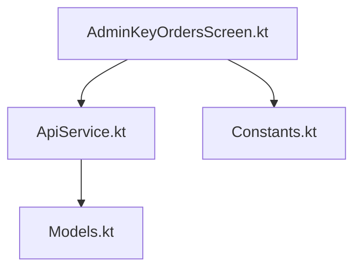
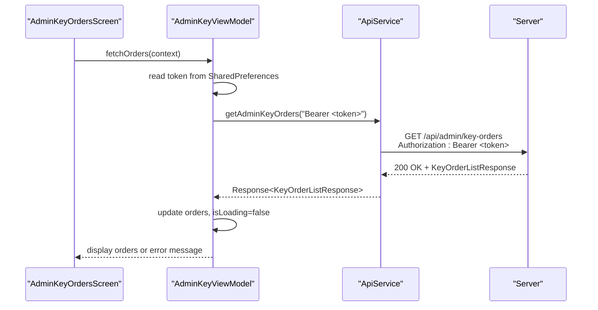
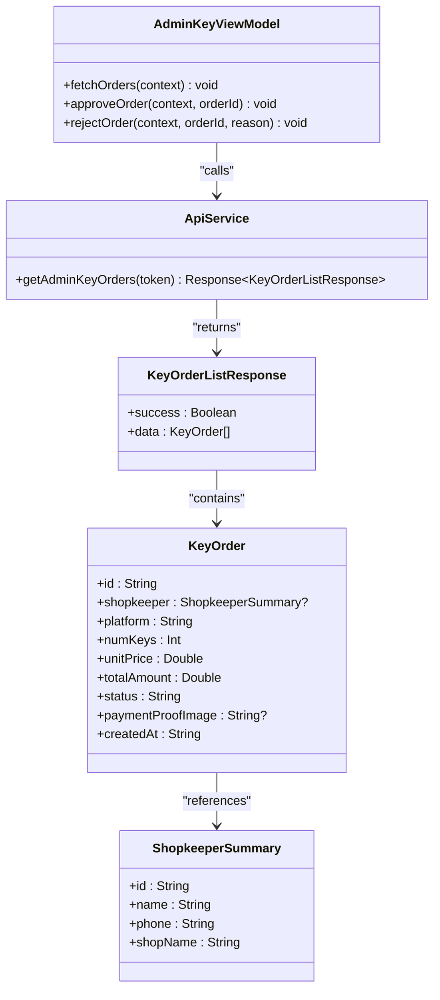

# Admin Key Orders Retrieval

<cite>
**Referenced Files in This Document**
- [ApiService.kt](file://app/src/main/java/com/pksafe/lock/manager/data/ApiService.kt)
- [Models.kt](file://app/src/main/java/com/pksafe/lock/manager/data/Models.kt)
- [AdminKeyOrdersScreen.kt](file://app/src/main/java/com/pksafe/lock/manager/ui/keys/AdminKeyOrdersScreen.kt)
- [Constants.kt](file://app/src/main/java/com/pksafe/lock/manager/util/Constants.kt)
</cite>

## Table of Contents
1. [Introduction](#introduction)
2. [Project Structure](#project-structure)
3. [Core Components](#core-components)
4. [Architecture Overview](#architecture-overview)
5. [Detailed Component Analysis](#detailed-component-analysis)
6. [Dependency Analysis](#dependency-analysis)
7. [Performance Considerations](#performance-considerations)
8. [Troubleshooting Guide](#troubleshooting-guide)
9. [Conclusion](#conclusion)

## Introduction
This document specifies the GET /admin/key-orders endpoint used by administrators to retrieve key orders. It covers authentication via the Authorization header, response structure using KeyOrderListResponse, and usage patterns demonstrated in the Android client. Where applicable, it also outlines filtering, pagination, sorting, and performance considerations based on the available code.

## Project Structure
The endpoint is defined in the API service layer and consumed by an admin UI screen that handles token retrieval and error states. Data models define the response shape for key orders.

**Diagram sources**
- [AdminKeyOrdersScreen.kt:43-68](file://app/src/main/java/com/pksafe/lock/manager/ui/keys/AdminKeyOrdersScreen.kt#L43-L68)
- [ApiService.kt:161-165](file://app/src/main/java/com/pksafe/lock/manager/data/ApiService.kt#L161-L165)
- [Models.kt:221-244](file://app/src/main/java/com/pksafe/lock/manager/data/Models.kt#L221-L244)
- [Constants.kt:3-9](file://app/src/main/java/com/pksafe/lock/manager/util/Constants.kt#L3-L9)

**Section sources**
- [ApiService.kt:161-165](file://app/src/main/java/com/pksafe/lock/manager/data/ApiService.kt#L161-L165)
- [AdminKeyOrdersScreen.kt:43-68](file://app/src/main/java/com/pksafe/lock/manager/ui/keys/AdminKeyOrdersScreen.kt#L43-L68)
- [Models.kt:221-244](file://app/src/main/java/com/pksafe/lock/manager/data/Models.kt#L221-L244)
- [Constants.kt:3-9](file://app/src/main/java/com/pksafe/lock/manager/util/Constants.kt#L3-L9)

## Core Components
- Endpoint definition: GET /admin/key-orders with Authorization header.
- Response model: KeyOrderListResponse containing success flag and data array of KeyOrder.
- Client integration: AdminKeyViewModel retrieves token from local storage and calls the endpoint.

Key responsibilities:
- ApiService declares the endpoint and maps the response type.
- Models define the KeyOrder fields (id, shopkeeper summary, platform, numKeys, unitPrice, totalAmount, status, paymentProofImage, createdAt).
- AdminKeyOrdersScreen orchestrates network calls, loading state, and error handling.

**Section sources**
- [ApiService.kt:161-165](file://app/src/main/java/com/pksafe/lock/manager/data/ApiService.kt#L161-L165)
- [Models.kt:221-244](file://app/src/main/java/com/pksafe/lock/manager/data/Models.kt#L221-L244)
- [AdminKeyOrdersScreen.kt:49-68](file://app/src/main/java/com/pksafe/lock/manager/ui/keys/AdminKeyOrdersScreen.kt#L49-L68)

## Architecture Overview
The admin UI constructs a Retrofit instance pointing to the configured base URL, obtains the stored auth token, and invokes the admin endpoint. The server returns a KeyOrderListResponse which the UI renders as a list of order cards.

**Diagram sources**
- [AdminKeyOrdersScreen.kt:49-68](file://app/src/main/java/com/pksafe/lock/manager/ui/keys/AdminKeyOrdersScreen.kt#L49-L68)
- [ApiService.kt:161-165](file://app/src/main/java/com/pksafe/lock/manager/data/ApiService.kt#L161-L165)
- [Constants.kt:3-9](file://app/src/main/java/com/pksafe/lock/manager/util/Constants.kt#L3-L9)

## Detailed Component Analysis

### Authentication Requirements
- Header: Authorization
- Format: Bearer <token>
- Token source: Stored in SharedPreferences under key "auth_token" and prefixed with "Bearer " before sending.

Notes:
- All admin endpoints in this module require the Authorization header.
- If the token is missing or invalid, the server will return an error; the client surfaces a generic failure message when the response is not successful.

**Section sources**
- [ApiService.kt:161-165](file://app/src/main/java/com/pksafe/lock/manager/data/ApiService.kt#L161-L165)
- [AdminKeyOrdersScreen.kt:49-68](file://app/src/main/java/com/pksafe/lock/manager/ui/keys/AdminKeyOrdersScreen.kt#L49-L68)

### Endpoint Specification
- Method: GET
- Path: /admin/key-orders
- Base URL: https://pk-locker-api.vercel.app/api/
- Headers: Authorization: Bearer <token>
- Query parameters: None defined in the client interface. Filtering by status, date ranges, or shopkeeper identification is not exposed via query parameters in this implementation.
- Request body: None

Behavior:
- Returns a KeyOrderListResponse indicating success and a list of KeyOrder items.

**Section sources**
- [ApiService.kt:161-165](file://app/src/main/java/com/pksafe/lock/manager/data/ApiService.kt#L161-L165)
- [Constants.kt:3-9](file://app/src/main/java/com/pksafe/lock/manager/util/Constants.kt#L3-L9)

### Response Structure
KeyOrderListResponse:
- success: Boolean
- data: List<KeyOrder>

KeyOrder fields:
- id: String
- shopkeeper: ShopkeeperSummary?
- platform: String
- numKeys: Int
- unitPrice: Double
- totalAmount: Double
- status: String (e.g., Pending, Approved, Rejected)
- paymentProofImage: String?
- createdAt: String

ShopkeeperSummary fields:
- id: String
- name: String
- phone: String
- shopName: String

**Section sources**
- [Models.kt:221-244](file://app/src/main/java/com/pksafe/lock/manager/data/Models.kt#L221-L244)

### Usage Examples
Note: These examples reflect how the Android client uses the endpoint. Actual HTTP requests are constructed by Retrofit using the base URL and endpoint path.

- Retrieve all key orders (admin):
  - Method: GET
  - URL: https://pk-locker-api.vercel.app/api/admin/key-orders
  - Headers: Authorization: Bearer <token>
  - Expected response: KeyOrderListResponse with success flag and data array

- Retrieve pending orders:
  - Not supported via query parameters in this client. To filter for pending orders, retrieve all orders and filter client-side by status == "Pending".

- Retrieve completed transactions:
  - Not supported via query parameters in this client. Filter client-side by status values such as "Approved" or "Rejected".

- Bulk order export:
  - Not implemented in this client. You can iterate over the returned data list and serialize/export as needed.

Error handling in the client:
- On non-successful responses or exceptions, the UI sets an error message string and stops loading.

**Section sources**
- [AdminKeyOrdersScreen.kt:49-68](file://app/src/main/java/com/pksafe/lock/manager/ui/keys/AdminKeyOrdersScreen.kt#L49-L68)
- [Models.kt:221-244](file://app/src/main/java/com/pksafe/lock/manager/data/Models.kt#L221-L244)

### Filtering, Pagination, Sorting
- Filtering: No query parameters are defined for status, date ranges, or shopkeeper identification in the client interface. Any filtering must be done client-side after receiving the full list.
- Pagination: Not implemented in the client. The endpoint returns a flat list; if the dataset is large, consider implementing server-side pagination on the backend and updating the client accordingly.
- Sorting: Not implemented in the client. Sort results locally if needed.

Recommendation:
- Extend the endpoint to support query parameters for status, date range, and shopkeeper filters, along with page and sort parameters, to improve performance and usability for large datasets.

**Section sources**
- [ApiService.kt:161-165](file://app/src/main/java/com/pksafe/lock/manager/data/ApiService.kt#L161-L165)

### Error Handling Scenarios
Common scenarios observed in the client:
- Unauthorized access or invalid token:
  - The server may return a non-success response; the client treats it as a failure and displays a generic error message.
- Network errors or exceptions:
  - Caught by try/catch; errorMessage is set to the exception message.
- Empty result set:
  - The UI shows an empty state with a message indicating no pending key requests.

Operational guidance:
- Ensure the Authorization header contains a valid bearer token.
- Handle non-2xx responses gracefully and surface meaningful messages to users.

**Section sources**
- [AdminKeyOrdersScreen.kt:49-68](file://app/src/main/java/com/pksafe/lock/manager/ui/keys/AdminKeyOrdersScreen.kt#L49-L68)

## Dependency Analysis
The admin flow depends on:
- Constants for the base URL.
- ApiService for endpoint declaration.
- Models for response mapping.
- AdminKeyOrdersScreen for orchestration and UI state.

**Diagram sources**
- [ApiService.kt:161-165](file://app/src/main/java/com/pksafe/lock/manager/data/ApiService.kt#L161-L165)
- [Models.kt:221-244](file://app/src/main/java/com/pksafe/lock/manager/data/Models.kt#L221-L244)
- [AdminKeyOrdersScreen.kt:38-101](file://app/src/main/java/com/pksafe/lock/manager/ui/keys/AdminKeyOrdersScreen.kt#L38-L101)

**Section sources**
- [ApiService.kt:161-165](file://app/src/main/java/com/pksafe/lock/manager/data/ApiService.kt#L161-L165)
- [Models.kt:221-244](file://app/src/main/java/com/pksafe/lock/manager/data/Models.kt#L221-L244)
- [AdminKeyOrdersScreen.kt:38-101](file://app/src/main/java/com/pksafe/lock/manager/ui/keys/AdminKeyOrdersScreen.kt#L38-L101)

## Performance Considerations
- Current behavior: Retrieves the entire list of key orders without pagination or filtering parameters. For large datasets, this can cause high memory usage and slow rendering.
- Recommendations:
  - Implement server-side pagination (page, pageSize) and sorting (sortBy, sortOrder).
  - Add filtering parameters (status, dateFrom, dateTo, shopkeeperId) to reduce payload size.
  - Use efficient list rendering and lazy loading in the UI.
  - Cache recent results locally to minimize repeated network calls.

[No sources needed since this section provides general guidance]

## Troubleshooting Guide
- Missing or invalid Authorization header:
  - Verify that a valid token exists in SharedPreferences and is correctly prefixed with "Bearer ".
- Non-successful response:
  - Check network connectivity and server availability.
  - Inspect the response status and message; handle appropriately in the UI.
- Empty orders list:
  - Confirm that there are key orders on the server and that the authenticated user has permission to view them.
- UI stuck in loading state:
  - Ensure the finally block resets isLoading and that exceptions are caught.

**Section sources**
- [AdminKeyOrdersScreen.kt:49-68](file://app/src/main/java/com/pksafe/lock/manager/ui/keys/AdminKeyOrdersScreen.kt#L49-L68)

## Conclusion
The GET /admin/key-orders endpoint provides administrators with a list of key orders, authenticated via the Authorization header. The current client implementation retrieves the full list and renders it in the admin UI. While filtering, pagination, and sorting are not exposed in the client, they can be added to improve scalability and user experience. Proper error handling ensures robustness against unauthorized access, invalid tokens, and server errors.