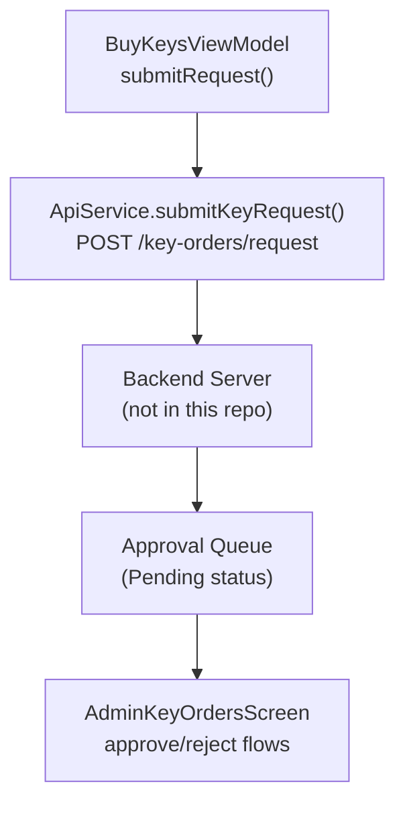
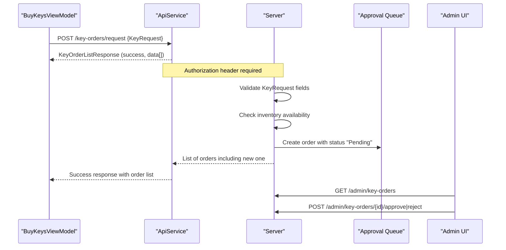
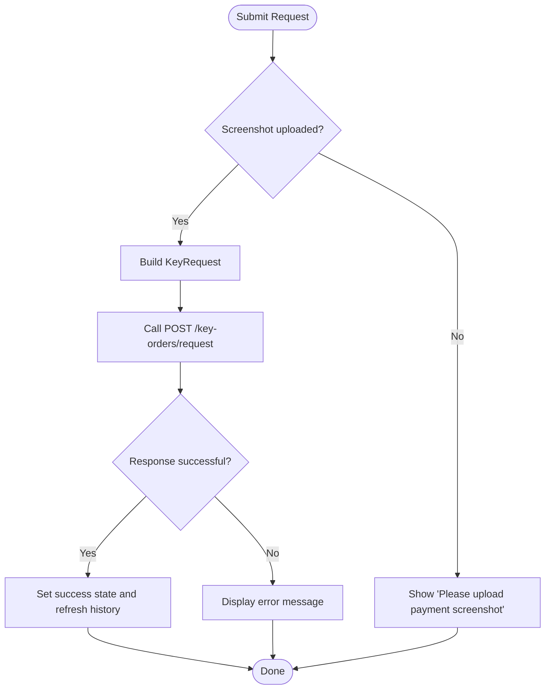
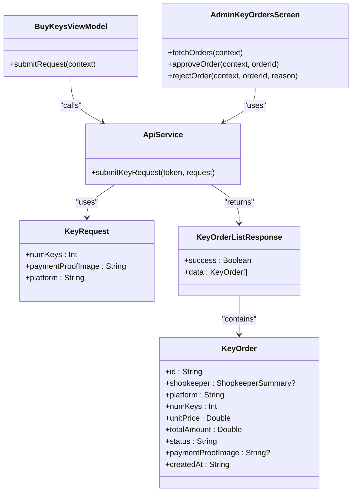

# Key Request Submission

<cite>
**Referenced Files in This Document**
- [ApiService.kt](file://app/src/main/java/com/pksafe/lock/manager/data/ApiService.kt)
- [Models.kt](file://app/src/main/java/com/pksafe/lock/manager/data/Models.kt)
- [BuyKeysViewModel.kt](file://app/src/main/java/com/pksafe/lock/manager/ui/keys/BuyKeysViewModel.kt)
- [AdminKeyOrdersScreen.kt](file://app/src/main/java/com/pksafe/lock/manager/ui/keys/AdminKeyOrdersScreen.kt)
</cite>

## Table of Contents
1. [Introduction](#introduction)
2. [Project Structure](#project-structure)
3. [Core Components](#core-components)
4. [Architecture Overview](#architecture-overview)
5. [Detailed Component Analysis](#detailed-component-analysis)
6. [Dependency Analysis](#dependency-analysis)
7. [Performance Considerations](#performance-considerations)
8. [Troubleshooting Guide](#troubleshooting-guide)
9. [Conclusion](#conclusion)

## Introduction
This document describes the POST /key-orders/request endpoint used by shopkeepers to submit new key requests. It covers the KeyRequest data model, request submission workflow from the Android app to the backend, expected responses, and operational considerations such as inventory checks, approval queue placement, audit logging, rate limiting, concurrency, and transaction rollback mechanisms. The content is derived from the Android client code that defines the API contract and UI flow for key ordering and admin review.

## Project Structure
The key request feature spans several components:
- API contract definition (Retrofit interface)
- Data models for requests and responses
- ViewModel that constructs and sends the request
- Admin UI for reviewing and acting on orders

**Diagram sources**
- [BuyKeysViewModel.kt:47-81](file://app/src/main/java/com/pksafe/lock/manager/ui/keys/BuyKeysViewModel.kt#L47-L81)
- [ApiService.kt:167-171](file://app/src/main/java/com/pksafe/lock/manager/data/ApiService.kt#L167-L171)
- [AdminKeyOrdersScreen.kt:70-100](file://app/src/main/java/com/pksafe/lock/manager/ui/keys/AdminKeyOrdersScreen.kt#L70-L100)

**Section sources**
- [ApiService.kt:167-171](file://app/src/main/java/com/pksafe/lock/manager/data/ApiService.kt#L167-L171)
- [Models.kt:221-254](file://app/src/main/java/com/pksafe/lock/manager/data/Models.kt#L221-L254)
- [BuyKeysViewModel.kt:47-81](file://app/src/main/java/com/pksafe/lock/manager/ui/keys/BuyKeysViewModel.kt#L47-L81)
- [AdminKeyOrdersScreen.kt:70-100](file://app/src/main/java/com/pksafe/lock/manager/ui/keys/AdminKeyOrdersScreen.kt#L70-L100)

## Core Components
- Endpoint: POST /key-orders/request
  - Defined in the Retrofit interface with an Authorization header and a JSON body typed as KeyRequest.
  - Returns a list of key orders via KeyOrderListResponse.

- KeyRequest data model
  - Fields: numKeys (integer), paymentProofImage (string), platform (string, default "android").
  - Validation rules are enforced at the server; the client performs basic local checks (e.g., presence of screenshot).

- Response model
  - KeyOrderListResponse contains success flag and a list of KeyOrder entries.
  - Each KeyOrder includes id, shopkeeper summary, platform, numKeys, unitPrice, totalAmount, status (Pending/Approved/Rejected), optional paymentProofImage, and createdAt timestamp.

- Admin workflow
  - Orders appear in the admin screen with status Pending until approved or rejected.
  - Approve and reject endpoints exist for administrative actions.

**Section sources**
- [ApiService.kt:167-171](file://app/src/main/java/com/pksafe/lock/manager/data/ApiService.kt#L167-L171)
- [Models.kt:221-254](file://app/src/main/java/com/pksafe/lock/manager/data/Models.kt#L221-L254)
- [AdminKeyOrdersScreen.kt:70-100](file://app/src/main/java/com/pksafe/lock/manager/ui/keys/AdminKeyOrdersScreen.kt#L70-L100)

## Architecture Overview
The submission flow begins in the BuyKeysViewModel, which validates inputs locally, builds a KeyRequest, and calls the API service. The server processes the request, performs inventory checks, places the order in an approval queue with status Pending, and returns the updated order list. Admins later approve or reject orders through dedicated endpoints.

**Diagram sources**
- [BuyKeysViewModel.kt:47-81](file://app/src/main/java/com/pksafe/lock/manager/ui/keys/BuyKeysViewModel.kt#L47-L81)
- [ApiService.kt:167-171](file://app/src/main/java/com/pksafe/lock/manager/data/ApiService.kt#L167-L171)
- [AdminKeyOrdersScreen.kt:70-100](file://app/src/main/java/com/pksafe/lock/manager/ui/keys/AdminKeyOrdersScreen.kt#L70-L100)

## Detailed Component Analysis

### KeyRequest Data Model
- numKeys: integer representing the number of keys requested.
- paymentProofImage: string containing proof of payment (base64 image or URL-like token).
- platform: string indicating target platform; defaults to "android".

Validation expectations based on client behavior and server-side processing:
- numKeys must be a positive integer greater than zero.
- paymentProofImage must be present and non-empty.
- platform should be a supported value; default is "android".

Example valid request payload structure:
- { "numKeys": 10, "paymentProofImage": "<base64-or-token>", "platform": "android" }

Example invalid payloads:
- Missing paymentProofImage
- numKeys set to 0 or negative
- Unsupported platform value

**Section sources**
- [Models.kt:250-254](file://app/src/main/java/com/pksafe/lock/manager/data/Models.kt#L250-L254)
- [BuyKeysViewModel.kt:56-66](file://app/src/main/java/com/pksafe/lock/manager/ui/keys/BuyKeysViewModel.kt#L56-L66)

### Request Submission Workflow
- Local validation: Ensure a screenshot is selected before submitting.
- Build KeyRequest: Construct with numKeys, paymentProofImage, and platform.
- Send request: Call ApiService.submitKeyRequest with Authorization header.
- Handle response: On success, show confirmation and refresh history; on failure, display error message.

**Diagram sources**
- [BuyKeysViewModel.kt:47-81](file://app/src/main/java/com/pksafe/lock/manager/ui/keys/BuyKeysViewModel.kt#L47-L81)

**Section sources**
- [BuyKeysViewModel.kt:47-81](file://app/src/main/java/com/pksafe/lock/manager/ui/keys/BuyKeysViewModel.kt#L47-L81)

### Inventory Checks and Approval Queue Placement
- Inventory checks: Performed server-side when validating the request; insufficient inventory results in an error response.
- Approval queue placement: Successful submissions create an order with status "Pending", visible in the admin view.
- Audit logging: Not explicitly implemented in the client; typically handled server-side during order creation and admin actions.

Operational notes:
- If inventory is insufficient, the server should return an error indicating lack of available keys.
- Orders remain in "Pending" until an admin approves or rejects them.

**Section sources**
- [ApiService.kt:167-171](file://app/src/main/java/com/pksafe/lock/manager/data/ApiService.kt#L167-L171)
- [Models.kt:221-244](file://app/src/main/java/com/pksafe/lock/manager/data/Models.kt#L221-L244)
- [AdminKeyOrdersScreen.kt:70-100](file://app/src/main/java/com/pksafe/lock/manager/ui/keys/AdminKeyOrdersScreen.kt#L70-L100)

### Error Responses and Success Responses
- Success response: KeyOrderListResponse with success=true and data array containing the newly created order(s).
- Error responses:
  - Insufficient inventory: server returns an error indicating not enough keys available.
  - Invalid quantities: server returns an error if numKeys is invalid (zero or negative).
  - Network errors: caught in ViewModel and surfaced to the user.

Client handling:
- On network or parsing errors, display a user-friendly message.
- On HTTP errors, surface the server message.

**Section sources**
- [BuyKeysViewModel.kt:66-81](file://app/src/main/java/com/pksafe/lock/manager/ui/keys/BuyKeysViewModel.kt#L66-L81)
- [Models.kt:241-248](file://app/src/main/java/com/pksafe/lock/manager/data/Models.kt#L241-L248)

### Rate Limiting and Concurrent Requests
- Rate limiting: Not implemented in the client; consider server-side rate limiting to protect against abuse.
- Concurrency: The ViewModel uses coroutines to run network calls asynchronously; avoid duplicate submissions by disabling the submit button while loading.

Recommendations:
- Debounce rapid submissions.
- Use optimistic UI updates carefully; revert on failure.
- Implement retry with exponential backoff for transient network issues.

[No sources needed since this section provides general guidance]

### Transaction Rollback Mechanisms
- Client-side: No explicit transactional logic; failures result in error messages without partial state changes.
- Server-side: Should ensure atomic operations when creating orders and checking inventory; roll back any partial writes on failure.

[No sources needed since this section provides general guidance]

## Dependency Analysis
The key request feature depends on:
- ApiService for defining the endpoint and response types.
- Models for request/response structures.
- BuyKeysViewModel for orchestrating the submission flow.
- AdminKeyOrdersScreen for post-submission admin actions.

**Diagram sources**
- [ApiService.kt:167-171](file://app/src/main/java/com/pksafe/lock/manager/data/ApiService.kt#L167-L171)
- [Models.kt:221-254](file://app/src/main/java/com/pksafe/lock/manager/data/Models.kt#L221-L254)
- [BuyKeysViewModel.kt:47-81](file://app/src/main/java/com/pksafe/lock/manager/ui/keys/BuyKeysViewModel.kt#L47-L81)
- [AdminKeyOrdersScreen.kt:70-100](file://app/src/main/java/com/pksafe/lock/manager/ui/keys/AdminKeyOrdersScreen.kt#L70-L100)

**Section sources**
- [ApiService.kt:167-171](file://app/src/main/java/com/pksafe/lock/manager/data/ApiService.kt#L167-L171)
- [Models.kt:221-254](file://app/src/main/java/com/pksafe/lock/manager/data/Models.kt#L221-L254)
- [BuyKeysViewModel.kt:47-81](file://app/src/main/java/com/pksafe/lock/manager/ui/keys/BuyKeysViewModel.kt#L47-L81)
- [AdminKeyOrdersScreen.kt:70-100](file://app/src/main/java/com/pksafe/lock/manager/ui/keys/AdminKeyOrdersScreen.kt#L70-L100)

## Performance Considerations
- Network efficiency: Batch operations where possible; minimize redundant calls.
- UI responsiveness: Keep long-running tasks off the main thread using coroutines.
- Image handling: Avoid excessive memory usage when encoding images; consider compression before sending.
- Caching: Cache order lists to reduce repeated fetches; invalidate on actions like approve/reject.

[No sources needed since this section provides general guidance]

## Troubleshooting Guide
Common issues and resolutions:
- Missing payment screenshot: Ensure an image is selected before submission; the ViewModel will prompt otherwise.
- Network errors: Display user-friendly messages; implement retries for transient failures.
- Invalid quantity: Validate numKeys > 0 before sending; handle server errors gracefully.
- Insufficient inventory: Inform users to reduce the requested quantity or try again later.

Client-side error handling:
- Catch exceptions around network calls and update UI accordingly.
- Reset loading states in finally blocks to prevent stuck UI.

**Section sources**
- [BuyKeysViewModel.kt:51-81](file://app/src/main/java/com/pksafe/lock/manager/ui/keys/BuyKeysViewModel.kt#L51-L81)

## Conclusion
The POST /key-orders/request endpoint enables shopkeepers to submit key requests with a structured KeyRequest payload. The Android client validates inputs, constructs the request, and handles responses appropriately. Orders enter an approval queue with "Pending" status and are managed via admin endpoints. Robust server-side validation, inventory checks, and audit logging ensure reliable operation. Clients should implement best practices for error handling, rate limiting, concurrency control, and performance optimization to enhance user experience.