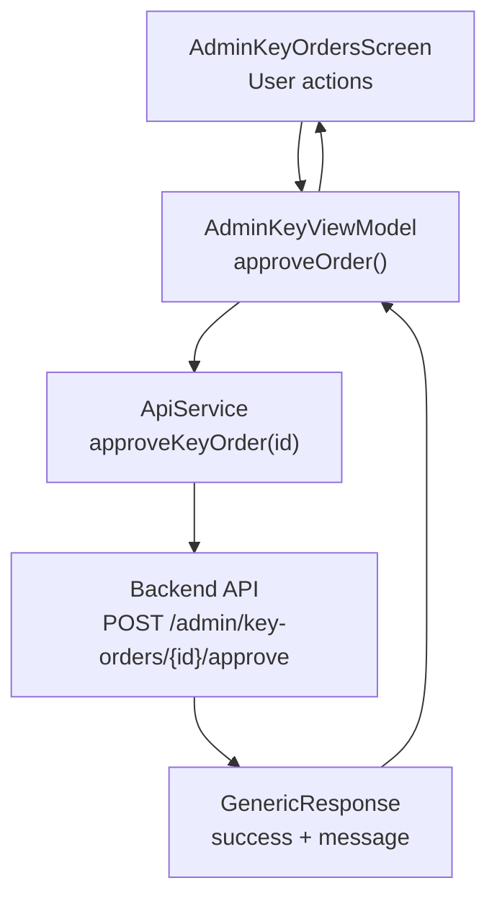
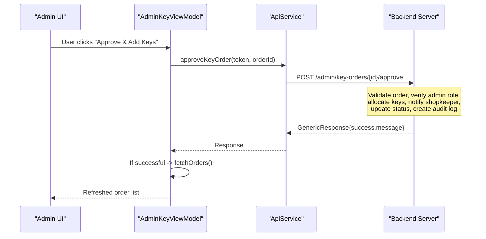
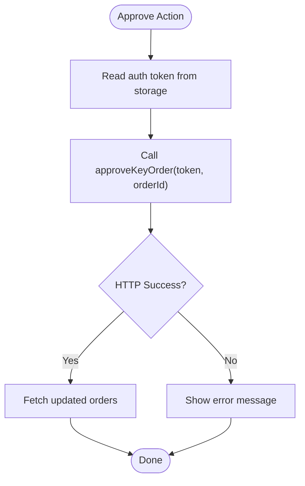
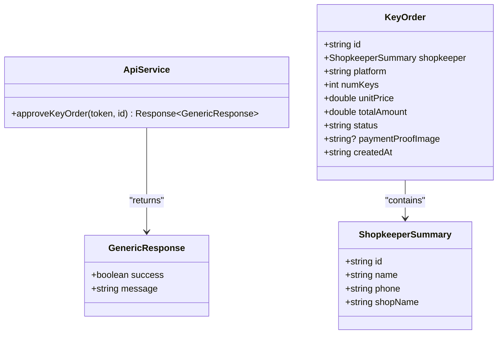
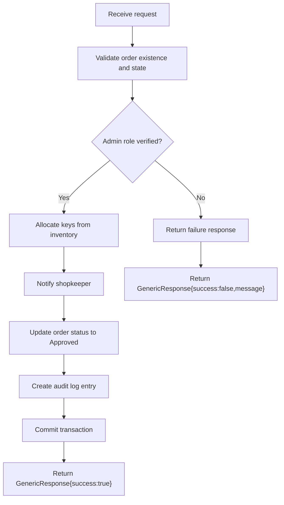
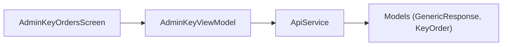

# Order Approval Workflow

<cite>
**Referenced Files in This Document**
- [ApiService.kt](file://app/src/main/java/com/pksafe/lock/manager/data/ApiService.kt)
- [Models.kt](file://app/src/main/java/com/pksafe/lock/manager/data/Models.kt)
- [AdminKeyOrdersScreen.kt](file://app/src/main/java/com/pksafe/lock/manager/ui/keys/AdminKeyOrdersScreen.kt)
</cite>

## Table of Contents
1. [Introduction](#introduction)
2. [Project Structure](#project-structure)
3. [Core Components](#core-components)
4. [Architecture Overview](#architecture-overview)
5. [Detailed Component Analysis](#detailed-component-analysis)
6. [Dependency Analysis](#dependency-analysis)
7. [Performance Considerations](#performance-considerations)
8. [Troubleshooting Guide](#troubleshooting-guide)
9. [Conclusion](#conclusion)

## Introduction
This document explains the administrative workflow for approving key orders via the POST /admin/key-orders/{id}/approve endpoint. It covers how the Android client initiates approval, what data structures are involved, and how success and failure responses are handled on the client side. It also outlines expected server-side responsibilities such as order validation, inventory allocation, notifications to shopkeepers, status updates, audit logging, and transaction integrity.

## Project Structure
The approval flow is implemented on the Android app using a Retrofit API interface and UI components:
- The API contract defines the approve endpoint and related models.
- The admin screen invokes the approve method and refreshes the order list upon success.
- Data models define the structure of key orders and generic responses.

**Diagram sources**
- [AdminKeyOrdersScreen.kt:70-84](file://app/src/main/java/com/pksafe/lock/manager/ui/keys/AdminKeyOrdersScreen.kt#L70-L84)
- [ApiService.kt:173-177](file://app/src/main/java/com/pksafe/lock/manager/data/ApiService.kt#L173-L177)
- [Models.kt:245-248](file://app/src/main/java/com/pksafe/lock/manager/data/Models.kt#L245-L248)

**Section sources**
- [ApiService.kt:173-177](file://app/src/main/java/com/pksafe/lock/manager/data/ApiService.kt#L173-L177)
- [Models.kt:245-248](file://app/src/main/java/com/pksafe/lock/manager/data/Models.kt#L245-L248)
- [AdminKeyOrdersScreen.kt:70-84](file://app/src/main/java/com/pksafe/lock/manager/ui/keys/AdminKeyOrdersScreen.kt#L70-L84)

## Core Components
- Endpoint definition: The approve endpoint is declared in the API service with an Authorization header and path parameter id.
- Request/response models: KeyOrder describes pending orders; GenericResponse represents success/failure outcomes.
- UI integration: The admin screen triggers approval and refreshes the list on success.

Key elements:
- Endpoint: POST /admin/key-orders/{id}/approve
- Request headers: Authorization (Bearer token)
- Path parameter: id (order identifier)
- Response: GenericResponse { success: boolean, message: string }

**Section sources**
- [ApiService.kt:173-177](file://app/src/main/java/com/pksafe/lock/manager/data/ApiService.kt#L173-L177)
- [Models.kt:221-248](file://app/src/main/java/com/pksafe/lock/manager/data/Models.kt#L221-L248)
- [AdminKeyOrdersScreen.kt:70-84](file://app/src/main/java/com/pksafe/lock/manager/ui/keys/AdminKeyOrdersScreen.kt#L70-L84)

## Architecture Overview
The end-to-end flow from user action to backend processing and response handling:

**Diagram sources**
- [AdminKeyOrdersScreen.kt:70-84](file://app/src/main/java/com/pksafe/lock/manager/ui/keys/AdminKeyOrdersScreen.kt#L70-L84)
- [ApiService.kt:173-177](file://app/src/main/java/com/pksafe/lock/manager/data/ApiService.kt#L173-L177)
- [Models.kt:245-248](file://app/src/main/java/com/pksafe/lock/manager/data/Models.kt#L245-L248)

## Detailed Component Analysis

### Client-Side Approval Flow
- The admin screen calls approveOrder with the current auth token and selected order id.
- On success, it refreshes the order list to reflect updated statuses.
- Errors are captured and stored for display.

**Diagram sources**
- [AdminKeyOrdersScreen.kt:70-84](file://app/src/main/java/com/pksafe/lock/manager/ui/keys/AdminKeyOrdersScreen.kt#L70-L84)

**Section sources**
- [AdminKeyOrdersScreen.kt:70-84](file://app/src/main/java/com/pksafe/lock/manager/ui/keys/AdminKeyOrdersScreen.kt#L70-L84)

### API Contract and Models
- Approve endpoint: Defined with Authorization header and path id.
- GenericResponse: Contains success flag and message for both success and failure scenarios.
- KeyOrder: Represents an order with fields like shopkeeper, platform, numKeys, unitPrice, totalAmount, status, paymentProofImage, createdAt.

**Diagram sources**
- [ApiService.kt:173-177](file://app/src/main/java/com/pksafe/lock/manager/data/ApiService.kt#L173-L177)
- [Models.kt:221-248](file://app/src/main/java/com/pksafe/lock/manager/data/Models.kt#L221-L248)

**Section sources**
- [ApiService.kt:173-177](file://app/src/main/java/com/pksafe/lock/manager/data/ApiService.kt#L173-L177)
- [Models.kt:221-248](file://app/src/main/java/com/pksafe/lock/manager/data/Models.kt#L221-L248)

### Expected Server-Side Processing
While the backend implementation is not present in this repository, typical responsibilities for the approve endpoint include:
- Order validation: Ensure the order exists and is in a state that allows approval (e.g., Pending).
- Admin role verification: Validate that the caller has administrative privileges.
- Inventory allocation: Deduct keys from available inventory for the specified platform.
- Notification sending: Notify the shopkeeper about approval and key availability.
- Status update: Change order status to Approved.
- Audit trail: Record who approved the order and when.
- Transaction integrity: Perform all mutations within a transaction to ensure consistency.

[No sources needed since this diagram shows conceptual workflow, not actual code structure]

### Security Considerations
- Authorization: Requests must include a valid Bearer token in the Authorization header.
- Role enforcement: Only users with admin roles should be permitted to approve orders.
- Input validation: Validate the order id format and existence before processing.
- Idempotency: Prevent duplicate approvals by checking current order status.
- Audit logging: Record approval actions with timestamps and actor identity.
- Transaction boundaries: Enclose inventory updates and status changes in a single transaction.

[No sources needed since this section provides general guidance]

### Error Handling Scenarios
Common failure cases and expected client behavior:
- Invalid order ID: Backend returns a failure response; client displays the message.
- Already processed order: If the order is already Approved or Rejected, return a failure with a clear message.
- Insufficient inventory: Return failure indicating inability to allocate keys.
- Unauthorized access: Reject requests without proper admin credentials.

Client-side handling:
- Check HTTP success and parse GenericResponse.
- On success, refresh the order list to reflect new status.
- On failure, capture and show the error message to the user.

**Section sources**
- [AdminKeyOrdersScreen.kt:70-84](file://app/src/main/java/com/pksafe/lock/manager/ui/keys/AdminKeyOrdersScreen.kt#L70-L84)
- [Models.kt:245-248](file://app/src/main/java/com/pksafe/lock/manager/data/Models.kt#L245-L248)

## Dependency Analysis
The client-side dependencies for the approval flow:
- AdminKeyOrdersScreen depends on AdminKeyViewModel methods to trigger approval and refresh.
- AdminKeyViewModel uses ApiService to call the approve endpoint.
- ApiService declares the endpoint and returns GenericResponse.
- Models define KeyOrder and GenericResponse used across the flow.

**Diagram sources**
- [AdminKeyOrdersScreen.kt:70-84](file://app/src/main/java/com/pksafe/lock/manager/ui/keys/AdminKeyOrdersScreen.kt#L70-L84)
- [ApiService.kt:173-177](file://app/src/main/java/com/pksafe/lock/manager/data/ApiService.kt#L173-L177)
- [Models.kt:221-248](file://app/src/main/java/com/pksafe/lock/manager/data/Models.kt#L221-L248)

**Section sources**
- [AdminKeyOrdersScreen.kt:70-84](file://app/src/main/java/com/pksafe/lock/manager/ui/keys/AdminKeyOrdersScreen.kt#L70-L84)
- [ApiService.kt:173-177](file://app/src/main/java/com/pksafe/lock/manager/data/ApiService.kt#L173-L177)
- [Models.kt:221-248](file://app/src/main/java/com/pksafe/lock/manager/data/Models.kt#L221-L248)

## Performance Considerations
- Minimize network calls: Only refresh the order list after successful approval.
- Avoid redundant operations: Ensure idempotent approval to prevent duplicate allocations.
- Batch updates: If possible, batch status updates and notifications to reduce load.
- Optimize UI rendering: Use efficient list rendering and avoid unnecessary recompositions.

[No sources needed since this section provides general guidance]

## Troubleshooting Guide
Common issues and resolutions:
- Network errors: Retry logic can be added to handle transient failures.
- Authentication failures: Ensure the token is valid and refreshed if necessary.
- Unexpected states: Verify order status transitions and enforce allowed transitions.
- Inventory mismatches: Implement reconciliation checks between allocated keys and inventory counts.

Client-side debugging tips:
- Log request parameters (token, orderId) and response payloads.
- Display user-friendly messages based on GenericResponse.message.
- Provide a manual refresh option to reload orders after errors.

**Section sources**
- [AdminKeyOrdersScreen.kt:70-84](file://app/src/main/java/com/pksafe/lock/manager/ui/keys/AdminKeyOrdersScreen.kt#L70-L84)
- [Models.kt:245-248](file://app/src/main/java/com/pksafe/lock/manager/data/Models.kt#L245-L248)

## Conclusion
The POST /admin/key-orders/{id}/approve endpoint enables administrators to approve key orders through a well-defined client flow. The Android app sends a token-authenticated request and handles success by refreshing the order list. While the backend implementation is not included here, the endpoint should validate orders, enforce admin roles, allocate inventory, notify shopkeepers, update statuses, create audit logs, and maintain transaction integrity. Proper error handling and security measures ensure a robust approval process.