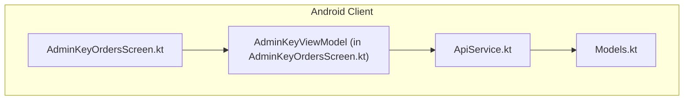
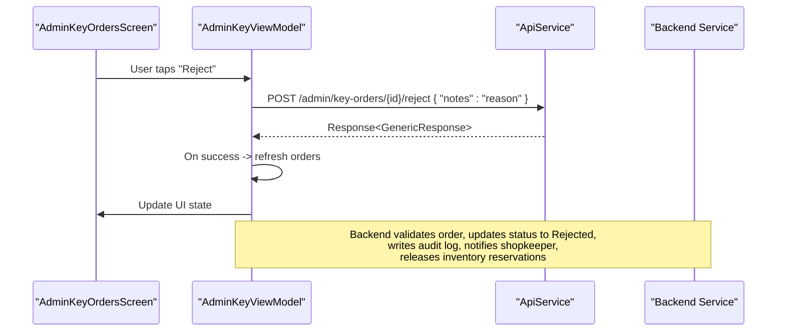
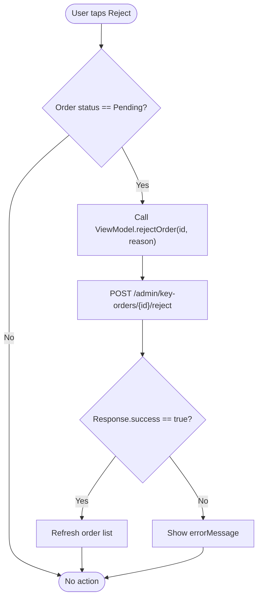
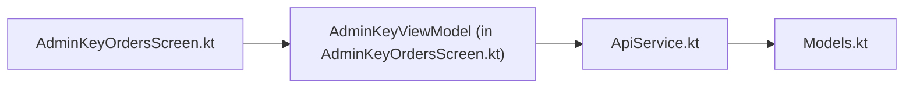

# Order Rejection Workflow

<cite>
**Referenced Files in This Document**
- [ApiService.kt](file://app/src/main/java/com/pksafe/lock/manager/data/ApiService.kt)
- [Models.kt](file://app/src/main/java/com/pksafe/lock/manager/data/Models.kt)
- [AdminKeyOrdersScreen.kt](file://app/src/main/java/com/pksafe/lock/manager/ui/keys/AdminKeyOrdersScreen.kt)
</cite>

## Table of Contents
1. [Introduction](#introduction)
2. [Project Structure](#project-structure)
3. [Core Components](#core-components)
4. [Architecture Overview](#architecture-overview)
5. [Detailed Component Analysis](#detailed-component-analysis)
6. [Dependency Analysis](#dependency-analysis)
7. [Performance Considerations](#performance-considerations)
8. [Troubleshooting Guide](#troubleshooting-guide)
9. [Conclusion](#conclusion)

## Introduction
This document describes the order rejection workflow for the POST /admin/key-orders/{id}/reject endpoint as implemented in the Android client. It explains how an admin can reject a key order, capture rejection reasons via notes, and how the UI triggers the request. It also outlines expected business logic on the server side (order state transitions, audit trail, shopkeeper notifications, and inventory reservation release), based on the client-side contract and data models present in this repository.

## Project Structure
The rejection flow is implemented across three primary files:
- API definition for the reject endpoint
- Data models representing orders and responses
- Admin UI that invokes the reject action

**Diagram sources**
- [AdminKeyOrdersScreen.kt:38-100](file://app/src/main/java/com/pksafe/lock/manager/ui/keys/AdminKeyOrdersScreen.kt#L38-L100)
- [ApiService.kt:179-184](file://app/src/main/java/com/pksafe/lock/manager/data/ApiService.kt#L179-L184)
- [Models.kt:221-248](file://app/src/main/java/com/pksafe/lock/manager/data/Models.kt#L221-L248)

**Section sources**
- [ApiService.kt:161-184](file://app/src/main/java/com/pksafe/lock/manager/data/ApiService.kt#L161-L184)
- [Models.kt:221-248](file://app/src/main/java/com/pksafe/lock/manager/data/Models.kt#L221-L248)
- [AdminKeyOrdersScreen.kt:38-100](file://app/src/main/java/com/pksafe/lock/manager/ui/keys/AdminKeyOrdersScreen.kt#L38-L100)

## Core Components
- Endpoint contract: The client defines a POST endpoint at admin/key-orders/{id}/reject with a JSON body containing a notes field to capture rejection reasons.
- Request model: A Map<String, String> body with a "notes" key is used to send the reason string.
- Response model: A GenericResponse with success and message fields indicates outcome.
- UI integration: The admin screen provides a Reject button for Pending orders, which calls the ViewModel method to invoke the API.

Key implementation references:
- Endpoint definition and parameters are declared in the API service interface.
- The ViewModel constructs the request body with the notes field and handles success/error states by refreshing the order list or showing an error message.
- The KeyOrder model includes status values including Pending, Approved, and Rejected, which drive UI behavior and reflect server state transitions.

**Section sources**
- [ApiService.kt:179-184](file://app/src/main/java/com/pksafe/lock/manager/data/ApiService.kt#L179-L184)
- [Models.kt:221-248](file://app/src/main/java/com/pksafe/lock/manager/data/Models.kt#L221-L248)
- [AdminKeyOrdersScreen.kt:86-100](file://app/src/main/java/com/pksafe/lock/manager/ui/keys/AdminKeyOrdersScreen.kt#L86-L100)

## Architecture Overview
The rejection workflow involves the admin UI triggering a network call to the backend. The backend is expected to validate the order, transition its state to Rejected, record an audit entry, notify the shopkeeper, and release any reserved inventory.

**Diagram sources**
- [AdminKeyOrdersScreen.kt:86-100](file://app/src/main/java/com/pksafe/lock/manager/ui/keys/AdminKeyOrdersScreen.kt#L86-L100)
- [ApiService.kt:179-184](file://app/src/main/java/com/pksafe/lock/manager/data/ApiService.kt#L179-L184)

## Detailed Component Analysis

### API Contract: POST /admin/key-orders/{id}/reject
- Path parameter: id (order identifier)
- Request body: Map with a single key "notes" containing the rejection reason string
- Response: GenericResponse with success flag and message

Validation expectations (client-side):
- Authorization header must be provided ("Bearer <token>")
- Body must include "notes" when invoking from the UI; the ViewModel always supplies it

Business logic expectations (server-side, inferred from client contracts and models):
- Only orders in Pending state should be eligible for rejection
- On success, order status transitions to Rejected
- Audit trail entry created with timestamp, admin identity, and reason
- Shopkeeper notification sent with rejection details
- Any inventory reservation associated with the order is released

Error handling (client-side):
- Network exceptions are caught and surfaced as errorMessage
- On successful response, the order list is refreshed to reflect updated status

**Section sources**
- [ApiService.kt:179-184](file://app/src/main/java/com/pksafe/lock/manager/data/ApiService.kt#L179-L184)
- [Models.kt:221-248](file://app/src/main/java/com/pksafe/lock/manager/data/Models.kt#L221-L248)
- [AdminKeyOrdersScreen.kt:86-100](file://app/src/main/java/com/pksafe/lock/manager/ui/keys/AdminKeyOrdersScreen.kt#L86-L100)

### UI Integration: AdminKeyOrdersScreen
- The Reject button is only visible for orders with status Pending
- Tapping Reject calls the ViewModel method rejectOrder with orderId and a default reason string
- On success, the screen refreshes the order list to show the updated status

**Diagram sources**
- [AdminKeyOrdersScreen.kt:235-255](file://app/src/main/java/com/pksafe/lock/manager/ui/keys/AdminKeyOrdersScreen.kt#L235-L255)
- [AdminKeyOrdersScreen.kt:86-100](file://app/src/main/java/com/pksafe/lock/manager/ui/keys/AdminKeyOrdersScreen.kt#L86-L100)

**Section sources**
- [AdminKeyOrdersScreen.kt:235-255](file://app/src/main/java/com/pksafe/lock/manager/ui/keys/AdminKeyOrdersScreen.kt#L235-L255)
- [AdminKeyOrdersScreen.kt:86-100](file://app/src/main/java/com/pksafe/lock/manager/ui/keys/AdminKeyOrdersScreen.kt#L86-L100)

### Data Models: KeyOrder and GenericResponse
- KeyOrder includes fields such as id, shopkeeper, platform, numKeys, unitPrice, totalAmount, status, paymentProofImage, createdAt
- Status values include Pending, Approved, Rejected
- GenericResponse includes success and message fields used to communicate operation outcomes

These models define the shape of data exchanged between the client and server and inform UI rendering and state management.

**Section sources**
- [Models.kt:221-248](file://app/src/main/java/com/pksafe/lock/manager/data/Models.kt#L221-L248)

## Dependency Analysis
The rejection flow depends on:
- ApiService for defining the HTTP endpoint and types
- Models for request/response shapes
- AdminKeyOrdersScreen for user interaction and orchestration

**Diagram sources**
- [AdminKeyOrdersScreen.kt:38-100](file://app/src/main/java/com/pksafe/lock/manager/ui/keys/AdminKeyOrdersScreen.kt#L38-L100)
- [ApiService.kt:179-184](file://app/src/main/java/com/pksafe/lock/manager/data/ApiService.kt#L179-L184)
- [Models.kt:221-248](file://app/src/main/java/com/pksafe/lock/manager/data/Models.kt#L221-L248)

**Section sources**
- [AdminKeyOrdersScreen.kt:38-100](file://app/src/main/java/com/pksafe/lock/manager/ui/keys/AdminKeyOrdersScreen.kt#L38-L100)
- [ApiService.kt:179-184](file://app/src/main/java/com/pksafe/lock/manager/data/ApiService.kt#L179-L184)
- [Models.kt:221-248](file://app/src/main/java/com/pksafe/lock/manager/data/Models.kt#L221-L248)

## Performance Considerations
- Network calls are executed within coroutines to avoid blocking the UI thread
- On successful rejection, the order list is refreshed to reflect the latest state
- Error handling prevents crashes and surfaces messages to the user

[No sources needed since this section provides general guidance]

## Troubleshooting Guide
Common issues and handling observed in the client:
- Invalid order state: The UI only shows Reject for Pending orders; attempting to reject non-Pending orders is prevented by UI logic
- Missing required fields: The ViewModel always sends the notes field; ensure the server enforces presence validation
- System failures during processing: Exceptions are caught and stored in errorMessage; the UI displays these errors to the user

Recommended checks:
- Verify Authorization header is set correctly before calling the endpoint
- Confirm the order exists and is in Pending state
- Ensure the notes field is included in the request body

**Section sources**
- [AdminKeyOrdersScreen.kt:86-100](file://app/src/main/java/com/pksafe/lock/manager/ui/keys/AdminKeyOrdersScreen.kt#L86-L100)
- [AdminKeyOrdersScreen.kt:235-255](file://app/src/main/java/com/pksafe/lock/manager/ui/keys/AdminKeyOrdersScreen.kt#L235-L255)

## Conclusion
The Android client implements the POST /admin/key-orders/{id}/reject endpoint through a clear separation of concerns: the API service defines the contract, models describe data shapes, and the admin UI orchestrates user actions and network calls. While server-side business logic (state transitions, audit trails, notifications, inventory release) is not implemented in this repository, the client’s structure supports those workflows and expects them to occur upon successful rejection.