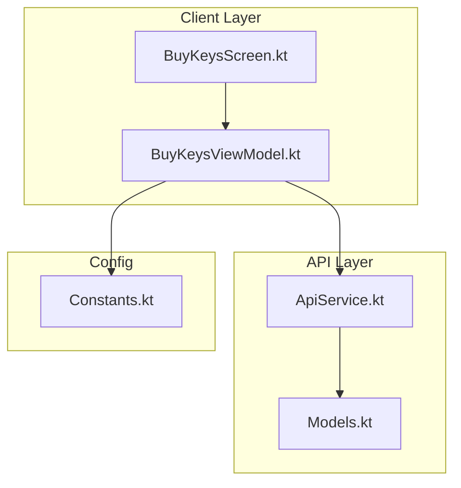
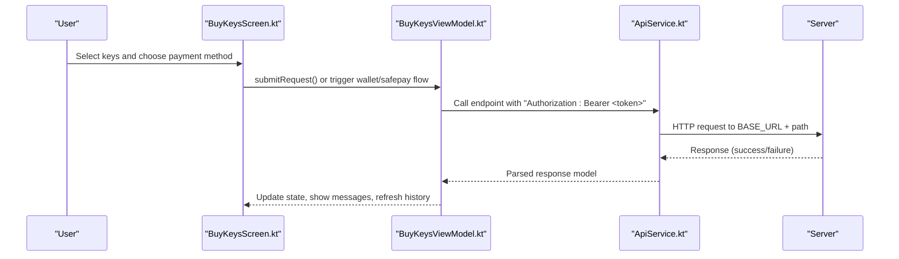
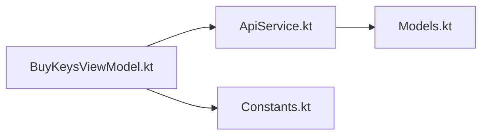

# Customer Payment Endpoints

<cite>
**Referenced Files in This Document**
- [ApiService.kt](file://app/src/main/java/com/pksafe/lock/manager/data/ApiService.kt)
- [Models.kt](file://app/src/main/java/com/pksafe/lock/manager/data/Models.kt)
- [BuyKeysScreen.kt](file://app/src/main/java/com/pksafe/lock/manager/ui/keys/BuyKeysScreen.kt)
- [BuyKeysViewModel.kt](file://app/src/main/java/com/pksafe/lock/manager/ui/keys/BuyKeysViewModel.kt)
- [Constants.kt](file://app/src/main/java/com/pksafe/lock/manager/util/Constants.kt)
</cite>

## Table of Contents
1. [Introduction](#introduction)
2. [Project Structure](#project-structure)
3. [Core Components](#core-components)
4. [Architecture Overview](#architecture-overview)
5. [Detailed Component Analysis](#detailed-component-analysis)
6. [Dependency Analysis](#dependency-analysis)
7. [Performance Considerations](#performance-considerations)
8. [Troubleshooting Guide](#troubleshooting-guide)
9. [Conclusion](#conclusion)

## Introduction
This document describes the customer-facing payment endpoints for PK Locker’s key management system as exposed by the Android client. It covers:
- SafePay checkout initiation and verification flows
- Mobile wallet payments (EasyPaisa, JazzCash)
- Free test key allocation
- Purchase history retrieval
It also includes request/response schemas, authentication requirements, example flows, error handling guidance, and integration patterns based on the client-side API definitions and UI usage.

## Project Structure
The payment endpoints are defined in a Retrofit interface and consumed from the UI layer via a ViewModel. The base URL is configured centrally.

**Diagram sources**
- [BuyKeysScreen.kt:40-221](file://app/src/main/java/com/pksafe/lock/manager/ui/keys/BuyKeysScreen.kt#L40-L221)
- [BuyKeysViewModel.kt:18-95](file://app/src/main/java/com/pksafe/lock/manager/ui/keys/BuyKeysViewModel.kt#L18-L95)
- [ApiService.kt:131-159](file://app/src/main/java/com/pksafe/lock/manager/data/ApiService.kt#L131-L159)
- [Models.kt:187-224](file://app/src/main/java/com/pksafe/lock/manager/data/Models.kt#L187-L224)
- [Constants.kt:3-9](file://app/src/main/java/com/pksafe/lock/manager/util/Constants.kt#L3-L9)

**Section sources**
- [ApiService.kt:131-159](file://app/src/main/java/com/pksafe/lock/manager/data/ApiService.kt#L131-L159)
- [Models.kt:187-224](file://app/src/main/java/com/pksafe/lock/manager/data/Models.kt#L187-L224)
- [Constants.kt:3-9](file://app/src/main/java/com/pksafe/lock/manager/util/Constants.kt#L3-L9)

## Core Components
- Endpoint definitions for key-order payments and history are declared in the API service interface with explicit HTTP methods and paths.
- Request/response models define payloads for wallet payments, SafePay checkout data, and purchase history.
- The UI and ViewModel demonstrate how to call these endpoints, including authentication header usage and basic error handling.

Key responsibilities:
- POST /key-orders/checkout-safepay: initiate SafePay checkout
- POST /key-orders/verify-safepay: verify payment and allocate keys
- POST /key-orders/free-test-keys: allocate trial keys
- POST /key-orders/wallet-pay: process mobile wallet payments
- GET /key-orders/history: retrieve order history

**Section sources**
- [ApiService.kt:131-159](file://app/src/main/java/com/pksafe/lock/manager/data/ApiService.kt#L131-L159)
- [Models.kt:187-224](file://app/src/main/java/com/pksafe/lock/manager/data/Models.kt#L187-L224)

## Architecture Overview
The payment flow spans UI, ViewModel, and API layers. Authentication is passed via an Authorization header using a Bearer token stored locally.

**Diagram sources**
- [BuyKeysScreen.kt:40-221](file://app/src/main/java/com/pksafe/lock/manager/ui/keys/BuyKeysScreen.kt#L40-L221)
- [BuyKeysViewModel.kt:33-81](file://app/src/main/java/com/pksafe/lock/manager/ui/keys/BuyKeysViewModel.kt#L33-L81)
- [ApiService.kt:131-159](file://app/src/main/java/com/pksafe/lock/manager/data/ApiService.kt#L131-L159)
- [Constants.kt:3-9](file://app/src/main/java/com/pksafe/lock/manager/util/Constants.kt#L3-L9)

## Detailed Component Analysis

### POST /key-orders/checkout-safepay
Purpose:
- Initiate a SafePay checkout session for purchasing keys.
- The client sends the number of keys and platform; the server returns order details and a checkout URL.

Request:
- Method: POST
- Path: /api/key-orders/checkout-safepay
- Headers: Authorization: Bearer <token>
- Body: Map with at least numKeys and platform
  - Example fields: numKeys (string), platform (string, e.g., "android")

Response:
- success: boolean
- data: SafepayData
  - orderId: string
  - amount: number
  - tracker: string
  - checkoutUrl: string

Notes:
- Amount calculation appears to be performed server-side based on numKeys.
- The client uses this endpoint to obtain a redirect URL for SafePay.

Integration pattern:
- Collect numKeys from user input.
- Call checkoutKeys with Authorization header.
- On success, open checkoutUrl in the appropriate browser or WebView.
- After completion, proceed to verification.

Error handling:
- Handle non-success responses and network errors.
- Display user-friendly messages and allow retry.

**Section sources**
- [ApiService.kt:132-136](file://app/src/main/java/com/pksafe/lock/manager/data/ApiService.kt#L132-L136)
- [Models.kt:201-211](file://app/src/main/java/com/pksafe/lock/manager/data/Models.kt#L201-L211)

### POST /key-orders/verify-safepay
Purpose:
- Verify a completed SafePay transaction and allocate keys upon successful payment.

Request:
- Method: POST
- Path: /api/key-orders/verify-safepay
- Headers: Authorization: Bearer <token>
- Body: Map with tracker and orderId
  - Example fields: tracker (string), orderId (string)

Response:
- success: boolean
- message: string
- device: optional device summary (when applicable)

Notes:
- Use the tracker and orderId returned during checkout to confirm payment.
- On success, keys are allocated and the client can update UI and history.

Integration pattern:
- After SafePay redirect completes, call verifyPayment with tracker and orderId.
- On success, refresh purchase history and notify the user.

Error handling:
- If verification fails, prompt the user to retry or contact support.
- Show server-provided message when available.

**Section sources**
- [ApiService.kt:138-142](file://app/src/main/java/com/pksafe/lock/manager/data/ApiService.kt#L138-L142)
- [Models.kt:205-215](file://app/src/main/java/com/pksafe/lock/manager/data/Models.kt#L205-L215)

### POST /key-orders/free-test-keys
Purpose:
- Allocate trial keys to authenticated users.

Request:
- Method: POST
- Path: /api/key-orders/free-test-keys
- Headers: Authorization: Bearer <token>
- Body: Map with numKeys
  - Example field: numKeys (string)

Response:
- success: boolean
- message: string
- device: optional device summary (when applicable)

Notes:
- Usage limits and expiration handling are enforced server-side.
- Clients should handle success and failure states accordingly.

Integration pattern:
- Validate user input (numKeys).
- Call allocateFreeKeys and update UI based on response.

Error handling:
- Handle invalid inputs and server errors gracefully.
- Provide feedback to the user.

**Section sources**
- [ApiService.kt:144-148](file://app/src/main/java/com/pksafe/lock/manager/data/ApiService.kt#L144-L148)

### POST /key-orders/wallet-pay
Purpose:
- Process mobile wallet payments for EasyPaisa and JazzCash.

Request:
- Method: POST
- Path: /api/key-orders/wallet-pay
- Headers: Authorization: Bearer <token>
- Body: WalletPayRequest
  - mobileNumber: string
  - method: string ("EasyPaisa" or "JazzCash")
  - numKeys: string
  - platform: string (default "android")

Response:
- success: boolean
- message: string
- transactionId: string
- availableKeys: integer? (optional)

Notes:
- Mobile number validation and method selection occur server-side.
- On success, keys may be distributed immediately or after confirmation depending on backend logic.

Integration pattern:
- Collect mobile number and selected method.
- Call walletPay with the typed request object.
- On success, display transactionId and available keys if present.

Error handling:
- Handle invalid mobile numbers or unsupported methods.
- Show clear error messages and allow retries.

**Section sources**
- [ApiService.kt:150-154](file://app/src/main/java/com/pksafe/lock/manager/data/ApiService.kt#L150-L154)
- [Models.kt:187-199](file://app/src/main/java/com/pksafe/lock/manager/data/Models.kt#L187-L199)

### GET /key-orders/history
Purpose:
- Retrieve the authenticated user’s purchase history with order details, amounts, and status.

Request:
- Method: GET
- Path: /api/key-orders/history
- Headers: Authorization: Bearer <token>

Response:
- success: boolean
- data: list of KeyOrderData
  - _id: string
  - numKeys: integer
  - totalAmount: number
  - status: string
  - createdAt: string

Notes:
- Used to display recent orders in the UI.
- Status values indicate order lifecycle (e.g., pending, approved, rejected).

Integration pattern:
- Fetch history on screen load and after successful payments.
- Render order rows with status indicators.

Error handling:
- Handle empty lists and network failures.
- Provide fallback UI states.

**Section sources**
- [ApiService.kt:156-159](file://app/src/main/java/com/pksafe/lock/manager/data/ApiService.kt#L156-L159)
- [Models.kt:213-224](file://app/src/main/java/com/pksafe/lock/manager/data/Models.kt#L213-L224)

## Dependency Analysis
- ApiService defines all payment-related endpoints and their request/response types.
- BuyKeysViewModel consumes ApiService to fetch history and submit requests, passing the Authorization header.
- Constants provides the base URL used by Retrofit instances across the app.

**Diagram sources**
- [BuyKeysViewModel.kt:26-31](file://app/src/main/java/com/pksafe/lock/manager/ui/keys/BuyKeysViewModel.kt#L26-L31)
- [ApiService.kt:131-159](file://app/src/main/java/com/pksafe/lock/manager/data/ApiService.kt#L131-L159)
- [Models.kt:187-224](file://app/src/main/java/com/pksafe/lock/manager/data/Models.kt#L187-L224)
- [Constants.kt:3-9](file://app/src/main/java/com/pksafe/lock/manager/util/Constants.kt#L3-L9)

**Section sources**
- [BuyKeysViewModel.kt:26-31](file://app/src/main/java/com/pksafe/lock/manager/ui/keys/BuyKeysViewModel.kt#L26-L31)
- [ApiService.kt:131-159](file://app/src/main/java/com/pksafe/lock/manager/data/ApiService.kt#L131-L159)
- [Models.kt:187-224](file://app/src/main/java/com/pksafe/lock/manager/data/Models.kt#L187-L224)
- [Constants.kt:3-9](file://app/src/main/java/com/pksafe/lock/manager/util/Constants.kt#L3-L9)

## Performance Considerations
- Minimize redundant history fetches by caching results in memory until needed.
- Debounce repeated calls to payment endpoints to avoid duplicate transactions.
- Use efficient image handling for proof uploads where applicable to reduce memory usage.
- Ensure proper error retries with exponential backoff for transient network issues.

[No sources needed since this section provides general guidance]

## Troubleshooting Guide
Common issues and resolutions:
- Missing or invalid Authorization header: Ensure a valid Bearer token is retrieved from local storage and attached to every request.
- Network errors: Wrap calls in try/catch blocks, show user-friendly messages, and offer retry options.
- Invalid request payloads: Validate inputs (e.g., numKeys, mobileNumber) before sending requests.
- Empty or stale history: Refresh history after successful payments or on screen resume.

Observed patterns in code:
- History fetching wraps calls in try/catch and updates UI state on success.
- Submitting requests validates required inputs (e.g., screenshot presence) and shows messages on failure.

**Section sources**
- [BuyKeysViewModel.kt:33-81](file://app/src/main/java/com/pksafe/lock/manager/ui/keys/BuyKeysViewModel.kt#L33-L81)

## Conclusion
The Android client exposes a comprehensive set of payment endpoints for key purchases through SafePay and mobile wallets, along with free test key allocation and purchase history retrieval. Authentication is consistently applied via an Authorization header, and request/response structures are well-defined in the API service and models. Integrators should follow the outlined flows, validate inputs, handle errors gracefully, and keep the UI synchronized with server state.