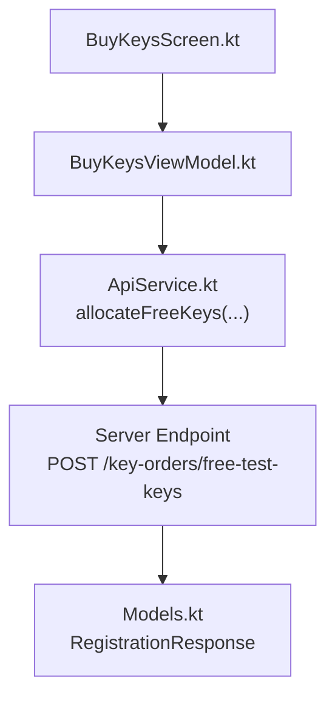
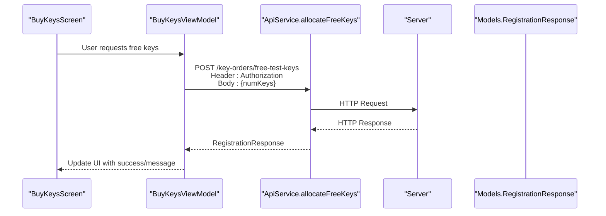
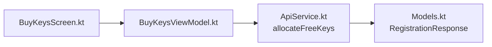

# Free Test Keys Allocation

<cite>
**Referenced Files in This Document**
- [ApiService.kt](file://app/src/main/java/com/pksafe/lock/manager/data/ApiService.kt)
- [Models.kt](file://app/src/main/java/com/pksafe/lock/manager/data/Models.kt)
- [BuyKeysScreen.kt](file://app/src/main/java/com/pksafe/lock/manager/ui/keys/BuyKeysScreen.kt)
- [BuyKeysViewModel.kt](file://app/src/main/java/com/pksafe/lock/manager/ui/keys/BuyKeysViewModel.kt)
</cite>

## Table of Contents
1. Introduction
2. Project Structure
3. Core Components
4. Architecture Overview
5. Detailed Component Analysis
6. Dependency Analysis
7. Performance Considerations
8. Troubleshooting Guide
9. Conclusion

## Introduction
This document explains the free test keys endpoint POST /key-orders/free-test-keys used to allocate trial license keys for testing. It covers request parameters, response structure, how allocated keys are added to the customer’s account, and best practices for using this endpoint in test environments. It also addresses limit enforcement scenarios and common issues such as exceeding free key limits and retry strategies.

## Project Structure
The free test keys feature is implemented on the client side via a Retrofit API interface and consumed by UI components. The relevant parts include:
- API definition for allocating free keys
- Data models for responses and related key order data
- UI screens and view model that handle user interactions and network calls

**Diagram sources**
- [ApiService.kt:144-148](file://app/src/main/java/com/pksafe/lock/manager/data/ApiService.kt#L144-L148)
- [Models.kt:205-209](file://app/src/main/java/com/pksafe/lock/manager/data/Models.kt#L205-L209)
- [BuyKeysScreen.kt:41-88](file://app/src/main/java/com/pksafe/lock/manager/ui/keys/BuyKeysScreen.kt#L41-L88)
- [BuyKeysViewModel.kt:18-31](file://app/src/main/java/com/pksafe/lock/manager/ui/keys/BuyKeysViewModel.kt#L18-L31)

**Section sources**
- [ApiService.kt:144-148](file://app/src/main/java/com/pksafe/lock/manager/data/ApiService.kt#L144-L148)
- [Models.kt:205-209](file://app/src/main/java/com/pksafe/lock/manager/data/Models.kt#L205-L209)
- [BuyKeysScreen.kt:41-88](file://app/src/main/java/com/pksafe/lock/manager/ui/keys/BuyKeysScreen.kt#L41-L88)
- [BuyKeysViewModel.kt:18-31](file://app/src/main/java/com/pksafe/lock/manager/ui/keys/BuyKeysViewModel.kt#L18-L31)

## Core Components
- API endpoint definition:
  - Method: POST
  - Path: /key-orders/free-test-keys
  - Header: Authorization (Bearer token)
  - Body: Map with key numKeys indicating the number of trial keys requested
  - Response: RegistrationResponse
- Data models:
  - RegistrationResponse includes success flag, message, and optional device summary
  - KeyOrderData and related structures are used elsewhere for key order history and display

Key responsibilities:
- Client constructs an authenticated request with numKeys
- Server validates eligibility and limits, then allocates keys to the authenticated shopkeeper’s account
- Client receives a standardized response indicating success or failure

**Section sources**
- [ApiService.kt:144-148](file://app/src/main/java/com/pksafe/lock/manager/data/ApiService.kt#L144-L148)
- [Models.kt:205-209](file://app/src/main/java/com/pksafe/lock/manager/data/Models.kt#L205-L209)
- [Models.kt:218-224](file://app/src/main/java/com/pksafe/lock/manager/data/Models.kt#L218-L224)

## Architecture Overview
The flow from UI to server and back is straightforward:
- UI triggers a call to allocate free keys
- ViewModel prepares and sends the request with Authorization header and body containing numKeys
- Server processes allocation and returns a RegistrationResponse
- UI updates state based on success or error

**Diagram sources**
- [ApiService.kt:144-148](file://app/src/main/java/com/pksafe/lock/manager/data/ApiService.kt#L144-L148)
- [Models.kt:205-209](file://app/src/main/java/com/pksafe/lock/manager/data/Models.kt#L205-L209)
- [BuyKeysScreen.kt:41-88](file://app/src/main/java/com/pksafe/lock/manager/ui/keys/BuyKeysScreen.kt#L41-L88)
- [BuyKeysViewModel.kt:18-31](file://app/src/main/java/com/pksafe/lock/manager/ui/keys/BuyKeysViewModel.kt#L18-L31)

## Detailed Component Analysis

### Endpoint Specification: POST /key-orders/free-test-keys
- Purpose: Allocate a specified number of free trial keys to the authenticated shopkeeper’s account
- Authentication: Requires Authorization header with a valid bearer token
- Request body:
  - numKeys: Integer string representing the number of trial keys to allocate
- Response:
  - success: Boolean indicating whether the allocation succeeded
  - message: Human-readable status or error message
  - device: Optional device summary (may be null for key-only operations)

Notes:
- The endpoint uses a generic Map body; only numKeys is required for free test keys
- The response follows the standard RegistrationResponse shape used across other endpoints

**Section sources**
- [ApiService.kt:144-148](file://app/src/main/java/com/pksafe/lock/manager/data/ApiService.kt#L144-L148)
- [Models.kt:205-209](file://app/src/main/java/com/pksafe/lock/manager/data/Models.kt#L205-L209)

### Usage Limits, Expiration Handling, and Restrictions
- Limit enforcement:
  - The client does not enforce per-request limits; it simply sends numKeys
  - The server is responsible for enforcing any caps on free test key allocations per shopkeeper or time window
- Expiration handling:
  - The client-side code does not manage expiration; this is handled server-side when keys are created and tracked
- Restrictions:
  - Only authenticated shopkeepers can request free keys
  - The server may restrict allocation based on policy (e.g., maximum per day, per month, or per shopkeeper)

Operational guidance:
- Always validate numKeys on the client to avoid unreasonable values
- Handle server errors gracefully and inform users about limit-related rejections

**Section sources**
- [ApiService.kt:144-148](file://app/src/main/java/com/pksafe/lock/manager/data/ApiService.kt#L144-L148)
- [Models.kt:205-209](file://app/src/main/java/com/pksafe/lock/manager/data/Models.kt#L205-L209)

### How Allocated Keys Are Added to the Customer’s Account
- The endpoint returns a RegistrationResponse indicating success or failure
- On success, the server adds the requested number of keys to the authenticated shopkeeper’s available key balance
- Clients typically rely on subsequent queries (e.g., dashboard stats or key history) to reflect updated balances

Best practice:
- After a successful allocation, refresh any views that show available keys or recent orders to ensure consistency

**Section sources**
- [Models.kt:205-209](file://app/src/main/java/com/pksafe/lock/manager/data/Models.kt#L205-L209)
- [Models.kt:218-224](file://app/src/main/java/com/pksafe/lock/manager/data/Models.kt#L218-L224)

### Example Requests and Responses
Example request:
- Method: POST
- Path: /key-orders/free-test-keys
- Headers: Authorization: Bearer <token>
- Body: {"numKeys": "10"}

Example response (success):
- success: true
- message: "Free keys allocated successfully"
- device: null

Example response (failure due to limit):
- success: false
- message: "Free key limit exceeded"
- device: null

Note: These examples illustrate typical payloads and outcomes based on the defined types and comments in the code.

**Section sources**
- [ApiService.kt:144-148](file://app/src/main/java/com/pksafe/lock/manager/data/ApiService.kt#L144-L148)
- [Models.kt:205-209](file://app/src/main/java/com/pksafe/lock/manager/data/Models.kt#L205-L209)

### Best Practices for Testing Environments
- Use small batches (e.g., 5–10 keys) to validate integration without consuming excessive resources
- Ensure Authorization header is correctly set before calling the endpoint
- Implement retries with exponential backoff for transient network errors
- Log request/response metadata (excluding secrets) for debugging
- Validate server responses and handle both success and failure paths in UI

**Section sources**
- [BuyKeysViewModel.kt:18-31](file://app/src/main/java/com/pksafe/lock/manager/ui/keys/BuyKeysViewModel.kt#L18-L31)
- [BuyKeysScreen.kt:41-88](file://app/src/main/java/com/pksafe/lock/manager/ui/keys/BuyKeysScreen.kt#L41-L88)

### Common Issues and Retry Mechanisms
- Exceeding free key limits:
  - Symptom: Response indicates failure with a message about limits
  - Resolution: Reduce numKeys or wait until the next allocation window if enforced by server policy
- Network errors:
  - Symptom: Exceptions during API calls
  - Resolution: Implement retry logic with backoff and user feedback
- Invalid or missing token:
  - Symptom: Authentication failures
  - Resolution: Ensure token is present and valid; refresh if necessary

Retry strategy recommendations:
- Retry on transient errors (network timeouts, 5xx server errors)
- Do not retry on authentication failures or explicit limit exceeded messages
- Cap the number of retries to prevent infinite loops

**Section sources**
- [BuyKeysViewModel.kt:18-31](file://app/src/main/java/com/pksafe/lock/manager/ui/keys/BuyKeysViewModel.kt#L18-L31)
- [BuyKeysScreen.kt:41-88](file://app/src/main/java/com/pksafe/lock/manager/ui/keys/BuyKeysScreen.kt#L41-L88)

## Dependency Analysis
The free test keys feature depends on:
- Retrofit API interface defining allocateFreeKeys
- Data models for responses and related key order data
- UI components that trigger the call and update state

**Diagram sources**
- [ApiService.kt:144-148](file://app/src/main/java/com/pksafe/lock/manager/data/ApiService.kt#L144-L148)
- [Models.kt:205-209](file://app/src/main/java/com/pksafe/lock/manager/data/Models.kt#L205-L209)
- [BuyKeysScreen.kt:41-88](file://app/src/main/java/com/pksafe/lock/manager/ui/keys/BuyKeysScreen.kt#L41-L88)
- [BuyKeysViewModel.kt:18-31](file://app/src/main/java/com/pksafe/lock/manager/ui/keys/BuyKeysViewModel.kt#L18-L31)

**Section sources**
- [ApiService.kt:144-148](file://app/src/main/java/com/pksafe/lock/manager/data/ApiService.kt#L144-L148)
- [Models.kt:205-209](file://app/src/main/java/com/pksafe/lock/manager/data/Models.kt#L205-L209)
- [BuyKeysScreen.kt:41-88](file://app/src/main/java/com/pksafe/lock/manager/ui/keys/BuyKeysScreen.kt#L41-L88)
- [BuyKeysViewModel.kt:18-31](file://app/src/main/java/com/pksafe/lock/manager/ui/keys/BuyKeysViewModel.kt#L18-L31)

## Performance Considerations
- Keep numKeys reasonable to minimize server load and database writes
- Avoid rapid repeated requests; implement rate limiting on the client side if needed
- Cache or debounce UI actions to prevent accidental duplicate submissions
- Monitor network latency and adjust retry policies accordingly

[No sources needed since this section provides general guidance]

## Troubleshooting Guide
- Verify Authorization header presence and validity
- Check numKeys value for correctness (positive integer)
- Inspect response.success and response.message for actionable feedback
- For limit-related failures, reduce request size or wait for next allocation window
- For network errors, implement retries with backoff and provide user-friendly messages

**Section sources**
- [BuyKeysViewModel.kt:18-31](file://app/src/main/java/com/pksafe/lock/manager/ui/keys/BuyKeysViewModel.kt#L18-L31)
- [BuyKeysScreen.kt:41-88](file://app/src/main/java/com/pksafe/lock/manager/ui/keys/BuyKeysScreen.kt#L41-L88)

## Conclusion
The POST /key-orders/free-test-keys endpoint enables quick allocation of trial keys for testing. By sending an authenticated request with numKeys, clients can obtain keys for development and QA workflows. Proper handling of responses, respect for server-enforced limits, and robust retry mechanisms ensure a smooth experience in test environments.

[No sources needed since this section summarizes without analyzing specific files]