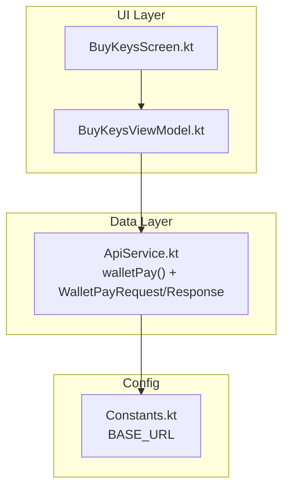
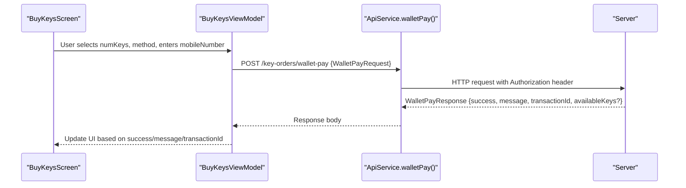
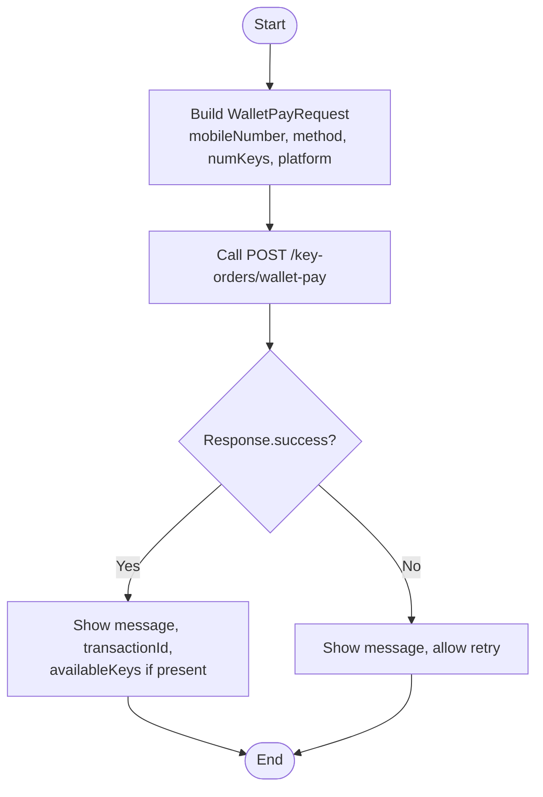

# Mobile Wallet Payment

<cite>
**Referenced Files in This Document**
- [ApiService.kt](file://app/src/main/java/com/pksafe/lock/manager/data/ApiService.kt)
- [BuyKeysScreen.kt](file://app/src/main/java/com/pksafe/lock/manager/ui/keys/BuyKeysScreen.kt)
- [BuyKeysViewModel.kt](file://app/src/main/java/com/pksafe/lock/manager/ui/keys/BuyKeysViewModel.kt)
- [Constants.kt](file://app/src/main/java/com/pksafe/lock/manager/util/Constants.kt)
</cite>

## Table of Contents
1. [Introduction](#introduction)
2. [Project Structure](#project-structure)
3. [Core Components](#core-components)
4. [Architecture Overview](#architecture-overview)
5. [Detailed Component Analysis](#detailed-component-analysis)
6. [Dependency Analysis](#dependency-analysis)
7. [Performance Considerations](#performance-considerations)
8. [Troubleshooting Guide](#troubleshooting-guide)
9. [Conclusion](#conclusion)

## Introduction
This document explains the mobile wallet payment endpoint POST /key-orders/wallet-pay for purchasing keys using EasyPaisa or JazzCash. It covers the request and response structures, validation expectations, platform specification, and how success and error states are communicated. It also provides complete flow examples from user input to confirmation and outlines best practices for handling failed transactions or insufficient balance scenarios.

## Project Structure
The wallet payment feature is defined by:
- API contract and data models in the data layer
- UI components that collect order details and display payment options
- Configuration for the base URL used by network calls

**Diagram sources**
- [ApiService.kt:150-154](file://app/src/main/java/com/pksafe/lock/manager/data/ApiService.kt#L150-L154)
- [ApiService.kt:187-199](file://app/src/main/java/com/pksafe/lock/manager/data/ApiService.kt#L187-L199)
- [BuyKeysScreen.kt:40-220](file://app/src/main/java/com/pksafe/lock/manager/ui/keys/BuyKeysScreen.kt#L40-L220)
- [BuyKeysViewModel.kt:18-31](file://app/src/main/java/com/pksafe/lock/manager/ui/keys/BuyKeysViewModel.kt#L18-L31)
- [Constants.kt:3-10](file://app/src/main/java/com/pksafe/lock/manager/util/Constants.kt#L3-L10)

**Section sources**
- [ApiService.kt:150-154](file://app/src/main/java/com/pksafe/lock/manager/data/ApiService.kt#L150-L154)
- [ApiService.kt:187-199](file://app/src/main/java/com/pksafe/lock/manager/data/ApiService.kt#L187-L199)
- [BuyKeysScreen.kt:40-220](file://app/src/main/java/com/pksafe/lock/manager/ui/keys/BuyKeysScreen.kt#L40-L220)
- [BuyKeysViewModel.kt:18-31](file://app/src/main/java/com/pksafe/lock/manager/ui/keys/BuyKeysViewModel.kt#L18-L31)
- [Constants.kt:3-10](file://app/src/main/java/com/pksafe/lock/manager/util/Constants.kt#L3-L10)

## Core Components
- Endpoint: POST /key-orders/wallet-pay
- Request model: WalletPayRequest
- Response model: WalletPayResponse
- Platform: android (default)
- Supported methods: EasyPaisa, JazzCash

Key responsibilities:
- Accept a mobile number, selected wallet method, number of keys, and platform
- Return success status, message, transactionId, and optionally availableKeys

**Section sources**
- [ApiService.kt:150-154](file://app/src/main/java/com/pksafe/lock/manager/data/ApiService.kt#L150-L154)
- [ApiService.kt:187-199](file://app/src/main/java/com/pksafe/lock/manager/data/ApiService.kt#L187-L199)

## Architecture Overview
The client constructs a WalletPayRequest with validated inputs and sends it to the server via Retrofit. The server processes the wallet payment and returns a WalletPayResponse indicating success or failure along with tracking information.

**Diagram sources**
- [ApiService.kt:150-154](file://app/src/main/java/com/pksafe/lock/manager/data/ApiService.kt#L150-L154)
- [ApiService.kt:187-199](file://app/src/main/java/com/pksafe/lock/manager/data/ApiService.kt#L187-L199)
- [BuyKeysScreen.kt:40-220](file://app/src/main/java/com/pksafe/lock/manager/ui/keys/BuyKeysScreen.kt#L40-L220)
- [BuyKeysViewModel.kt:18-31](file://app/src/main/java/com/pksafe/lock/manager/ui/keys/BuyKeysViewModel.kt#L18-L31)

## Detailed Component Analysis

### Endpoint Definition and Data Models
- Endpoint: POST /key-orders/wallet-pay
- Headers: Authorization (Bearer token)
- Body: WalletPayRequest
- Response: WalletPayResponse

WalletPayRequest fields:
- mobileNumber: String — user’s mobile wallet number
- method: String — must be "EasyPaisa" or "JazzCash"
- numKeys: String — quantity of keys to purchase
- platform: String — defaults to "android"

WalletPayResponse fields:
- success: Boolean — indicates whether the payment succeeded
- message: String — human-readable status or error message
- transactionId: String — unique identifier for the transaction
- availableKeys: Int? — optional allocation of keys upon success

**Section sources**
- [ApiService.kt:150-154](file://app/src/main/java/com/pksafe/lock/manager/data/ApiService.kt#L150-L154)
- [ApiService.kt:187-199](file://app/src/main/java/com/pksafe/lock/manager/data/ApiService.kt#L187-L199)

### Request Validation and Formatting
- mobileNumber: Provide a valid mobile number string associated with the chosen wallet provider. Ensure no leading/trailing spaces and consistent formatting expected by the backend.
- method: Choose exactly one of the supported values: "EasyPaisa" or "JazzCash".
- numKeys: Numeric string representing the desired key count. Validate that it represents a positive integer before sending.
- platform: Defaults to "android"; can be omitted if not required.

Validation recommendations:
- Trim whitespace from mobileNumber
- Enforce numeric-only input for numKeys
- Validate method against allowed values before calling the API

**Section sources**
- [ApiService.kt:187-192](file://app/src/main/java/com/pksafe/lock/manager/data/ApiService.kt#L187-L192)

### Success Flow Example
1. User selects numKeys and chooses a wallet method (EasyPaisa or JazzCash).
2. User enters their mobileNumber.
3. Client constructs WalletPayRequest and calls walletPay with Authorization header.
4. Server processes payment and returns WalletPayResponse.
5. On success:
   - Display success message
   - Show transactionId for tracking
   - If availableKeys is present, show allocated keys

[No sources needed since this diagram shows conceptual workflow, not actual code structure]

### Error Handling Example
- Insufficient balance or invalid mobileNumber:
  - success = false
  - message contains guidance (e.g., insufficient funds)
  - transactionId may still be provided for reference
- Network or server errors:
  - Handle exceptions at the client layer
  - Show generic error message and enable retry

Best practices:
- Always check response.success before proceeding
- Log transactionId for support cases
- Retry only for transient network issues

**Section sources**
- [ApiService.kt:194-199](file://app/src/main/java/com/pksafe/lock/manager/data/ApiService.kt#L194-L199)

### UI Integration Notes
- The BuyKeysScreen collects order details (numKeys) and displays payment options. While the current screen focuses on manual payment proof submission, the same data model and endpoint can be integrated to support direct wallet payments.
- The BuyKeysViewModel demonstrates how to build requests and handle responses; adapt the pattern to call walletPay instead of submitKeyRequest when implementing wallet payments.

**Section sources**
- [BuyKeysScreen.kt:40-220](file://app/src/main/java/com/pksafe/lock/manager/ui/keys/BuyKeysScreen.kt#L40-L220)
- [BuyKeysViewModel.kt:18-31](file://app/src/main/java/com/pksafe/lock/manager/ui/keys/BuyKeysViewModel.kt#L18-L31)

## Dependency Analysis
- ApiService defines the walletPay function and data models used across the app.
- BuyKeysScreen and BuyKeysViewModel depend on ApiService for network operations.
- Constants provides the BASE_URL used by Retrofit.

**Diagram sources**
- [ApiService.kt:150-154](file://app/src/main/java/com/pksafe/lock/manager/data/ApiService.kt#L150-L154)
- [BuyKeysScreen.kt:40-220](file://app/src/main/java/com/pksafe/lock/manager/ui/keys/BuyKeysScreen.kt#L40-L220)
- [BuyKeysViewModel.kt:18-31](file://app/src/main/java/com/pksafe/lock/manager/ui/keys/BuyKeysViewModel.kt#L18-L31)
- [Constants.kt:3-10](file://app/src/main/java/com/pksafe/lock/manager/util/Constants.kt#L3-L10)

**Section sources**
- [ApiService.kt:150-154](file://app/src/main/java/com/pksafe/lock/manager/data/ApiService.kt#L150-L154)
- [BuyKeysScreen.kt:40-220](file://app/src/main/java/com/pksafe/lock/manager/ui/keys/BuyKeysScreen.kt#L40-L220)
- [BuyKeysViewModel.kt:18-31](file://app/src/main/java/com/pksafe/lock/manager/ui/keys/BuyKeysViewModel.kt#L18-L31)
- [Constants.kt:3-10](file://app/src/main/java/com/pksafe/lock/manager/util/Constants.kt#L3-L10)

## Performance Considerations
- Keep requests lightweight: send only necessary fields (mobileNumber, method, numKeys, platform).
- Avoid redundant retries on non-transient errors; rely on server-side idempotency where possible.
- Cache or reuse network clients (Retrofit instance) to reduce overhead.
- Debounce rapid user actions (e.g., multiple taps) to prevent duplicate requests.

[No sources needed since this section provides general guidance]

## Troubleshooting Guide
Common issues and resolutions:
- Invalid mobileNumber:
  - Ensure correct format and no extra characters
  - Confirm the number is registered with the selected wallet provider
- Unsupported method:
  - Use exactly "EasyPaisa" or "JazzCash"
- Insufficient balance:
  - Display the message returned by the server
  - Prompt user to add funds or choose another method
- Network errors:
  - Check connectivity and retry once
  - Log transactionId if provided for support follow-up

Operational tips:
- Always log transactionId from successful or failed responses
- Surface user-friendly messages derived from server.message
- For repeated failures, guide users to verify wallet account status

**Section sources**
- [ApiService.kt:194-199](file://app/src/main/java/com/pksafe/lock/manager/data/ApiService.kt#L194-L199)

## Conclusion
The POST /key-orders/wallet-pay endpoint enables secure key purchases via EasyPaisa or JazzCash. By validating inputs, constructing a proper WalletPayRequest, and handling WalletPayResponse correctly, the app can provide a smooth payment experience with clear feedback and robust error handling. Use transactionId for tracking and leverage availableKeys when present to confirm allocations.

[No sources needed since this section summarizes without analyzing specific files]