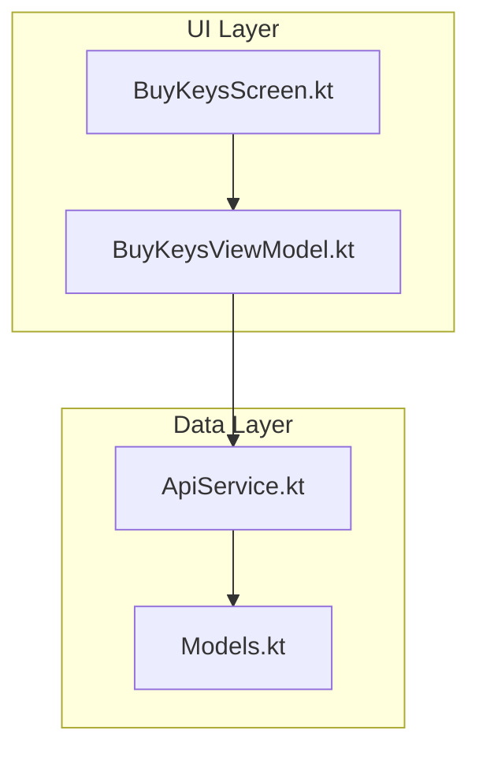
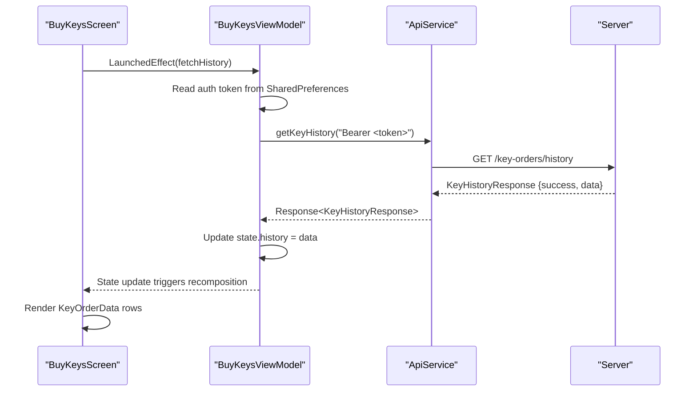
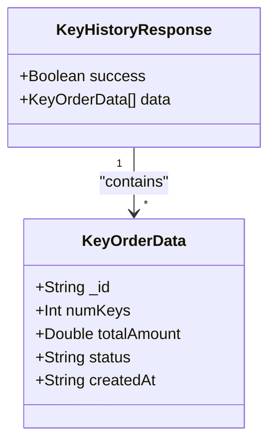
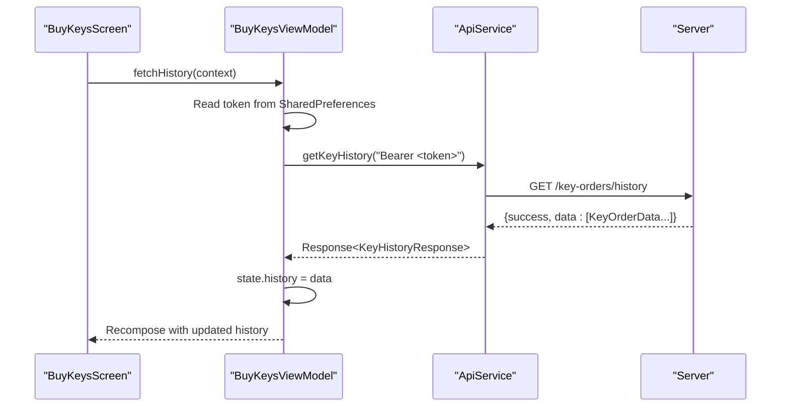
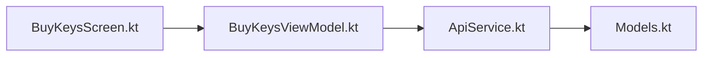

# Payment History Retrieval

<cite>
**Referenced Files in This Document**
- [ApiService.kt](file://app/src/main/java/com/pksafe/lock/manager/data/ApiService.kt)
- [Models.kt](file://app/src/main/java/com/pksafe/lock/manager/data/Models.kt)
- [BuyKeysViewModel.kt](file://app/src/main/java/com/pksafe/lock/manager/ui/keys/BuyKeysViewModel.kt)
- [BuyKeysScreen.kt](file://app/src/main/java/com/pksafe/lock/manager/ui/keys/BuyKeysScreen.kt)
</cite>

## Table of Contents
1. Introduction
2. Project Structure
3. Core Components
4. Architecture Overview
5. Detailed Component Analysis
6. Dependency Analysis
7. Performance Considerations
8. Troubleshooting Guide
9. Conclusion

## Introduction
This document explains how to retrieve and display the payment history for key orders using the GET /key-orders/history endpoint. It covers the response structure, authentication, data fields, UI integration patterns, and best practices for presenting order details, amounts paid, payment statuses, and timestamps to customers.

## Project Structure
The payment history feature is implemented on the Android client side with:
- API definition and response models in the data layer
- A ViewModel that fetches history from the server
- A Compose screen that renders the list of orders

**Diagram sources**
- [BuyKeysScreen.kt:40-56](file://app/src/main/java/com/pksafe/lock/manager/ui/keys/BuyKeysScreen.kt#L40-L56)
- [BuyKeysViewModel.kt:18-45](file://app/src/main/java/com/pksafe/lock/manager/ui/keys/BuyKeysViewModel.kt#L18-L45)
- [ApiService.kt:156-159](file://app/src/main/java/com/pksafe/lock/manager/data/ApiService.kt#L156-L159)
- [ApiService.kt:213-224](file://app/src/main/java/com/pksafe/lock/manager/data/ApiService.kt#L213-L224)

**Section sources**
- [BuyKeysScreen.kt:40-56](file://app/src/main/java/com/pksafe/lock/manager/ui/keys/BuyKeysScreen.kt#L40-L56)
- [BuyKeysViewModel.kt:18-45](file://app/src/main/java/com/pksafe/lock/manager/ui/keys/BuyKeysViewModel.kt#L18-L45)
- [ApiService.kt:156-159](file://app/src/main/java/com/pksafe/lock/manager/data/ApiService.kt#L156-L159)
- [ApiService.kt:213-224](file://app/src/main/java/com/pksafe/lock/manager/data/ApiService.kt#L213-L224)

## Core Components
- Endpoint: GET /key-orders/history
- Authentication: Authorization header with a bearer token
- Request: No query parameters or body
- Response: KeyHistoryResponse containing a list of KeyOrderData items

KeyHistoryResponse fields:
- success: Boolean indicating overall request success
- data: List<KeyOrderData>

KeyOrderData fields:
- _id: String (unique order identifier)
- numKeys: Int (number of keys purchased)
- totalAmount: Double (amount paid for the order)
- status: String (payment/order status; e.g., pending, approved, rejected)
- createdAt: String (timestamp when the order was created)

These structures are defined in the data layer and consumed by the UI.

**Section sources**
- [ApiService.kt:156-159](file://app/src/main/java/com/pksafe/lock/manager/data/ApiService.kt#L156-L159)
- [ApiService.kt:213-224](file://app/src/main/java/com/pksafe/lock/manager/data/ApiService.kt#L213-L224)

## Architecture Overview
The flow to retrieve and display payment history:
1. The BuyKeysScreen triggers history retrieval on load.
2. BuyKeysViewModel reads the stored auth token and calls ApiService.getKeyHistory.
3. ApiService sends a GET request to /key-orders/history with Authorization header.
4. Server returns KeyHistoryResponse; ViewModel stores the list in state.
5. BuyKeysScreen observes the state and renders each KeyOrderData as a row.

**Diagram sources**
- [BuyKeysScreen.kt:56-56](file://app/src/main/java/com/pksafe/lock/manager/ui/keys/BuyKeysScreen.kt#L56-L56)
- [BuyKeysViewModel.kt:33-45](file://app/src/main/java/com/pksafe/lock/manager/ui/keys/BuyKeysViewModel.kt#L33-L45)
- [ApiService.kt:156-159](file://app/src/main/java/com/pksafe/lock/manager/data/ApiService.kt#L156-L159)
- [ApiService.kt:213-224](file://app/src/main/java/com/pksafe/lock/manager/data/ApiService.kt#L213-L224)

## Detailed Component Analysis

### API Definition and Data Models
- Endpoint: @GET("key-orders/history")
- Method signature: suspend fun getKeyHistory(@Header("Authorization") token: String): Response<KeyHistoryResponse>
- Response model: KeyHistoryResponse(success: Boolean, data: List<KeyOrderData>)
- Item model: KeyOrderData(_id: String, numKeys: Int, totalAmount: Double, status: String, createdAt: String)

Notes:
- The method requires an Authorization header with a bearer token.
- The response wraps a success flag and a list of order records.

**Section sources**
- [ApiService.kt:156-159](file://app/src/main/java/com/pksafe/lock/manager/data/ApiService.kt#L156-L159)
- [ApiService.kt:213-224](file://app/src/main/java/com/pksafe/lock/manager/data/ApiService.kt#L213-L224)

### ViewModel: Fetching History
Responsibilities:
- Retrieve the stored auth token from SharedPreferences
- Call ApiService.getKeyHistory with the token
- On successful response, store the list of KeyOrderData in state.history
- Handle exceptions silently (current implementation catches and ignores errors)

Usage:
- Exposed via a public function fetchHistory(context)
- Called from the UI on screen start

Error handling:
- Network or parsing errors are caught and ignored; consider surfacing user-facing messages.

**Section sources**
- [BuyKeysViewModel.kt:18-45](file://app/src/main/java/com/pksafe/lock/manager/ui/keys/BuyKeysViewModel.kt#L18-L45)

### UI: Displaying Payment History
Behavior:
- On first composition, the screen invokes fetchHistory to load orders
- If no orders exist, a placeholder message is shown
- Each order is rendered as a compact row showing:
  - Number of keys
  - Total amount
  - Status badge with color coding based on status value
  - Timestamp field exists in the model but is not currently displayed in the row

Rendering details:
- Status colors:
  - Approved/success/completed -> green-like background and text
  - Pending -> yellow-like background and text
  - Other statuses -> red-like background and text

Accessibility tips:
- Ensure status labels are readable and contrasted
- Provide meaningful content descriptions for icons

**Section sources**
- [BuyKeysScreen.kt:56-56](file://app/src/main/java/com/pksafe/lock/manager/ui/keys/BuyKeysScreen.kt#L56-L56)
- [BuyKeysScreen.kt:225-236](file://app/src/main/java/com/pksafe/lock/manager/ui/keys/BuyKeysScreen.kt#L225-L236)
- [BuyKeysScreen.kt:261-299](file://app/src/main/java/com/pksafe/lock/manager/ui/keys/BuyKeysScreen.kt#L261-L299)

### Class Diagram: Data Structures

**Diagram sources**
- [ApiService.kt:213-224](file://app/src/main/java/com/pksafe/lock/manager/data/ApiService.kt#L213-L224)

### Sequence Diagram: History Retrieval Flow

**Diagram sources**
- [BuyKeysViewModel.kt:33-45](file://app/src/main/java/com/pksafe/lock/manager/ui/keys/BuyKeysViewModel.kt#L33-L45)
- [ApiService.kt:156-159](file://app/src/main/java/com/pksafe/lock/manager/data/ApiService.kt#L156-L159)
- [ApiService.kt:213-224](file://app/src/main/java/com/pksafe/lock/manager/data/ApiService.kt#L213-L224)

## Dependency Analysis
- BuyKeysScreen depends on BuyKeysViewModel for state and data fetching
- BuyKeysViewModel depends on ApiService for network calls
- ApiService defines the endpoint and response types
- Models define the shape of KeyHistoryResponse and KeyOrderData

**Diagram sources**
- [BuyKeysScreen.kt:40-56](file://app/src/main/java/com/pksafe/lock/manager/ui/keys/BuyKeysScreen.kt#L40-L56)
- [BuyKeysViewModel.kt:18-45](file://app/src/main/java/com/pksafe/lock/manager/ui/keys/BuyKeysViewModel.kt#L18-L45)
- [ApiService.kt:156-159](file://app/src/main/java/com/pksafe/lock/manager/data/ApiService.kt#L156-L159)
- [ApiService.kt:213-224](file://app/src/main/java/com/pksafe/lock/manager/data/ApiService.kt#L213-L224)

**Section sources**
- [BuyKeysScreen.kt:40-56](file://app/src/main/java/com/pksafe/lock/manager/ui/keys/BuyKeysScreen.kt#L40-L56)
- [BuyKeysViewModel.kt:18-45](file://app/src/main/java/com/pksafe/lock/manager/ui/keys/BuyKeysViewModel.kt#L18-L45)
- [ApiService.kt:156-159](file://app/src/main/java/com/pksafe/lock/manager/data/ApiService.kt#L156-L159)
- [ApiService.kt:213-224](file://app/src/main/java/com/pksafe/lock/manager/data/ApiService.kt#L213-L224)

## Performance Considerations
- Caching: Consider caching the last fetched history locally to reduce network calls and improve perceived performance.
- Pagination: The current endpoint does not expose pagination parameters; if the list grows large, implement server-side pagination and UI-level paging (e.g., lazy loading).
- Error resilience: Improve error handling to inform users about failures and allow retry.
- Image handling: If future versions include images in history, use efficient image loading and caching strategies.

[No sources needed since this section provides general guidance]

## Troubleshooting Guide
Common issues and resolutions:
- Empty history:
  - Verify that the user is authenticated and a valid token is stored.
  - Confirm the server returns a non-empty list for the authenticated user.
- Network errors:
  - Check connectivity and server availability.
  - Review exception handling in the ViewModel; consider surfacing errors to the UI.
- Incorrect status display:
  - Ensure status values match expected strings (e.g., pending, approved, rejected).
  - Validate UI mapping logic for status colors.

Operational checks:
- Confirm Authorization header format: "Bearer <token>"
- Validate response parsing: ensure Gson deserializes KeyHistoryResponse correctly

**Section sources**
- [BuyKeysViewModel.kt:33-45](file://app/src/main/java/com/pksafe/lock/manager/ui/keys/BuyKeysViewModel.kt#L33-L45)
- [BuyKeysScreen.kt:225-236](file://app/src/main/java/com/pksafe/lock/manager/ui/keys/BuyKeysScreen.kt#L225-L236)
- [BuyKeysScreen.kt:261-299](file://app/src/main/java/com/pksafe/lock/manager/ui/keys/BuyKeysScreen.kt#L261-L299)

## Conclusion
The GET /key-orders/history endpoint provides a straightforward way to retrieve a customer’s purchase history. The response contains a list of orders with essential fields such as order ID, number of keys, total amount, status, and creation timestamp. The Android app integrates this endpoint via a ViewModel and displays results in a clean, user-friendly list. For production readiness, consider adding robust error handling, optional local caching, and future-proofing for pagination and richer order details.

[No sources needed since this section summarizes without analyzing specific files]