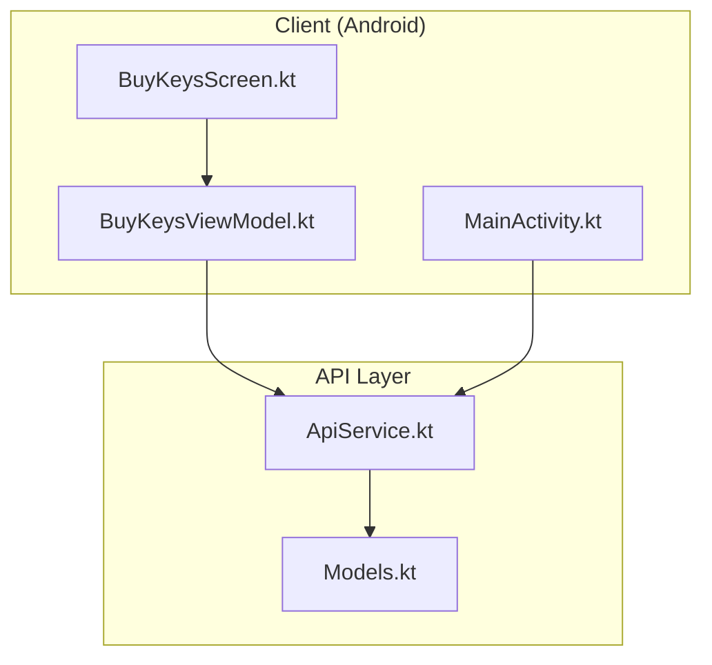
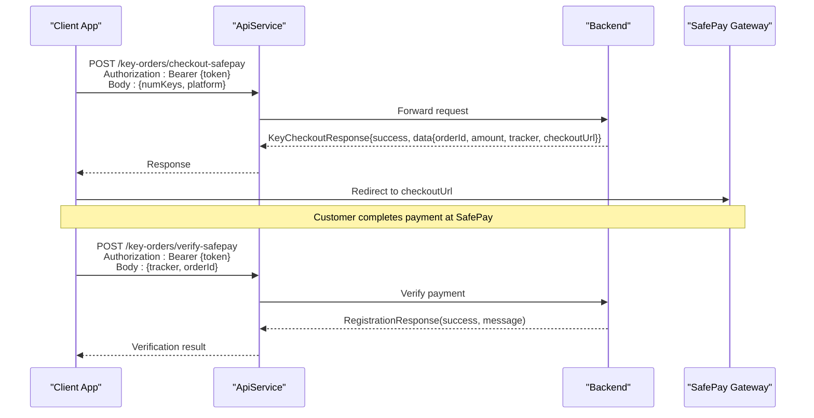
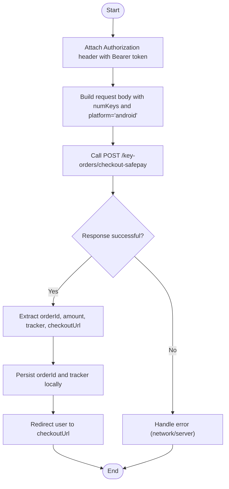
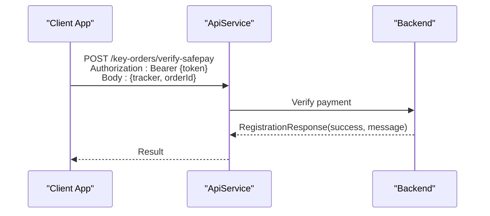
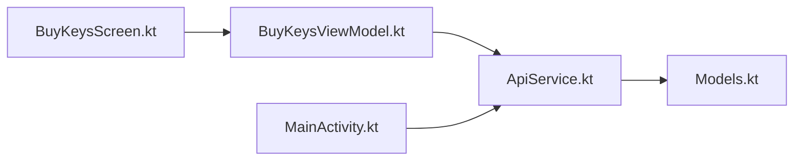

# SafePay Checkout Endpoint

<cite>
**Referenced Files in This Document**
- [ApiService.kt](file://app/src/main/java/com/pksafe/lock/manager/data/ApiService.kt)
- [Models.kt](file://app/src/main/java/com/pksafe/lock/manager/data/Models.kt)
- [BuyKeysScreen.kt](file://app/src/main/java/com/pksafe/lock/manager/ui/keys/BuyKeysScreen.kt)
- [BuyKeysViewModel.kt](file://app/src/main/java/com/pksafe/lock/manager/ui/keys/BuyKeysViewModel.kt)
- [MainActivity.kt](file://app/src/main/java/com/pksafe/lock/manager/MainActivity.kt)
</cite>

## Table of Contents
1. [Introduction](#introduction)
2. [Project Structure](#project-structure)
3. [Core Components](#core-components)
4. [Architecture Overview](#architecture-overview)
5. [Detailed Component Analysis](#detailed-component-analysis)
6. [Dependency Analysis](#dependency-analysis)
7. [Performance Considerations](#performance-considerations)
8. [Troubleshooting Guide](#troubleshooting-guide)
9. [Conclusion](#conclusion)

## Introduction
This document specifies the SafePay checkout endpoint POST /key-orders/checkout-safepay used to initiate a key purchase flow via SafePay. It covers request parameters, response structure, authentication, and the end-to-end payment flow from order creation to redirect generation and verification.

## Project Structure
The SafePay checkout is defined in the API service layer with corresponding data models. The UI exposes key purchase flows and integrates with the API for checkout and verification.

**Diagram sources**
- [ApiService.kt:131-142](file://app/src/main/java/com/pksafe/lock/manager/data/ApiService.kt#L131-L142)
- [Models.kt:201-211](file://app/src/main/java/com/pksafe/lock/manager/data/Models.kt#L201-L211)
- [BuyKeysScreen.kt:41-221](file://app/src/main/java/com/pksafe/lock/manager/ui/keys/BuyKeysScreen.kt#L41-L221)
- [BuyKeysViewModel.kt:18-81](file://app/src/main/java/com/pksafe/lock/manager/ui/keys/BuyKeysViewModel.kt#L18-L81)
- [MainActivity.kt:108-123](file://app/src/main/java/com/pksafe/lock/manager/MainActivity.kt#L108-L123)

**Section sources**
- [ApiService.kt:131-142](file://app/src/main/java/com/pksafe/lock/manager/data/ApiService.kt#L131-L142)
- [Models.kt:201-211](file://app/src/main/java/com/pksafe/lock/manager/data/Models.kt#L201-L211)
- [BuyKeysScreen.kt:41-221](file://app/src/main/java/com/pksafe/lock/manager/ui/keys/BuyKeysScreen.kt#L41-L221)
- [BuyKeysViewModel.kt:18-81](file://app/src/main/java/com/pksafe/lock/manager/ui/keys/BuyKeysViewModel.kt#L18-L81)
- [MainActivity.kt:108-123](file://app/src/main/java/com/pksafe/lock/manager/MainActivity.kt#L108-L123)

## Core Components
- Endpoint: POST /key-orders/checkout-safepay
- Request body: Map containing numKeys and platform
- Authentication: Authorization header with Bearer token
- Response: KeyCheckoutResponse wrapping SafepayData

Key fields:
- Request
  - numKeys: number of keys to purchase
  - platform: target platform; use "android"
- Response
  - success: boolean indicating overall success
  - data: SafepayData
    - orderId: unique order identifier
    - amount: calculated total based on key quantity
    - tracker: string used for payment verification
    - checkoutUrl: URL to redirect the customer to SafePay gateway

**Section sources**
- [ApiService.kt:131-136](file://app/src/main/java/com/pksafe/lock/manager/data/ApiService.kt#L131-L136)
- [ApiService.kt:201-211](file://app/src/main/java/com/pksafe/lock/manager/data/ApiService.kt#L201-L211)

## Architecture Overview
The checkout flow involves creating an order via the SafePay checkout endpoint, receiving a redirect URL, and later verifying payment completion using the verify endpoint.

**Diagram sources**
- [ApiService.kt:131-142](file://app/src/main/java/com/pksafe/lock/manager/data/ApiService.kt#L131-L142)
- [ApiService.kt:201-211](file://app/src/main/java/com/pksafe/lock/manager/data/ApiService.kt#L201-L211)

## Detailed Component Analysis

### Endpoint Specification: POST /key-orders/checkout-safepay
- Purpose: Create a SafePay checkout session for purchasing keys and obtain a redirect URL.
- Authentication: Requires Authorization header with Bearer token.
- Request Body:
  - numKeys: integer or numeric string representing the number of keys to purchase
  - platform: string; set to "android"
- Response:
  - success: boolean
  - data: SafepayData
    - orderId: string
    - amount: double; computed from key quantity and pricing rules
    - tracker: string; used to verify payment status
    - checkoutUrl: string; redirect to SafePay payment page

Notes:
- Amount calculation is performed server-side based on numKeys.
- The client should persist orderId and tracker to support verification after redirect.

**Section sources**
- [ApiService.kt:131-136](file://app/src/main/java/com/pksafe/lock/manager/data/ApiService.kt#L131-L136)
- [ApiService.kt:201-211](file://app/src/main/java/com/pksafe/lock/manager/data/ApiService.kt#L201-L211)

### Data Models
- KeyCheckoutResponse: wraps success flag and SafepayData payload.
- SafepayData: contains orderId, amount, tracker, and checkoutUrl.

These types define the contract between client and server for checkout operations.

**Section sources**
- [ApiService.kt:201-211](file://app/src/main/java/com/pksafe/lock/manager/data/ApiService.kt#L201-L211)

### Payment Flow: Order Creation to Redirect Generation

**Diagram sources**
- [ApiService.kt:131-136](file://app/src/main/java/com/pksafe/lock/manager/data/ApiService.kt#L131-L136)
- [ApiService.kt:201-211](file://app/src/main/java/com/pksafe/lock/manager/data/ApiService.kt#L201-L211)

### Payment Verification Flow
After redirecting to SafePay and completing payment, the app verifies the transaction using the verify endpoint.

**Diagram sources**
- [ApiService.kt:138-142](file://app/src/main/java/com/pksafe/lock/manager/data/ApiService.kt#L138-L142)

### UI Integration and State Management
- BuyKeysScreen presents package options and calculates payable amounts locally for display purposes.
- BuyKeysViewModel handles network calls and state updates for key requests and history retrieval.
- MainActivity processes deep links that may carry payment results back into the app.

Integration notes:
- Ensure Authorization header is included for all API calls.
- After checkout redirect, handle return flows and trigger verification if needed.

**Section sources**
- [BuyKeysScreen.kt:41-221](file://app/src/main/java/com/pksafe/lock/manager/ui/keys/BuyKeysScreen.kt#L41-L221)
- [BuyKeysViewModel.kt:18-81](file://app/src/main/java/com/pksafe/lock/manager/ui/keys/BuyKeysViewModel.kt#L18-L81)
- [MainActivity.kt:108-123](file://app/src/main/java/com/pksafe/lock/manager/MainActivity.kt#L108-L123)

## Dependency Analysis
- ApiService defines the endpoints and response types used by the UI components.
- Models define shared structures for requests and responses across features.
- UI components depend on ApiService for network operations and on local storage for tokens and state.

**Diagram sources**
- [ApiService.kt:131-142](file://app/src/main/java/com/pksafe/lock/manager/data/ApiService.kt#L131-L142)
- [Models.kt:201-211](file://app/src/main/java/com/pksafe/lock/manager/data/Models.kt#L201-L211)
- [BuyKeysScreen.kt:41-221](file://app/src/main/java/com/pksafe/lock/manager/ui/keys/BuyKeysScreen.kt#L41-L221)
- [BuyKeysViewModel.kt:18-81](file://app/src/main/java/com/pksafe/lock/manager/ui/keys/BuyKeysViewModel.kt#L18-L81)
- [MainActivity.kt:108-123](file://app/src/main/java/com/pksafe/lock/manager/MainActivity.kt#L108-L123)

**Section sources**
- [ApiService.kt:131-142](file://app/src/main/java/com/pksafe/lock/manager/data/ApiService.kt#L131-L142)
- [Models.kt:201-211](file://app/src/main/java/com/pksafe/lock/manager/data/Models.kt#L201-L211)
- [BuyKeysScreen.kt:41-221](file://app/src/main/java/com/pksafe/lock/manager/ui/keys/BuyKeysScreen.kt#L41-L221)
- [BuyKeysViewModel.kt:18-81](file://app/src/main/java/com/pksafe/lock/manager/ui/keys/BuyKeysViewModel.kt#L18-L81)
- [MainActivity.kt:108-123](file://app/src/main/java/com/pksafe/lock/manager/MainActivity.kt#L108-L123)

## Performance Considerations
- Keep network calls asynchronous and avoid blocking the UI thread.
- Cache or reuse Retrofit instances to reduce overhead.
- Validate inputs (e.g., numKeys > 0) before making requests to minimize unnecessary network calls.
- Handle timeouts and retries appropriately for robustness.

[No sources needed since this section provides general guidance]

## Troubleshooting Guide
Common issues and resolutions:
- Missing or invalid Authorization header: Ensure a valid Bearer token is attached to all API calls.
- Invalid numKeys: Validate that numKeys is a positive integer before calling the endpoint.
- Network errors: Implement retry logic and user-friendly error messages.
- Payment verification failures: Confirm that tracker and orderId are correctly persisted and passed to the verify endpoint.

**Section sources**
- [ApiService.kt:131-142](file://app/src/main/java/com/pksafe/lock/manager/data/ApiService.kt#L131-L142)
- [BuyKeysViewModel.kt:47-81](file://app/src/main/java/com/pksafe/lock/manager/ui/keys/BuyKeysViewModel.kt#L47-L81)
- [MainActivity.kt:108-123](file://app/src/main/java/com/pksafe/lock/manager/MainActivity.kt#L108-L123)

## Conclusion
The SafePay checkout endpoint enables secure key purchases by creating an order and returning a redirect URL to the SafePay gateway. Clients must authenticate requests, send numKeys and platform, handle the response to redirect users, and verify payment completion using the provided tracker and orderId. Proper error handling and input validation ensure a smooth integration experience.