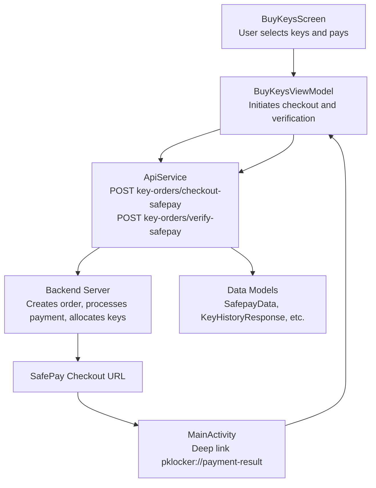
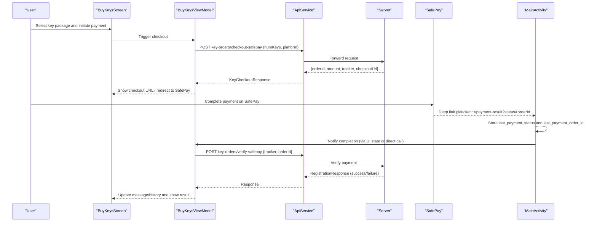
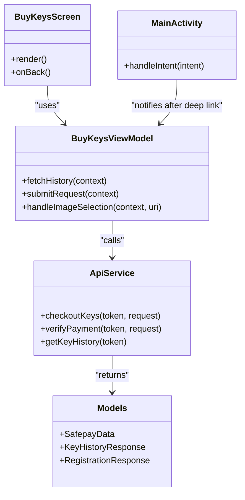

# SafePay Payment Verification

<cite>
**Referenced Files in This Document**
- [ApiService.kt](file://app/src/main/java/com/pksafe/lock/manager/data/ApiService.kt)
- [Models.kt](file://app/src/main/java/com/pksafe/lock/manager/data/Models.kt)
- [BuyKeysScreen.kt](file://app/src/main/java/com/pksafe/lock/manager/ui/keys/BuyKeysScreen.kt)
- [BuyKeysViewModel.kt](file://app/src/main/java/com/pksafe/lock/manager/ui/keys/BuyKeysViewModel.kt)
- [AdminKeyOrdersScreen.kt](file://app/src/main/java/com/pksafe/lock/manager/ui/keys/AdminKeyOrdersScreen.kt)
- [MainActivity.kt](file://app/src/main/java/com/pksafe/lock/manager/MainActivity.kt)
</cite>

## Table of Contents
1. Introduction
2. Project Structure
3. Core Components
4. Architecture Overview
5. Detailed Component Analysis
6. Dependency Analysis
7. Performance Considerations
8. Troubleshooting Guide
9. Conclusion

## Introduction
This document explains the SafePay payment verification flow for the POST /key-orders/verify-safepay endpoint used by the app to validate completed payments and allocate keys to the customer’s account. It covers:
- How the app initiates a SafePay checkout, receives a redirect callback with order details, and verifies the payment using tracker and orderId.
- What happens when payment is confirmed (automatic key allocation).
- Error scenarios such as invalid trackers, expired orders, or failed verifications.
- A complete end-to-end flow from redirect callback to key distribution, including error handling and user feedback.

## Project Structure
The SafePay verification flow spans UI, ViewModel, and API layers:
- UI layer: BuyKeysScreen presents purchase options and triggers requests.
- ViewModel: Orchestrates network calls and updates UI state.
- API layer: ApiService defines endpoints including SafePay checkout and verification.
- Data models: Define request/response structures for SafePay and key orders.
- MainActivity: Handles deep link callbacks from SafePay redirects.

**Diagram sources**
- [ApiService.kt:132-142](file://app/src/main/java/com/pksafe/lock/manager/data/ApiService.kt#L132-L142)
- [ApiService.kt:201-211](file://app/src/main/java/com/pksafe/lock/manager/data/ApiService.kt#L201-L211)
- [MainActivity.kt:108-123](file://app/src/main/java/com/pksafe/lock/manager/MainActivity.kt#L108-L123)
- [BuyKeysScreen.kt:41-221](file://app/src/main/java/com/pksafe/lock/manager/ui/keys/BuyKeysScreen.kt#L41-L221)
- [BuyKeysViewModel.kt:18-95](file://app/src/main/java/com/pksafe/lock/manager/ui/keys/BuyKeysViewModel.kt#L18-L95)

**Section sources**
- [ApiService.kt:132-142](file://app/src/main/java/com/pksafe/lock/manager/data/ApiService.kt#L132-L142)
- [ApiService.kt:201-211](file://app/src/main/java/com/pksafe/lock/manager/data/ApiService.kt#L201-L211)
- [MainActivity.kt:108-123](file://app/src/main/java/com/pksafe/lock/manager/MainActivity.kt#L108-L123)
- [BuyKeysScreen.kt:41-221](file://app/src/main/java/com/pksafe/lock/manager/ui/keys/BuyKeysScreen.kt#L41-L221)
- [BuyKeysViewModel.kt:18-95](file://app/src/main/java/com/pksafe/lock/manager/ui/keys/BuyKeysViewModel.kt#L18-L95)

## Core Components
- ApiService: Defines the SafePay checkout and verification endpoints and data models.
- BuyKeysScreen: User interface for selecting key packages and initiating payment flows.
- BuyKeysViewModel: Manages state and network calls for key purchases and history retrieval.
- MainActivity: Receives deep link callbacks from SafePay redirects and stores status/orderId.
- AdminKeyOrdersScreen: Displays admin view of key orders and supports manual approval/rejection workflows.

Key responsibilities:
- Checkout initiation: Create an order via SafePay and obtain orderId, amount, tracker, and checkoutUrl.
- Verification: Validate payment using tracker and orderId; upon success, allocate keys automatically.
- Callback handling: Capture redirect parameters and trigger verification.
- Error handling: Provide user feedback for failures and invalid inputs.

**Section sources**
- [ApiService.kt:132-142](file://app/src/main/java/com/pksafe/lock/manager/data/ApiService.kt#L132-L142)
- [ApiService.kt:201-211](file://app/src/main/java/com/pksafe/lock/manager/data/ApiService.kt#L201-L211)
- [BuyKeysScreen.kt:41-221](file://app/src/main/java/com/pksafe/lock/manager/ui/keys/BuyKeysScreen.kt#L41-L221)
- [BuyKeysViewModel.kt:18-95](file://app/src/main/java/com/pksafe/lock/manager/ui/keys/BuyKeysViewModel.kt#L18-L95)
- [MainActivity.kt:108-123](file://app/src/main/java/com/pksafe/lock/manager/MainActivity.kt#L108-L123)
- [AdminKeyOrdersScreen.kt:216-291](file://app/src/main/java/com/pksafe/lock/manager/ui/keys/AdminKeyOrdersScreen.kt#L216-L291)

## Architecture Overview
The SafePay verification architecture integrates UI, ViewModel, API, and deep link handling:

**Diagram sources**
- [ApiService.kt:132-142](file://app/src/main/java/com/pksafe/lock/manager/data/ApiService.kt#L132-L142)
- [ApiService.kt:201-211](file://app/src/main/java/com/pksafe/lock/manager/data/ApiService.kt#L201-L211)
- [MainActivity.kt:108-123](file://app/src/main/java/com/pksafe/lock/manager/MainActivity.kt#L108-L123)
- [BuyKeysScreen.kt:41-221](file://app/src/main/java/com/pksafe/lock/manager/ui/keys/BuyKeysScreen.kt#L41-L221)
- [BuyKeysViewModel.kt:18-95](file://app/src/main/java/com/pksafe/lock/manager/ui/keys/BuyKeysViewModel.kt#L18-L95)

## Detailed Component Analysis

### SafePay Checkout and Verification Endpoints
- Checkout: POST key-orders/checkout-safepay creates an order and returns SafePayData containing orderId, amount, tracker, and checkoutUrl.
- Verification: POST key-orders/verify-safepay validates the payment using tracker and orderId. On success, the server allocates keys to the authenticated customer’s account.

Request/response shapes:
- Checkout request body: Map with keys like numKeys and platform.
- Checkout response: KeyCheckoutResponse wrapping SafepayData.
- Verification request body: Map with tracker and orderId.
- Verification response: RegistrationResponse indicating success/failure and optional device info.

Error handling at this layer:
- Network errors are caught and surfaced to the UI.
- Non-success HTTP responses return messages that can be displayed to users.

**Section sources**
- [ApiService.kt:132-142](file://app/src/main/java/com/pksafe/lock/manager/data/ApiService.kt#L132-L142)
- [ApiService.kt:201-211](file://app/src/main/java/com/pksafe/lock/manager/data/ApiService.kt#L201-L211)
- [Models.kt:204-209](file://app/src/main/java/com/pksafe/lock/manager/data/Models.kt#L204-L209)

### Deep Link Handling for Redirect Callbacks
- The app registers a custom scheme handler to receive SafePay redirect callbacks via pklocker://payment-result.
- Parameters captured include status and orderId, which are stored in SharedPreferences for later use during verification.

Flow:
- After completing payment on SafePay, the user is redirected back to the app with query parameters.
- MainActivity extracts these parameters and persists them for subsequent verification steps.

**Section sources**
- [MainActivity.kt:108-123](file://app/src/main/java/com/pksafe/lock/manager/MainActivity.kt#L108-L123)

### UI and ViewModel Integration
- BuyKeysScreen provides the user interface for selecting key packages and initiating payment flows.
- BuyKeysViewModel manages state (loading, messages, history), performs network calls, and updates UI accordingly.
- History retrieval allows users to see recent orders and their statuses.

Verification integration points:
- After redirect callback, the app should trigger verification using stored orderId and tracker.
- Upon successful verification, the UI should reflect updated key balances and order history.

**Section sources**
- [BuyKeysScreen.kt:41-221](file://app/src/main/java/com/pksafe/lock/manager/ui/keys/BuyKeysScreen.kt#L41-L221)
- [BuyKeysViewModel.kt:18-95](file://app/src/main/java/com/pksafe/lock/manager/ui/keys/BuyKeysViewModel.kt#L18-L95)

### Admin View and Manual Workflows
- AdminKeyOrdersScreen displays key orders and supports manual approval or rejection.
- For automatic SafePay payments, the proof image may indicate “Automatic Payment” with identifiers like DIRECT_WALLET_ or SAFEPAY_.
- Admin actions allow resolving edge cases where automatic allocation fails or requires review.

**Section sources**
- [AdminKeyOrdersScreen.kt:216-291](file://app/src/main/java/com/pksafe/lock/manager/ui/keys/AdminKeyOrdersScreen.kt#L216-L291)

### Data Models
- SafepayData encapsulates checkout results: orderId, amount, tracker, checkoutUrl.
- KeyHistoryResponse and KeyOrderData represent order history and statuses.
- RegistrationResponse indicates success/failure and includes device information when applicable.

**Section sources**
- [ApiService.kt:201-211](file://app/src/main/java/com/pksafe/lock/manager/data/ApiService.kt#L201-L211)
- [ApiService.kt:213-224](file://app/src/main/java/com/pksafe/lock/manager/data/ApiService.kt#L213-L224)
- [Models.kt:204-209](file://app/src/main/java/com/pksafe/lock/manager/data/Models.kt#L204-L209)

## Dependency Analysis
The SafePay verification flow depends on coordinated interactions between UI, ViewModel, API, and deep link handling:

**Diagram sources**
- [ApiService.kt:132-142](file://app/src/main/java/com/pksafe/lock/manager/data/ApiService.kt#L132-L142)
- [ApiService.kt:201-211](file://app/src/main/java/com/pksafe/lock/manager/data/ApiService.kt#L201-L211)
- [BuyKeysScreen.kt:41-221](file://app/src/main/java/com/pksafe/lock/manager/ui/keys/BuyKeysScreen.kt#L41-L221)
- [BuyKeysViewModel.kt:18-95](file://app/src/main/java/com/pksafe/lock/manager/ui/keys/BuyKeysViewModel.kt#L18-L95)
- [MainActivity.kt:108-123](file://app/src/main/java/com/pksafe/lock/manager/MainActivity.kt#L108-L123)

**Section sources**
- [ApiService.kt:132-142](file://app/src/main/java/com/pksafe/lock/manager/data/ApiService.kt#L132-L142)
- [ApiService.kt:201-211](file://app/src/main/java/com/pksafe/lock/manager/data/ApiService.kt#L201-L211)
- [BuyKeysScreen.kt:41-221](file://app/src/main/java/com/pksafe/lock/manager/ui/keys/BuyKeysScreen.kt#L41-L221)
- [BuyKeysViewModel.kt:18-95](file://app/src/main/java/com/pksafe/lock/manager/ui/keys/BuyKeysViewModel.kt#L18-L95)
- [MainActivity.kt:108-123](file://app/src/main/java/com/pksafe/lock/manager/MainActivity.kt#L108-L123)

## Performance Considerations
- Use background coroutines for network calls to avoid blocking the UI thread.
- Cache order history locally when possible to reduce redundant API calls.
- Implement retry logic for transient network failures during verification.
- Debounce repeated verification attempts to prevent unnecessary server load.

[No sources needed since this section provides general guidance]

## Troubleshooting Guide
Common error scenarios and handling strategies:
- Invalid tracker: Ensure the tracker parameter matches the one returned by checkout; verify it is not malformed or expired.
- Expired order: If the order has expired, prompt the user to initiate a new checkout.
- Failed verification: Display user-friendly messages and offer retry or contact support options.
- Deep link issues: Confirm the app handles pklocker://payment-result correctly and that parameters are persisted.

Operational tips:
- Log deep link events and verification attempts for debugging.
- Use admin tools to manually approve or reject orders if automatic allocation fails.
- Monitor order history to detect patterns of failures and improve UX.

**Section sources**
- [ApiService.kt:132-142](file://app/src/main/java/com/pksafe/lock/manager/data/ApiService.kt#L132-L142)
- [MainActivity.kt:108-123](file://app/src/main/java/com/pksafe/lock/manager/MainActivity.kt#L108-L123)
- [BuyKeysViewModel.kt:47-81](file://app/src/main/java/com/pksafe/lock/manager/ui/keys/BuyKeysViewModel.kt#L47-L81)
- [AdminKeyOrdersScreen.kt:216-291](file://app/src/main/java/com/pksafe/lock/manager/ui/keys/AdminKeyOrdersScreen.kt#L216-L291)

## Conclusion
The SafePay payment verification endpoint POST /key-orders/verify-safepay completes the payment validation process using tracker and orderId. When verified successfully, keys are automatically allocated to the customer’s account. The app integrates deep link handling, UI feedback, and admin workflows to ensure robustness and usability. Proper error handling and monitoring help address invalid trackers, expired orders, and verification failures effectively.

[No sources needed since this section summarizes without analyzing specific files]