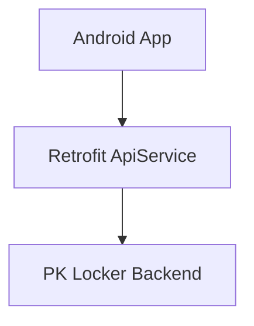
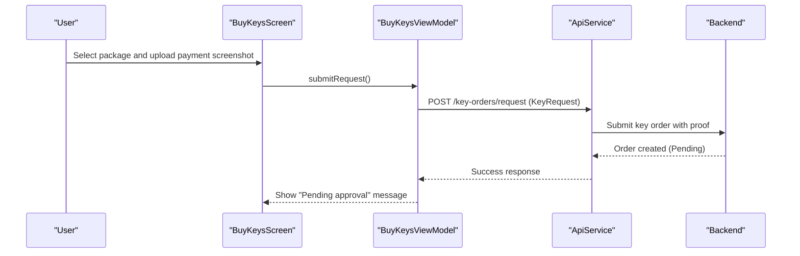
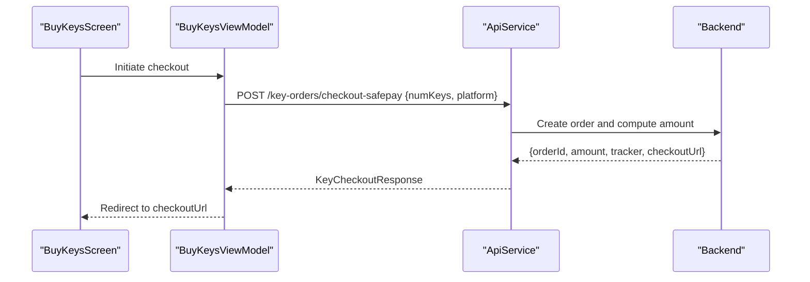
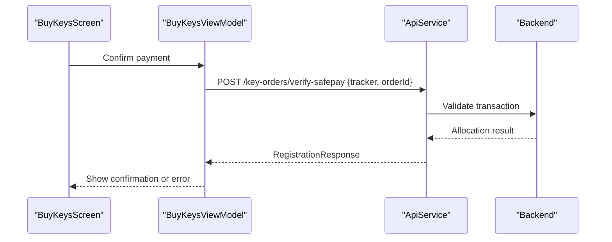
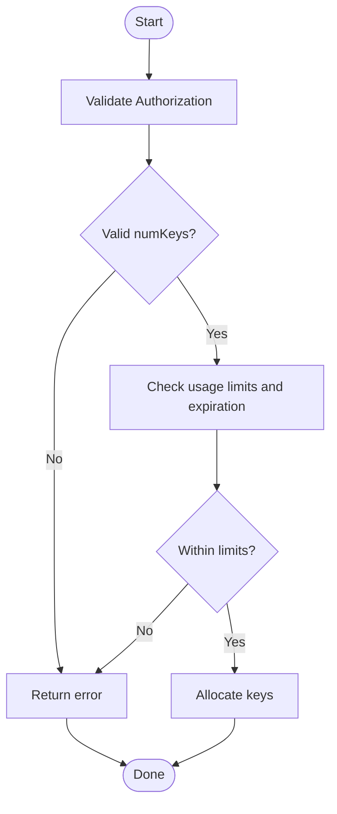
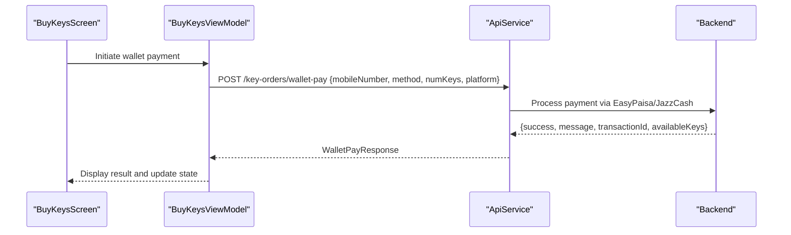
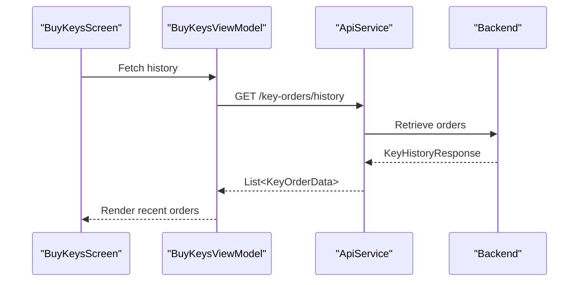
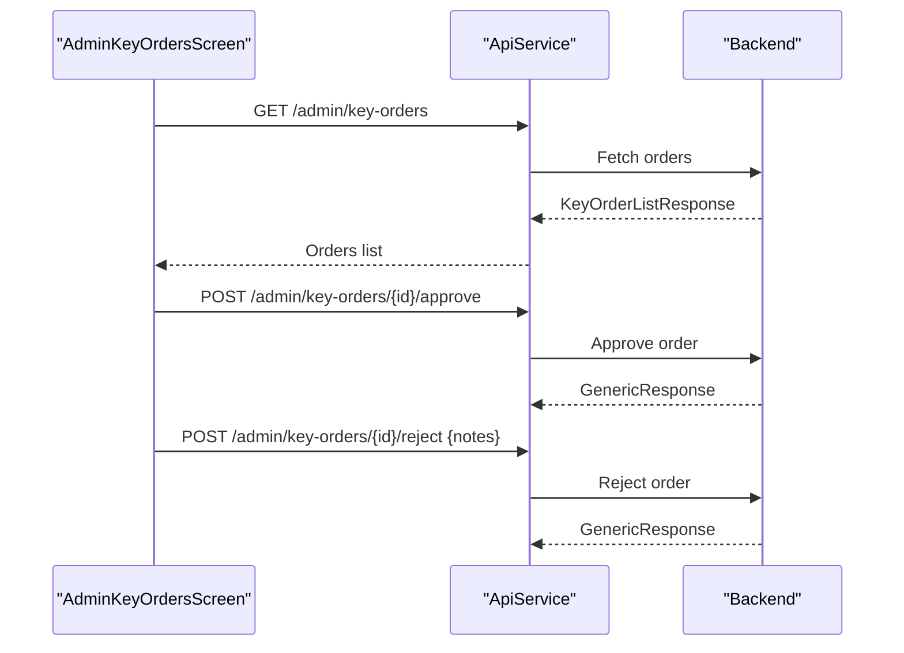
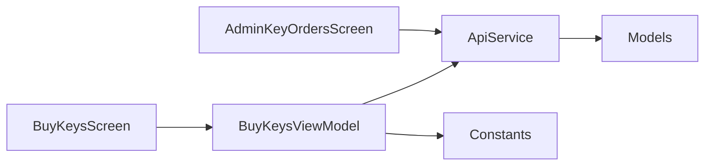

# Key Management Endpoints

<cite>
**Referenced Files in This Document**
- [ApiService.kt](file://app/src/main/java/com/pksafe/lock/manager/data/ApiService.kt)
- [Models.kt](file://app/src/main/java/com/pksafe/lock/manager/data/Models.kt)
- [BuyKeysScreen.kt](file://app/src/main/java/com/pksafe/lock/manager/ui/keys/BuyKeysScreen.kt)
- [BuyKeysViewModel.kt](file://app/src/main/java/com/pksafe/lock/manager/ui/keys/BuyKeysViewModel.kt)
- [AdminKeyOrdersScreen.kt](file://app/src/main/java/com/pksafe/lock/manager/ui/keys/AdminKeyOrdersScreen.kt)
- [Constants.kt](file://app/src/main/java/com/pksafe/lock/manager/util/Constants.kt)
</cite>

## Table of Contents
1. [Introduction](#introduction)
2. [Project Structure](#project-structure)
3. [Core Components](#core-components)
4. [Architecture Overview](#architecture-overview)
5. [Detailed Component Analysis](#detailed-component-analysis)
6. [Dependency Analysis](#dependency-analysis)
7. [Performance Considerations](#performance-considerations)
8. [Troubleshooting Guide](#troubleshooting-guide)
9. [Conclusion](#conclusion)

## Introduction
This document describes PK Locker’s key management endpoints and their usage from the Android client. It covers license key acquisition, payment processing workflows (SafePay checkout and mobile wallets), administrative controls for order approval, and purchase history retrieval. The focus is on how the app calls the backend API to initiate payments, verify transactions, allocate keys, and manage orders.

## Project Structure
The key management features are implemented primarily through:
- A Retrofit-based API interface defining all key-related endpoints and data models
- UI screens and ViewModels that orchestrate user interactions and network calls
- Shared constants for the base URL used by the app

**Diagram sources**
- [ApiService.kt:131-184](file://app/src/main/java/com/pksafe/lock/manager/data/ApiService.kt#L131-L184)
- [Constants.kt:7-7](file://app/src/main/java/com/pksafe/lock/manager/util/Constants.kt#L7-L7)

**Section sources**
- [ApiService.kt:131-184](file://app/src/main/java/com/pksafe/lock/manager/data/ApiService.kt#L131-L184)
- [Constants.kt:7-7](file://app/src/main/java/com/pksafe/lock/manager/util/Constants.kt#L7-L7)

## Core Components
- API Interface: Defines endpoints for SafePay checkout, verification, free test keys, wallet payments, history, and admin operations.
- Data Models: Define request/response structures for key orders, wallet payments, checkout responses, and history.
- UI Screens and ViewModels: Handle user input, image selection, and call API methods to submit requests or fetch history.

Key responsibilities:
- POST /key-orders/checkout-safepay: Initiate SafePay checkout, compute amount, return redirect URL
- POST /key-orders/verify-safepay: Verify payment and allocate keys
- POST /key-orders/free-test-keys: Allocate trial keys with limits and expiration handling
- POST /key-orders/wallet-pay: Process EasyPaisa/JazzCash payments and distribute keys
- GET /key-orders/history: Retrieve purchase history
- Admin endpoints: List orders, approve/reject orders

**Section sources**
- [ApiService.kt:131-184](file://app/src/main/java/com/pksafe/lock/manager/data/ApiService.kt#L131-L184)
- [Models.kt:221-255](file://app/src/main/java/com/pksafe/lock/manager/data/Models.kt#L221-L255)

## Architecture Overview
The key purchase flow integrates UI actions with Retrofit calls to backend endpoints. For manual payments, users upload a screenshot proof; for automated payments, SafePay and wallet integrations handle transaction validation and key allocation.

**Diagram sources**
- [BuyKeysScreen.kt:207-218](file://app/src/main/java/com/pksafe/lock/manager/ui/keys/BuyKeysScreen.kt#L207-L218)
- [BuyKeysViewModel.kt:47-81](file://app/src/main/java/com/pksafe/lock/manager/ui/keys/BuyKeysViewModel.kt#L47-L81)
- [ApiService.kt:167-171](file://app/src/main/java/com/pksafe/lock/manager/data/ApiService.kt#L167-L171)
- [Models.kt:250-255](file://app/src/main/java/com/pksafe/lock/manager/data/Models.kt#L250-L255)

## Detailed Component Analysis

### SafePay Checkout Flow
- Endpoint: POST /key-orders/checkout-safepay
- Purpose: Create an order, calculate total amount based on quantity, and generate a redirect URL for SafePay checkout
- Request: Authorization header and body containing number of keys and platform
- Response: Contains order ID, amount, tracker, and checkout URL

**Diagram sources**
- [ApiService.kt:132-136](file://app/src/main/java/com/pksafe/lock/manager/data/ApiService.kt#L132-L136)
- [ApiService.kt:201-211](file://app/src/main/java/com/pksafe/lock/manager/data/ApiService.kt#L201-L211)

**Section sources**
- [ApiService.kt:132-136](file://app/src/main/java/com/pksafe/lock/manager/data/ApiService.kt#L132-L136)
- [ApiService.kt:201-211](file://app/src/main/java/com/pksafe/lock/manager/data/ApiService.kt#L201-L211)

### SafePay Verification Flow
- Endpoint: POST /key-orders/verify-safepay
- Purpose: Validate transaction using tracker/orderId, allocate keys upon success, and confirm completion
- Request: Authorization header and body containing tracker and orderId
- Response: Generic success/failure indicating whether keys were allocated

**Diagram sources**
- [ApiService.kt:138-142](file://app/src/main/java/com/pksafe/lock/manager/data/ApiService.kt#L138-L142)

**Section sources**
- [ApiService.kt:138-142](file://app/src/main/java/com/pksafe/lock/manager/data/ApiService.kt#L138-L142)

### Free Test Keys Allocation
- Endpoint: POST /key-orders/free-test-keys
- Purpose: Allocate trial keys with usage limits and expiration handling
- Request: Authorization header and body containing number of keys
- Response: Generic success/failure indicating allocation status

**Diagram sources**
- [ApiService.kt:144-148](file://app/src/main/java/com/pksafe/lock/manager/data/ApiService.kt#L144-L148)

**Section sources**
- [ApiService.kt:144-148](file://app/src/main/java/com/pksafe/lock/manager/data/ApiService.kt#L144-L148)

### Mobile Wallet Payments (EasyPaisa and JazzCash)
- Endpoint: POST /key-orders/wallet-pay
- Purpose: Process mobile wallet payments and distribute keys upon successful transaction
- Request: Authorization header and WalletPayRequest including mobileNumber, method ("EasyPaisa" or "JazzCash"), numKeys, and platform
- Response: WalletPayResponse with success flag, message, transactionId, and available keys

**Diagram sources**
- [ApiService.kt:150-154](file://app/src/main/java/com/pksafe/lock/manager/data/ApiService.kt#L150-L154)
- [ApiService.kt:187-199](file://app/src/main/java/com/pksafe/lock/manager/data/ApiService.kt#L187-L199)

**Section sources**
- [ApiService.kt:150-154](file://app/src/main/java/com/pksafe/lock/manager/data/ApiService.kt#L150-L154)
- [ApiService.kt:187-199](file://app/src/main/java/com/pksafe/lock/manager/data/ApiService.kt#L187-L199)

### Purchase History Retrieval
- Endpoint: GET /key-orders/history
- Purpose: Retrieve the authenticated user’s key purchase history
- Request: Authorization header
- Response: KeyHistoryResponse containing a list of past orders with details like number of keys, total amount, status, and creation date

**Diagram sources**
- [ApiService.kt:156-159](file://app/src/main/java/com/pksafe/lock/manager/data/ApiService.kt#L156-L159)
- [ApiService.kt:213-224](file://app/src/main/java/com/pksafe/lock/manager/data/ApiService.kt#L213-L224)

**Section sources**
- [ApiService.kt:156-159](file://app/src/main/java/com/pksafe/lock/manager/data/ApiService.kt#L156-L159)
- [ApiService.kt:213-224](file://app/src/main/java/com/pksafe/lock/manager/data/ApiService.kt#L213-L224)

### Administrative Key Order Management
- Endpoint: GET /admin/key-orders
- Purpose: List key orders for administrative review
- Request: Authorization header
- Response: KeyOrderListResponse containing a list of orders with shopkeeper info, platform, keys, amount, status, and proof image

- Endpoint: POST /admin/key-orders/{id}/approve
- Purpose: Approve a pending order and allocate keys
- Request: Authorization header and path parameter id
- Response: GenericResponse indicating success

- Endpoint: POST /admin/key-orders/{id}/reject
- Purpose: Reject a pending order with optional notes
- Request: Authorization header, path parameter id, and body with notes
- Response: GenericResponse indicating success

**Diagram sources**
- [ApiService.kt:162-184](file://app/src/main/java/com/pksafe/lock/manager/data/ApiService.kt#L162-L184)
- [Models.kt:221-248](file://app/src/main/java/com/pksafe/lock/manager/data/Models.kt#L221-L248)

**Section sources**
- [ApiService.kt:162-184](file://app/src/main/java/com/pksafe/lock/manager/data/ApiService.kt#L162-L184)
- [Models.kt:221-248](file://app/src/main/java/com/pksafe/lock/manager/data/Models.kt#L221-L248)

## Dependency Analysis
The key management components depend on:
- Retrofit ApiService for endpoint definitions and data serialization
- Models for structured request/response payloads
- UI layers (screens and view models) for user interaction and orchestration
- Constants for server base URL configuration

**Diagram sources**
- [BuyKeysScreen.kt:33-36](file://app/src/main/java/com/pksafe/lock/manager/ui/keys/BuyKeysScreen.kt#L33-L36)
- [BuyKeysViewModel.kt:26-31](file://app/src/main/java/com/pksafe/lock/manager/ui/keys/BuyKeysViewModel.kt#L26-L31)
- [ApiService.kt:131-184](file://app/src/main/java/com/pksafe/lock/manager/data/ApiService.kt#L131-L184)
- [Models.kt:221-255](file://app/src/main/java/com/pksafe/lock/manager/data/Models.kt#L221-L255)
- [Constants.kt:7-7](file://app/src/main/java/com/pksafe/lock/manager/util/Constants.kt#L7-L7)

**Section sources**
- [BuyKeysScreen.kt:33-36](file://app/src/main/java/com/pksafe/lock/manager/ui/keys/BuyKeysScreen.kt#L33-L36)
- [BuyKeysViewModel.kt:26-31](file://app/src/main/java/com/pksafe/lock/manager/ui/keys/BuyKeysViewModel.kt#L26-L31)
- [ApiService.kt:131-184](file://app/src/main/java/com/pksafe/lock/manager/data/ApiService.kt#L131-L184)
- [Models.kt:221-255](file://app/src/main/java/com/pksafe/lock/manager/data/Models.kt#L221-L255)
- [Constants.kt:7-7](file://app/src/main/java/com/pksafe/lock/manager/util/Constants.kt#L7-L7)

## Performance Considerations
- Network calls are executed within coroutines to avoid blocking the UI thread
- Image uploads are converted to Base64 in memory; consider size limits to prevent excessive memory usage
- Use pagination or filtering on the backend for large order histories to reduce payload sizes
- Cache frequently accessed data locally when appropriate to minimize redundant network requests

[No sources needed since this section provides general guidance]

## Troubleshooting Guide
Common issues and resolutions:
- Missing authorization token: Ensure the app retrieves and attaches the correct token for each request
- Invalid parameters: Validate numKeys, mobileNumber, and method fields before sending requests
- Payment proof not uploaded: Require screenshot attachment for manual payment flows
- Network errors: Implement retry logic and display user-friendly messages
- Admin approvals: Verify order status transitions and ensure proper notes are provided for rejections

**Section sources**
- [BuyKeysViewModel.kt:47-81](file://app/src/main/java/com/pksafe/lock/manager/ui/keys/BuyKeysViewModel.kt#L47-L81)
- [AdminKeyOrdersScreen.kt:70-100](file://app/src/main/java/com/pksafe/lock/manager/ui/keys/AdminKeyOrdersScreen.kt#L70-L100)

## Conclusion
PK Locker’s key management system provides a comprehensive set of endpoints for acquiring licenses, processing payments through SafePay and mobile wallets, allocating trial keys, and managing orders administratively. The Android client integrates these endpoints through a well-structured API layer and UI components, ensuring smooth user experiences and robust error handling. Proper validation, secure authentication, and clear feedback are essential for reliable operation across all workflows.

[No sources needed since this section summarizes without analyzing specific files]