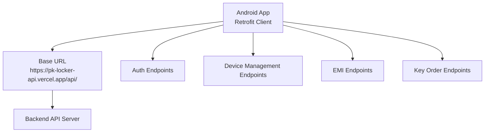
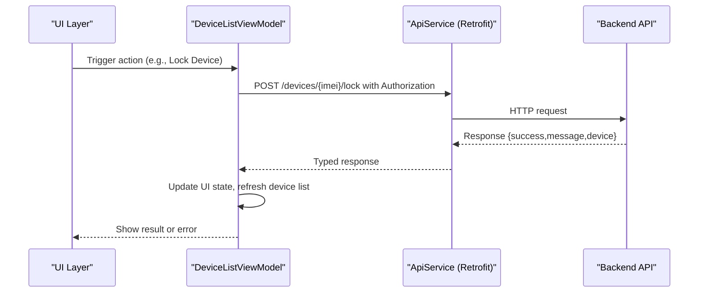
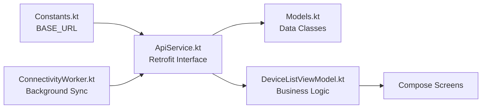

# REST API Endpoints

<cite>
**Referenced Files in This Document**
- [ApiService.kt](file://app/src/main/java/com/pksafe/lock/manager/data/ApiService.kt)
- [Models.kt](file://app/src/main/java/com/pksafe/lock/manager/data/Models.kt)
- [DeviceListViewModel.kt](file://app/src/main/java/com/pksafe/lock/manager/ui/devices/DeviceListViewModel.kt)
- [Constants.kt](file://app/src/main/java/com/pksafe/lock/manager/util/Constants.kt)
- [ConnectivityWorker.kt](file://app/src/main/java/com/pksafe/lock/manager/service/ConnectivityWorker.kt)
- [README.md](file://README.md)
</cite>

## Table of Contents
1. [Introduction](#introduction)
2. [Project Structure](#project-structure)
3. [Core Components](#core-components)
4. [Architecture Overview](#architecture-overview)
5. [Detailed Component Analysis](#detailed-component-analysis)
6. [Dependency Analysis](#dependency-analysis)
7. [Performance Considerations](#performance-considerations)
8. [Troubleshooting Guide](#troubleshooting-guide)
9. [Conclusion](#conclusion)
10. [Appendices](#appendices)

## Introduction
This document provides comprehensive REST API documentation for PK Locker’s backend endpoints as consumed by the Android client. It focuses on device management, authentication, and EMI operations. For each endpoint, it specifies URL patterns, request/response schemas, authentication requirements using Authorization headers, error handling expectations, parameter validation rules, and expected response formats. It also includes usage examples for device registration flows, lock/unlock operations, bulk device management, and EMI schedule modifications. Security considerations such as token-based authentication and input sanitization are addressed, along with rate limiting considerations, versioning strategies, and migration guidance.

## Project Structure
The Android client defines the REST API surface via Retrofit interfaces and data models:
- API endpoints are declared in ApiService.kt under the app module.
- Request and response payloads are modeled in Models.kt.
- The base URL is configured in Constants.kt (production points to a Vercel-hosted API).
- ViewModels orchestrate calls to the API and handle errors and state updates.
- Background services report device status and location to the server.

**Diagram sources**
- [Constants.kt:1-10](file://app/src/main/java/com/pksafe/lock/manager/util/Constants.kt#L1-L10)
- [ApiService.kt:11-185](file://app/src/main/java/com/pksafe/lock/manager/data/ApiService.kt#L11-L185)

**Section sources**
- [Constants.kt:1-10](file://app/src/main/java/com/pksafe/lock/manager/util/Constants.kt#L1-L10)
- [ApiService.kt:11-185](file://app/src/main/java/com/pksafe/lock/manager/data/ApiService.kt#L11-L185)

## Core Components
- Authentication: Login and signup for shopkeepers.
- Device Management: Register devices, list devices, lock/unlock, advanced controls, deregister, update tokens, notify SIM changes and location.
- EMI Management: Fetch EMI schedules, mark installments paid, reschedule plans.
- Key Orders: Checkout, verify payments, allocate free keys, wallet pay, history, admin approvals/rejections.

Authentication is enforced via an Authorization header with a Bearer token for protected endpoints. Responses follow consistent success/error envelopes where applicable.

**Section sources**
- [ApiService.kt:11-185](file://app/src/main/java/com/pksafe/lock/manager/data/ApiService.kt#L11-L185)
- [Models.kt:7-255](file://app/src/main/java/com/pksafe/lock/manager/data/Models.kt#L7-L255)

## Architecture Overview
The Android app uses Retrofit to call backend endpoints defined in ApiService.kt. Requests include JSON bodies and Authorization headers when required. Responses are deserialized into typed data classes from Models.kt. ViewModels manage UI state and error handling. Background workers periodically sync device status and location.

**Diagram sources**
- [DeviceListViewModel.kt:143-171](file://app/src/main/java/com/pksafe/lock/manager/ui/devices/DeviceListViewModel.kt#L143-L171)
- [ApiService.kt:46-56](file://app/src/main/java/com/pksafe/lock/manager/data/ApiService.kt#L46-L56)

## Detailed Component Analysis

### Authentication Endpoints
- POST /auth/login
  - Purpose: Authenticate shopkeeper and obtain access token.
  - Request body: phone, password.
  - Response: success flag, message, optional token and shopkeeper details.
  - Auth: None (public).
  - Errors: Invalid credentials, network errors.

- POST /auth/register
  - Purpose: Create a new shopkeeper account.
  - Request body: name, password, phone, shopName, role (default shopkeeper), optional referredByPhone.
  - Response: success flag, message, optional shopkeeper details.
  - Auth: None (public).
  - Errors: Duplicate phone, validation failures, network errors.

Notes:
- Subsequent requests require Authorization: Bearer <token>.
- Token storage and usage are handled by the app; ensure secure storage and transmission over HTTPS.

**Section sources**
- [ApiService.kt:12-17](file://app/src/main/java/com/pksafe/lock/manager/data/ApiService.kt#L12-L17)
- [Models.kt:16-20](file://app/src/main/java/com/pksafe/lock/manager/data/Models.kt#L16-L20)

### Device Management Endpoints
- POST /devices/register
  - Purpose: Register a new device with customer and EMI details.
  - Auth: Required (Authorization: Bearer token).
  - Request body: imei, imei2 (optional), brand/model/androidVersion, customerName, cnic, phoneNumber, productName, emiTenure, totalPrice, downPayment, balance, emiStartDate (optional), emiAmount (optional), fcmToken (optional), guarantor (optional), profilePicture (optional), cnicProofImage (optional).
  - Response: success, message, device summary including smsCodes for offline SMS locking.
  - Validation: IMEI required; numeric fields validated; images optional.

- GET /devices
  - Purpose: List all registered devices for the authenticated shopkeeper.
  - Auth: Required.
  - Response: success, count, array of device objects with full details (status, controls, location, geofence, etc.).

- GET /devices/deregistered
  - Purpose: List deregistered devices.
  - Auth: Required.
  - Response: same structure as /devices.

- GET /devices/stats
  - Purpose: Retrieve dashboard statistics (keys per platform, device counts).
  - Auth: Required.
  - Response: success, data containing platform keys and device stats.

- GET /devices/dashboard-analytics
  - Purpose: Get analytics overview (monthly collection, overdue trends, best customers, device stats).
  - Auth: Required.
  - Response: success, data with analytics object.

- POST /devices/{imei}/lock
  - Purpose: Lock a device remotely.
  - Auth: Required.
  - Path param: imei.
  - Response: success, message, device summary.

- POST /devices/{imei}/unlock
  - Purpose: Unlock a device remotely.
  - Auth: Required.
  - Path param: imei.
  - Response: success, message, device summary.

- POST /devices/{imei}/controls
  - Purpose: Send advanced control actions (e.g., toggle camera, block installs, auto-lock settings).
  - Auth: Required.
  - Path param: imei.
  - Request body: action string, state value (type varies by action).
  - Response: success, message, device summary.

- POST /devices/update-token
  - Purpose: Update FCM token for push notifications.
  - Auth: Required.
  - Request body: map with key-value pairs (e.g., fcmToken).
  - Response: success, message, device summary.

- POST /devices/update-shopkeeper-token
  - Purpose: Update shopkeeper FCM token.
  - Auth: Required.
  - Request body: map with key-value pairs.
  - Response: success, message, device summary.

- POST /devices/{imei}/sim-changed
  - Purpose: Notify server about SIM change events.
  - Auth: Not required for this endpoint (no Authorization parameter in signature).
  - Path param: imei.
  - Request body: map with key-value pairs.
  - Response: success, message, device summary.

- POST /devices/{imei}/location
  - Purpose: Report device location to server.
  - Auth: Not required for this endpoint (no Authorization parameter in signature).
  - Path param: imei.
  - Request body: map with key-value pairs.
  - Response: success, message, device summary.

- POST /devices/{imei}/unlock-all
  - Purpose: Unlock all controls for a device.
  - Auth: Required.
  - Path param: imei.
  - Response: success, message, device summary.

- POST /devices/{imei}/deregister
  - Purpose: Deregister a device from the system.
  - Auth: Required.
  - Path param: imei.
  - Response: success, message, device summary.

- GET /devices/public/{imei}
  - Purpose: Public endpoint to fetch device info and SMS codes for offline SMS locking when customer activates their device.
  - Auth: Requires Authorization header in signature but labeled public; treat as sensitive and protect accordingly.
  - Path param: imei.
  - Response: success, data with device and EMI summary.

Error Handling:
- Network errors: Handled by ViewModel with user-facing messages.
- Unauthorized: Ensure valid Authorization header; retry after re-authentication.
- Validation errors: Check request payload fields; return appropriate messages.

Examples:
- Device Registration Flow:
  - Call POST /devices/register with full device and customer details.
  - On success, store returned smsCodes locally for offline use.
  - Use GET /devices to confirm registration and view status.

- Lock/Unlock Operations:
  - Call POST /devices/{imei}/lock or unlock with Authorization.
  - On success, refresh device list to reflect updated status.

- Bulk Device Management:
  - Use GET /devices to retrieve all devices and iterate actions (lock/unlock) as needed.
  - Use GET /devices/deregistered to review deregistered devices.

**Section sources**
- [ApiService.kt:19-109](file://app/src/main/java/com/pksafe/lock/manager/data/ApiService.kt#L19-L109)
- [Models.kt:45-219](file://app/src/main/java/com/pksafe/lock/manager/data/Models.kt#L45-L219)
- [DeviceListViewModel.kt:35-64](file://app/src/main/java/com/pksafe/lock/manager/ui/devices/DeviceListViewModel.kt#L35-L64)
- [DeviceListViewModel.kt:143-171](file://app/src/main/java/com/pksafe/lock/manager/ui/devices/DeviceListViewModel.kt#L143-L171)

### EMI Management Endpoints
- GET /emis/device/{imei}
  - Purpose: Retrieve detailed EMI schedule for a device.
  - Auth: Required.
  - Path param: imei.
  - Response: success, data with summary (total, paid, unpaid, amounts) and schedule list (installmentNumber, dueDate, amount, status).

- POST /emis/{emiId}/mark-paid
  - Purpose: Mark an installment as paid.
  - Auth: Required.
  - Path param: emiId.
  - Response: success, message, device summary.

- POST /emis/device/{imei}
  - Purpose: Reschedule EMI plan for a device.
  - Auth: Required.
  - Path param: imei.
  - Request body: emiTenure, emiAmount, totalPrice, downPayment, balance, emiStartDate (optional).
  - Response: success, message, device summary.

Usage Examples:
- Fetch EMI Schedule:
  - Call GET /emis/device/{imei} to display upcoming installments and totals.
- Mark Installment Paid:
  - Call POST /emis/{emiId}/mark-paid; then refresh schedule and device list.
- Reschedule Plan:
  - Call POST /emis/device/{imei} with new terms; validate balances and tenure; refresh schedule and device list.

Validation Rules:
- Numeric fields must be positive and consistent (balance equals total minus down payment and paid amounts).
- Dates should be ISO strings; ensure timezone consistency.

Error Handling:
- Unauthorized: Re-authenticate and retry.
- Validation errors: Return descriptive messages; adjust request payload.

**Section sources**
- [ApiService.kt:112-129](file://app/src/main/java/com/pksafe/lock/manager/data/ApiService.kt#L112-L129)
- [Models.kt:123-173](file://app/src/main/java/com/pksafe/lock/manager/data/Models.kt#L123-L173)
- [DeviceListViewModel.kt:66-141](file://app/src/main/java/com/pksafe/lock/manager/ui/devices/DeviceListViewModel.kt#L66-L141)

### Key Order Endpoints
- POST /key-orders/checkout-safepay
  - Purpose: Initiate checkout via SafePay.
  - Auth: Required.
  - Request body: numKeys, platform.
  - Response: success, data with orderId, amount, tracker, checkoutUrl.

- POST /key-orders/verify-safepay
  - Purpose: Verify payment completion.
  - Auth: Required.
  - Request body: tracker, orderId.
  - Response: success, message, device summary.

- POST /key-orders/free-test-keys
  - Purpose: Allocate free test keys.
  - Auth: Required.
  - Request body: numKeys.
  - Response: success, message, device summary.

- POST /key-orders/wallet-pay
  - Purpose: Wallet payment (EasyPaisa/JazzCash).
  - Auth: Required.
  - Request body: mobileNumber, method, numKeys, platform.
  - Response: success, message, transactionId, availableKeys.

- GET /key-orders/history
  - Purpose: Retrieve order history.
  - Auth: Required.
  - Response: success, data list of orders with id, shopkeeper, platform, numKeys, unitPrice, totalAmount, status, createdAt.

- GET /admin/key-orders

  - Purpose: Admin view of key orders.
  - Auth: Required.
  - Response: success, data list of orders.

- POST /key-orders/request
  - Purpose: Submit key request with payment proof.
  - Auth: Required.
  - Request body: numKeys, paymentProofImage, platform.
  - Response: success, data list of orders.

- POST /admin/key-orders/{id}/approve
  - Purpose: Approve a key order.
  - Auth: Required.
  - Path param: id.
  - Response: success, message.

- POST /admin/key-orders/{id}/reject
  - Purpose: Reject a key order with notes.
  - Auth: Required.
  - Path param: id.
  - Request body: notes.
  - Response: success, message.

Security Considerations:
- Validate payment proofs and signatures server-side.
- Enforce rate limits on payment-related endpoints.
- Sanitize inputs to prevent injection attacks.

**Section sources**
- [ApiService.kt:131-185](file://app/src/main/java/com/pksafe/lock/manager/data/ApiService.kt#L131-L185)
- [Models.kt:187-255](file://app/src/main/java/com/pksafe/lock/manager/data/Models.kt#L187-L255)

## Dependency Analysis
The client depends on Retrofit and Gson for HTTP communication and serialization. The base URL is centralized in Constants.kt, ensuring consistent routing across features. ViewModels encapsulate business logic and error handling, while background workers report device status and location.

**Diagram sources**
- [Constants.kt:1-10](file://app/src/main/java/com/pksafe/lock/manager/util/Constants.kt#L1-L10)
- [ApiService.kt:11-185](file://app/src/main/java/com/pksafe/lock/manager/data/ApiService.kt#L11-L185)
- [Models.kt:7-255](file://app/src/main/java/com/pksafe/lock/manager/data/Models.kt#L7-L255)
- [DeviceListViewModel.kt:35-187](file://app/src/main/java/com/pksafe/lock/manager/ui/devices/DeviceListViewModel.kt#L35-L187)
- [ConnectivityWorker.kt:15-60](file://app/src/main/java/com/pksafe/lock/manager/service/ConnectivityWorker.kt#L15-L60)

**Section sources**
- [Constants.kt:1-10](file://app/src/main/java/com/pksafe/lock/manager/util/Constants.kt#L1-L10)
- [ApiService.kt:11-185](file://app/src/main/java/com/pksafe/lock/manager/data/ApiService.kt#L11-L185)
- [Models.kt:7-255](file://app/src/main/java/com/pksafe/lock/manager/data/Models.kt#L7-L255)
- [DeviceListViewModel.kt:35-187](file://app/src/main/java/com/pksafe/lock/manager/ui/devices/DeviceListViewModel.kt#L35-L187)
- [ConnectivityWorker.kt:15-60](file://app/src/main/java/com/pksafe/lock/manager/service/ConnectivityWorker.kt#L15-L60)

## Performance Considerations
- Batch operations: Prefer listing devices once and performing multiple actions to reduce round trips.
- Caching: Cache device lists and EMI schedules locally to minimize network calls.
- Error retries: Implement exponential backoff for transient network errors.
- Image uploads: Compress images before sending to reduce payload size.
- Background sync: Use WorkManager to limit frequency of status/location reports.

[No sources needed since this section provides general guidance]

## Troubleshooting Guide
Common issues and resolutions:
- Authentication failures:
  - Ensure Authorization header contains a valid Bearer token.
  - Re-login if token expires; refresh token storage.

- Device not locking/unlocking:
  - Verify IMEI matches exactly.
  - Check overlay permission and internet connectivity for FCM delivery.

- EMI schedule not updating:
  - Confirm successful mark-paid calls and refresh schedule.
  - Validate numeric fields and date formats.

- Offline behavior:
  - App locks locally if offline beyond threshold; ensure periodic online checks to sync status.

- Network errors:
  - Handle exceptions in ViewModels; show user-friendly messages.
  - Retry failed requests with backoff.

**Section sources**
- [DeviceListViewModel.kt:35-64](file://app/src/main/java/com/pksafe/lock/manager/ui/devices/DeviceListViewModel.kt#L35-L64)
- [DeviceListViewModel.kt:143-171](file://app/src/main/java/com/pksafe/lock/manager/ui/devices/DeviceListViewModel.kt#L143-L171)
- [README.md:93-133](file://README.md#L93-L133)

## Conclusion
PK Locker’s REST API provides robust endpoints for authentication, device lifecycle management, and EMI operations. The Android client enforces token-based authentication, structured request/response schemas, and comprehensive error handling. By following the documented patterns and security practices, developers can implement reliable integrations for device control and payment tracking.

[No sources needed since this section summarizes without analyzing specific files]

## Appendices

### Rate Limiting Considerations
- Implement per-user and per-IP rate limits on authentication and payment endpoints.
- Use token bucket or sliding window algorithms to throttle excessive requests.
- Return standard 429 responses with retry-after headers when limits are exceeded.

[No sources needed since this section provides general guidance]

### Versioning Strategies
- Use URL path versioning (e.g., /api/v1/) to maintain backward compatibility.
- Deprecate old versions gradually with clear migration notices.
- Support multiple versions concurrently during transition periods.

[No sources needed since this section provides general guidance]

### Migration Guides for API Updates
- Announce deprecation timelines and provide upgrade instructions.
- Offer dual support for old and new endpoints during migration windows.
- Update client code to handle both versions until migration completes.

[No sources needed since this section provides general guidance]

### Security Considerations
- Token-based authentication:
  - Store tokens securely; transmit only over HTTPS.
  - Refresh tokens on expiration; invalidate on logout.

- Input sanitization:
  - Validate and sanitize all inputs server-side to prevent injection attacks.
  - Enforce strict types and ranges for numeric fields.

- Data protection:
  - Encrypt sensitive data at rest and in transit.
  - Limit exposure of personal information in responses.

[No sources needed since this section provides general guidance]