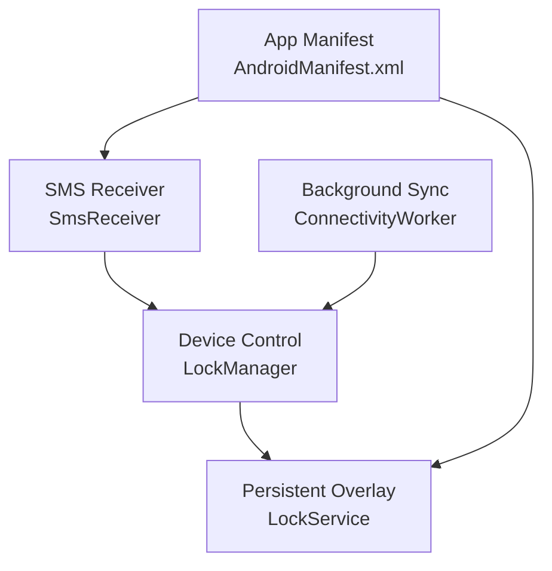
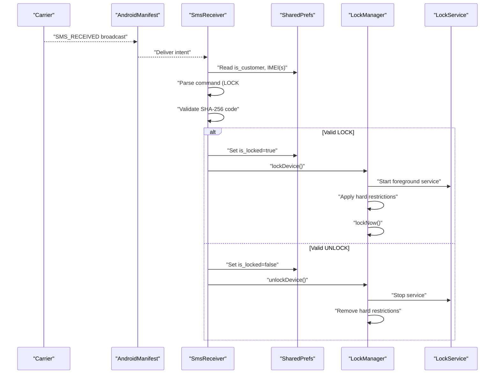
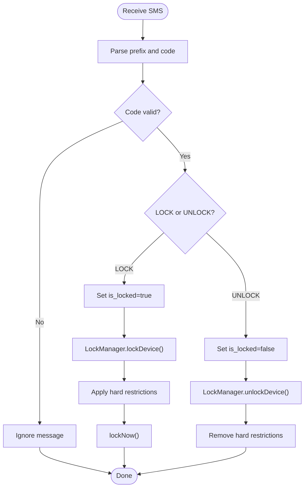
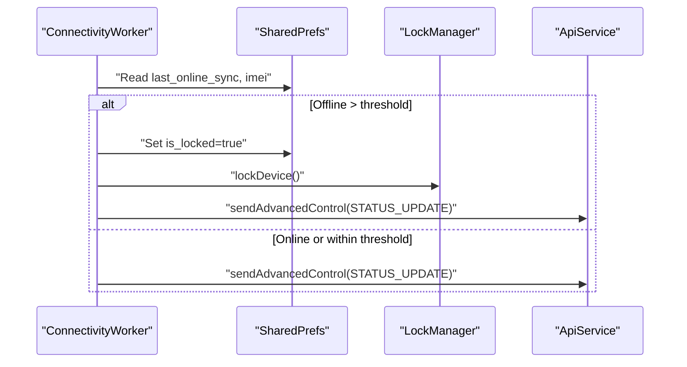
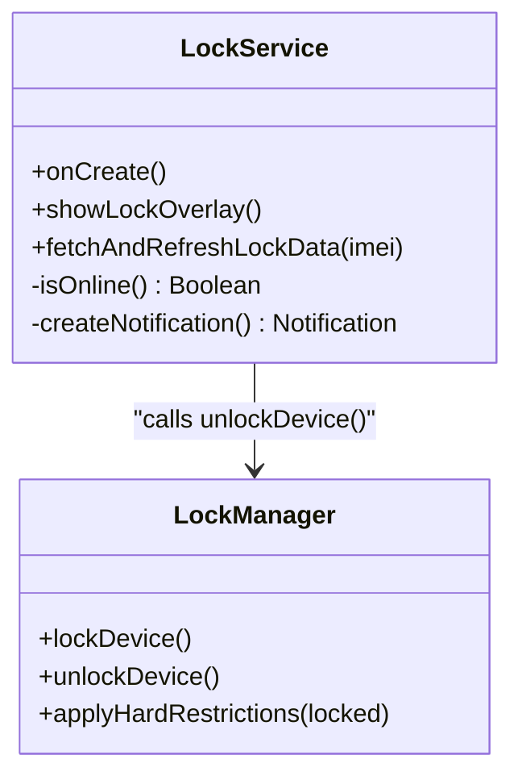
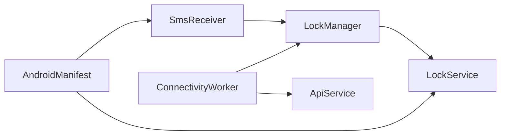

# SMS Command Processing

<cite>
**Referenced Files in This Document**
- [SmsReceiver.kt](file://app/src/main/java/com/pksafe/lock/manager/receiver/SmsReceiver.kt)
- [LockManager.kt](file://app/src/main/java/com/pksafe/lock/manager/util/LockManager.kt)
- [LockService.kt](file://app/src/main/java/com/pksafe/lock/manager/service/LockService.kt)
- [AndroidManifest.xml](file://app/src/main/AndroidManifest.xml)
- [ConnectivityWorker.kt](file://app/src/main/java/com/pksafe/lock/manager/service/ConnectivityWorker.kt)
- [Constants.kt](file://app/src/main/java/com/pksafe/lock/manager/util/Constants.kt)
</cite>

## Table of Contents
1. Introduction
2. Project Structure
3. Core Components
4. Architecture Overview
5. Detailed Component Analysis
6. Dependency Analysis
7. Performance Considerations
8. Troubleshooting Guide
9. Conclusion

## Introduction
This document explains the offline device control capabilities driven by SMS commands. It covers the message format, command syntax for lock/unlock operations, SHA-256 code validation, dual IMEI fallback support, parsing logic, and how the system integrates with LockManager to enforce device restrictions. It also addresses security considerations, error handling, and troubleshooting for carrier-specific behaviors and delivery issues.

## Project Structure
The SMS-based offline control flow is implemented across a small set of components:
- SmsReceiver receives and parses incoming SMS messages, validates codes, and triggers device control via LockManager.
- LockManager applies Device Policy Manager restrictions and starts/stops the persistent LockService overlay.
- LockService renders a persistent lock overlay and enforces runtime behavior while locked.
- ConnectivityWorker periodically checks connectivity and can auto-lock if the device has been offline too long.
- AndroidManifest registers the SMS receiver and services with appropriate permissions and priorities.

**Diagram sources**
- [SmsReceiver.kt:44-143](file://app/src/main/java/com/pksafe/lock/manager/receiver/SmsReceiver.kt#L44-L143)
- [LockManager.kt:111-148](file://app/src/main/java/com/pksafe/lock/manager/util/LockManager.kt#L111-L148)
- [LockService.kt:50-80](file://app/src/main/java/com/pksafe/lock/manager/service/LockService.kt#L50-L80)
- [ConnectivityWorker.kt:17-47](file://app/src/main/java/com/pksafe/lock/manager/service/ConnectivityWorker.kt#L17-L47)
- [AndroidManifest.xml:114-140](file://app/src/main/AndroidManifest.xml#L114-L140)

**Section sources**
- [AndroidManifest.xml:5-23](file://app/src/main/AndroidManifest.xml#L5-L23)
- [AndroidManifest.xml:114-140](file://app/src/main/AndroidManifest.xml#L114-L140)

## Core Components
- SmsReceiver: Parses SMS, validates commands using SHA-256 codes derived from IMEI(s), and calls LockManager to lock or unlock.
- LockManager: Applies hardware and policy restrictions (camera, USB, factory reset, safe boot, debugging, status bar, keyguard) and manages the LockService lifecycle.
- LockService: Foreground service that displays a persistent lock overlay, blocks navigation keys, and supports emergency unlock via dynamic master code.
- ConnectivityWorker: Periodically checks online status; if offline beyond a threshold, it locks locally and attempts to report status to the server when possible.
- Constants: Centralizes API base URL used by background tasks and services.

Key responsibilities and interactions are detailed in the following sections.

**Section sources**
- [SmsReceiver.kt:44-143](file://app/src/main/java/com/pksafe/lock/manager/receiver/SmsReceiver.kt#L44-L143)
- [LockManager.kt:111-192](file://app/src/main/java/com/pksafe/lock/manager/util/LockManager.kt#L111-L192)
- [LockService.kt:50-80](file://app/src/main/java/com/pksafe/lock/manager/service/LockService.kt#L50-L80)
- [ConnectivityWorker.kt:17-47](file://app/src/main/java/com/pksafe/lock/manager/service/ConnectivityWorker.kt#L17-L47)
- [Constants.kt:3-10](file://app/src/main/java/com/pksafe/lock/manager/util/Constants.kt#L3-L10)

## Architecture Overview
The offline SMS control architecture ensures secure, deterministic command execution without requiring internet at the time of processing.

**Diagram sources**
- [AndroidManifest.xml:114-140](file://app/src/main/AndroidManifest.xml#L114-L140)
- [SmsReceiver.kt:44-143](file://app/src/main/java/com/pksafe/lock/manager/receiver/SmsReceiver.kt#L44-L143)
- [LockManager.kt:111-148](file://app/src/main/java/com/pksafe/lock/manager/util/LockManager.kt#L111-L148)
- [LockService.kt:50-80](file://app/src/main/java/com/pksafe/lock/manager/service/LockService.kt#L50-L80)

## Detailed Component Analysis

### SMS Message Format and Parsing
- Supported commands:
  - LOCK#<code>: Locks the device if <code> matches a valid lock code.
  - UNLOCK#<code>: Unlocks the device if <code> matches a valid unlock code.
- Code validation:
  - Codes are SHA-256 hashes computed over "LOCK_{imei}" and "UNLOCK_{imei}".
  - The receiver builds a set of acceptable codes from:
    - Stored codes in preferences (if provided by backend).
    - Generated codes from both IMEIs (device_imei and device_imei2) as fallback.
- Parsing details:
  - Extracts PDUs from the intent extras and constructs SmsMessage objects.
  - Normalizes body to uppercase before matching prefixes.
  - Trims and lowercases the received code for comparison.

Security note: The same algorithm must be used on the sender side to generate codes deterministically.

**Section sources**
- [SmsReceiver.kt:31-42](file://app/src/main/java/com/pksafe/lock/manager/receiver/SmsReceiver.kt#L31-L42)
- [SmsReceiver.kt:56-93](file://app/src/main/java/com/pksafe/lock/manager/receiver/SmsReceiver.kt#L56-L93)
- [SmsReceiver.kt:94-141](file://app/src/main/java/com/pksafe/lock/manager/receiver/SmsReceiver.kt#L94-L141)
- [SmsReceiver.kt:145-162](file://app/src/main/java/com/pksafe/lock/manager/receiver/SmsReceiver.kt#L145-L162)

### Dual IMEI Fallback Support
- The receiver reads two IMEI fields:
  - device_imei (primary)
  - device_imei2 (secondary)
- For each present IMEI, it generates corresponding lock/unlock codes and adds them to the valid sets. This ensures robustness if one IMEI changes or is unavailable.

**Section sources**
- [SmsReceiver.kt:64-89](file://app/src/main/java/com/pksafe/lock/manager/receiver/SmsReceiver.kt#L64-L89)

### Command Execution Flow (Lock/Unlock)
- On valid LOCK:
  - Sets is_locked flag.
  - Calls LockManager.lockDevice(), which:
    - Starts LockService as a foreground service.
    - Applies hard restrictions (camera, USB file transfer, factory reset, safe boot, debugging, status bar, keyguard).
    - Schedules lockNow() after a short delay.
- On valid UNLOCK:
  - Clears is_locked flag.
  - Calls LockManager.unlockDevice(), which:
    - Stops LockService.
    - Removes all applied hard restrictions.

**Diagram sources**
- [SmsReceiver.kt:94-141](file://app/src/main/java/com/pksafe/lock/manager/receiver/SmsReceiver.kt#L94-L141)
- [LockManager.kt:111-192](file://app/src/main/java/com/pksafe/lock/manager/util/LockManager.kt#L111-L192)

**Section sources**
- [SmsReceiver.kt:94-141](file://app/src/main/java/com/pksafe/lock/manager/receiver/SmsReceiver.kt#L94-L141)
- [LockManager.kt:111-192](file://app/src/main/java/com/pksafe/lock/manager/util/LockManager.kt#L111-L192)

### Offline Guard and Auto-Lock
- ConnectivityWorker runs periodically:
  - If the device has been offline longer than a configured threshold, it:
    - Sets is_locked=true locally.
    - Calls LockManager.lockDevice().
    - Attempts to report status to the server if network is available.
  - Otherwise, it sends a heartbeat indicating the device is active.

**Diagram sources**
- [ConnectivityWorker.kt:17-47](file://app/src/main/java/com/pksafe/lock/manager/service/ConnectivityWorker.kt#L17-L47)
- [ConnectivityWorker.kt:49-70](file://app/src/main/java/com/pksafe/lock/manager/service/ConnectivityWorker.kt#L49-L70)
- [LockManager.kt:111-148](file://app/src/main/java/com/pksafe/lock/manager/util/LockManager.kt#L111-L148)

**Section sources**
- [ConnectivityWorker.kt:17-70](file://app/src/main/java/com/pksafe/lock/manager/service/ConnectivityWorker.kt#L17-L70)

### Lock Service Overlay and Emergency Unlock
- LockService runs as a foreground service with a persistent overlay:
  - Blocks back/home/recents/menu keys.
  - Displays shop info and EMI details (refreshed from server when online).
  - Supports an emergency unlock using a dynamic master code derived from the stored IMEI (last 6 digits), falling back to a default if IMEI is invalid.
  - On successful unlock, clears is_locked and calls LockManager.unlockDevice().

**Diagram sources**
- [LockService.kt:50-80](file://app/src/main/java/com/pksafe/lock/manager/service/LockService.kt#L50-L80)
- [LockService.kt:125-234](file://app/src/main/java/com/pksafe/lock/manager/service/LockService.kt#L125-L234)
- [LockService.kt:240-314](file://app/src/main/java/com/pksafe/lock/manager/service/LockService.kt#L240-L314)
- [LockManager.kt:111-148](file://app/src/main/java/com/pksafe/lock/manager/util/LockManager.kt#L111-L148)

**Section sources**
- [LockService.kt:50-80](file://app/src/main/java/com/pksafe/lock/manager/service/LockService.kt#L50-L80)
- [LockService.kt:125-234](file://app/src/main/java/com/pksafe/lock/manager/service/LockService.kt#L125-L234)
- [LockService.kt:240-314](file://app/src/main/java/com/pksafe/lock/manager/service/LockService.kt#L240-L314)

### Security Considerations
- Command authentication:
  - Commands require a SHA-256 code derived from the device’s IMEI(s). The same algorithm must be used by the sender to ensure deterministic verification.
  - The receiver accepts codes from preferences (if provided) and generated codes from both IMEIs, increasing resilience.
- Message encryption:
  - SMS is inherently unencrypted; this implementation relies on code-based authentication rather than payload encryption.
- Protection against unauthorized access:
  - Only customer devices process commands (checked via is_customer flag).
  - Hard restrictions prevent common bypass methods (factory reset, safe mode, USB file transfer, debugging features).
  - LockService overlay prevents navigation and hides the app from normal interaction while locked.

**Section sources**
- [SmsReceiver.kt:44-93](file://app/src/main/java/com/pksafe/lock/manager/receiver/SmsReceiver.kt#L44-L93)
- [LockManager.kt:151-192](file://app/src/main/java/com/pksafe/lock/manager/util/LockManager.kt#L151-L192)
- [LockService.kt:125-168](file://app/src/main/java/com/pksafe/lock/manager/service/LockService.kt#L125-L168)

## Dependency Analysis
- SmsReceiver depends on:
  - Shared preferences for flags and IMEI(s).
  - LockManager to execute device control.
  - Android telephony APIs to parse SMS PDUs.
- LockManager depends on:
  - DevicePolicyManager and UserManager for restrictions.
  - LockService for persistent overlay enforcement.
- ConnectivityWorker depends on:
  - Shared preferences for sync timestamps and device identity.
  - ApiService to report status when online.
- AndroidManifest configures:
  - Permissions for SMS and foreground services.
  - High-priority receiver for SMS_RECEIVED.

**Diagram sources**
- [SmsReceiver.kt:44-143](file://app/src/main/java/com/pksafe/lock/manager/receiver/SmsReceiver.kt#L44-L143)
- [LockManager.kt:111-192](file://app/src/main/java/com/pksafe/lock/manager/util/LockManager.kt#L111-L192)
- [LockService.kt:50-80](file://app/src/main/java/com/pksafe/lock/manager/service/LockService.kt#L50-L80)
- [ConnectivityWorker.kt:17-70](file://app/src/main/java/com/pksafe/lock/manager/service/ConnectivityWorker.kt#L17-L70)
- [AndroidManifest.xml:5-23](file://app/src/main/AndroidManifest.xml#L5-L23)
- [AndroidManifest.xml:114-140](file://app/src/main/AndroidManifest.xml#L114-L140)

**Section sources**
- [AndroidManifest.xml:5-23](file://app/src/main/AndroidManifest.xml#L5-L23)
- [AndroidManifest.xml:114-140](file://app/src/main/AndroidManifest.xml#L114-L140)

## Performance Considerations
- SMS parsing uses efficient iteration over PDUs and avoids heavy work on the main thread.
- LockManager applies restrictions synchronously but schedules lockNow() with a small delay to ensure overlays are ready.
- ConnectivityWorker performs network calls only when necessary and updates local state efficiently.
- LockService refreshes overlay data asynchronously and posts UI updates on the main thread.

[No sources needed since this section provides general guidance]

## Troubleshooting Guide
Common issues and resolutions:
- SMS not processed:
  - Ensure RECEIVE_SMS and READ_SMS permissions are granted and the receiver is registered with high priority.
  - Verify the device is marked as a customer (is_customer=true) during provisioning.
- Invalid code errors:
  - Confirm the sender uses the exact same algorithm to compute SHA-256 codes from "LOCK_{imei}" and "UNLOCK_{imei}".
  - Check that both IMEIs are correctly stored (device_imei and device_imei2) to enable fallback.
- Lock overlay not appearing:
  - Ensure FOREGROUND_SERVICE and POST_NOTIFICATIONS permissions are granted.
  - Verify LockService starts as foreground and creates a notification channel.
- Cannot unlock:
  - Use the emergency unlock code (last 6 digits of stored IMEI) in the overlay input field.
  - If IMEI is missing or invalid, the fallback default code may apply.
- Carrier-specific behaviors:
  - Some carriers compress or alter SMS content; ensure the message contains exactly "LOCK#<code>" or "UNLOCK#<code>" without extra spaces or line breaks.
  - Test with multiple carriers to confirm consistent parsing.
- Debugging tips:
  - Logcat tags: PKL_SMS (receiver), LOCK_MANAGER (policy actions), OFFLINE_GUARD (connectivity worker), LOCK_REFRESH (overlay data).
  - Inspect SharedPrefs values: is_customer, device_imei, device_imei2, sms_lock_code, sms_unlock_code, is_locked.

**Section sources**
- [AndroidManifest.xml:18-20](file://app/src/main/AndroidManifest.xml#L18-L20)
- [AndroidManifest.xml:114-140](file://app/src/main/AndroidManifest.xml#L114-L140)
- [SmsReceiver.kt:44-93](file://app/src/main/java/com/pksafe/lock/manager/receiver/SmsReceiver.kt#L44-L93)
- [LockService.kt:107-123](file://app/src/main/java/com/pksafe/lock/manager/service/LockService.kt#L107-L123)
- [LockService.kt:200-218](file://app/src/main/java/com/pksafe/lock/manager/service/LockService.kt#L200-L218)
- [ConnectivityWorker.kt:17-47](file://app/src/main/java/com/pksafe/lock/manager/service/ConnectivityWorker.kt#L17-L47)

## Conclusion
The SMS command processing system enables secure, offline device control through deterministic SHA-256 code validation and robust fallback mechanisms for dual IMEI support. By integrating tightly with Android’s Device Policy Manager and a persistent overlay service, it enforces strong restrictions and resists common bypass techniques. ConnectivityWorker adds resilience by auto-locking devices that remain offline beyond a threshold and reporting status when possible. Proper configuration, permission grants, and adherence to the command format ensure reliable operation across diverse environments.

[No sources needed since this section summarizes without analyzing specific files]