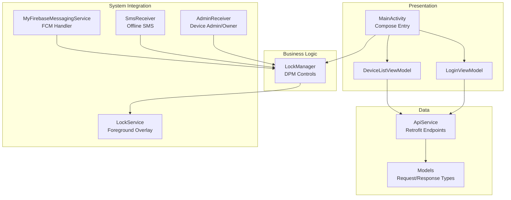
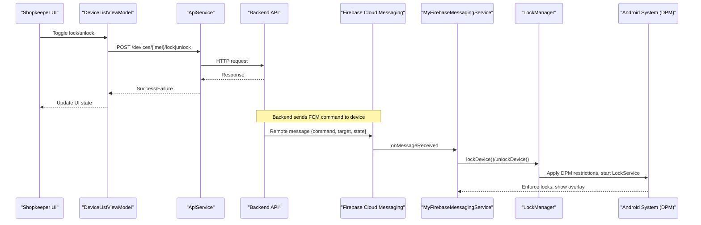
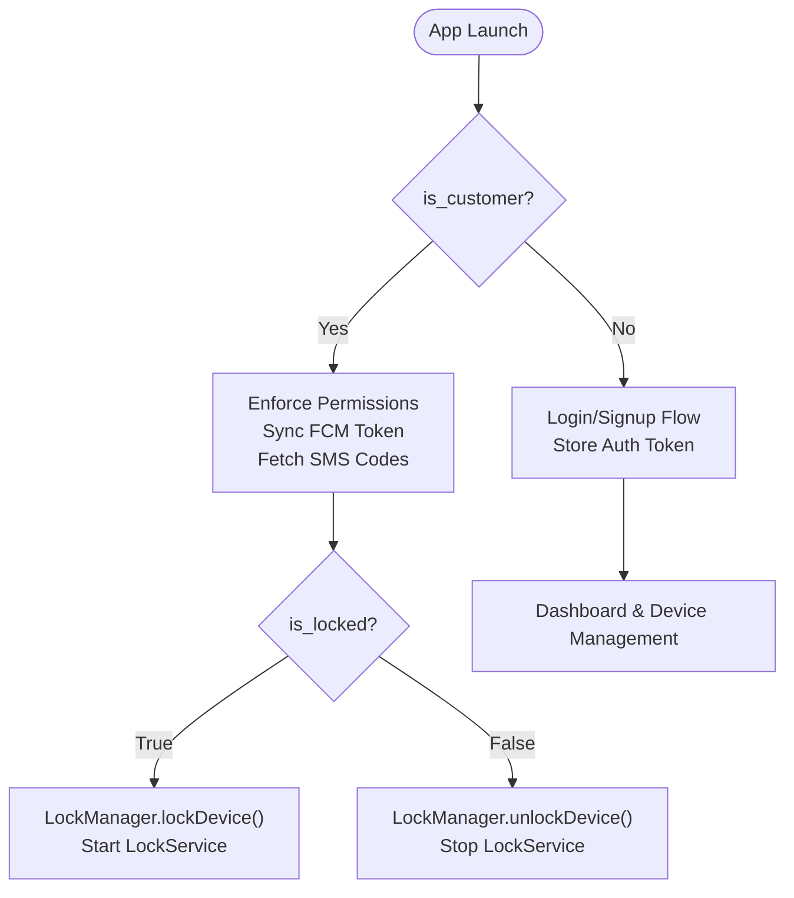
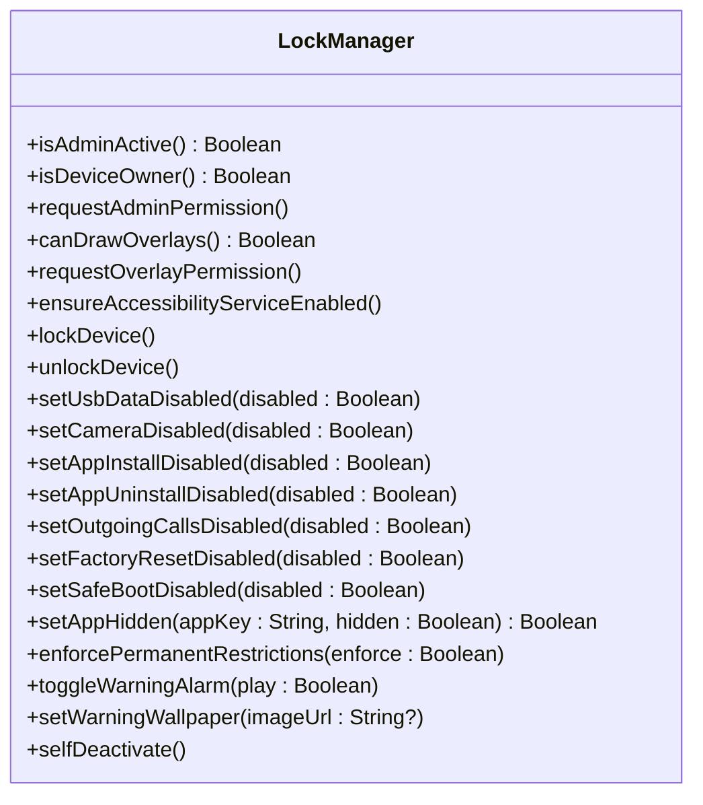
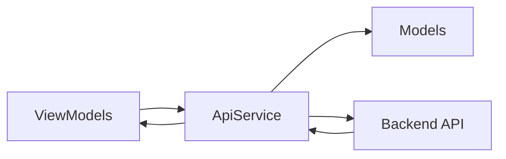
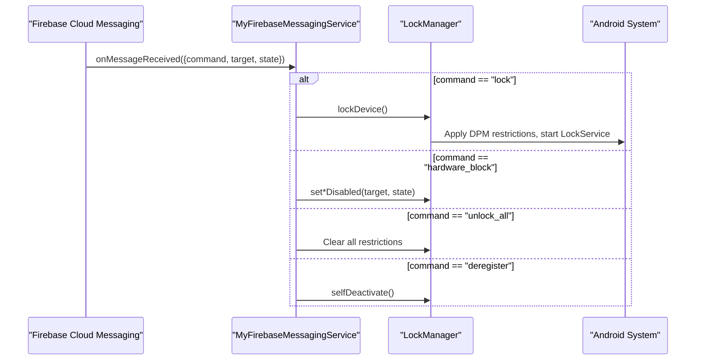
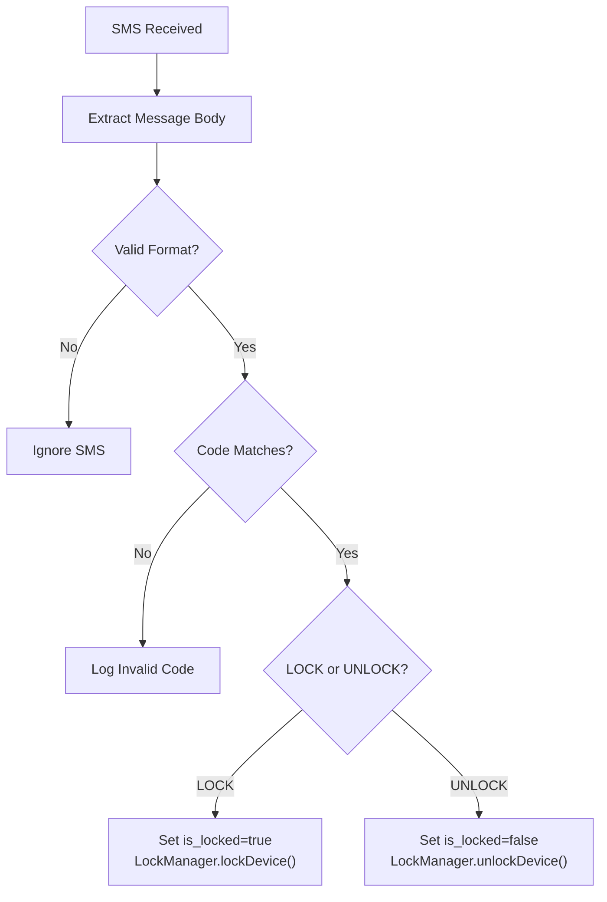
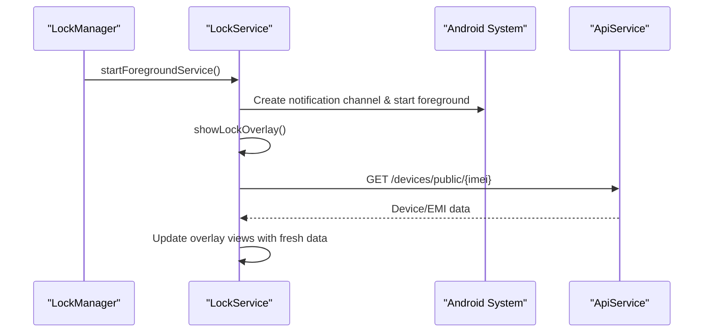
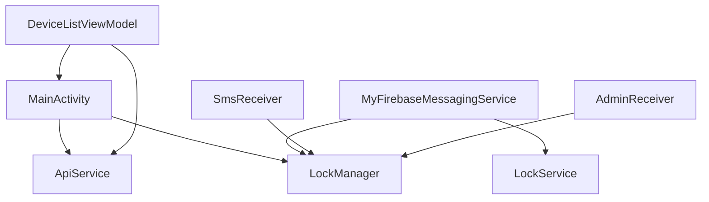
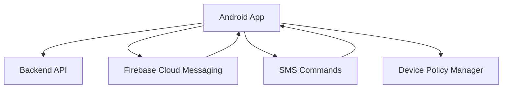

# Architecture Overview

<cite>
**Referenced Files in This Document**
- [MainActivity.kt](file://app/src/main/java/com/pksafe/lock/manager/MainActivity.kt)
- [LockManager.kt](file://app/src/main/java/com/pksafe/lock/manager/util/LockManager.kt)
- [ApiService.kt](file://app/src/main/java/com/pksafe/lock/manager/data/ApiService.kt)
- [MyFirebaseMessagingService.kt](file://app/src/main/java/com/pksafe/lock/manager/service/MyFirebaseMessagingService.kt)
- [SmsReceiver.kt](file://app/src/main/java/com/pksafe/lock/manager/receiver/SmsReceiver.kt)
- [LockService.kt](file://app/src/main/java/com/pksafe/lock/manager/service/LockService.kt)
- [AdminReceiver.kt](file://app/src/main/java/com/pksafe/lock/manager/receiver/AdminReceiver.kt)
- [DeviceListViewModel.kt](file://app/src/main/java/com/pksafe/lock/manager/ui/devices/DeviceListViewModel.kt)
- [LoginViewModel.kt](file://app/src/main/java/com/pksafe/lock/manager/ui/login/LoginViewModel.kt)
- [Models.kt](file://app/src/main/java/com/pksafe/lock/manager/data/Models.kt)
</cite>

## Table of Contents
1. Introduction
2. Project Structure
3. Core Components
4. Architecture Overview
5. Detailed Component Analysis
6. Dependency Analysis
7. Performance Considerations
8. Troubleshooting Guide
9. Conclusion
10. Appendices

## Introduction
This document describes the architecture of PK Locker with a focus on the MVVM pattern, component interactions, and system-level Android integration. It explains how the presentation layer (Jetpack Compose UI), business logic layer (LockManager and ViewModels), and data layer (Retrofit API client) collaborate to provide secure device management for both customer and shopkeeper/admin modes. It also covers technical decisions such as Device Owner mode for security, offline capability via SMS commands, and persistent operation using foreground services. Finally, it outlines infrastructure requirements, scalability considerations for large fleets, and deployment topology supporting online and offline scenarios.

## Project Structure
The application is organized into clear layers:
- Presentation: Jetpack Compose screens and navigation entry points in MainActivity and feature-specific screens.
- Business Logic: LockManager orchestrates device control; ViewModels manage state and coordinate network calls.
- Data: ApiService defines Retrofit endpoints; Models define request/response schemas.
- System Integration: Services and Receivers handle FCM messages, lock overlays, device policy enforcement, and offline SMS handling.

**Diagram sources**
- [MainActivity.kt:65-445](file://app/src/main/java/com/pksafe/lock/manager/MainActivity.kt#L65-L445)
- [DeviceListViewModel.kt:18-246](file://app/src/main/java/com/pksafe/lock/manager/ui/devices/DeviceListViewModel.kt#L18-L246)
- [LoginViewModel.kt:15-88](file://app/src/main/java/com/pksafe/lock/manager/ui/login/LoginViewModel.kt#L15-L88)
- [LockManager.kt:27-406](file://app/src/main/java/com/pksafe/lock/manager/util/LockManager.kt#L27-L406)
- [ApiService.kt:11-185](file://app/src/main/java/com/pksafe/lock/manager/data/ApiService.kt#L11-L185)
- [Models.kt:7-255](file://app/src/main/java/com/pksafe/lock/manager/data/Models.kt#L7-L255)
- [MyFirebaseMessagingService.kt:20-309](file://app/src/main/java/com/pksafe/lock/manager/service/MyFirebaseMessagingService.kt#L20-L309)
- [LockService.kt:41-330](file://app/src/main/java/com/pksafe/lock/manager/service/LockService.kt#L41-L330)
- [SmsReceiver.kt:29-164](file://app/src/main/java/com/pksafe/lock/manager/receiver/SmsReceiver.kt#L29-L164)
- [AdminReceiver.kt:14-104](file://app/src/main/java/com/pksafe/lock/manager/receiver/AdminReceiver.kt#L14-L104)

**Section sources**
- [MainActivity.kt:65-445](file://app/src/main/java/com/pksafe/lock/manager/MainActivity.kt#L65-L445)
- [ApiService.kt:11-185](file://app/src/main/java/com/pksafe/lock/manager/data/ApiService.kt#L11-L185)
- [Models.kt:7-255](file://app/src/main/java/com/pksafe/lock/manager/data/Models.kt#L7-L255)

## Core Components
- MainActivity coordinates user roles (admin vs customer), enforces permissions, triggers background syncs, and renders Compose UI based on state. It integrates Firebase token sync and offline code fetching for customers.
- LockManager encapsulates all Device Policy Manager operations: locking/unlocking, hardware restrictions, app hiding, and self-deactivation. It ensures permanent restrictions for customer devices when required.
- ApiService provides a typed Retrofit interface for backend communication covering authentication, device lifecycle, controls, EMI scheduling, key orders, and tokens.
- MyFirebaseMessagingService processes remote commands from Firebase Cloud Messaging to lock/unlock devices, toggle controls, update wallpapers, and deregister devices.
- SmsReceiver enables offline lock/unlock by validating deterministic SMS codes derived from IMEI or fetched from server preferences.
- LockService runs as a foreground service to display an overlay lock screen, enforce anti-bypass behaviors, and refresh EMI data from the server.
- AdminReceiver handles device admin/owner provisioning, grants critical permissions, and auto-fills IMEI information.
- ViewModels (DeviceListViewModel, LoginViewModel) implement MVVM state management, calling ApiService to fetch/update data and reflecting changes in the UI.

**Section sources**
- [MainActivity.kt:65-445](file://app/src/main/java/com/pksafe/lock/manager/MainActivity.kt#L65-L445)
- [LockManager.kt:27-406](file://app/src/main/java/com/pksafe/lock/manager/util/LockManager.kt#L27-L406)
- [ApiService.kt:11-185](file://app/src/main/java/com/pksafe/lock/manager/data/ApiService.kt#L11-L185)
- [MyFirebaseMessagingService.kt:20-309](file://app/src/main/java/com/pksafe/lock/manager/service/MyFirebaseMessagingService.kt#L20-L309)
- [SmsReceiver.kt:29-164](file://app/src/main/java/com/pksafe/lock/manager/receiver/SmsReceiver.kt#L29-L164)
- [LockService.kt:41-330](file://app/src/main/java/com/pksafe/lock/manager/service/LockService.kt#L41-L330)
- [AdminReceiver.kt:14-104](file://app/src/main/java/com/pksafe/lock/manager/receiver/AdminReceiver.kt#L14-L104)
- [DeviceListViewModel.kt:18-246](file://app/src/main/java/com/pksafe/lock/manager/ui/devices/DeviceListViewModel.kt#L18-L246)
- [LoginViewModel.kt:15-88](file://app/src/main/java/com/pksafe/lock/manager/ui/login/LoginViewModel.kt#L15-L88)

## Architecture Overview
PK Locker follows a layered MVVM architecture with strong system-level integrations:
- Presentation Layer: Compose UI driven by ViewModels that hold state and trigger actions.
- Business Logic Layer: LockManager centralizes device control policies and enforcement.
- Data Layer: ApiService abstracts network calls; Models define contracts.
- System Integration: FCM and SMS act as command channels; Foreground services ensure persistence; Device Admin/Owner provides enterprise-grade security.

**Diagram sources**
- [DeviceListViewModel.kt:143-171](file://app/src/main/java/com/pksafe/lock/manager/ui/devices/DeviceListViewModel.kt#L143-L171)
- [ApiService.kt:46-56](file://app/src/main/java/com/pksafe/lock/manager/data/ApiService.kt#L46-L56)
- [MyFirebaseMessagingService.kt:22-68](file://app/src/main/java/com/pksafe/lock/manager/service/MyFirebaseMessagingService.kt#L22-L68)
- [LockManager.kt:111-148](file://app/src/main/java/com/pksafe/lock/manager/util/LockManager.kt#L111-L148)

## Detailed Component Analysis

### MainActivity: Role Coordination and UI Orchestration
- Determines whether the device is in customer or admin mode using shared preferences.
- For customer mode, enforces security permissions (overlay, SMS, location), schedules background syncs, and triggers lock/unlock via LockManager.
- For admin/shopkeeper mode, navigates to login/dashboard flows and manages session state.
- Synchronizes FCM tokens to the server for both customer and shopkeeper contexts.
- Fetches offline SMS codes for customers to enable lock/unlock without internet.

**Diagram sources**
- [MainActivity.kt:127-445](file://app/src/main/java/com/pksafe/lock/manager/MainActivity.kt#L127-L445)
- [MainActivity.kt:448-564](file://app/src/main/java/com/pksafe/lock/manager/MainActivity.kt#L448-L564)

**Section sources**
- [MainActivity.kt:65-445](file://app/src/main/java/com/pksafe/lock/manager/MainActivity.kt#L65-L445)
- [MainActivity.kt:448-564](file://app/src/main/java/com/pksafe/lock/manager/MainActivity.kt#L448-L564)

### LockManager: Device Control Orchestrator
- Centralizes all Device Policy Manager operations including camera disable, USB transfer block, factory reset prevention, safe boot blocking, debugging features, status bar disabling, and keyguard control.
- Provides methods to hide apps via setApplicationHidden when Device Owner is active, with fallback mechanisms.
- Implements permanent restrictions for customer devices to prevent bypass attempts even when unlocked.
- Supports self-deactivation to remove privileges and allow uninstallation when needed.

**Diagram sources**
- [LockManager.kt:27-406](file://app/src/main/java/com/pksafe/lock/manager/util/LockManager.kt#L27-L406)

**Section sources**
- [LockManager.kt:27-406](file://app/src/main/java/com/pksafe/lock/manager/util/LockManager.kt#L27-L406)

### ApiService and Models: Network Contract
- Defines REST endpoints for authentication, device registration, listing, stats, lock/unlock, advanced controls, token updates, SIM change notifications, location updates, unlock-all, deregistration, EMI schedule, payments, key orders, and admin approvals.
- Models represent structured payloads for requests and responses, ensuring type safety across the app.

**Diagram sources**
- [ApiService.kt:11-185](file://app/src/main/java/com/pksafe/lock/manager/data/ApiService.kt#L11-L185)
- [Models.kt:7-255](file://app/src/main/java/com/pksafe/lock/manager/data/Models.kt#L7-L255)
- [DeviceListViewModel.kt:18-246](file://app/src/main/java/com/pksafe/lock/manager/ui/devices/DeviceListViewModel.kt#L18-L246)
- [LoginViewModel.kt:15-88](file://app/src/main/java/com/pksafe/lock/manager/ui/login/LoginViewModel.kt#L15-L88)

**Section sources**
- [ApiService.kt:11-185](file://app/src/main/java/com/pksafe/lock/manager/data/ApiService.kt#L11-L185)
- [Models.kt:7-255](file://app/src/main/java/com/pksafe/lock/manager/data/Models.kt#L7-L255)

### MyFirebaseMessagingService: Remote Command Processing
- Parses incoming FCM messages to determine commands like lock/unlock, hardware blocks, configuration changes, app blocking, unlock-all, deregistration, and data requests.
- Ensures administrative devices are protected from remote locking.
- Triggers LockManager actions and starts LockService to enforce locks persistently.
- Creates high-priority notifications and full-screen intents to bring attention to critical lock events.

**Diagram sources**
- [MyFirebaseMessagingService.kt:22-224](file://app/src/main/java/com/pksafe/lock/manager/service/MyFirebaseMessagingService.kt#L22-L224)
- [LockManager.kt:111-148](file://app/src/main/java/com/pksafe/lock/manager/util/LockManager.kt#L111-L148)

**Section sources**
- [MyFirebaseMessagingService.kt:20-309](file://app/src/main/java/com/pksafe/lock/manager/service/MyFirebaseMessagingService.kt#L20-L309)

### SmsReceiver: Offline Capability
- Listens for SMS broadcasts and validates commands LOCK#<code> and UNLOCK#<code>.
- Uses deterministic SHA-256 codes generated from IMEI or retrieved from server preferences to authenticate commands without internet.
- On valid commands, updates local state and invokes LockManager to lock/unlock the device.

**Diagram sources**
- [SmsReceiver.kt:44-143](file://app/src/main/java/com/pksafe/lock/manager/receiver/SmsReceiver.kt#L44-L143)
- [LockManager.kt:111-148](file://app/src/main/java/com/pksafe/lock/manager/util/LockManager.kt#L111-L148)

**Section sources**
- [SmsReceiver.kt:29-164](file://app/src/main/java/com/pksafe/lock/manager/receiver/SmsReceiver.kt#L29-L164)

### LockService: Persistent Foreground Operation
- Runs as a foreground service with a persistent notification to maintain visibility and resilience.
- Displays an overlay lock screen that blocks back/home/recents keys and supports dynamic master unlock code based on IMEI.
- Refreshes EMI and shop details from the server while locked to keep the overlay current.
- Registers connectivity listeners to auto-lock when internet disconnects if configured.

**Diagram sources**
- [LockService.kt:50-80](file://app/src/main/java/com/pksafe/lock/manager/service/LockService.kt#L50-L80)
- [LockService.kt:125-234](file://app/src/main/java/com/pksafe/lock/manager/service/LockService.kt#L125-L234)
- [LockService.kt:240-314](file://app/src/main/java/com/pksafe/lock/manager/service/LockService.kt#L240-L314)

**Section sources**
- [LockService.kt:41-330](file://app/src/main/java/com/pksafe/lock/manager/service/LockService.kt#L41-L330)

### AdminReceiver: Provisioning and Permissions
- Handles device admin enablement and profile provisioning completion.
- Grants critical permissions (phone state, SMS read/send) to itself when operating as Device Owner.
- Auto-fetches IMEI(s) and marks provisioning complete, enabling customer mode setup.

**Section sources**
- [AdminReceiver.kt:14-104](file://app/src/main/java/com/pksafe/lock/manager/receiver/AdminReceiver.kt#L14-L104)

### ViewModels: MVVM State Management
- DeviceListViewModel manages device lists, EMI schedules, lock toggles, advanced controls, unlock-all, and deregistration. It communicates with ApiService and updates UI state accordingly.
- LoginViewModel handles shopkeeper authentication, stores credentials and role flags, and synchronizes FCM tokens.

**Section sources**
- [DeviceListViewModel.kt:18-246](file://app/src/main/java/com/pksafe/lock/manager/ui/devices/DeviceListViewModel.kt#L18-L246)
- [LoginViewModel.kt:15-88](file://app/src/main/java/com/pksafe/lock/manager/ui/login/LoginViewModel.kt#L15-L88)

## Dependency Analysis
- MainActivity depends on LockManager for device control and on ApiService for token and SMS code synchronization.
- ViewModels depend on ApiService for data operations and reflect results in Compose UI.
- MyFirebaseMessagingService depends on LockManager to apply device policies and on LockService for persistent overlay enforcement.
- SmsReceiver depends on LockManager to execute lock/unlock actions offline.
- AdminReceiver interacts with DevicePolicyManager to grant permissions and finalize provisioning.

**Diagram sources**
- [MainActivity.kt:65-445](file://app/src/main/java/com/pksafe/lock/manager/MainActivity.kt#L65-L445)
- [DeviceListViewModel.kt:18-246](file://app/src/main/java/com/pksafe/lock/manager/ui/devices/DeviceListViewModel.kt#L18-L246)
- [MyFirebaseMessagingService.kt:20-309](file://app/src/main/java/com/pksafe/lock/manager/service/MyFirebaseMessagingService.kt#L20-L309)
- [SmsReceiver.kt:29-164](file://app/src/main/java/com/pksafe/lock/manager/receiver/SmsReceiver.kt#L29-L164)
- [AdminReceiver.kt:14-104](file://app/src/main/java/com/pksafe/lock/manager/receiver/AdminReceiver.kt#L14-L104)

**Section sources**
- [MainActivity.kt:65-445](file://app/src/main/java/com/pksafe/lock/manager/MainActivity.kt#L65-L445)
- [DeviceListViewModel.kt:18-246](file://app/src/main/java/com/pksafe/lock/manager/ui/devices/DeviceListViewModel.kt#L18-L246)
- [MyFirebaseMessagingService.kt:20-309](file://app/src/main/java/com/pksafe/lock/manager/service/MyFirebaseMessagingService.kt#L20-L309)
- [SmsReceiver.kt:29-164](file://app/src/main/java/com/pksafe/lock/manager/receiver/SmsReceiver.kt#L29-L164)
- [AdminReceiver.kt:14-104](file://app/src/main/java/com/pksafe/lock/manager/receiver/AdminReceiver.kt#L14-L104)

## Performance Considerations
- Use foreground services to ensure lock overlay remains visible and resilient under memory pressure.
- Schedule periodic background tasks (e.g., WorkManager) for location sync and data refresh to minimize battery impact.
- Avoid heavy operations on the main thread; perform network calls and image decoding on IO threads.
- Minimize repeated permission checks by caching states and refreshing only when necessary.
- Batch device control updates where possible to reduce network overhead and improve responsiveness.

[No sources needed since this section provides general guidance]

## Troubleshooting Guide
- If lock overlay does not appear, verify overlay permission and ensure LockService is started as foreground.
- If SMS-based lock/unlock fails, confirm IMEI is stored and codes match expected values; check logs for invalid code errors.
- If FCM commands do not apply, ensure the device is not marked as administrative and that LockManager has required privileges.
- If Device Owner features fail, confirm provisioning completed and permissions were granted via AdminReceiver.
- For persistent issues, use self-deactivation flow to remove privileges and re-provision the device.

**Section sources**
- [LockService.kt:50-80](file://app/src/main/java/com/pksafe/lock/manager/service/LockService.kt#L50-L80)
- [SmsReceiver.kt:44-143](file://app/src/main/java/com/pksafe/lock/manager/receiver/SmsReceiver.kt#L44-L143)
- [MyFirebaseMessagingService.kt:40-68](file://app/src/main/java/com/pksafe/lock/manager/service/MyFirebaseMessagingService.kt#L40-L68)
- [AdminReceiver.kt:43-102](file://app/src/main/java/com/pksafe/lock/manager/receiver/AdminReceiver.kt#L43-L102)
- [LockManager.kt:351-404](file://app/src/main/java/com/pksafe/lock/manager/util/LockManager.kt#L351-L404)

## Conclusion
PK Locker implements a robust MVVM architecture with strong system-level integrations to deliver secure device management. The separation of concerns between presentation, business logic, and data layers ensures maintainability and testability. Device Owner mode provides enterprise-grade security, while offline SMS capabilities guarantee control without internet. Foreground services and comprehensive error handling support reliable operation in diverse environments. Scalable design patterns and clear dependency management facilitate fleet-wide deployments and future enhancements.

[No sources needed since this section summarizes without analyzing specific files]

## Appendices

### Infrastructure Requirements
- Backend API hosting with HTTPS endpoints for authentication, device management, EMI scheduling, and key orders.
- Firebase project configured for Cloud Messaging to deliver remote commands to devices.
- Android devices enrolled as Device Owner for full security controls; otherwise, limited functionality applies.
- Network access for token sync and data refresh; offline mode supported via SMS commands.

[No sources needed since this section provides general guidance]

### Scalability Considerations
- Use efficient polling and push-based updates (FCM) to reduce server load.
- Implement rate limiting and idempotent commands on the backend to handle concurrent fleet operations.
- Partition device management by shopkeeper/admin roles to distribute workload.
- Cache device states locally to minimize redundant network calls.

[No sources needed since this section provides general guidance]

### Deployment Topology
- Online scenario: App communicates with backend via Retrofit; FCM delivers commands; server persists device state and EMI data.
- Offline scenario: SMS commands validated locally using deterministic codes; LockManager enforces restrictions without network.
- Hybrid: App periodically syncs data when connectivity is available; offline actions remain effective until next sync.

**Diagram sources**
- [ApiService.kt:11-185](file://app/src/main/java/com/pksafe/lock/manager/data/ApiService.kt#L11-L185)
- [MyFirebaseMessagingService.kt:20-309](file://app/src/main/java/com/pksafe/lock/manager/service/MyFirebaseMessagingService.kt#L20-L309)
- [SmsReceiver.kt:29-164](file://app/src/main/java/com/pksafe/lock/manager/receiver/SmsReceiver.kt#L29-L164)
- [LockManager.kt:27-406](file://app/src/main/java/com/pksafe/lock/manager/util/LockManager.kt#L27-L406)