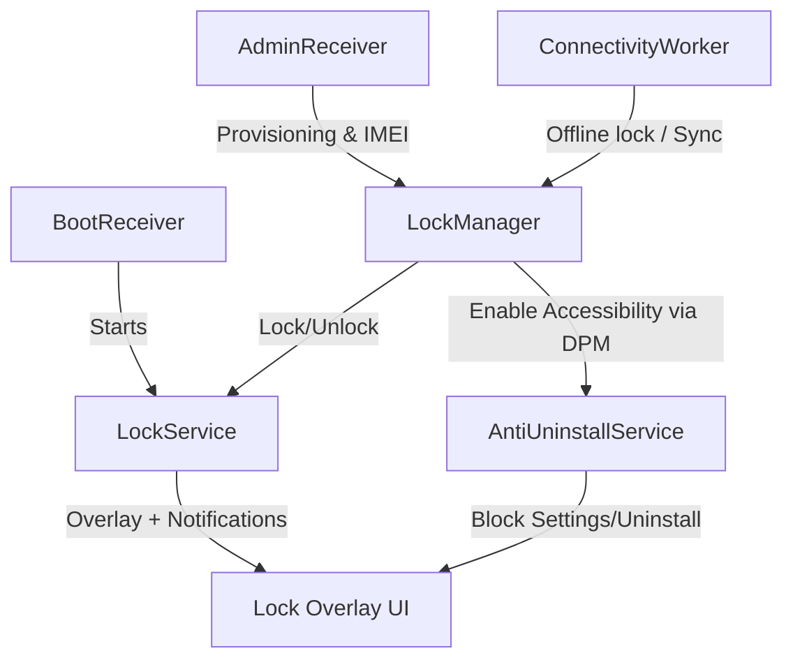
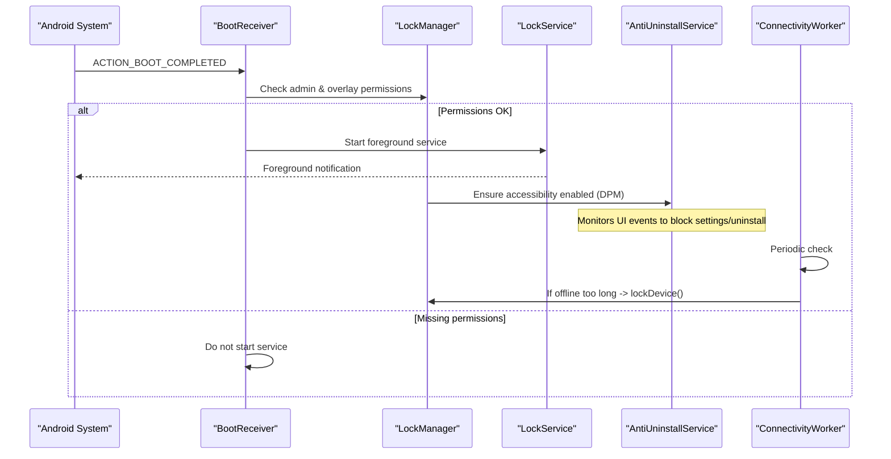
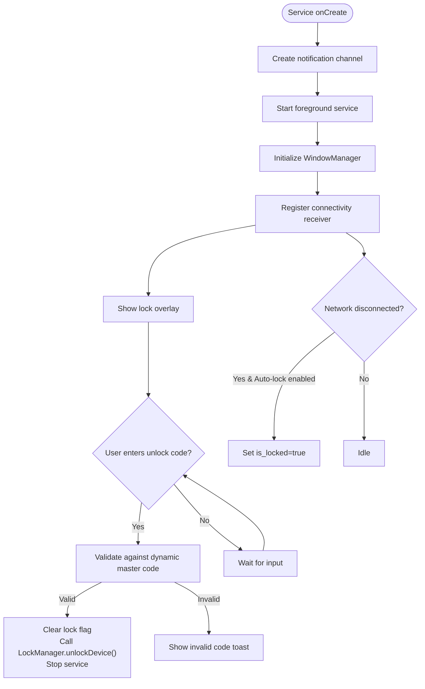
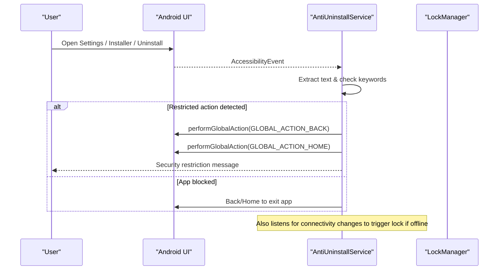
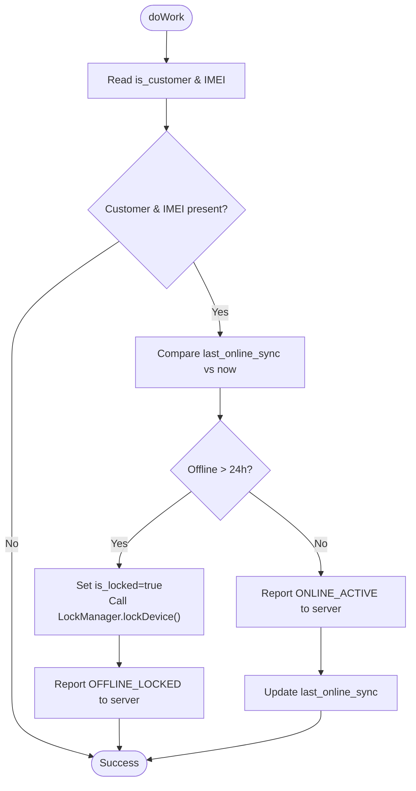
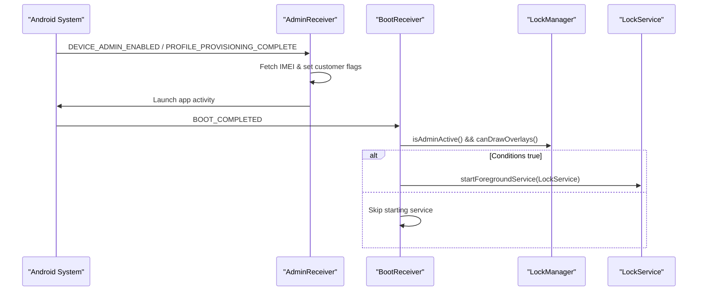
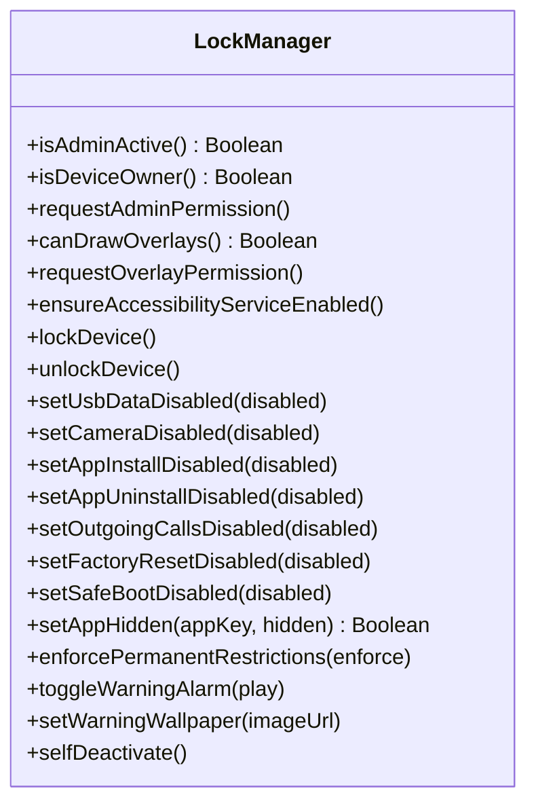
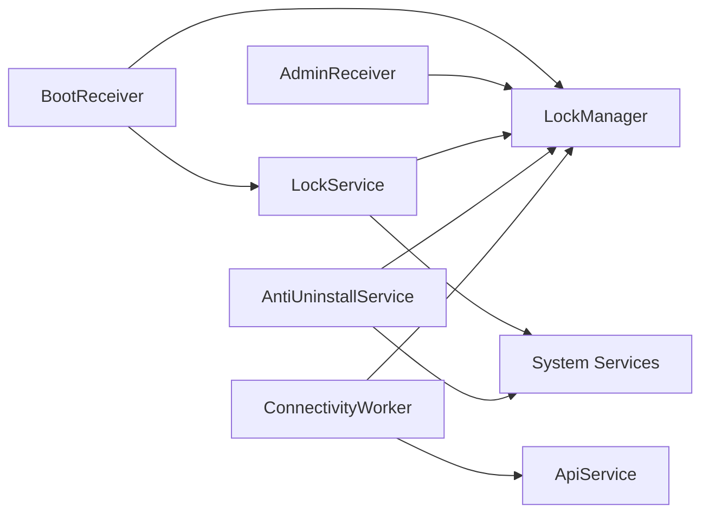

# Background Service Coordination

<cite>
**Referenced Files in This Document**
- [LockService.kt](file://app/src/main/java/com/pksafe/lock/manager/service/LockService.kt)
- [AntiUninstallService.kt](file://app/src/main/java/com/pksafe/lock/manager/service/AntiUninstallService.kt)
- [ConnectivityWorker.kt](file://app/src/main/java/com/pksafe/lock/manager/service/ConnectivityWorker.kt)
- [AdminReceiver.kt](file://app/src/main/java/com/pksafe/lock/manager/receiver/AdminReceiver.kt)
- [BootReceiver.kt](file://app/src/main/java/com/pksafe/lock/manager/receiver/BootReceiver.kt)
- [LockManager.kt](file://app/src/main/java/com/pksafe/lock/manager/util/LockManager.kt)
- [accessibility_service_config.xml](file://app/src/main/res/xml/accessibility_service_config.xml)
- [layout_persistent_lock.xml](file://app/src/main/res/layout/layout_persistent_lock.xml)
- [AndroidManifest.xml](file://app/src/main/AndroidManifest.xml)
</cite>

## Table of Contents
1. Introduction
2. Project Structure
3. Core Components
4. Architecture Overview
5. Detailed Component Analysis
6. Dependency Analysis
7. Performance Considerations
8. Troubleshooting Guide
9. Conclusion

## Introduction
This document explains PK Locker’s background service coordination system with a focus on:
- Foreground service lifecycle management for persistent device lockdown and overlay screens
- Anti-uninstall protection using an Accessibility-based guard service
- Connectivity monitoring workers that enforce offline locking and sync status to the server
- Service startup sequences, dependency resolution between services, and failure recovery mechanisms
- Troubleshooting guidance for service crashes and permission issues

The goal is to provide both technical depth and accessible explanations for developers and operators managing PK Locker deployments.

## Project Structure
PK Locker implements a layered approach:
- Receivers bootstrap or react to system events (boot, admin provisioning)
- A foreground LockService renders a persistent lock overlay and enforces UI-level lockdown
- An Accessibility-based AntiUninstallService monitors user interactions to block unauthorized settings changes and app removal
- A WorkManager-based ConnectivityWorker periodically checks connectivity and triggers locks or server syncs
- LockManager centralizes Device Admin/Device Owner policy enforcement and coordinates services

**Diagram sources**
- [BootReceiver.kt:10-26](file://app/src/main/java/com/pksafe/lock/manager/receiver/BootReceiver.kt#L10-L26)
- [AdminReceiver.kt:16-36](file://app/src/main/java/com/pksafe/lock/manager/receiver/AdminReceiver.kt#L16-L36)
- [LockManager.kt:81-108](file://app/src/main/java/com/pksafe/lock/manager/util/LockManager.kt#L81-L108)
- [LockManager.kt:111-148](file://app/src/main/java/com/pksafe/lock/manager/util/LockManager.kt#L111-L148)
- [ConnectivityWorker.kt:17-47](file://app/src/main/java/com/pksafe/lock/manager/service/ConnectivityWorker.kt#L17-L47)
- [LockService.kt:50-80](file://app/src/main/java/com/pksafe/lock/manager/service/LockService.kt#L50-L80)
- [AntiUninstallService.kt:136-211](file://app/src/main/java/com/pksafe/lock/manager/service/AntiUninstallService.kt#L136-L211)

**Section sources**
- [AndroidManifest.xml:73-112](file://app/src/main/AndroidManifest.xml#L73-L112)
- [AndroidManifest.xml:114-121](file://app/src/main/AndroidManifest.xml#L114-L121)

## Core Components
- LockService: Foreground service that displays a full-screen lock overlay, manages notifications, and integrates auto-lock behavior based on connectivity.
- AntiUninstallService: Accessibility service that intercepts UI events to prevent users from reaching settings or uninstall flows and blocks specific apps when configured.
- ConnectivityWorker: Scheduled worker that detects prolonged offline periods and triggers local locking plus server status updates.
- AdminReceiver: Handles device admin enablement and provisioning completion; fetches IMEI and marks customer mode.
- BootReceiver: Restarts critical services after reboot if conditions are met.
- LockManager: Central utility to apply Device Admin/Owner restrictions, start/stop LockService, and ensure accessibility service is enabled.

**Section sources**
- [LockService.kt:41-80](file://app/src/main/java/com/pksafe/lock/manager/service/LockService.kt#L41-L80)
- [AntiUninstallService.kt:22-86](file://app/src/main/java/com/pksafe/lock/manager/service/AntiUninstallService.kt#L22-L86)
- [ConnectivityWorker.kt:15-47](file://app/src/main/java/com/pksafe/lock/manager/service/ConnectivityWorker.kt#L15-L47)
- [AdminReceiver.kt:16-36](file://app/src/main/java/com/pksafe/lock/manager/receiver/AdminReceiver.kt#L16-L36)
- [BootReceiver.kt:10-26](file://app/src/main/java/com/pksafe/lock/manager/receiver/BootReceiver.kt#L10-L26)
- [LockManager.kt:111-148](file://app/src/main/java/com/pksafe/lock/manager/util/LockManager.kt#L111-L148)

## Architecture Overview
PK Locker uses a coordinated set of Android components to maintain persistent lockdown:
- On boot or provisioning, receivers initialize state and start services as needed.
- LockService runs in the foreground with a sticky start type to survive process death and shows an overlay that cannot be dismissed without the correct code.
- AntiUninstallService watches UI events to block access to settings and uninstall flows and can navigate back/home to keep the user within the lock experience.
- ConnectivityWorker enforces offline policies by locking the device locally and reporting status to the server.

**Diagram sources**
- [BootReceiver.kt:10-26](file://app/src/main/java/com/pksafe/lock/manager/receiver/BootReceiver.kt#L10-L26)
- [LockManager.kt:81-108](file://app/src/main/java/com/pksafe/lock/manager/util/LockManager.kt#L81-L108)
- [LockService.kt:50-80](file://app/src/main/java/com/pksafe/lock/manager/service/LockService.kt#L50-L80)
- [ConnectivityWorker.kt:17-47](file://app/src/main/java/com/pksafe/lock/manager/service/ConnectivityWorker.kt#L17-L47)

## Detailed Component Analysis

### LockService: Persistent Foreground Lock Overlay
Responsibilities:
- Runs as a sticky foreground service with a high-priority ongoing notification
- Renders a full-screen overlay using WindowManager with flags to stay visible, keep screen on, show while locked, and allow keyboard input
- Blocks navigation keys (back/home/app switch/menu) at the view level
- Supports dynamic unlock via a hidden entry flow validated against a master code derived from device IMEI
- Fetches live EMI data from the server and refreshes overlay content
- Registers a connectivity receiver to auto-lock when internet disconnects (if enabled)

Key behaviors:
- Foreground lifecycle: onCreate sets up notification channel, starts foreground, registers connectivity receiver, and shows overlay
- Overlay creation: Uses TYPE_APPLICATION_OVERLAY (or legacy TYPE_PHONE) with flags to ensure visibility and interaction
- Unlock logic: Validates input against dynamic master code, clears lock state, calls LockManager.unlockDevice(), and stops itself
- Data refresh: Asynchronously fetches device/EMI info and updates overlay views on the main thread

**Diagram sources**
- [LockService.kt:50-80](file://app/src/main/java/com/pksafe/lock/manager/service/LockService.kt#L50-L80)
- [LockService.kt:125-234](file://app/src/main/java/com/pksafe/lock/manager/service/LockService.kt#L125-L234)
- [LockService.kt:240-314](file://app/src/main/java/com/pksafe/lock/manager/service/LockService.kt#L240-L314)
- [layout_persistent_lock.xml:188-226](file://app/src/main/res/layout/layout_persistent_lock.xml#L188-L226)

**Section sources**
- [LockService.kt:41-80](file://app/src/main/java/com/pksafe/lock/manager/service/LockService.kt#L41-L80)
- [LockService.kt:107-123](file://app/src/main/java/com/pksafe/lock/manager/service/LockService.kt#L107-L123)
- [LockService.kt:125-234](file://app/src/main/java/com/pksafe/lock/manager/service/LockService.kt#L125-L234)
- [LockService.kt:240-314](file://app/src/main/java/com/pksafe/lock/manager/service/LockService.kt#L240-L314)
- [layout_persistent_lock.xml:1-234](file://app/src/main/res/layout/layout_persistent_lock.xml#L1-L234)

### AntiUninstallService: Accessibility-Based Protection
Responsibilities:
- Intercepts accessibility events to detect attempts to reach settings, package installer, or uninstall flows
- Blocks specific apps dynamically based on configuration
- Navigates back/home to prevent leaving the lock environment
- Triggers auto-lock on connectivity loss when in customer mode and auto-lock is enabled
- Provides helpers to verify its own enabled state via system settings and AccessibilityManager

Protection mechanisms:
- Keyword scanning across event text and active window content to identify restricted actions
- Global actions to return to home/back when restricted actions are detected
- Dynamic app blocking using a known package map or custom keys stored in preferences

**Diagram sources**
- [AntiUninstallService.kt:119-211](file://app/src/main/java/com/pksafe/lock/manager/service/AntiUninstallService.kt#L119-L211)
- [AntiUninstallService.kt:88-117](file://app/src/main/java/com/pksafe/lock/manager/service/AntiUninstallService.kt#L88-L117)

**Section sources**
- [AntiUninstallService.kt:22-86](file://app/src/main/java/com/pksafe/lock/manager/service/AntiUninstallService.kt#L22-L86)
- [AntiUninstallService.kt:119-211](file://app/src/main/java/com/pksafe/lock/manager/service/AntiUninstallService.kt#L119-L211)
- [accessibility_service_config.xml:1-8](file://app/src/main/res/xml/accessibility_service_config.xml#L1-L8)

### ConnectivityWorker: Offline Locking and Server Sync
Responsibilities:
- Checks whether the device has been offline beyond a threshold and triggers local locking if so
- Reports online/offline status to the server when possible
- Updates last sync timestamp upon successful report

Processing logic:
- Reads customer mode and IMEI from preferences; skips work if not applicable
- Compares last sync time with current time to decide between offline lock and heartbeat
- Attempts to send a status update to the server and persists success

**Diagram sources**
- [ConnectivityWorker.kt:17-47](file://app/src/main/java/com/pksafe/lock/manager/service/ConnectivityWorker.kt#L17-L47)
- [ConnectivityWorker.kt:49-70](file://app/src/main/java/com/pksafe/lock/manager/service/ConnectivityWorker.kt#L49-L70)

**Section sources**
- [ConnectivityWorker.kt:15-72](file://app/src/main/java/com/pksafe/lock/manager/service/ConnectivityWorker.kt#L15-L72)

### AdminReceiver and BootReceiver: Startup and Provisioning
- AdminReceiver:
  - On admin enable or profile provisioning complete, fetches IMEI and marks customer mode
  - Launches the app post-provisioning to finalize setup
- BootReceiver:
  - On boot completed, checks if admin is active and overlay permission granted
  - Starts LockService as a foreground service if conditions are met

**Diagram sources**
- [AdminReceiver.kt:16-36](file://app/src/main/java/com/pksafe/lock/manager/receiver/AdminReceiver.kt#L16-L36)
- [BootReceiver.kt:10-26](file://app/src/main/java/com/pksafe/lock/manager/receiver/BootReceiver.kt#L10-L26)

**Section sources**
- [AdminReceiver.kt:16-36](file://app/src/main/java/com/pksafe/lock/manager/receiver/AdminReceiver.kt#L16-L36)
- [BootReceiver.kt:10-26](file://app/src/main/java/com/pksafe/lock/manager/receiver/BootReceiver.kt#L10-L26)

### LockManager: Policy Enforcement and Service Orchestration
Responsibilities:
- Ensures Accessibility service is enabled via Device Owner APIs
- Applies hardware and system restrictions (camera, USB, factory reset, safe boot, ADB, status bar, keyguard)
- Starts/stops LockService and triggers lockNow
- Provides granular controls for app hiding, call restrictions, and permanent restrictions
- Supports self-deactivation to remove privileges and allow normal uninstallation

**Diagram sources**
- [LockManager.kt:46-108](file://app/src/main/java/com/pksafe/lock/manager/util/LockManager.kt#L46-L108)
- [LockManager.kt:111-192](file://app/src/main/java/com/pksafe/lock/manager/util/LockManager.kt#L111-L192)
- [LockManager.kt:202-315](file://app/src/main/java/com/pksafe/lock/manager/util/LockManager.kt#L202-L315)
- [LockManager.kt:351-405](file://app/src/main/java/com/pksafe/lock/manager/util/LockManager.kt#L351-L405)

**Section sources**
- [LockManager.kt:46-108](file://app/src/main/java/com/pksafe/lock/manager/util/LockManager.kt#L46-L108)
- [LockManager.kt:111-192](file://app/src/main/java/com/pksafe/lock/manager/util/LockManager.kt#L111-L192)
- [LockManager.kt:202-315](file://app/src/main/java/com/pksafe/lock/manager/util/LockManager.kt#L202-L315)
- [LockManager.kt:351-405](file://app/src/main/java/com/pksafe/lock/manager/util/LockManager.kt#L351-L405)

## Dependency Analysis
- BootReceiver depends on LockManager to validate prerequisites before starting LockService.
- LockService depends on LockManager for unlocking and on system services (WindowManager, NotificationManager, ConnectivityManager).
- AntiUninstallService depends on LockManager to trigger locking on connectivity loss and on AccessibilityManager to verify its enabled state.
- ConnectivityWorker depends on LockManager to lock devices and on ApiService to report status.
- AdminReceiver sets up initial state (IMEI, customer mode) used by other components.

**Diagram sources**
- [BootReceiver.kt:10-26](file://app/src/main/java/com/pksafe/lock/manager/receiver/BootReceiver.kt#L10-L26)
- [LockService.kt:200-213](file://app/src/main/java/com/pksafe/lock/manager/service/LockService.kt#L200-L213)
- [AntiUninstallService.kt:91-104](file://app/src/main/java/com/pksafe/lock/manager/service/AntiUninstallService.kt#L91-L104)
- [ConnectivityWorker.kt:34-44](file://app/src/main/java/com/pksafe/lock/manager/service/ConnectivityWorker.kt#L34-L44)
- [AdminReceiver.kt:16-36](file://app/src/main/java/com/pksafe/lock/manager/receiver/AdminReceiver.kt#L16-L36)

**Section sources**
- [AndroidManifest.xml:73-112](file://app/src/main/AndroidManifest.xml#L73-L112)
- [AndroidManifest.xml:114-121](file://app/src/main/AndroidManifest.xml#L114-L121)

## Performance Considerations
- Foreground service stability: LockService uses START_STICKY and a high-importance notification to improve resilience against process termination.
- Overlay performance: The overlay uses minimal UI elements and avoids heavy operations on the main thread; network updates run on IO dispatchers.
- Accessibility overhead: AntiUninstallService traverses the view tree efficiently and recycles nodes to avoid memory pressure.
- Worker scheduling: ConnectivityWorker limits server calls and only triggers locks when offline thresholds are exceeded.

[No sources needed since this section provides general guidance]

## Troubleshooting Guide
Common issues and resolutions:
- Overlay permission missing:
  - Symptom: LockService fails to add overlay view
  - Resolution: Ensure overlay permission is granted; use LockManager.requestOverlayPermission() to prompt the user
  - Section sources
    - [LockManager.kt:63-73](file://app/src/main/java/com/pksafe/lock/manager/util/LockManager.kt#L63-L73)
    - [LockService.kt:220-225](file://app/src/main/java/com/pksafe/lock/manager/service/LockService.kt#L220-L225)

- Accessibility service not enabled:
  - Symptom: AntiUninstallService does not intercept events
  - Resolution: Use LockManager.ensureAccessibilityServiceEnabled() to enable via Device Owner APIs; verify via AntiUninstallService.isServiceRunning()
  - Section sources
    - [LockManager.kt:81-108](file://app/src/main/java/com/pksafe/lock/manager/util/LockManager.kt#L81-L108)
    - [AntiUninstallService.kt:51-80](file://app/src/main/java/com/pksafe/lock/manager/service/AntiUninstallService.kt#L51-L80)

- Service not started after reboot:
  - Symptom: LockService not running post-boot
  - Resolution: Verify BootReceiver receives BOOT_COMPLETED and that admin/overlay permissions are satisfied before starting the service
  - Section sources
    - [BootReceiver.kt:10-26](file://app/src/main/java/com/pksafe/lock/manager/receiver/BootReceiver.kt#L10-L26)

- Auto-lock not triggering on connectivity loss:
  - Symptom: Device remains unlocked when offline
  - Resolution: Ensure auto_lock_enabled is set and that connectivity receiver is registered in both LockService and AntiUninstallService
  - Section sources
    - [LockService.kt:82-105](file://app/src/main/java/com/pksafe/lock/manager/service/LockService.kt#L82-L105)
    - [AntiUninstallService.kt:88-117](file://app/src/main/java/com/pksafe/lock/manager/service/AntiUninstallService.kt#L88-L117)

- ConnectivityWorker not locking offline devices:
  - Symptom: Device stays unlocked despite being offline
  - Resolution: Confirm worker is scheduled, IMEI and customer flags are set, and last_online_sync is stale enough to trigger lock
  - Section sources
    - [ConnectivityWorker.kt:17-47](file://app/src/main/java/com/pksafe/lock/manager/service/ConnectivityWorker.kt#L17-L47)

- Admin privileges lost:
  - Symptom: Restrictions no longer applied
  - Resolution: Re-enable device admin and reapply permanent restrictions via LockManager.enforcePermanentRestrictions()
  - Section sources
    - [LockManager.kt:295-315](file://app/src/main/java/com/pksafe/lock/manager/util/LockManager.kt#L295-L315)

- Self-deactivation unintended:
  - Symptom: App becomes uninstallable and restrictions removed
  - Resolution: Avoid calling LockManager.selfDeactivate() unless intentionally releasing the device; re-provision admin/owner as needed
  - Section sources
    - [LockManager.kt:351-405](file://app/src/main/java/com/pksafe/lock/manager/util/LockManager.kt#L351-L405)

## Conclusion
PK Locker’s background service coordination combines a resilient foreground lock overlay, an accessibility-based anti-uninstall guard, and a connectivity-driven worker to enforce persistent device lockdown. Proper initialization through AdminReceiver and BootReceiver ensures services start reliably, while LockManager centralizes policy enforcement and service orchestration. Operators should monitor overlay and accessibility permissions, ensure connectivity listeners are active, and rely on LockManager methods to manage restrictions consistently. For failures, follow the troubleshooting steps to restore expected behavior quickly.