# Component Relationships and Data Flow

<cite>
**Referenced Files in This Document**
- [MainActivity.kt](file://app/src/main/java/com/pksafe/lock/manager/MainActivity.kt)
- [LockManager.kt](file://app/src/main/java/com/pksafe/lock/manager/util/LockManager.kt)
- [ApiService.kt](file://app/src/main/java/com/pksafe/lock/manager/data/ApiService.kt)
- [Models.kt](file://app/src/main/java/com/pksafe/lock/manager/data/Models.kt)
- [SmsReceiver.kt](file://app/src/main/java/com/pksafe/lock/manager/receiver/SmsReceiver.kt)
- [LockService.kt](file://app/src/main/java/com/pksafe/lock/manager/service/LockService.kt)
- [AntiUninstallService.kt](file://app/src/main/java/com/pksafe/lock/manager/service/AntiUninstallService.kt)
- [AdminReceiver.kt](file://app/src/main/java/com/pksafe/lock/manager/receiver/AdminReceiver.kt)
- [BootReceiver.kt](file://app/src/main/java/com/pksafe/lock/manager/receiver/BootReceiver.kt)
- [Constants.kt](file://app/src/main/java/com/pksafe/lock/manager/util/Constants.kt)
</cite>

## Table of Contents
1. Introduction
2. Project Structure
3. Core Components
4. Architecture Overview
5. Detailed Component Analysis
6. Dependency Analysis
7. Performance Considerations
8. Troubleshooting Guide
9. Conclusion

## Introduction
This document explains PK Locker’s component interaction patterns and data flow architecture. It focuses on how MainActivity orchestrates communication between system components: LockManager for device control, ApiService for network operations, SmsReceiver for offline commands, and background services (LockService, AntiUninstallService) for persistent operation. It also documents the event-driven architecture using SharedPreferences listeners, broadcast receivers, and coroutines for asynchronous operations, along with dependency injection patterns, singleton-like usage, and service coordination. Sequence diagrams illustrate typical workflows such as device provisioning, lock/unlock operations, and status synchronization.

## Project Structure
PK Locker is organized by feature areas under app/src/main/java/com/pksafe/lock/manager:
- ui: Compose screens and ViewModels for shopkeeper and customer flows
- util: Core utilities including LockManager and constants
- receiver: Broadcast receivers for boot, admin events, SMS, SIM state
- service: Foreground services for lock overlay and anti-uninstall guard
- data: Retrofit API interface and data models

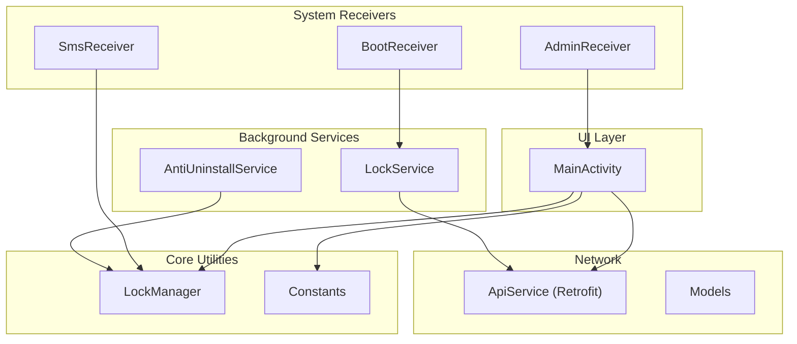

**Diagram sources**
- [MainActivity.kt:65-445](file://app/src/main/java/com/pksafe/lock/manager/MainActivity.kt#L65-L445)
- [LockManager.kt:27-406](file://app/src/main/java/com/pksafe/lock/manager/util/LockManager.kt#L27-L406)
- [ApiService.kt:11-185](file://app/src/main/java/com/pksafe/lock/manager/data/ApiService.kt#L11-L185)
- [Models.kt:1-255](file://app/src/main/java/com/pksafe/lock/manager/data/Models.kt#L1-L255)
- [SmsReceiver.kt:29-164](file://app/src/main/java/com/pksafe/lock/manager/receiver/SmsReceiver.kt#L29-L164)
- [LockService.kt:41-330](file://app/src/main/java/com/pksafe/lock/manager/service/LockService.kt#L41-L330)
- [AntiUninstallService.kt:22-224](file://app/src/main/java/com/pksafe/lock/manager/service/AntiUninstallService.kt#L22-L224)
- [AdminReceiver.kt:14-104](file://app/src/main/java/com/pksafe/lock/manager/receiver/AdminReceiver.kt#L14-L104)
- [BootReceiver.kt:10-27](file://app/src/main/java/com/pksafe/lock/manager/receiver/BootReceiver.kt#L10-L27)
- [Constants.kt:3-10](file://app/src/main/java/com/pksafe/lock/manager/util/Constants.kt#L3-L10)

**Section sources**
- [MainActivity.kt:65-445](file://app/src/main/java/com/pksafe/lock/manager/MainActivity.kt#L65-L445)
- [LockManager.kt:27-406](file://app/src/main/java/com/pksafe/lock/manager/util/LockManager.kt#L27-L406)
- [ApiService.kt:11-185](file://app/src/main/java/com/pksafe/lock/manager/data/ApiService.kt#L11-L185)
- [Models.kt:1-255](file://app/src/main/java/com/pksafe/lock/manager/data/Models.kt#L1-L255)
- [SmsReceiver.kt:29-164](file://app/src/main/java/com/pksafe/lock/manager/receiver/SmsReceiver.kt#L29-L164)
- [LockService.kt:41-330](file://app/src/main/java/com/pksafe/lock/manager/service/LockService.kt#L41-L330)
- [AntiUninstallService.kt:22-224](file://app/src/main/java/com/pksafe/lock/manager/service/AntiUninstallService.kt#L22-L224)
- [AdminReceiver.kt:14-104](file://app/src/main/java/com/pksafe/lock/manager/receiver/AdminReceiver.kt#L14-L104)
- [BootReceiver.kt:10-27](file://app/src/main/java/com/pksafe/lock/manager/receiver/BootReceiver.kt#L10-L27)
- [Constants.kt:3-10](file://app/src/main/java/com/pksafe/lock/manager/util/Constants.kt#L3-L10)

## Core Components
- MainActivity: Orchestrates UI, permissions, SharedPreferences-based state, FCM token sync, background sync scheduling, and triggers lock/unlock via LockManager.
- LockManager: Centralizes Device Policy Manager interactions to enforce restrictions, start/stop LockService, and manage device owner/admin privileges.
- ApiService: Retrofit interface defining endpoints for authentication, device management, EMI, key orders, and token updates.
- Models: Data classes representing server payloads and local DTOs used across the app.
- SmsReceiver: Offline command handler that validates SMS codes and triggers lock/unlock through LockManager.
- LockService: Foreground service that renders a persistent lock overlay, enforces input blocking, and refreshes live EMI data from the server.
- AntiUninstallService: Accessibility-based guard that blocks restricted actions and can auto-lock when connectivity drops.
- AdminReceiver: Handles device provisioning callbacks and sets up IMEI and permissions.
- BootReceiver: Restarts LockService after reboot if conditions are met.
- Constants: Centralized configuration for base URLs and update endpoints.

**Section sources**
- [MainActivity.kt:65-445](file://app/src/main/java/com/pksafe/lock/manager/MainActivity.kt#L65-L445)
- [LockManager.kt:27-406](file://app/src/main/java/com/pksafe/lock/manager/util/LockManager.kt#L27-L406)
- [ApiService.kt:11-185](file://app/src/main/java/com/pksafe/lock/manager/data/ApiService.kt#L11-L185)
- [Models.kt:1-255](file://app/src/main/java/com/pksafe/lock/manager/data/Models.kt#L1-L255)
- [SmsReceiver.kt:29-164](file://app/src/main/java/com/pksafe/lock/manager/receiver/SmsReceiver.kt#L29-L164)
- [LockService.kt:41-330](file://app/src/main/java/com/pksafe/lock/manager/service/LockService.kt#L41-L330)
- [AntiUninstallService.kt:22-224](file://app/src/main/java/com/pksafe/lock/manager/service/AntiUninstallService.kt#L22-L224)
- [AdminReceiver.kt:14-104](file://app/src/main/java/com/pksafe/lock/manager/receiver/AdminReceiver.kt#L14-L104)
- [BootReceiver.kt:10-27](file://app/src/main/java/com/pksafe/lock/manager/receiver/BootReceiver.kt#L10-L27)
- [Constants.kt:3-10](file://app/src/main/java/com/pksafe/lock/manager/util/Constants.kt#L3-L10)

## Architecture Overview
PK Locker uses an event-driven architecture centered around SharedPreferences as the single source of truth for device state (e.g., is_customer, is_locked). Components react to changes via:
- SharedPreferences.OnSharedPreferenceChangeListener in MainActivity to drive UI and trigger LockManager actions
- BroadcastReceivers (SMS, Boot, Connectivity) to respond to system events
- Coroutines for asynchronous network calls via Retrofit ApiService
- Foreground services (LockService) for persistent overlays and background tasks
- Accessibility service (AntiUninstallService) for policy enforcement and auto-lock behavior

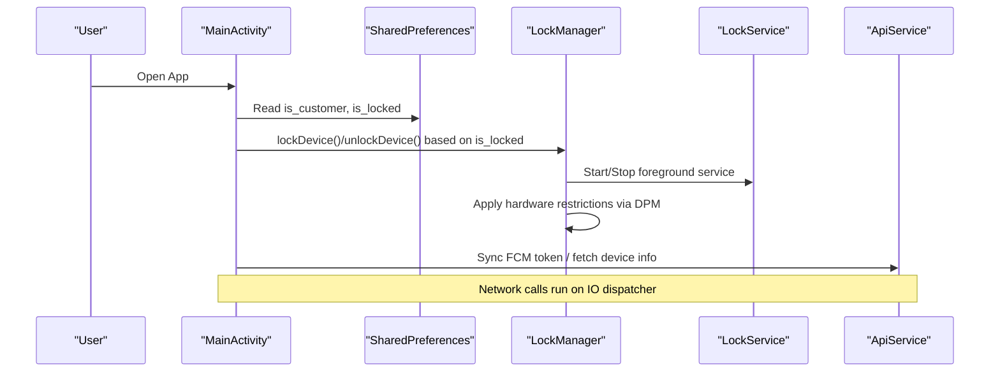

**Diagram sources**
- [MainActivity.kt:126-445](file://app/src/main/java/com/pksafe/lock/manager/MainActivity.kt#L126-L445)
- [LockManager.kt:111-148](file://app/src/main/java/com/pksafe/lock/manager/util/LockManager.kt#L111-L148)
- [LockService.kt:50-80](file://app/src/main/java/com/pksafe/lock/manager/service/LockService.kt#L50-L80)
- [ApiService.kt:65-75](file://app/src/main/java/com/pksafe/lock/manager/data/ApiService.kt#L65-L75)

## Detailed Component Analysis

### MainActivity Orchestration
- Reads and observes SharedPreferences keys to determine user role and lock state.
- Triggers LockManager.lockDevice() or unlockDevice() when is_locked changes.
- Schedules periodic location sync and auto-update checks.
- Syncs FCM tokens to server for both customer and shopkeeper roles.
- Fetches offline SMS codes from server and persists them for SmsReceiver use.

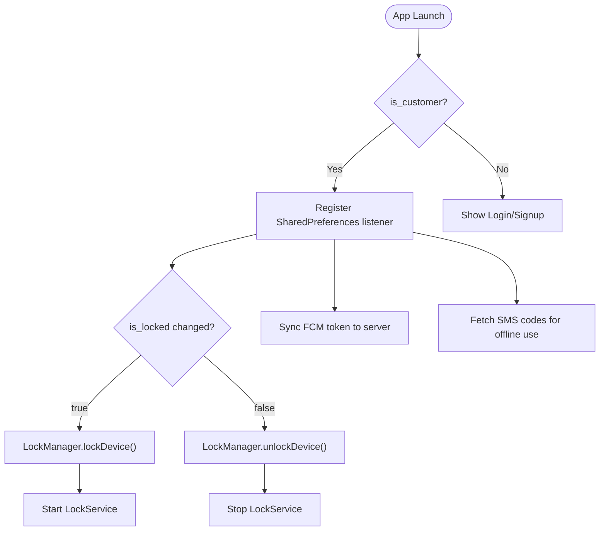

**Diagram sources**
- [MainActivity.kt:126-445](file://app/src/main/java/com/pksafe/lock/manager/MainActivity.kt#L126-L445)
- [LockManager.kt:111-148](file://app/src/main/java/com/pksafe/lock/manager/util/LockManager.kt#L111-L148)

**Section sources**
- [MainActivity.kt:126-445](file://app/src/main/java/com/pksafe/lock/manager/MainActivity.kt#L126-L445)

### LockManager Device Control
- Uses DevicePolicyManager to apply restrictions (camera, USB, factory reset, safe boot, ADB, settings).
- Starts/stops LockService to show/hide lock overlay.
- Provides granular controls (USB, camera, install/uninstall, outgoing calls, factory reset, safe boot).
- Enforces permanent restrictions for customer devices even when unlocked.
- Supports self-deactivation to remove all privileges for release.

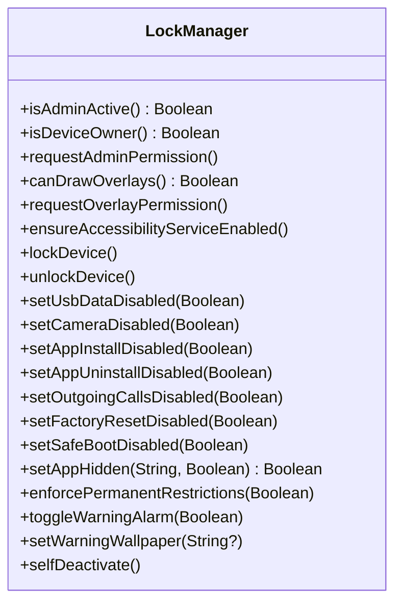

**Diagram sources**
- [LockManager.kt:27-406](file://app/src/main/java/com/pksafe/lock/manager/util/LockManager.kt#L27-L406)

**Section sources**
- [LockManager.kt:27-406](file://app/src/main/java/com/pksafe/lock/manager/util/LockManager.kt#L27-L406)

### ApiService and Models
- Defines REST endpoints for authentication, device lifecycle, EMI schedule, key orders, and token updates.
- Models represent structured responses and requests for consistent serialization/deserialization.

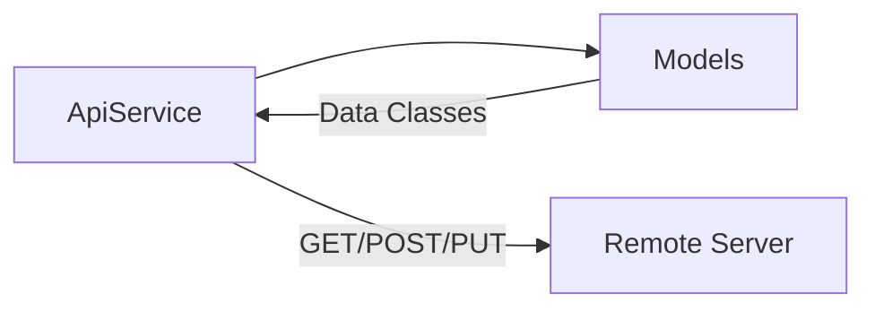

**Diagram sources**
- [ApiService.kt:11-185](file://app/src/main/java/com/pksafe/lock/manager/data/ApiService.kt#L11-L185)
- [Models.kt:1-255](file://app/src/main/java/com/pksafe/lock/manager/data/Models.kt#L1-L255)

**Section sources**
- [ApiService.kt:11-185](file://app/src/main/java/com/pksafe/lock/manager/data/ApiService.kt#L11-L185)
- [Models.kt:1-255](file://app/src/main/java/com/pksafe/lock/manager/data/Models.kt#L1-L255)

### SmsReceiver Offline Commands
- Listens for incoming SMS messages.
- Validates commands LOCK#code and UNLOCK#code against stored or generated SHA-256 codes derived from IMEI(s).
- On valid command, updates SharedPreferences is_locked and invokes LockManager to enforce lock/unlock.

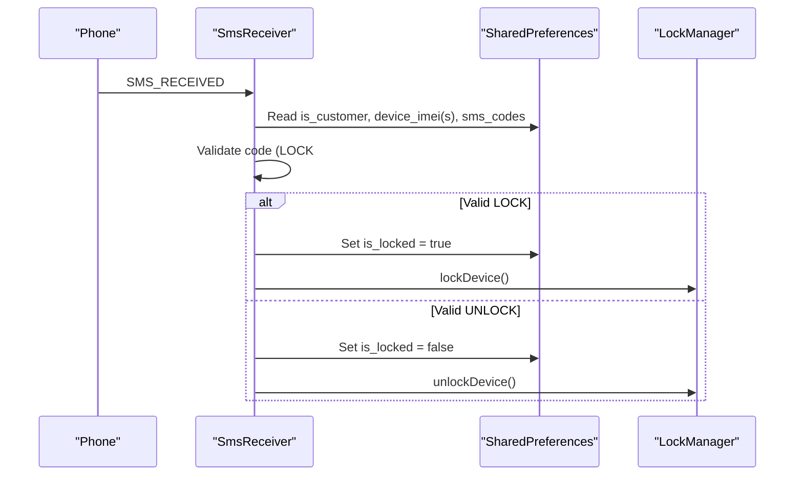

**Diagram sources**
- [SmsReceiver.kt:29-164](file://app/src/main/java/com/pksafe/lock/manager/receiver/SmsReceiver.kt#L29-L164)
- [LockManager.kt:111-148](file://app/src/main/java/com/pksafe/lock/manager/util/LockManager.kt#L111-L148)

**Section sources**
- [SmsReceiver.kt:29-164](file://app/src/main/java/com/pksafe/lock/manager/receiver/SmsReceiver.kt#L29-L164)

### Background Services Coordination
- LockService: Runs as a foreground service to render a persistent lock overlay, block navigation keys, and refresh EMI data from the server. It also supports emergency unlock via dynamic master code derived from IMEI.
- AntiUninstallService: Monitors accessibility events to block restricted actions and can auto-lock on connectivity loss.
- BootReceiver: Restarts LockService after reboot if device admin and overlay permissions are active.

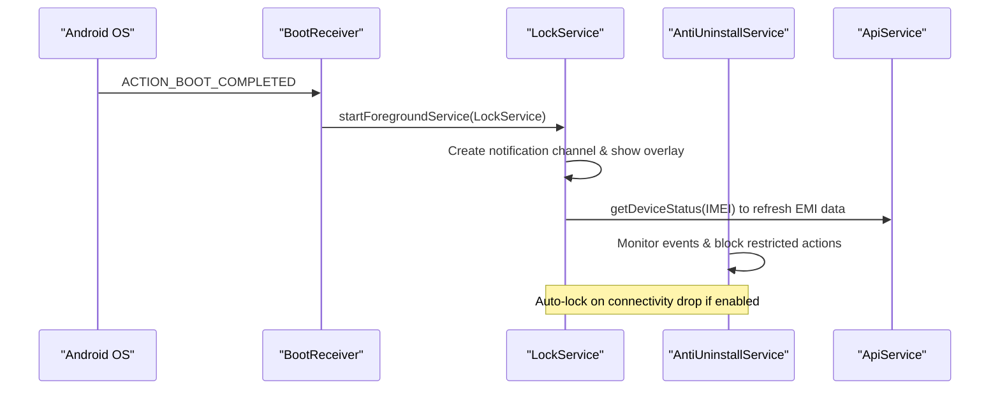

**Diagram sources**
- [BootReceiver.kt:10-27](file://app/src/main/java/com/pksafe/lock/manager/receiver/BootReceiver.kt#L10-L27)
- [LockService.kt:50-80](file://app/src/main/java/com/pksafe/lock/manager/service/LockService.kt#L50-L80)
- [LockService.kt:240-314](file://app/src/main/java/com/pksafe/lock/manager/service/LockService.kt#L240-L314)
- [AntiUninstallService.kt:82-110](file://app/src/main/java/com/pksafe/lock/manager/service/AntiUninstallService.kt#L82-L110)

**Section sources**
- [LockService.kt:41-330](file://app/src/main/java/com/pksafe/lock/manager/service/LockService.kt#L41-L330)
- [AntiUninstallService.kt:22-224](file://app/src/main/java/com/pksafe/lock/manager/service/AntiUninstallService.kt#L22-L224)
- [BootReceiver.kt:10-27](file://app/src/main/java/com/pksafe/lock/manager/receiver/BootReceiver.kt#L10-L27)

### Event-Driven Architecture
- SharedPreferences listeners in MainActivity drive UI transitions and trigger LockManager actions.
- BroadcastReceivers handle system events:
  - SmsReceiver: Offline lock/unlock via SMS
  - BootReceiver: Restart LockService post-boot
  - Connectivity monitoring in LockService and AntiUninstallService for auto-lock behavior
- Coroutines execute network operations asynchronously via Retrofit ApiService.

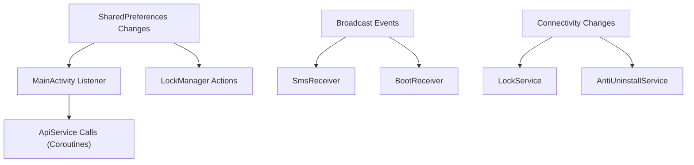

**Diagram sources**
- [MainActivity.kt:355-368](file://app/src/main/java/com/pksafe/lock/manager/MainActivity.kt#L355-L368)
- [SmsReceiver.kt:44-143](file://app/src/main/java/com/pksafe/lock/manager/receiver/SmsReceiver.kt#L44-L143)
- [BootReceiver.kt:11-24](file://app/src/main/java/com/pksafe/lock/manager/receiver/BootReceiver.kt#L11-L24)
- [LockService.kt:82-105](file://app/src/main/java/com/pksafe/lock/manager/service/LockService.kt#L82-L105)
- [AntiUninstallService.kt:88-110](file://app/src/main/java/com/pksafe/lock/manager/service/AntiUninstallService.kt#L88-L110)

**Section sources**
- [MainActivity.kt:355-368](file://app/src/main/java/com/pksafe/lock/manager/MainActivity.kt#L355-L368)
- [SmsReceiver.kt:44-143](file://app/src/main/java/com/pksafe/lock/manager/receiver/SmsReceiver.kt#L44-L143)
- [BootReceiver.kt:11-24](file://app/src/main/java/com/pksafe/lock/manager/receiver/BootReceiver.kt#L11-L24)
- [LockService.kt:82-105](file://app/src/main/java/com/pksafe/lock/manager/service/LockService.kt#L82-L105)
- [AntiUninstallService.kt:88-110](file://app/src/main/java/com/pksafe/lock/manager/service/AntiUninstallService.kt#L88-L110)

### Typical Workflows

#### Device Provisioning
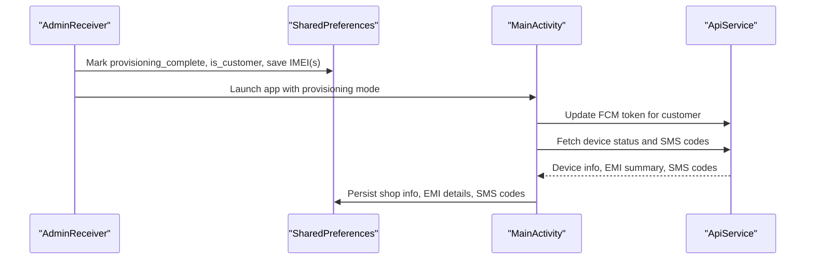

**Diagram sources**
- [AdminReceiver.kt:16-36](file://app/src/main/java/com/pksafe/lock/manager/receiver/AdminReceiver.kt#L16-L36)
- [AdminReceiver.kt:43-102](file://app/src/main/java/com/pksafe/lock/manager/receiver/AdminReceiver.kt#L43-L102)
- [MainActivity.kt:334-353](file://app/src/main/java/com/pksafe/lock/manager/MainActivity.kt#L334-L353)
- [MainActivity.kt:500-564](file://app/src/main/java/com/pksafe/lock/manager/MainActivity.kt#L500-L564)
- [ApiService.kt:101-109](file://app/src/main/java/com/pksafe/lock/manager/data/ApiService.kt#L101-L109)

**Section sources**
- [AdminReceiver.kt:16-36](file://app/src/main/java/com/pksafe/lock/manager/receiver/AdminReceiver.kt#L16-L36)
- [AdminReceiver.kt:43-102](file://app/src/main/java/com/pksafe/lock/manager/receiver/AdminReceiver.kt#L43-L102)
- [MainActivity.kt:334-353](file://app/src/main/java/com/pksafe/lock/manager/MainActivity.kt#L334-L353)
- [MainActivity.kt:500-564](file://app/src/main/java/com/pksafe/lock/manager/MainActivity.kt#L500-L564)
- [ApiService.kt:101-109](file://app/src/main/java/com/pksafe/lock/manager/data/ApiService.kt#L101-L109)

#### Lock/Unlock Operations
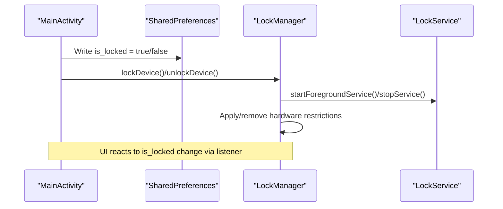

**Diagram sources**
- [MainActivity.kt:370-388](file://app/src/main/java/com/pksafe/lock/manager/MainActivity.kt#L370-L388)
- [LockManager.kt:111-148](file://app/src/main/java/com/pksafe/lock/manager/util/LockManager.kt#L111-L148)

**Section sources**
- [MainActivity.kt:370-388](file://app/src/main/java/com/pksafe/lock/manager/MainActivity.kt#L370-L388)
- [LockManager.kt:111-148](file://app/src/main/java/com/pksafe/lock/manager/util/LockManager.kt#L111-L148)

#### Status Synchronization
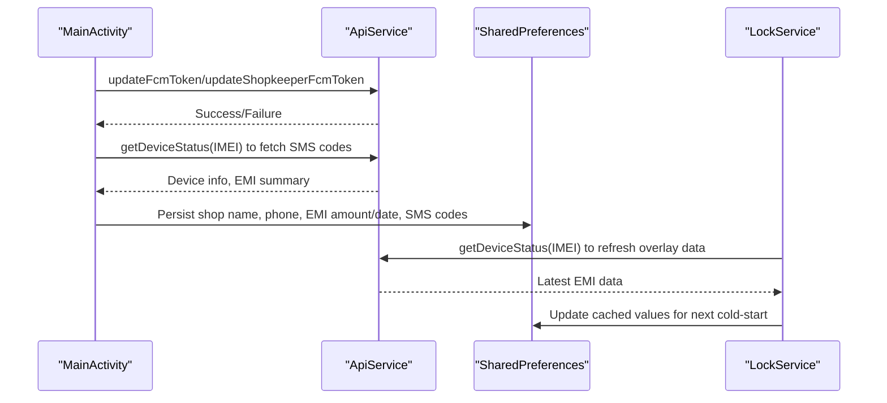

**Diagram sources**
- [MainActivity.kt:448-493](file://app/src/main/java/com/pksafe/lock/manager/MainActivity.kt#L448-L493)
- [MainActivity.kt:500-564](file://app/src/main/java/com/pksafe/lock/manager/MainActivity.kt#L500-L564)
- [LockService.kt:240-314](file://app/src/main/java/com/pksafe/lock/manager/service/LockService.kt#L240-L314)
- [ApiService.kt:65-75](file://app/src/main/java/com/pksafe/lock/manager/data/ApiService.kt#L65-L75)
- [ApiService.kt:101-109](file://app/src/main/java/com/pksafe/lock/manager/data/ApiService.kt#L101-L109)

**Section sources**
- [MainActivity.kt:448-493](file://app/src/main/java/com/pksafe/lock/manager/MainActivity.kt#L448-L493)
- [MainActivity.kt:500-564](file://app/src/main/java/com/pksafe/lock/manager/MainActivity.kt#L500-L564)
- [LockService.kt:240-314](file://app/src/main/java/com/pksafe/lock/manager/service/LockService.kt#L240-L314)
- [ApiService.kt:65-75](file://app/src/main/java/com/pksafe/lock/manager/data/ApiService.kt#L65-L75)
- [ApiService.kt:101-109](file://app/src/main/java/com/pksafe/lock/manager/data/ApiService.kt#L101-L109)

## Dependency Analysis
- MainActivity depends on LockManager for device control and ApiService for network operations; it also coordinates with background services via intents.
- LockManager depends on Android DevicePolicyManager and interacts with LockService to manage overlays and restrictions.
- SmsReceiver depends on SharedPreferences and LockManager to act on offline commands.
- LockService depends on ApiService to refresh EMI data and on SharedPreferences for persisted values.
- AntiUninstallService depends on LockManager and SharedPreferences to enforce policies and auto-lock.
- AdminReceiver and BootReceiver coordinate with LockService and SharedPreferences to ensure persistent operation across reboots and provisioning.

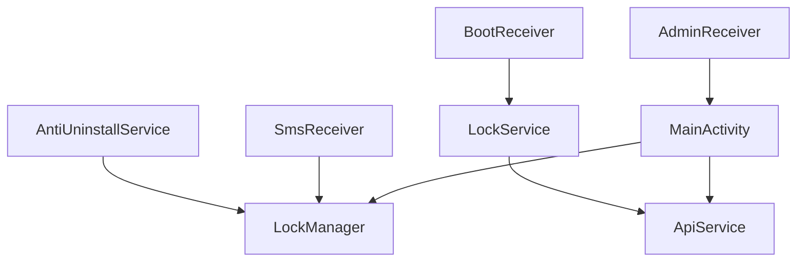

**Diagram sources**
- [MainActivity.kt:65-445](file://app/src/main/java/com/pksafe/lock/manager/MainActivity.kt#L65-L445)
- [LockManager.kt:27-406](file://app/src/main/java/com/pksafe/lock/manager/util/LockManager.kt#L27-L406)
- [ApiService.kt:11-185](file://app/src/main/java/com/pksafe/lock/manager/data/ApiService.kt#L11-L185)
- [SmsReceiver.kt:29-164](file://app/src/main/java/com/pksafe/lock/manager/receiver/SmsReceiver.kt#L29-L164)
- [LockService.kt:41-330](file://app/src/main/java/com/pksafe/lock/manager/service/LockService.kt#L41-L330)
- [AntiUninstallService.kt:22-224](file://app/src/main/java/com/pksafe/lock/manager/service/AntiUninstallService.kt#L22-L224)
- [AdminReceiver.kt:14-104](file://app/src/main/java/com/pksafe/lock/manager/receiver/AdminReceiver.kt#L14-L104)
- [BootReceiver.kt:10-27](file://app/src/main/java/com/pksafe/lock/manager/receiver/BootReceiver.kt#L10-L27)

**Section sources**
- [MainActivity.kt:65-445](file://app/src/main/java/com/pksafe/lock/manager/MainActivity.kt#L65-L445)
- [LockManager.kt:27-406](file://app/src/main/java/com/pksafe/lock/manager/util/LockManager.kt#L27-L406)
- [ApiService.kt:11-185](file://app/src/main/java/com/pksafe/lock/manager/data/ApiService.kt#L11-L185)
- [SmsReceiver.kt:29-164](file://app/src/main/java/com/pksafe/lock/manager/receiver/SmsReceiver.kt#L29-L164)
- [LockService.kt:41-330](file://app/src/main/java/com/pksafe/lock/manager/service/LockService.kt#L41-L330)
- [AntiUninstallService.kt:22-224](file://app/src/main/java/com/pksafe/lock/manager/service/AntiUninstallService.kt#L22-L224)
- [AdminReceiver.kt:14-104](file://app/src/main/java/com/pksafe/lock/manager/receiver/AdminReceiver.kt#L14-L104)
- [BootReceiver.kt:10-27](file://app/src/main/java/com/pksafe/lock/manager/receiver/BootReceiver.kt#L10-L27)

## Performance Considerations
- Use coroutines with Dispatchers.IO for network calls to avoid blocking the main thread (see MainActivity and LockService network calls).
- Minimize SharedPreferences writes by batching updates where possible; current implementation applies edits immediately which is acceptable for small datasets.
- Avoid excessive polling; MainActivity uses LaunchedEffect and periodic WorkManager for location sync rather than tight loops.
- Foreground service (LockService) ensures persistence without heavy CPU usage; overlay rendering should be lightweight.
- Accessibility monitoring in AntiUninstallService processes events efficiently; ensure text extraction is bounded to prevent performance issues.
- Reuse Retrofit instances or centralize configuration to reduce overhead; currently created per call but can be optimized further.

[No sources needed since this section provides general guidance]

## Troubleshooting Guide
- If lock/unlock does not trigger:
  - Verify SharedPreferences keys is_customer and is_locked are set correctly.
  - Ensure Device Admin and Overlay permissions are granted.
  - Check LockManager logs for DPM errors during restriction application.
- If SMS commands fail:
  - Confirm SMS codes are present in SharedPreferences or generated correctly from IMEI(s).
  - Validate message format (LOCK#code or UNLOCK#code) and case sensitivity.
- If LockService does not start after reboot:
  - Ensure BootReceiver is registered and conditions (admin active, overlay permission) are met.
  - Check foreground service start requirements on newer Android versions.
- If overlay keyboard input fails:
  - Verify window flags include NOT_TOUCH_MODAL to allow keyboard interaction.
- If auto-lock does not trigger on connectivity loss:
  - Confirm auto_lock_enabled flag and connectivity monitoring in LockService and AntiUninstallService.

**Section sources**
- [LockManager.kt:111-148](file://app/src/main/java/com/pksafe/lock/manager/util/LockManager.kt#L111-L148)
- [SmsReceiver.kt:44-143](file://app/src/main/java/com/pksafe/lock/manager/receiver/SmsReceiver.kt#L44-L143)
- [BootReceiver.kt:11-24](file://app/src/main/java/com/pksafe/lock/manager/receiver/BootReceiver.kt#L11-L24)
- [LockService.kt:125-168](file://app/src/main/java/com/pksafe/lock/manager/service/LockService.kt#L125-L168)
- [AntiUninstallService.kt:88-110](file://app/src/main/java/com/pksafe/lock/manager/service/AntiUninstallService.kt#L88-L110)

## Conclusion
PK Locker employs a robust, event-driven architecture centered on SharedPreferences state, broadcast receivers, and coroutines for asynchronous operations. MainActivity acts as the orchestrator, coordinating device control via LockManager, network operations through ApiService, and persistent enforcement via background services. The design supports offline capabilities through SmsReceiver and ensures reliability with boot-time recovery and accessibility-based guards. Proper permission handling, foreground services, and careful coroutine usage contribute to performance and stability.

[No sources needed since this section summarizes without analyzing specific files]