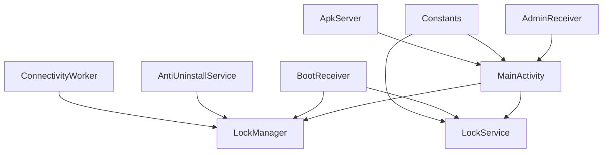
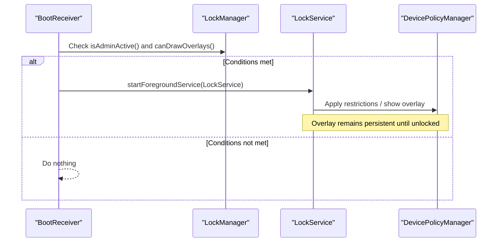
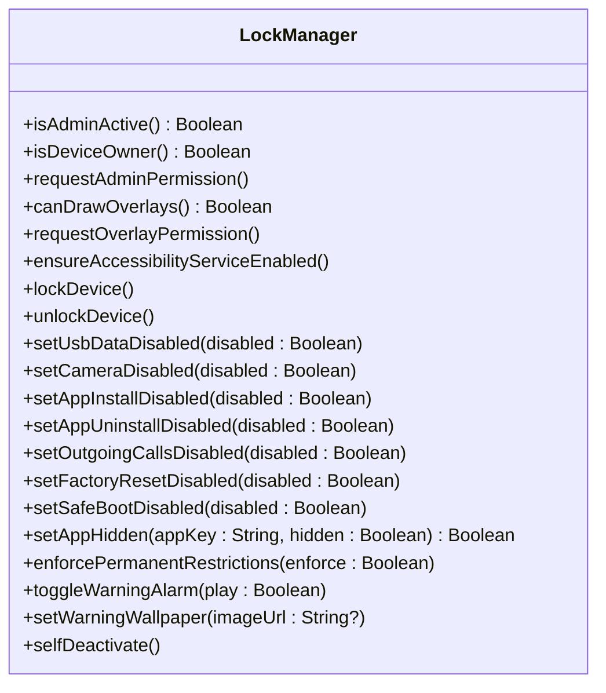
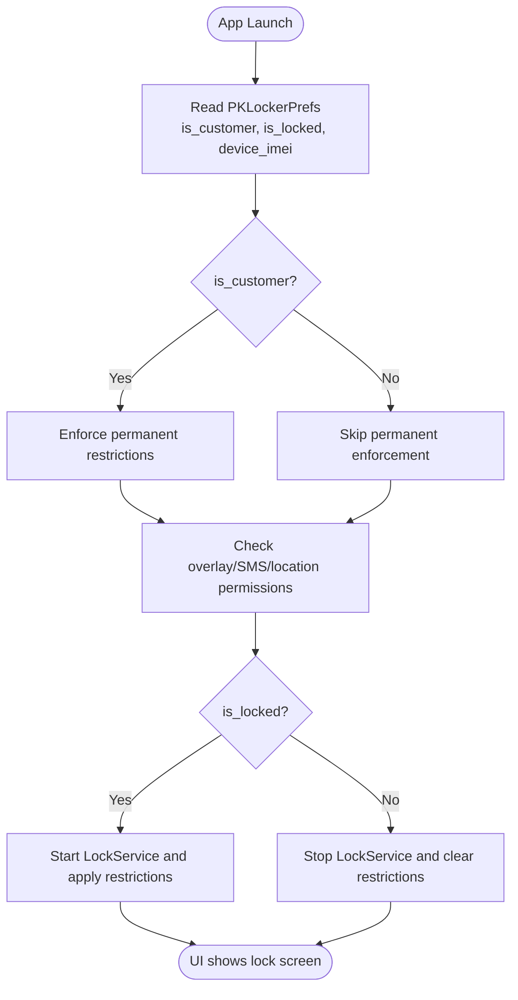
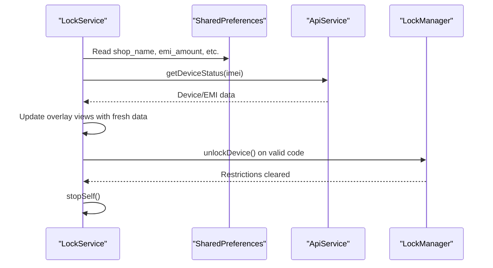
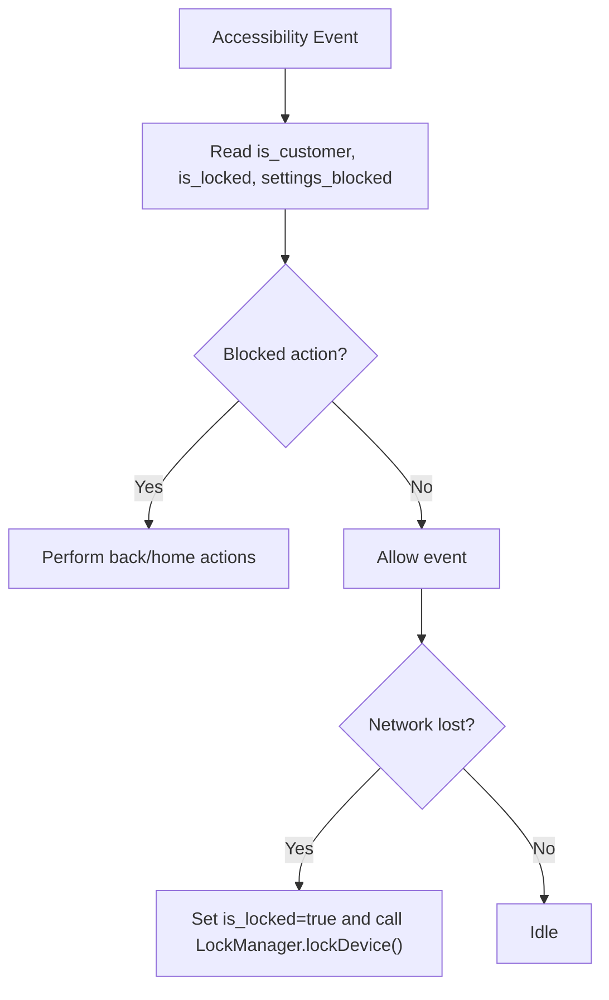
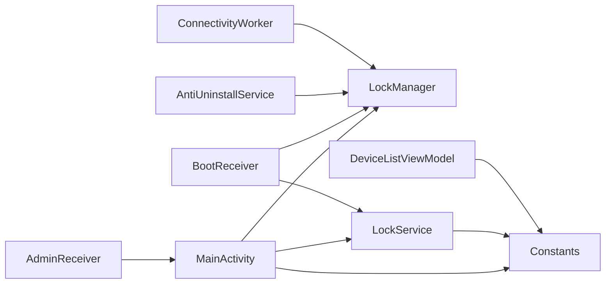

# Dependency Injection and Singleton Patterns

<cite>
**Referenced Files in This Document**
- [LockManager.kt](file://app/src/main/java/com/pksafe/lock/manager/util/LockManager.kt)
- [MainActivity.kt](file://app/src/main/java/com/pksafe/lock/manager/MainActivity.kt)
- [LockService.kt](file://app/src/main/java/com/pksafe/lock/manager/service/LockService.kt)
- [AdminReceiver.kt](file://app/src/main/java/com/pksafe/lock/manager/receiver/AdminReceiver.kt)
- [BootReceiver.kt](file://app/src/main/java/com/pksafe/lock/manager/receiver/BootReceiver.kt)
- [AntiUninstallService.kt](file://app/src/main/java/com/pksafe/lock/manager/service/AntiUninstallService.kt)
- [ConnectivityWorker.kt](file://app/src/main/java/com/pksafe/lock/manager/service/ConnectivityWorker.kt)
- [ApkServer.kt](file://app/src/main/java/com/pksafe/lock/manager/util/ApkServer.kt)
- [Constants.kt](file://app/src/main/java/com/pksafe/lock/manager/util/Constants.kt)
- [DeviceListViewModel.kt](file://app/src/main/java/com/pksafe/lock/manager/ui/devices/DeviceListViewModel.kt)
</cite>

## Table of Contents
1. Introduction
2. Project Structure
3. Core Components
4. Architecture Overview
5. Detailed Component Analysis
6. Dependency Analysis
7. Performance Considerations
8. Troubleshooting Guide
9. Conclusion

## Introduction
This document explains PK Locker’s dependency injection patterns and singleton-like implementations with a focus on LockManager as the central orchestrator for device control operations. It covers context-based initialization, service discovery mechanisms, how components obtain references to shared resources, and the benefits of using singletons for consistent device state, Android system service connections, and cross-component coordination. It also provides guidance on proper component initialization, lifecycle management, and resource cleanup strategies.

## Project Structure
PK Locker organizes its core logic around:
- A central device control coordinator (LockManager) that encapsulates Device Policy Manager interactions and enforces restrictions.
- UI entry points (MainActivity) that initialize guards, permissions, and orchestrate lock/unlock flows.
- Background services and receivers (LockService, AntiUninstallService, BootReceiver, ConnectivityWorker) that react to system events and maintain persistent enforcement.
- Utility and configuration modules (Constants, ApkServer) providing shared configuration and lightweight server capabilities.

**Diagram sources**
- [MainActivity.kt:127-445](file://app/src/main/java/com/pksafe/lock/manager/MainActivity.kt#L127-L445)
- [LockManager.kt:27-405](file://app/src/main/java/com/pksafe/lock/manager/util/LockManager.kt#L27-L405)
- [LockService.kt:41-330](file://app/src/main/java/com/pksafe/lock/manager/service/LockService.kt#L41-L330)
- [BootReceiver.kt:10-26](file://app/src/main/java/com/pksafe/lock/manager/receiver/BootReceiver.kt#L10-L26)
- [AdminReceiver.kt:14-104](file://app/src/main/java/com/pksafe/lock/manager/receiver/AdminReceiver.kt#L14-L104)
- [AntiUninstallService.kt:22-224](file://app/src/main/java/com/pksafe/lock/manager/service/AntiUninstallService.kt#L22-L224)
- [ConnectivityWorker.kt:15-31](file://app/src/main/java/com/pksafe/lock/manager/service/ConnectivityWorker.kt#L15-L31)
- [Constants.kt:1-10](file://app/src/main/java/com/pksafe/lock/manager/util/Constants.kt#L1-L10)
- [ApkServer.kt:14-95](file://app/src/main/java/com/pksafe/lock/manager/util/ApkServer.kt#L14-L95)

**Section sources**
- [MainActivity.kt:127-445](file://app/src/main/java/com/pksafe/lock/manager/MainActivity.kt#L127-L445)
- [LockManager.kt:27-405](file://app/src/main/java/com/pksafe/lock/manager/util/LockManager.kt#L27-L405)
- [LockService.kt:41-330](file://app/src/main/java/com/pksafe/lock/manager/service/LockService.kt#L41-L330)
- [BootReceiver.kt:10-26](file://app/src/main/java/com/pksafe/lock/manager/receiver/BootReceiver.kt#L10-L26)
- [AdminReceiver.kt:14-104](file://app/src/main/java/com/pksafe/lock/manager/receiver/AdminReceiver.kt#L14-L104)
- [AntiUninstallService.kt:22-224](file://app/src/main/java/com/pksafe/lock/manager/service/AntiUninstallService.kt#L22-L224)
- [ConnectivityWorker.kt:15-31](file://app/src/main/java/com/pksafe/lock/manager/service/ConnectivityWorker.kt#L15-L31)
- [Constants.kt:1-10](file://app/src/main/java/com/pksafe/lock/manager/util/Constants.kt#L1-L10)
- [ApkServer.kt:14-95](file://app/src/main/java/com/pksafe/lock/manager/util/ApkServer.kt#L14-L95)

## Core Components
- LockManager: Central orchestrator for device policy operations, permission checks, and enforcing restrictions. It holds references to DevicePolicyManager and coordinates actions like locking, unlocking, app hiding, and permanent restriction enforcement.
- MainActivity: Entry point that initializes UI, manages permissions, triggers lock/unlock based on state, and ensures permanent security enforcement for customer devices.
- LockService: Foreground service that renders an overlay lock screen, handles unlock codes, and refreshes live EMI data from the server.
- AntiUninstallService: Accessibility-based guard that blocks restricted actions and can trigger auto-lock on connectivity loss.
- BootReceiver: Restores lock enforcement after boot by starting LockService when conditions are met.
- ConnectivityWorker: Periodic worker that syncs device status and can enforce locks if offline beyond a threshold.
- AdminReceiver: Handles provisioning completion and grants critical permissions to self when acting as Device Owner; captures IMEI and marks provisioning complete.
- ApkServer: Singleton-like HTTP server used during QR provisioning to serve the APK locally.
- Constants: Shared configuration object for base URLs and endpoints.

Benefits of these patterns:
- Consistent device state: LockManager centralizes policy changes so all components see the same enforced state.
- Reliable system service connections: Single access points to DevicePolicyManager reduce duplication and risk of inconsistent calls.
- Cross-component coordination: Services and receivers coordinate via LockManager and shared preferences, ensuring synchronized behavior across background and foreground contexts.

**Section sources**
- [LockManager.kt:27-405](file://app/src/main/java/com/pksafe/lock/manager/util/LockManager.kt#L27-L405)
- [MainActivity.kt:127-445](file://app/src/main/java/com/pksafe/lock/manager/MainActivity.kt#L127-L445)
- [LockService.kt:41-330](file://app/src/main/java/com/pksafe/lock/manager/service/LockService.kt#L41-L330)
- [AntiUninstallService.kt:22-224](file://app/src/main/java/com/pksafe/lock/manager/service/AntiUninstallService.kt#L22-L224)
- [BootReceiver.kt:10-26](file://app/src/main/java/com/pksafe/lock/manager/receiver/BootReceiver.kt#L10-L26)
- [ConnectivityWorker.kt:15-31](file://app/src/main/java/com/pksafe/lock/manager/service/ConnectivityWorker.kt#L15-L31)
- [AdminReceiver.kt:14-104](file://app/src/main/java/com/pksafe/lock/manager/receiver/AdminReceiver.kt#L14-L104)
- [ApkServer.kt:14-95](file://app/src/main/java/com/pksafe/lock/manager/util/ApkServer.kt#L14-L95)
- [Constants.kt:1-10](file://app/src/main/java/com/pksafe/lock/manager/util/Constants.kt#L1-L10)

## Architecture Overview
The architecture uses a hybrid approach combining:
- Context-based initialization: Components receive Context and resolve services or settings at runtime (e.g., DevicePolicyManager).
- Singleton-like patterns: Certain utilities expose static instance management (e.g., ApkServer) to ensure a single running instance.
- Service discovery via Android framework: Receivers and services register for system events and use Android APIs to discover and interact with system services.
- Shared state via SharedPreferences: Components read/write common flags (e.g., is_customer, is_locked, device_imei) to coordinate behavior across processes and lifecycles.

**Diagram sources**
- [BootReceiver.kt:10-26](file://app/src/main/java/com/pksafe/lock/manager/receiver/BootReceiver.kt#L10-L26)
- [LockManager.kt:46-73](file://app/src/main/java/com/pksafe/lock/manager/util/LockManager.kt#L46-L73)
- [LockService.kt:50-80](file://app/src/main/java/com/pksafe/lock/manager/service/LockService.kt#L50-L80)

**Section sources**
- [BootReceiver.kt:10-26](file://app/src/main/java/com/pksafe/lock/manager/receiver/BootReceiver.kt#L10-L26)
- [LockManager.kt:46-73](file://app/src/main/java/com/pksafe/lock/manager/util/LockManager.kt#L46-L73)
- [LockService.kt:50-80](file://app/src/main/java/com/pksafe/lock/manager/service/LockService.kt#L50-L80)

## Detailed Component Analysis

### LockManager: Central Orchestrator
LockManager encapsulates device policy operations and acts as the single source of truth for enforcing restrictions. It:
- Checks admin/device owner status and requests necessary permissions.
- Starts/stops LockService and applies hardware restrictions via DevicePolicyManager.
- Provides granular controls (USB, camera, app install/uninstall, outgoing calls, factory reset, safe boot).
- Enforces permanent restrictions for customer devices even when unlocked.
- Supports app hiding via setApplicationHidden for known packages.
- Manages alarm toggling and wallpaper updates for warnings.
- Implements self-deactivation to remove privileges and clear state.

**Diagram sources**
- [LockManager.kt:27-405](file://app/src/main/java/com/pksafe/lock/manager/util/LockManager.kt#L27-L405)

**Section sources**
- [LockManager.kt:27-405](file://app/src/main/java/com/pksafe/lock/manager/util/LockManager.kt#L27-L405)

### MainActivity: Context-Based Initialization and Orchestration
MainActivity initializes the UI and orchestrates:
- Permission checks and dialogs for overlays, SMS, and location.
- Permanent security enforcement for customer devices.
- Triggering lock/unlock based on shared preferences.
- Scheduling background tasks (location sync, update checks).
- FCM token synchronization with the server.

**Diagram sources**
- [MainActivity.kt:127-445](file://app/src/main/java/com/pksafe/lock/manager/MainActivity.kt#L127-L445)

**Section sources**
- [MainActivity.kt:127-445](file://app/src/main/java/com/pksafe/lock/manager/MainActivity.kt#L127-L445)

### LockService: Persistent Enforcement and Live Data Refresh
LockService:
- Runs as a foreground service with a persistent notification.
- Renders an overlay lock view and blocks navigation keys.
- Validates unlock codes and triggers unlock via LockManager.
- Fetches fresh EMI data from the server and updates the overlay UI.
- Registers connectivity listeners to support auto-lock on network loss.

**Diagram sources**
- [LockService.kt:50-330](file://app/src/main/java/com/pksafe/lock/manager/service/LockService.kt#L50-L330)
- [LockManager.kt:136-148](file://app/src/main/java/com/pksafe/lock/manager/util/LockManager.kt#L136-L148)

**Section sources**
- [LockService.kt:50-330](file://app/src/main/java/com/pksafe/lock/manager/service/LockService.kt#L50-L330)
- [LockManager.kt:136-148](file://app/src/main/java/com/pksafe/lock/manager/util/LockManager.kt#L136-L148)

### AntiUninstallService: Guard and Auto-Lock Trigger
AntiUninstallService:
- Monitors accessibility events to block restricted actions and navigate away from settings when needed.
- Detects connectivity changes and triggers auto-lock if configured and device is customer-owned.
- Uses LockManager to enforce lock actions and reads shared preferences for state.

**Diagram sources**
- [AntiUninstallService.kt:82-224](file://app/src/main/java/com/pksafe/lock/manager/service/AntiUninstallService.kt#L82-L224)
- [LockManager.kt:111-134](file://app/src/main/java/com/pksafe/lock/manager/util/LockManager.kt#L111-L134)

**Section sources**
- [AntiUninstallService.kt:82-224](file://app/src/main/java/com/pksafe/lock/manager/service/AntiUninstallService.kt#L82-L224)
- [LockManager.kt:111-134](file://app/src/main/java/com/pksafe/lock/manager/util/LockManager.kt#L111-L134)

### BootReceiver: Post-Boot Restoration
BootReceiver:
- Listens for BOOT_COMPLETED and starts LockService if admin active and overlay permission granted.
- Ensures enforcement resumes after reboot without user interaction.

**Section sources**
- [BootReceiver.kt:10-26](file://app/src/main/java/com/pksafe/lock/manager/receiver/BootReceiver.kt#L10-L26)

### AdminReceiver: Provisioning and Permission Granting
AdminReceiver:
- On provisioning complete, grants critical permissions to self when acting as Device Owner.
- Captures IMEI and marks provisioning complete, then launches the app to finalize setup.

**Section sources**
- [AdminReceiver.kt:14-104](file://app/src/main/java/com/pksafe/lock/manager/receiver/AdminReceiver.kt#L14-L104)

### ConnectivityWorker: Background Sync and Enforcement
ConnectivityWorker:
- Reads shared preferences to determine if device is a customer and has IMEI.
- Performs periodic sync and can enforce locks if offline beyond a threshold.

**Section sources**
- [ConnectivityWorker.kt:15-31](file://app/src/main/java/com/pksafe/lock/manager/service/ConnectivityWorker.kt#L15-L31)

### ApkServer: Singleton-Like Local Server
ApkServer:
- Exposes static start/stop methods to manage a single running instance.
- Serves the current APK file for QR provisioning flow.

**Section sources**
- [ApkServer.kt:14-95](file://app/src/main/java/com/pksafe/lock/manager/util/ApkServer.kt#L14-L95)

### Constants: Shared Configuration
Constants:
- Holds base URL and other shared configuration values used across components.

**Section sources**
- [Constants.kt:1-10](file://app/src/main/java/com/pksafe/lock/manager/util/Constants.kt#L1-L10)

### DeviceListViewModel: ViewModel with Scoped Dependencies
DeviceListViewModel:
- Creates Retrofit instances scoped to the ViewModel lifetime.
- Uses shared preferences for authentication tokens and performs device control operations via ApiService.

**Section sources**
- [DeviceListViewModel.kt:18-245](file://app/src/main/java/com/pksafe/lock/manager/ui/devices/DeviceListViewModel.kt#L18-L245)

## Dependency Analysis
Components depend on:
- Android system services (DevicePolicyManager, WindowManager, NotificationManager, TelephonyManager).
- Shared preferences for state persistence and cross-process communication.
- Network APIs via Retrofit for device status and control commands.
- LockManager as a central dependency for device control operations.

**Diagram sources**
- [MainActivity.kt:127-445](file://app/src/main/java/com/pksafe/lock/manager/MainActivity.kt#L127-L445)
- [LockManager.kt:27-405](file://app/src/main/java/com/pksafe/lock/manager/util/LockManager.kt#L27-L405)
- [LockService.kt:41-330](file://app/src/main/java/com/pksafe/lock/manager/service/LockService.kt#L41-L330)
- [BootReceiver.kt:10-26](file://app/src/main/java/com/pksafe/lock/manager/receiver/BootReceiver.kt#L10-L26)
- [AntiUninstallService.kt:22-224](file://app/src/main/java/com/pksafe/lock/manager/service/AntiUninstallService.kt#L22-L224)
- [ConnectivityWorker.kt:15-31](file://app/src/main/java/com/pksafe/lock/manager/service/ConnectivityWorker.kt#L15-L31)
- [AdminReceiver.kt:14-104](file://app/src/main/java/com/pksafe/lock/manager/receiver/AdminReceiver.kt#L14-L104)
- [Constants.kt:1-10](file://app/src/main/java/com/pksafe/lock/manager/util/Constants.kt#L1-L10)
- [DeviceListViewModel.kt:18-245](file://app/src/main/java/com/pksafe/lock/manager/ui/devices/DeviceListViewModel.kt#L18-L245)

**Section sources**
- [MainActivity.kt:127-445](file://app/src/main/java/com/pksafe/lock/manager/MainActivity.kt#L127-L445)
- [LockManager.kt:27-405](file://app/src/main/java/com/pksafe/lock/manager/util/LockManager.kt#L27-L405)
- [LockService.kt:41-330](file://app/src/main/java/com/pksafe/lock/manager/service/LockService.kt#L41-L330)
- [BootReceiver.kt:10-26](file://app/src/main/java/com/pksafe/lock/manager/receiver/BootReceiver.kt#L10-L26)
- [AntiUninstallService.kt:22-224](file://app/src/main/java/com/pksafe/lock/manager/service/AntiUninstallService.kt#L22-L224)
- [ConnectivityWorker.kt:15-31](file://app/src/main/java/com/pksafe/lock/manager/service/ConnectivityWorker.kt#L15-L31)
- [AdminReceiver.kt:14-104](file://app/src/main/java/com/pksafe/lock/manager/receiver/AdminReceiver.kt#L14-L104)
- [Constants.kt:1-10](file://app/src/main/java/com/pksafe/lock/manager/util/Constants.kt#L1-L10)
- [DeviceListViewModel.kt:18-245](file://app/src/main/java/com/pksafe/lock/manager/ui/devices/DeviceListViewModel.kt#L18-L245)

## Performance Considerations
- Avoid creating heavy objects repeatedly: Prefer reusing Retrofit instances where possible and scope them appropriately (as seen in DeviceListViewModel).
- Use background threads for network and I/O operations to keep UI responsive (LockService uses coroutines for API calls).
- Minimize overlay redraws: Update UI only when necessary and post UI updates on the main thread.
- Be cautious with frequent polling: Connectivity checks and preference reads should be throttled or event-driven where possible.
- Ensure proper resource cleanup: Unregister receivers and remove views in onDestroy to prevent leaks.

[No sources needed since this section provides general guidance]

## Troubleshooting Guide
Common issues and resolutions:
- Admin/Device Owner not active: Ensure Device Policy Manager permissions are granted and check AdminReceiver provisioning flow.
- Overlay permission missing: Prompt users to grant “Display over other apps” and verify via Settings.canDrawOverlays().
- Accessibility service disabled: Use LockManager.ensureAccessibilityServiceEnabled() and guide users to enable it in Settings.
- Auto-lock not triggering: Verify connectivity receiver registration and auto_lock_enabled flag; confirm AntiUninstallService is running.
- LockService not starting on boot: Confirm BootReceiver is registered and conditions (admin active, overlay permission) are met.
- Permanent restrictions not applied: Ensure is_customer and device owner status are set; call enforcePermanentRestrictions(true) in MainActivity startup.

**Section sources**
- [LockManager.kt:46-108](file://app/src/main/java/com/pksafe/lock/manager/util/LockManager.kt#L46-L108)
- [MainActivity.kt:158-168](file://app/src/main/java/com/pksafe/lock/manager/MainActivity.kt#L158-L168)
- [AntiUninstallService.kt:82-117](file://app/src/main/java/com/pksafe/lock/manager/service/AntiUninstallService.kt#L82-L117)
- [BootReceiver.kt:10-26](file://app/src/main/java/com/pksafe/lock/manager/receiver/BootReceiver.kt#L10-L26)

## Conclusion
PK Locker employs a pragmatic mix of context-based initialization and singleton-like patterns to achieve robust device control and enforcement. LockManager serves as the central orchestrator, coordinating system services, background components, and UI flows while maintaining consistent device state through shared preferences and Android APIs. This design enables reliable cross-component communication, resilient enforcement across lifecycle events, and scalable management of device policies. Proper initialization, lifecycle-aware resource management, and careful cleanup ensure stability and performance in production environments.

[No sources needed since this section summarizes without analyzing specific files]