# Event-Driven Architecture and State Management

<cite>
**Referenced Files in This Document**
- [LockManager.kt](file://app/src/main/java/com/pksafe/lock/manager/util/LockManager.kt)
- [SmsReceiver.kt](file://app/src/main/java/com/pksafe/lock/manager/receiver/SmsReceiver.kt)
- [AdminReceiver.kt](file://app/src/main/java/com/pksafe/lock/manager/receiver/AdminReceiver.kt)
- [BootReceiver.kt](file://app/src/main/java/com/pksafe/lock/manager/receiver/BootReceiver.kt)
- [SimStateReceiver.kt](file://app/src/main/java/com/pksafe/lock/manager/receiver/SimStateReceiver.kt)
- [AntiUninstallService.kt](file://app/src/main/java/com/pksafe/lock/manager/service/AntiUninstallService.kt)
- [LockService.kt](file://app/src/main/java/com/pksafe/lock/manager/service/LockService.kt)
- [MainActivity.kt](file://app/src/main/java/com/pksafe/lock/manager/MainActivity.kt)
- [ApiService.kt](file://app/src/main/java/com/pksafe/lock/manager/data/ApiService.kt)
- [Constants.kt](file://app/src/main/java/com/pksafe/lock/manager/util/Constants.kt)
- [DashboardViewModel.kt](file://app/src/main/java/com/pksafe/lock/manager/ui/dashboard/DashboardViewModel.kt)
</cite>

## Table of Contents
1. Introduction
2. Project Structure
3. Core Components
4. Architecture Overview
5. Detailed Component Analysis
6. Dependency Analysis
7. Performance Considerations
8. Troubleshooting Guide
9. Conclusion

## Introduction
This document explains PK Locker’s event-driven architecture with a focus on how SharedPreferences listeners, broadcast receivers, and coroutines coordinate system-wide state changes. It covers the observer pattern for real-time device status updates, command processing pipelines from SMS/network events to device control actions, background service coordination, and the singleton-like usage of LockManager for consistent state management across the application lifecycle. Sequence diagrams illustrate end-to-end flows from user actions through business logic to system-level operations.

## Project Structure
PK Locker is organized into clear layers:
- UI layer (Compose screens and ViewModels) observe SharedPrefs and trigger actions via LockManager and API calls.
- System integration layer includes BroadcastReceivers (SMS, Boot, SIM state, Device Admin), Services (Lock overlay, Anti-uninstall guard), and Workers for background tasks.
- Utilities provide centralized device policy enforcement and configuration constants.
- Data layer defines Retrofit APIs for server communication.

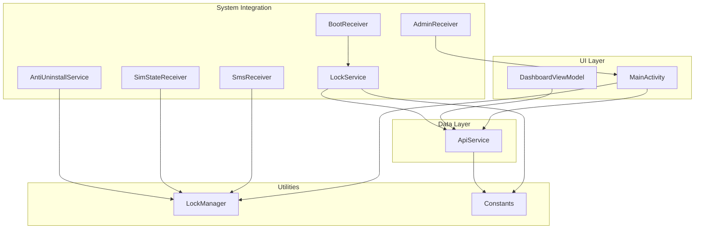

**Diagram sources**
- [MainActivity.kt:126-445](file://app/src/main/java/com/pksafe/lock/manager/MainActivity.kt#L126-L445)
- [DashboardViewModel.kt:16-66](file://app/src/main/java/com/pksafe/lock/manager/ui/dashboard/DashboardViewModel.kt#L16-L66)
- [SmsReceiver.kt:29-164](file://app/src/main/java/com/pksafe/lock/manager/receiver/SmsReceiver.kt#L29-L164)
- [BootReceiver.kt:10-27](file://app/src/main/java/com/pksafe/lock/manager/receiver/BootReceiver.kt#L10-L27)
- [SimStateReceiver.kt:18-145](file://app/src/main/java/com/pksafe/lock/manager/receiver/SimStateReceiver.kt#L18-L145)
- [AdminReceiver.kt:14-104](file://app/src/main/java/com/pksafe/lock/manager/receiver/AdminReceiver.kt#L14-L104)
- [LockService.kt:41-330](file://app/src/main/java/com/pksafe/lock/manager/service/LockService.kt#L41-L330)
- [AntiUninstallService.kt:22-224](file://app/src/main/java/com/pksafe/lock/manager/service/AntiUninstallService.kt#L22-L224)
- [LockManager.kt:27-406](file://app/src/main/java/com/pksafe/lock/manager/util/LockManager.kt#L27-L406)
- [ApiService.kt:11-185](file://app/src/main/java/com/pksafe/lock/manager/data/ApiService.kt#L11-L185)
- [Constants.kt:3-10](file://app/src/main/java/com/pksafe/lock/manager/util/Constants.kt#L3-L10)

**Section sources**
- [MainActivity.kt:126-445](file://app/src/main/java/com/pksafe/lock/manager/MainActivity.kt#L126-L445)
- [ApiService.kt:11-185](file://app/src/main/java/com/pksafe/lock/manager/data/ApiService.kt#L11-L185)
- [Constants.kt:3-10](file://app/src/main/java/com/pksafe/lock/manager/util/Constants.kt#L3-L10)

## Core Components
- LockManager: Central orchestrator for device policy enforcement, lock/unlock workflows, app hiding, alarm/wallpaper toggles, and self-deactivation. Used as a per-context instance but acts as the single source of truth for device controls.
- BroadcastReceivers:
  - SmsReceiver: Validates offline SMS commands and triggers lock/unlock via LockManager.
  - BootReceiver: Restarts LockService after boot if admin and overlay permissions are active.
  - SimStateReceiver: Detects SIM removal/change and optionally auto-locks; notifies backend.
  - AdminReceiver: On provisioning/admin enable, grants critical permissions and persists IMEI/customer flags.
- Services:
  - LockService: Foreground service that renders an overlay lock screen, enforces input blocking, refreshes EMI/shop data from server, and handles master unlock code entry.
  - AntiUninstallService: Accessibility-based guard that blocks restricted settings/actions and monitors connectivity to enforce auto-lock when configured.
- UI and ViewModel:
  - MainActivity: Observes SharedPrefs for lock state and customer mode; triggers LockManager actions; manages permissions and background sync scheduling.
  - DashboardViewModel: Fetches dashboard stats and shop info from the server using Retrofit.

**Section sources**
- [LockManager.kt:27-406](file://app/src/main/java/com/pksafe/lock/manager/util/LockManager.kt#L27-L406)
- [SmsReceiver.kt:29-164](file://app/src/main/java/com/pksafe/lock/manager/receiver/SmsReceiver.kt#L29-L164)
- [BootReceiver.kt:10-27](file://app/src/main/java/com/pksafe/lock/manager/receiver/BootReceiver.kt#L10-L27)
- [SimStateReceiver.kt:18-145](file://app/src/main/java/com/pksafe/lock/manager/receiver/SimStateReceiver.kt#L18-L145)
- [AdminReceiver.kt:14-104](file://app/src/main/java/com/pksafe/lock/manager/receiver/AdminReceiver.kt#L14-L104)
- [LockService.kt:41-330](file://app/src/main/java/com/pksafe/lock/manager/service/LockService.kt#L41-L330)
- [AntiUninstallService.kt:22-224](file://app/src/main/java/com/pksafe/lock/manager/service/AntiUninstallService.kt#L22-L224)
- [MainActivity.kt:126-445](file://app/src/main/java/com/pksafe/lock/manager/MainActivity.kt#L126-L445)
- [DashboardViewModel.kt:16-66](file://app/src/main/java/com/pksafe/lock/manager/ui/dashboard/DashboardViewModel.kt#L16-L66)

## Architecture Overview
PK Locker uses an event-driven model where system events (boot, SMS, SIM state, connectivity) and UI interactions drive state changes persisted in SharedPreferences. A central LockManager applies device policy restrictions and coordinates services. Coroutines handle network I/O and background tasks without blocking the UI.

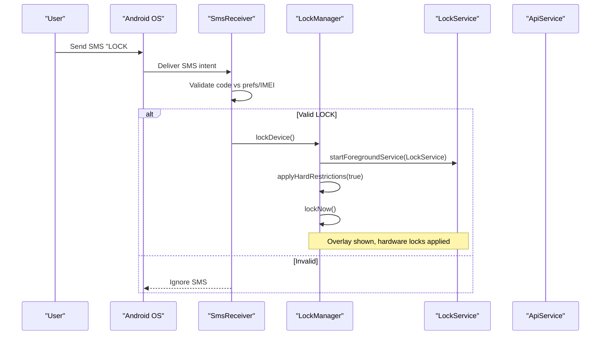

**Diagram sources**
- [SmsReceiver.kt:44-143](file://app/src/main/java/com/pksafe/lock/manager/receiver/SmsReceiver.kt#L44-L143)
- [LockManager.kt:111-148](file://app/src/main/java/com/pksafe/lock/manager/util/LockManager.kt#L111-L148)
- [LockService.kt:50-80](file://app/src/main/java/com/pksafe/lock/manager/service/LockService.kt#L50-L80)

## Detailed Component Analysis

### LockManager: Singleton-like State Orchestrator
LockManager encapsulates all device policy operations and lock/unlock workflows. While instantiated per call site, it consistently references the same DevicePolicyManager and shared preferences, acting as the authoritative controller for device state.

Key responsibilities:
- Check and request Device Admin/Owner privileges.
- Apply hard restrictions (camera, USB, factory reset, safe boot, debugging, status bar).
- Start/stop LockService overlay and lock now.
- Toggle alarms and set wallpapers.
- Self-deactivate by clearing restrictions and removing admin/owner roles.

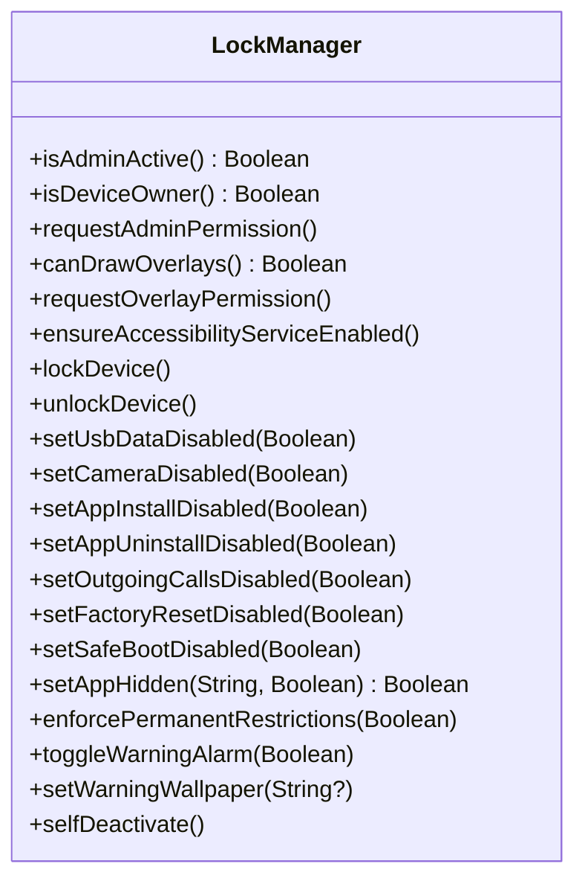

**Diagram sources**
- [LockManager.kt:27-406](file://app/src/main/java/com/pksafe/lock/manager/util/LockManager.kt#L27-L406)

**Section sources**
- [LockManager.kt:27-406](file://app/src/main/java/com/pksafe/lock/manager/util/LockManager.kt#L27-L406)

### BroadcastReceiver Pipeline: SMS to Device Control
The SMS pipeline validates incoming messages against stored or generated codes and triggers LockManager actions.

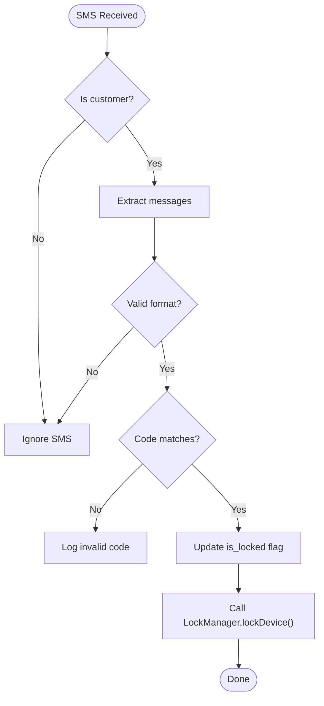

**Diagram sources**
- [SmsReceiver.kt:44-143](file://app/src/main/java/com/pksafe/lock/manager/receiver/SmsReceiver.kt#L44-L143)
- [LockManager.kt:111-148](file://app/src/main/java/com/pksafe/lock/manager/util/LockManager.kt#L111-L148)

**Section sources**
- [SmsReceiver.kt:44-143](file://app/src/main/java/com/pksafe/lock/manager/receiver/SmsReceiver.kt#L44-L143)

### Boot and Service Coordination
After reboot, BootReceiver ensures the lock overlay is restored if admin and overlay permissions are active.

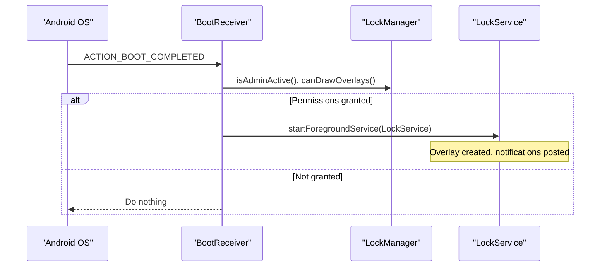

**Diagram sources**
- [BootReceiver.kt:10-27](file://app/src/main/java/com/pksafe/lock/manager/receiver/BootReceiver.kt#L10-L27)
- [LockManager.kt:46-73](file://app/src/main/java/com/pksafe/lock/manager/util/LockManager.kt#L46-L73)
- [LockService.kt:50-80](file://app/src/main/java/com/pksafe/lock/manager/service/LockService.kt#L50-L80)

**Section sources**
- [BootReceiver.kt:10-27](file://app/src/main/java/com/pksafe/lock/manager/receiver/BootReceiver.kt#L10-L27)

### SIM State Monitoring and Auto-Lock
SimStateReceiver reacts to SIM removal/change and can auto-lock based on preferences. It also notifies the backend about SIM changes.

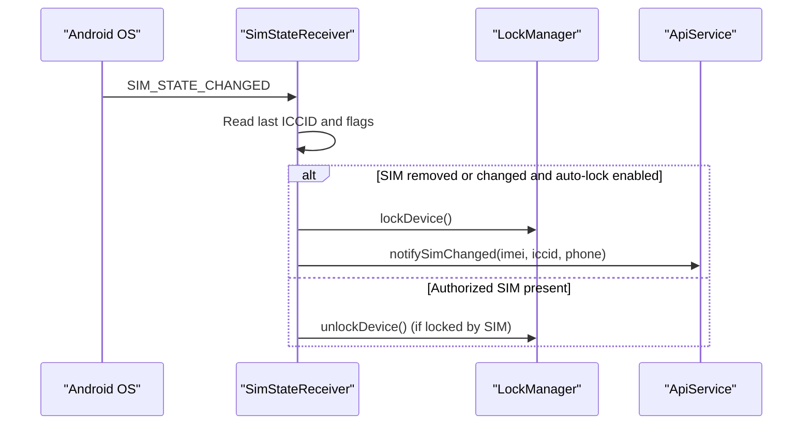

**Diagram sources**
- [SimStateReceiver.kt:18-145](file://app/src/main/java/com/pksafe/lock/manager/receiver/SimStateReceiver.kt#L18-L145)
- [LockManager.kt:111-148](file://app/src/main/java/com/pksafe/lock/manager/util/LockManager.kt#L111-L148)
- [ApiService.kt:77-81](file://app/src/main/java/com/pksafe/lock/manager/data/ApiService.kt#L77-L81)

**Section sources**
- [SimStateReceiver.kt:18-145](file://app/src/main/java/com/pksafe/lock/manager/receiver/SimStateReceiver.kt#L18-L145)

### LockService: Overlay and Live Data Refresh
LockService runs as a foreground service, displays an overlay lock screen, blocks navigation keys, and refreshes EMI/shop data from the server using coroutines.

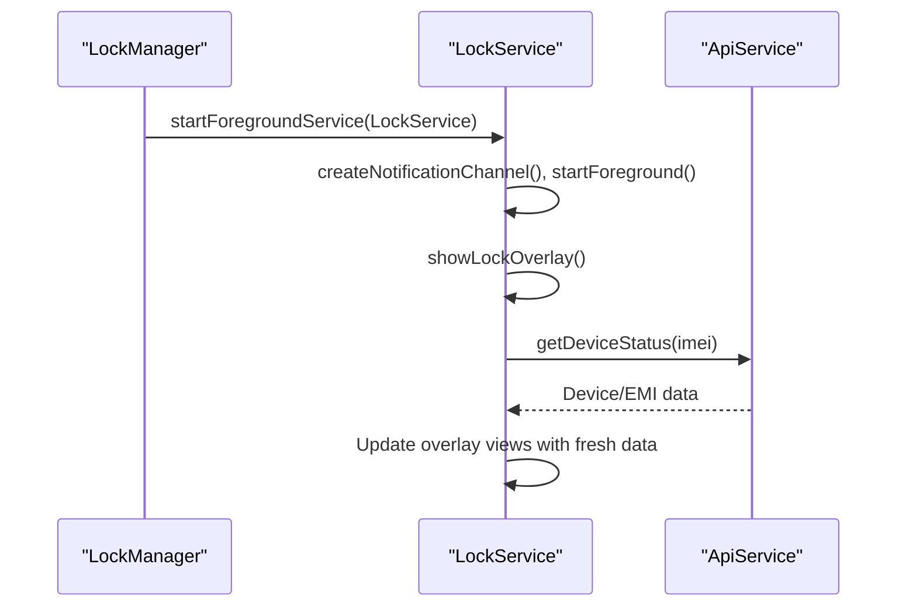

**Diagram sources**
- [LockManager.kt:111-148](file://app/src/main/java/com/pksafe/lock/manager/util/LockManager.kt#L111-L148)
- [LockService.kt:50-80](file://app/src/main/java/com/pksafe/lock/manager/service/LockService.kt#L50-L80)
- [LockService.kt:240-314](file://app/src/main/java/com/pksafe/lock/manager/service/LockService.kt#L240-L314)
- [ApiService.kt:105-109](file://app/src/main/java/com/pksafe/lock/manager/data/ApiService.kt#L105-L109)

**Section sources**
- [LockService.kt:50-80](file://app/src/main/java/com/pksafe/lock/manager/service/LockService.kt#L50-L80)
- [LockService.kt:125-234](file://app/src/main/java/com/pksafe/lock/manager/service/LockService.kt#L125-L234)
- [LockService.kt:240-314](file://app/src/main/java/com/pksafe/lock/manager/service/LockService.kt#L240-L314)

### AntiUninstallService: Accessibility Guard
AntiUninstallService intercepts accessibility events to block restricted actions and monitor connectivity for auto-lock enforcement.

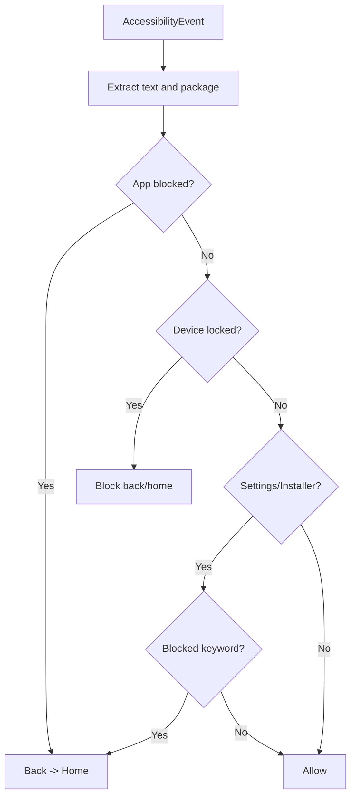

**Diagram sources**
- [AntiUninstallService.kt:136-211](file://app/src/main/java/com/pksafe/lock/manager/service/AntiUninstallService.kt#L136-L211)

**Section sources**
- [AntiUninstallService.kt:82-117](file://app/src/main/java/com/pksafe/lock/manager/service/AntiUninstallService.kt#L82-L117)
- [AntiUninstallService.kt:136-211](file://app/src/main/java/com/pksafe/lock/manager/service/AntiUninstallService.kt#L136-L211)

### SharedPreferences Observer Pattern in UI
MainActivity registers a SharedPreferences.OnSharedPreferenceChangeListener to react to state changes such as lock status, customer mode, and IMEI updates. This drives UI transitions and triggers LockManager actions.

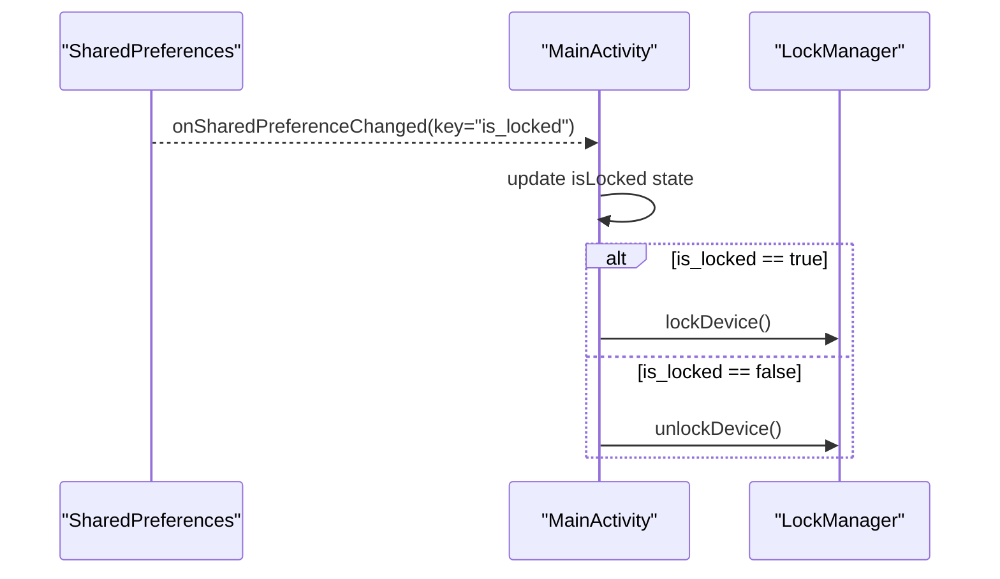

**Diagram sources**
- [MainActivity.kt:355-388](file://app/src/main/java/com/pksafe/lock/manager/MainActivity.kt#L355-L388)
- [LockManager.kt:111-148](file://app/src/main/java/com/pksafe/lock/manager/util/LockManager.kt#L111-L148)

**Section sources**
- [MainActivity.kt:355-388](file://app/src/main/java/com/pksafe/lock/manager/MainActivity.kt#L355-L388)

### Command Processing Pipelines: Network to Device Controls
Shopkeeper actions in the UI flow through ViewModels to the server, which then instructs devices to change state. Devices respond by updating local state and enforcing policies via LockManager.

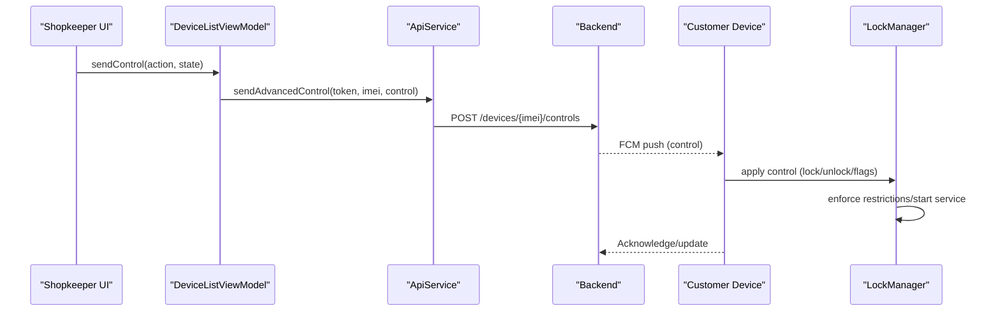

**Diagram sources**
- [DashboardViewModel.kt:16-66](file://app/src/main/java/com/pksafe/lock/manager/ui/dashboard/DashboardViewModel.kt#L16-L66)
- [ApiService.kt:58-63](file://app/src/main/java/com/pksafe/lock/manager/data/ApiService.kt#L58-L63)
- [LockManager.kt:111-148](file://app/src/main/java/com/pksafe/lock/manager/util/LockManager.kt#L111-L148)

**Section sources**
- [ApiService.kt:58-63](file://app/src/main/java/com/pksafe/lock/manager/data/ApiService.kt#L58-L63)

## Dependency Analysis
- LockManager depends on DevicePolicyManager and Context; used by receivers and UI to enforce policies.
- Receivers depend on LockManager and sometimes ApiService for notifications.
- LockService depends on WindowManager, NotificationManager, and ApiService for live data refresh.
- AntiUninstallService depends on AccessibilityService and Connectivity checks.
- MainActivity observes SharedPrefs and coordinates LockManager and API calls.

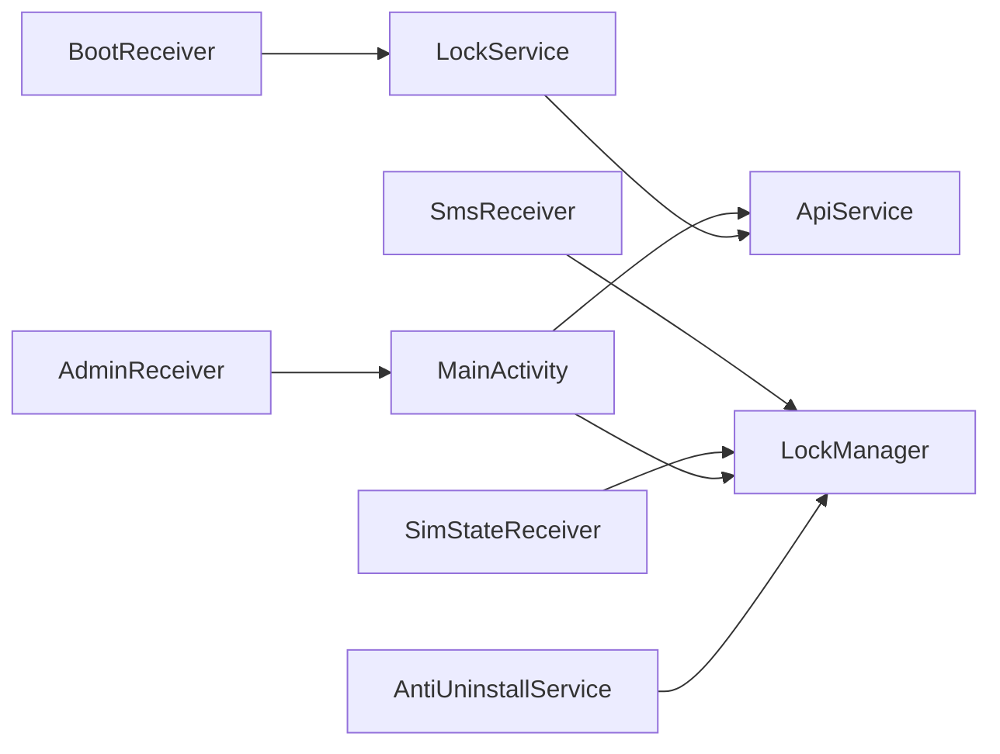

**Diagram sources**
- [SmsReceiver.kt:44-143](file://app/src/main/java/com/pksafe/lock/manager/receiver/SmsReceiver.kt#L44-L143)
- [BootReceiver.kt:10-27](file://app/src/main/java/com/pksafe/lock/manager/receiver/BootReceiver.kt#L10-L27)
- [SimStateReceiver.kt:18-145](file://app/src/main/java/com/pksafe/lock/manager/receiver/SimStateReceiver.kt#L18-L145)
- [AdminReceiver.kt:14-104](file://app/src/main/java/com/pksafe/lock/manager/receiver/AdminReceiver.kt#L14-L104)
- [MainActivity.kt:126-445](file://app/src/main/java/com/pksafe/lock/manager/MainActivity.kt#L126-L445)
- [LockService.kt:50-80](file://app/src/main/java/com/pksafe/lock/manager/service/LockService.kt#L50-L80)
- [AntiUninstallService.kt:82-117](file://app/src/main/java/com/pksafe/lock/manager/service/AntiUninstallService.kt#L82-L117)

**Section sources**
- [LockManager.kt:27-406](file://app/src/main/java/com/pksafe/lock/manager/util/LockManager.kt#L27-L406)
- [ApiService.kt:11-185](file://app/src/main/java/com/pksafe/lock/manager/data/ApiService.kt#L11-L185)

## Performance Considerations
- Use coroutines for network calls to avoid blocking UI threads (e.g., LockService data refresh, DashboardViewModel stats fetch).
- Keep foreground service minimal and efficient; only render overlay and post lightweight notifications.
- Avoid excessive polling; use SharedPreferences listeners and system broadcasts to react to changes.
- Cache frequently accessed values in SharedPrefs to reduce network requests.
- Ensure background workers run within constraints to minimize battery impact.

[No sources needed since this section provides general guidance]

## Troubleshooting Guide
Common issues and resolutions:
- SMS not locking: Verify customer flag and IMEI presence; ensure valid codes exist in prefs or can be generated from IMEI.
- Overlay not showing: Confirm overlay permission and that LockService is started; check BootReceiver behavior after reboot.
- SIM auto-lock not working: Ensure auto_lock_sim_change_enabled is true and IMEI is recorded; verify SimStateReceiver logs.
- Restrictions not applied: Confirm Device Admin/Owner privileges; check LockManager.applyHardRestrictions and related flags.
- Backend sync failures: Validate BASE_URL and token handling; check ApiService endpoints and error logs.

**Section sources**
- [SmsReceiver.kt:44-143](file://app/src/main/java/com/pksafe/lock/manager/receiver/SmsReceiver.kt#L44-L143)
- [LockService.kt:50-80](file://app/src/main/java/com/pksafe/lock/manager/service/LockService.kt#L50-L80)
- [SimStateReceiver.kt:18-145](file://app/src/main/java/com/pksafe/lock/manager/receiver/SimStateReceiver.kt#L18-L145)
- [LockManager.kt:151-200](file://app/src/main/java/com/pksafe/lock/manager/util/LockManager.kt#L151-L200)
- [Constants.kt:3-10](file://app/src/main/java/com/pksafe/lock/manager/util/Constants.kt#L3-L10)

## Conclusion
PK Locker’s event-driven architecture leverages SharedPreferences observers, broadcast receivers, and coroutines to maintain consistent device state across the lifecycle. LockManager serves as the central coordinator for policy enforcement and service orchestration. The combination of offline SMS validation, SIM monitoring, boot recovery, and overlay enforcement ensures robust security and compliance even under constrained conditions.

[No sources needed since this section summarizes without analyzing specific files]