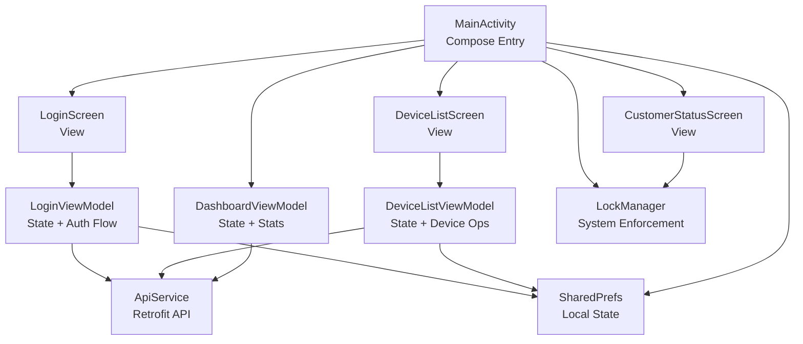
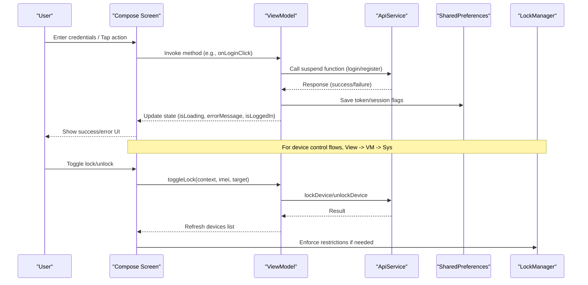
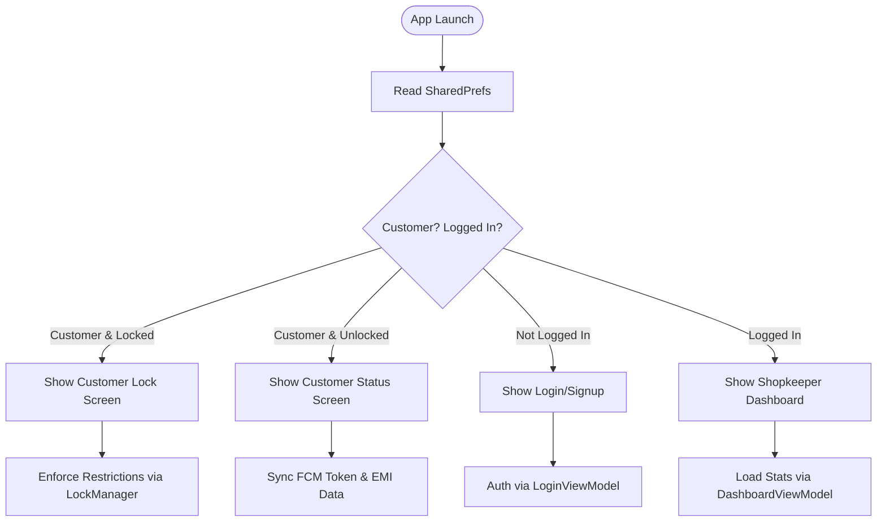
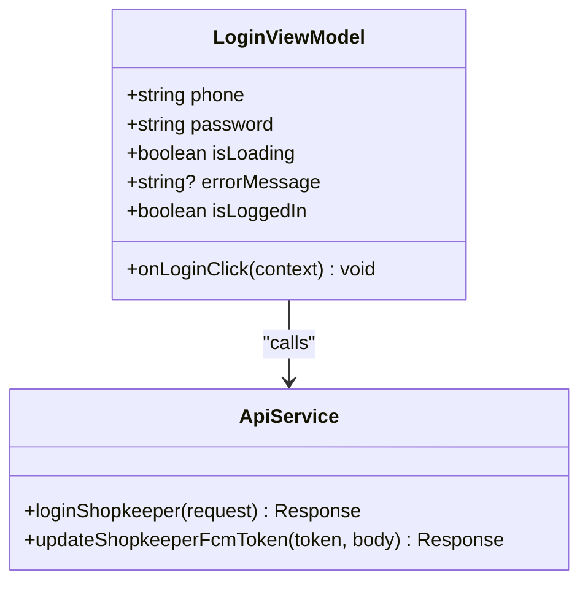
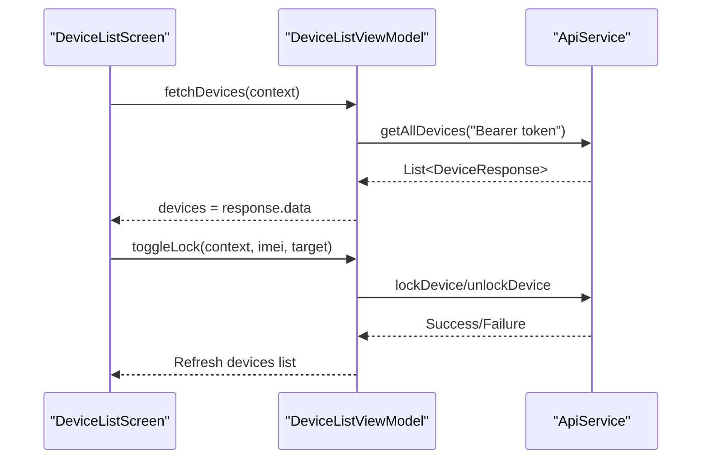
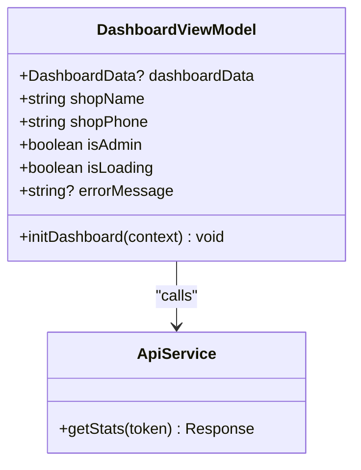
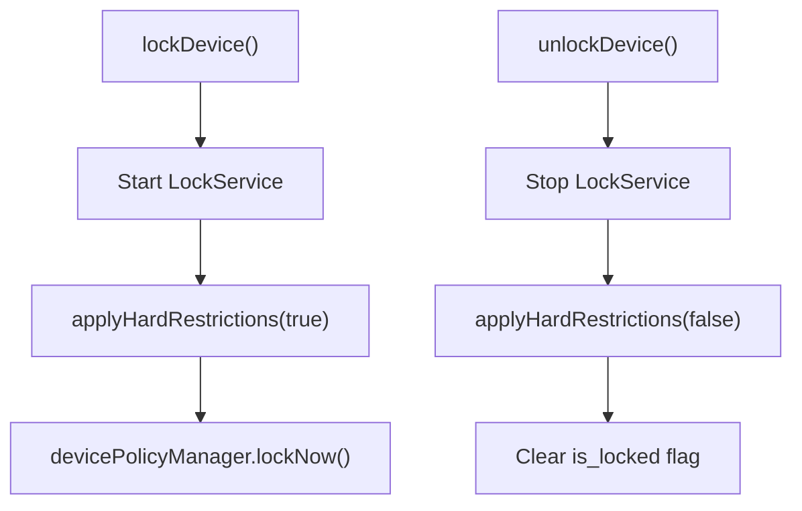
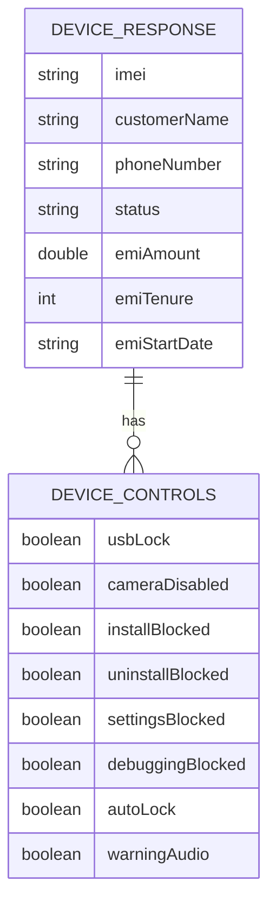
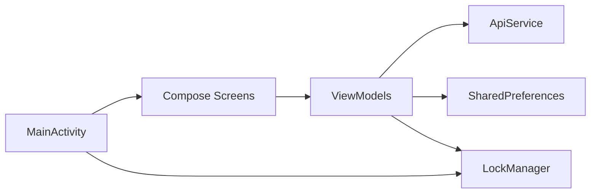

# MVVM Architecture Pattern

<cite>
**Referenced Files in This Document**
- [MainActivity.kt](file://app/src/main/java/com/pksafe/lock/manager/MainActivity.kt)
- [ApiService.kt](file://data/ApiService.kt)
- [Models.kt](file://app/src/main/java/com/pksafe/lock/manager/data/Models.kt)
- [LockManager.kt](file://app/src/main/java/com/pksafe/lock/manager/util/LockManager.kt)
- [LoginViewModel.kt](file://app/src/main/java/com/pksafe/lock/manager/ui/login/LoginViewModel.kt)
- [DeviceListViewModel.kt](file://app/src/main/java/com/pksafe/lock/manager/ui/devices/DeviceListViewModel.kt)
- [DashboardViewModel.kt](file://app/src/main/java/com/pksafe/lock/manager/ui/dashboard/DashboardViewModel.kt)
- [LoginScreen.kt](file://app/src/main/java/com/pksafe/lock/manager/ui/login/LoginScreen.kt)
- [DeviceListScreen.kt](file://app/src/main/java/com/pksafe/lock/manager/ui/devices/DeviceListScreen.kt)
</cite>

## Table of Contents
1. [Introduction](#introduction)
2. [Project Structure](#project-structure)
3. [Core Components](#core-components)
4. [Architecture Overview](#architecture-overview)
5. [Detailed Component Analysis](#detailed-component-analysis)
6. [Dependency Analysis](#dependency-analysis)
7. [Performance Considerations](#performance-considerations)
8. [Troubleshooting Guide](#troubleshooting-guide)
9. [Conclusion](#conclusion)
10. [Appendices](#appendices)

## Introduction
This document explains PK Locker’s MVVM architecture with a focus on clear separation between View, ViewModel, and Model layers. It details how MainActivity coordinates Jetpack Compose UI with ViewModels, how ViewModels manage UI state and orchestrate network calls via Retrofit, and how the Model layer encapsulates data contracts and business logic through ApiService and LockManager. It also covers data flow from user interactions to system-level enforcement, error handling strategies, lifecycle-aware operations, testing considerations, and best practices for maintaining clean boundaries.

## Project Structure
The app follows a feature-oriented layout under ui (screens and ViewModels), a shared data layer (ApiService and Models), and utility/business logic in util (LockManager). The entry point is MainActivity, which composes screens and orchestrates high-level flows such as authentication, customer lock screen, and shopkeeper dashboard.

**Diagram sources**
- [MainActivity.kt:65-445](file://app/src/main/java/com/pksafe/lock/manager/MainActivity.kt#L65-L445)
- [LoginScreen.kt:39-215](file://app/src/main/java/com/pksafe/lock/manager/ui/login/LoginScreen.kt#L39-L215)
- [DeviceListScreen.kt:36-190](file://app/src/main/java/com/pksafe/lock/manager/ui/devices/DeviceListScreen.kt#L36-L190)
- [LoginViewModel.kt:15-88](file://app/src/main/java/com/pksafe/lock/manager/ui/login/LoginViewModel.kt#L15-L88)
- [DeviceListViewModel.kt:18-246](file://app/src/main/java/com/pksafe/lock/manager/ui/devices/DeviceListViewModel.kt#L18-L246)
- [DashboardViewModel.kt:16-66](file://app/src/main/java/com/pksafe/lock/manager/ui/dashboard/DashboardViewModel.kt#L16-L66)
- [ApiService.kt:10-46](file://data/ApiService.kt#L10-L46)
- [LockManager.kt:27-406](file://app/src/main/java/com/pksafe/lock/manager/util/LockManager.kt#L27-L406)

**Section sources**
- [MainActivity.kt:65-445](file://app/src/main/java/com/pksafe/lock/manager/MainActivity.kt#L65-L445)
- [ApiService.kt:10-46](file://data/ApiService.kt#L10-L46)
- [Models.kt:7-255](file://app/src/main/java/com/pksafe/lock/manager/data/Models.kt#L7-L255)
- [LockManager.kt:27-406](file://app/src/main/java/com/pksafe/lock/manager/util/LockManager.kt#L27-L406)

## Core Components
- View Layer (Compose Screens): LoginScreen, DeviceListScreen, CustomerStatusScreen render UI and delegate actions to ViewModels. They observe ViewModel state and trigger side effects via callbacks or direct method calls.
- ViewModel Layer: LoginViewModel, DeviceListViewModel, DashboardViewModel encapsulate UI state using mutableStateOf and coordinate network requests via Retrofit and local storage via SharedPreferences.
- Model Layer: ApiService defines Retrofit endpoints; Models.kt defines request/response DTOs; LockManager implements device policy enforcement and system-level controls.

Key responsibilities:
- Views: Present state, collect user input, invoke ViewModel methods.
- ViewModels: Manage UI state, handle coroutines, call APIs, update local state, expose results to Views.
- Model: Data contracts and business/system logic (APIs, device policies).

**Section sources**
- [LoginScreen.kt:39-215](file://app/src/main/java/com/pksafe/lock/manager/ui/login/LoginScreen.kt#L39-L215)
- [DeviceListScreen.kt:36-190](file://app/src/main/java/com/pksafe/lock/manager/ui/devices/DeviceListScreen.kt#L36-L190)
- [LoginViewModel.kt:15-88](file://app/src/main/java/com/pksafe/lock/manager/ui/login/LoginViewModel.kt#L15-L88)
- [DeviceListViewModel.kt:18-246](file://app/src/main/java/com/pksafe/lock/manager/ui/devices/DeviceListViewModel.kt#L18-L246)
- [DashboardViewModel.kt:16-66](file://app/src/main/java/com/pksafe/lock/manager/ui/dashboard/DashboardViewModel.kt#L16-L66)
- [ApiService.kt:10-46](file://data/ApiService.kt#L10-L46)
- [Models.kt:7-255](file://app/src/main/java/com/pksafe/lock/manager/data/Models.kt#L7-L255)
- [LockManager.kt:27-406](file://app/src/main/java/com/pksafe/lock/manager/util/LockManager.kt#L27-L406)

## Architecture Overview
PK Locker uses a classic MVVM pattern with Jetpack Compose as the View layer. MainActivity acts as the composition root, deciding which screens to show based on authentication and customer/device owner status. ViewModels own UI state and perform side effects (network, local storage). The Model layer provides typed data contracts and enforces system-level security via LockManager.

**Diagram sources**
- [LoginScreen.kt:39-215](file://app/src/main/java/com/pksafe/lock/manager/ui/login/LoginScreen.kt#L39-L215)
- [LoginViewModel.kt:15-88](file://app/src/main/java/com/pksafe/lock/manager/ui/login/LoginViewModel.kt#L15-L88)
- [DeviceListScreen.kt:36-190](file://app/src/main/java/com/pksafe/lock/manager/ui/devices/DeviceListScreen.kt#L36-L190)
- [DeviceListViewModel.kt:18-246](file://app/src/main/java/com/pksafe/lock/manager/ui/devices/DeviceListViewModel.kt#L18-L246)
- [ApiService.kt:10-46](file://data/ApiService.kt#L10-L46)
- [LockManager.kt:27-406](file://app/src/main/java/com/pksafe/lock/manager/util/LockManager.kt#L27-L406)

## Detailed Component Analysis

### MainActivity: Composition Root and Orchestration
- Sets up edge-to-edge UI and theme, then delegates to MainAppEntryPoint.
- Reads persistent flags (is_customer, is_locked, is_logged_in) from SharedPreferences to decide navigation.
- Coordinates background tasks: FCM token sync, location sync scheduling, auto-update checks, and silent refresh of EMI data for customers.
- Enforces permanent restrictions for customer devices when applicable.
- Triggers lock/unlock via LockManager based on is_locked flag changes.

**Diagram sources**
- [MainActivity.kt:65-445](file://app/src/main/java/com/pksafe/lock/manager/MainActivity.kt#L65-L445)
- [LockManager.kt:27-406](file://app/src/main/java/com/pksafe/lock/manager/util/LockManager.kt#L27-L406)

**Section sources**
- [MainActivity.kt:65-445](file://app/src/main/java/com/pksafe/lock/manager/MainActivity.kt#L65-L445)

### LoginViewModel: Authentication and Session Management
- Holds UI state: phone, password, isLoading, errorMessage, isLoggedIn.
- Validates inputs, launches coroutine, calls ApiService.loginShopkeeper, handles response, updates SharedPreferences (auth_token, role flags), and updates UI state.
- Updates FCM token for shopkeeper after successful login.

**Diagram sources**
- [LoginViewModel.kt:15-88](file://app/src/main/java/com/pksafe/lock/manager/ui/login/LoginViewModel.kt#L15-L88)
- [ApiService.kt:10-46](file://data/ApiService.kt#L10-L46)

**Section sources**
- [LoginViewModel.kt:15-88](file://app/src/main/java/com/pksafe/lock/manager/ui/login/LoginViewModel.kt#L15-L88)

### DeviceListViewModel: Device Operations and EMI Management
- Manages devices list, loading states, and errors.
- Fetches devices, toggles lock/unlock, marks EMIs as paid, reschedules plans, sends advanced controls, and deregisters devices.
- Uses Retrofit with Authorization headers from SharedPreferences.

**Diagram sources**
- [DeviceListScreen.kt:36-190](file://app/src/main/java/com/pksafe/lock/manager/ui/devices/DeviceListScreen.kt#L36-L190)
- [DeviceListViewModel.kt:18-246](file://app/src/main/java/com/pksafe/lock/manager/ui/devices/DeviceListViewModel.kt#L18-L246)
- [ApiService.kt:10-46](file://data/ApiService.kt#L10-L46)

**Section sources**
- [DeviceListViewModel.kt:18-246](file://app/src/main/java/com/pksafe/lock/manager/ui/devices/DeviceListViewModel.kt#L18-L246)

### DashboardViewModel: Stats and Initialization
- Initializes dashboard by reading preferences and fetching stats via ApiService.getStats.
- Exposes dashboardData, shop info, admin flag, loading, and error states.

**Diagram sources**
- [DashboardViewModel.kt:16-66](file://app/src/main/java/com/pksafe/lock/manager/ui/dashboard/DashboardViewModel.kt#L16-L66)
- [ApiService.kt:10-46](file://data/ApiService.kt#L10-L46)

**Section sources**
- [DashboardViewModel.kt:16-66](file://app/src/main/java/com/pksafe/lock/manager/ui/dashboard/DashboardViewModel.kt#L16-L66)

### LockManager: Business Logic and System Enforcement
- Encapsulates device policy operations: enabling accessibility service, applying hard restrictions, locking/unlocking, hiding apps, and self-deactivation.
- Provides granular controls (USB, camera, install/uninstall, outgoing calls, factory reset, safe boot) and permanent restriction enforcement for customer devices.

**Diagram sources**
- [LockManager.kt:111-148](file://app/src/main/java/com/pksafe/lock/manager/util/LockManager.kt#L111-L148)
- [LockManager.kt:151-200](file://app/src/main/java/com/pksafe/lock/manager/util/LockManager.kt#L151-L200)

**Section sources**
- [LockManager.kt:27-406](file://app/src/main/java/com/pksafe/lock/manager/util/LockManager.kt#L27-L406)

### Data Layer: ApiService and Models
- ApiService declares Retrofit endpoints for auth, device management, stats, and token updates.
- Models.kt defines request/response DTOs for all features including devices, EMI schedules, controls, and key orders.

**Diagram sources**
- [ApiService.kt:10-46](file://data/ApiService.kt#L10-L46)
- [Models.kt:48-92](file://app/src/main/java/com/pksafe/lock/manager/data/Models.kt#L48-L92)

**Section sources**
- [ApiService.kt:10-46](file://data/ApiService.kt#L10-L46)
- [Models.kt:7-255](file://app/src/main/java/com/pksafe/lock/manager/data/Models.kt#L7-L255)

## Dependency Analysis
- Views depend on ViewModels for state and behavior.
- ViewModels depend on ApiService for network operations and SharedPreferences for local state.
- MainActivity depends on LockManager for system-level enforcement and on ViewModels indirectly via composed screens.
- LockManager depends on Android system services (DevicePolicyManager, UserManager) and services (LockService).

**Diagram sources**
- [LoginScreen.kt:39-215](file://app/src/main/java/com/pksafe/lock/manager/ui/login/LoginScreen.kt#L39-L215)
- [DeviceListScreen.kt:36-190](file://app/src/main/java/com/pksafe/lock/manager/ui/devices/DeviceListScreen.kt#L36-L190)
- [LoginViewModel.kt:15-88](file://app/src/main/java/com/pksafe/lock/manager/ui/login/LoginViewModel.kt#L15-L88)
- [DeviceListViewModel.kt:18-246](file://app/src/main/java/com/pksafe/lock/manager/ui/devices/DeviceListViewModel.kt#L18-L246)
- [MainActivity.kt:65-445](file://app/src/main/java/com/pksafe/lock/manager/MainActivity.kt#L65-L445)
- [LockManager.kt:27-406](file://app/src/main/java/com/pksafe/lock/manager/util/LockManager.kt#L27-L406)

**Section sources**
- [MainActivity.kt:65-445](file://app/src/main/java/com/pksafe/lock/manager/MainActivity.kt#L65-L445)
- [LoginViewModel.kt:15-88](file://app/src/main/java/com/pksafe/lock/manager/ui/login/LoginViewModel.kt#L15-L88)
- [DeviceListViewModel.kt:18-246](file://app/src/main/java/com/pksafe/lock/manager/ui/devices/DeviceListViewModel.kt#L18-L246)
- [LockManager.kt:27-406](file://app/src/main/java/com/pksafe/lock/manager/util/LockManager.kt#L27-L406)

## Performance Considerations
- Use suspend functions in ViewModels to avoid blocking the main thread during network calls.
- Debounce or throttle frequent UI-triggered operations (e.g., search filtering) at the View layer.
- Reuse Retrofit instances per module or application scope to reduce overhead.
- Minimize recompositions by hoisting stable state into ViewModels and using derived state in Composables.
- Schedule background work (location sync, updates) with WorkManager to respect battery and system constraints.

[No sources needed since this section provides general guidance]

## Troubleshooting Guide
Common issues and strategies:
- Network failures: ViewModels set errorMessage and isLoading appropriately; ensure proper exception handling and retry strategies where necessary.
- Authentication missing: Check SharedPreferences for auth_token before calling protected endpoints; guard API calls with token presence checks.
- Permission denials: For overlay, SMS, and location permissions, prompt users via dialogs and re-check upon returning to foreground.
- Device policy failures: Validate Device Owner/Admin status before invoking LockManager methods; log detailed errors for diagnostics.

**Section sources**
- [LoginViewModel.kt:30-88](file://app/src/main/java/com/pksafe/lock/manager/ui/login/LoginViewModel.kt#L30-L88)
- [DeviceListViewModel.kt:33-64](file://app/src/main/java/com/pksafe/lock/manager/ui/devices/DeviceListViewModel.kt#L33-L64)
- [MainActivity.kt:170-325](file://app/src/main/java/com/pksafe/lock/manager/MainActivity.kt#L170-L325)
- [LockManager.kt:151-200](file://app/src/main/java/com/pksafe/lock/manager/util/LockManager.kt#L151-L200)

## Conclusion
PK Locker’s MVVM implementation cleanly separates concerns: Compose screens present UI and delegate to ViewModels, which manage state and orchestrate network and local storage operations. The Model layer encapsulates data contracts and system-level business logic via ApiService and LockManager. This structure supports maintainability, testability, and scalability while enforcing robust security controls for customer devices.

[No sources needed since this section summarizes without analyzing specific files]

## Appendices

### Testing Considerations for MVVM Components
- Unit tests for ViewModels:
  - Mock ApiService responses to validate state transitions (isLoading, errorMessage, data updates).
  - Verify SharedPreferences writes for tokens and session flags.
  - Test error paths and edge cases (empty inputs, network exceptions).
- UI tests for Compose screens:
  - Simulate user interactions and assert UI state changes driven by ViewModel state.
  - Use test doubles for ViewModel to isolate UI behavior.
- Integration tests:
  - Validate end-to-end flows (login -> dashboard load -> device list refresh).
  - Ensure permission prompts and system integrations behave as expected in instrumented tests.

[No sources needed since this section provides general guidance]

### Best Practices for Clean Architecture Boundaries
- Keep Views stateless except for UI-only state; rely on ViewModels for business and UI state.
- Centralize API configuration in a single place (e.g., Retrofit builder) and inject it into ViewModels.
- Use consistent error handling patterns across ViewModels (set isLoading, errorMessage, and clear on success).
- Avoid direct system calls in Views; route them through ViewModels or dedicated managers like LockManager.
- Persist only necessary data locally; keep sensitive tokens secure and rotate as needed.

[No sources needed since this section provides general guidance]