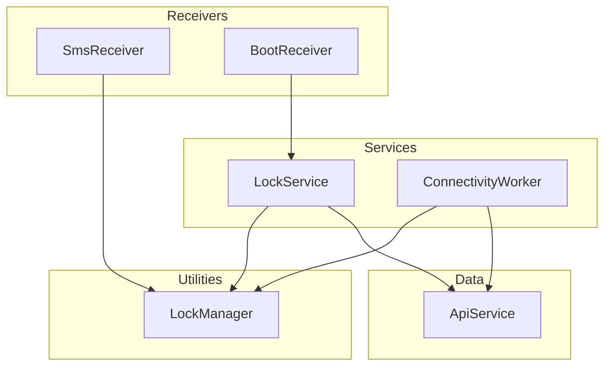
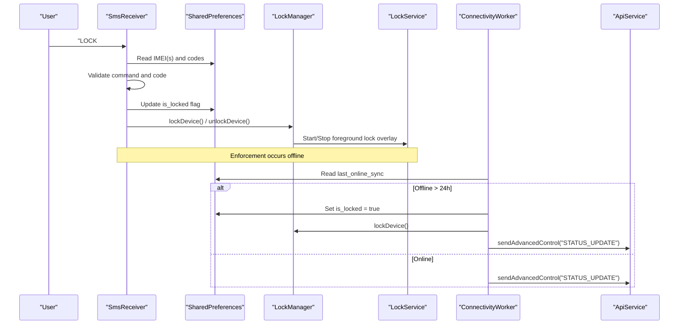
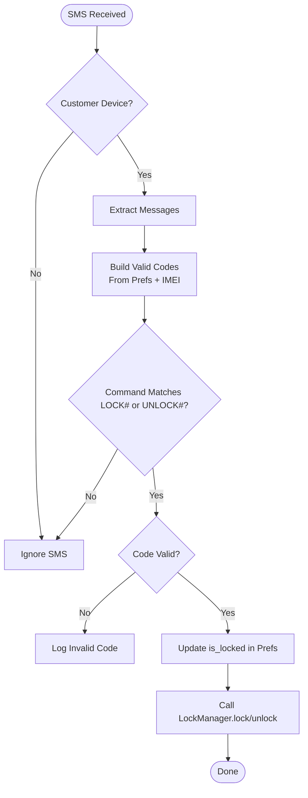
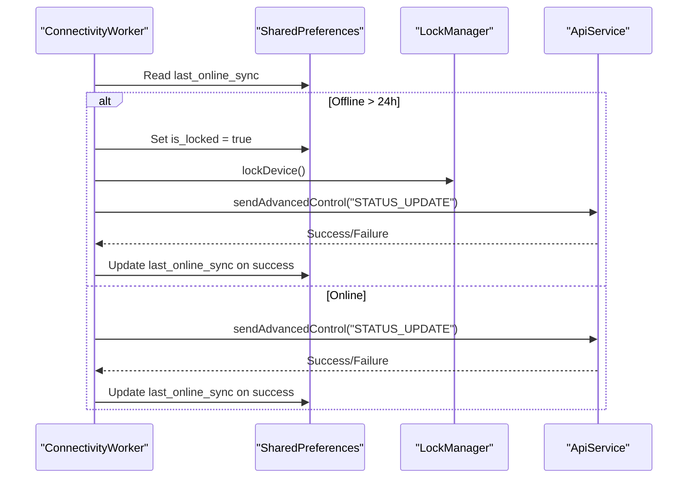
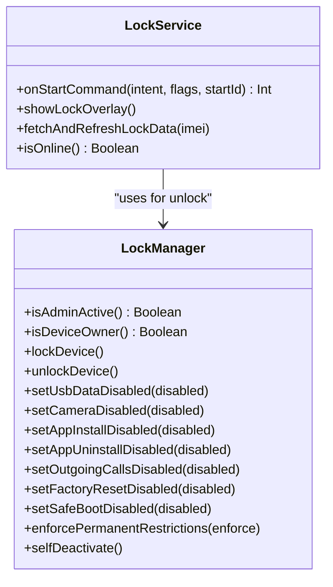
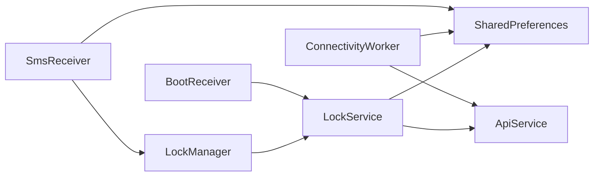

# Offline Capability Architecture

<cite>
**Referenced Files in This Document**
- [SmsReceiver.kt](file://app/src/main/java/com/pksafe/lock/manager/receiver/SmsReceiver.kt)
- [ConnectivityWorker.kt](file://app/src/main/java/com/pksafe/lock/manager/service/ConnectivityWorker.kt)
- [LockManager.kt](file://app/src/main/java/com/pksafe/lock/manager/util/LockManager.kt)
- [LockService.kt](file://app/src/main/java/com/pksafe/lock/manager/service/LockService.kt)
- [ApiService.kt](file://app/src/main/java/com/pksafe/lock/manager/data/ApiService.kt)
- [BootReceiver.kt](file://app/src/main/java/com/pksafe/lock/manager/receiver/BootReceiver.kt)
- [LocationWorker.kt](file://app/src/main/java/com/pksafe/lock/manager/worker/LocationWorker.kt)
</cite>

## Table of Contents
1. Introduction
2. Project Structure
3. Core Components
4. Architecture Overview
5. Detailed Component Analysis
6. Dependency Analysis
7. Performance Considerations
8. Troubleshooting Guide
9. Conclusion

## Introduction
This document explains PK Locker’s offline capability architecture that preserves device control when internet connectivity is unavailable. It focuses on:
- SMS-based command processing for lock/unlock operations using SmsReceiver
- Local state management via SharedPreferences to persist lock state and credentials
- Connectivity monitoring with ConnectivityWorker, automatic synchronization upon reconnection, and conflict resolution strategies
- Offline command validation, security considerations for SMS-based controls, and performance optimization for background processing

The design ensures that critical enforcement actions (locking, restrictions, overlay UI) remain functional without network access, while leveraging the network opportunistically to synchronize state and report status.

## Project Structure
PK Locker organizes offline-related logic across receivers, services, utilities, and workers:
- Receivers handle system events (boot, SMS) and trigger enforcement or sync
- Services provide persistent enforcement (foreground service overlay) and local connectivity checks
- Utilities encapsulate device policy enforcement and hardware restrictions
- Workers perform periodic background tasks (connectivity heartbeat, location sync)
- Data layer defines API contracts used by workers and services

**Diagram sources**
- [SmsReceiver.kt:44-143](file://app/src/main/java/com/pksafe/lock/manager/receiver/SmsReceiver.kt#L44-L143)
- [BootReceiver.kt:10-26](file://app/src/main/java/com/pksafe/lock/manager/receiver/BootReceiver.kt#L10-L26)
- [LockService.kt:50-80](file://app/src/main/java/com/pksafe/lock/manager/service/LockService.kt#L50-L80)
- [ConnectivityWorker.kt:17-47](file://app/src/main/java/com/pksafe/lock/manager/service/ConnectivityWorker.kt#L17-L47)
- [LockManager.kt:111-148](file://app/src/main/java/com/pksafe/lock/manager/util/LockManager.kt#L111-L148)
- [ApiService.kt:11-185](file://app/src/main/java/com/pksafe/lock/manager/data/ApiService.kt#L11-L185)

**Section sources**
- [SmsReceiver.kt:44-143](file://app/src/main/java/com/pksafe/lock/manager/receiver/SmsReceiver.kt#L44-L143)
- [ConnectivityWorker.kt:17-47](file://app/src/main/java/com/pksafe/lock/manager/service/ConnectivityWorker.kt#L17-L47)
- [LockManager.kt:111-148](file://app/src/main/java/com/pksafe/lock/manager/util/LockManager.kt#L111-L148)
- [LockService.kt:50-80](file://app/src/main/java/com/pksafe/lock/manager/service/LockService.kt#L50-L80)
- [ApiService.kt:11-185](file://app/src/main/java/com/pksafe/lock/manager/data/ApiService.kt#L11-L185)
- [BootReceiver.kt:10-26](file://app/src/main/java/com/pksafe/lock/manager/receiver/BootReceiver.kt#L10-L26)

## Core Components
- SmsReceiver: Parses incoming SMS messages, validates commands against locally stored or generated codes, updates local lock state, and triggers enforcement via LockManager.
- ConnectivityWorker: Periodically checks last online sync time; if exceeded, enforces a local lock and attempts to report status to the server; otherwise sends an active heartbeat.
- LockManager: Applies device policy restrictions, starts/stops the lock overlay service, and manages hardware-level locks and restrictions.
- LockService: Foreground service displaying a persistent lock overlay, handling emergency unlock via dynamic master code, and refreshing EMI data from the server when available.
- ApiService: Retrofit interface defining endpoints for device control, status updates, and device information retrieval.
- BootReceiver: Restarts enforcement after device boot if admin privileges are active.

**Section sources**
- [SmsReceiver.kt:44-143](file://app/src/main/java/com/pksafe/lock/manager/receiver/SmsReceiver.kt#L44-L143)
- [ConnectivityWorker.kt:17-47](file://app/src/main/java/com/pksafe/lock/manager/service/ConnectivityWorker.kt#L17-L47)
- [LockManager.kt:111-148](file://app/src/main/java/com/pksafe/lock/manager/util/LockManager.kt#L111-L148)
- [LockService.kt:50-80](file://app/src/main/java/com/pksafe/lock/manager/service/LockService.kt#L50-L80)
- [ApiService.kt:11-185](file://app/src/main/java/com/pksafe/lock/manager/data/ApiService.kt#L11-L185)
- [BootReceiver.kt:10-26](file://app/src/main/java/com/pksafe/lock/manager/receiver/BootReceiver.kt#L10-L26)

## Architecture Overview
The offline architecture combines event-driven enforcement (SMS, boot), background monitoring (ConnectivityWorker), and persistent enforcement (LockService). Local state in SharedPreferences drives immediate actions, while network calls update server state when possible.

**Diagram sources**
- [SmsReceiver.kt:44-143](file://app/src/main/java/com/pksafe/lock/manager/receiver/SmsReceiver.kt#L44-L143)
- [LockManager.kt:111-148](file://app/src/main/java/com/pksafe/lock/manager/util/LockManager.kt#L111-L148)
- [ConnectivityWorker.kt:17-47](file://app/src/main/java/com/pksafe/lock/manager/service/ConnectivityWorker.kt#L17-L47)
- [ApiService.kt:58-63](file://app/src/main/java/com/pksafe/lock/manager/data/ApiService.kt#L58-L63)

## Detailed Component Analysis

### SMS-Based Command Processing (SmsReceiver)
- Parses SMS intent and extracts message bodies
- Validates device role (customer-only) and retrieves IMEIs
- Builds valid code sets from:
  - Server-provided codes stored in SharedPreferences
  - Deterministic SHA-256 codes derived from IMEI prefixes ("LOCK_" and "UNLOCK_")
- Executes lock/unlock by updating SharedPreferences and invoking LockManager
- Aborts broadcast to prevent default SMS app interference

**Diagram sources**
- [SmsReceiver.kt:44-143](file://app/src/main/java/com/pksafe/lock/manager/receiver/SmsReceiver.kt#L44-L143)

**Section sources**
- [SmsReceiver.kt:44-143](file://app/src/main/java/com/pksafe/lock/manager/receiver/SmsReceiver.kt#L44-L143)

### Local State Management (SharedPreferences)
- Keys used:
  - is_customer: Determines whether SMS enforcement applies
  - device_imei / device_imei2: Identifiers for code generation and server reporting
  - sms_lock_code / sms_unlock_code: Optional server-provided codes for offline validation
  - is_locked: Current lock state persisted across sessions
  - last_online_sync: Timestamp for offline guard threshold
  - auth_token: Bearer token for API requests
- Persistence ensures enforcement remains consistent after reboot or process death

**Section sources**
- [SmsReceiver.kt:47-92](file://app/src/main/java/com/pksafe/lock/manager/receiver/SmsReceiver.kt#L47-L92)
- [ConnectivityWorker.kt:17-47](file://app/src/main/java/com/pksafe/lock/manager/service/ConnectivityWorker.kt#L17-L47)
- [LockService.kt:200-218](file://app/src/main/java/com/pksafe/lock/manager/service/LockService.kt#L200-L218)

### Connectivity Monitoring and Fallback (ConnectivityWorker)
- Reads last_online_sync and compares with current time
- If offline beyond threshold:
  - Sets is_locked to true
  - Calls LockManager.lockDevice()
  - Attempts to report status to server via ApiService
- Else:
  - Sends heartbeat to indicate device activity
- Updates last_online_sync on successful server communication

**Diagram sources**
- [ConnectivityWorker.kt:17-47](file://app/src/main/java/com/pksafe/lock/manager/service/ConnectivityWorker.kt#L17-L47)
- [ApiService.kt:58-63](file://app/src/main/java/com/pksafe/lock/manager/data/ApiService.kt#L58-L63)

**Section sources**
- [ConnectivityWorker.kt:17-47](file://app/src/main/java/com/pksafe/lock/manager/service/ConnectivityWorker.kt#L17-L47)

### Enforcement and Overlay (LockManager and LockService)
- LockManager:
  - Starts LockService as a foreground service
  - Applies device policy restrictions (camera, USB transfer, factory reset, safe boot, ADB, settings changes)
  - Triggers hardware lock via DevicePolicyManager
- LockService:
  - Displays persistent overlay with shop details and EMI info
  - Supports emergency unlock using dynamic master code derived from IMEI
  - Refreshes EMI data from server when available, falling back to cached values

**Diagram sources**
- [LockManager.kt:111-148](file://app/src/main/java/com/pksafe/lock/manager/util/LockManager.kt#L111-L148)
- [LockManager.kt:151-200](file://app/src/main/java/com/pksafe/lock/manager/util/LockManager.kt#L151-L200)
- [LockService.kt:50-80](file://app/src/main/java/com/pksafe/lock/manager/service/LockService.kt#L50-L80)
- [LockService.kt:200-218](file://app/src/main/java/com/pksafe/lock/manager/service/LockService.kt#L200-L218)

**Section sources**
- [LockManager.kt:111-148](file://app/src/main/java/com/pksafe/lock/manager/util/LockManager.kt#L111-L148)
- [LockManager.kt:151-200](file://app/src/main/java/com/pksafe/lock/manager/util/LockManager.kt#L151-L200)
- [LockService.kt:50-80](file://app/src/main/java/com/pksafe/lock/manager/service/LockService.kt#L50-L80)
- [LockService.kt:200-218](file://app/src/main/java/com/pksafe/lock/manager/service/LockService.kt#L200-L218)

### Boot-Time Enforcement (BootReceiver)
- On boot completion, restarts LockService if admin privileges and overlay permissions are active
- Ensures enforcement resumes after device reboot

**Section sources**
- [BootReceiver.kt:10-26](file://app/src/main/java/com/pksafe/lock/manager/receiver/BootReceiver.kt#L10-L26)

### Background Sync and Location Reporting (LocationWorker)
- Captures device location and reports to server via ApiService
- Retries on failure or missing permissions
- Complements ConnectivityWorker by providing additional telemetry when online

**Section sources**
- [LocationWorker.kt:20-68](file://app/src/main/java/com/pksafe/lock/manager/worker/LocationWorker.kt#L20-L68)

## Dependency Analysis
- SmsReceiver depends on SharedPreferences for IMEI and codes, and on LockManager for enforcement
- ConnectivityWorker depends on SharedPreferences for state and timestamps, and on ApiService for server reporting
- LockManager depends on Android DevicePolicyManager and starts LockService
- LockService depends on SharedPreferences for dynamic unlock code and refreshes data via ApiService
- BootReceiver depends on LockManager to determine enforcement readiness

**Diagram sources**
- [SmsReceiver.kt:44-143](file://app/src/main/java/com/pksafe/lock/manager/receiver/SmsReceiver.kt#L44-L143)
- [ConnectivityWorker.kt:17-47](file://app/src/main/java/com/pksafe/lock/manager/service/ConnectivityWorker.kt#L17-L47)
- [LockService.kt:50-80](file://app/src/main/java/com/pksafe/lock/manager/service/LockService.kt#L50-L80)
- [BootReceiver.kt:10-26](file://app/src/main/java/com/pksafe/lock/manager/receiver/BootReceiver.kt#L10-L26)
- [ApiService.kt:58-63](file://app/src/main/java/com/pksafe/lock/manager/data/ApiService.kt#L58-L63)

**Section sources**
- [SmsReceiver.kt:44-143](file://app/src/main/java/com/pksafe/lock/manager/receiver/SmsReceiver.kt#L44-L143)
- [ConnectivityWorker.kt:17-47](file://app/src/main/java/com/pksafe/lock/manager/service/ConnectivityWorker.kt#L17-L47)
- [LockService.kt:50-80](file://app/src/main/java/com/pksafe/lock/manager/service/LockService.kt#L50-L80)
- [BootReceiver.kt:10-26](file://app/src/main/java/com/pksafe/lock/manager/receiver/BootReceiver.kt#L10-L26)
- [ApiService.kt:58-63](file://app/src/main/java/com/pksafe/lock/manager/data/ApiService.kt#L58-L63)

## Performance Considerations
- Use SharedPreferences for fast, local state reads/writes to avoid blocking UI threads
- Perform network calls in background scopes (Coroutines) within workers and services
- Limit network requests to necessary intervals (e.g., ConnectivityWorker heartbeat)
- Avoid heavy operations in BroadcastReceivers; delegate to services/workers
- Ensure LockService runs as a foreground service to maintain enforcement under memory pressure
- Cache EMI and shop data locally to reduce repeated network calls

[No sources needed since this section provides general guidance]

## Troubleshooting Guide
- SMS not triggering lock/unlock:
  - Verify device role (is_customer) and presence of IMEI(s)
  - Confirm codes match either server-provided or deterministic SHA-256 values
  - Check logs for invalid code warnings
- Device not locking after extended offline:
  - Ensure last_online_sync is updated on successful server communication
  - Confirm ConnectivityWorker executes and triggers lockDevice()
- Lock overlay not visible:
  - Check overlay permission and admin privileges
  - Verify BootReceiver restarts LockService on boot
- Network errors during sync:
  - Inspect API response codes and exceptions
  - Retry mechanisms in workers should be leveraged

**Section sources**
- [SmsReceiver.kt:94-141](file://app/src/main/java/com/pksafe/lock/manager/receiver/SmsReceiver.kt#L94-L141)
- [ConnectivityWorker.kt:31-44](file://app/src/main/java/com/pksafe/lock/manager/service/ConnectivityWorker.kt#L31-L44)
- [LockService.kt:200-218](file://app/src/main/java/com/pksafe/lock/manager/service/LockService.kt#L200-L218)
- [BootReceiver.kt:10-26](file://app/src/main/java/com/pksafe/lock/manager/receiver/BootReceiver.kt#L10-L26)

## Conclusion
PK Locker’s offline capability architecture ensures robust device control through SMS-based commands, local state persistence, and background monitoring. The system prioritizes immediate enforcement via LockManager and LockService, while opportunistically synchronizing with the server when connectivity is available. Security is maintained through deterministic code validation and device policy restrictions, and performance is optimized by offloading network tasks to background workers and services.

[No sources needed since this section summarizes without analyzing specific files]