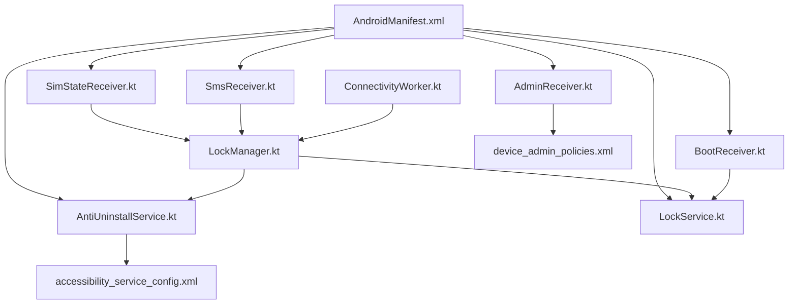
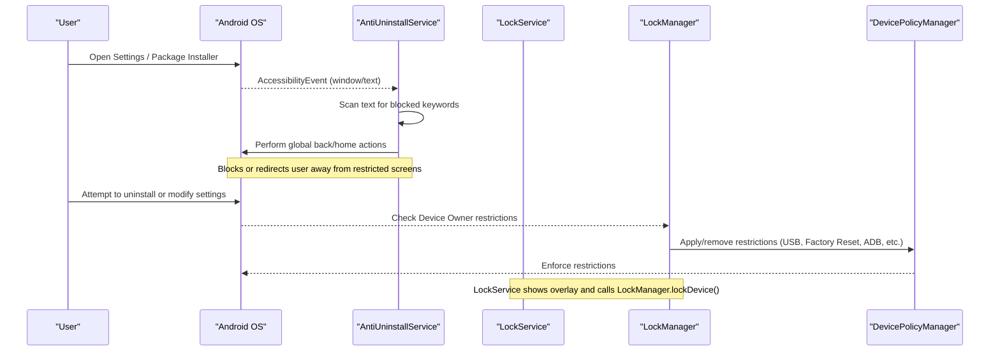
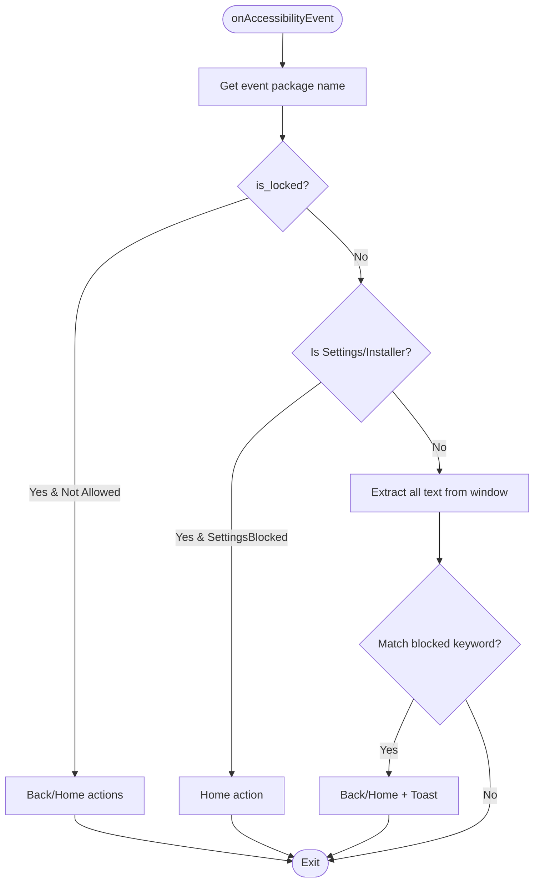
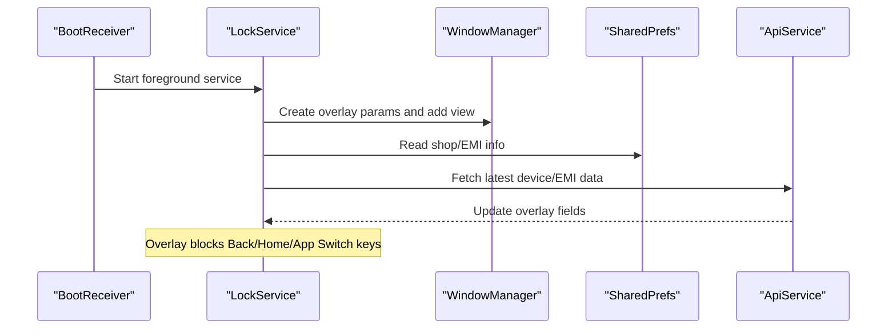
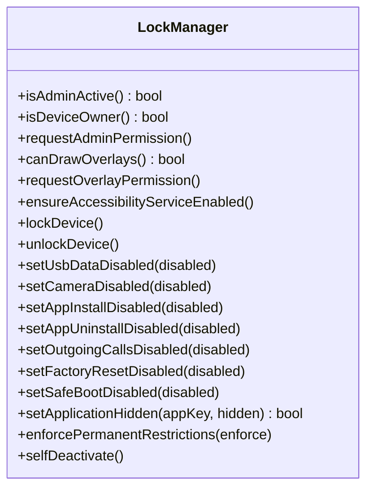
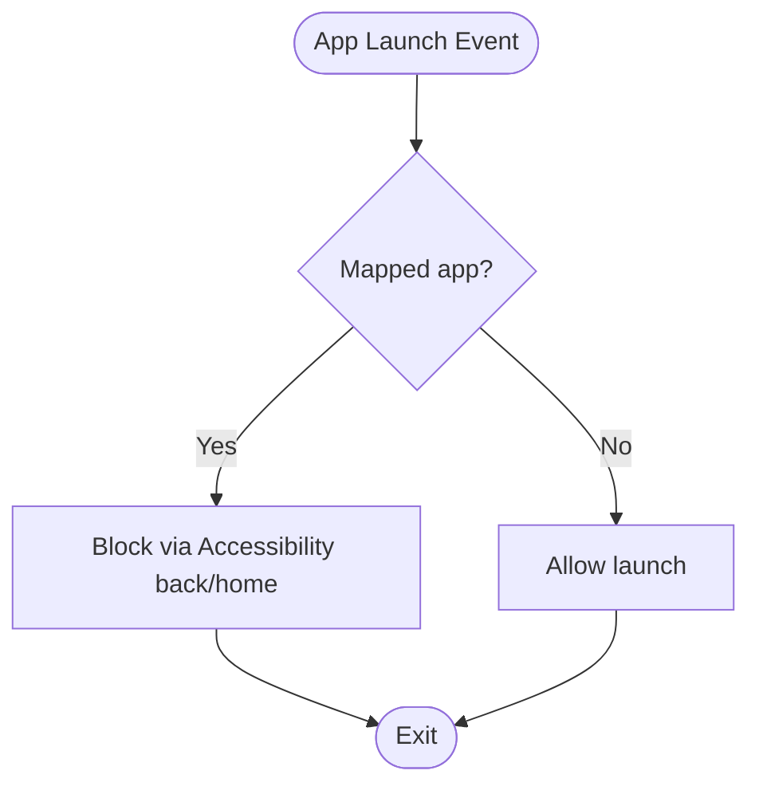
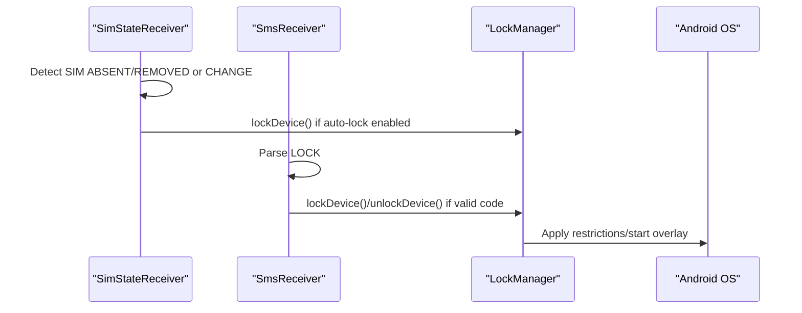
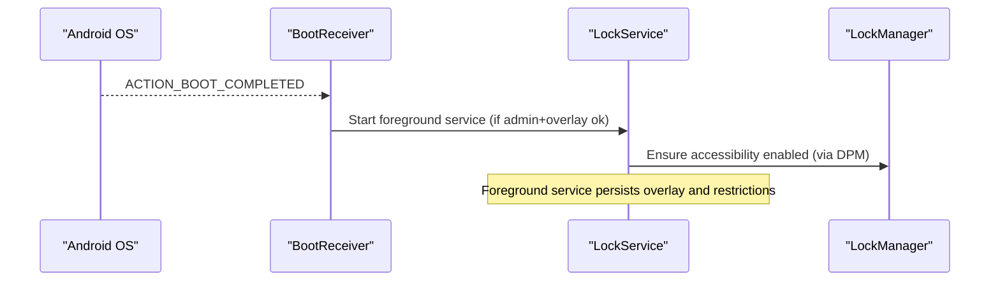
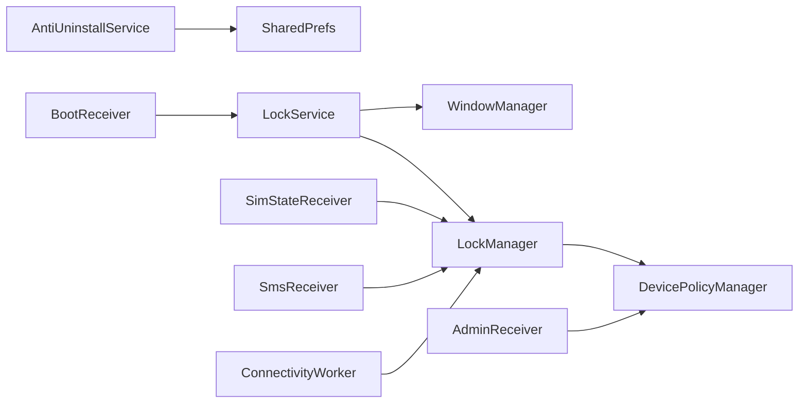

# Anti-Tampering Protection

<cite>
**Referenced Files in This Document**
- [AntiUninstallService.kt](file://app/src/main/java/com/pksafe/lock/manager/service/AntiUninstallService.kt)
- [LockService.kt](file://app/src/main/java/com/pksafe/lock/manager/service/LockService.kt)
- [LockManager.kt](file://app/src/main/java/com/pksafe/lock/manager/util/LockManager.kt)
- [AdminReceiver.kt](file://app/src/main/java/com/pksafe/lock/manager/receiver/AdminReceiver.kt)
- [BootReceiver.kt](file://app/src/main/java/com/pksafe/lock/manager/receiver/BootReceiver.kt)
- [accessibility_service_config.xml](file://app/src/main/res/xml/accessibility_service_config.xml)
- [device_admin_policies.xml](file://app/src/main/res/xml/device_admin_policies.xml)
- [AndroidManifest.xml](file://app/src/main/AndroidManifest.xml)
- [SimStateReceiver.kt](file://app/src/main/java/com/pksafe/lock/manager/receiver/SimStateReceiver.kt)
- [SmsReceiver.kt](file://app/src/main/java/com/pksafe/lock/manager/receiver/SmsReceiver.kt)
- [ConnectivityWorker.kt](file://app/src/main/java/com/pksafe/lock/manager/service/ConnectivityWorker.kt)
</cite>

## Table of Contents
1. Introduction
2. Project Structure
3. Core Components
4. Architecture Overview
5. Detailed Component Analysis
6. Dependency Analysis
7. Performance Considerations
8. Troubleshooting Guide
9. Conclusion

## Introduction
This document explains PK Locker’s anti-tampering protection mechanisms with a focus on:
- Accessibility Service-based monitoring and blocking of unauthorized actions
- Overlay-based lock screen enforcement
- Device Admin and Device Owner restrictions to prevent system modification and tampering
- Persistence across reboots and app restarts
- Detection and prevention of uninstallation attempts, SIM changes, offline control via SMS, and network state changes
- Security analysis of effectiveness and potential bypass scenarios

The goal is to help both technical and non-technical readers understand how the app protects itself and the device from unauthorized access and tampering.

## Project Structure
PK Locker implements anti-tampering through a combination of Android platform features:
- Accessibility Service for UI-level interception and blocking
- Foreground Lock Service with an overlay that enforces a custom lock screen
- Device Admin and Device Owner policies to restrict system behavior (factory reset, USB, ADB, etc.)
- Boot-time recovery via BroadcastReceivers to restore protections after reboot
- SIM change detection and offline SMS-based locking/unlocking
- Network-aware auto-locking when connectivity is lost

**Diagram sources**
- [AndroidManifest.xml:73-121](file://app/src/main/AndroidManifest.xml#L73-L121)
- [accessibility_service_config.xml:1-8](file://app/src/main/res/xml/accessibility_service_config.xml#L1-L8)
- [device_admin_policies.xml:1-13](file://app/src/main/res/xml/device_admin_policies.xml#L1-L13)

**Section sources**
- [AndroidManifest.xml:1-160](file://app/src/main/AndroidManifest.xml#L1-L160)
- [accessibility_service_config.xml:1-8](file://app/src/main/res/xml/accessibility_service_config.xml#L1-L8)
- [device_admin_policies.xml:1-13](file://app/src/main/res/xml/device_admin_policies.xml#L1-L13)

## Core Components
- AntiUninstallService (Accessibility Service): Monitors active windows and text to detect and block attempts to reach Settings, Package Installer, or perform restricted actions; supports dynamic app blocking and full device lock enforcement.
- LockService (Foreground Service + Overlay): Displays a persistent lock overlay, blocks hardware navigation keys, enforces foreground persistence, and integrates with LockManager to apply hardware restrictions.
- LockManager (Device Policy Manager wrapper): Applies Device Admin/Owner restrictions (camera, USB, factory reset, safe boot, ADB, status bar, keyguard), enables accessibility service via enterprise APIs, hides apps, and manages lock/unlock lifecycle.
- AdminReceiver: Handles device provisioning events and grants critical permissions to self as Device Owner; captures IMEI and marks device as customer.
- BootReceiver: Restarts LockService after reboot if admin and overlay permissions are available.
- SimStateReceiver: Detects SIM removal/change and can auto-lock based on policy; notifies backend and optionally unlocks when authorized SIM is present.
- SmsReceiver: Offline lock/unlock via SMS using deterministic codes derived from device IMEI; aborts broadcast to hide messages from default SMS app.
- ConnectivityWorker: Periodically checks connectivity; locks device if offline beyond threshold and reports status to server.

**Section sources**
- [AntiUninstallService.kt:22-224](file://app/src/main/java/com/pksafe/lock/manager/service/AntiUninstallService.kt#L22-L224)
- [LockService.kt:41-330](file://app/src/main/java/com/pksafe/lock/manager/service/LockService.kt#L41-L330)
- [LockManager.kt:27-406](file://app/src/main/java/com/pksafe/lock/manager/util/LockManager.kt#L27-L406)
- [AdminReceiver.kt:14-104](file://app/src/main/java/com/pksafe/lock/manager/receiver/AdminReceiver.kt#L14-L104)
- [BootReceiver.kt:10-27](file://app/src/main/java/com/pksafe/lock/manager/receiver/BootReceiver.kt#L10-L27)
- [SimStateReceiver.kt:18-145](file://app/src/main/java/com/pksafe/lock/manager/receiver/SimStateReceiver.kt#L18-L145)
- [SmsReceiver.kt:29-164](file://app/src/main/java/com/pksafe/lock/manager/receiver/SmsReceiver.kt#L29-L164)
- [ConnectivityWorker.kt:29-60](file://app/src/main/java/com/pksafe/lock/manager/service/ConnectivityWorker.kt#L29-L60)

## Architecture Overview
PK Locker combines multiple layers of protection:
- UI-layer interception via Accessibility Service to block access to Settings and other sensitive flows
- System-level restrictions via Device Admin/Owner to disable risky features and prevent tampering
- Persistent overlay lock enforced by a foreground service
- Boot-time restoration and continuous monitoring via receivers and workers

**Diagram sources**
- [AntiUninstallService.kt:136-211](file://app/src/main/java/com/pksafe/lock/manager/service/AntiUninstallService.kt#L136-L211)
- [LockManager.kt:111-192](file://app/src/main/java/com/pksafe/lock/manager/util/LockManager.kt#L111-L192)
- [LockService.kt:125-234](file://app/src/main/java/com/pksafe/lock/manager/service/LockService.kt#L125-L234)

## Detailed Component Analysis

### Accessibility Service Implementation (AntiUninstallService)
Responsibilities:
- Detects attempts to open Settings, Package Installer, or related components
- Extracts visible text recursively to match against a list of blocked keywords
- Performs global actions (back/home) to interrupt restricted flows
- Supports dynamic app blocking by package name mapping
- Triggers device lock when locked state is active and not in allowed packages
- Registers connectivity receiver to auto-lock when internet drops (if enabled)

Key behaviors:
- Keyword scanning includes UI text, content descriptions, and view IDs
- Blocked actions include uninstall, developer options, factory reset references
- When locked, navigates away from non-essential apps and settings

**Diagram sources**
- [AntiUninstallService.kt:136-211](file://app/src/main/java/com/pksafe/lock/manager/service/AntiUninstallService.kt#L136-L211)

**Section sources**
- [AntiUninstallService.kt:22-224](file://app/src/main/java/com/pksafe/lock/manager/service/AntiUninstallService.kt#L22-L224)
- [accessibility_service_config.xml:1-8](file://app/src/main/res/xml/accessibility_service_config.xml#L1-L8)

### Overlay Protection (LockService)
Responsibilities:
- Runs as a foreground service with a persistent notification
- Draws a full-screen overlay that intercepts input and blocks hardware navigation keys
- Provides hidden unlock entry using a dynamic master code derived from device IMEI
- Refreshes EMI and shop data from server and updates overlay views
- Integrates with LockManager to start/stop lock enforcement and hardware restrictions

Key behaviors:
- Uses appropriate window type for overlay permission support
- Ensures keyboard interaction works by setting specific flags
- Stops itself on admin devices to avoid running on shopkeeper devices

**Diagram sources**
- [BootReceiver.kt:10-27](file://app/src/main/java/com/pksafe/lock/manager/receiver/BootReceiver.kt#L10-L27)
- [LockService.kt:54-234](file://app/src/main/java/com/pksafe/lock/manager/service/LockService.kt#L54-L234)

**Section sources**
- [LockService.kt:41-330](file://app/src/main/java/com/pksafe/lock/manager/service/LockService.kt#L41-L330)

### System Modification Prevention (LockManager)
Responsibilities:
- Enables Accessibility Service via Device Owner enterprise APIs
- Applies comprehensive restrictions when locked or permanently:
  - Camera disabled
  - USB file transfer disabled
  - Factory reset disabled
  - Safe boot disabled
  - Debugging features disabled
  - Status bar disabled
  - Keyguard disabled to show custom overlay directly
- Hides apps via Device Owner APIs
- Manages lock/unlock lifecycle and clears restrictions on unlock or deactivation

Key behaviors:
- Uses DevicePolicyManager to enforce restrictions at system level
- Falls back gracefully where APIs are unavailable
- Clears all restrictions during self-deactivation flow

**Diagram sources**
- [LockManager.kt:27-406](file://app/src/main/java/com/pksafe/lock/manager/util/LockManager.kt#L27-L406)

**Section sources**
- [LockManager.kt:27-406](file://app/src/main/java/com/pksafe/lock/manager/util/LockManager.kt#L27-L406)

### Uninstallation Attempts and App Blocking
- Accessibility Service detects attempts to open uninstaller or installer components and interrupts them by navigating away
- Device Owner restrictions can disable app uninstallation entirely
- Dynamic app blocking uses a package map to identify target apps and block their launch

**Diagram sources**
- [AntiUninstallService.kt:149-166](file://app/src/main/java/com/pksafe/lock/manager/service/AntiUninstallService.kt#L149-L166)
- [LockManager.kt:266-291](file://app/src/main/java/com/pksafe/lock/manager/util/LockManager.kt#L266-L291)

**Section sources**
- [AntiUninstallService.kt:149-166](file://app/src/main/java/com/pksafe/lock/manager/service/AntiUninstallService.kt#L149-L166)
- [LockManager.kt:266-291](file://app/src/main/java/com/pksafe/lock/manager/util/LockManager.kt#L266-L291)

### SIM Change and Offline Control
- SIM State Receiver monitors SIM presence and changes; can auto-lock when SIM removed or changed based on policy
- SMS Receiver handles offline lock/unlock commands using deterministic codes derived from device IMEI; aborts broadcasts to hide messages
- Both integrate with LockManager to enforce lock/unlock without requiring internet

**Diagram sources**
- [SimStateReceiver.kt:31-114](file://app/src/main/java/com/pksafe/lock/manager/receiver/SimStateReceiver.kt#L31-L114)
- [SmsReceiver.kt:94-136](file://app/src/main/java/com/pksafe/lock/manager/receiver/SmsReceiver.kt#L94-L136)
- [LockManager.kt:111-148](file://app/src/main/java/com/pksafe/lock/manager/util/LockManager.kt#L111-L148)

**Section sources**
- [SimStateReceiver.kt:18-145](file://app/src/main/java/com/pksafe/lock/manager/receiver/SimStateReceiver.kt#L18-L145)
- [SmsReceiver.kt:29-164](file://app/src/main/java/com/pksafe/lock/manager/receiver/SmsReceiver.kt#L29-L164)

### Persistence Mechanisms
- BootReceiver starts LockService after reboot if Device Admin and overlay permissions are available
- LockService runs as a foreground service with START_STICKY to survive process death
- Device Owner restrictions persist across reboots once applied
- Accessibility Service can be enabled via Device Owner secure settings to ensure it remains active

**Diagram sources**
- [BootReceiver.kt:10-27](file://app/src/main/java/com/pksafe/lock/manager/receiver/BootReceiver.kt#L10-L27)
- [LockService.kt:50-80](file://app/src/main/java/com/pksafe/lock/manager/service/LockService.kt#L50-L80)
- [LockManager.kt:81-108](file://app/src/main/java/com/pksafe/lock/manager/util/LockManager.kt#L81-L108)

**Section sources**
- [BootReceiver.kt:10-27](file://app/src/main/java/com/pksafe/lock/manager/receiver/BootReceiver.kt#L10-L27)
- [LockService.kt:50-80](file://app/src/main/java/com/pksafe/lock/manager/service/LockService.kt#L50-L80)
- [LockManager.kt:81-108](file://app/src/main/java/com/pksafe/lock/manager/util/LockManager.kt#L81-L108)

## Dependency Analysis
Core dependencies and relationships:
- AntiUninstallService depends on AccessibilityService framework and SharedPrefs for configuration
- LockService depends on WindowManager for overlay and integrates with LockManager for restrictions
- LockManager depends on DevicePolicyManager and UserManager for system-level controls
- AdminReceiver depends on DevicePolicyManager to grant permissions and capture IMEI
- BootReceiver depends on LockManager to check prerequisites before starting services
- SimStateReceiver and SmsReceiver depend on Telephony and SMS APIs and integrate with LockManager
- ConnectivityWorker depends on network capabilities and integrates with LockManager

**Diagram sources**
- [AntiUninstallService.kt:136-211](file://app/src/main/java/com/pksafe/lock/manager/service/AntiUninstallService.kt#L136-L211)
- [LockService.kt:125-234](file://app/src/main/java/com/pksafe/lock/manager/service/LockService.kt#L125-L234)
- [LockManager.kt:111-192](file://app/src/main/java/com/pksafe/lock/manager/util/LockManager.kt#L111-L192)
- [AdminReceiver.kt:43-102](file://app/src/main/java/com/pksafe/lock/manager/receiver/AdminReceiver.kt#L43-L102)
- [BootReceiver.kt:10-27](file://app/src/main/java/com/pksafe/lock/manager/receiver/BootReceiver.kt#L10-L27)
- [SimStateReceiver.kt:31-114](file://app/src/main/java/com/pksafe/lock/manager/receiver/SimStateReceiver.kt#L31-L114)
- [SmsReceiver.kt:94-136](file://app/src/main/java/com/pksafe/lock/manager/receiver/SmsReceiver.kt#L94-L136)
- [ConnectivityWorker.kt:29-60](file://app/src/main/java/com/pksafe/lock/manager/service/ConnectivityWorker.kt#L29-L60)

**Section sources**
- [AndroidManifest.xml:73-121](file://app/src/main/AndroidManifest.xml#L73-L121)

## Performance Considerations
- Accessibility text extraction traverses the entire view tree; consider limiting scope or frequency to reduce CPU usage
- Foreground service with overlay must minimize UI updates; batch network responses and update UI on main thread only when necessary
- Device Owner restrictions are efficient but should be toggled judiciously to avoid excessive system calls
- Connectivity checks and worker tasks should respect battery optimization constraints

[No sources needed since this section provides general guidance]

## Troubleshooting Guide
Common issues and mitigations:
- Accessibility Service not enabled: Use Device Owner secure settings to enable it reliably; verify via AccessibilityManager and Secure settings
- Overlay permission denied: Prompt user to grant SYSTEM_ALERT_WINDOW; handle runtime checks and fallbacks
- Restrictions not applying: Ensure Device Admin is active and Device Owner privileges are granted; verify build version compatibility
- Boot-time failures: Confirm BootReceiver is registered and permissions are present; ensure LockService can start as foreground service
- SIM change not detected: Verify telephony permissions and subscription manager availability; log ICCID retrieval paths
- SMS commands ignored: Validate IMEI presence and code generation logic; ensure high-priority SMS receiver registration

**Section sources**
- [LockManager.kt:81-108](file://app/src/main/java/com/pksafe/lock/manager/util/LockManager.kt#L81-L108)
- [LockService.kt:54-80](file://app/src/main/java/com/pksafe/lock/manager/service/LockService.kt#L54-L80)
- [AdminReceiver.kt:43-102](file://app/src/main/java/com/pksafe/lock/manager/receiver/AdminReceiver.kt#L43-L102)
- [BootReceiver.kt:10-27](file://app/src/main/java/com/pksafe/lock/manager/receiver/BootReceiver.kt#L10-L27)
- [SimStateReceiver.kt:53-76](file://app/src/main/java/com/pksafe/lock/manager/receiver/SimStateReceiver.kt#L53-L76)
- [SmsReceiver.kt:64-89](file://app/src/main/java/com/pksafe/lock/manager/receiver/SmsReceiver.kt#L64-L89)

## Conclusion
PK Locker employs a multi-layered anti-tampering strategy combining Accessibility Service monitoring, overlay enforcement, and robust Device Admin/Owner restrictions. Together, these mechanisms:
- Detect and block unauthorized access to Settings and installation flows
- Prevent system modifications such as factory resets, USB transfers, and debugging
- Persist protections across reboots and app restarts
- Provide offline control via SMS and SIM change detection
- Maintain a resilient lock overlay with minimal user disruption

Effectiveness relies on proper privilege acquisition (Device Owner), correct configuration (overlay and accessibility permissions), and consistent enforcement of restrictions. Potential bypass scenarios include removing Device Owner privileges via administrative workflows, exploiting unpatched OS vulnerabilities, or disabling protections before privileges are granted. Continuous monitoring and layered defenses significantly reduce the risk of successful tampering.

[No sources needed since this section summarizes without analyzing specific files]