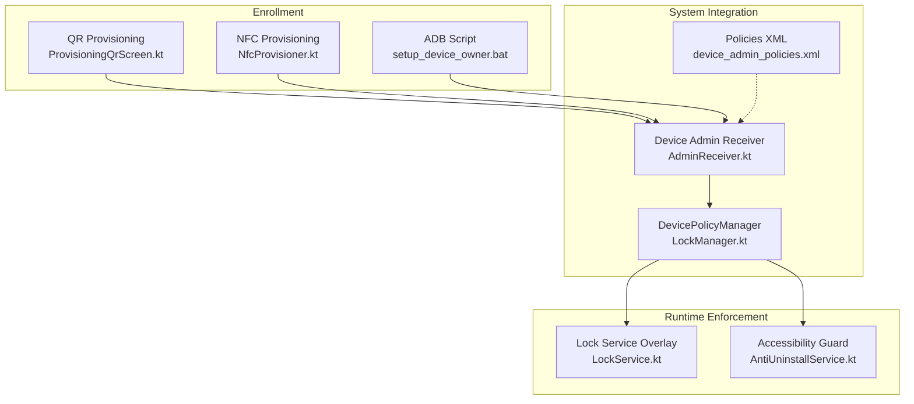
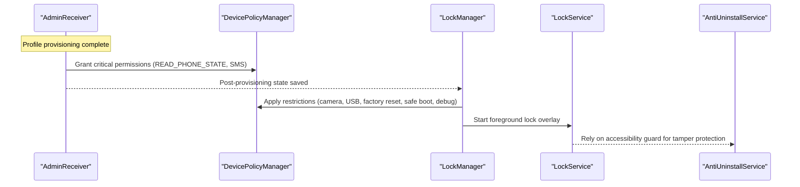
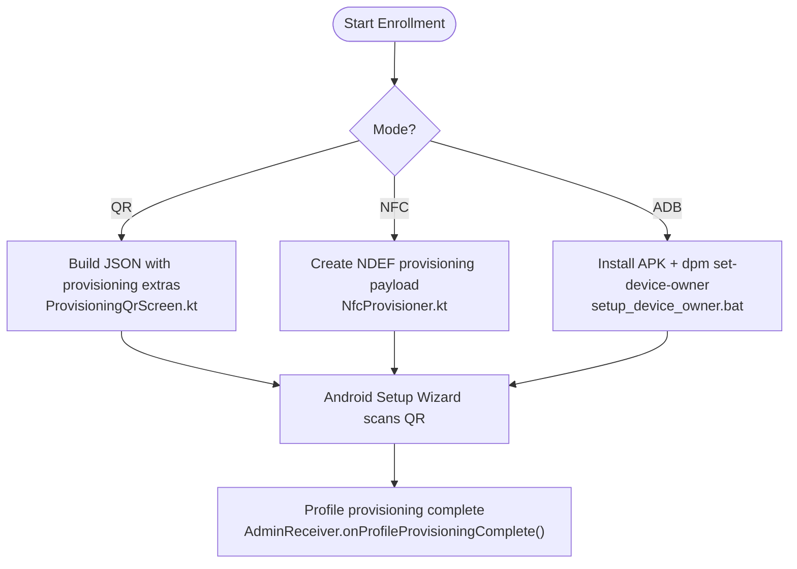
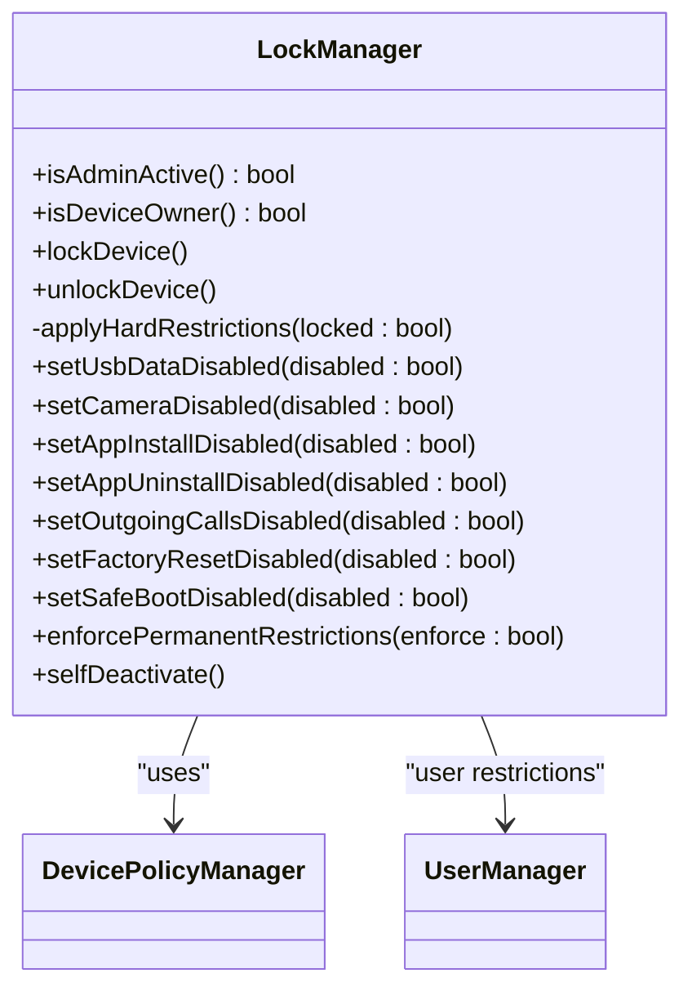
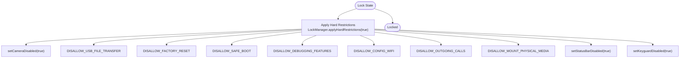
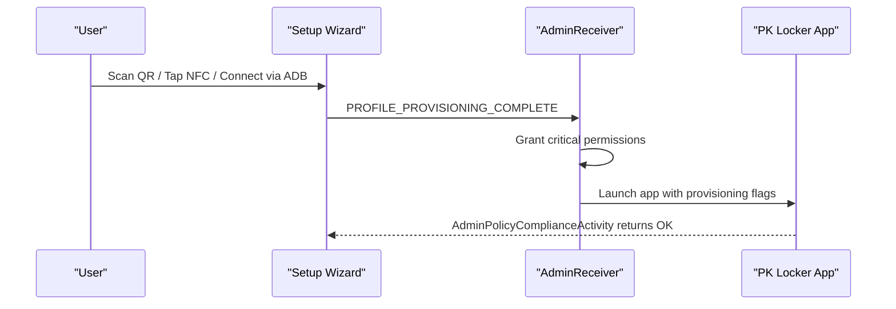
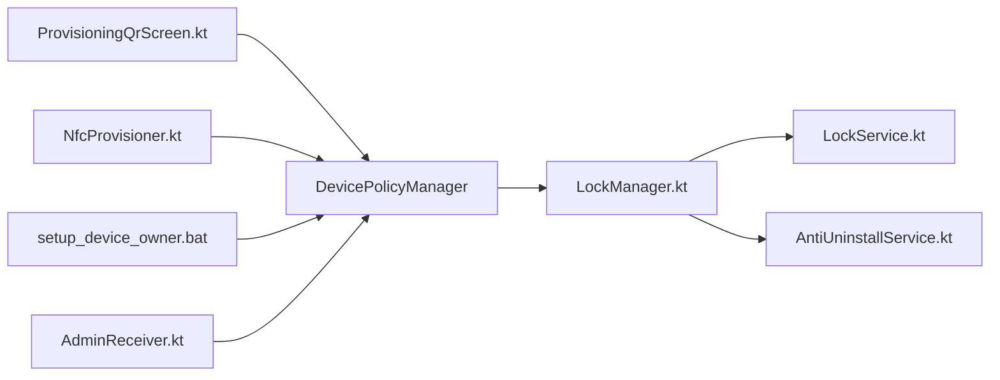

# Device Owner Security Model

<cite>
**Referenced Files in This Document**
- [AdminReceiver.kt](file://app/src/main/java/com/pksafe/lock/manager/receiver/AdminReceiver.kt)
- [device_admin_policies.xml](file://app/src/main/res/xml/device_admin_policies.xml)
- [ProvisioningQrScreen.kt](file://app/src/main/java/com/pksafe/lock/manager/ui/provisioning/ProvisioningQrScreen.kt)
- [NfcProvisioner.kt](file://app/src/main/java/com/pksafe/lock/manager/util/NfcProvisioner.kt)
- [setup_device_owner.bat](file://setup_device_owner.bat)
- [LockManager.kt](file://app/src/main/java/com/pksafe/lock/manager/util/LockManager.kt)
- [LockService.kt](file://app/src/main/java/com/pksafe/lock/manager/service/LockService.kt)
- [AntiUninstallService.kt](file://app/src/main/java/com/pksafe/lock/manager/service/AntiUninstallService.kt)
- [AndroidManifest.xml](file://app/src/main/AndroidManifest.xml)
- [AdminPolicyComplianceActivity.kt](file://app/src/main/java/com/pksafe/lock/manager/receiver/AdminPolicyComplianceActivity.kt)
</cite>

## Table of Contents
1. Introduction
2. Project Structure
3. Core Components
4. Architecture Overview
5. Detailed Component Analysis
6. Dependency Analysis
7. Performance Considerations
8. Troubleshooting Guide
9. Conclusion

## Introduction
This document explains PK Locker’s Device Owner security model for enterprise enrollment, policy enforcement, and system-level restrictions. It covers how devices are enrolled as Device Owner (via QR provisioning, NFC, or ADB), how policies are configured and enforced, and what hardware/system restrictions are applied when the device is locked. It also includes deployment considerations, security implications, and troubleshooting procedures specific to Device Owner mode.

## Project Structure
PK Locker implements Device Owner enrollment through multiple pathways:
- QR-based provisioning using Android Setup Wizard extras embedded in a QR code
- NFC-based provisioning via NDEF messages during factory setup
- ADB-based provisioning using a Windows helper script
- A fallback “Easy Customer Setup” that uses Device Admin (not Device Owner) for simpler deployments

Key components include:
- Provisioning UIs and utilities that generate QR codes and NFC payloads
- Device Admin Receiver handling provisioning completion and permission grants
- Lock Manager applying Device Policy Manager restrictions
- Foreground Lock Service overlay and anti-tamper Accessibility service
- Manifest declarations for receivers, services, and policies

**Diagram sources**
- [ProvisioningQrScreen.kt:120-158](file://app/src/main/java/com/pksafe/lock/manager/ui/provisioning/ProvisioningQrScreen.kt#L120-L158)
- [NfcProvisioner.kt:22-49](file://app/src/main/java/com/pksafe/lock/manager/util/NfcProvisioner.kt#L22-L49)
- [setup_device_owner.bat:53-56](file://setup_device_owner.bat#L53-L56)
- [LockManager.kt:27-49](file://app/src/main/java/com/pksafe/lock/manager/util/LockManager.kt#L27-L49)
- [AdminReceiver.kt:14-36](file://app/src/main/java/com/pksafe/lock/manager/receiver/AdminReceiver.kt#L14-L36)
- [device_admin_policies.xml:1-13](file://app/src/main/res/xml/device_admin_policies.xml#L1-L13)

**Section sources**
- [AndroidManifest.xml:87-99](file://app/src/main/AndroidManifest.xml#L87-L99)
- [device_admin_policies.xml:1-13](file://app/src/main/res/xml/device_admin_policies.xml#L1-L13)

## Core Components
- Device Admin Receiver: Handles admin enablement, profile provisioning completion, and critical permission grants for Device Owner apps.
- Provisioning QR Screen: Builds Android Setup Wizard provisioning payload with package info, signature checksum, and optional APK hash; supports local server or cloud distribution.
- NFC Provisioner: Creates an NDEF message with provisioning properties for tap-to-enroll on factory setup screens.
- ADB Helper Script: Installs the app and sets it as Device Owner via dpm command.
- Lock Manager: Central API to apply Device Policy Manager restrictions (camera, USB, factory reset, safe boot, debugging, status bar, keyguard).
- Lock Service: Foreground overlay enforcing lock UI and auto-lock behavior.
- Anti-Uninstall Accessibility Service: Guards against tampering and enforces settings/app blocking.

**Section sources**
- [AdminReceiver.kt:16-36](file://app/src/main/java/com/pksafe/lock/manager/receiver/AdminReceiver.kt#L16-L36)
- [ProvisioningQrScreen.kt:120-158](file://app/src/main/java/com/pksafe/lock/manager/ui/provisioning/ProvisioningQrScreen.kt#L120-L158)
- [NfcProvisioner.kt:22-49](file://app/src/main/java/com/pksafe/lock/manager/util/NfcProvisioner.kt#L22-L49)
- [setup_device_owner.bat:53-56](file://setup_device_owner.bat#L53-L56)
- [LockManager.kt:151-200](file://app/src/main/java/com/pksafe/lock/manager/util/LockManager.kt#L151-L200)
- [LockService.kt:54-80](file://app/src/main/java/com/pksafe/lock/manager/service/LockService.kt#L54-L80)
- [AntiUninstallService.kt:136-211](file://app/src/main/java/com/pksafe/lock/manager/service/AntiUninstallService.kt#L136-L211)

## Architecture Overview
The Device Owner flow integrates Android’s enterprise provisioning APIs with PK Locker’s enforcement layer:

**Diagram sources**
- [AdminReceiver.kt:23-36](file://app/src/main/java/com/pksafe/lock/manager/receiver/AdminReceiver.kt#L23-L36)
- [AdminReceiver.kt:43-60](file://app/src/main/java/com/pksafe/lock/manager/receiver/AdminReceiver.kt#L43-L60)
- [LockManager.kt:111-148](file://app/src/main/java/com/pksafe/lock/manager/util/LockManager.kt#L111-L148)
- [LockService.kt:54-80](file://app/src/main/java/com/pksafe/lock/manager/service/LockService.kt#L54-L80)

## Detailed Component Analysis

### Device Owner Enrollment Paths
- QR Provisioning: Generates a JSON payload with required provisioning extras including component name, package name, download location, signature checksum, and optional package checksum. Supports local HTTP server or cloud URL.
- NFC Provisioning: Emits an NDEF message containing provisioning properties for factory setup tap-to-enroll.
- ADB Provisioning: Uses dpm set-device-owner to assign the receiver class as Device Owner after installing the APK.

**Diagram sources**
- [ProvisioningQrScreen.kt:120-158](file://app/src/main/java/com/pksafe/lock/manager/ui/provisioning/ProvisioningQrScreen.kt#L120-L158)
- [NfcProvisioner.kt:22-49](file://app/src/main/java/com/pksafe/lock/manager/util/NfcProvisioner.kt#L22-L49)
- [setup_device_owner.bat:53-56](file://setup_device_owner.bat#L53-L56)
- [AdminReceiver.kt:23-36](file://app/src/main/java/com/pksafe/lock/manager/receiver/AdminReceiver.kt#L23-L36)

**Section sources**
- [ProvisioningQrScreen.kt:120-158](file://app/src/main/java/com/pksafe/lock/manager/ui/provisioning/ProvisioningQrScreen.kt#L120-L158)
- [NfcProvisioner.kt:22-49](file://app/src/main/java/com/pksafe/lock/manager/util/NfcProvisioner.kt#L22-L49)
- [setup_device_owner.bat:5-22](file://setup_device_owner.bat#L5-L22)

### Policy Configuration and Enforcement
- Device Admin Policies: Declares capabilities such as force-lock, limit-password, wipe-data, disable-keyguard-features.
- Runtime Restrictions: Lock Manager applies granular restrictions when locked or permanently enforced, including camera disablement, USB file transfer block, factory reset block, safe boot block, debugging features block, Wi‑Fi config block, outgoing calls block, physical media mount block, status bar disablement, and keyguard disablement.
- Accessibility Guard: Prevents navigation into restricted settings and blocks certain actions based on keywords and app lists.

**Diagram sources**
- [LockManager.kt:27-49](file://app/src/main/java/com/pksafe/lock/manager/util/LockManager.kt#L27-L49)
- [LockManager.kt:151-200](file://app/src/main/java/com/pksafe/lock/manager/util/LockManager.kt#L151-L200)
- [LockManager.kt:202-261](file://app/src/main/java/com/pksafe/lock/manager/util/LockManager.kt#L202-L261)
- [LockManager.kt:299-315](file://app/src/main/java/com/pksafe/lock/manager/util/LockManager.kt#L299-L315)

**Section sources**
- [device_admin_policies.xml:1-13](file://app/src/main/res/xml/device_admin_policies.xml#L1-L13)
- [LockManager.kt:151-200](file://app/src/main/java/com/pksafe/lock/manager/util/LockManager.kt#L151-L200)
- [AntiUninstallService.kt:136-211](file://app/src/main/java/com/pksafe/lock/manager/service/AntiUninstallService.kt#L136-L211)

### System-Level Restrictions and Hardware Controls
- Camera Disablement: Controlled via DevicePolicyManager; applied when locked or via explicit toggle.
- USB Debugging Prevention: Blocked by disabling debugging features via user restriction when Device Owner.
- Factory Reset Blocking: Enforced via user restriction when Device Owner; can be part of permanent restrictions.
- Additional Controls: Safe boot blocked, Wi‑Fi configuration disabled, outgoing calls blocked, physical media mounting blocked, status bar expansion disabled, and keyguard disabled to show custom lock UI directly.

**Diagram sources**
- [LockManager.kt:151-192](file://app/src/main/java/com/pksafe/lock/manager/util/LockManager.kt#L151-L192)

**Section sources**
- [LockManager.kt:151-200](file://app/src/main/java/com/pksafe/lock/manager/util/LockManager.kt#L151-L200)

### Administrative Controls and Lifecycle
- Admin Receiver: On enablement and provisioning completion, grants critical permissions and marks provisioning complete; launches the app to finalize setup.
- Compliance Activity: Required for Android 12+ QR provisioning; signals completion to the Setup Wizard.
- Self Deactivation: Clears all user restrictions, removes Device Owner status, and removes Device Admin so the app can be uninstalled normally.

**Diagram sources**
- [AdminReceiver.kt:23-36](file://app/src/main/java/com/pksafe/lock/manager/receiver/AdminReceiver.kt#L23-L36)
- [AdminPolicyComplianceActivity.kt:18-34](file://app/src/main/java/com/pksafe/lock/manager/receiver/AdminPolicyComplianceActivity.kt#L18-L34)

**Section sources**
- [AdminReceiver.kt:16-36](file://app/src/main/java/com/pksafe/lock/manager/receiver/AdminReceiver.kt#L16-L36)
- [AdminPolicyComplianceActivity.kt:18-34](file://app/src/main/java/com/pksafe/lock/manager/receiver/AdminPolicyComplianceActivity.kt#L18-L34)
- [LockManager.kt:351-404](file://app/src/main/java/com/pksafe/lock/manager/util/LockManager.kt#L351-L404)

### Deployment Considerations
- QR Provisioning: Requires a reachable APK source (local server or cloud). Signature checksum must match the app signing certificate; optional package checksum validates the APK content.
- NFC Provisioning: Works only on supported Android versions during factory setup; requires both devices to have NFC enabled and target device on Welcome screen.
- ADB Provisioning: Requires USB debugging enabled and no Google account added before setting Device Owner; script guides through steps and runs dpm set-device-owner.
- Permissions: Some sensitive permissions are declared but may be granted programmatically post-provisioning for Device Owner apps.

**Section sources**
- [ProvisioningQrScreen.kt:120-158](file://app/src/main/java/com/pksafe/lock/manager/ui/provisioning/ProvisioningQrScreen.kt#L120-L158)
- [NfcProvisioner.kt:22-49](file://app/src/main/java/com/pksafe/lock/manager/util/NfcProvisioner.kt#L22-L49)
- [setup_device_owner.bat:5-22](file://setup_device_owner.bat#L5-L22)
- [AndroidManifest.xml:5-23](file://app/src/main/AndroidManifest.xml#L5-L23)

## Dependency Analysis
PK Locker’s Device Owner model depends on Android’s enterprise APIs and internal services:

**Diagram sources**
- [ProvisioningQrScreen.kt:120-158](file://app/src/main/java/com/pksafe/lock/manager/ui/provisioning/ProvisioningQrScreen.kt#L120-L158)
- [NfcProvisioner.kt:22-49](file://app/src/main/java/com/pksafe/lock/manager/util/NfcProvisioner.kt#L22-L49)
- [setup_device_owner.bat:53-56](file://setup_device_owner.bat#L53-L56)
- [LockManager.kt:27-49](file://app/src/main/java/com/pksafe/lock/manager/util/LockManager.kt#L27-L49)
- [AdminReceiver.kt:43-60](file://app/src/main/java/com/pksafe/lock/manager/receiver/AdminReceiver.kt#L43-L60)

**Section sources**
- [LockManager.kt:27-49](file://app/src/main/java/com/pksafe/lock/manager/util/LockManager.kt#L27-L49)
- [AndroidManifest.xml:87-112](file://app/src/main/AndroidManifest.xml#L87-L112)

## Performance Considerations
- Restriction Application: Applying many user restrictions at once is efficient; ensure they are toggled in batches during lock/unlock to minimize overhead.
- Overlay and Services: LockService runs as a foreground service with a persistent notification; keep UI updates minimal and avoid heavy work on the main thread.
- Network Calls: Remote data refresh occurs in background coroutines; cache results locally to reduce network usage.
- Accessibility Monitoring: AntiUninstallService scans view trees; avoid excessive logging in production to reduce CPU usage.

[No sources needed since this section provides general guidance]

## Troubleshooting Guide
Common issues and resolutions for Device Owner mode:

- QR Provisioning Fails
  - Ensure APK URL is reachable and signature checksum matches the app’s signing certificate.
  - Verify network connectivity on the target device and that mobile data/Wi‑Fi is allowed per provisioning flags.

- NFC Provisioning Not Triggered
  - Confirm NFC is enabled on both devices and target device is on the Welcome screen.
  - Some Android versions deprecate NFC beam APIs; verify device support.

- ADB Provisioning Errors
  - Ensure USB debugging is enabled and device authorized.
  - Remove any existing Google accounts before setting Device Owner; perform a factory reset if another owner exists.

- Restrictions Not Applied
  - Confirm Device Owner status and that Admin Receiver is active.
  - Check that LockManager methods are invoked and DevicePolicyManager calls succeed.

- Cannot Uninstall or Bypass
  - Use self-deactivation flow to clear restrictions and remove Device Owner/Admin privileges.
  - If stuck, factory reset will remove Device Owner; re-enroll afterward.

**Section sources**
- [setup_device_owner.bat:58-81](file://setup_device_owner.bat#L58-L81)
- [LockManager.kt:351-404](file://app/src/main/java/com/pksafe/lock/manager/util/LockManager.kt#L351-L404)
- [ProvisioningQrScreen.kt:120-158](file://app/src/main/java/com/pksafe/lock/manager/ui/provisioning/ProvisioningQrScreen.kt#L120-L158)
- [NfcProvisioner.kt:22-49](file://app/src/main/java/com/pksafe/lock/manager/util/NfcProvisioner.kt#L22-L49)

## Conclusion
PK Locker’s Device Owner security model leverages Android’s enterprise provisioning APIs to enroll devices securely and enforce strong system-level restrictions. Through QR, NFC, and ADB enrollment paths, administrators can deploy consistent policies that block camera access, prevent USB debugging and factory resets, restrict system changes, and maintain a persistent lock overlay. Proper deployment practices—validating signatures, ensuring network availability, and following pre-enrollment steps—are essential for reliable operation. The provided troubleshooting guidance addresses common pitfalls and recovery paths to maintain control over managed devices.