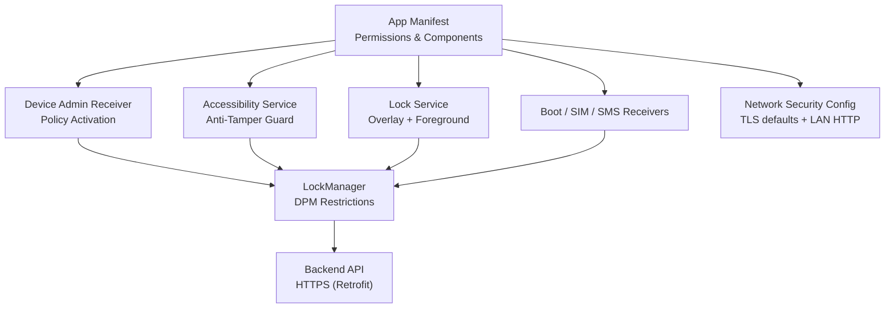
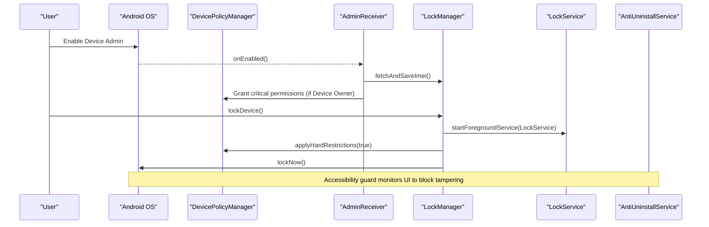
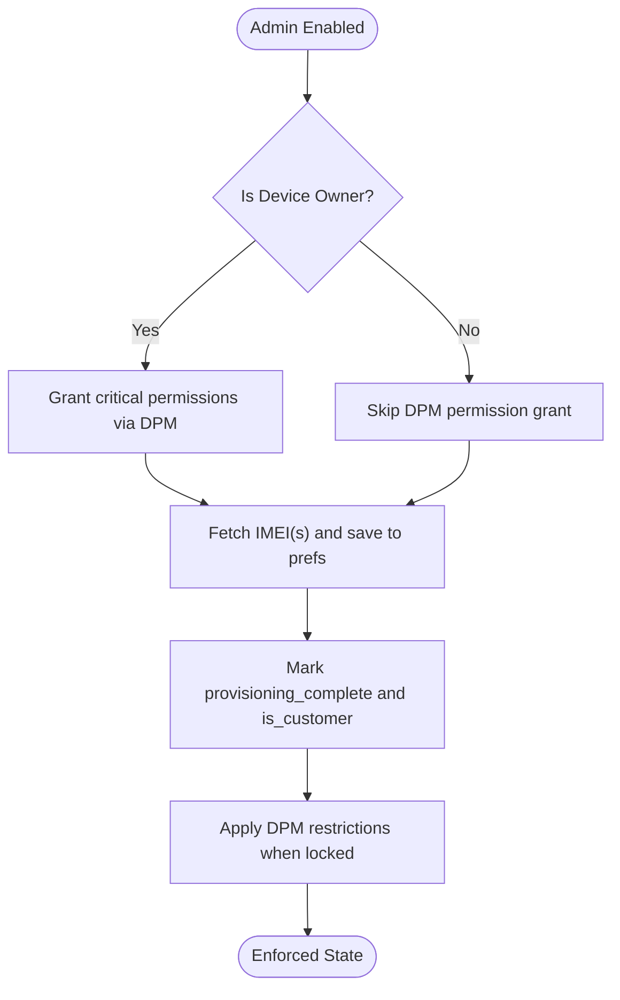
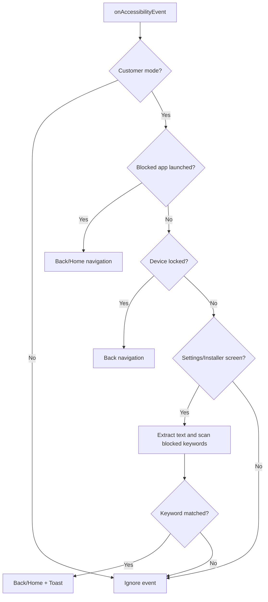
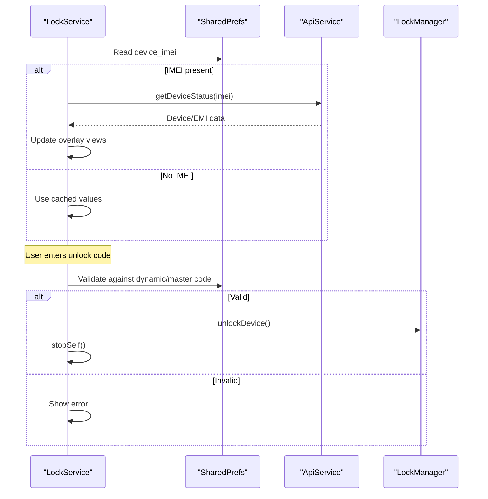
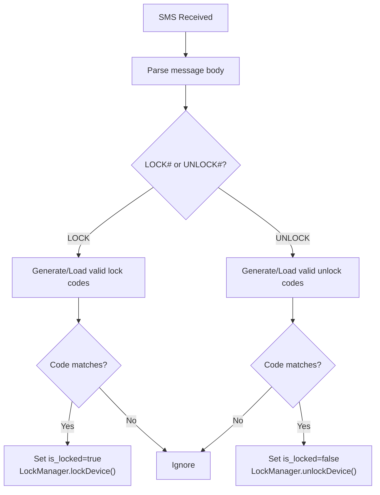
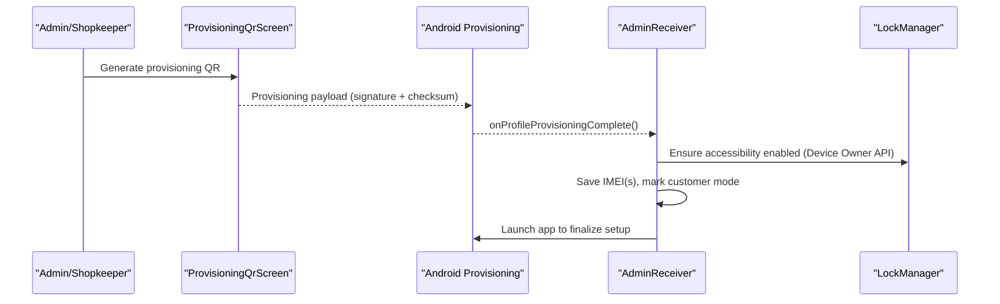
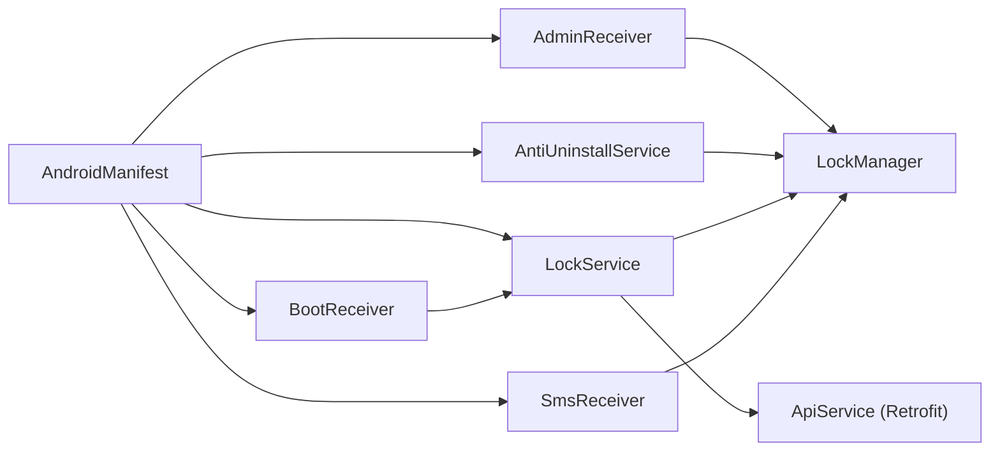

# Security Architecture

<cite>
**Referenced Files in This Document**
- [AndroidManifest.xml](file://app/src/main/AndroidManifest.xml)
- [AdminReceiver.kt](file://app/src/main/java/com/pksafe/lock/manager/receiver/AdminReceiver.kt)
- [device_admin_policies.xml](file://app/src/main/res/xml/device_admin_policies.xml)
- [accessibility_service_config.xml](file://app/src/main/res/xml/accessibility_service_config.xml)
- [AntiUninstallService.kt](file://app/src/main/java/com/pksafe/lock/manager/service/AntiUninstallService.kt)
- [LockManager.kt](file://app/src/main/java/com/pksafe/lock/manager/util/LockManager.kt)
- [LockService.kt](file://app/src/main/java/com/pksafe/lock/manager/service/LockService.kt)
- [BootReceiver.kt](file://app/src/main/java/com/pksafe/lock/manager/receiver/BootReceiver.kt)
- [SmsReceiver.kt](file://app/src/main/java/com/pksafe/lock/manager/receiver/SmsReceiver.kt)
- [ApiService.kt](file://app/src/main/java/com/pksafe/lock/manager/data/ApiService.kt)
- [network_security_config.xml](file://app/src/main/res/xml/network_security_config.xml)
- [Constants.kt](file://app/src/main/java/com/pksafe/lock/manager/util/Constants.kt)
- [ProvisioningQrScreen.kt](file://app/src/main/java/com/pksafe/lock/manager/ui/provisioning/ProvisioningQrScreen.kt)
</cite>

## Table of Contents
1. [Introduction](#introduction)
2. [Project Structure](#project-structure)
3. [Core Components](#core-components)
4. [Architecture Overview](#architecture-overview)
5. [Detailed Component Analysis](#detailed-component-analysis)
6. [Dependency Analysis](#dependency-analysis)
7. [Performance Considerations](#performance-considerations)
8. [Troubleshooting Guide](#troubleshooting-guide)
9. [Conclusion](#conclusion)
10. [Appendices](#appendices)

## Introduction
This document describes PK Locker’s multi-layered security architecture for enterprise-grade device protection. It covers Device Owner mode, Accessibility Service integration for anti-tampering and policy enforcement, and Device Admin policies that restrict system behavior. It explains the trust model between admin (shopkeeper) and customer modes, secure communication channels, data handling strategies, threat analysis, vulnerability mitigations, and compliance considerations for enterprise deployments.

## Project Structure
PK Locker implements a layered security model:
- Hardware-level restrictions via Android Device Policy Manager (DPM) when running as Device Owner or Device Admin.
- System-level enforcement through persistent services and receivers that survive reboots and network changes.
- Application-level protections using an Accessibility Service to block tampering actions and enforce app visibility controls.
- Secure communications with backend APIs over HTTPS, with controlled cleartext exceptions for local private networks.

**Diagram sources**
- [AndroidManifest.xml:36-155](file://app/src/main/AndroidManifest.xml#L36-L155)
- [AdminReceiver.kt:14-103](file://app/src/main/java/com/pksafe/lock/manager/receiver/AdminReceiver.kt#L14-L103)
- [AntiUninstallService.kt:22-224](file://app/src/main/java/com/pksafe/lock/manager/service/AntiUninstallService.kt#L22-L224)
- [LockService.kt:41-330](file://app/src/main/java/com/pksafe/lock/manager/service/LockService.kt#L41-L330)
- [BootReceiver.kt:10-27](file://app/src/main/java/com/pksafe/lock/manager/receiver/BootReceiver.kt#L10-L27)
- [SmsReceiver.kt:29-164](file://app/src/main/java/com/pksafe/lock/manager/receiver/SmsReceiver.kt#L29-L164)
- [LockManager.kt:27-406](file://app/src/main/java/com/pksafe/lock/manager/util/LockManager.kt#L27-L406)
- [network_security_config.xml:9-27](file://app/src/main/res/xml/network_security_config.xml#L9-L27)

**Section sources**
- [AndroidManifest.xml:36-155](file://app/src/main/AndroidManifest.xml#L36-L155)
- [network_security_config.xml:9-27](file://app/src/main/res/xml/network_security_config.xml#L9-L27)

## Core Components
- Device Admin Receiver: Activates device policies, grants critical permissions when in Device Owner mode, captures IMEI, and transitions provisioning to customer mode.
- LockManager: Central orchestrator for applying hardware/system restrictions via DPM, enabling accessibility service via enterprise APIs, locking/unlocking device state, and self-deactivation flow.
- AntiUninstallService (Accessibility): Monitors UI events to block tampering paths (settings, uninstallers), enforces app blocking, and triggers auto-lock on connectivity loss.
- LockService: Persistent foreground service that renders a lock overlay, validates unlock codes, and coordinates unlocking by clearing restrictions.
- Boot/SIM/SMS Receivers: Ensure persistence across reboots, react to SIM changes, and support offline lock/unlock via SMS with deterministic code verification.
- Network Security: Enforces TLS by default; allows HTTP only for private IP ranges used for local device-to-device communication.

**Section sources**
- [AdminReceiver.kt:14-103](file://app/src/main/java/com/pksafe/lock/manager/receiver/AdminReceiver.kt#L14-L103)
- [LockManager.kt:27-406](file://app/src/main/java/com/pksafe/lock/manager/util/LockManager.kt#L27-L406)
- [AntiUninstallService.kt:22-224](file://app/src/main/java/com/pksafe/lock/manager/service/AntiUninstallService.kt#L22-L224)
- [LockService.kt:41-330](file://app/src/main/java/com/pksafe/lock/manager/service/LockService.kt#L41-L330)
- [BootReceiver.kt:10-27](file://app/src/main/java/com/pksafe/lock/manager/receiver/BootReceiver.kt#L10-L27)
- [SmsReceiver.kt:29-164](file://app/src/main/java/com/pksafe/lock/manager/receiver/SmsReceiver.kt#L29-L164)
- [network_security_config.xml:9-27](file://app/src/main/res/xml/network_security_config.xml#L9-L27)

## Architecture Overview
The security architecture is layered from hardware to application:
- Hardware/System Layer: DPM-based restrictions disable USB file transfer, factory reset, safe boot, debugging features, camera, status bar expansion, and keyguard bypass where supported.
- Enforcement Layer: LockService provides a persistent overlay and notification; AntiUninstallService intercepts user interactions to prevent tampering and enforces app visibility and settings restrictions.
- Communication Layer: Backend API calls use HTTPS; local private networks may use HTTP per explicit configuration.
- Persistence Layer: Boot and SIM receivers ensure services restart and state is preserved; SMS receiver supports offline lock/unlock flows.

**Diagram sources**
- [AdminReceiver.kt:16-103](file://app/src/main/java/com/pksafe/lock/manager/receiver/AdminReceiver.kt#L16-L103)
- [LockManager.kt:111-192](file://app/src/main/java/com/pksafe/lock/manager/util/LockManager.kt#L111-L192)
- [LockService.kt:50-80](file://app/src/main/java/com/pksafe/lock/manager/service/LockService.kt#L50-L80)
- [AntiUninstallService.kt:136-211](file://app/src/main/java/com/pksafe/lock/manager/service/AntiUninstallService.kt#L136-L211)

## Detailed Component Analysis

### Device Owner Mode and Admin Policies
- Device Owner activation path: AdminReceiver handles provisioning completion, sets flags to mark customer mode, and ensures critical permissions are granted when the app is Device Owner.
- Policy set: The declared device-admin policies include force-lock, password limits, login watch, reset-password, wipe-data, expire-password, and disabling keyguard features.
- Enforcement: LockManager applies DPM restrictions such as disabling USB file transfer, factory reset, safe boot, debugging features, Wi-Fi config changes, outgoing calls, mounting physical media, status bar expansion, and keyguard bypass. It also exposes granular controls for camera, app install/uninstall, and permanent restriction enforcement.

**Diagram sources**
- [AdminReceiver.kt:16-103](file://app/src/main/java/com/pksafe/lock/manager/receiver/AdminReceiver.kt#L16-L103)
- [device_admin_policies.xml:1-13](file://app/src/main/res/xml/device_admin_policies.xml#L1-L13)
- [LockManager.kt:151-192](file://app/src/main/java/com/pksafe/lock/manager/util/LockManager.kt#L151-L192)

**Section sources**
- [AdminReceiver.kt:16-103](file://app/src/main/java/com/pksafe/lock/manager/receiver/AdminReceiver.kt#L16-L103)
- [device_admin_policies.xml:1-13](file://app/src/main/res/xml/device_admin_policies.xml#L1-L13)
- [LockManager.kt:151-192](file://app/src/main/java/com/pksafe/lock/manager/util/LockManager.kt#L151-L192)

### Accessibility Service Integration (Anti-Tampering)
- Event monitoring: AntiUninstallService listens for window state/content changes and view interactions to detect attempts to access Settings, package installer, or other tampering surfaces.
- Keyword filtering: Blocks screens containing sensitive keywords related to uninstallation, developer options, factory reset, etc., by navigating back/home and showing a warning.
- App blocking: Uses a mapping to hide known apps (e.g., messaging, social, browsers) when configured, falling back to SharedPrefs-based blocking if not Device Owner.
- Auto-lock trigger: Listens for connectivity changes and locks the device when offline and auto-lock is enabled.

**Diagram sources**
- [AntiUninstallService.kt:136-211](file://app/src/main/java/com/pksafe/lock/manager/service/AntiUninstallService.kt#L136-L211)

**Section sources**
- [AntiUninstallService.kt:22-224](file://app/src/main/java/com/pksafe/lock/manager/service/AntiUninstallService.kt#L22-L224)
- [accessibility_service_config.xml:1-8](file://app/src/main/res/xml/accessibility_service_config.xml#L1-L8)

### Lock Overlay and Unlock Flow
- LockService runs as a foreground service with a persistent overlay, preventing navigation away while locked.
- Unlock validation uses a dynamic master code derived from stored IMEI (last 6 digits) with a fallback constant; successful unlock clears restrictions and stops the service.
- Live refresh: On startup, it fetches fresh EMI and shop details from the backend and updates the overlay.

**Diagram sources**
- [LockService.kt:50-80](file://app/src/main/java/com/pksafe/lock/manager/service/LockService.kt#L50-L80)
- [LockService.kt:125-234](file://app/src/main/java/com/pksafe/lock/manager/service/LockService.kt#L125-L234)
- [LockService.kt:240-314](file://app/src/main/java/com/pksafe/lock/manager/service/LockService.kt#L240-L314)
- [ApiService.kt:101-109](file://app/src/main/java/com/pksafe/lock/manager/data/ApiService.kt#L101-L109)

**Section sources**
- [LockService.kt:50-330](file://app/src/main/java/com/pksafe/lock/manager/service/LockService.kt#L50-L330)

### Offline SMS Lock/Unlock
- SmsReceiver processes incoming SMS messages and verifies commands using deterministic SHA-256 codes derived from IMEI prefixes (LOCK/UNLOCK).
- Supports both backend-provided codes and generated codes based on stored IMEIs, enabling offline control without internet.
- Upon valid command, it toggles lock state and invokes LockManager to enforce or clear restrictions.

**Diagram sources**
- [SmsReceiver.kt:29-164](file://app/src/main/java/com/pksafe/lock/manager/receiver/SmsReceiver.kt#L29-L164)
- [LockManager.kt:111-148](file://app/src/main/java/com/pksafe/lock/manager/util/LockManager.kt#L111-L148)

**Section sources**
- [SmsReceiver.kt:29-164](file://app/src/main/java/com/pksafe/lock/manager/receiver/SmsReceiver.kt#L29-L164)

### Provisioning and Trust Model
- QR-based provisioning constructs a Device Owner provisioning payload including signature checksum and optional APK checksum, ensuring integrity of the installed package during setup.
- After provisioning completes, AdminReceiver marks the device as customer mode and saves identifiers, establishing the trust boundary between admin-managed devices and customer-owned devices.

**Diagram sources**
- [ProvisioningQrScreen.kt:131-155](file://app/src/main/java/com/pksafe/lock/manager/ui/provisioning/ProvisioningQrScreen.kt#L131-L155)
- [AdminReceiver.kt:23-103](file://app/src/main/java/com/pksafe/lock/manager/receiver/AdminReceiver.kt#L23-L103)
- [LockManager.kt:81-108](file://app/src/main/java/com/pksafe/lock/manager/util/LockManager.kt#L81-L108)

**Section sources**
- [ProvisioningQrScreen.kt:131-155](file://app/src/main/java/com/pksafe/lock/manager/ui/provisioning/ProvisioningQrScreen.kt#L131-L155)
- [AdminReceiver.kt:23-103](file://app/src/main/java/com/pksafe/lock/manager/receiver/AdminReceiver.kt#L23-L103)

## Dependency Analysis
Key runtime dependencies and relationships:
- AndroidManifest declares components and permissions required for device administration, accessibility, overlays, boot/SIM/SMS handling, and network access.
- LockManager depends on DevicePolicyManager and UserManager to apply restrictions; it also coordinates with LockService and AntiUninstallService.
- AntiUninstallService depends on Accessibility APIs and ConnectivityManager to monitor and respond to system events.
- LockService depends on WindowManager for overlay rendering and Retrofit/ApiService for backend communication.
- Receivers depend on LockManager to enforce state changes based on system events.

**Diagram sources**
- [AndroidManifest.xml:36-155](file://app/src/main/AndroidManifest.xml#L36-L155)
- [AdminReceiver.kt:14-103](file://app/src/main/java/com/pksafe/lock/manager/receiver/AdminReceiver.kt#L14-L103)
- [AntiUninstallService.kt:22-224](file://app/src/main/java/com/pksafe/lock/manager/service/AntiUninstallService.kt#L22-L224)
- [LockService.kt:41-330](file://app/src/main/java/com/pksafe/lock/manager/service/LockService.kt#L41-L330)
- [BootReceiver.kt:10-27](file://app/src/main/java/com/pksafe/lock/manager/receiver/BootReceiver.kt#L10-L27)
- [SmsReceiver.kt:29-164](file://app/src/main/java/com/pksafe/lock/manager/receiver/SmsReceiver.kt#L29-L164)
- [ApiService.kt:11-185](file://app/src/main/java/com/pksafe/lock/manager/data/ApiService.kt#L11-L185)

**Section sources**
- [AndroidManifest.xml:36-155](file://app/src/main/AndroidManifest.xml#L36-L155)
- [ApiService.kt:11-185](file://app/src/main/java/com/pksafe/lock/manager/data/ApiService.kt#L11-L185)

## Performance Considerations
- Accessibility scanning: Extracting full view trees can be CPU-intensive; limit scope and recycle nodes promptly to avoid jank.
- Foreground service: LockService keeps a persistent overlay and notification; ensure minimal work on the main thread and offload network calls to background threads.
- DPM operations: Applying multiple restrictions at once reduces repeated overhead; batch operations where possible.
- Network calls: Cache responses locally when appropriate and debounce frequent requests to reduce battery and bandwidth usage.

[No sources needed since this section provides general guidance]

## Troubleshooting Guide
- Device Owner not active: Ensure AdminReceiver is enabled and provisioning completed; verify DPM checks and that critical permissions were granted.
- Accessibility service not starting: Confirm Device Owner enables the service via secure settings; check logs for failures and fall back to direct settings writes if necessary.
- Overlay not visible: Verify overlay permission and that LockService started as foreground; confirm boot receiver starts the service after reboot.
- SMS lock/unlock not working: Validate IMEI storage and code generation logic; ensure SMS permissions and broadcast priority are correct.
- Network issues: Confirm network security configuration and base URL; verify HTTPS endpoints and allowed domains for local HTTP.

**Section sources**
- [AdminReceiver.kt:16-103](file://app/src/main/java/com/pksafe/lock/manager/receiver/AdminReceiver.kt#L16-L103)
- [LockManager.kt:81-108](file://app/src/main/java/com/pksafe/lock/manager/util/LockManager.kt#L81-L108)
- [BootReceiver.kt:10-27](file://app/src/main/java/com/pksafe/lock/manager/receiver/BootReceiver.kt#L10-L27)
- [SmsReceiver.kt:29-164](file://app/src/main/java/com/pksafe/lock/manager/receiver/SmsReceiver.kt#L29-L164)
- [network_security_config.xml:9-27](file://app/src/main/res/xml/network_security_config.xml#L9-L27)
- [Constants.kt:3-10](file://app/src/main/java/com/pksafe/lock/manager/util/Constants.kt#L3-L10)

## Conclusion
PK Locker employs a robust, multi-layered security model combining Device Owner privileges, Accessibility-driven anti-tampering, persistent services, and secure communications. The trust model separates admin-managed provisioning from customer-mode enforcement, ensuring strong controls over device capabilities and user interactions. With careful implementation of DPM restrictions, overlay enforcement, and resilient offline controls, PK Locker provides enterprise-grade protection suitable for deployment in managed environments.

[No sources needed since this section summarizes without analyzing specific files]

## Appendices

### Threat Analysis and Mitigations
- Tampering via Settings/Installers: Mitigated by Accessibility keyword detection and global navigation actions to block access.
- Factory Reset/Safe Boot/ADB bypass: Mitigated by DPM user restrictions when Device Owner; permanent enforcement available for critical controls.
- Uninstall prevention: Device Owner and Accessibility guard together deter removal; self-deactivation flow requires explicit administrative action.
- Unauthorized remote control: SMS codes are deterministic and tied to IMEI; backend tokens protect API endpoints.
- Network interception: HTTPS enforced by default; HTTP allowed only for private ranges explicitly configured.

[No sources needed since this section provides general guidance]

### Compliance Considerations
- Data minimization: Store only necessary identifiers (IMEI) and lock state; avoid unnecessary personal data retention.
- Transparency: Provide clear explanations for Device Admin and Accessibility permissions; log and audit policy changes.
- Least privilege: Restrict permissions to those required for enforcement; avoid broad system access outside of Device Owner contexts.
- Auditability: Log policy activations, restriction changes, and unlock attempts for incident response.

[No sources needed since this section provides general guidance]