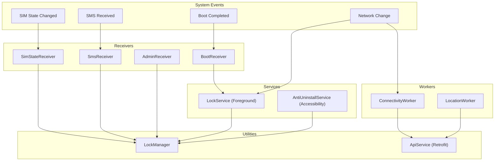
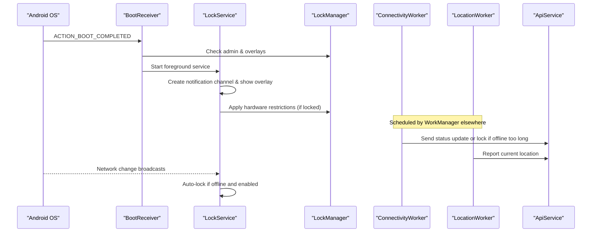
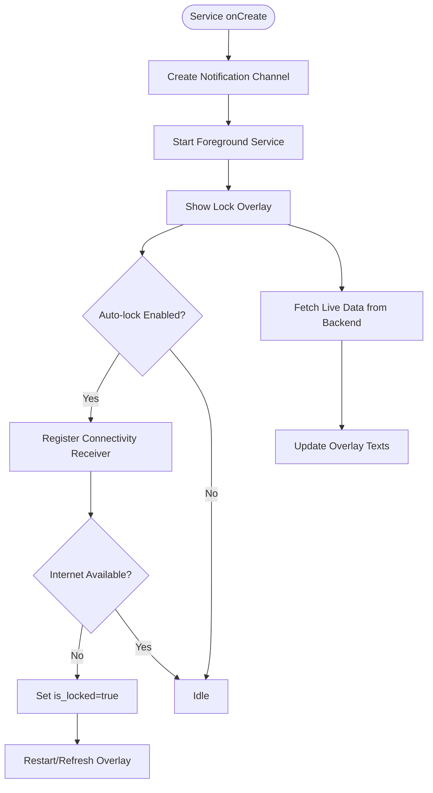
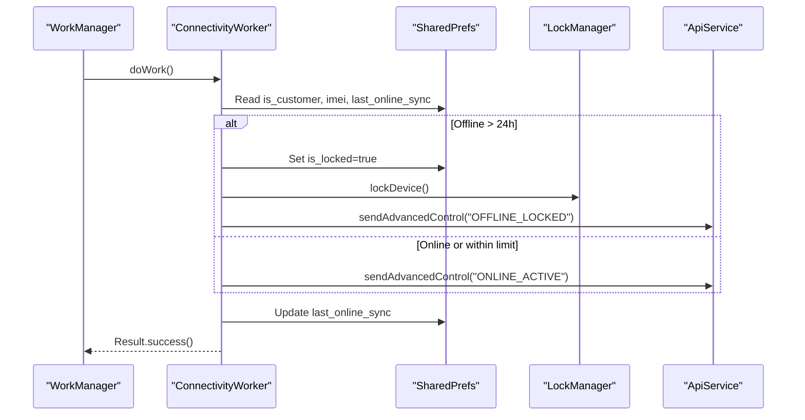
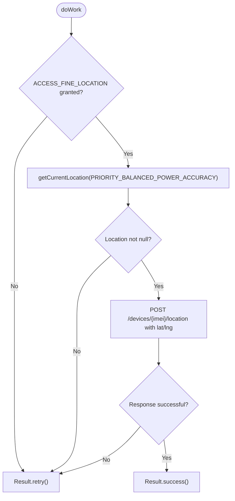
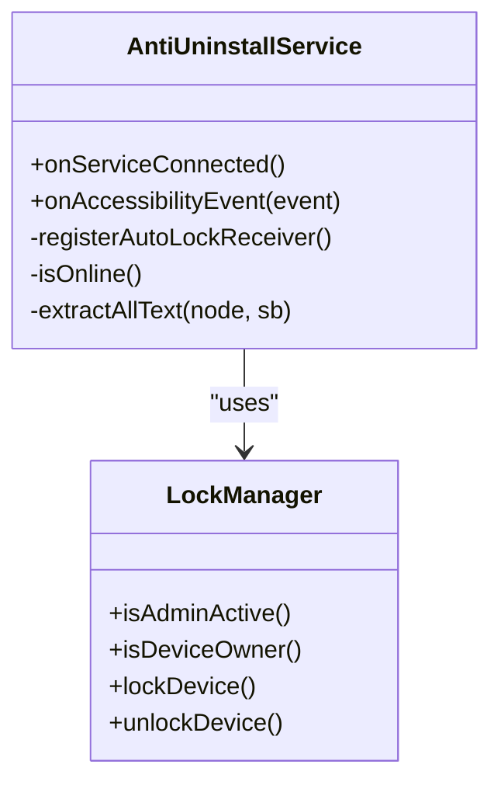
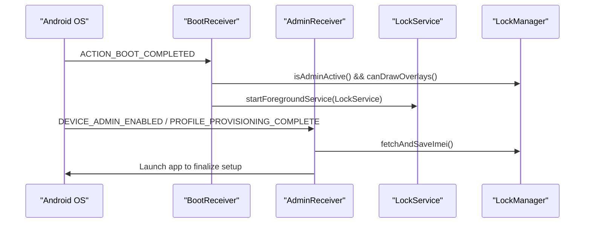
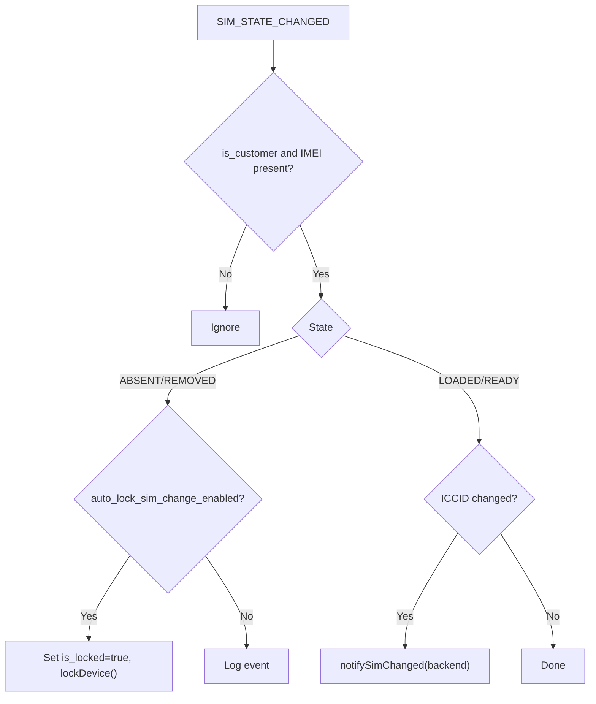
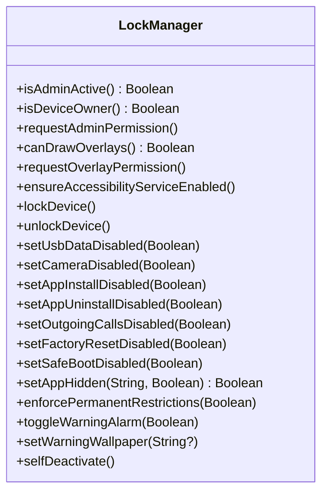
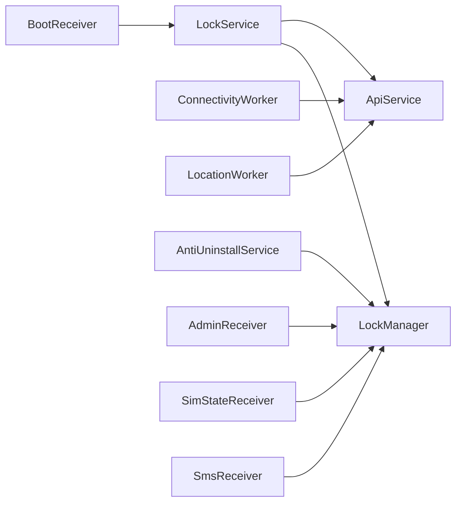

# Background Services

<cite>
**Referenced Files in This Document**
- [LockService.kt](file://app/src/main/java/com/pksafe/lock/manager/service/LockService.kt)
- [ConnectivityWorker.kt](file://app/src/main/java/com/pksafe/lock/manager/service/ConnectivityWorker.kt)
- [LocationWorker.kt](file://app/src/main/java/com/pksafe/lock/manager/worker/LocationWorker.kt)
- [BootReceiver.kt](file://app/src/main/java/com/pksafe/lock/manager/receiver/BootReceiver.kt)
- [AdminReceiver.kt](file://app/src/main/java/com/pksafe/lock/manager/receiver/AdminReceiver.kt)
- [SimStateReceiver.kt](file://app/src/main/java/com/pksafe/lock/manager/receiver/SimStateReceiver.kt)
- [SmsReceiver.kt](file://app/src/main/java/com/pksafe/lock/manager/receiver/SmsReceiver.kt)
- [AntiUninstallService.kt](file://app/src/main/java/com/pksafe/lock/manager/service/AntiUninstallService.kt)
- [LockManager.kt](file://app/src/main/java/com/pksafe/lock/manager/util/LockManager.kt)
- [ApiService.kt](file://app/src/main/java/com/pksafe/lock/manager/data/ApiService.kt)
- [AndroidManifest.xml](file://app/src/main/AndroidManifest.xml)
- [Constants.kt](file://app/src/main/java/com/pksafe/lock/manager/util/Constants.kt)
</cite>

## Table of Contents
1. [Introduction](#introduction)
2. [Project Structure](#project-structure)
3. [Core Components](#core-components)
4. [Architecture Overview](#architecture-overview)
5. [Detailed Component Analysis](#detailed-component-analysis)
6. [Dependency Analysis](#dependency-analysis)
7. [Performance Considerations](#performance-considerations)
8. [Troubleshooting Guide](#troubleshooting-guide)
9. [Conclusion](#conclusion)

## Introduction
This document explains PK Locker’s background services that enable persistent, system-level device monitoring and control. It covers:
- Foreground LockService for continuous lockdown with an overlay UI
- Connectivity workers that detect network changes and synchronize status with the backend
- Location tracking workers to capture and report GPS coordinates
- Service lifecycle management across Android versions
- Battery optimization and system constraints handling
- Configuration, state persistence, and inter-process communication patterns
- Troubleshooting, debugging, and performance strategies for reliable background operation

## Project Structure
PK Locker organizes background functionality into services, receivers, workers, and utilities:
- Services: LockService (foreground lock overlay), AntiUninstallService (accessibility guard), MyFirebaseMessagingService (not analyzed here)
- Receivers: BootReceiver, AdminReceiver, SimStateReceiver, SmsReceiver
- Workers: ConnectivityWorker, LocationWorker
- Utilities: LockManager (device policy enforcement), ApiService (Retrofit endpoints), Constants (server URLs)
- Manifest: Declares services, receivers, permissions, and foreground service types

**Diagram sources**
- [AndroidManifest.xml:73-140](file://app/src/main/AndroidManifest.xml#L73-L140)
- [BootReceiver.kt:10-26](file://app/src/main/java/com/pksafe/lock/manager/receiver/BootReceiver.kt#L10-L26)
- [AdminReceiver.kt:14-36](file://app/src/main/java/com/pksafe/lock/manager/receiver/AdminReceiver.kt#L14-L36)
- [SimStateReceiver.kt:18-145](file://app/src/main/java/com/pksafe/lock/manager/receiver/SimStateReceiver.kt#L18-L145)
- [SmsReceiver.kt:29-164](file://app/src/main/java/com/pksafe/lock/manager/receiver/SmsReceiver.kt#L29-L164)
- [LockService.kt:41-329](file://app/src/main/java/com/pksafe/lock/manager/service/LockService.kt#L41-L329)
- [AntiUninstallService.kt:22-224](file://app/src/main/java/com/pksafe/lock/manager/service/AntiUninstallService.kt#L22-L224)
- [ConnectivityWorker.kt:15-72](file://app/src/main/java/com/pksafe/lock/manager/service/ConnectivityWorker.kt#L15-L72)
- [LocationWorker.kt:18-70](file://app/src/main/java/com/pksafe/lock/manager/worker/LocationWorker.kt#L18-L70)
- [LockManager.kt:27-406](file://app/src/main/java/com/pksafe/lock/manager/util/LockManager.kt#L27-L406)
- [ApiService.kt:11-185](file://app/src/main/java/com/pksafe/lock/manager/data/ApiService.kt#L11-L185)

**Section sources**
- [AndroidManifest.xml:1-160](file://app/src/main/AndroidManifest.xml#L1-L160)

## Core Components
- LockService: A sticky foreground service that displays a persistent lock overlay, enforces hardware restrictions via LockManager, and refreshes EMI/device data from the server.
- ConnectivityWorker: A WorkManager CoroutineWorker that periodically checks connectivity and syncs device status with the backend; locks the device if offline beyond a threshold.
- LocationWorker: A Worker that captures current location using FusedLocationProvider and reports it to the backend.
- AntiUninstallService: An AccessibilityService that monitors UI events to block restricted actions and enforce app/device behavior when locked or settings are blocked.
- Receivers: BootReceiver restarts LockService on boot; AdminReceiver handles device admin provisioning and IMEI capture; SimStateReceiver reacts to SIM changes; SmsReceiver processes offline lock/unlock commands via SMS.
- LockManager: Central utility to apply Device Policy Manager restrictions, start/stop LockService, and manage device owner features.
- ApiService: Retrofit interface defining backend endpoints for device control, location reporting, SIM change notifications, and more.

**Section sources**
- [LockService.kt:41-329](file://app/src/main/java/com/pksafe/lock/manager/service/LockService.kt#L41-L329)
- [ConnectivityWorker.kt:15-72](file://app/src/main/java/com/pksafe/lock/manager/service/ConnectivityWorker.kt#L15-L72)
- [LocationWorker.kt:18-70](file://app/src/main/java/com/pksafe/lock/manager/worker/LocationWorker.kt#L18-L70)
- [AntiUninstallService.kt:22-224](file://app/src/main/java/com/pksafe/lock/manager/service/AntiUninstallService.kt#L22-L224)
- [BootReceiver.kt:10-26](file://app/src/main/java/com/pksafe/lock/manager/receiver/BootReceiver.kt#L10-L26)
- [AdminReceiver.kt:14-36](file://app/src/main/java/com/pksafe/lock/manager/receiver/AdminReceiver.kt#L14-L36)
- [SimStateReceiver.kt:18-145](file://app/src/main/java/com/pksafe/lock/manager/receiver/SimStateReceiver.kt#L18-L145)
- [SmsReceiver.kt:29-164](file://app/src/main/java/com/pksafe/lock/manager/receiver/SmsReceiver.kt#L29-L164)
- [LockManager.kt:27-406](file://app/src/main/java/com/pksafe/lock/manager/util/LockManager.kt#L27-L406)
- [ApiService.kt:11-185](file://app/src/main/java/com/pksafe/lock/manager/data/ApiService.kt#L11-L185)

## Architecture Overview
The background architecture combines foreground services, accessibility guards, broadcast receivers, and background workers to ensure continuous device control and synchronization.

**Diagram sources**
- [BootReceiver.kt:10-26](file://app/src/main/java/com/pksafe/lock/manager/receiver/BootReceiver.kt#L10-L26)
- [LockService.kt:54-80](file://app/src/main/java/com/pksafe/lock/manager/service/LockService.kt#L54-L80)
- [LockManager.kt:111-148](file://app/src/main/java/com/pksafe/lock/manager/util/LockManager.kt#L111-L148)
- [ConnectivityWorker.kt:17-72](file://app/src/main/java/com/pksafe/lock/manager/service/ConnectivityWorker.kt#L17-L72)
- [LocationWorker.kt:20-70](file://app/src/main/java/com/pksafe/lock/manager/worker/LocationWorker.kt#L20-L70)
- [ApiService.kt:58-87](file://app/src/main/java/com/pksafe/lock/manager/data/ApiService.kt#L58-L87)

## Detailed Component Analysis

### LockService: Persistent Foreground Lock Overlay
Responsibilities:
- Runs as a sticky foreground service with a high-importance notification
- Displays a full-screen overlay that blocks navigation keys and keeps the screen on
- Enforces auto-lock on network loss when enabled
- Fetches live EMI/device data from the backend and updates the overlay
- Uses dynamic master unlock code derived from device IMEI stored in preferences

Key behaviors:
- Foreground service type uses special-use category on newer Android versions
- Overlay uses window flags to stay visible and handle input correctly
- Connectivity receiver triggers auto-lock when internet is lost
- Background coroutine fetches device status and formats EMI due dates

**Diagram sources**
- [LockService.kt:54-80](file://app/src/main/java/com/pksafe/lock/manager/service/LockService.kt#L54-L80)
- [LockService.kt:82-105](file://app/src/main/java/com/pksafe/lock/manager/service/LockService.kt#L82-L105)
- [LockService.kt:125-234](file://app/src/main/java/com/pksafe/lock/manager/service/LockService.kt#L125-L234)
- [LockService.kt:240-314](file://app/src/main/java/com/pksafe/lock/manager/service/LockService.kt#L240-L314)

**Section sources**
- [LockService.kt:41-329](file://app/src/main/java/com/pksafe/lock/manager/service/LockService.kt#L41-L329)

### ConnectivityWorker: Offline Detection and Sync
Responsibilities:
- Checks whether the device has been offline beyond a configured threshold
- If so, sets local lock flag and invokes LockManager to enforce device lock
- Sends periodic heartbeat/status updates to the backend when online
- Persists last sync timestamp to avoid excessive network calls

**Diagram sources**
- [ConnectivityWorker.kt:17-72](file://app/src/main/java/com/pksafe/lock/manager/service/ConnectivityWorker.kt#L17-L72)
- [ApiService.kt:58-63](file://app/src/main/java/com/pksafe/lock/manager/data/ApiService.kt#L58-L63)

**Section sources**
- [ConnectivityWorker.kt:15-72](file://app/src/main/java/com/pksafe/lock/manager/service/ConnectivityWorker.kt#L15-L72)

### LocationWorker: GPS Monitoring and Reporting
Responsibilities:
- Validates fine location permission
- Captures current location using FusedLocationProvider with balanced power accuracy
- Reports latitude and longitude to the backend
- Retries on failure or null location

**Diagram sources**
- [LocationWorker.kt:20-70](file://app/src/main/java/com/pksafe/lock/manager/worker/LocationWorker.kt#L20-L70)
- [ApiService.kt:83-87](file://app/src/main/java/com/pksafe/lock/manager/data/ApiService.kt#L83-L87)

**Section sources**
- [LocationWorker.kt:18-70](file://app/src/main/java/com/pksafe/lock/manager/worker/LocationWorker.kt#L18-L70)

### AntiUninstallService: Accessibility Guard
Responsibilities:
- Monitors UI events to block restricted actions (e.g., uninstall flows, developer options)
- Enforces app blocking based on configuration
- Triggers auto-lock on network loss when enabled
- Navigates back/home to prevent user from accessing restricted screens

**Diagram sources**
- [AntiUninstallService.kt:22-224](file://app/src/main/java/com/pksafe/lock/manager/service/AntiUninstallService.kt#L22-L224)
- [LockManager.kt:27-406](file://app/src/main/java/com/pksafe/lock/manager/util/LockManager.kt#L27-L406)

**Section sources**
- [AntiUninstallService.kt:22-224](file://app/src/main/java/com/pksafe/lock/manager/service/AntiUninstallService.kt#L22-L224)

### BootReceiver and AdminReceiver: Lifecycle and Provisioning
- BootReceiver starts LockService after boot if device admin and overlay permissions are available.
- AdminReceiver handles device admin enablement and provisioning completion, fetching IMEI and marking customer mode.

**Diagram sources**
- [BootReceiver.kt:10-26](file://app/src/main/java/com/pksafe/lock/manager/receiver/BootReceiver.kt#L10-L26)
- [AdminReceiver.kt:14-36](file://app/src/main/java/com/pksafe/lock/manager/receiver/AdminReceiver.kt#L14-L36)
- [LockService.kt:54-80](file://app/src/main/java/com/pksafe/lock/manager/service/LockService.kt#L54-L80)

**Section sources**
- [BootReceiver.kt:10-26](file://app/src/main/java/com/pksafe/lock/manager/receiver/BootReceiver.kt#L10-L26)
- [AdminReceiver.kt:14-36](file://app/src/main/java/com/pksafe/lock/manager/receiver/AdminReceiver.kt#L14-L36)

### SimStateReceiver and SmsReceiver: Telephony-Based Controls
- SimStateReceiver detects SIM removal/change and can auto-lock based on configuration; notifies backend of SIM changes.
- SmsReceiver supports offline lock/unlock via SMS with deterministic codes derived from IMEI; aborts broadcasts to hide messages from default apps.

**Diagram sources**
- [SimStateReceiver.kt:18-145](file://app/src/main/java/com/pksafe/lock/manager/receiver/SimStateReceiver.kt#L18-L145)
- [ApiService.kt:77-81](file://app/src/main/java/com/pksafe/lock/manager/data/ApiService.kt#L77-L81)

**Section sources**
- [SimStateReceiver.kt:18-145](file://app/src/main/java/com/pksafe/lock/manager/receiver/SimStateReceiver.kt#L18-L145)
- [SmsReceiver.kt:29-164](file://app/src/main/java/com/pksafe/lock/manager/receiver/SmsReceiver.kt#L29-L164)

### LockManager: Device Policy Enforcement
Responsibilities:
- Starts/stops LockService and applies hardware restrictions via DevicePolicyManager
- Manages device owner features such as disabling USB file transfer, factory reset, safe boot, ADB/debugging, and status bar expansion
- Provides methods to hide apps, toggle alarms/wallpaper, and self-deactivate privileges

**Diagram sources**
- [LockManager.kt:27-406](file://app/src/main/java/com/pksafe/lock/manager/util/LockManager.kt#L27-L406)

**Section sources**
- [LockManager.kt:27-406](file://app/src/main/java/com/pksafe/lock/manager/util/LockManager.kt#L27-L406)

## Dependency Analysis
- LockService depends on LockManager for hardware restrictions and on ApiService for live data refresh.
- ConnectivityWorker and LocationWorker depend on ApiService to communicate with the backend.
- AntiUninstallService depends on LockManager to trigger locks/unlocks and on system APIs to monitor UI events.
- Receivers coordinate with LockManager and/or services to enforce policies based on telephony and boot events.
- AndroidManifest declares all components and required permissions, including foreground service types and accessibility service metadata.

**Diagram sources**
- [LockService.kt:41-329](file://app/src/main/java/com/pksafe/lock/manager/service/LockService.kt#L41-L329)
- [ConnectivityWorker.kt:15-72](file://app/src/main/java/com/pksafe/lock/manager/service/ConnectivityWorker.kt#L15-L72)
- [LocationWorker.kt:18-70](file://app/src/main/java/com/pksafe/lock/manager/worker/LocationWorker.kt#L18-L70)
- [AntiUninstallService.kt:22-224](file://app/src/main/java/com/pksafe/lock/manager/service/AntiUninstallService.kt#L22-L224)
- [BootReceiver.kt:10-26](file://app/src/main/java/com/pksafe/lock/manager/receiver/BootReceiver.kt#L10-L26)
- [AdminReceiver.kt:14-36](file://app/src/main/java/com/pksafe/lock/manager/receiver/AdminReceiver.kt#L14-L36)
- [SimStateReceiver.kt:18-145](file://app/src/main/java/com/pksafe/lock/manager/receiver/SimStateReceiver.kt#L18-L145)
- [SmsReceiver.kt:29-164](file://app/src/main/java/com/pksafe/lock/manager/receiver/SmsReceiver.kt#L29-L164)
- [ApiService.kt:11-185](file://app/src/main/java/com/pksafe/lock/manager/data/ApiService.kt#L11-L185)

**Section sources**
- [AndroidManifest.xml:1-160](file://app/src/main/AndroidManifest.xml#L1-L160)

## Performance Considerations
- Foreground service usage: LockService runs as a sticky foreground service with a high-importance notification, which improves resilience against system kills but may impact battery life. Use minimal work in the foreground thread and offload network I/O to background coroutines.
- Overlay rendering: The lock overlay uses window flags to remain visible and responsive. Avoid heavy drawing operations; update UI only when necessary.
- Network efficiency: ConnectivityWorker batches status updates and persists timestamps to reduce frequent calls. LocationWorker requests balanced power accuracy to balance precision and battery use.
- Accessibility overhead: AntiUninstallService scans UI trees; keep keyword lists concise and avoid deep recursion where possible.
- Work scheduling: Ensure WorkManager tasks are scheduled with appropriate constraints (network, charging) to respect Doze and App Standby.

[No sources needed since this section provides general guidance]

## Troubleshooting Guide
Common issues and resolutions:
- Foreground service killed by system:
  - Ensure proper notification channel creation and ongoing notification.
  - Verify foreground service type declaration in manifest and correct startForeground call path.
- Overlay not appearing:
  - Confirm SYSTEM_ALERT_WINDOW permission and overlay permission granted.
  - Check that LockService is started post-boot via BootReceiver and that device admin is active.
- Auto-lock not triggering on network loss:
  - Validate connectivity receiver registration and isOnline logic.
  - Ensure auto_lock_enabled preference is set and LockManager.lockDevice is invoked.
- Location not reported:
  - Confirm ACCESS_FINE_LOCATION permission is granted at runtime.
  - Check FusedLocationProvider availability and retry on null results.
- SIM change not handled:
  - Verify SIM_STATE_CHANGED receiver is registered and preferences contain valid IMEI.
  - Ensure backend endpoint notifySimChanged is reachable.
- SMS lock/unlock not working:
  - Confirm RECEIVE_SMS and READ_SMS permissions and priority intent filter.
  - Validate generated codes match backend expectations and IMEIs are stored.

Debugging techniques:
- Log tags:
  - LOCK_SERVICE, AUTO_LOCK, OFFLINE_GUARD, LOCATION_WORKER, ANTI_GUARD, ADMIN_RECEIVER, PKL_SMS
- Inspect preferences:
  - PKLockerPrefs keys: is_customer, device_imei, last_online_sync, is_locked, auto_lock_enabled, sms_lock_code, sms_unlock_code
- System logs:
  - Use logcat filters for service and worker tags to trace execution paths and errors.

**Section sources**
- [LockService.kt:82-105](file://app/src/main/java/com/pksafe/lock/manager/service/LockService.kt#L82-L105)
- [ConnectivityWorker.kt:17-72](file://app/src/main/java/com/pksafe/lock/manager/service/ConnectivityWorker.kt#L17-L72)
- [LocationWorker.kt:20-70](file://app/src/main/java/com/pksafe/lock/manager/worker/LocationWorker.kt#L20-L70)
- [AntiUninstallService.kt:82-117](file://app/src/main/java/com/pksafe/lock/manager/service/AntiUninstallService.kt#L82-L117)
- [SimStateReceiver.kt:18-145](file://app/src/main/java/com/pksafe/lock/manager/receiver/SimStateReceiver.kt#L18-L145)
- [SmsReceiver.kt:29-164](file://app/src/main/java/com/pksafe/lock/manager/receiver/SmsReceiver.kt#L29-L164)

## Conclusion
PK Locker’s background services form a robust system for persistent device monitoring and control. LockService ensures continuous lockdown with a resilient overlay, while ConnectivityWorker and LocationWorker maintain synchronization with the backend under varying network conditions. AntiUninstallService adds a layer of protection against unauthorized changes, and receivers handle critical lifecycle events like boot, SIM changes, and SMS-based controls. Proper configuration, state persistence, and adherence to Android system constraints are essential for reliable operation across devices and Android versions.

[No sources needed since this section summarizes without analyzing specific files]