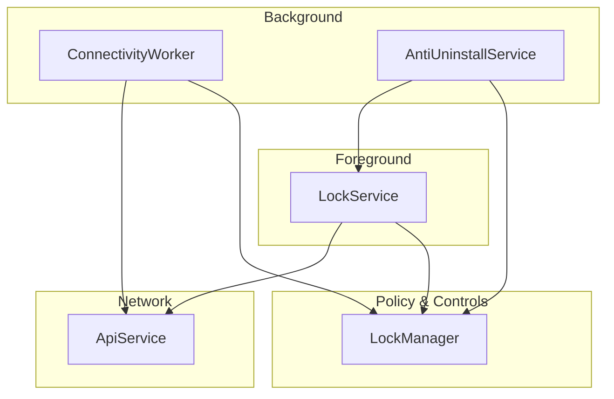
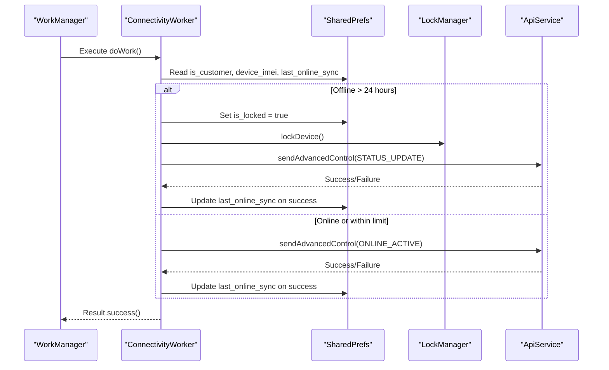
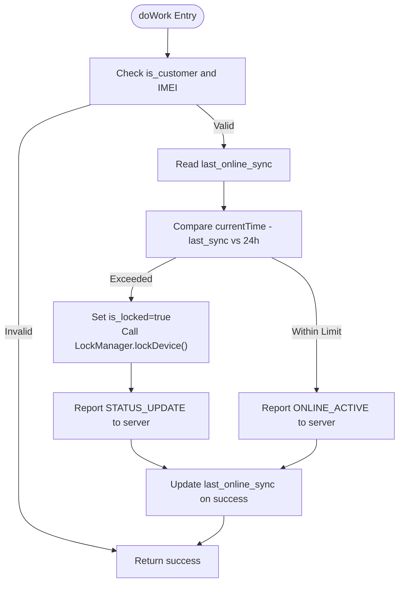
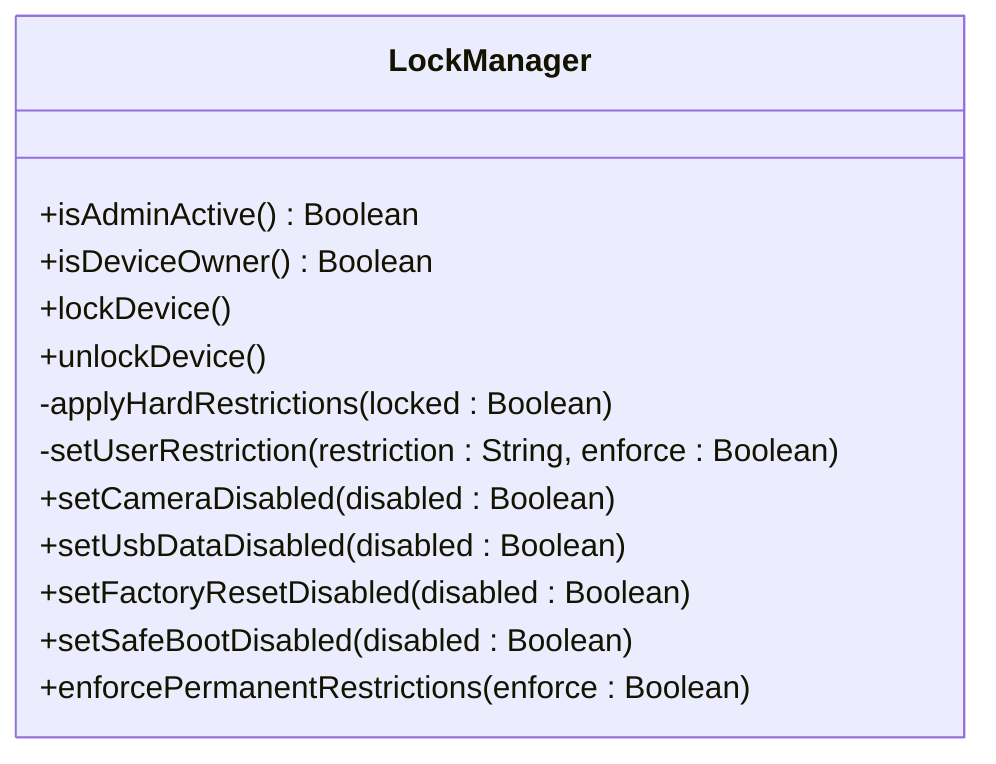
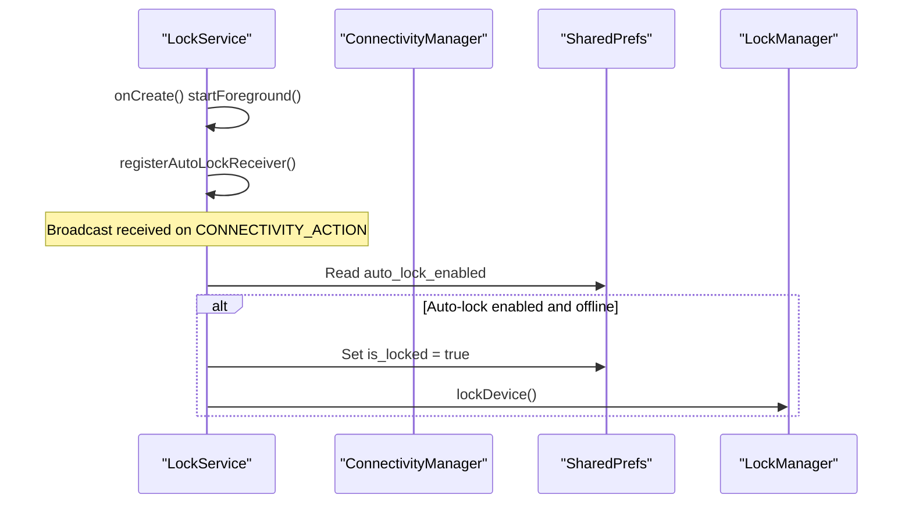
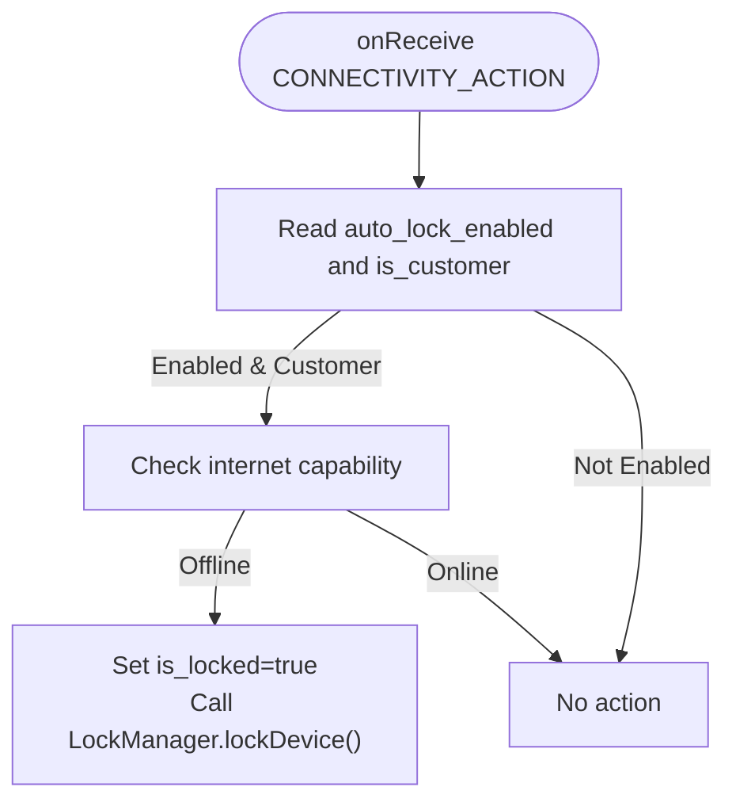
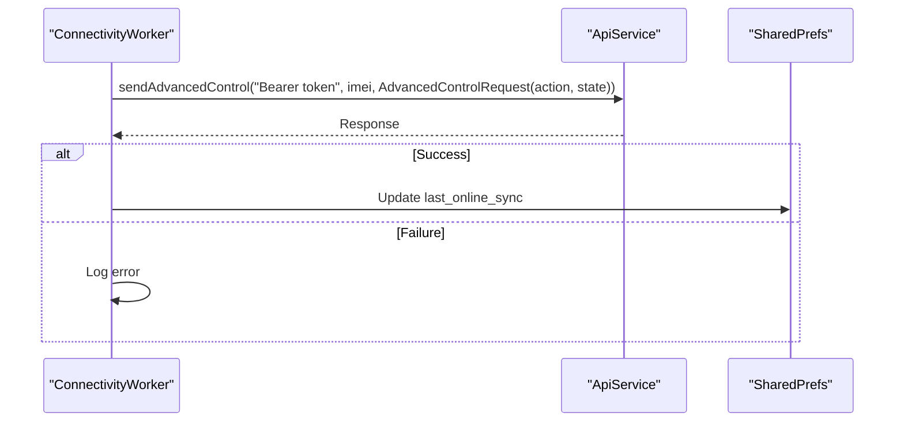
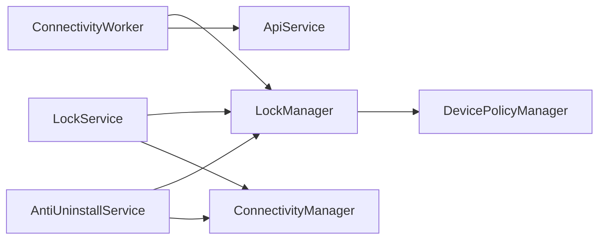

# Connectivity Monitoring

<cite>
**Referenced Files in This Document**
- [ConnectivityWorker.kt](file://app/src/main/java/com/pksafe/lock/manager/service/ConnectivityWorker.kt)
- [LockManager.kt](file://app/src/main/java/com/pksafe/lock/manager/util/LockManager.kt)
- [LockService.kt](file://app/src/main/java/com/pksafe/lock/manager/service/LockService.kt)
- [AntiUninstallService.kt](file://app/src/main/java/com/pksafe/lock/manager/service/AntiUninstallService.kt)
- [ApiService.kt](file://app/src/main/java/com/pksafe/lock/manager/data/ApiService.kt)
- [Models.kt](file://app/src/main/java/com/pksafe/lock/manager/data/Models.kt)
- [MainActivity.kt](file://app/src/main/java/com/pksafe/lock/manager/MainActivity.kt)
</cite>

## Table of Contents
1. [Introduction](#introduction)
2. [Project Structure](#project-structure)
3. [Core Components](#core-components)
4. [Architecture Overview](#architecture-overview)
5. [Detailed Component Analysis](#detailed-component-analysis)
6. [Dependency Analysis](#dependency-analysis)
7. [Performance Considerations](#performance-considerations)
8. [Troubleshooting Guide](#troubleshooting-guide)
9. [Conclusion](#conclusion)

## Introduction
This document explains the ConnectivityMonitoring system centered on the ConnectivityWorker component. It covers how background network state monitoring triggers automatic lock/unlock actions based on device connectivity and lock status, how synchronization with the server is performed, and how battery optimization considerations are handled for reliable operation across Android versions. It also includes examples of connectivity detection, capability checks, integration with the lock management system, and strategies to debug and optimize performance.

## Project Structure
The connectivity monitoring spans several components:
- ConnectivityWorker: A WorkManager-based background task that periodically checks connectivity and syncs status or enforces a lock if offline too long.
- LockManager: Orchestrates device locking/unlocking via Device Policy Manager and applies hardware restrictions.
- LockService: Foreground service that displays a persistent lock overlay and reacts to connectivity changes when auto-lock is enabled.
- AntiUninstallService: Accessibility-based guard that monitors connectivity and blocks restricted settings/actions; also participates in auto-lock behavior.
- ApiService and Models: Retrofit API definitions and data models used for server communication.
- MainActivity: Schedules background tasks (e.g., location sync) and demonstrates WorkManager usage patterns.

**Diagram sources**
- [ConnectivityWorker.kt:15-70](file://app/src/main/java/com/pksafe/lock/manager/service/ConnectivityWorker.kt#L15-L70)
- [LockManager.kt:111-148](file://app/src/main/java/com/pksafe/lock/manager/util/LockManager.kt#L111-L148)
- [LockService.kt:82-105](file://app/src/main/java/com/pksafe/lock/manager/service/LockService.kt#L82-L105)
- [AntiUninstallService.kt:88-117](file://app/src/main/java/com/pksafe/lock/manager/service/AntiUninstallService.kt#L88-L117)
- [ApiService.kt:58-63](file://app/src/main/java/com/pksafe/lock/manager/data/ApiService.kt#L58-L63)

**Section sources**
- [ConnectivityWorker.kt:15-70](file://app/src/main/java/com/pksafe/lock/manager/service/ConnectivityWorker.kt#L15-L70)
- [LockManager.kt:111-148](file://app/src/main/java/com/pksafe/lock/manager/util/LockManager.kt#L111-L148)
- [LockService.kt:82-105](file://app/src/main/java/com/pksafe/lock/manager/service/LockService.kt#L82-L105)
- [AntiUninstallService.kt:88-117](file://app/src/main/java/com/pksafe/lock/manager/service/AntiUninstallService.kt#L88-L117)
- [ApiService.kt:58-63](file://app/src/main/java/com/pksafe/lock/manager/data/ApiService.kt#L58-L63)

## Core Components
- ConnectivityWorker: Runs as a background coroutine worker to detect prolonged offline periods and either lock the device locally or report an online heartbeat to the server. It updates local sync timestamps upon successful reporting.
- LockManager: Provides methods to lock/unlock devices, apply hardware restrictions (camera, USB transfer, factory reset, safe boot, debugging), and manage overlays and services.
- LockService: Foreground service showing a persistent lock overlay, registering connectivity broadcasts, and enforcing auto-lock when internet disconnects while auto-lock is enabled.
- AntiUninstallService: Accessibility service that listens to connectivity changes and can trigger locks when offline; also protects against unauthorized settings changes and app uninstallation attempts.
- ApiService: Retrofit interface defining endpoints for advanced controls and device status retrieval.
- Models: Data classes representing requests/responses including AdvancedControlRequest used for status updates.

**Section sources**
- [ConnectivityWorker.kt:17-46](file://app/src/main/java/com/pksafe/lock/manager/service/ConnectivityWorker.kt#L17-L46)
- [LockManager.kt:111-148](file://app/src/main/java/com/pksafe/lock/manager/util/LockManager.kt#L111-L148)
- [LockService.kt:50-105](file://app/src/main/java/com/pksafe/lock/manager/service/LockService.kt#L50-L105)
- [AntiUninstallService.kt:88-117](file://app/src/main/java/com/pksafe/lock/manager/service/AntiUninstallService.kt#L88-L117)
- [ApiService.kt:58-63](file://app/src/main/java/com/pksafe/lock/manager/data/ApiService.kt#L58-L63)
- [Models.kt:216-219](file://app/src/main/java/com/pksafe/lock/manager/data/Models.kt#L216-L219)

## Architecture Overview
The system uses a layered approach combining WorkManager background execution, foreground services, and accessibility guards to ensure robust connectivity monitoring and enforcement:
- ConnectivityWorker performs periodic checks and synchronizes with the server or enforces a lock if offline beyond a threshold.
- LockService maintains a persistent overlay and reacts to connectivity events to enforce auto-lock when enabled.
- AntiUninstallService provides additional connectivity monitoring and protection against tampering.
- LockManager centralizes device policy operations and UI enforcement.

**Diagram sources**
- [ConnectivityWorker.kt:17-70](file://app/src/main/java/com/pksafe/lock/manager/service/ConnectivityWorker.kt#L17-L70)
- [LockManager.kt:111-148](file://app/src/main/java/com/pksafe/lock/manager/util/LockManager.kt#L111-L148)
- [ApiService.kt:58-63](file://app/src/main/java/com/pksafe/lock/manager/data/ApiService.kt#L58-L63)

## Detailed Component Analysis

### ConnectivityWorker Analysis
Responsibilities:
- Reads customer and device identifiers from shared preferences.
- Determines whether the device has been offline longer than a configured threshold.
- If offline too long, sets local lock flag and invokes LockManager to enforce device lock.
- Reports status to the server using ApiService, updating last sync time on success.

Key behaviors:
- Skips execution if not a customer or IMEI missing.
- Uses a 24-hour offline limit before triggering a lock.
- Attempts server notification even if minimal connectivity exists.

**Diagram sources**
- [ConnectivityWorker.kt:17-70](file://app/src/main/java/com/pksafe/lock/manager/service/ConnectivityWorker.kt#L17-L70)

**Section sources**
- [ConnectivityWorker.kt:17-70](file://app/src/main/java/com/pksafe/lock/manager/service/ConnectivityWorker.kt#L17-L70)

### LockManager Analysis
Responsibilities:
- Enforces device lock by starting LockService, applying hardware restrictions, and invoking system lock.
- Unlocks device by stopping services, clearing restrictions, and resetting lock flags.
- Applies granular restrictions such as camera disablement, USB file transfer blocking, factory reset prevention, safe boot blocking, and debugging features restriction.

Integration points:
- Called by ConnectivityWorker to enforce lock after prolonged offline.
- Used by LockService for emergency unlock flows.

**Diagram sources**
- [LockManager.kt:111-148](file://app/src/main/java/com/pksafe/lock/manager/util/LockManager.kt#L111-L148)
- [LockManager.kt:151-200](file://app/src/main/java/com/pksafe/lock/manager/util/LockManager.kt#L151-L200)
- [LockManager.kt:219-261](file://app/src/main/java/com/pksafe/lock/manager/util/LockManager.kt#L219-L261)
- [LockManager.kt:299-315](file://app/src/main/java/com/pksafe/lock/manager/util/LockManager.kt#L299-L315)

**Section sources**
- [LockManager.kt:111-148](file://app/src/main/java/com/pksafe/lock/manager/util/LockManager.kt#L111-L148)
- [LockManager.kt:151-200](file://app/src/main/java/com/pksafe/lock/manager/util/LockManager.kt#L151-L200)
- [LockManager.kt:219-261](file://app/src/main/java/com/pksafe/lock/manager/util/LockManager.kt#L219-L261)
- [LockManager.kt:299-315](file://app/src/main/java/com/pksafe/lock/manager/util/LockManager.kt#L299-L315)

### LockService Analysis
Responsibilities:
- Starts a foreground service with a persistent notification and lock overlay.
- Registers a BroadcastReceiver for connectivity changes to enforce auto-lock when enabled.
- Checks connectivity using ConnectivityManager and NetworkCapabilities to determine internet availability.

Auto-lock behavior:
- When auto_lock_enabled is true and connectivity drops, sets is_locked and triggers lock enforcement.

**Diagram sources**
- [LockService.kt:50-105](file://app/src/main/java/com/pksafe/lock/manager/service/LockService.kt#L50-L105)
- [LockManager.kt:111-148](file://app/src/main/java/com/pksafe/lock/manager/util/LockManager.kt#L111-L148)

**Section sources**
- [LockService.kt:50-105](file://app/src/main/java/com/pksafe/lock/manager/service/LockService.kt#L50-L105)

### AntiUninstallService Analysis
Responsibilities:
- Monitors connectivity changes and triggers lock when offline and auto-lock is enabled.
- Protects against unauthorized access to settings and app uninstallation by intercepting accessibility events and performing global actions.

Connectivity check:
- Uses ConnectivityManager and NetworkCapabilities to verify internet capability.

**Diagram sources**
- [AntiUninstallService.kt:88-117](file://app/src/main/java/com/pksafe/lock/manager/service/AntiUninstallService.kt#L88-L117)
- [LockManager.kt:111-148](file://app/src/main/java/com/pksafe/lock/manager/util/LockManager.kt#L111-L148)

**Section sources**
- [AntiUninstallService.kt:88-117](file://app/src/main/java/com/pksafe/lock/manager/service/AntiUninstallService.kt#L88-L117)

### API Integration and Data Models
- ConnectivityWorker reports status updates using ApiService.sendAdvancedControl with AdvancedControlRequest containing action and state fields.
- LockService fetches device status and EMI details using ApiService.getDeviceStatus and updates UI accordingly.

**Diagram sources**
- [ConnectivityWorker.kt:49-70](file://app/src/main/java/com/pksafe/lock/manager/service/ConnectivityWorker.kt#L49-L70)
- [ApiService.kt:58-63](file://app/src/main/java/com/pksafe/lock/manager/data/ApiService.kt#L58-L63)
- [Models.kt:216-219](file://app/src/main/java/com/pksafe/lock/manager/data/Models.kt#L216-L219)

**Section sources**
- [ConnectivityWorker.kt:49-70](file://app/src/main/java/com/pksafe/lock/manager/service/ConnectivityWorker.kt#L49-L70)
- [ApiService.kt:58-63](file://app/src/main/java/com/pksafe/lock/manager/data/ApiService.kt#L58-L63)
- [Models.kt:216-219](file://app/src/main/java/com/pksafe/lock/manager/data/Models.kt#L216-L219)

## Dependency Analysis
- ConnectivityWorker depends on SharedPrefs for configuration and state, LockManager for enforcement, and ApiService for server communication.
- LockService depends on ConnectivityManager for network checks and integrates with LockManager for lock enforcement.
- AntiUninstallService depends on ConnectivityManager and LockManager to enforce auto-lock and protect device settings.
- All components rely on consistent state in SharedPrefs (e.g., is_customer, device_imei, last_online_sync, auto_lock_enabled, is_locked).

**Diagram sources**
- [ConnectivityWorker.kt:17-70](file://app/src/main/java/com/pksafe/lock/manager/service/ConnectivityWorker.kt#L17-L70)
- [LockService.kt:82-105](file://app/src/main/java/com/pksafe/lock/manager/service/LockService.kt#L82-L105)
- [AntiUninstallService.kt:88-117](file://app/src/main/java/com/pksafe/lock/manager/service/AntiUninstallService.kt#L88-L117)
- [LockManager.kt:151-200](file://app/src/main/java/com/pksafe/lock/manager/util/LockManager.kt#L151-L200)

**Section sources**
- [ConnectivityWorker.kt:17-70](file://app/src/main/java/com/pksafe/lock/manager/service/ConnectivityWorker.kt#L17-L70)
- [LockService.kt:82-105](file://app/src/main/java/com/pksafe/lock/manager/service/LockService.kt#L82-L105)
- [AntiUninstallService.kt:88-117](file://app/src/main/java/com/pksafe/lock/manager/service/AntiUninstallService.kt#L88-L117)
- [LockManager.kt:151-200](file://app/src/main/java/com/pksafe/lock/manager/util/LockManager.kt#L151-L200)

## Performance Considerations
- Background Execution: ConnectivityWorker runs as a CoroutineWorker, leveraging WorkManager’s scheduling and constraints. Ensure appropriate constraints (e.g., network available) are set when scheduling to minimize battery drain.
- Sync Frequency: The worker uses a 24-hour offline threshold before enforcing a lock. Adjust this threshold based on business requirements and device capabilities.
- Network Calls: ApiService calls are wrapped in try-catch blocks to handle failures gracefully. Avoid excessive retries; consider exponential backoff if implemented at higher layers.
- Foreground Service: LockService starts a foreground service with a persistent notification, which helps maintain reliability but may impact battery life. Use only when necessary.
- Accessibility Service: AntiUninstallService monitors connectivity and settings changes. Ensure it is enabled only when required to avoid unnecessary overhead.
- State Management: Centralize state in SharedPrefs to reduce redundant checks. Validate state consistency across components to prevent conflicting actions.

[No sources needed since this section provides general guidance]

## Troubleshooting Guide
Common issues and debugging techniques:
- Connectivity Detection Failures:
  - Verify ConnectivityManager and NetworkCapabilities usage for internet capability checks in LockService and AntiUninstallService.
  - Ensure proper permissions and runtime checks for network state access.
- Auto-Lock Not Triggering:
  - Confirm auto_lock_enabled flag in SharedPrefs and is_customer/device owner status.
  - Check broadcast registration for CONNECTIVITY_ACTION and lifecycle management.
- Server Communication Errors:
  - Inspect logs for API call failures and authentication token validity.
  - Validate Retrofit configuration and endpoint URLs.
- Lock Enforcement Issues:
  - Ensure Device Admin and Device Owner privileges are active.
  - Verify LockManager.applyHardRestrictions is invoked correctly and exceptions are logged.
- Battery Optimization:
  - Review WorkManager constraints and scheduling policies to balance responsiveness and power efficiency.
  - Minimize foreground service duration and avoid frequent network polling.

**Section sources**
- [LockService.kt:82-105](file://app/src/main/java/com/pksafe/lock/manager/service/LockService.kt#L82-L105)
- [AntiUninstallService.kt:88-117](file://app/src/main/java/com/pksafe/lock/manager/service/AntiUninstallService.kt#L88-L117)
- [ConnectivityWorker.kt:49-70](file://app/src/main/java/com/pksafe/lock/manager/service/ConnectivityWorker.kt#L49-L70)
- [LockManager.kt:151-200](file://app/src/main/java/com/pksafe/lock/manager/util/LockManager.kt#L151-L200)

## Conclusion
The ConnectivityMonitoring system combines WorkManager-based background tasks, foreground services, and accessibility guards to provide robust network state monitoring and automatic lock/unlock capabilities. ConnectivityWorker ensures timely synchronization and enforcement of locks during prolonged offline periods, while LockService and AntiUninstallService offer real-time connectivity reaction and protection against unauthorized actions. Proper configuration of WorkManager constraints, careful state management, and thorough logging enable reliable operation across diverse Android environments. For optimal performance, tune sync frequencies, minimize foreground service usage, and validate network capabilities consistently.

[No sources needed since this section summarizes without analyzing specific files]