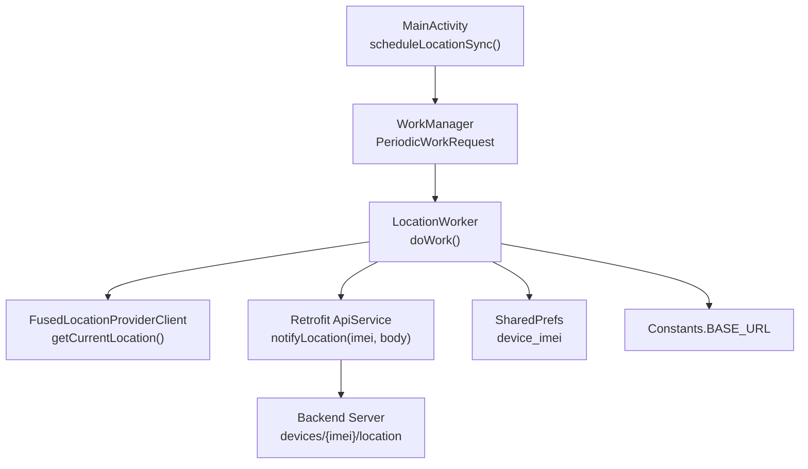
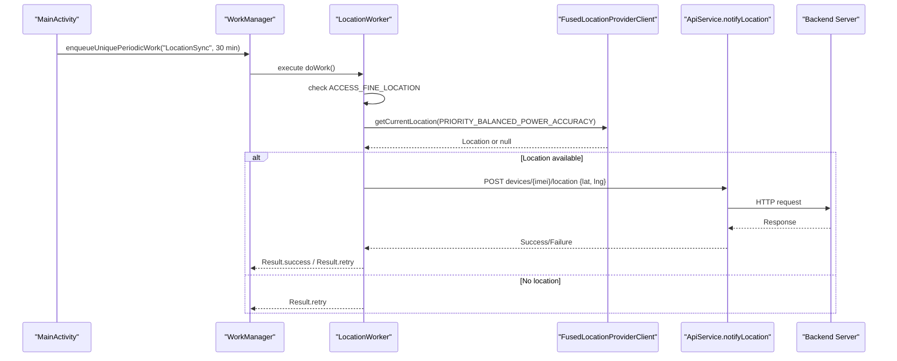
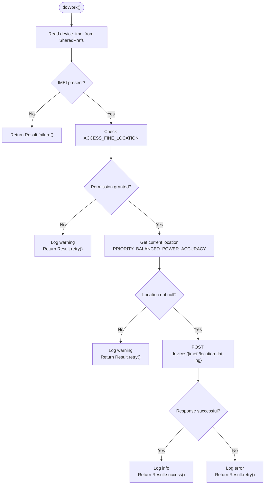
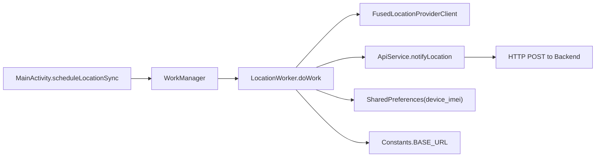

# Location Tracking

<cite>
**Referenced Files in This Document**
- [LocationWorker.kt](file://app/src/main/java/com/pksafe/lock/manager/worker/LocationWorker.kt)
- [MainActivity.kt](file://app/src/main/java/com/pksafe/lock/manager/MainActivity.kt)
- [ApiService.kt](file://app/src/main/java/com/pksafe/lock/manager/data/ApiService.kt)
- [Models.kt](file://app/src/main/java/com/pksafe/lock/manager/data/Models.kt)
- [Constants.kt](file://app/src/main/java/com/pksafe/lock/manager/util/Constants.kt)
- [AndroidManifest.xml](file://app/src/main/AndroidManifest.xml)
- [build.gradle.kts](file://app/build.gradle.kts)
</cite>

## Table of Contents
1. Introduction
2. Project Structure
3. Core Components
4. Architecture Overview
5. Detailed Component Analysis
6. Dependency Analysis
7. Performance Considerations
8. Troubleshooting Guide
9. Conclusion
10. Appendices

## Introduction
This document explains the LocationWorker component and its role in periodic GPS tracking and synchronization with a backend server for device management. It covers how WorkManager schedules location sync, how location data is captured and sent to the server, current geofencing support, permissions and privacy considerations, battery optimization strategies, and guidance for testing and tuning update frequency.

## Project Structure
The location tracking feature spans several modules:
- Worker that runs periodically to capture and upload location
- UI entry point that schedules the worker
- Network layer to send location updates to the backend
- Data models representing device location and geofence state
- Manifest declarations for permissions and services
- Build configuration including dependencies for location services and WorkManager

**Diagram sources**
- [MainActivity.kt:465-476](file://app/src/main/java/com/pksafe/lock/manager/MainActivity.kt#L465-L476)
- [LocationWorker.kt:20-68](file://app/src/main/java/com/pksafe/lock/manager/worker/LocationWorker.kt#L20-L68)
- [ApiService.kt:83-87](file://app/src/main/java/com/pksafe/lock/manager/data/ApiService.kt#L83-L87)
- [Constants.kt:7-7](file://app/src/main/java/com/pksafe/lock/manager/util/Constants.kt#L7-L7)

**Section sources**
- [MainActivity.kt:465-476](file://app/src/main/java/com/pksafe/lock/manager/MainActivity.kt#L465-L476)
- [LocationWorker.kt:20-68](file://app/src/main/java/com/pksafe/lock/manager/worker/LocationWorker.kt#L20-L68)
- [ApiService.kt:83-87](file://app/src/main/java/com/pksafe/lock/manager/data/ApiService.kt#L83-L87)
- [Constants.kt:7-7](file://app/src/main/java/com/pksafe/lock/manager/util/Constants.kt#L7-L7)

## Core Components
- LocationWorker: A CoroutineWorker that checks permissions, retrieves the current location using Google Play Services Fused Location Provider, and posts it to the backend via Retrofit. On success, returns Result.success; on failure or retry conditions, returns Result.retry.
- MainActivity scheduling: Enqueues a unique periodic work request every 30 minutes to run LocationWorker.
- ApiService: Defines the network endpoint devices/{imei}/location used to notify the server of device location.
- Models: Includes LocationData and GeofenceData structures that represent location and geofence state returned by the server.
- AndroidManifest: Declares location-related permissions (fine/coarse), and other system permissions required for background operation.
- Dependencies: build.gradle includes play-services-location and androidx.work.runtime.

**Section sources**
- [LocationWorker.kt:18-68](file://app/src/main/java/com/pksafe/lock/manager/worker/LocationWorker.kt#L18-L68)
- [MainActivity.kt:465-476](file://app/src/main/java/com/pksafe/lock/manager/MainActivity.kt#L465-L476)
- [ApiService.kt:83-87](file://app/src/main/java/com/pksafe/lock/manager/data/ApiService.kt#L83-L87)
- [Models.kt:103-121](file://app/src/main/java/com/pksafe/lock/manager/data/Models.kt#L103-L121)
- [AndroidManifest.xml:21-23](file://app/src/main/AndroidManifest.xml#L21-L23)
- [build.gradle.kts:103-109](file://app/build.gradle.kts#L103-L109)

## Architecture Overview
The architecture uses WorkManager to schedule background tasks that are resilient to process death and OS constraints. The flow:
- MainActivity enqueues a periodic work request for LocationWorker.
- LocationWorker executes doWork(), validates permissions, obtains a one-time location fix, and sends it to the backend.
- The backend stores the latest location and can return geofence settings to be enforced by the app.

**Diagram sources**
- [MainActivity.kt:465-476](file://app/src/main/java/com/pksafe/lock/manager/MainActivity.kt#L465-L476)
- [LocationWorker.kt:20-68](file://app/src/main/java/com/pksafe/lock/manager/worker/LocationWorker.kt#L20-L68)
- [ApiService.kt:83-87](file://app/src/main/java/com/pksafe/lock/manager/data/ApiService.kt#L83-L87)

## Detailed Component Analysis

### LocationWorker
Responsibilities:
- Read device IMEI from SharedPreferences
- Check runtime permission for fine location
- Retrieve a single location fix using FusedLocationProviderClient with balanced power/accuracy priority
- Send location to backend via Retrofit
- Handle success/failure and retries

Key behaviors:
- Permission not granted: logs warning and returns Result.retry
- Location null: logs warning and returns Result.retry
- Network error or non-success response: logs error and returns Result.retry
- Successful sync: logs info and returns Result.success

**Diagram sources**
- [LocationWorker.kt:20-68](file://app/src/main/java/com/pksafe/lock/manager/worker/LocationWorker.kt#L20-L68)

**Section sources**
- [LocationWorker.kt:20-68](file://app/src/main/java/com/pksafe/lock/manager/worker/LocationWorker.kt#L20-L68)

### WorkManager Scheduling (MainActivity)
- Schedules a unique periodic work request named "LocationSync" with a 30-minute interval.
- Uses ExistingPeriodicWorkPolicy.KEEP to preserve existing schedule.

Best practices observed:
- Unique name ensures only one instance runs at a time.
- Periodic cadence balances freshness vs. battery usage.

**Section sources**
- [MainActivity.kt:465-476](file://app/src/main/java/com/pksafe/lock/manager/MainActivity.kt#L465-L476)

### Network Layer (ApiService)
- Endpoint: POST devices/{imei}/location with a JSON body containing lat and lng.
- Used by LocationWorker to report device location.

Integration notes:
- Base URL is configured via Constants.BASE_URL.
- Retrofit is instantiated inside the worker; consider moving to a shared singleton for efficiency if needed.

**Section sources**
- [ApiService.kt:83-87](file://app/src/main/java/com/pksafe/lock/manager/data/ApiService.kt#L83-L87)
- [Constants.kt:7-7](file://app/src/main/java/com/pksafe/lock/manager/util/Constants.kt#L7-L7)

### Data Models (Location and Geofence)
- LocationData: Represents a device’s last known coordinates and timestamp.
- GeofenceData: Holds center coordinates, radius, enabled flag, and last breach timestamp.
- DeviceResponse includes optional fields for location, geofence, and locationHistory.

These models indicate where geofence state is expected to come from the server and how it may be displayed or acted upon in the app.

**Section sources**
- [Models.kt:103-121](file://app/src/main/java/com/pksafe/lock/manager/data/Models.kt#L103-L121)
- [Models.kt:48-76](file://app/src/main/java/com/pksafe/lock/manager/data/Models.kt#L48-L76)

### Permissions and Privacy
Declared permissions relevant to location:
- ACCESS_FINE_LOCATION
- ACCESS_COARSE_LOCATION
- ACCESS_BACKGROUND_LOCATION is currently commented out in the manifest.

Privacy implications:
- Fine location provides precise coordinates; coarse provides approximate.
- Background location access requires explicit user consent and additional handling on modern Android versions.
- Ensure clear user communication about why location is collected and how often it is updated.

**Section sources**
- [AndroidManifest.xml:21-23](file://app/src/main/AndroidManifest.xml#L21-L23)

### Dependencies
- play-services-location: Enables FusedLocationProviderClient for location retrieval.
- androidx.work.runtime: Provides WorkManager for background scheduling.
- retrofit and gson: Used for network calls and serialization.

**Section sources**
- [build.gradle.kts:103-109](file://app/build.gradle.kts#L103-L109)

## Dependency Analysis
High-level dependencies:
- LocationWorker depends on:
  - Android permissions and Context
  - FusedLocationProviderClient for location
  - Retrofit ApiService for network
  - SharedPreferences for IMEI
  - Constants for base URL
- MainActivity depends on WorkManager to schedule LocationWorker.
- ApiService depends on Retrofit annotations and Gson converter.

**Diagram sources**
- [MainActivity.kt:465-476](file://app/src/main/java/com/pksafe/lock/manager/MainActivity.kt#L465-L476)
- [LocationWorker.kt:20-68](file://app/src/main/java/com/pksafe/lock/manager/worker/LocationWorker.kt#L20-L68)
- [ApiService.kt:83-87](file://app/src/main/java/com/pksafe/lock/manager/data/ApiService.kt#L83-L87)
- [Constants.kt:7-7](file://app/src/main/java/com/pksafe/lock/manager/util/Constants.kt#L7-L7)

**Section sources**
- [LocationWorker.kt:20-68](file://app/src/main/java/com/pksafe/lock/manager/worker/LocationWorker.kt#L20-L68)
- [MainActivity.kt:465-476](file://app/src/main/java/com/pksafe/lock/manager/MainActivity.kt#L465-L476)
- [ApiService.kt:83-87](file://app/src/main/java/com/pksafe/lock/manager/data/ApiService.kt#L83-L87)
- [Constants.kt:7-7](file://app/src/main/java/com/pksafe/lock/manager/util/Constants.kt#L7-L7)

## Performance Considerations
- Update frequency: Currently set to 30 minutes. Adjust based on use case:
  - High security monitoring: shorter intervals (e.g., 5–10 minutes) with careful battery impact assessment.
  - Low-frequency tracking: longer intervals (e.g., 60+ minutes).
- Accuracy vs. battery: PRIORITY_BALANCED_POWER_ACCURACY is a good default. For higher accuracy, consider PRIORITY_HIGH_ACCURACY but expect increased battery usage.
- One-shot location: Using getCurrentLocation avoids continuous callbacks, reducing overhead.
- Network efficiency: Batch or throttle requests if multiple workers exist; ensure idempotent server endpoints.
- WorkManager constraints: Consider adding constraints like requiring network connectivity or charging to optimize resource usage.

[No sources needed since this section provides general guidance]

## Troubleshooting Guide
Common issues and resolutions:
- Permission denied:
  - Symptom: Worker logs “Permission not granted” and retries.
  - Resolution: Ensure ACCESS_FINE_LOCATION is granted at runtime before scheduling work.
- Null location:
  - Symptom: Worker logs “Location is null” and retries.
  - Resolution: Verify GPS/network location providers are enabled; allow time for first fix; consider fallback to coarse location.
- Network failures:
  - Symptom: Non-success response or exception; worker retries.
  - Resolution: Check internet connectivity, server availability, and payload format; add exponential backoff in WorkManager if needed.
- Battery drain concerns:
  - Symptom: Rapid battery depletion when location is frequently requested.
  - Resolution: Increase interval, reduce accuracy, avoid foreground services unless necessary, and leverage WorkManager constraints.
- Background location restrictions:
  - Symptom: Apps targeting newer Android versions cannot access background location without explicit user permission.
  - Resolution: Add ACCESS_BACKGROUND_LOCATION and handle runtime permission; provide clear rationale to users.

**Section sources**
- [LocationWorker.kt:26-67](file://app/src/main/java/com/pksafe/lock/manager/worker/LocationWorker.kt#L26-L67)
- [AndroidManifest.xml:21-23](file://app/src/main/AndroidManifest.xml#L21-L23)

## Conclusion
LocationWorker implements a robust, WorkManager-based approach to periodically capture and synchronize device location with a backend server. It handles permissions, network errors, and retries appropriately. While geofencing data models exist, active geofencing enforcement is not implemented in the current codebase. To enhance functionality, consider implementing geofence monitoring, refining update frequency, and ensuring compliance with background location policies.

[No sources needed since this section summarizes without analyzing specific files]

## Appendices

### Geofencing Status and Recommendations
- Current status:
  - Data models for geofence are present (GeofenceData) and included in device responses.
  - No active geofencing client or boundary monitoring logic is implemented in the codebase.
- Recommended next steps:
  - Implement GeofencingClient to monitor boundaries defined by server-provided geofences.
  - Trigger actions on enter/exit events and notify the backend accordingly.
  - Respect user privacy and obtain explicit consent for background location and geofencing.

[No sources needed since this section provides general guidance]

### Testing Location Features
- Unit tests:
  - Mock FusedLocationProviderClient to simulate location results and test retry/success paths.
  - Mock Retrofit ApiService to verify correct payload and endpoint usage.
- Instrumented tests:
  - Use emulator with simulated locations to validate end-to-end flows.
  - Validate WorkManager scheduling and retries under various conditions.
- Manual testing:
  - Toggle GPS and network location to observe behavior.
  - Simulate network failures to confirm retry logic.
  - Test with and without background location permission to ensure graceful degradation.

[No sources needed since this section provides general guidance]