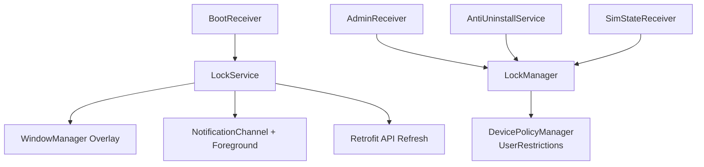
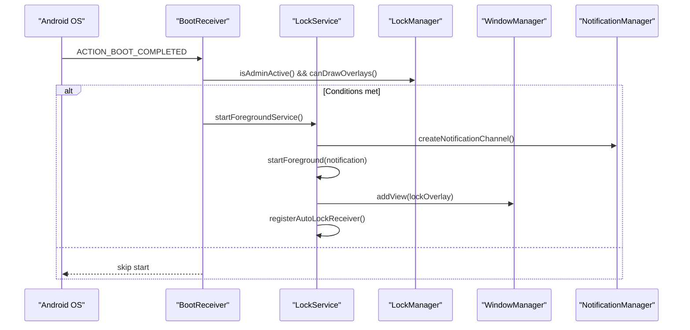
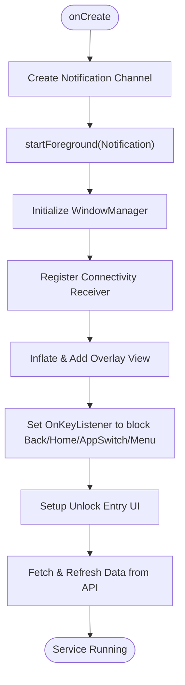
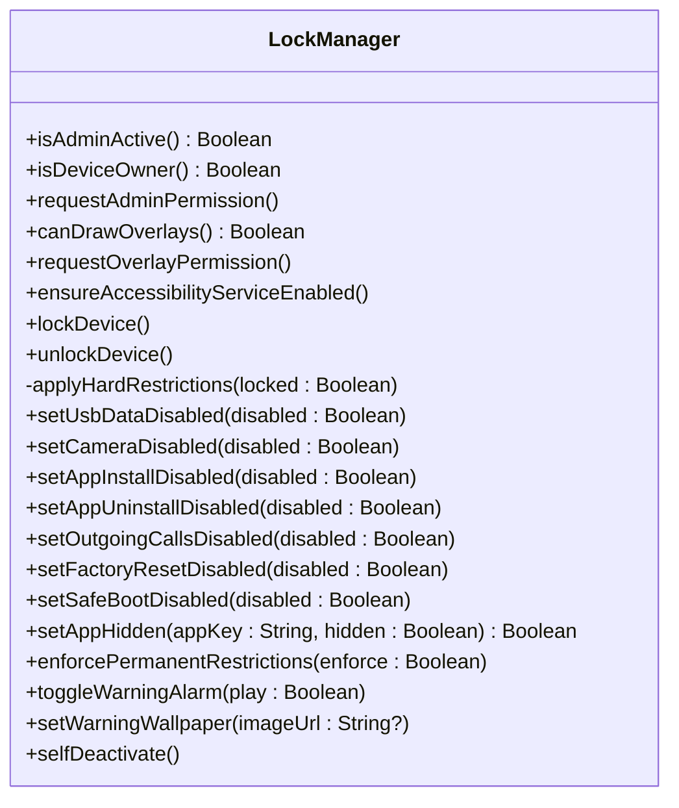
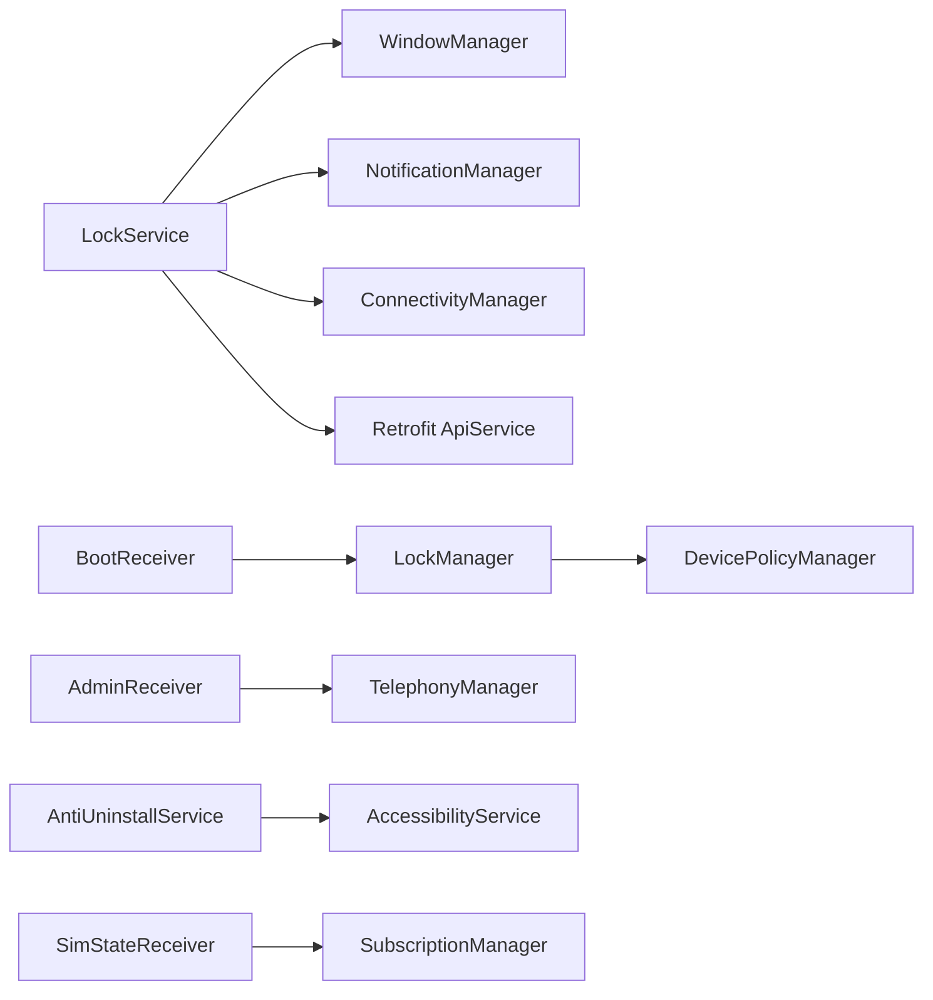

# Lock Service

<cite>
**Referenced Files in This Document**
- [LockService.kt](file://app/src/main/java/com/pksafe/lock/manager/service/LockService.kt)
- [layout_persistent_lock.xml](file://app/src/main/res/layout/layout_persistent_lock.xml)
- [LockManager.kt](file://app/src/main/java/com/pksafe/lock/manager/util/LockManager.kt)
- [AdminReceiver.kt](file://app/src/main/java/com/pksafe/lock/manager/receiver/AdminReceiver.kt)
- [BootReceiver.kt](file://app/src/main/java/com/pksafe/lock/manager/receiver/BootReceiver.kt)
- [AntiUninstallService.kt](file://app/src/main/java/com/pksafe/lock/manager/service/AntiUninstallService.kt)
- [SimStateReceiver.kt](file://app/src/main/java/com/pksafe/lock/manager/receiver/SimStateReceiver.kt)
- [AndroidManifest.xml](file://app/src/main/AndroidManifest.xml)
- [Constants.kt](file://app/src/main/java/com/pksafe/lock/manager/util/Constants.kt)
</cite>

## Table of Contents
1. Introduction
2. Project Structure
3. Core Components
4. Architecture Overview
5. Detailed Component Analysis
6. Dependency Analysis
7. Performance Considerations
8. Troubleshooting Guide
9. Conclusion

## Introduction
This document explains the LockService component that provides persistent device lockdown functionality. It covers the foreground service lifecycle, the overlay system using WindowManager to display a persistent lock screen with hardware restrictions, notification channel creation, auto-lock on connectivity changes, master unlock code validation based on IMEI-derived dynamic codes, and cross-API-level handling for Android system constraints. It also includes examples of overlay view configuration, key event blocking, inter-process communication patterns via Device Policy Manager and Accessibility Service, and guidance on battery optimization and reliability.

## Project Structure
The lock enforcement spans several components:
- Foreground service that renders an overlay and maintains device control
- Device policy manager integration to apply hardware restrictions
- Boot-time recovery to re-establish lockdown after reboot
- SIM change detection to auto-lock when SIM is removed or changed
- Accessibility-based guard to prevent uninstallation and tampering
- Notification channel and persistent notification for foreground operation

**Diagram sources**
- [BootReceiver.kt:10-26](file://app/src/main/java/com/pksafe/lock/manager/receiver/BootReceiver.kt#L10-L26)
- [LockService.kt:54-80](file://app/src/main/java/com/pksafe/lock/manager/service/LockService.kt#L54-L80)
- [LockManager.kt:111-148](file://app/src/main/java/com/pksafe/lock/manager/util/LockManager.kt#L111-L148)
- [AntiUninstallService.kt:82-110](file://app/src/main/java/com/pksafe/lock/manager/service/AntiUninstallService.kt#L82-L110)
- [SimStateReceiver.kt:18-145](file://app/src/main/java/com/pksafe/lock/manager/receiver/SimStateReceiver.kt#L18-L145)
- [AndroidManifest.xml:73-130](file://app/src/main/AndroidManifest.xml#L73-L130)

**Section sources**
- [AndroidManifest.xml:1-160](file://app/src/main/AndroidManifest.xml#L1-L160)

## Core Components
- LockService: Foreground service that creates a persistent overlay, manages notifications, registers connectivity receiver, and handles unlock logic.
- LockManager: Orchestrates device policy restrictions (camera, USB, factory reset, safe boot, ADB), starts/stops LockService, and enforces permanent restrictions when needed.
- AdminReceiver: Handles device admin enablement and provisioning completion; fetches IMEI and grants critical permissions as device owner.
- AntiUninstallService: Accessibility service that blocks navigation to restricted settings and prevents app removal attempts.
- SimStateReceiver: Listens for SIM state changes and triggers auto-lock when configured.
- BootReceiver: Restarts LockService after boot if conditions are met.

**Section sources**
- [LockService.kt:41-80](file://app/src/main/java/com/pksafe/lock/manager/service/LockService.kt#L41-L80)
- [LockManager.kt:27-148](file://app/src/main/java/com/pksafe/lock/manager/util/LockManager.kt#L27-L148)
- [AdminReceiver.kt:14-36](file://app/src/main/java/com/pksafe/lock/manager/receiver/AdminReceiver.kt#L14-L36)
- [AntiUninstallService.kt:22-110](file://app/src/main/java/com/pksafe/lock/manager/service/AntiUninstallService.kt#L22-L110)
- [SimStateReceiver.kt:18-145](file://app/src/main/java/com/pksafe/lock/manager/receiver/SimStateReceiver.kt#L18-L145)
- [BootReceiver.kt:10-26](file://app/src/main/java/com/pksafe/lock/manager/receiver/BootReceiver.kt#L10-L26)

## Architecture Overview
The system uses a layered approach:
- Foreground service ensures continuous presence and UI overlay even when minimized.
- Device Policy Manager applies deep hardware restrictions to prevent bypass.
- Accessibility service guards against tampering and restricts navigation to sensitive screens.
- Broadcast receivers handle boot-time recovery, SIM events, and connectivity changes.
- Retrofit-based refresh updates overlay content from server data.

**Diagram sources**
- [BootReceiver.kt:10-26](file://app/src/main/java/com/pksafe/lock/manager/receiver/BootReceiver.kt#L10-L26)
- [LockService.kt:54-80](file://app/src/main/java/com/pksafe/lock/manager/service/LockService.kt#L54-L80)
- [LockManager.kt:63-73](file://app/src/main/java/com/pksafe/lock/manager/util/LockManager.kt#L63-L73)

## Detailed Component Analysis

### LockService: Foreground Service and Overlay
Responsibilities:
- Starts as a foreground service with a high-priority ongoing notification.
- Creates a notification channel for Android O+.
- Inflates and attaches a full-screen overlay using WindowManager with flags to keep it visible, dismiss keyguard, turn screen on, and allow keyboard interaction.
- Blocks back/home/app switch/menu keys via OnKeyListener.
- Registers a connectivity broadcast receiver to auto-lock when internet disconnects (if enabled).
- Validates master unlock code derived from device IMEI (last 6 digits) stored in preferences; unlocks by calling LockManager.unlockDevice() and stops itself.
- Periodically refreshes overlay content from remote API and persists to shared preferences.

Key implementation highlights:
- Foreground service type selection based on API level.
- Overlay layout type selection: TYPE_APPLICATION_OVERLAY on newer APIs, TYPE_PHONE fallback.
- Flags include FLAG_LAYOUT_IN_SCREEN, FLAG_FULLSCREEN, FLAG_SHOW_WHEN_LOCKED, FLAG_KEEP_SCREEN_ON, FLAG_DISMISS_KEYGUARD, FLAG_TURN_SCREEN_ON, FLAG_NOT_TOUCH_MODAL to ensure usability while maintaining control.
- Key event interception to block navigation keys.
- Dynamic unlock code validation using IMEI-based last 6 digits with fallback to default.
- Background coroutine to fetch fresh EMI and shop info and update overlay views on main thread.

**Diagram sources**
- [LockService.kt:54-80](file://app/src/main/java/com/pksafe/lock/manager/service/LockService.kt#L54-L80)
- [LockService.kt:107-123](file://app/src/main/java/com/pksafe/lock/manager/service/LockService.kt#L107-L123)
- [LockService.kt:125-168](file://app/src/main/java/com/pksafe/lock/manager/service/LockService.kt#L125-L168)
- [LockService.kt:240-314](file://app/src/main/java/com/pksafe/lock/manager/service/LockService.kt#L240-L314)

**Section sources**
- [LockService.kt:41-329](file://app/src/main/java/com/pksafe/lock/manager/service/LockService.kt#L41-L329)
- [layout_persistent_lock.xml:1-234](file://app/src/main/res/layout/layout_persistent_lock.xml#L1-L234)

### LockManager: Hardware Restrictions and Lifecycle Control
Responsibilities:
- Checks device admin and device owner status.
- Requests device admin and overlay permissions when needed.
- Enforces deep restrictions when locked: camera disabled, USB file transfer blocked, factory reset disabled, safe boot disabled, ADB/debugging disabled, status bar disabled, keyguard disabled.
- Starts/stops LockService and toggles restrictions accordingly.
- Provides methods to hide apps, enforce permanent restrictions, manage alarms/wallpaper, and self-deactivate privileges.

Important behaviors:
- Uses DevicePolicyManager.setUserRestriction to apply granular controls.
- Ensures accessibility service is enabled via setSecureSetting when device owner.
- Applies restrictions conditionally based on API levels.

**Diagram sources**
- [LockManager.kt:27-406](file://app/src/main/java/com/pksafe/lock/manager/util/LockManager.kt#L27-L406)

**Section sources**
- [LockManager.kt:27-406](file://app/src/main/java/com/pksafe/lock/manager/util/LockManager.kt#L27-L406)

### AdminReceiver: Device Admin Provisioning and IMEI Handling
Responsibilities:
- On admin enabled or profile provisioning complete, fetches IMEI and stores it in preferences.
- Grants critical permissions to self as device owner (read phone state, SMS permissions).
- Launches the app post-provisioning to finalize setup.

Notes:
- IMEI retrieval uses TelephonyManager with dual-SIM support where available.
- Marks provisioning complete and customer mode activation.

**Section sources**
- [AdminReceiver.kt:14-104](file://app/src/main/java/com/pksafe/lock/manager/receiver/AdminReceiver.kt#L14-L104)

### AntiUninstallService: Tamper Protection via Accessibility
Responsibilities:
- Monitors accessibility events to detect attempts to access restricted settings or uninstall flows.
- Blocks navigation to settings/uninstaller by performing global actions (back/home).
- Detects blocked keywords in screen text to prevent user tampering.
- Registers connectivity receiver to trigger auto-lock on network loss when enabled.

Behavior:
- Uses AccessibilityNodeInfo traversal to extract all text and content descriptions.
- Performs global actions to return to home or back when restricted actions are detected.

**Section sources**
- [AntiUninstallService.kt:22-224](file://app/src/main/java/com/pksafe/lock/manager/service/AntiUninstallService.kt#L22-L224)

### SimStateReceiver: Auto-Lock on SIM Changes
Responsibilities:
- Listens for SIM_STATE_CHANGED broadcasts.
- If SIM is absent/removed and auto-lock is enabled, sets lock flags and calls LockManager.lockDevice().
- On SIM ready, compares ICCID with stored value; if changed and auto-lock enabled, locks device and notifies backend.
- Updates last known ICCID and clears lock-by-SIM flag when authorized SIM is present.

**Section sources**
- [SimStateReceiver.kt:18-145](file://app/src/main/java/com/pksafe/lock/manager/receiver/SimStateReceiver.kt#L18-L145)

### BootReceiver: Post-Boot Recovery
Responsibilities:
- On BOOT_COMPLETED, checks if device admin is active and overlay permission granted.
- Starts LockService as foreground service on modern Android versions.

**Section sources**
- [BootReceiver.kt:10-26](file://app/src/main/java/com/pksafe/lock/manager/receiver/BootReceiver.kt#L10-L26)

## Dependency Analysis
Core dependencies and interactions:
- LockService depends on WindowManager for overlay, NotificationManager for foreground, ConnectivityManager for connectivity checks, and Retrofit for API refresh.
- LockManager depends on DevicePolicyManager and UserManager to apply restrictions.
- AdminReceiver depends on TelephonyManager to fetch IMEI and DevicePolicyManager to grant permissions.
- AntiUninstallService depends on AccessibilityService and ConnectivityManager.
- SimStateReceiver depends on TelephonyManager and SubscriptionManager for SIM info.
- BootReceiver depends on LockManager to validate prerequisites before starting LockService.

**Diagram sources**
- [LockService.kt:54-168](file://app/src/main/java/com/pksafe/lock/manager/service/LockService.kt#L54-L168)
- [LockManager.kt:111-192](file://app/src/main/java/com/pksafe/lock/manager/util/LockManager.kt#L111-L192)
- [AdminReceiver.kt:43-104](file://app/src/main/java/com/pksafe/lock/manager/receiver/AdminReceiver.kt#L43-L104)
- [AntiUninstallService.kt:82-110](file://app/src/main/java/com/pksafe/lock/manager/service/AntiUninstallService.kt#L82-L110)
- [SimStateReceiver.kt:50-145](file://app/src/main/java/com/pksafe/lock/manager/receiver/SimStateReceiver.kt#L50-L145)
- [BootReceiver.kt:10-26](file://app/src/main/java/com/pksafe/lock/manager/receiver/BootReceiver.kt#L10-L26)

**Section sources**
- [AndroidManifest.xml:73-130](file://app/src/main/AndroidManifest.xml#L73-L130)

## Performance Considerations
- Foreground service with high-priority ongoing notification minimizes background throttling and improves resilience under memory pressure.
- Use of CoroutineScope(Dispatchers.IO) for network operations avoids blocking the main thread during overlay refresh.
- Overlay flags like FLAG_KEEP_SCREEN_ON and FLAG_DISMISS_KEYGUARD ensure visibility but may increase power usage; consider toggling when appropriate.
- Avoid excessive polling; rely on broadcast receivers for connectivity and SIM events to reduce CPU wakeups.
- Minimize overlay redraws by updating only changed fields and leveraging SharedPreferences caching.
- Ensure proper resource cleanup in onDestroy to remove overlay views and unregister receivers to prevent leaks.

[No sources needed since this section provides general guidance]

## Troubleshooting Guide
Common issues and resolutions:
- Overlay permissions not granted:
  - Ensure SYSTEM_ALERT_WINDOW permission is declared and requested via Settings.ACTION_MANAGE_OVERLAY_PERMISSION.
  - Verify canDrawOverlays returns true before adding overlay.
- Service killed by system:
  - Maintain foreground service with a persistent notification.
  - Use START_STICKY to restart if killed.
  - Register BootReceiver to relaunch after reboot.
- Battery optimization interference:
  - Consider requesting exemption from battery optimizations for reliable background operation.
  - Keep foreground service running to avoid aggressive doze behavior.
- Memory leaks:
  - Remove overlay view in onDestroy and unregister receivers to free resources.
- Key event blocking not working:
  - Ensure overlay view is focusable and has OnKeyListener attached.
  - Use FLAG_NOT_TOUCH_MODAL to allow keyboard input while blocking navigation keys.
- SIM auto-lock not triggering:
  - Confirm SIM_STATE_CHANGED receiver is registered and auto_lock_sim_change_enabled flag is set.
  - Validate ICCID retrieval via TelephonyManager or SubscriptionManager.

**Section sources**
- [LockService.kt:125-168](file://app/src/main/java/com/pksafe/lock/manager/service/LockService.kt#L125-L168)
- [LockService.kt:316-329](file://app/src/main/java/com/pksafe/lock/manager/service/LockService.kt#L316-L329)
- [LockManager.kt:63-73](file://app/src/main/java/com/pksafe/lock/manager/util/LockManager.kt#L63-L73)
- [BootReceiver.kt:10-26](file://app/src/main/java/com/pksafe/lock/manager/receiver/BootReceiver.kt#L10-L26)
- [SimStateReceiver.kt:18-145](file://app/src/main/java/com/pksafe/lock/manager/receiver/SimStateReceiver.kt#L18-L145)

## Conclusion
LockService provides robust, persistent device lockdown through a combination of foreground service, overlay UI, device policy restrictions, and tamper protection. The system integrates boot-time recovery, SIM change detection, connectivity-based auto-lock, and IMEI-derived unlock codes to maintain security across diverse Android environments. Proper permission handling, resource management, and API-level considerations ensure reliable operation even under system constraints.

[No sources needed since this section summarizes without analyzing specific files]