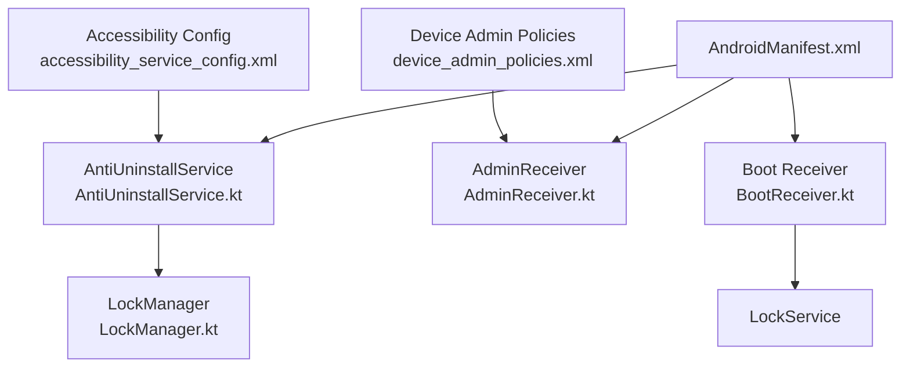
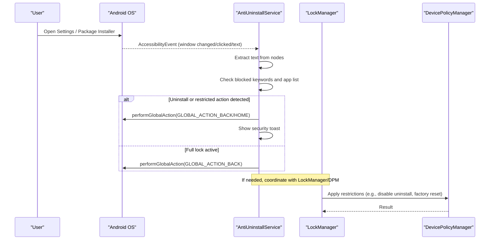
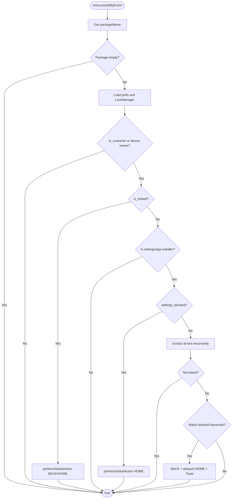
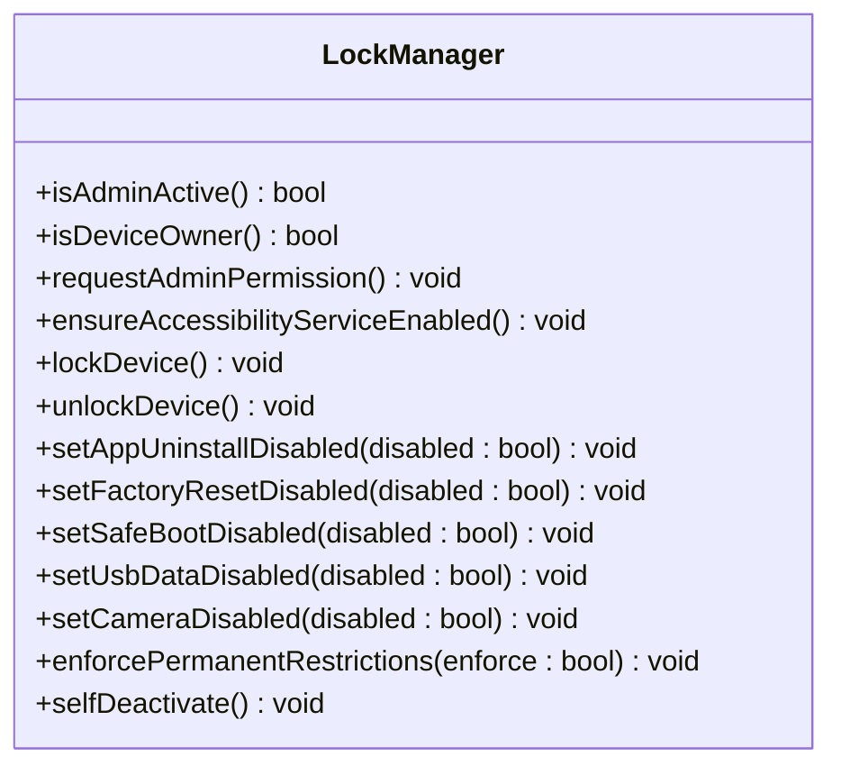
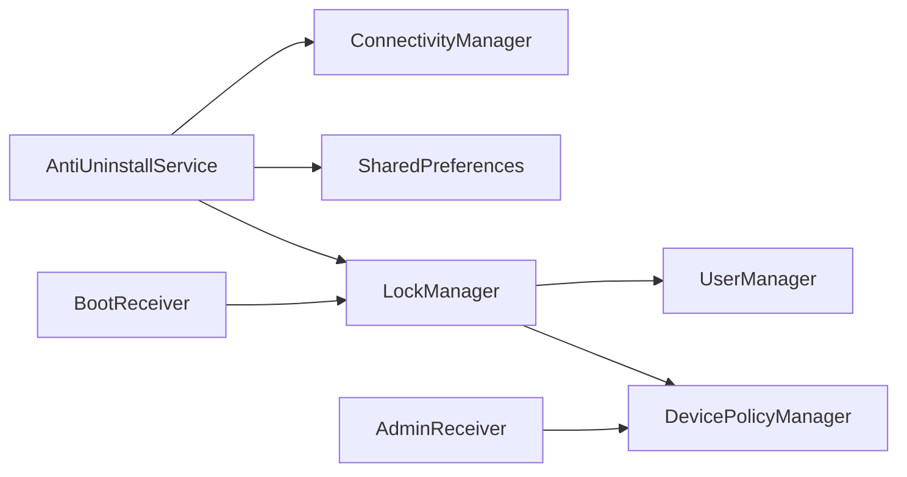

# Anti-Uninstall Service

<cite>
**Referenced Files in This Document**
- [AntiUninstallService.kt](file://app/src/main/java/com/pksafe/lock/manager/service/AntiUninstallService.kt)
- [accessibility_service_config.xml](file://app/src/main/res/xml/accessibility_service_config.xml)
- [AndroidManifest.xml](file://app/src/main/AndroidManifest.xml)
- [LockManager.kt](file://app/src/main/java/com/pksafe/lock/manager/util/LockManager.kt)
- [AdminReceiver.kt](file://app/src/main/java/com/pksafe/lock/manager/receiver/AdminReceiver.kt)
- [BootReceiver.kt](file://app/src/main/java/com/pksafe/lock/manager/receiver/BootReceiver.kt)
- [device_admin_policies.xml](file://app/src/main/res/xml/device_admin_policies.xml)
</cite>

## Table of Contents
1. [Introduction](#introduction)
2. [Project Structure](#project-structure)
3. [Core Components](#core-components)
4. [Architecture Overview](#architecture-overview)
5. [Detailed Component Analysis](#detailed-component-analysis)
6. [Dependency Analysis](#dependency-analysis)
7. [Performance Considerations](#performance-considerations)
8. [Troubleshooting Guide](#troubleshooting-guide)
9. [Conclusion](#conclusion)

## Introduction
This document explains the Anti-Uninstall Service implementation that provides tamper protection and prevents unauthorized removal or configuration changes on Android devices. It focuses on:
- Accessibility service architecture for monitoring system events and blocking uninstall attempts
- Service registration and accessibility permissions handling
- System event interception mechanisms to detect and prevent risky actions
- Anti-tampering strategies including package manager change detection, settings modification monitoring, and recovery mechanisms
- Coordination with Device Policy Manager (DPM) for stronger enforcement
- Accessibility limitations, user consent requirements, and fallback behaviors when accessibility services are disabled

## Project Structure
The anti-uninstall protection spans several components:
- Accessibility service that monitors UI events and blocks risky interactions
- Device Admin and Device Owner policies for strong restrictions
- Boot-time and provisioning receivers to ensure persistence and activation
- Utility layer to manage device policies and enforce locks

**Diagram sources**
- [accessibility_service_config.xml:1-8](file://app/src/main/res/xml/accessibility_service_config.xml#L1-L8)
- [AntiUninstallService.kt:1-224](file://app/src/main/java/com/pksafe/lock/manager/service/AntiUninstallService.kt#L1-L224)
- [LockManager.kt:1-406](file://app/src/main/java/com/pksafe/lock/manager/util/LockManager.kt#L1-L406)
- [device_admin_policies.xml:1-13](file://app/src/main/res/xml/device_admin_policies.xml#L1-L13)
- [AdminReceiver.kt:1-104](file://app/src/main/java/com/pksafe/lock/manager/receiver/AdminReceiver.kt#L1-L104)
- [BootReceiver.kt:1-27](file://app/src/main/java/com/pksafe/lock/manager/receiver/BootReceiver.kt#L1-L27)
- [AndroidManifest.xml:73-112](file://app/src/main/AndroidManifest.xml#L73-L112)

**Section sources**
- [AndroidManifest.xml:73-112](file://app/src/main/AndroidManifest.xml#L73-L112)
- [accessibility_service_config.xml:1-8](file://app/src/main/res/xml/accessibility_service_config.xml#L1-L8)

## Core Components
- AntiUninstallService: An AccessibilityService that intercepts window state/content changes and view interactions to block uninstall-related actions and restrict access to sensitive settings.
- LockManager: Orchestrates Device Policy Manager operations to enforce restrictions such as disabling app uninstallation, factory reset, USB file transfer, and more. Also enables the accessibility service via enterprise APIs when acting as Device Owner.
- AdminReceiver: Handles device admin lifecycle events, grants critical permissions when enabled, and marks provisioning completion.
- BootReceiver: Restarts protective services after boot if device admin is active and overlay permission is granted.
- Accessibility Configuration: Declares event types, flags, and capabilities required for content retrieval and interaction prevention.

**Section sources**
- [AntiUninstallService.kt:22-224](file://app/src/main/java/com/pksafe/lock/manager/service/AntiUninstallService.kt#L22-L224)
- [LockManager.kt:27-108](file://app/src/main/java/com/pksafe/lock/manager/util/LockManager.kt#L27-L108)
- [AdminReceiver.kt:14-104](file://app/src/main/java/com/pksafe/lock/manager/receiver/AdminReceiver.kt#L14-L104)
- [BootReceiver.kt:10-27](file://app/src/main/java/com/pksafe/lock/manager/receiver/BootReceiver.kt#L10-L27)
- [accessibility_service_config.xml:1-8](file://app/src/main/res/xml/accessibility_service_config.xml#L1-L8)

## Architecture Overview
The protection stack combines accessibility monitoring with device policy enforcement:
- The accessibility service scans UI text and node trees to detect uninstall prompts or restricted settings and responds by navigating away or returning to home.
- When a customer mode is active (via device owner or provisioning), the service enforces stricter behavior, including full device lock and blocking of specific apps.
- LockManager uses Device Policy Manager to apply hard restrictions and ensure the accessibility service remains enabled even across reboots or tampering attempts.

**Diagram sources**
- [AntiUninstallService.kt:136-211](file://app/src/main/java/com/pksafe/lock/manager/service/AntiUninstallService.kt#L136-L211)
- [LockManager.kt:111-192](file://app/src/main/java/com/pksafe/lock/manager/util/LockManager.kt#L111-L192)

## Detailed Component Analysis

### AntiUninstallService
Responsibilities:
- Monitor accessibility events for window changes, clicks, and text updates
- Recursively extract text from the active window to detect uninstall prompts or restricted settings
- Block navigation into settings/installer screens when configured
- Enforce full device lock by returning to home/back when locked
- Coordinate with LockManager to check customer mode and device owner status
- Register connectivity receiver to auto-lock when offline and auto-lock enabled

Key behaviors:
- Blocked keywords include terms related to uninstall, device admin, accessibility, developer options, factory reset, etc.
- App blocking supports known package mappings and custom keys stored in preferences
- On service connect, registers connectivity broadcast receiver; on destroy, unregisters it safely
- Uses global actions to navigate back/home to prevent progression into restricted flows

**Diagram sources**
- [AntiUninstallService.kt:119-211](file://app/src/main/java/com/pksafe/lock/manager/service/AntiUninstallService.kt#L119-L211)

**Section sources**
- [AntiUninstallService.kt:22-224](file://app/src/main/java/com/pksafe/lock/manager/service/AntiUninstallService.kt#L22-L224)

### LockManager
Responsibilities:
- Enable/disable device admin and device owner features
- Ensure accessibility service is enabled using enterprise APIs when device owner
- Apply hard restrictions to prevent bypasses (factory reset, USB transfer, safe boot, debugging, status bar expansion)
- Provide granular controls for camera, app install/uninstall, outgoing calls, factory reset, safe boot
- Hide applications via device owner API when available
- Self-deactivate by clearing restrictions and removing device admin privileges

Key methods relevant to anti-uninstall:
- ensureAccessibilityServiceEnabled: Sets secure settings to enable the accessibility service via DevicePolicyManager
- setAppUninstallDisabled: Disables app uninstallation via user restrictions when device owner
- enforcePermanentRestrictions: Applies permanent restrictions like factory reset and USB transfer blocking
- lockDevice/unlockDevice: Starts overlay service and applies/removes hardware restrictions

**Diagram sources**
- [LockManager.kt:27-406](file://app/src/main/java/com/pksafe/lock/manager/util/LockManager.kt#L27-L406)

**Section sources**
- [LockManager.kt:27-406](file://app/src/main/java/com/pksafe/lock/manager/util/LockManager.kt#L27-L406)

### AdminReceiver and BootReceiver
- AdminReceiver:
  - On device admin enabled or profile provisioning complete, fetches IMEI and marks provisioning complete
  - Grants critical permissions to self when device owner
  - Launches the app to finalize setup
- BootReceiver:
  - On boot completed, restarts protective foreground service if device admin is active and overlay permission granted

**Section sources**
- [AdminReceiver.kt:14-104](file://app/src/main/java/com/pksafe/lock/manager/receiver/AdminReceiver.kt#L14-L104)
- [BootReceiver.kt:10-27](file://app/src/main/java/com/pksafe/lock/manager/receiver/BootReceiver.kt#L10-L27)

### Accessibility Configuration and Manifest Registration
- Accessibility service config declares:
  - Event types: window state changed, content changed, view clicked, text changed
  - Feedback type: generic
  - Flags: default, include not important views, request filter key events, retrieve interactive windows
  - Capability: can retrieve window content
- Manifest registers:
  - AntiUninstallService with BIND_ACCESSIBILITY_SERVICE permission and exported flag
  - Intent filter for accessibility service action
  - Metadata pointing to accessibility config resource

**Section sources**
- [accessibility_service_config.xml:1-8](file://app/src/main/res/xml/accessibility_service_config.xml#L1-L8)
- [AndroidManifest.xml:101-112](file://app/src/main/AndroidManifest.xml#L101-L112)

## Dependency Analysis
- AntiUninstallService depends on:
  - LockManager for device owner checks and enforcement
  - SharedPreferences for runtime flags (customer mode, lock state, settings blocked, blocked apps)
  - ConnectivityManager for network state monitoring
- LockManager depends on:
  - DevicePolicyManager for enterprise-level restrictions
  - UserManager for user restriction management
  - TelephonyManager for IMEI retrieval during provisioning
- AdminReceiver depends on:
  - DevicePolicyManager to grant permissions and mark provisioning complete
- BootReceiver depends on:
  - LockManager to determine whether to start protective services

**Diagram sources**
- [AntiUninstallService.kt:16-117](file://app/src/main/java/com/pksafe/lock/manager/service/AntiUninstallService.kt#L16-L117)
- [LockManager.kt:27-108](file://app/src/main/java/com/pksafe/lock/manager/util/LockManager.kt#L27-L108)
- [AdminReceiver.kt:43-104](file://app/src/main/java/com/pksafe/lock/manager/receiver/AdminReceiver.kt#L43-L104)
- [BootReceiver.kt:10-27](file://app/src/main/java/com/pksafe/lock/manager/receiver/BootReceiver.kt#L10-L27)

**Section sources**
- [AntiUninstallService.kt:16-117](file://app/src/main/java/com/pksafe/lock/manager/service/AntiUninstallService.kt#L16-L117)
- [LockManager.kt:27-108](file://app/src/main/java/com/pksafe/lock/manager/util/LockManager.kt#L27-L108)

## Performance Considerations
- Accessibility event processing should remain lightweight:
  - Avoid heavy computations inside onAccessibilityEvent
  - Use efficient text extraction and early exits for non-target packages
- Recursive text extraction can be expensive on large view hierarchies:
  - Ensure proper recycling of nodes to avoid memory leaks
  - Limit depth or scope where possible
- Network checks and broadcasts:
  - Connectivity checks should be concise and avoid blocking the main thread
- Device policy operations:
  - Prefer batched or conditional application of restrictions to minimize overhead

[No sources needed since this section provides general guidance]

## Troubleshooting Guide
Common issues and resolutions:
- Accessibility service not enabled:
  - Verify service registration in manifest and metadata reference
  - Use LockManager.ensureAccessibilityServiceEnabled when device owner to reliably enable via enterprise APIs
  - Check ENABLED_ACCESSIBILITY_SERVICES setting and ACCESSIBILITY_ENABLED flag
- Tampering attempts:
  - If accessibility service is disabled externally, LockManager can re-enable it when device owner
  - Apply permanent restrictions to block factory reset and debugging features
- Uninstall attempts:
  - Ensure setAppUninstallDisabled is applied when device owner
  - Confirm blocked keyword matching and settings app detection logic is functioning
- Boot-time failures:
  - Ensure BootReceiver starts protective services when device admin is active and overlay permission granted
- Permission denials:
  - For device owner flows, confirm AdminReceiver grants necessary permissions and provisioning completes

**Section sources**
- [LockManager.kt:81-108](file://app/src/main/java/com/pksafe/lock/manager/util/LockManager.kt#L81-L108)
- [LockManager.kt:239-261](file://app/src/main/java/com/pksafe/lock/manager/util/LockManager.kt#L239-L261)
- [AntiUninstallService.kt:136-211](file://app/src/main/java/com/pksafe/lock/manager/service/AntiUninstallService.kt#L136-L211)
- [BootReceiver.kt:10-27](file://app/src/main/java/com/pksafe/lock/manager/receiver/BootReceiver.kt#L10-L27)
- [AdminReceiver.kt:43-104](file://app/src/main/java/com/pksafe/lock/manager/receiver/AdminReceiver.kt#L43-L104)

## Conclusion
The Anti-Uninstall Service integrates accessibility monitoring with robust device policy enforcement to protect against unauthorized uninstallation and tampering. By combining real-time UI inspection, keyword-based risk detection, and enterprise-grade restrictions, the system maintains strong protection while respecting user consent and platform constraints. Device owner mode significantly enhances reliability and resilience, ensuring protections persist across reboots and mitigating common bypass techniques.

[No sources needed since this section summarizes without analyzing specific files]