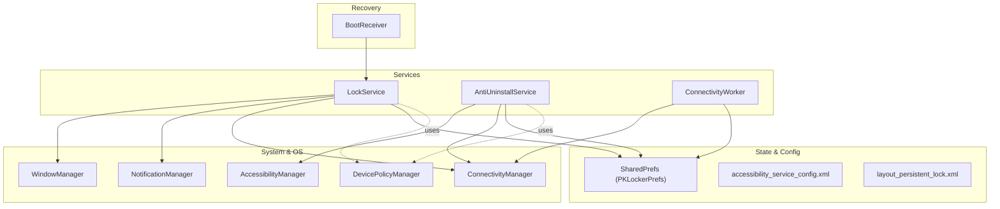
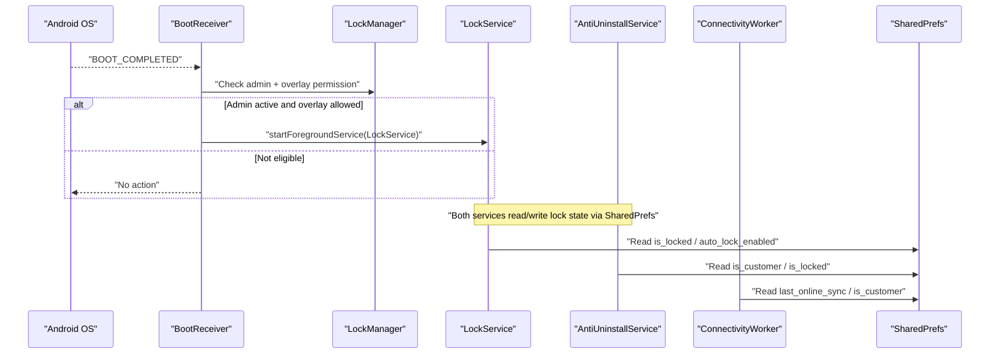
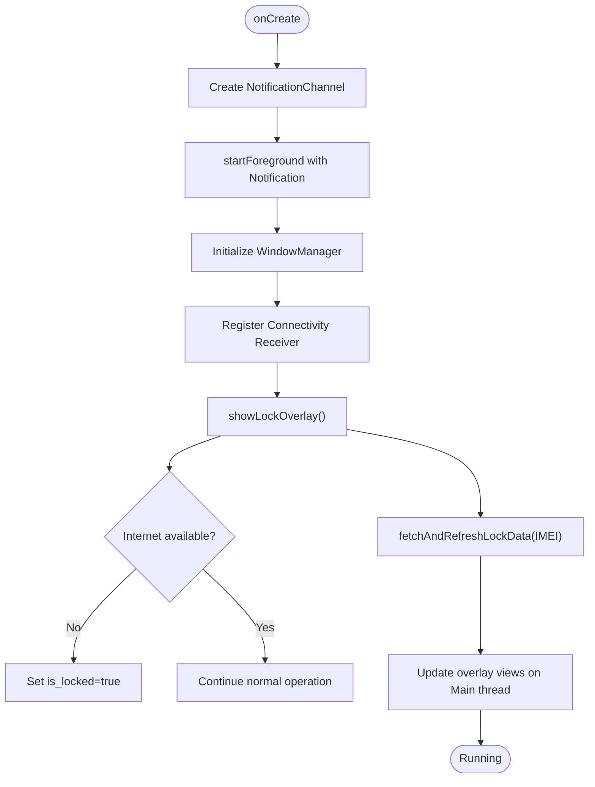
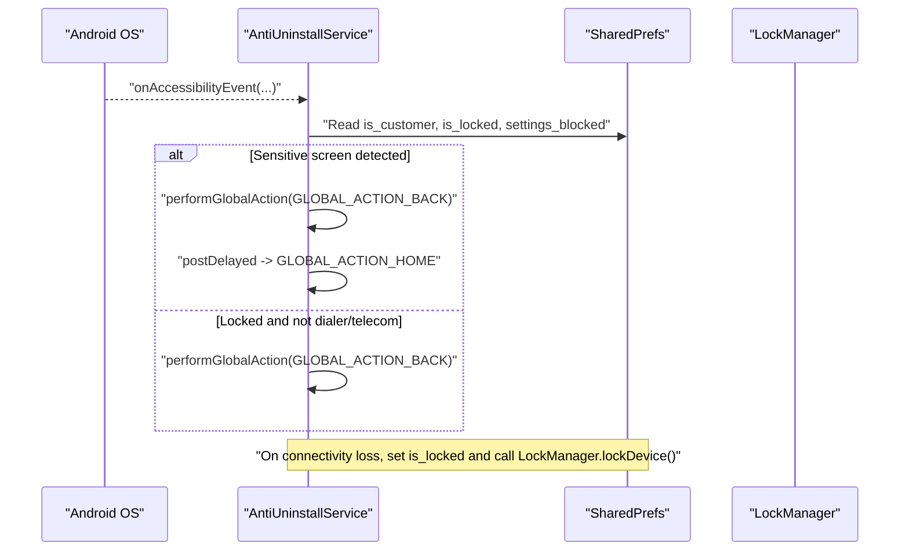
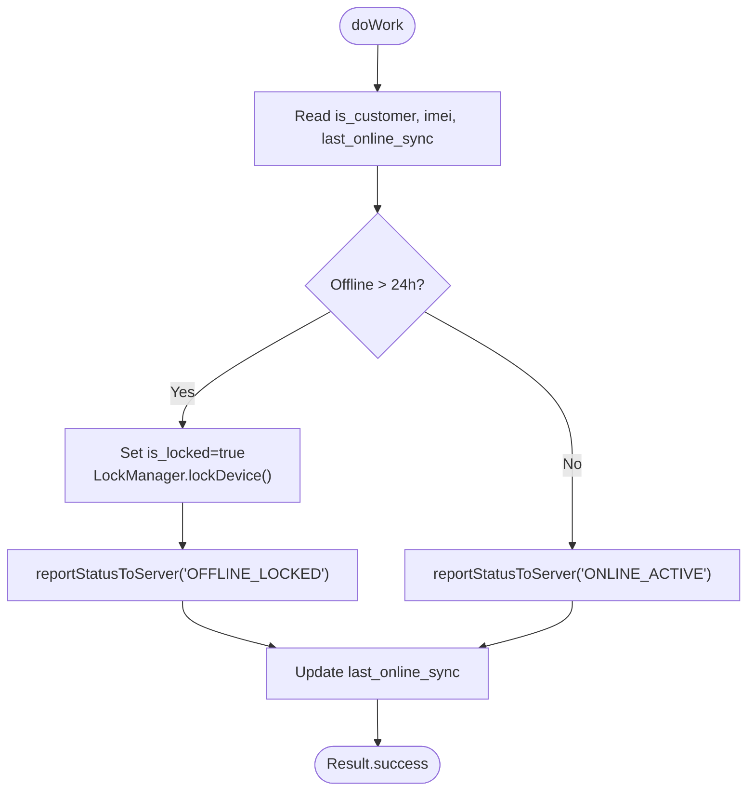
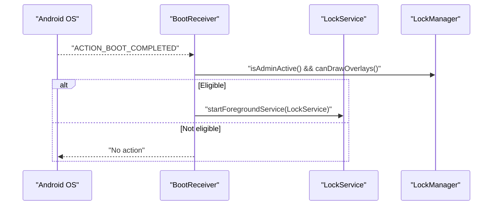
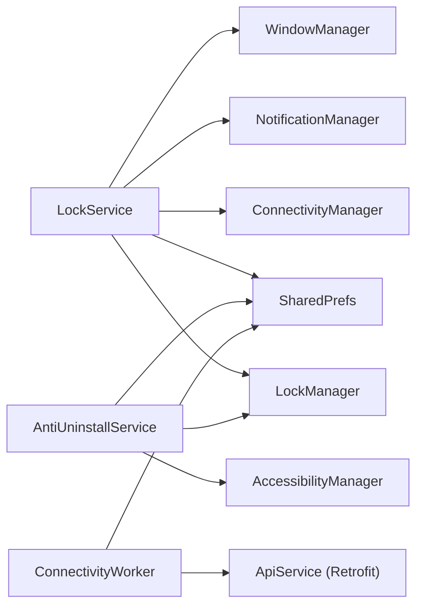

# Background Services

<cite>
**Referenced Files in This Document**
- [LockService.kt](file://app/src/main/java/com/pksafe/lock/manager/service/LockService.kt)
- [AntiUninstallService.kt](file://app/src/main/java/com/pksafe/lock/manager/service/AntiUninstallService.kt)
- [ConnectivityWorker.kt](file://app/src/main/java/com/pksafe/lock/manager/service/ConnectivityWorker.kt)
- [AndroidManifest.xml](file://app/src/main/AndroidManifest.xml)
- [accessibility_service_config.xml](file://app/src/main/res/xml/accessibility_service_config.xml)
- [layout_persistent_lock.xml](file://app/src/main/res/layout/layout_persistent_lock.xml)
- [LockManager.kt](file://app/src/main/java/com/pksafe/lock/manager/util/LockManager.kt)
- [BootReceiver.kt](file://app/src/main/java/com/pksafe/lock/manager/receiver/BootReceiver.kt)
</cite>

## Table of Contents
1. [Introduction](#introduction)
2. [Project Structure](#project-structure)
3. [Core Components](#core-components)
4. [Architecture Overview](#architecture-overview)
5. [Detailed Component Analysis](#detailed-component-analysis)
6. [Dependency Analysis](#dependency-analysis)
7. [Performance Considerations](#performance-considerations)
8. [Troubleshooting Guide](#troubleshooting-guide)
9. [Conclusion](#conclusion)

## Introduction
This document explains PK Locker’s background services architecture focused on persistent, system-level operations. It covers:
- LockService: a foreground service that maintains a persistent overlay screen and monitors device state to enforce locking behavior.
- AntiUninstallService: an Accessibility-based guard that prevents tampering and unauthorized removal or configuration changes.
- ConnectivityWorker: a WorkManager worker that monitors network connectivity and triggers automatic sync and lock actions based on offline duration.

It also documents lifecycle management, foreground notifications, system event processing, restart mechanisms, battery optimization considerations, Android version compatibility, inter-service communication patterns, and state synchronization approaches.

## Project Structure
The background services are implemented under the service package and supported by utilities, receivers, and UI resources:
- Services: LockService (foreground overlay), AntiUninstallService (accessibility guard), ConnectivityWorker (network monitoring).
- Utilities: LockManager centralizes Device Policy Manager interactions and enforcement logic.
- Receivers: BootReceiver starts critical services after boot.
- Resources: Overlay layout and accessibility configuration define user-visible lock UI and accessibility capabilities.

**Diagram sources**
- [LockService.kt:50-123](file://app/src/main/java/com/pksafe/lock/manager/service/LockService.kt#L50-L123)
- [AntiUninstallService.kt:82-117](file://app/src/main/java/com/pksafe/lock/manager/service/AntiUninstallService.kt#L82-L117)
- [ConnectivityWorker.kt:17-47](file://app/src/main/java/com/pksafe/lock/manager/service/ConnectivityWorker.kt#L17-L47)
- [AndroidManifest.xml:73-112](file://app/src/main/AndroidManifest.xml#L73-L112)
- [accessibility_service_config.xml:1-8](file://app/src/main/res/xml/accessibility_service_config.xml#L1-L8)
- [layout_persistent_lock.xml:1-234](file://app/src/main/res/layout/layout_persistent_lock.xml#L1-L234)
- [BootReceiver.kt:10-26](file://app/src/main/java/com/pksafe/lock/manager/receiver/BootReceiver.kt#L10-L26)

**Section sources**
- [AndroidManifest.xml:73-112](file://app/src/main/AndroidManifest.xml#L73-L112)
- [accessibility_service_config.xml:1-8](file://app/src/main/res/xml/accessibility_service_config.xml#L1-L8)
- [layout_persistent_lock.xml:1-234](file://app/src/main/res/layout/layout_persistent_lock.xml#L1-L234)

## Core Components
- LockService: Foreground service with a persistent overlay, ongoing notification, auto-lock via connectivity events, and dynamic data refresh from server.
- AntiUninstallService: Accessibility service that intercepts sensitive settings screens and blocks uninstallation attempts; also participates in auto-lock on connectivity loss.
- ConnectivityWorker: Scheduled worker that checks online/offline status, enforces local lock if offline too long, and reports heartbeat/status to server.
- Supporting pieces: BootReceiver ensures services start after reboot; LockManager centralizes Device Owner restrictions and service orchestration.

**Section sources**
- [LockService.kt:50-123](file://app/src/main/java/com/pksafe/lock/manager/service/LockService.kt#L50-L123)
- [AntiUninstallService.kt:82-117](file://app/src/main/java/com/pksafe/lock/manager/service/AntiUninstallService.kt#L82-L117)
- [ConnectivityWorker.kt:17-47](file://app/src/main/java/com/pksafe/lock/manager/service/ConnectivityWorker.kt#L17-L47)
- [BootReceiver.kt:10-26](file://app/src/main/java/com/pksafe/lock/manager/receiver/BootReceiver.kt#L10-L26)
- [LockManager.kt:111-148](file://app/src/main/java/com/pksafe/lock/manager/util/LockManager.kt#L111-L148)

## Architecture Overview
PK Locker uses a layered approach:
- Enforcement layer: LockManager applies Device Policy Manager restrictions and orchestrates starting/stopping LockService.
- Persistence layer: Shared preferences store lock state, flags, and last-sync timestamps.
- Monitoring layer: ConnectivityWorker and LockService monitor network state and trigger locks or updates.
- Protection layer: AntiUninstallService intercepts sensitive UI flows to prevent tampering.

**Diagram sources**
- [BootReceiver.kt:10-26](file://app/src/main/java/com/pksafe/lock/manager/receiver/BootReceiver.kt#L10-L26)
- [LockService.kt:50-79](file://app/src/main/java/com/pksafe/lock/manager/service/LockService.kt#L50-L79)
- [AntiUninstallService.kt:82-117](file://app/src/main/java/com/pksafe/lock/manager/service/AntiUninstallService.kt#L82-L117)
- [ConnectivityWorker.kt:17-47](file://app/src/main/java/com/pksafe/lock/manager/service/ConnectivityWorker.kt#L17-L47)

## Detailed Component Analysis

### LockService: Persistent Overlay and Foreground Lifecycle
Responsibilities:
- Starts as a foreground service with an ongoing notification channel and notification.
- Draws a full-screen overlay using WindowManager with appropriate flags for modern Android versions.
- Registers a connectivity receiver to auto-lock when internet disconnects (if enabled).
- Fetches live EMI/shop data from the server and updates the overlay UI.
- Handles unlock flow via a hidden code entry and clears hardware restrictions through LockManager.

Key behaviors:
- Foreground lifecycle: onCreate sets up notification channel and starts foreground with special-use type on newer Android versions.
- Overlay creation: Uses TYPE_APPLICATION_OVERLAY on API 26+ and legacy TYPE_PHONE below; includes flags to keep screen on, show when locked, and allow keyboard interaction.
- Auto-lock on connectivity loss: Listens to connectivity broadcasts and toggles lock state when auto-lock is enabled and device is offline.
- Live data refresh: Uses Retrofit to fetch device and EMI info, persists to SharedPrefs, and updates overlay views on the main thread.
- Unlock path: Validates master code derived from IMEI (fallback to default), calls LockManager.unlockDevice(), and stops itself.

**Diagram sources**
- [LockService.kt:54-79](file://app/src/main/java/com/pksafe/lock/manager/service/LockService.kt#L54-L79)
- [LockService.kt:82-105](file://app/src/main/java/com/pksafe/lock/manager/service/LockService.kt#L82-L105)
- [LockService.kt:125-233](file://app/src/main/java/com/pksafe/lock/manager/service/LockService.kt#L125-L233)
- [LockService.kt:240-314](file://app/src/main/java/com/pksafe/lock/manager/service/LockService.kt#L240-L314)

**Section sources**
- [LockService.kt:50-123](file://app/src/main/java/com/pksafe/lock/manager/service/LockService.kt#L50-L123)
- [LockService.kt:125-233](file://app/src/main/java/com/pksafe/lock/manager/service/LockService.kt#L125-L233)
- [LockService.kt:240-314](file://app/src/main/java/com/pksafe/lock/manager/service/LockService.kt#L240-L314)
- [layout_persistent_lock.xml:1-234](file://app/src/main/res/layout/layout_persistent_lock.xml#L1-L234)

### AntiUninstallService: Tamper Protection via Accessibility
Responsibilities:
- Monitors accessibility events to detect attempts to access Settings, Package Installer, or other sensitive screens.
- Blocks navigation into restricted areas by performing global back/home actions.
- Enforces app blocking rules and full device lock when applicable.
- Participates in auto-lock on connectivity loss for customer devices.

Key behaviors:
- Event interception: Extracts text from active window and matches against blocked keywords to identify restricted screens.
- Navigation control: Performs GLOBAL_ACTION_BACK and GLOBAL_ACTION_HOME to prevent users from reaching destructive actions.
- Connectivity integration: On disconnect, marks device as locked and triggers LockManager.lockDevice().
- Service enablement: Can be enabled via Device Owner APIs through LockManager.ensureAccessibilityServiceEnabled().

**Diagram sources**
- [AntiUninstallService.kt:119-211](file://app/src/main/java/com/pksafe/lock/manager/service/AntiUninstallService.kt#L119-L211)
- [AntiUninstallService.kt:88-117](file://app/src/main/java/com/pksafe/lock/manager/service/AntiUninstallService.kt#L88-L117)
- [LockManager.kt:111-134](file://app/src/main/java/com/pksafe/lock/manager/util/LockManager.kt#L111-L134)

**Section sources**
- [AntiUninstallService.kt:82-117](file://app/src/main/java/com/pksafe/lock/manager/service/AntiUninstallService.kt#L82-L117)
- [AntiUninstallService.kt:119-211](file://app/src/main/java/com/pksafe/lock/manager/service/AntiUninstallService.kt#L119-L211)
- [accessibility_service_config.xml:1-8](file://app/src/main/res/xml/accessibility_service_config.xml#L1-L8)

### ConnectivityWorker: Network Monitoring and Automatic Sync
Responsibilities:
- Checks whether the device has been offline beyond a threshold and enforces local lock if so.
- Sends periodic status updates to the server when online.
- Updates last sync timestamp locally upon successful reporting.

Key behaviors:
- Offline detection: Compares last_online_sync timestamp with current time; if exceeded, sets is_locked and calls LockManager.lockDevice().
- Heartbeat: If within limits, reports ONLINE_ACTIVE to server.
- Reporting: Uses Retrofit to send AdvancedControlRequest with Bearer token.

**Diagram sources**
- [ConnectivityWorker.kt:17-47](file://app/src/main/java/com/pksafe/lock/manager/service/ConnectivityWorker.kt#L17-L47)
- [ConnectivityWorker.kt:49-70](file://app/src/main/java/com/pksafe/lock/manager/service/ConnectivityWorker.kt#L49-L70)

**Section sources**
- [ConnectivityWorker.kt:17-70](file://app/src/main/java/com/pksafe/lock/manager/service/ConnectivityWorker.kt#L17-L70)

### Boot Recovery and Service Restart
- BootReceiver listens for BOOT_COMPLETED and starts LockService as a foreground service if device admin is active and overlay permission is granted.
- LockService returns START_STICKY to encourage system restart after being killed.
- AntiUninstallService can be enabled via Device Owner APIs to ensure it remains active across reboots.

**Diagram sources**
- [BootReceiver.kt:10-26](file://app/src/main/java/com/pksafe/lock/manager/receiver/BootReceiver.kt#L10-L26)
- [LockService.kt:50-79](file://app/src/main/java/com/pksafe/lock/manager/service/LockService.kt#L50-L79)
- [LockManager.kt:63-73](file://app/src/main/java/com/pksafe/lock/manager/util/LockManager.kt#L63-L73)

**Section sources**
- [BootReceiver.kt:10-26](file://app/src/main/java/com/pksafe/lock/manager/receiver/BootReceiver.kt#L10-L26)
- [LockService.kt:50-79](file://app/src/main/java/com/pksafe/lock/manager/service/LockService.kt#L50-L79)

## Dependency Analysis
- LockService depends on:
  - WindowManager for overlay rendering.
  - NotificationManager for ongoing notification.
  - ConnectivityManager for connectivity events.
  - SharedPrefs for lock state and settings.
  - LockManager for unlocking and applying restrictions.
- AntiUninstallService depends on:
  - AccessibilityManager and event tree traversal.
  - SharedPrefs for policy flags.
  - LockManager for triggering lock actions.
- ConnectivityWorker depends on:
  - ConnectivityManager indirectly via system state.
  - SharedPrefs for timestamps and flags.
  - ApiService (via Retrofit) for server reporting.

**Diagram sources**
- [LockService.kt:50-123](file://app/src/main/java/com/pksafe/lock/manager/service/LockService.kt#L50-L123)
- [AntiUninstallService.kt:82-117](file://app/src/main/java/com/pksafe/lock/manager/service/AntiUninstallService.kt#L82-L117)
- [ConnectivityWorker.kt:17-70](file://app/src/main/java/com/pksafe/lock/manager/service/ConnectivityWorker.kt#L17-L70)

**Section sources**
- [LockService.kt:50-123](file://app/src/main/java/com/pksafe/lock/manager/service/LockService.kt#L50-L123)
- [AntiUninstallService.kt:82-117](file://app/src/main/java/com/pksafe/lock/manager/service/AntiUninstallService.kt#L82-L117)
- [ConnectivityWorker.kt:17-70](file://app/src/main/java/com/pksafe/lock/manager/service/ConnectivityWorker.kt#L17-L70)

## Performance Considerations
- Overlay performance: The overlay uses a full-screen view with minimal interactive elements; avoid heavy computations on the main thread during UI updates.
- Network calls: ConnectivityWorker and LockService perform network requests off the main thread; ensure retries and timeouts are handled at the Retrofit level.
- Battery optimization:
  - ConnectivityWorker should be scheduled with constraints (e.g., network availability) to reduce wakeups.
  - Foreground service notifications help mitigate aggressive background execution limits.
  - Avoid frequent polling; rely on system broadcasts (connectivity) and WorkManager scheduling.
- Memory: Ensure proper cleanup of overlays and unregistering receivers in onDestroy to prevent leaks.

[No sources needed since this section provides general guidance]

## Troubleshooting Guide
Common issues and resolutions:
- Overlay not appearing:
  - Verify SYSTEM_ALERT_WINDOW permission and that overlay permission is granted.
  - Ensure LockService is started as foreground on Android O+.
- Accessibility service disabled:
  - Use LockManager.ensureAccessibilityServiceEnabled() to enable via Device Owner APIs.
  - Confirm accessibility_service_config.xml is correctly referenced in manifest.
- Service killed by system:
  - Keep START_STICKY return value and maintain a persistent notification.
  - Use BootReceiver to restart services after reboot.
- Auto-lock not triggered:
  - Check auto_lock_enabled flag and connectivity broadcast registration.
  - Validate isOnline() logic and permissions for network state queries.
- Server reporting failures:
  - Ensure valid auth token and correct endpoint usage in ConnectivityWorker.
  - Log errors and retry strategies should be implemented at the API layer.

**Section sources**
- [LockService.kt:50-123](file://app/src/main/java/com/pksafe/lock/manager/service/LockService.kt#L50-L123)
- [AntiUninstallService.kt:82-117](file://app/src/main/java/com/pksafe/lock/manager/service/AntiUninstallService.kt#L82-L117)
- [ConnectivityWorker.kt:49-70](file://app/src/main/java/com/pksafe/lock/manager/service/ConnectivityWorker.kt#L49-L70)
- [LockManager.kt:63-108](file://app/src/main/java/com/pksafe/lock/manager/util/LockManager.kt#L63-L108)

## Conclusion
PK Locker’s background services form a robust enforcement and protection system:
- LockService provides a resilient, user-visible lock overlay with ongoing notifications and live data updates.
- AntiUninstallService safeguards against tampering by intercepting sensitive UI flows and enforcing device-wide locks.
- ConnectivityWorker ensures consistent state synchronization and automatic locking when devices remain offline beyond thresholds.
Together, these components leverage Android’s system APIs (Device Policy Manager, Accessibility, WindowManager, WorkManager) to deliver persistent, secure, and compatible behavior across Android versions.

[No sources needed since this section summarizes without analyzing specific files]