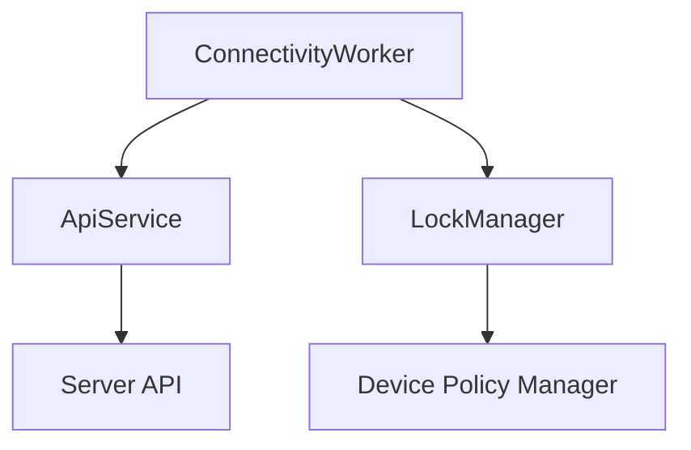
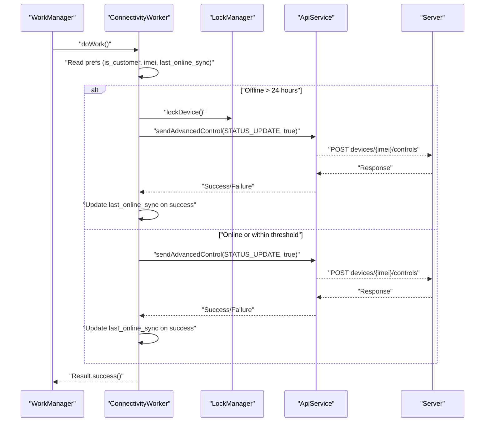
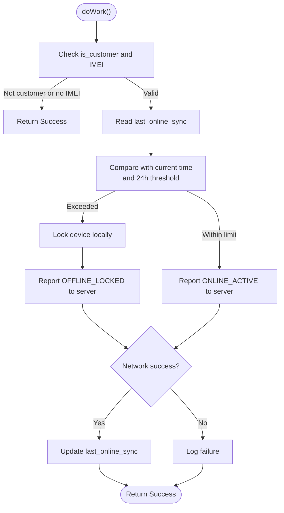
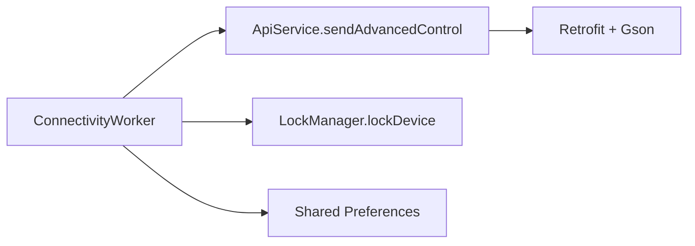

# Connectivity Worker

<cite>
**Referenced Files in This Document**
- [ConnectivityWorker.kt](file://app/src/main/java/com/pksafe/lock/manager/service/ConnectivityWorker.kt)
- [ApiService.kt](file://app/src/main/java/com/pksafe/lock/manager/data/ApiService.kt)
- [Models.kt](file://app/src/main/java/com/pksafe/lock/manager/data/Models.kt)
- [LockManager.kt](file://app/src/main/java/com/pksafe/lock/manager/util/LockManager.kt)
- [MainActivity.kt](file://app/src/main/java/com/pksafe/lock/manager/MainActivity.kt)
</cite>

## Table of Contents
1. Introduction
2. Project Structure
3. Core Components
4. Architecture Overview
5. Detailed Component Analysis
6. Dependency Analysis
7. Performance Considerations
8. Troubleshooting Guide
9. Conclusion

## Introduction
This document explains the ConnectivityWorker background processing focused on network monitoring and automatic synchronization operations. It covers how WorkManager is used to schedule network-dependent tasks, how connectivity state changes influence behavior, worker lifecycle management, retry policies for failed network requests, and battery optimization considerations. It also details connectivity monitoring logic including offline detection, connection type identification (WiFi vs mobile), and automatic sync triggers based on network availability. Concrete examples of work request configuration, constraint-based scheduling, and result handling are provided. Finally, it addresses background execution limitations, Doze mode handling, and performance optimization strategies for network-intensive operations.

## Project Structure
The ConnectivityWorker resides under the service layer and coordinates with data models and API services to perform status reporting and device locking when necessary. Related components include:
- ConnectivityWorker: Background task that checks last sync time and either locks the device or reports an online heartbeat.
- ApiService and Models: Retrofit interface and data classes used to send advanced control commands to the server.
- LockManager: Device policy enforcement to lock/unlock the device and apply restrictions.
- MainActivity: Example of WorkManager usage for periodic tasks (location sync), illustrating scheduling patterns applicable to connectivity tasks.

**Diagram sources**
- [ConnectivityWorker.kt:15-71](file://app/src/main/java/com/pksafe/lock/manager/service/ConnectivityWorker.kt#L15-L71)
- [ApiService.kt:58-63](file://app/src/main/java/com/pksafe/lock/manager/data/ApiService.kt#L58-L63)
- [LockManager.kt:111-134](file://app/src/main/java/com/pksafe/lock/manager/util/LockManager.kt#L111-L134)

**Section sources**
- [ConnectivityWorker.kt:15-71](file://app/src/main/java/com/pksafe/lock/manager/service/ConnectivityWorker.kt#L15-L71)
- [ApiService.kt:58-63](file://app/src/main/java/com/pksafe/lock/manager/data/ApiService.kt#L58-L63)
- [LockManager.kt:111-134](file://app/src/main/java/com/pksafe/lock/manager/util/LockManager.kt#L111-L134)
- [MainActivity.kt:465-476](file://app/src/main/java/com/pksafe/lock/manager/MainActivity.kt#L465-L476)

## Core Components
- ConnectivityWorker: Implements a CoroutineWorker that reads local preferences to determine if the device is a customer and whether it has been offline beyond a threshold. If so, it locks the device locally and attempts to notify the server; otherwise, it sends an online heartbeat.
- ApiService: Retrofit interface exposing endpoints for advanced control commands, including sending status updates.
- Models: Data classes representing requests/responses, including AdvancedControlRequest used by the worker to report status.
- LockManager: Provides device locking via Device Policy Manager and enforces hardware restrictions.

Key responsibilities:
- Read shared preferences for customer flag, IMEI, and last sync timestamp.
- Decide between offline lock flow and online heartbeat flow.
- Perform network calls using Retrofit and update local sync timestamp on success.
- Enforce device lock through LockManager when offline threshold is exceeded.

**Section sources**
- [ConnectivityWorker.kt:17-47](file://app/src/main/java/com/pksafe/lock/manager/service/ConnectivityWorker.kt#L17-L47)
- [ConnectivityWorker.kt:49-70](file://app/src/main/java/com/pksafe/lock/manager/service/ConnectivityWorker.kt#L49-L70)
- [ApiService.kt:58-63](file://app/src/main/java/com/pksafe/lock/manager/data/ApiService.kt#L58-L63)
- [Models.kt:216-219](file://app/src/main/java/com/pksafe/lock/manager/data/Models.kt#L216-L219)
- [LockManager.kt:111-134](file://app/src/main/java/com/pksafe/lock/manager/util/LockManager.kt#L111-L134)

## Architecture Overview
The ConnectivityWorker orchestrates background synchronization and security enforcement:
- On execution, it evaluates offline duration against a 24-hour threshold stored in shared preferences.
- If offline too long, it locks the device locally and attempts to report an offline-locked status to the server.
- If within the threshold, it sends an online-active heartbeat to the server.
- Successful network calls update the last_online_sync timestamp to prevent repeated locking.

**Diagram sources**
- [ConnectivityWorker.kt:17-70](file://app/src/main/java/com/pksafe/lock/manager/service/ConnectivityWorker.kt#L17-L70)
- [ApiService.kt:58-63](file://app/src/main/java/com/pksafe/lock/manager/data/ApiService.kt#L58-L63)
- [LockManager.kt:111-134](file://app/src/main/java/com/pksafe/lock/manager/util/LockManager.kt#L111-L134)

## Detailed Component Analysis

### ConnectivityWorker Lifecycle and Flow
- Entry point: doWork() executes in a coroutine context managed by WorkManager.
- Early exits: If not a customer or IMEI is blank, returns success without further action.
- Offline detection: Compares current time with last_online_sync; if exceeding 24 hours, triggers local lock and server notification.
- Heartbeat: Otherwise, sends an online-active status to the server.
- Network call: Uses Retrofit to call sendAdvancedControl with a Bearer token and AdvancedControlRequest payload.
- State update: On successful network call, updates last_online_sync to mark recent connectivity.

**Diagram sources**
- [ConnectivityWorker.kt:17-70](file://app/src/main/java/com/pksafe/lock/manager/service/ConnectivityWorker.kt#L17-L70)

**Section sources**
- [ConnectivityWorker.kt:17-70](file://app/src/main/java/com/pksafe/lock/manager/service/ConnectivityWorker.kt#L17-L70)

### Network Monitoring Logic and Connectivity Detection
- Offline detection relies on a persisted timestamp (last_online_sync). If the device hasn’t synced within 24 hours, it assumes prolonged offline and enforces a lock.
- Connection type identification (WiFi vs mobile) is not implemented in ConnectivityWorker itself. However, similar code elsewhere in the app demonstrates WiFi IP retrieval via WifiManager and general network interface enumeration, which can be extended to detect connection types.
- Automatic sync triggers: The worker runs periodically (as scheduled by WorkManager) and performs sync actions based on the offline threshold.

Recommendation: Integrate ConnectivityManager to detect actual connectivity state and connection type (WiFi/mobile) before deciding to lock or send heartbeats. This would allow more precise behavior such as deferring heavy syncs on mobile networks or triggering immediate locks only when no connectivity is available.

**Section sources**
- [ConnectivityWorker.kt:25-44](file://app/src/main/java/com/pksafe/lock/manager/service/ConnectivityWorker.kt#L25-L44)
- [ProvisioningQrScreen.kt:385-418](file://app/src/main/java/com/pksafe/lock/manager/ui/provisioning/ProvisioningQrScreen.kt#L385-L418)

### WorkManager Scheduling and Constraints
- The repository shows periodic scheduling for location sync using PeriodicWorkRequestBuilder and enqueueUniquePeriodicWork. This pattern can be applied to ConnectivityWorker to ensure regular execution.
- Constraint-based scheduling: While not explicitly shown for ConnectivityWorker, WorkManager supports constraints like requiring network availability. For this worker, you would typically require NO_NETWORK to trigger offline lock flows and NETWORK_UNMETERED or CONNECTED to send heartbeats efficiently.

Example patterns from the codebase:
- Periodic scheduling: See MainActivity’s scheduleLocationSync method for constructing and enqueuing a periodic work request.
- Unique work: Use ExistingPeriodicWorkPolicy.KEEP to avoid duplicate schedules.

**Section sources**
- [MainActivity.kt:465-476](file://app/src/main/java/com/pksafe/lock/manager/MainActivity.kt#L465-L476)

### Retry Policies for Failed Network Requests
- Current implementation logs failures but does not implement explicit retries. To improve resilience:
  - Configure exponential backoff and maximum retry attempts in WorkManager constraints and retry policies.
  - Use WorkManager’s retry mechanism for transient network errors while avoiding excessive retries during prolonged outages.
  - Persist retry metadata (e.g., attempt count, last error) to decide when to escalate (e.g., force lock after N failures).

**Section sources**
- [ConnectivityWorker.kt:67-69](file://app/src/main/java/com/pksafe/lock/manager/service/ConnectivityWorker.kt#L67-L69)

### Battery Optimization and Doze Mode Handling
- WorkManager respects system power-saving modes and schedules jobs opportunistically. For ConnectivityWorker:
  - Prefer periodic work with appropriate constraints to minimize wakeups.
  - Avoid tight polling loops; rely on WorkManager’s batching and deferral.
  - Ensure network calls are lightweight and fail fast to reduce battery drain.
  - Consider using JobScheduler-backed constraints (e.g., setRequiredNetworkType) to align with system optimizations.

[No sources needed since this section provides general guidance]

### Result Handling for Successful or Failed Operations
- Success path: Updates last_online_sync to reflect recent connectivity and returns ListenableWorker.Result.success().
- Failure path: Logs the exception and still returns success to indicate the worker completed its run; consider adjusting to return failure with retry parameters for critical operations.

**Section sources**
- [ConnectivityWorker.kt:63-70](file://app/src/main/java/com/pksafe/lock/manager/service/ConnectivityWorker.kt#L63-L70)

## Dependency Analysis
ConnectivityWorker depends on:
- ApiService for network communication (sendAdvancedControl).
- LockManager for enforcing device locks.
- Shared preferences for storing flags and timestamps.
- Retrofit and Gson for HTTP serialization.

**Diagram sources**
- [ConnectivityWorker.kt:15-71](file://app/src/main/java/com/pksafe/lock/manager/service/ConnectivityWorker.kt#L15-L71)
- [ApiService.kt:58-63](file://app/src/main/java/com/pksafe/lock/manager/data/ApiService.kt#L58-L63)
- [Models.kt:216-219](file://app/src/main/java/com/pksafe/lock/manager/data/Models.kt#L216-L219)
- [LockManager.kt:111-134](file://app/src/main/java/com/pksafe/lock/manager/util/LockManager.kt#L111-L134)

**Section sources**
- [ConnectivityWorker.kt:15-71](file://app/src/main/java/com/pksafe/lock/manager/service/ConnectivityWorker.kt#L15-L71)
- [ApiService.kt:58-63](file://app/src/main/java/com/pksafe/lock/manager/data/ApiService.kt#L58-L63)
- [Models.kt:216-219](file://app/src/main/java/com/pksafe/lock/manager/data/Models.kt#L216-L219)
- [LockManager.kt:111-134](file://app/src/main/java/com/pksafe/lock/manager/util/LockManager.kt#L111-L134)

## Performance Considerations
- Minimize Retrofit instantiation: Reuse a single Retrofit instance across the app to avoid overhead.
- Throttle network calls: Ensure periodic intervals are reasonable to avoid excessive requests.
- Defer heavy operations: Perform non-critical tasks off the main thread and batch where possible.
- Handle connectivity changes: Use ConnectivityManager callbacks to adjust scheduling dynamically (e.g., pause sync on metered networks).
- Optimize locking: Only enforce locks when necessary and provide quick exit paths for non-customer devices.

[No sources needed since this section provides general guidance]

## Troubleshooting Guide
Common issues and resolutions:
- No sync updates: Verify last_online_sync is being updated on successful network calls. Check logs for “OFFLINE_GUARD” messages indicating failures.
- Device not locking: Ensure LockManager has admin privileges and overlay permissions; verify lockDevice() is invoked when offline threshold is exceeded.
- Repeated locks: Confirm that last_online_sync is correctly updated after successful heartbeats; adjust thresholds if needed.
- Network errors: Inspect Retrofit responses and exceptions; implement retry policies and backoff strategies.

**Section sources**
- [ConnectivityWorker.kt:63-69](file://app/src/main/java/com/pksafe/lock/manager/service/ConnectivityWorker.kt#L63-L69)
- [LockManager.kt:111-134](file://app/src/main/java/com/pksafe/lock/manager/util/LockManager.kt#L111-L134)

## Conclusion
ConnectivityWorker provides a robust foundation for network-aware synchronization and device protection. By leveraging WorkManager for scheduling, integrating connectivity detection, implementing retry policies, and optimizing for battery efficiency, the worker can reliably maintain device state and enforce security policies. Extending connectivity detection to distinguish WiFi and mobile networks will further refine behavior, enabling smarter sync triggers and resource management.

[No sources needed since this section summarizes without analyzing specific files]