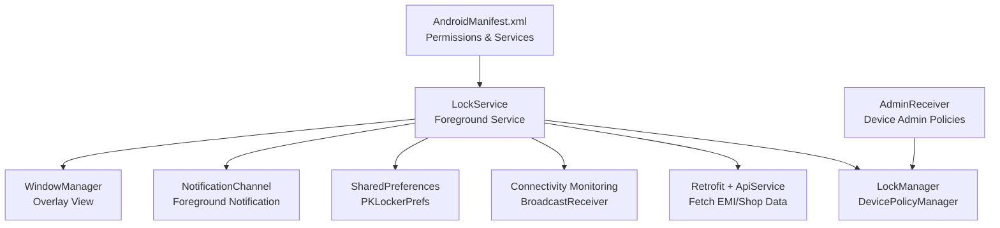
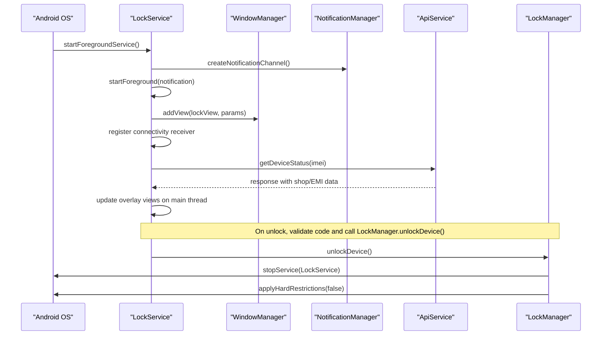
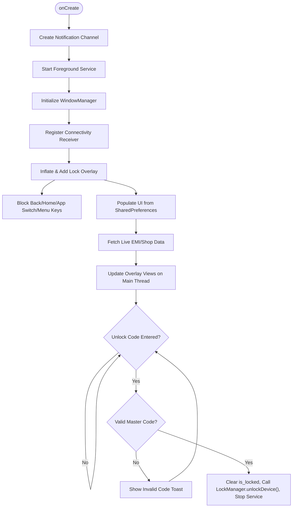
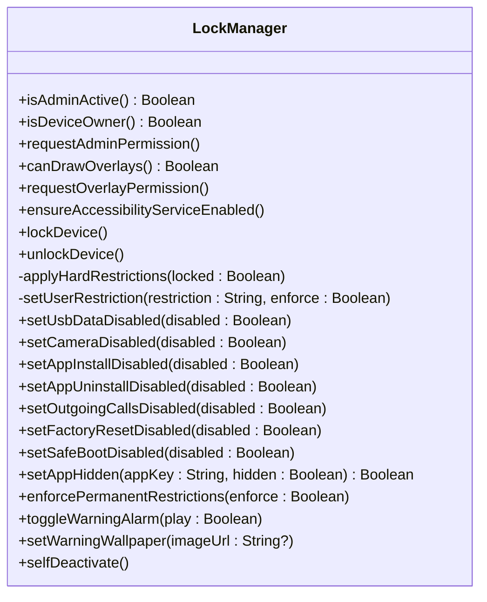
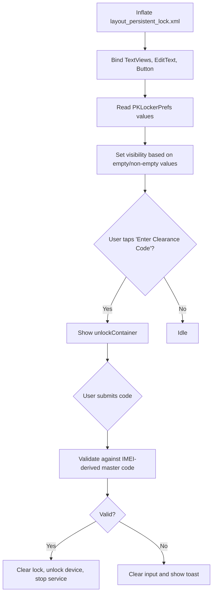
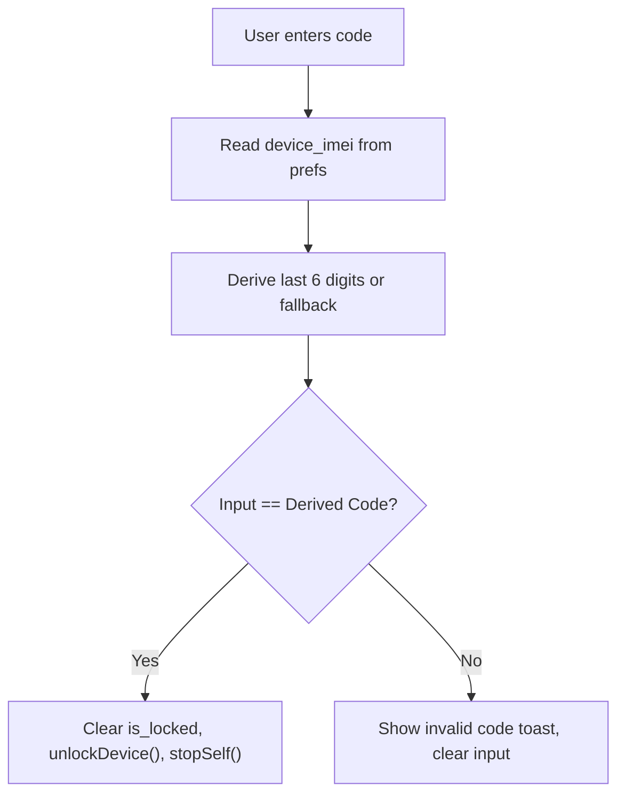
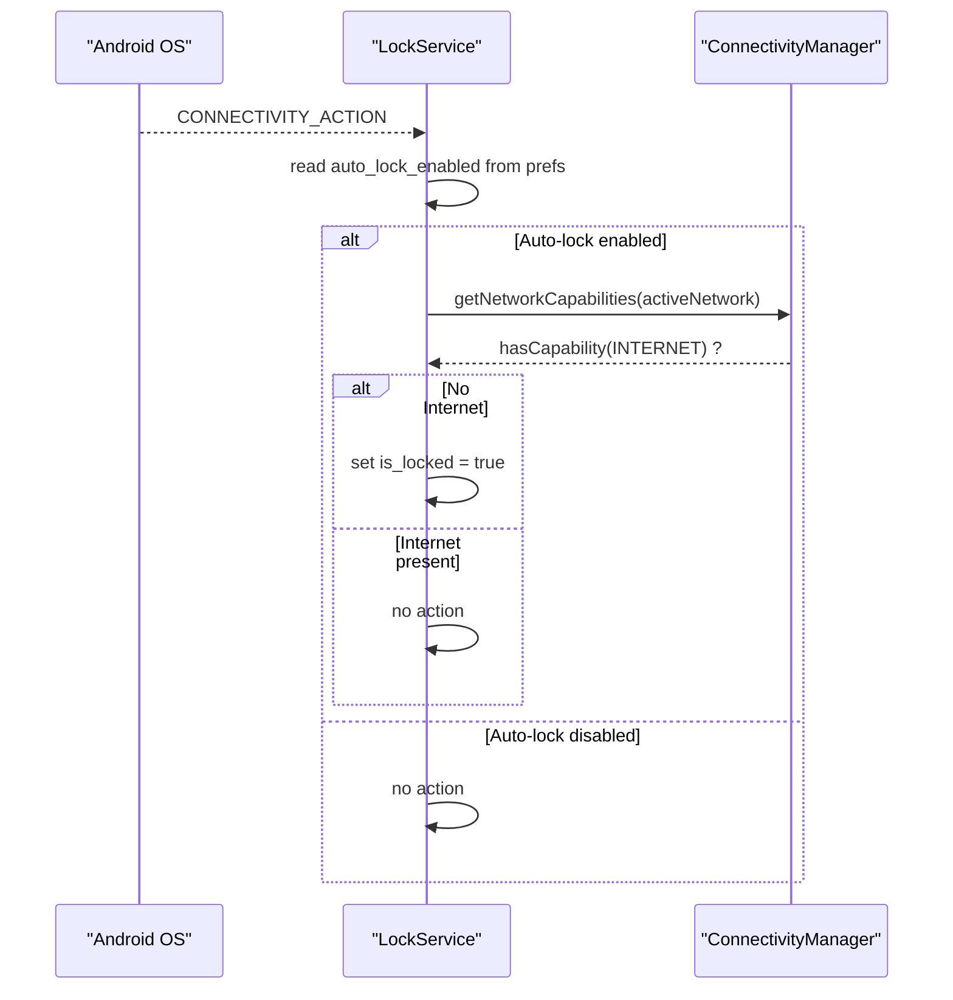
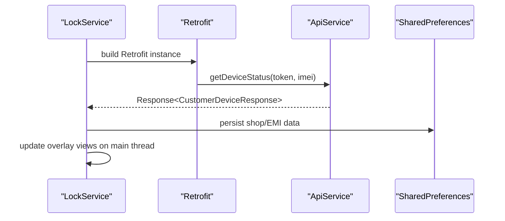
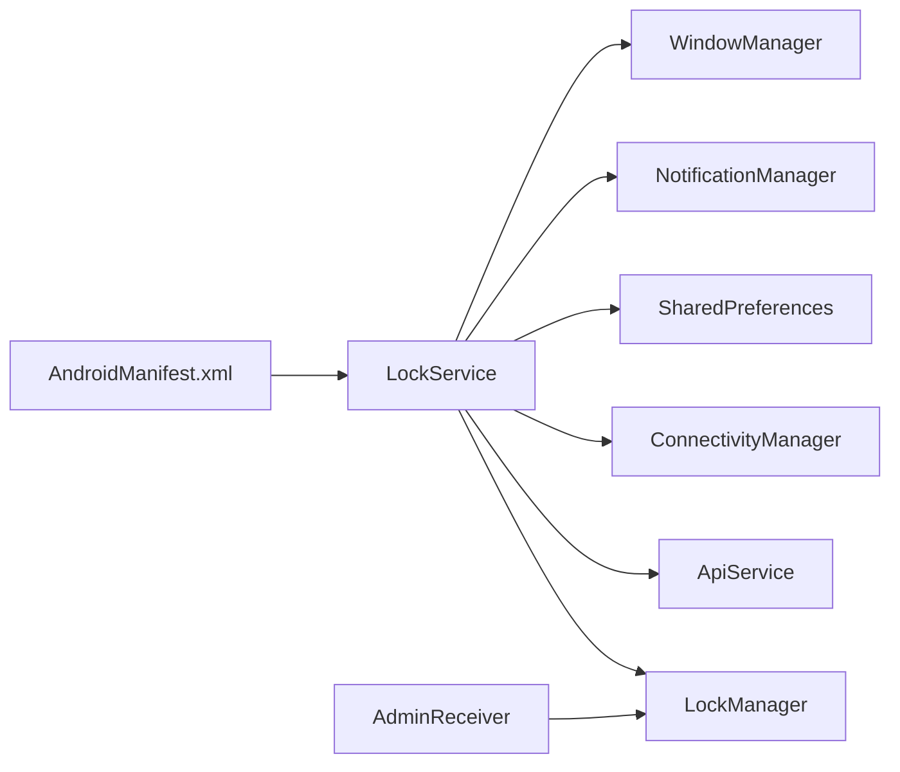

# Lock Service

<cite>
**Referenced Files in This Document**
- [LockService.kt](file://app/src/main/java/com/pksafe/lock/manager/service/LockService.kt)
- [LockManager.kt](file://app/src/main/java/com/pksafe/lock/manager/util/LockManager.kt)
- [layout_persistent_lock.xml](file://app/src/main/res/layout/layout_persistent_lock.xml)
- [AndroidManifest.xml](file://app/src/main/AndroidManifest.xml)
- [ApiService.kt](file://app/src/main/java/com/pksafe/lock/manager/data/ApiService.kt)
- [Constants.kt](file://app/src/main/java/com/pksafe/lock/manager/util/Constants.kt)
- [AdminReceiver.kt](file://app/src/main/java/com/pksafe/lock/manager/receiver/AdminReceiver.kt)
- [device_admin_policies.xml](file://app/src/main/res/xml/device_admin_policies.xml)
</cite>

## Table of Contents
1. [Introduction](#introduction)
2. [Project Structure](#project-structure)
3. [Core Components](#core-components)
4. [Architecture Overview](#architecture-overview)
5. [Detailed Component Analysis](#detailed-component-analysis)
6. [Dependency Analysis](#dependency-analysis)
7. [Performance Considerations](#performance-considerations)
8. [Troubleshooting Guide](#troubleshooting-guide)
9. [Conclusion](#conclusion)

## Introduction
This document explains the LockService foreground service implementation that provides persistent device lockdown by maintaining a system-level overlay screen and coordinating hardware restrictions via Device Policy Manager. It covers WindowManager integration for overlays, notification channel setup for Android O+, foreground service lifecycle, lock overlay UI with dynamic data from SharedPreferences and API calls, unlock code validation using IMEI-based master codes, and coordination with LockManager to apply or remove hardware restrictions. It also addresses key event blocking (back/home/app switch), connectivity monitoring for auto-lock behavior, Android version compatibility, required permissions, and battery optimization considerations.

## Project Structure
The lock functionality spans several modules:
- Foreground service and overlay rendering: LockService
- Hardware restriction enforcement: LockManager
- Overlay layout: layout_persistent_lock.xml
- System permissions and service declarations: AndroidManifest.xml
- Remote data fetching for EMI and shop info: ApiService and Constants
- Device admin receiver and policies: AdminReceiver and device_admin_policies.xml

**Diagram sources**
- [LockService.kt:41-123](file://app/src/main/java/com/pksafe/lock/manager/service/LockService.kt#L41-L123)
- [LockManager.kt:27-148](file://app/src/main/java/com/pksafe/lock/manager/util/LockManager.kt#L27-L148)
- [AndroidManifest.xml:73-77](file://app/src/main/AndroidManifest.xml#L73-L77)
- [ApiService.kt:101-109](file://app/src/main/java/com/pksafe/lock/manager/data/ApiService.kt#L101-L109)
- [AdminReceiver.kt:14-36](file://app/src/main/java/com/pksafe/lock/manager/receiver/AdminReceiver.kt#L14-L36)

**Section sources**
- [LockService.kt:41-123](file://app/src/main/java/com/pksafe/lock/manager/service/LockService.kt#L41-L123)
- [AndroidManifest.xml:73-77](file://app/src/main/AndroidManifest.xml#L73-L77)

## Core Components
- LockService: Starts as a foreground service, creates a full-screen overlay window, blocks navigation keys, shows lock UI, validates unlock codes, refreshes EMI/shop data from the server, and coordinates unlocking with LockManager.
- LockManager: Applies/removes hardware restrictions via DevicePolicyManager when locked/unlocked; supports device owner features like disabling USB transfer, factory reset, safe boot, ADB/debugging, status bar expansion, and keyguard behavior.
- Overlay Layout: Defines the lock screen UI elements including warning banner, shop details, EMI amount/due date, and hidden unlock entry area.
- AdminReceiver and Policies: Handles device admin enablement and provisioning completion; fetches IMEI and grants critical permissions when device owner is active.
- Manifest: Declares services, receivers, and necessary permissions such as SYSTEM_ALERT_WINDOW, FOREGROUND_SERVICE, POST_NOTIFICATIONS, and others.

**Section sources**
- [LockService.kt:41-330](file://app/src/main/java/com/pksafe/lock/manager/service/LockService.kt#L41-L330)
- [LockManager.kt:27-406](file://app/src/main/java/com/pksafe/lock/manager/util/LockManager.kt#L27-L406)
- [layout_persistent_lock.xml:1-234](file://app/src/main/res/layout/layout_persistent_lock.xml#L1-L234)
- [AdminReceiver.kt:14-104](file://app/src/main/java/com/pksafe/lock/manager/receiver/AdminReceiver.kt#L14-L104)
- [device_admin_policies.xml:1-13](file://app/src/main/res/xml/device_admin_policies.xml#L1-L13)
- [AndroidManifest.xml:1-160](file://app/src/main/AndroidManifest.xml#L1-L160)

## Architecture Overview
LockService runs as a sticky foreground service and renders an overlay window over all apps. It reads configuration from SharedPreferences, optionally fetches live EMI and shop information from the backend, and enforces or lifts hardware restrictions through LockManager. Connectivity changes can trigger auto-lock if enabled. The overlay captures focus and intercepts key events to prevent exiting the lock screen.

**Diagram sources**
- [LockService.kt:50-123](file://app/src/main/java/com/pksafe/lock/manager/service/LockService.kt#L50-L123)
- [LockService.kt:125-234](file://app/src/main/java/com/pksafe/lock/manager/service/LockService.kt#L125-L234)
- [LockService.kt:240-314](file://app/src/main/java/com/pksafe/lock/manager/service/LockService.kt#L240-L314)
- [LockManager.kt:111-148](file://app/src/main/java/com/pksafe/lock/manager/util/LockManager.kt#L111-L148)
- [ApiService.kt:101-109](file://app/src/main/java/com/pksafe/lock/manager/data/ApiService.kt#L101-L109)

## Detailed Component Analysis

### LockService: Foreground Lifecycle and Overlay Management
- Foreground service: Creates a high-importance notification channel and starts itself as a foreground service with special use type on newer Android versions.
- Overlay creation: Uses WindowManager.LayoutParams with TYPE_APPLICATION_OVERLAY on Android O+ and legacy TYPE_PHONE on older versions. Flags include fullscreen, keep screen on, show when locked, dismiss keyguard, turn screen on, and NOT_TOUCH_MODAL to allow keyboard input.
- Key event blocking: Captures back, home, app switch, and menu key events to prevent exiting the lock screen.
- Dynamic data population: Reads shop name, phone, EMI amount, and due date from SharedPreferences and updates overlay views accordingly.
- Live refresh: Fetches fresh EMI and shop data from the server using Retrofit and updates UI on the main thread.
- Unlock flow: Validates user input against a dynamic master code derived from the last six digits of IMEI stored in SharedPreferences; on success, clears the lock flag, unlocks hardware restrictions via LockManager, and stops the service.
- Connectivity monitoring: Registers a broadcast receiver for connectivity changes; if auto-lock is enabled and internet disconnects, it sets the lock state to true.

**Diagram sources**
- [LockService.kt:54-80](file://app/src/main/java/com/pksafe/lock/manager/service/LockService.kt#L54-L80)
- [LockService.kt:125-168](file://app/src/main/java/com/pksafe/lock/manager/service/LockService.kt#L125-L168)
- [LockService.kt:170-234](file://app/src/main/java/com/pksafe/lock/manager/service/LockService.kt#L170-L234)
- [LockService.kt:240-314](file://app/src/main/java/com/pksafe/lock/manager/service/LockService.kt#L240-L314)

**Section sources**
- [LockService.kt:54-80](file://app/src/main/java/com/pksafe/lock/manager/service/LockService.kt#L54-L80)
- [LockService.kt:125-168](file://app/src/main/java/com/pksafe/lock/manager/service/LockService.kt#L125-L168)
- [LockService.kt:170-234](file://app/src/main/java/com/pksafe/lock/manager/service/LockService.kt#L170-L234)
- [LockService.kt:240-314](file://app/src/main/java/com/pksafe/lock/manager/service/LockService.kt#L240-L314)

### LockManager: Hardware Restriction Coordination
- Locking: Starts LockService as a foreground service, applies hard restrictions via DevicePolicyManager, and locks the device after a short delay.
- Unlocking: Stops LockService, removes hard restrictions, and clears the lock flag in SharedPreferences.
- Hard restrictions: Disables camera, USB file transfer, factory reset, safe boot, debugging features, Wi-Fi config changes, outgoing calls, physical media mounting; disables status bar expansion and keyguard on supported versions.
- Permanent restrictions: Enforces critical restrictions even when unlocked to maintain security posture.
- App hiding: Hides or reveals specific apps using Device Owner APIs where available.
- Self-deactivation: Clears all restrictions, removes Device Owner and Admin privileges, and resets customer-related flags.

**Diagram sources**
- [LockManager.kt:27-406](file://app/src/main/java/com/pksafe/lock/manager/util/LockManager.kt#L27-L406)

**Section sources**
- [LockManager.kt:111-192](file://app/src/main/java/com/pksafe/lock/manager/util/LockManager.kt#L111-L192)
- [LockManager.kt:202-315](file://app/src/main/java/com/pksafe/lock/manager/util/LockManager.kt#L202-L315)
- [LockManager.kt:351-404](file://app/src/main/java/com/pksafe/lock/manager/util/LockManager.kt#L351-L404)

### Overlay UI and Dynamic Data Population
- Layout structure: Warning banner, device locked message, support info card with shop name and phone, EMI pending section showing amount and due date, and a hidden unlock entry container toggled by a subtle link.
- Dynamic fields: Shop name, phone, EMI amount, and due date are populated from SharedPreferences and refreshed from the server.
- Unlock entry: An EditText for numeric input and a submit button to validate the unlock code.

**Diagram sources**
- [layout_persistent_lock.xml:1-234](file://app/src/main/res/layout/layout_persistent_lock.xml#L1-L234)
- [LockService.kt:170-234](file://app/src/main/java/com/pksafe/lock/manager/service/LockService.kt#L170-L234)

**Section sources**
- [layout_persistent_lock.xml:1-234](file://app/src/main/res/layout/layout_persistent_lock.xml#L1-L234)
- [LockService.kt:170-234](file://app/src/main/java/com/pksafe/lock/manager/service/LockService.kt#L170-L234)

### Unlock Code Validation with IMEI-Based Master Codes
- Master code derivation: Uses the last six digits of the device IMEI stored in SharedPreferences; falls back to a default value if IMEI is missing or invalid.
- Validation logic: Compares user input to the derived master code; on success, clears the lock flag, calls LockManager.unlockDevice(), and stops the service.

**Diagram sources**
- [LockService.kt:200-218](file://app/src/main/java/com/pksafe/lock/manager/service/LockService.kt#L200-L218)
- [AdminReceiver.kt:43-101](file://app/src/main/java/com/pksafe/lock/manager/receiver/AdminReceiver.kt#L43-L101)

**Section sources**
- [LockService.kt:200-218](file://app/src/main/java/com/pksafe/lock/manager/service/LockService.kt#L200-L218)
- [AdminReceiver.kt:43-101](file://app/src/main/java/com/pksafe/lock/manager/receiver/AdminReceiver.kt#L43-L101)

### Connectivity Monitoring for Auto-Lock
- Broadcast receiver: Listens for connectivity changes; if auto-lock is enabled and the device loses internet access, it sets the lock flag to true to re-engage lockdown.
- Online check: Uses ConnectivityManager to determine current network capability for internet.

**Diagram sources**
- [LockService.kt:82-105](file://app/src/main/java/com/pksafe/lock/manager/service/LockService.kt#L82-L105)

**Section sources**
- [LockService.kt:82-105](file://app/src/main/java/com/pksafe/lock/manager/service/LockService.kt#L82-L105)

### API Integration for Live Data Refresh
- Endpoint usage: Calls getDeviceStatus with IMEI to retrieve device and EMI summary data.
- Data mapping: Extracts shop name, phone, EMI amount, and due date; formats dates and persists updated values to SharedPreferences; updates overlay views on the main thread.

**Diagram sources**
- [LockService.kt:240-314](file://app/src/main/java/com/pksafe/lock/manager/service/LockService.kt#L240-L314)
- [ApiService.kt:101-109](file://app/src/main/java/com/pksafe/lock/manager/data/ApiService.kt#L101-L109)
- [Constants.kt:3-10](file://app/src/main/java/com/pksafe/lock/manager/util/Constants.kt#L3-L10)

**Section sources**
- [LockService.kt:240-314](file://app/src/main/java/com/pksafe/lock/manager/service/LockService.kt#L240-L314)
- [ApiService.kt:101-109](file://app/src/main/java/com/pksafe/lock/manager/data/ApiService.kt#L101-L109)
- [Constants.kt:3-10](file://app/src/main/java/com/pksafe/lock/manager/util/Constants.kt#L3-L10)

### Android Version Compatibility and Permissions
- Overlay type: Uses TYPE_APPLICATION_OVERLAY on Android O+ and TYPE_PHONE on earlier versions.
- Foreground service type: Uses specialUse type on newer Android versions.
- Notifications: Creates a high-importance channel on Android O+.
- Permissions declared: SYSTEM_ALERT_WINDOW, FOREGROUND_SERVICE, FOREGROUND_SERVICE_SPECIAL_USE, POST_NOTIFICATIONS, WAKE_LOCK, USE_FULL_SCREEN_INTENT, RECEIVE_BOOT_COMPLETED, QUERY_ALL_PACKAGES, telephony/SMS permissions, and location permissions.
- Device admin: Declared with device_admin_policies.xml enabling force-lock and related capabilities.

**Section sources**
- [LockService.kt:68-72](file://app/src/main/java/com/pksafe/lock/manager/service/LockService.kt#L68-L72)
- [LockService.kt:128-132](file://app/src/main/java/com/pksafe/lock/manager/service/LockService.kt#L128-L132)
- [AndroidManifest.xml:5-23](file://app/src/main/AndroidManifest.xml#L5-L23)
- [AndroidManifest.xml:73-77](file://app/src/main/AndroidManifest.xml#L73-L77)
- [device_admin_policies.xml:1-13](file://app/src/main/res/xml/device_admin_policies.xml#L1-L13)

## Dependency Analysis
LockService depends on:
- WindowManager for overlay rendering
- NotificationManager for foreground notifications
- SharedPreferences for configuration and state
- ConnectivityManager for connectivity monitoring
- Retrofit and ApiService for remote data retrieval
- LockManager for hardware restriction enforcement
- AdminReceiver and device policies for device admin lifecycle

**Diagram sources**
- [LockService.kt:41-123](file://app/src/main/java/com/pksafe/lock/manager/service/LockService.kt#L41-L123)
- [LockManager.kt:27-148](file://app/src/main/java/com/pksafe/lock/manager/util/LockManager.kt#L27-L148)
- [AndroidManifest.xml:73-77](file://app/src/main/AndroidManifest.xml#L73-L77)

**Section sources**
- [LockService.kt:41-123](file://app/src/main/java/com/pksafe/lock/manager/service/LockService.kt#L41-L123)
- [LockManager.kt:27-148](file://app/src/main/java/com/pksafe/lock/manager/util/LockManager.kt#L27-L148)
- [AndroidManifest.xml:73-77](file://app/src/main/AndroidManifest.xml#L73-L77)

## Performance Considerations
- Overlay performance: Using MATCH_PARENT overlay with full-screen flags ensures consistent display but may impact battery; FLAG_KEEP_SCREEN_ON keeps the screen awake while locked.
- Network requests: Retrofit calls run on IO dispatcher; UI updates are posted to the main thread to avoid blocking.
- Connectivity checks: Lightweight capability checks minimize overhead.
- Restrictions application: DevicePolicyManager operations are efficient but should be invoked judiciously to avoid excessive system calls.

[No sources needed since this section provides general guidance]

## Troubleshooting Guide
- Overlay permission denied: Ensure SYSTEM_ALERT_WINDOW permission is granted and request overlay permission via settings if needed.
- Foreground service not starting: Verify FOREGROUND_SERVICE and FOREGROUND_SERVICE_SPECIAL_USE permissions and correct service declaration in manifest.
- Notification channel issues: Confirm channel creation on Android O+ and proper notification builder usage.
- Connectivity receiver not firing: Check that the receiver is registered and unregistered properly; ensure appropriate permissions for network state queries.
- Unlock code mismatch: Verify IMEI stored in SharedPreferences and ensure the last six digits match the expected master code.
- Hardware restrictions not applied: Confirm device admin activation and device owner status; check DevicePolicyManager methods and log outputs for errors.

**Section sources**
- [LockService.kt:125-168](file://app/src/main/java/com/pksafe/lock/manager/service/LockService.kt#L125-L168)
- [LockService.kt:107-123](file://app/src/main/java/com/pksafe/lock/manager/service/LockService.kt#L107-L123)
- [LockService.kt:82-105](file://app/src/main/java/com/pksafe/lock/manager/service/LockService.kt#L82-L105)
- [LockManager.kt:111-192](file://app/src/main/java/com/pksafe/lock/manager/util/LockManager.kt#L111-L192)
- [AndroidManifest.xml:5-23](file://app/src/main/AndroidManifest.xml#L5-L23)

## Conclusion
LockService provides robust, persistent device lockdown through a foreground service and system-level overlay, integrating seamlessly with DevicePolicyManager via LockManager to enforce hardware restrictions. It dynamically populates the lock UI with local and remote data, validates unlock codes using IMEI-derived master codes, and monitors connectivity to support auto-lock behaviors. Proper handling of Android version differences, permissions, and battery considerations ensures reliable operation across devices.

[No sources needed since this section summarizes without analyzing specific files]