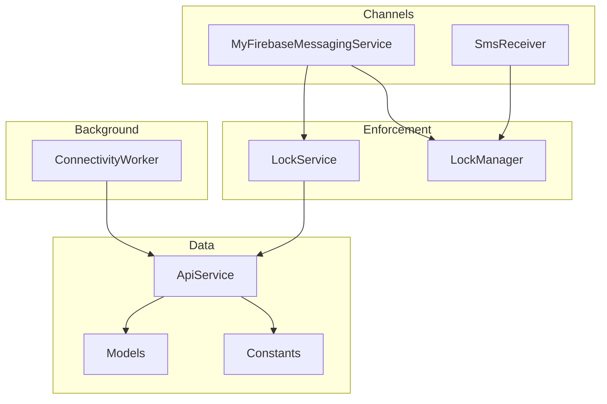
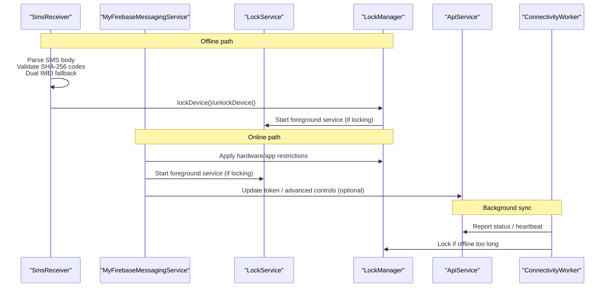
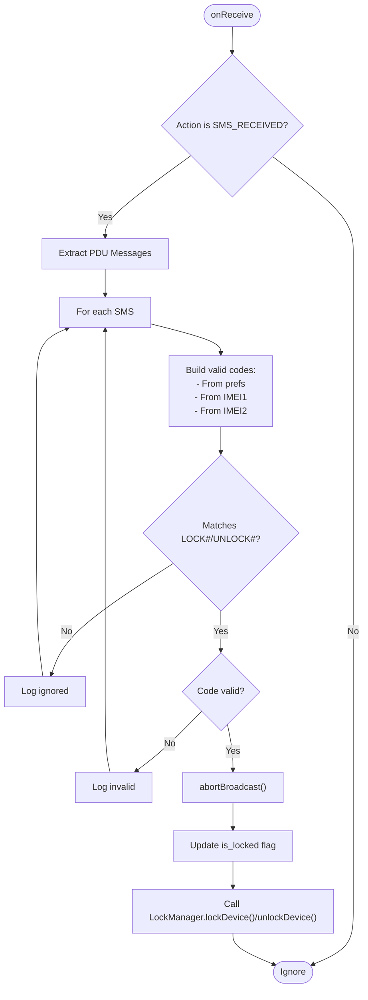
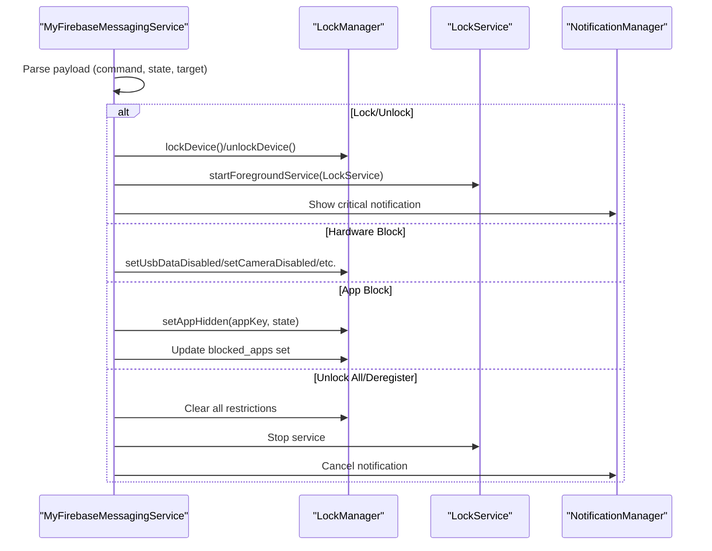
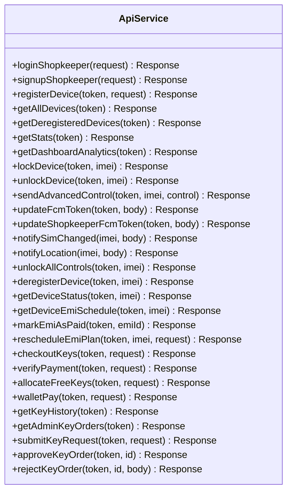
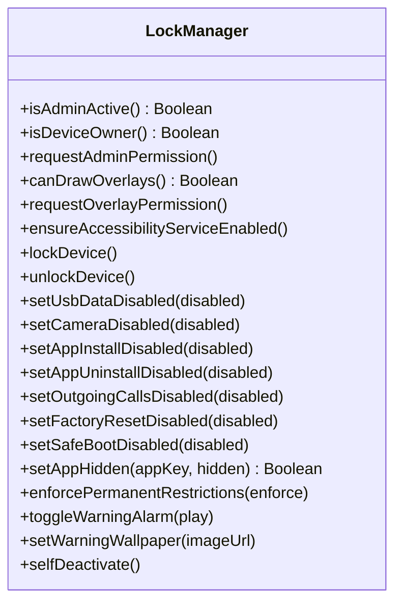
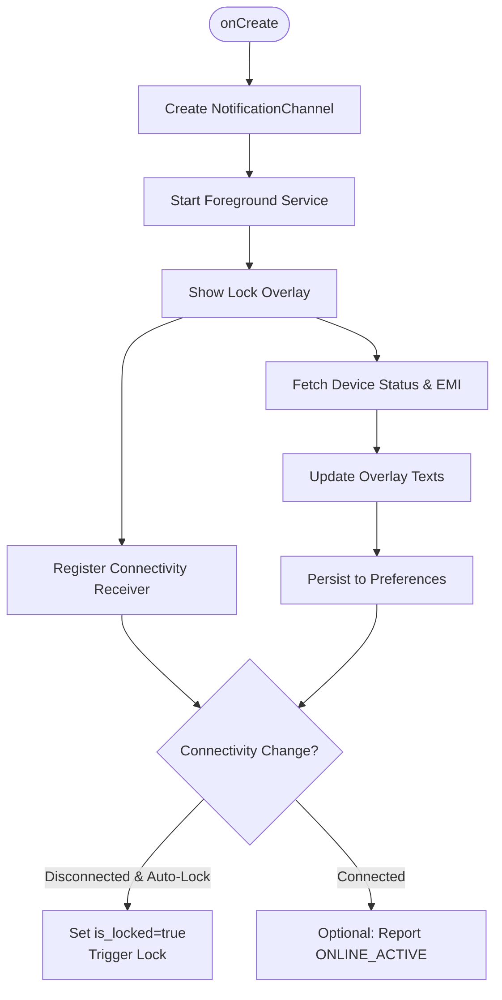
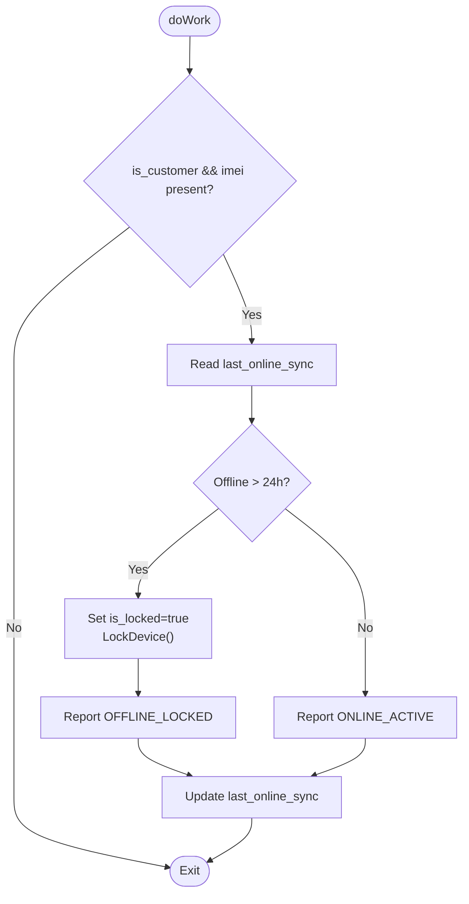
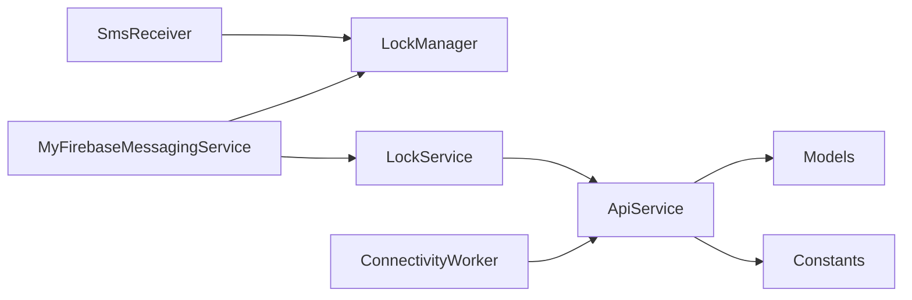

# Communication Layer

<cite>
**Referenced Files in This Document**
- [SmsReceiver.kt](file://app/src/main/java/com/pksafe/lock/manager/receiver/SmsReceiver.kt)
- [MyFirebaseMessagingService.kt](file://app/src/main/java/com/pksafe/lock/manager/service/MyFirebaseMessagingService.kt)
- [ApiService.kt](file://app/src/main/java/com/pksafe/lock/manager/data/ApiService.kt)
- [Models.kt](file://app/src/main/java/com/pksafe/lock/manager/data/Models.kt)
- [LockManager.kt](file://app/src/main/java/com/pksafe/lock/manager/util/LockManager.kt)
- [LockService.kt](file://app/src/main/java/com/pksafe/lock/manager/service/LockService.kt)
- [ConnectivityWorker.kt](file://app/src/main/java/com/pksafe/lock/manager/service/ConnectivityWorker.kt)
- [Constants.kt](file://app/src/main/java/com/pksafe/lock/manager/util/Constants.kt)
</cite>

## Table of Contents
1. Introduction
2. Project Structure
3. Core Components
4. Architecture Overview
5. Detailed Component Analysis
6. Dependency Analysis
7. Performance Considerations
8. Troubleshooting Guide
9. Conclusion

## Introduction
This document explains PK Locker’s communication layer with a focus on multi-channel command processing and data synchronization across:
- Offline SMS-based commands with SHA-256 code validation and dual IMEI fallback
- Real-time push notifications via Firebase Cloud Messaging (FCM) for remote device control
- REST API client usage for backend communication, including authentication headers and error handling patterns
- Network connectivity handling, offline capability maintenance, and security considerations for command authentication

The goal is to provide both high-level architecture understanding and detailed component behavior so developers can maintain, extend, and troubleshoot the system confidently.

## Project Structure
PK Locker organizes communication-related logic into clear layers:
- Receivers handle offline input channels (SMS)
- Services manage real-time push and persistent enforcement (FCM, LockService)
- Data layer defines REST endpoints and models (ApiService, Models)
- Utilities enforce device policies and state transitions (LockManager)
- Background workers maintain connectivity and offline safety (ConnectivityWorker)
- Configuration centralizes server endpoints (Constants)

**Diagram sources**
- [SmsReceiver.kt:44-143](file://app/src/main/java/com/pksafe/lock/manager/receiver/SmsReceiver.kt#L44-L143)
- [MyFirebaseMessagingService.kt:22-224](file://app/src/main/java/com/pksafe/lock/manager/service/MyFirebaseMessagingService.kt#L22-L224)
- [LockService.kt:50-314](file://app/src/main/java/com/pksafe/lock/manager/service/LockService.kt#L50-L314)
- [LockManager.kt:111-148](file://app/src/main/java/com/pksafe/lock/manager/util/LockManager.kt#L111-L148)
- [ApiService.kt:11-185](file://app/src/main/java/com/pksafe/lock/manager/data/ApiService.kt#L11-L185)
- [Models.kt:149-219](file://app/src/main/java/com/pksafe/lock/manager/data/Models.kt#L149-L219)
- [ConnectivityWorker.kt:17-70](file://app/src/main/java/com/pksafe/lock/manager/service/ConnectivityWorker.kt#L17-L70)
- [Constants.kt:3-10](file://app/src/main/java/com/pksafe/lock/manager/util/Constants.kt#L3-L10)

**Section sources**
- [SmsReceiver.kt:16-42](file://app/src/main/java/com/pksafe/lock/manager/receiver/SmsReceiver.kt#L16-L42)
- [MyFirebaseMessagingService.kt:1-30](file://app/src/main/java/com/pksafe/lock/manager/service/MyFirebaseMessagingService.kt#L1-L30)
- [ApiService.kt:1-20](file://app/src/main/java/com/pksafe/lock/manager/data/ApiService.kt#L1-L20)
- [LockService.kt:1-40](file://app/src/main/java/com/pksafe/lock/manager/service/LockService.kt#L1-L40)
- [ConnectivityWorker.kt:1-14](file://app/src/main/java/com/pksafe/lock/manager/service/ConnectivityWorker.kt#L1-L14)
- [Constants.kt:1-10](file://app/src/main/java/com/pksafe/lock/manager/util/Constants.kt#L1-L10)

## Core Components
- SmsReceiver: Parses incoming SMS messages, validates codes using SHA-256 against stored or derived IMEIs, and triggers local lock/unlock without internet.
- MyFirebaseMessagingService: Processes FCM payloads to execute remote commands such as lock/unlock, hardware blocks, app blocking, configuration changes, deregistration, and data requests.
- ApiService: Retrofit interface defining REST endpoints for authentication, device management, EMI operations, key orders, and admin controls.
- LockManager: Applies Device Policy Manager restrictions and orchestrates overlay service start/stop for enforced locking and unlocking.
- LockService: Foreground service that renders an overlay UI, enforces auto-lock on connectivity loss, and refreshes live EMI/device info from the backend.
- ConnectivityWorker: Periodic worker that locks devices after extended offline periods and reports status back to the server when possible.
- Models: Data classes representing request/response structures for all API endpoints.
- Constants: Centralized base URL and update endpoints.

**Section sources**
- [SmsReceiver.kt:44-143](file://app/src/main/java/com/pksafe/lock/manager/receiver/SmsReceiver.kt#L44-L143)
- [MyFirebaseMessagingService.kt:22-224](file://app/src/main/java/com/pksafe/lock/manager/service/MyFirebaseMessagingService.kt#L22-L224)
- [ApiService.kt:11-185](file://app/src/main/java/com/pksafe/lock/manager/data/ApiService.kt#L11-L185)
- [LockManager.kt:111-148](file://app/src/main/java/com/pksafe/lock/manager/util/LockManager.kt#L111-L148)
- [LockService.kt:50-314](file://app/src/main/java/com/pksafe/lock/manager/service/LockService.kt#L50-L314)
- [ConnectivityWorker.kt:17-70](file://app/src/main/java/com/pksafe/lock/manager/service/ConnectivityWorker.kt#L17-L70)
- [Models.kt:149-219](file://app/src/main/java/com/pksafe/lock/manager/data/Models.kt#L149-L219)
- [Constants.kt:3-10](file://app/src/main/java/com/pksafe/lock/manager/util/Constants.kt#L3-L10)

## Architecture Overview
PK Locker supports two primary command channels:
- Offline SMS channel: Validates deterministic codes derived from device IMEIs; no network required.
- Online FCM channel: Push-based commands executed immediately by the messaging service.

Both channels converge on LockManager to apply device policy restrictions and on LockService to render the enforcement UI and maintain state. A background worker ensures offline safety by locking devices if they remain disconnected beyond a threshold.

**Diagram sources**
- [SmsReceiver.kt:44-143](file://app/src/main/java/com/pksafe/lock/manager/receiver/SmsReceiver.kt#L44-L143)
- [MyFirebaseMessagingService.kt:22-224](file://app/src/main/java/com/pksafe/lock/manager/service/MyFirebaseMessagingService.kt#L22-L224)
- [LockService.kt:50-314](file://app/src/main/java/com/pksafe/lock/manager/service/LockService.kt#L50-L314)
- [LockManager.kt:111-148](file://app/src/main/java/com/pksafe/lock/manager/util/LockManager.kt#L111-L148)
- [ConnectivityWorker.kt:17-70](file://app/src/main/java/com/pksafe/lock/manager/service/ConnectivityWorker.kt#L17-L70)
- [ApiService.kt:11-185](file://app/src/main/java/com/pksafe/lock/manager/data/ApiService.kt#L11-L185)

## Detailed Component Analysis

### SmsReceiver: Offline SMS Command Processing
- Purpose: Handle offline lock/unlock via SMS without requiring internet.
- Code Validation:
  - Supports codes provided by backend (stored in preferences) and generates fallback codes using SHA-256 of "LOCK_{imei}" and "UNLOCK_{imei}".
  - Accepts both IMEIs for fallback generation to support dual-SIM scenarios.
- Command Parsing:
  - Recognizes LOCK#<code> and UNLOCK#<code> formats.
  - Triggers abortBroadcast to hide message from default SMS app upon valid command execution.
- State Synchronization:
  - Updates local preference flags for lock state.
  - Calls LockManager to enforce device policy restrictions and start the overlay service.

**Diagram sources**
- [SmsReceiver.kt:44-143](file://app/src/main/java/com/pksafe/lock/manager/receiver/SmsReceiver.kt#L44-L143)
- [SmsReceiver.kt:145-162](file://app/src/main/java/com/pksafe/lock/manager/receiver/SmsReceiver.kt#L145-L162)

**Section sources**
- [SmsReceiver.kt:16-42](file://app/src/main/java/com/pksafe/lock/manager/receiver/SmsReceiver.kt#L16-L42)
- [SmsReceiver.kt:44-143](file://app/src/main/java/com/pksafe/lock/manager/receiver/SmsReceiver.kt#L44-L143)
- [SmsReceiver.kt:145-162](file://app/src/main/java/com/pksafe/lock/manager/receiver/SmsReceiver.kt#L145-L162)

### MyFirebaseMessagingService: Real-Time Push Notifications and Remote Control
- Purpose: Process FCM payloads to execute remote commands and enforce device restrictions in real time.
- Command Handling:
  - Lock/Unlock: Sets local state, starts LockService, triggers full-screen lock, and applies device policy restrictions.
  - Hardware Blocks: Controls USB, camera, settings, alarms, install/uninstall, calls, factory reset, safe boot.
  - App Blocking: Uses Device Owner APIs to hide apps; falls back to SharedPrefs + Accessibility blocking if not Device Owner.
  - Config Changes: Updates warning wallpaper via URL.
  - Unlock All: Clears all restrictions, stops services, cancels notifications, and removes Device Admin privileges.
  - Deregister: Fully releases device ownership and clears all restrictions.
  - Request Data: Placeholder for location and phone info retrieval.
- Admin Protection: Ignores lock signals on administrative devices to prevent accidental locking.

**Diagram sources**
- [MyFirebaseMessagingService.kt:22-224](file://app/src/main/java/com/pksafe/lock/manager/service/MyFirebaseMessagingService.kt#L22-L224)
- [LockManager.kt:111-148](file://app/src/main/java/com/pksafe/lock/manager/util/LockManager.kt#L111-L148)
- [LockService.kt:50-123](file://app/src/main/java/com/pksafe/lock/manager/service/LockService.kt#L50-L123)

**Section sources**
- [MyFirebaseMessagingService.kt:22-224](file://app/src/main/java/com/pksafe/lock/manager/service/MyFirebaseMessagingService.kt#L22-L224)

### ApiService: REST Client for Backend Communication
- Purpose: Define typed endpoints for authentication, device management, EMI scheduling, key orders, and admin controls.
- Authentication:
  - Most endpoints accept Authorization header with Bearer token.
  - Token is typically retrieved from shared preferences and passed explicitly per call.
- Error Handling:
  - Responses are wrapped in Retrofit Response objects; callers should check success and handle errors accordingly.
- Retry Mechanisms:
  - No built-in retry in this interface; implement retries at the caller level (e.g., in ViewModels or services) using exponential backoff and circuit breakers where appropriate.

**Diagram sources**
- [ApiService.kt:11-185](file://app/src/main/java/com/pksafe/lock/manager/data/ApiService.kt#L11-L185)

**Section sources**
- [ApiService.kt:11-185](file://app/src/main/java/com/pksafe/lock/manager/data/ApiService.kt#L11-L185)

### LockManager: Enforcement and State Transitions
- Purpose: Apply device policy restrictions and orchestrate lock/unlock flows.
- Key Behaviors:
  - Starts LockService overlay when locking.
  - Applies hard restrictions via DevicePolicyManager and UserRestrictions.
  - Provides granular controls for USB, camera, install/uninstall, calls, factory reset, safe boot.
  - Hides apps using Device Owner APIs with fallback to accessibility-based blocking.
  - Self-deactivation removes Device Owner/Admin privileges to allow uninstallation.

**Diagram sources**
- [LockManager.kt:27-406](file://app/src/main/java/com/pksafe/lock/manager/util/LockManager.kt#L27-L406)

**Section sources**
- [LockManager.kt:111-148](file://app/src/main/java/com/pksafe/lock/manager/util/LockManager.kt#L111-L148)
- [LockManager.kt:151-200](file://app/src/main/java/com/pksafe/lock/manager/util/LockManager.kt#L151-L200)
- [LockManager.kt:202-315](file://app/src/main/java/com/pksafe/lock/manager/util/LockManager.kt#L202-L315)
- [LockManager.kt:317-406](file://app/src/main/java/com/pksafe/lock/manager/util/LockManager.kt#L317-L406)

### LockService: Overlay, Connectivity Monitoring, and Live Refresh
- Purpose: Maintain a persistent overlay while locked, monitor connectivity, and refresh live EMI/device data from the backend.
- Connectivity Handling:
  - Registers a receiver for connectivity changes; triggers auto-lock when internet disconnects and auto-lock is enabled.
  - Checks active network capabilities to determine online status.
- Live Refresh:
  - Fetches device status and EMI schedule from the backend and updates overlay UI with shop name, support phone, EMI amount, and due date.
  - Persists fetched values to preferences for cold-start resilience.

**Diagram sources**
- [LockService.kt:50-123](file://app/src/main/java/com/pksafe/lock/manager/service/LockService.kt#L50-L123)
- [LockService.kt:82-105](file://app/src/main/java/com/pksafe/lock/manager/service/LockService.kt#L82-L105)
- [LockService.kt:227-314](file://app/src/main/java/com/pksafe/lock/manager/service/LockService.kt#L227-L314)

**Section sources**
- [LockService.kt:50-123](file://app/src/main/java/com/pksafe/lock/manager/service/LockService.kt#L50-L123)
- [LockService.kt:82-105](file://app/src/main/java/com/pksafe/lock/manager/service/LockService.kt#L82-L105)
- [LockService.kt:227-314](file://app/src/main/java/com/pksafe/lock/manager/service/LockService.kt#L227-L314)

### ConnectivityWorker: Offline Capability Maintenance
- Purpose: Ensure devices lock automatically after prolonged offline periods and report status to the server when possible.
- Behavior:
  - Checks last online sync timestamp; if exceeded threshold, locks device locally and attempts to notify server.
  - If within threshold, sends heartbeat indicating device is active.
- Server Reporting:
  - Uses ApiService to send advanced control requests with Bearer token.
  - Updates last_online_sync on successful reporting.

**Diagram sources**
- [ConnectivityWorker.kt:17-70](file://app/src/main/java/com/pksafe/lock/manager/service/ConnectivityWorker.kt#L17-L70)

**Section sources**
- [ConnectivityWorker.kt:17-70](file://app/src/main/java/com/pksafe/lock/manager/service/ConnectivityWorker.kt#L17-L70)

## Dependency Analysis
- SmsReceiver depends on LockManager for enforcement and uses SharedPreferences for IMEI and code storage.
- MyFirebaseMessagingService depends on LockManager and LockService to apply restrictions and show overlays; also interacts with NotificationManager for critical alerts.
- ApiService is used by LockService and ConnectivityWorker to fetch/update device state and EMI data.
- Models define request/response contracts consumed by ApiService callers.
- Constants provides BASE_URL for Retrofit configuration.

**Diagram sources**
- [SmsReceiver.kt:44-143](file://app/src/main/java/com/pksafe/lock/manager/receiver/SmsReceiver.kt#L44-L143)
- [MyFirebaseMessagingService.kt:22-224](file://app/src/main/java/com/pksafe/lock/manager/service/MyFirebaseMessagingService.kt#L22-L224)
- [LockService.kt:227-314](file://app/src/main/java/com/pksafe/lock/manager/service/LockService.kt#L227-L314)
- [ConnectivityWorker.kt:49-70](file://app/src/main/java/com/pksafe/lock/manager/service/ConnectivityWorker.kt#L49-L70)
- [ApiService.kt:11-185](file://app/src/main/java/com/pksafe/lock/manager/data/ApiService.kt#L11-L185)
- [Models.kt:149-219](file://app/src/main/java/com/pksafe/lock/manager/data/Models.kt#L149-L219)
- [Constants.kt:3-10](file://app/src/main/java/com/pksafe/lock/manager/util/Constants.kt#L3-L10)

**Section sources**
- [SmsReceiver.kt:44-143](file://app/src/main/java/com/pksafe/lock/manager/receiver/SmsReceiver.kt#L44-L143)
- [MyFirebaseMessagingService.kt:22-224](file://app/src/main/java/com/pksafe/lock/manager/service/MyFirebaseMessagingService.kt#L22-L224)
- [LockService.kt:227-314](file://app/src/main/java/com/pksafe/lock/manager/service/LockService.kt#L227-L314)
- [ConnectivityWorker.kt:49-70](file://app/src/main/java/com/pksafe/lock/manager/service/ConnectivityWorker.kt#L49-L70)
- [ApiService.kt:11-185](file://app/src/main/java/com/pksafe/lock/manager/data/ApiService.kt#L11-L185)
- [Models.kt:149-219](file://app/src/main/java/com/pksafe/lock/manager/data/Models.kt#L149-L219)
- [Constants.kt:3-10](file://app/src/main/java/com/pksafe/lock/manager/util/Constants.kt#L3-L10)

## Performance Considerations
- Minimize network calls: Cache device and EMI data in SharedPreferences; only refresh when necessary (e.g., overlay startup).
- Avoid heavy work on main thread: Use background threads/coroutines for network and image operations (as seen in wallpaper updates).
- Efficient FCM handling: Keep payload parsing lightweight; defer heavy operations to background tasks.
- Reduce overlay overhead: Reuse views and avoid frequent layout inflation; update UI selectively.
- Worker scheduling: Tune ConnectivityWorker intervals to balance battery life and responsiveness.

[No sources needed since this section provides general guidance]

## Troubleshooting Guide
- SMS Commands Not Working:
  - Verify customer mode flag and IMEI presence in preferences.
  - Confirm SHA-256 code generation matches backend expectations and includes both IMEIs for fallback.
  - Check logs for invalid code rejections and ensure abortBroadcast is called on valid commands.
- FCM Commands Ignored:
  - Ensure device is not marked as administrative; admin devices ignore lock signals.
  - Validate payload fields (command, state, target) and confirm handler branches cover expected values.
  - Check that LockService starts successfully and notifications are displayed.
- API Errors:
  - Confirm Authorization header contains a valid Bearer token.
  - Inspect response codes and handle non-successful responses gracefully.
  - Implement retry logic with exponential backoff for transient failures.
- Connectivity Issues:
  - Verify connectivity receiver registration and permissions.
  - Ensure auto-lock behavior aligns with user preferences and network state.
  - Confirm ConnectivityWorker runs periodically and updates last_online_sync on success.

**Section sources**
- [SmsReceiver.kt:44-143](file://app/src/main/java/com/pksafe/lock/manager/receiver/SmsReceiver.kt#L44-L143)
- [MyFirebaseMessagingService.kt:22-224](file://app/src/main/java/com/pksafe/lock/manager/service/MyFirebaseMessagingService.kt#L22-L224)
- [LockService.kt:82-105](file://app/src/main/java/com/pksafe/lock/manager/service/LockService.kt#L82-L105)
- [ConnectivityWorker.kt:17-70](file://app/src/main/java/com/pksafe/lock/manager/service/ConnectivityWorker.kt#L17-L70)
- [ApiService.kt:11-185](file://app/src/main/java/com/pksafe/lock/manager/data/ApiService.kt#L11-L185)

## Conclusion
PK Locker’s communication layer integrates offline SMS and online FCM channels to ensure robust device control under varying network conditions. The design emphasizes:
- Deterministic offline command validation using SHA-256 and dual IMEI fallback
- Immediate remote control via FCM with comprehensive command types
- Reliable backend synchronization through a well-defined REST API
- Persistent enforcement via LockService and LockManager
- Safety mechanisms to lock devices after extended offline periods

By following the patterns outlined here—clear separation of concerns, explicit authentication, careful error handling, and resilient offline behavior—the system maintains secure and dependable device management across diverse environments.

[No sources needed since this section summarizes without analyzing specific files]