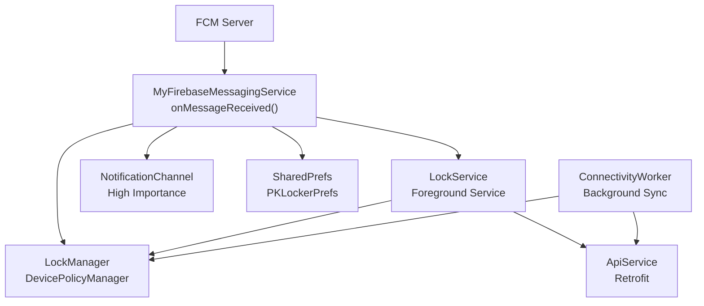
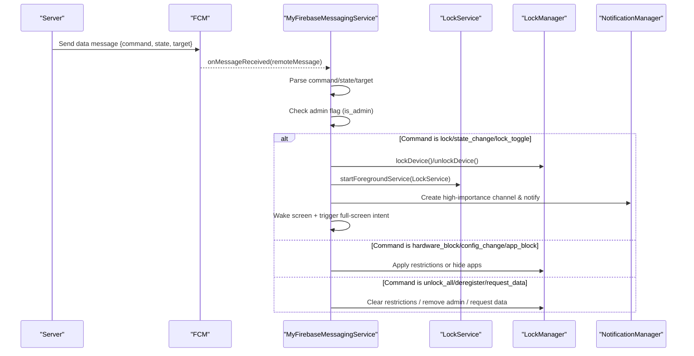
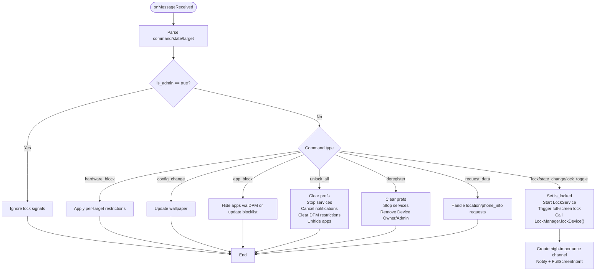
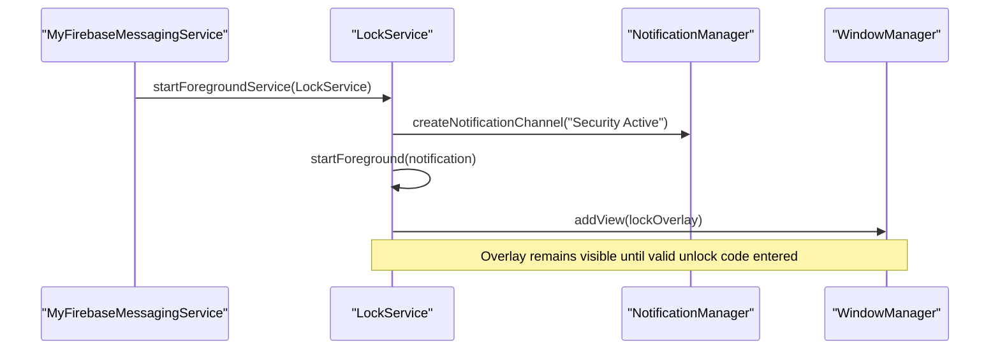
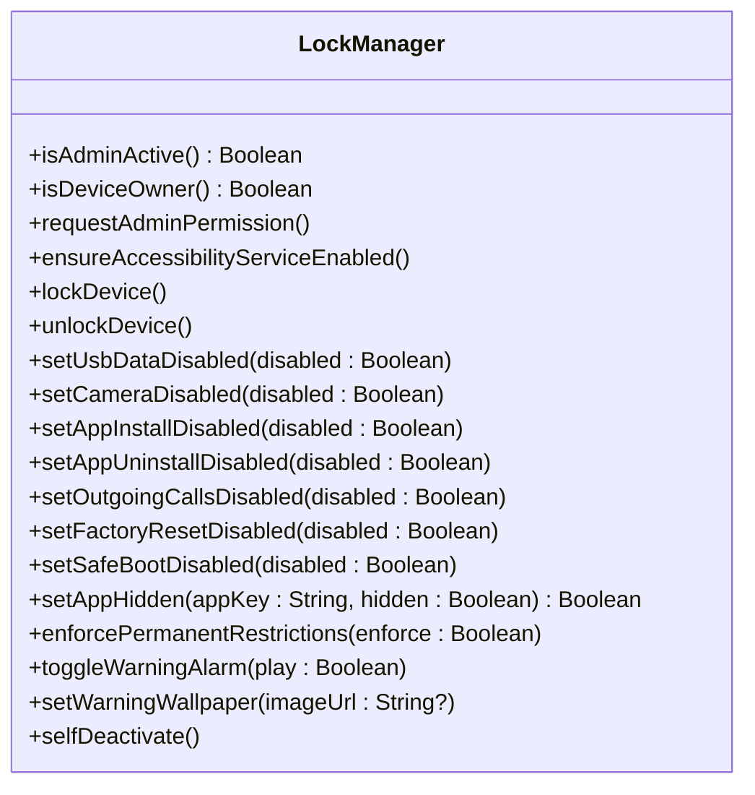
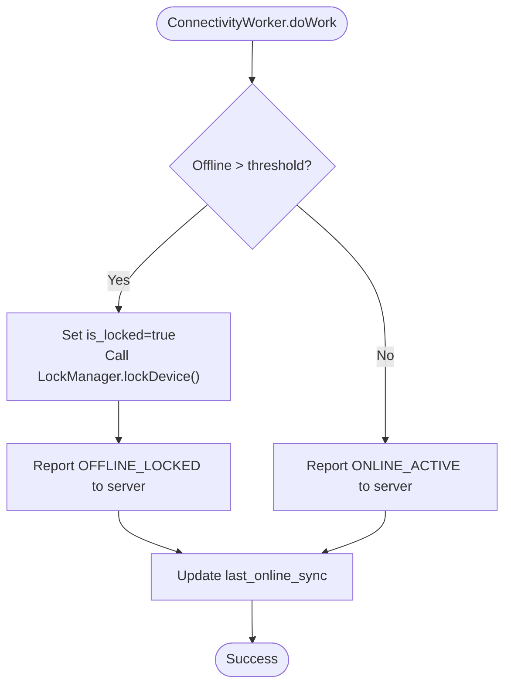
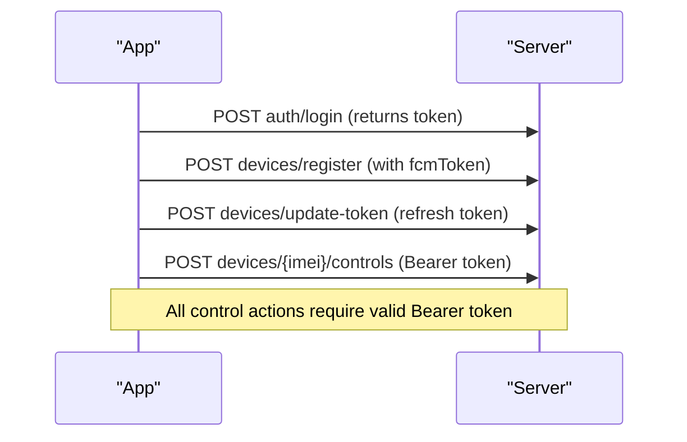
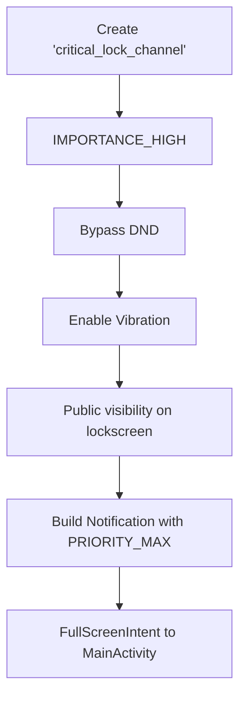
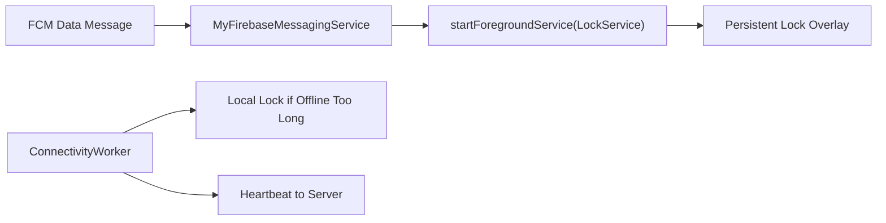
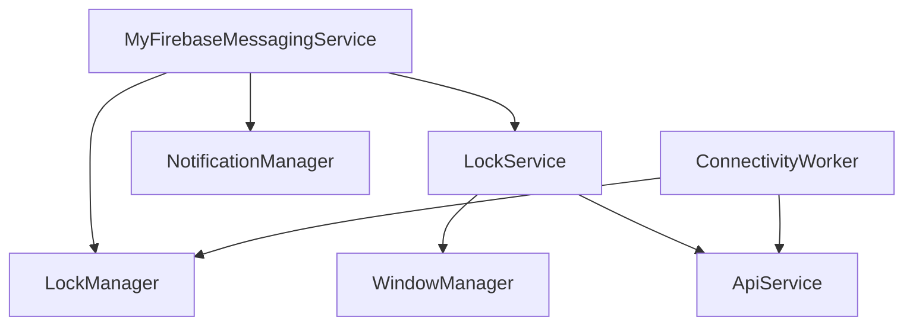

# Firebase Cloud Messaging

<cite>
**Referenced Files in This Document**
- [MyFirebaseMessagingService.kt](file://app/src/main/java/com/pksafe/lock/manager/service/MyFirebaseMessagingService.kt)
- [LockService.kt](file://app/src/main/java/com/pksafe/lock/manager/service/LockService.kt)
- [LockManager.kt](file://app/src/main/java/com/pksafe/lock/manager/util/LockManager.kt)
- [ConnectivityWorker.kt](file://app/src/main/java/com/pksafe/lock/manager/service/ConnectivityWorker.kt)
- [ApiService.kt](file://app/src/main/java/com/pksafe/lock/manager/data/ApiService.kt)
- [Models.kt](file://app/src/main/java/com/pksafe/lock/manager/data/Models.kt)
- [google-services.json](file://app/google-services.json)
</cite>

## Table of Contents
1. [Introduction](#introduction)
2. [Project Structure](#project-structure)
3. [Core Components](#core-components)
4. [Architecture Overview](#architecture-overview)
5. [Detailed Component Analysis](#detailed-component-analysis)
6. [Dependency Analysis](#dependency-analysis)
7. [Performance Considerations](#performance-considerations)
8. [Troubleshooting Guide](#troubleshooting-guide)
9. [Conclusion](#conclusion)
10. [Appendices](#appendices)

## Introduction
This document explains how PK Locker integrates Firebase Cloud Messaging (FCM) to receive real-time push notifications and remote device control commands. It focuses on the MyFirebaseMessagingService implementation, message payload structures, notification handling, background processing, authentication flow for secure messaging, device registration, command examples, notification channel configuration, priority handling, offline queuing strategies, debugging/testing guidance, and battery optimization recommendations.

## Project Structure
PK Locker’s FCM integration spans several modules:
- Message reception and command dispatch: MyFirebaseMessagingService
- Lock overlay and foreground service: LockService
- Device policy enforcement and controls: LockManager
- Background connectivity and offline guard: ConnectivityWorker
- API contracts for token updates and advanced controls: ApiService and Models
- FCM project configuration: google-services.json

**Diagram sources**
- [MyFirebaseMessagingService.kt:22-223](file://app/src/main/java/com/pksafe/lock/manager/service/MyFirebaseMessagingService.kt#L22-L223)
- [LockService.kt:50-123](file://app/src/main/java/com/pksafe/lock/manager/service/LockService.kt#L50-L123)
- [LockManager.kt:111-192](file://app/src/main/java/com/pksafe/lock/manager/util/LockManager.kt#L111-L192)
- [ConnectivityWorker.kt:17-71](file://app/src/main/java/com/pksafe/lock/manager/service/ConnectivityWorker.kt#L17-L71)
- [ApiService.kt:58-69](file://app/src/main/java/com/pksafe/lock/manager/data/ApiService.kt#L58-L69)

**Section sources**
- [MyFirebaseMessagingService.kt:22-223](file://app/src/main/java/com/pksafe/lock/manager/service/MyFirebaseMessagingService.kt#L22-L223)
- [LockService.kt:50-123](file://app/src/main/java/com/pksafe/lock/manager/service/LockService.kt#L50-L123)
- [LockManager.kt:111-192](file://app/src/main/java/com/pksafe/lock/manager/util/LockManager.kt#L111-L192)
- [ConnectivityWorker.kt:17-71](file://app/src/main/java/com/pksafe/lock/manager/service/ConnectivityWorker.kt#L17-L71)
- [ApiService.kt:58-69](file://app/src/main/java/com/pksafe/lock/manager/data/ApiService.kt#L58-L69)
- [google-services.json:1-67](file://app/google-services.json#L1-L67)

## Core Components
- MyFirebaseMessagingService: Receives FCM data messages, parses command payloads, enforces admin protection, triggers lock/unlock flows, manages high-priority notifications, and starts the LockService directly when needed.
- LockService: Foreground service that renders a persistent lock overlay, handles unlock code entry, refreshes EMI/device info from the server, and maintains a high-importance notification channel.
- LockManager: Centralizes device policy restrictions (camera, USB, install/uninstall, calls, factory reset, safe boot), app hiding via Device Owner, alarm toggling, wallpaper updates, and self-deactivation.
- ConnectivityWorker: Periodic background worker that locks devices if offline beyond a threshold and reports heartbeat/status to the server; updates last sync timestamp.
- ApiService and Models: Retrofit interfaces and data models for device registration, token updates, advanced controls, and status reporting.
- google-services.json: Contains FCM project identifiers and API keys for multiple package names used by the app variants.

**Section sources**
- [MyFirebaseMessagingService.kt:22-223](file://app/src/main/java/com/pksafe/lock/manager/service/MyFirebaseMessagingService.kt#L22-L223)
- [LockService.kt:50-123](file://app/src/main/java/com/pksafe/lock/manager/service/LockService.kt#L50-L123)
- [LockManager.kt:111-192](file://app/src/main/java/com/pksafe/lock/manager/util/LockManager.kt#L111-L192)
- [ConnectivityWorker.kt:17-71](file://app/src/main/java/com/pksafe/lock/manager/service/ConnectivityWorker.kt#L17-L71)
- [ApiService.kt:58-69](file://app/src/main/java/com/pksafe/lock/manager/data/ApiService.kt#L58-L69)
- [Models.kt:177-219](file://app/src/main/java/com/pksafe/lock/manager/data/Models.kt#L177-L219)
- [google-services.json:1-67](file://app/google-services.json#L1-L67)

## Architecture Overview
The FCM architecture centers on receiving data-only messages and executing local actions without relying on UI. Commands are dispatched based on a “command” field with optional “state” and “target”. Admin devices are protected from remote locking. High-priority notifications and full-screen intents ensure immediate user attention during critical events like locking.

**Diagram sources**
- [MyFirebaseMessagingService.kt:22-223](file://app/src/main/java/com/pksafe/lock/manager/service/MyFirebaseMessagingService.kt#L22-L223)
- [LockService.kt:50-123](file://app/src/main/java/com/pksafe/lock/manager/service/LockService.kt#L50-L123)
- [LockManager.kt:111-192](file://app/src/main/java/com/pksafe/lock/manager/util/LockManager.kt#L111-L192)

## Detailed Component Analysis

### MyFirebaseMessagingService: Real-time Push and Remote Control
- Message parsing: Reads “command”, “state”, and “target” fields from the data payload. Supports backward compatibility where only “state” is present by mapping to “lock_toggle”.
- Admin protection: If the device is marked as administrative (“is_admin” true), all lock-related commands are ignored to prevent accidental locking of management devices.
- Command handling:
  - Locking: Updates “is_locked” preference, starts LockService directly, triggers full-screen lock, and invokes LockManager.lockDevice() after a short delay to ensure overlays load.
  - Unlocking: Stops LockService, clears restrictions via LockManager.unlockDevice(), cancels lock notifications.
  - Hardware blocks: Applies per-target restrictions (USB, camera, settings, auto-lock, SIM change auto-lock, alarm, install/uninstall, calls, factory reset, safe boot).
  - Config changes: Updates warning wallpaper via URL.
  - App blocking: Uses Device Owner setApplicationHidden when available; otherwise falls back to SharedPrefs-based blocklist managed elsewhere.
  - Administrative actions: “unlock_all” clears all restrictions and preferences; “deregister” removes Device Owner/Admin privileges so the app can be uninstalled; “request_data” placeholders for location and phone info requests.
- Notifications: Creates a high-importance channel named for security alerts, sets bypass Do Not Disturb, vibration, public visibility, and uses a full-screen intent to force the lock UI.
- Screen wake-up: Acquires a temporary wake lock to ensure the overlay can appear even if the device is asleep.

**Diagram sources**
- [MyFirebaseMessagingService.kt:22-223](file://app/src/main/java/com/pksafe/lock/manager/service/MyFirebaseMessagingService.kt#L22-L223)
- [MyFirebaseMessagingService.kt:242-290](file://app/src/main/java/com/pksafe/lock/manager/service/MyFirebaseMessagingService.kt#L242-L290)
- [MyFirebaseMessagingService.kt:292-307](file://app/src/main/java/com/pksafe/lock/manager/service/MyFirebaseMessagingService.kt#L292-L307)

**Section sources**
- [MyFirebaseMessagingService.kt:22-223](file://app/src/main/java/com/pksafe/lock/manager/service/MyFirebaseMessagingService.kt#L22-L223)
- [MyFirebaseMessagingService.kt:226-240](file://app/src/main/java/com/pksafe/lock/manager/service/MyFirebaseMessagingService.kt#L226-L240)
- [MyFirebaseMessagingService.kt:242-290](file://app/src/main/java/com/pksafe/lock/manager/service/MyFirebaseMessagingService.kt#L242-L290)
- [MyFirebaseMessagingService.kt:292-307](file://app/src/main/java/com/pksafe/lock/manager/service/MyFirebaseMessagingService.kt#L292-L307)

### LockService: Persistent Lock Overlay and Foreground Presence
- Foreground lifecycle: Starts as a foreground service with a high-importance notification channel to maintain presence and avoid being killed by the system.
- Auto-lock on connectivity loss: Registers a connectivity receiver to enforce auto-lock when internet disconnects and auto-lock is enabled.
- Lock overlay: Displays an always-on overlay with keyboard support, prevents navigation keys, and allows unlocking via a dynamic master code derived from IMEI.
- Live data refresh: Periodically fetches device and EMI details from the server and updates the overlay UI accordingly.

**Diagram sources**
- [LockService.kt:50-123](file://app/src/main/java/com/pksafe/lock/manager/service/LockService.kt#L50-L123)
- [LockService.kt:125-234](file://app/src/main/java/com/pksafe/lock/manager/service/LockService.kt#L125-L234)

**Section sources**
- [LockService.kt:50-123](file://app/src/main/java/com/pksafe/lock/manager/service/LockService.kt#L50-L123)
- [LockService.kt:125-234](file://app/src/main/java/com/pksafe/lock/manager/service/LockService.kt#L125-L234)
- [LockService.kt:240-314](file://app/src/main/java/com/pksafe/lock/manager/service/LockService.kt#L240-L314)

### LockManager: Device Policy Enforcement and Controls
- Lock/unlock orchestration: Starts LockService, applies hard restrictions, and triggers lockNow() after a delay.
- Hard restrictions: Disables camera, USB file transfer, factory reset, safe boot, debugging features, Wi-Fi config, outgoing calls, physical media mounting; optionally disables status bar expansion and keyguard.
- Individual controls: Methods to toggle USB, camera, install/uninstall, outgoing calls, factory reset, safe boot, app hiding, warning alarm, and wallpaper updates.
- Self-deactivation: Clears all restrictions, removes Device Owner and Device Admin privileges, and resets customer flags to allow normal uninstallation.

**Diagram sources**
- [LockManager.kt:46-108](file://app/src/main/java/com/pksafe/lock/manager/util/LockManager.kt#L46-L108)
- [LockManager.kt:111-192](file://app/src/main/java/com/pksafe/lock/manager/util/LockManager.kt#L111-L192)
- [LockManager.kt:204-315](file://app/src/main/java/com/pksafe/lock/manager/util/LockManager.kt#L204-L315)
- [LockManager.kt:317-404](file://app/src/main/java/com/pksafe/lock/manager/util/LockManager.kt#L317-L404)

**Section sources**
- [LockManager.kt:111-192](file://app/src/main/java/com/pksafe/lock/manager/util/LockManager.kt#L111-L192)
- [LockManager.kt:204-315](file://app/src/main/java/com/pksafe/lock/manager/util/LockManager.kt#L204-L315)
- [LockManager.kt:317-404](file://app/src/main/java/com/pksafe/lock/manager/util/LockManager.kt#L317-L404)

### ConnectivityWorker: Offline Guard and Heartbeat
- Offline detection: If the device has been offline longer than a configured threshold, it locally locks the device and attempts to report status to the server.
- Heartbeat: When online, sends a status update to inform the server that the device is active and updates the last sync timestamp.

**Diagram sources**
- [ConnectivityWorker.kt:17-71](file://app/src/main/java/com/pksafe/lock/manager/service/ConnectivityWorker.kt#L17-L71)

**Section sources**
- [ConnectivityWorker.kt:17-71](file://app/src/main/java/com/pksafe/lock/manager/service/ConnectivityWorker.kt#L17-L71)

### Authentication Flow and Secure Message Verification
- Token management: The app registers its FCM token and updates it on the server using the token update endpoint.
- Authorization headers: Advanced control endpoints require a Bearer token header for secure communication between the app and server.
- Device registration: Registration includes device metadata and the FCM token to enable targeted messaging.

**Diagram sources**
- [ApiService.kt:13-24](file://app/src/main/java/com/pksafe/lock/manager/data/ApiService.kt#L13-L24)
- [ApiService.kt:58-69](file://app/src/main/java/com/pksafe/lock/manager/data/ApiService.kt#L58-L69)
- [Models.kt:177-219](file://app/src/main/java/com/pksafe/lock/manager/data/Models.kt#L177-L219)

**Section sources**
- [ApiService.kt:13-24](file://app/src/main/java/com/pksafe/lock/manager/data/ApiService.kt#L13-L24)
- [ApiService.kt:58-69](file://app/src/main/java/com/pksafe/lock/manager/data/ApiService.kt#L58-L69)
- [Models.kt:177-219](file://app/src/main/java/com/pksafe/lock/manager/data/Models.kt#L177-L219)

### Message Payload Structures and Examples
- Data message fields used by MyFirebaseMessagingService:
  - command: string indicating action (e.g., "lock", "state_change", "lock_toggle", "hardware_block", "config_change", "app_block", "unlock_all", "deregister", "request_data")
  - state: boolean-like value ("true"/"1" or false) controlling enable/disable behavior
  - target: string specifying the subsystem or app key (e.g., "usb", "camera", "settings", "auto_lock", "whatsapp", etc.)
  - url: optional string for wallpaper updates under config_change
- Example payloads:
  - Lock device: { "command": "lock" }
  - Toggle lock state: { "command": "state_change", "state": true }
  - Block USB: { "command": "hardware_block", "target": "usb", "state": true }
  - Enable auto-lock: { "command": "hardware_block", "target": "auto_lock", "state": true }
  - Hide WhatsApp: { "command": "app_block", "target": "whatsapp", "state": true }
  - Unlock all: { "command": "unlock_all" }
  - Deregister device: { "command": "deregister" }
  - Request location: { "command": "request_data", "target": "location" }
  - Update wallpaper: { "command": "config_change", "target": "wallpaper", "url": "https://..." }

Note: These examples reflect the fields parsed and handled in the messaging service. Ensure your server sends these exact keys for reliable execution.

**Section sources**
- [MyFirebaseMessagingService.kt:27-119](file://app/src/main/java/com/pksafe/lock/manager/service/MyFirebaseMessagingService.kt#L27-L119)
- [MyFirebaseMessagingService.kt:93-99](file://app/src/main/java/com/pksafe/lock/manager/service/MyFirebaseMessagingService.kt#L93-L99)
- [MyFirebaseMessagingService.kt:120-168](file://app/src/main/java/com/pksafe/lock/manager/service/MyFirebaseMessagingService.kt#L120-L168)
- [MyFirebaseMessagingService.kt:169-223](file://app/src/main/java/com/pksafe/lock/manager/service/MyFirebaseMessagingService.kt#L169-L223)

### Notification Channel Configuration and Priority Handling
- Critical lock channel: Created with high importance, bypass Do Not Disturb, vibration enabled, and public visibility on lockscreen.
- Lock service channel: High importance ongoing notification to keep the lock overlay alive.
- Full-screen intent: Used to immediately bring up the lock activity even when the device is locked or in Do Not Disturb mode.

**Diagram sources**
- [MyFirebaseMessagingService.kt:242-290](file://app/src/main/java/com/pksafe/lock/manager/service/MyFirebaseMessagingService.kt#L242-L290)
- [LockService.kt:107-123](file://app/src/main/java/com/pksafe/lock/manager/service/LockService.kt#L107-L123)

**Section sources**
- [MyFirebaseMessagingService.kt:242-290](file://app/src/main/java/com/pksafe/lock/manager/service/MyFirebaseMessagingService.kt#L242-L290)
- [LockService.kt:107-123](file://app/src/main/java/com/pksafe/lock/manager/service/LockService.kt#L107-L123)

### Background Processing Capabilities and Offline Queuing Strategies
- Direct service start: MyFirebaseMessagingService can start LockService directly via startForegroundService to ensure lock overlay appears even if the app process is not running.
- ConnectivityWorker: Runs periodic background tasks to lock devices after prolonged offline periods and send heartbeat updates; updates last sync timestamps to track connectivity.
- Foreground service: LockService runs as a foreground service with a persistent notification to survive aggressive memory pressure.

**Diagram sources**
- [MyFirebaseMessagingService.kt:226-240](file://app/src/main/java/com/pksafe/lock/manager/service/MyFirebaseMessagingService.kt#L226-L240)
- [ConnectivityWorker.kt:17-71](file://app/src/main/java/com/pksafe/lock/manager/service/ConnectivityWorker.kt#L17-L71)
- [LockService.kt:50-123](file://app/src/main/java/com/pksafe/lock/manager/service/LockService.kt#L50-L123)

**Section sources**
- [MyFirebaseMessagingService.kt:226-240](file://app/src/main/java/com/pksafe/lock/manager/service/MyFirebaseMessagingService.kt#L226-L240)
- [ConnectivityWorker.kt:17-71](file://app/src/main/java/com/pksafe/lock/manager/service/ConnectivityWorker.kt#L17-L71)
- [LockService.kt:50-123](file://app/src/main/java/com/pksafe/lock/manager/service/LockService.kt#L50-L123)

## Dependency Analysis
- MyFirebaseMessagingService depends on:
  - LockManager for device policy enforcement
  - LockService for persistent lock overlay
  - NotificationManager for high-priority alerts
  - SharedPreferences for admin flags and state persistence
- LockService depends on:
  - WindowManager for overlay rendering
  - NotificationManager for foreground presence
  - ApiService for live data refresh
- ConnectivityWorker depends on:
  - ApiService for status reporting
  - LockManager for local locking
- ApiService defines endpoints for authentication, device registration, token updates, advanced controls, and deregistration.

**Diagram sources**
- [MyFirebaseMessagingService.kt:22-223](file://app/src/main/java/com/pksafe/lock/manager/service/MyFirebaseMessagingService.kt#L22-L223)
- [LockService.kt:50-123](file://app/src/main/java/com/pksafe/lock/manager/service/LockService.kt#L50-L123)
- [ConnectivityWorker.kt:17-71](file://app/src/main/java/com/pksafe/lock/manager/service/ConnectivityWorker.kt#L17-L71)
- [ApiService.kt:58-69](file://app/src/main/java/com/pksafe/lock/manager/data/ApiService.kt#L58-L69)

**Section sources**
- [MyFirebaseMessagingService.kt:22-223](file://app/src/main/java/com/pksafe/lock/manager/service/MyFirebaseMessagingService.kt#L22-L223)
- [LockService.kt:50-123](file://app/src/main/java/com/pksafe/lock/manager/service/LockService.kt#L50-L123)
- [ConnectivityWorker.kt:17-71](file://app/src/main/java/com/pksafe/lock/manager/service/ConnectivityWorker.kt#L17-L71)
- [ApiService.kt:58-69](file://app/src/main/java/com/pksafe/lock/manager/data/ApiService.kt#L58-L69)

## Performance Considerations
- Minimize wake lock usage: The service acquires a short wake lock to ensure overlay display; ensure it is released promptly to conserve battery.
- Avoid heavy work on main thread: Use background threads/coroutines for network calls and image downloads (as seen in wallpaper updates and data refresh).
- Batch operations: For bulk app hiding or restriction changes, group operations to reduce repeated policy calls.
- Foreground service overhead: Keep notifications minimal and avoid frequent UI updates while the overlay is active.
- ConnectivityWorker scheduling: Tune offline thresholds and heartbeat intervals to balance responsiveness and battery life.

[No sources needed since this section provides general guidance]

## Troubleshooting Guide
- Debugging FCM issues:
  - Verify FCM project configuration in google-services.json matches the app’s package name variant.
  - Confirm the app receives tokens and updates them on the server using the token update endpoint.
  - Inspect logs tagged with FCM_LOG for incoming messages and errors.
- Testing notification delivery:
  - Send test data messages with known command payloads and verify behavior on both foreground and background states.
  - Validate high-importance channels and full-screen intents trigger correctly on modern Android versions.
- Verifying device registration and authentication:
  - Ensure login returns a valid token and subsequent API calls include the Bearer token header.
  - Confirm device registration includes the FCM token and device metadata.
- Battery optimization:
  - Avoid excessive wake locks; use shortest possible durations.
  - Limit network calls in background workers; rely on ConnectivityWorker for periodic checks.
  - Use efficient image loading for wallpapers and avoid blocking the main thread.

**Section sources**
- [google-services.json:1-67](file://app/google-services.json#L1-L67)
- [ApiService.kt:65-75](file://app/src/main/java/com/pksafe/lock/manager/data/ApiService.kt#L65-L75)
- [MyFirebaseMessagingService.kt:22-223](file://app/src/main/java/com/pksafe/lock/manager/service/MyFirebaseMessagingService.kt#L22-L223)
- [ConnectivityWorker.kt:17-71](file://app/src/main/java/com/pksafe/lock/manager/service/ConnectivityWorker.kt#L17-L71)

## Conclusion
PK Locker’s FCM integration leverages data messages to execute robust remote control commands, enforce device policies, and maintain a resilient lock overlay through foreground services and background workers. The design prioritizes reliability (admin protection, direct service starts, high-priority notifications) and security (token-based authorization). ConnectivityWorker ensures devices lock themselves after extended offline periods and keep the server informed of their status. Proper payload structure and careful background processing help deliver timely actions while preserving battery life.

[No sources needed since this section summarizes without analyzing specific files]

## Appendices

### Appendix A: FCM Project Configuration
- google-services.json contains project identifiers and API keys for multiple package names used by the app variants. Ensure the correct variant is built and deployed with matching configuration.

**Section sources**
- [google-services.json:1-67](file://app/google-services.json#L1-L67)

### Appendix B: API Endpoints for FCM Integration
- Register device with FCM token
- Update FCM token
- Send advanced control commands with Bearer token
- Deregister device and unlock all controls

**Section sources**
- [ApiService.kt:20-24](file://app/src/main/java/com/pksafe/lock/manager/data/ApiService.kt#L20-L24)
- [ApiService.kt:58-69](file://app/src/main/java/com/pksafe/lock/manager/data/ApiService.kt#L58-L69)
- [ApiService.kt:89-99](file://app/src/main/java/com/pksafe/lock/manager/data/ApiService.kt#L89-L99)