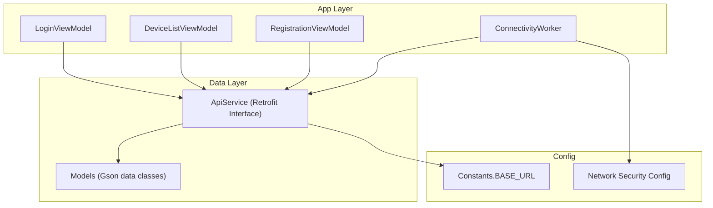
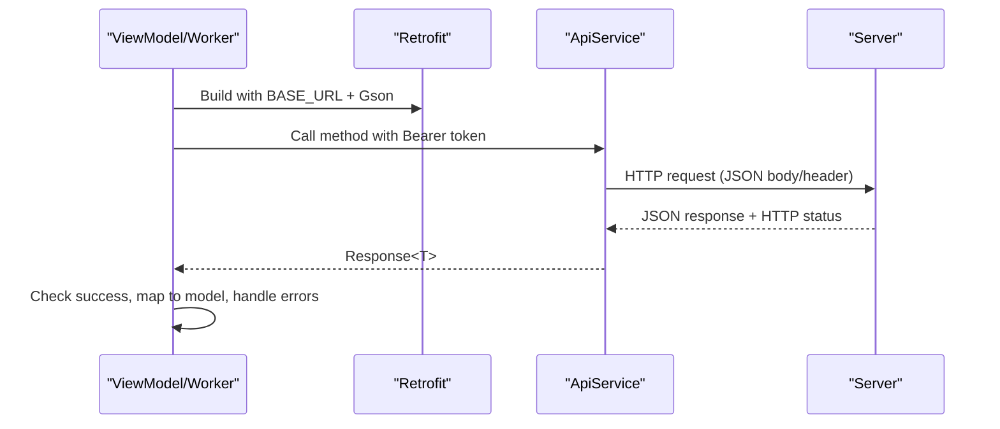
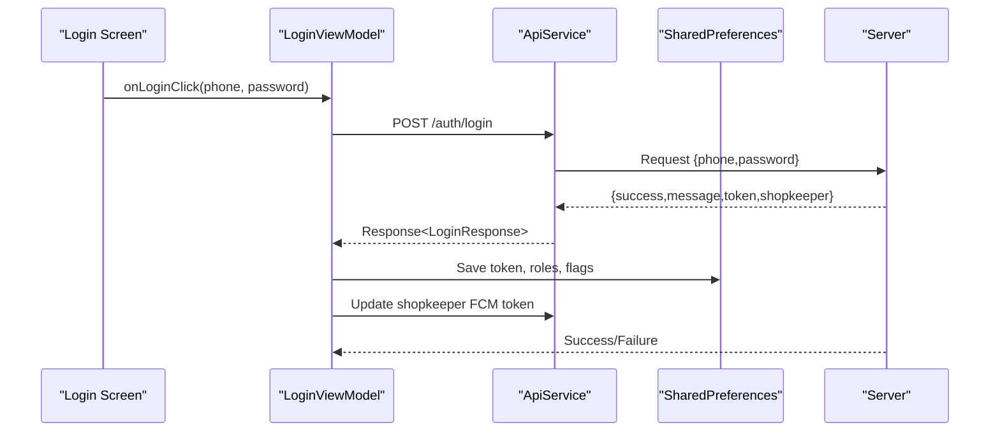
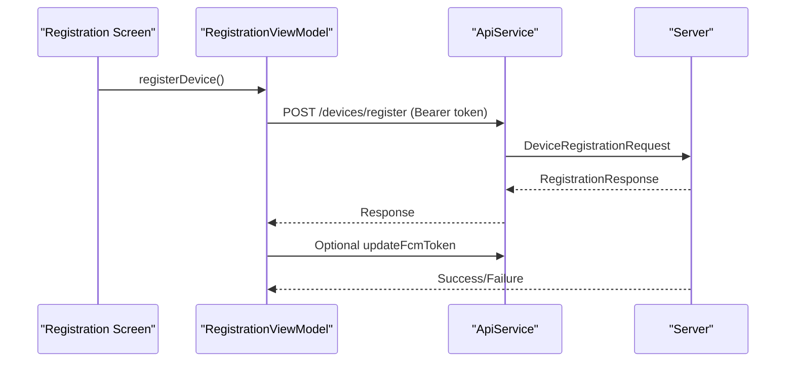
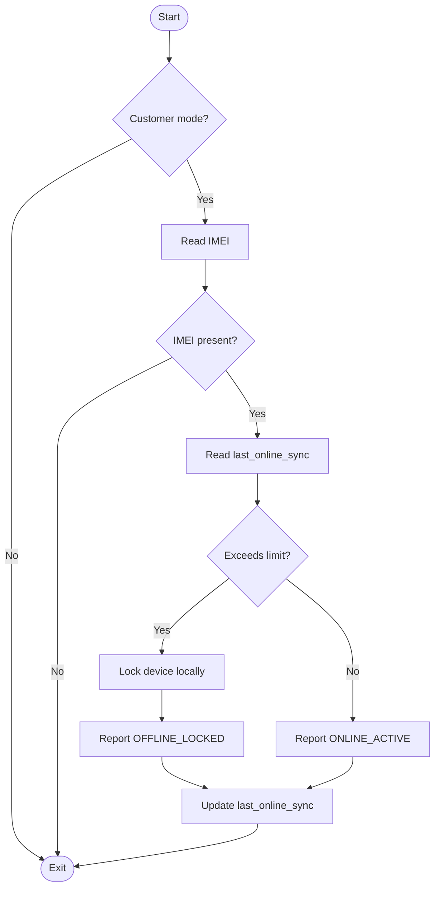
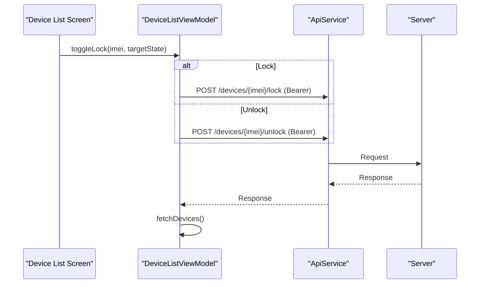
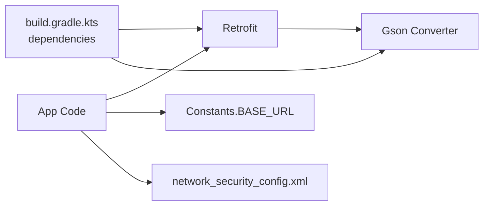

# REST API Client

<cite>
**Referenced Files in This Document**
- [ApiService.kt](file://app/src/main/java/com/pksafe/lock/manager/data/ApiService.kt)
- [Models.kt](file://app/src/main/java/com/pksafe/lock/manager/data/Models.kt)
- [Constants.kt](file://app/src/main/java/com/pksafe/lock/manager/util/Constants.kt)
- [LoginViewModel.kt](file://app/src/main/java/com/pksafe/lock/manager/ui/login/LoginViewModel.kt)
- [DeviceListViewModel.kt](file://app/src/main/java/com/pksafe/lock/manager/ui/devices/DeviceListViewModel.kt)
- [RegistrationViewModel.kt](file://app/src/main/java/com/pksafe/lock/manager/ui/registration/RegistrationViewModel.kt)
- [ConnectivityWorker.kt](file://app/src/main/java/com/pksafe/lock/manager/service/ConnectivityWorker.kt)
- [build.gradle.kts](file://app/build.gradle.kts)
- [network_security_config.xml](file://app/src/main/res/xml/network_security_config.xml)
</cite>

## Table of Contents
1. [Introduction](#introduction)
2. [Project Structure](#project-structure)
3. [Core Components](#core-components)
4. [Architecture Overview](#architecture-overview)
5. [Detailed Component Analysis](#detailed-component-analysis)
6. [Dependency Analysis](#dependency-analysis)
7. [Performance Considerations](#performance-considerations)
8. [Troubleshooting Guide](#troubleshooting-guide)
9. [Conclusion](#conclusion)
10. [Appendices](#appendices)

## Introduction
This document describes the REST API client used by PK Locker to communicate with the backend server. It covers the Retrofit-based API service, endpoint definitions, request/response models, authentication and session handling, error handling strategies, offline synchronization patterns, and practical examples for device registration, status synchronization, and command execution. It also explains data serialization using Gson and provides guidance for debugging network requests and handling API errors.

## Project Structure
The REST client is implemented as a Kotlin interface annotated with Retrofit HTTP annotations. Models are defined as data classes with Gson annotations for JSON mapping. The base URL is centralized in a constants file. ViewModels and background workers instantiate Retrofit clients per call site and invoke API methods while managing tokens from local storage.

**Diagram sources**
- [ApiService.kt:11-185](file://app/src/main/java/com/pksafe/lock/manager/data/ApiService.kt#L11-L185)
- [Models.kt:7-255](file://app/src/main/java/com/pksafe/lock/manager/data/Models.kt#L7-L255)
- [Constants.kt:3-10](file://app/src/main/java/com/pksafe/lock/manager/util/Constants.kt#L3-L10)
- [network_security_config.xml:9-27](file://app/src/main/res/xml/network_security_config.xml#L9-L27)

**Section sources**
- [ApiService.kt:11-185](file://app/src/main/java/com/pksafe/lock/manager/data/ApiService.kt#L11-L185)
- [Models.kt:7-255](file://app/src/main/java/com/pksafe/lock/manager/data/Models.kt#L7-L255)
- [Constants.kt:3-10](file://app/src/main/java/com/pksafe/lock/manager/util/Constants.kt#L3-L10)
- [network_security_config.xml:9-27](file://app/src/main/res/xml/network_security_config.xml#L9-L27)

## Core Components
- ApiService: Declares all REST endpoints using Retrofit annotations. Endpoints cover authentication, device management, EMI scheduling, key orders, and admin operations.
- Models: Data classes representing request payloads and server responses, annotated with Gson @SerializedName for field mapping.
- Constants: Centralized BASE_URL pointing to production or development server.
- ViewModels: Instantiate Retrofit instances, read auth tokens from SharedPreferences, and call API methods with Bearer token headers.
- ConnectivityWorker: Background worker that performs periodic heartbeat/status updates and enforces offline lock behavior.

Key responsibilities:
- Authentication: Login/signup returns a token stored locally; subsequent calls include Authorization header.
- Device lifecycle: Register, list, lock/unlock, deregister, update FCM tokens, notify SIM change/location.
- EMI and keys: Fetch schedules, mark payments, reschedule plans, checkout/payments, history, admin approvals/rejections.
- Error handling: Check response.isSuccessful and handle exceptions; log messages and set UI state.

**Section sources**
- [ApiService.kt:11-185](file://app/src/main/java/com/pksafe/lock/manager/data/ApiService.kt#L11-L185)
- [Models.kt:7-255](file://app/src/main/java/com/pksafe/lock/manager/data/Models.kt#L7-L255)
- [LoginViewModel.kt:23-88](file://app/src/main/java/com/pksafe/lock/manager/ui/login/LoginViewModel.kt#L23-L88)
- [DeviceListViewModel.kt:23-245](file://app/src/main/java/com/pksafe/lock/manager/ui/devices/DeviceListViewModel.kt#L23-L245)
- [RegistrationViewModel.kt:56-156](file://app/src/main/java/com/pksafe/lock/manager/ui/registration/RegistrationViewModel.kt#L56-L156)
- [ConnectivityWorker.kt:15-71](file://app/src/main/java/com/pksafe/lock/manager/service/ConnectivityWorker.kt#L15-L71)

## Architecture Overview
The app uses Retrofit to call REST endpoints. Each ViewModel or worker creates a Retrofit instance with Gson converter and a base URL from Constants. Tokens are retrieved from SharedPreferences and passed via Authorization header. Responses are deserialized into typed models. Errors are handled by checking response codes and catching exceptions.

**Diagram sources**
- [Constants.kt:3-10](file://app/src/main/java/com/pksafe/lock/manager/util/Constants.kt#L3-L10)
- [ApiService.kt:11-185](file://app/src/main/java/com/pksafe/lock/manager/data/ApiService.kt#L11-L185)
- [LoginViewModel.kt:23-88](file://app/src/main/java/com/pksafe/lock/manager/ui/login/LoginViewModel.kt#L23-L88)
- [DeviceListViewModel.kt:23-245](file://app/src/main/java/com/pksafe/lock/manager/ui/devices/DeviceListViewModel.kt#L23-L245)
- [ConnectivityWorker.kt:49-71](file://app/src/main/java/com/pksafe/lock/manager/service/ConnectivityWorker.kt#L49-L71)

## Detailed Component Analysis

### ApiService Endpoints and Models
- Authentication
  - POST /auth/login -> LoginRequest -> LoginResponse
  - POST /auth/register -> SignupRequest -> SignupResponse
- Devices
  - POST /devices/register -> DeviceRegistrationRequest -> RegistrationResponse
  - GET /devices -> DeviceListResponse
  - GET /devices/deregistered -> DeviceListResponse
  - GET /devices/stats -> StatsResponse
  - GET /devices/dashboard-analytics -> StatsResponse
  - POST /devices/{imei}/lock -> RegistrationResponse
  - POST /devices/{imei}/unlock -> RegistrationResponse
  - POST /devices/{imei}/controls -> AdvancedControlRequest -> RegistrationResponse
  - POST /devices/update-token -> Map<String,String> -> RegistrationResponse
  - POST /devices/update-shopkeeper-token -> Map<String,String> -> RegistrationResponse
  - POST /devices/{imei}/sim-changed -> Map<String,String> -> RegistrationResponse
  - POST /devices/{imei}/location -> Map<String,String> -> RegistrationResponse
  - POST /devices/{imei}/unlock-all -> RegistrationResponse
  - POST /devices/{imei}/deregister -> RegistrationResponse
  - GET /devices/public/{imei} -> CustomerDeviceResponse
- EMI
  - GET /emis/device/{imei} -> DeviceEmiScheduleResponse
  - POST /emis/{emiId}/mark-paid -> RegistrationResponse
  - POST /emis/device/{imei} -> RescheduleEmiRequest -> RegistrationResponse
- Key Orders
  - POST /key-orders/checkout-safepay -> Map<String,String> -> KeyCheckoutResponse
  - POST /key-orders/verify-safepay -> Map<String,String> -> RegistrationResponse
  - POST /key-orders/free-test-keys -> Map<String,String> -> RegistrationResponse
  - POST /key-orders/wallet-pay -> WalletPayRequest -> WalletPayResponse
  - GET /key-orders/history -> KeyHistoryResponse
- Admin Key Management
  - GET /admin/key-orders -> KeyOrderListResponse
  - POST /key-orders/request -> KeyRequest -> KeyOrderListResponse
  - POST /admin/key-orders/{id}/approve -> GenericResponse
  - POST /admin/key-orders/{id}/reject -> GenericResponse

Model highlights:
- All responses wrap success flags and messages where applicable.
- Device-related models include controls, location, geofence, and customer details.
- EMI models represent schedule summaries and installment items.
- Key order models support payment flows and history.

**Section sources**
- [ApiService.kt:11-185](file://app/src/main/java/com/pksafe/lock/manager/data/ApiService.kt#L11-L185)
- [Models.kt:7-255](file://app/src/main/java/com/pksafe/lock/manager/data/Models.kt#L7-L255)

### Authentication and Session Handling
- Login flow:
  - ViewModel calls login endpoint with credentials.
  - On success, token and shopkeeper info are saved to SharedPreferences.
  - Shopkeeper FCM token is updated via a dedicated endpoint.
- Subsequent requests:
  - Authorization header is set as "Bearer <token>" for protected endpoints.
  - Token retrieval occurs before each API call in ViewModels and workers.

**Diagram sources**
- [LoginViewModel.kt:30-88](file://app/src/main/java/com/pksafe/lock/manager/ui/login/LoginViewModel.kt#L30-L88)
- [ApiService.kt:11-17](file://app/src/main/java/com/pksafe/lock/manager/data/ApiService.kt#L11-L17)

**Section sources**
- [LoginViewModel.kt:30-88](file://app/src/main/java/com/pksafe/lock/manager/ui/login/LoginViewModel.kt#L30-L88)
- [ApiService.kt:11-17](file://app/src/main/java/com/pksafe/lock/manager/data/ApiService.kt#L11-L17)

### Device Registration Flow
- Collects device and customer information, computes EMI values, and sends a registration request with an Authorization header.
- On success, may update FCM token for the newly registered IMEI.

**Diagram sources**
- [RegistrationViewModel.kt:77-156](file://app/src/main/java/com/pksafe/lock/manager/ui/registration/RegistrationViewModel.kt#L77-L156)
- [ApiService.kt:19-24](file://app/src/main/java/com/pksafe/lock/manager/data/ApiService.kt#L19-L24)

**Section sources**
- [RegistrationViewModel.kt:77-156](file://app/src/main/java/com/pksafe/lock/manager/ui/registration/RegistrationViewModel.kt#L77-L156)
- [ApiService.kt:19-24](file://app/src/main/java/com/pksafe/lock/manager/data/ApiService.kt#L19-L24)

### Status Synchronization and Offline Behavior
- ConnectivityWorker runs periodically:
  - If last sync exceeds threshold, locks device locally and attempts to report status to server.
  - Otherwise, reports online active status.
  - Uses Retrofit to call advanced control endpoint with Bearer token.
  - Updates last_online_sync timestamp on success.

**Diagram sources**
- [ConnectivityWorker.kt:17-71](file://app/src/main/java/com/pksafe/lock/manager/service/ConnectivityWorker.kt#L17-L71)

**Section sources**
- [ConnectivityWorker.kt:17-71](file://app/src/main/java/com/pksafe/lock/manager/service/ConnectivityWorker.kt#L17-L71)

### Command Execution Examples
- Lock/Unlock devices:
  - ViewModel toggles lock state by calling appropriate endpoint with Bearer token.
  - On success, refreshes device list to reflect current state.
- Advanced controls:
  - Send action/state pairs via advanced control endpoint.
  - On success, refresh device list to ensure consistency.

**Diagram sources**
- [DeviceListViewModel.kt:143-171](file://app/src/main/java/com/pksafe/lock/manager/ui/devices/DeviceListViewModel.kt#L143-L171)
- [ApiService.kt:46-56](file://app/src/main/java/com/pksafe/lock/manager/data/ApiService.kt#L46-L56)

**Section sources**
- [DeviceListViewModel.kt:143-171](file://app/src/main/java/com/pksafe/lock/manager/ui/devices/DeviceListViewModel.kt#L143-L171)
- [ApiService.kt:46-56](file://app/src/main/java/com/pksafe/lock/manager/data/ApiService.kt#L46-L56)

### Data Serialization and Model Mapping
- Gson is used for JSON serialization/deserialization.
- Fields use @SerializedName to map server fields to Kotlin properties.
- Nested objects (e.g., DeviceResponse includes controls, location, geofence) enable rich data binding.
- Version compatibility:
  - Use nullable fields and default values to tolerate missing server fields.
  - Keep optional fields optional in models to avoid parsing failures when server evolves.

**Section sources**
- [Models.kt:7-255](file://app/src/main/java/com/pksafe/lock/manager/data/Models.kt#L7-L255)
- [build.gradle.kts:100-101](file://app/build.gradle.kts#L100-L101)

## Dependency Analysis
- Retrofit and Gson converters are declared as dependencies.
- Network security configuration allows cleartext traffic only for private IP ranges and localhost, ensuring HTTPS by default for production endpoints.
- Base URL is centralized to switch between dev/prod easily.

**Diagram sources**
- [build.gradle.kts:100-101](file://app/build.gradle.kts#L100-L101)
- [Constants.kt:3-10](file://app/src/main/java/com/pksafe/lock/manager/util/Constants.kt#L3-L10)
- [network_security_config.xml:9-27](file://app/src/main/res/xml/network_security_config.xml#L9-L27)

**Section sources**
- [build.gradle.kts:100-101](file://app/build.gradle.kts#L100-L101)
- [Constants.kt:3-10](file://app/src/main/java/com/pksafe/lock/manager/util/Constants.kt#L3-L10)
- [network_security_config.xml:9-27](file://app/src/main/res/xml/network_security_config.xml#L9-L27)

## Performance Considerations
- Connection pooling:
  - Retrofit uses OkHttp under the hood; connection pooling is enabled by default. No explicit configuration found in this codebase.
- Timeouts:
  - No custom timeouts configured in the Retrofit builders used here. Default OkHttp timeouts apply.
- Retry policies:
  - No retry interceptors or automatic retries are implemented in the codebase.
- Recommendations:
  - Add OkHttp logging interceptor for request/response inspection.
  - Configure connect/read/write timeouts suitable for mobile networks.
  - Implement exponential backoff retries for transient errors.
  - Cache frequent read-only responses where appropriate.

[No sources needed since this section provides general guidance]

## Troubleshooting Guide
- Common issues:
  - Missing or invalid token: Ensure Authorization header is set correctly as "Bearer <token>".
  - Network errors: Catch exceptions and display user-friendly messages; verify connectivity and server availability.
  - Server errors: Inspect response code and message; handle non-2xx responses gracefully.
- Debugging steps:
  - Log request URLs, headers, and bodies using an HTTP logging interceptor.
  - Verify BASE_URL points to the intended environment.
  - Confirm network security config permits required traffic (HTTPS by default; HTTP allowed for private ranges).
- Offline synchronization:
  - ConnectivityWorker enforces local locking if offline beyond a threshold and attempts to report status when possible.
  - Update last_online_sync on successful server communication.

**Section sources**
- [DeviceListViewModel.kt:33-64](file://app/src/main/java/com/pksafe/lock/manager/ui/devices/DeviceListViewModel.kt#L33-L64)
- [ConnectivityWorker.kt:17-71](file://app/src/main/java/com/pksafe/lock/manager/service/ConnectivityWorker.kt#L17-L71)
- [network_security_config.xml:9-27](file://app/src/main/res/xml/network_security_config.xml#L9-L27)

## Conclusion
PK Locker’s REST client leverages Retrofit with Gson for clean, type-safe API calls. Authentication is managed via Bearer tokens stored in SharedPreferences and attached to protected endpoints. The app implements robust error handling and offline safeguards through a background worker. While no custom timeouts or retries are configured, the architecture supports adding these enhancements for improved resilience and performance.

[No sources needed since this section summarizes without analyzing specific files]

## Appendices

### Endpoint Reference Summary
- Authentication: /auth/login, /auth/register
- Devices: /devices/register, /devices, /devices/deregistered, /devices/stats, /devices/dashboard-analytics, /devices/{imei}/lock, /devices/{imei}/unlock, /devices/{imei}/controls, /devices/update-token, /devices/update-shopkeeper-token, /devices/{imei}/sim-changed, /devices/{imei}/location, /devices/{imei}/unlock-all, /devices/{imei}/deregister, /devices/public/{imei}
- EMI: /emis/device/{imei}, /emis/{emiId}/mark-paid, /emis/device/{imei}
- Keys: /key-orders/checkout-safepay, /key-orders/verify-safepay, /key-orders/free-test-keys, /key-orders/wallet-pay, /key-orders/history
- Admin: /admin/key-orders, /key-orders/request, /admin/key-orders/{id}/approve, /admin/key-orders/{id}/reject

**Section sources**
- [ApiService.kt:11-185](file://app/src/main/java/com/pksafe/lock/manager/data/ApiService.kt#L11-L185)