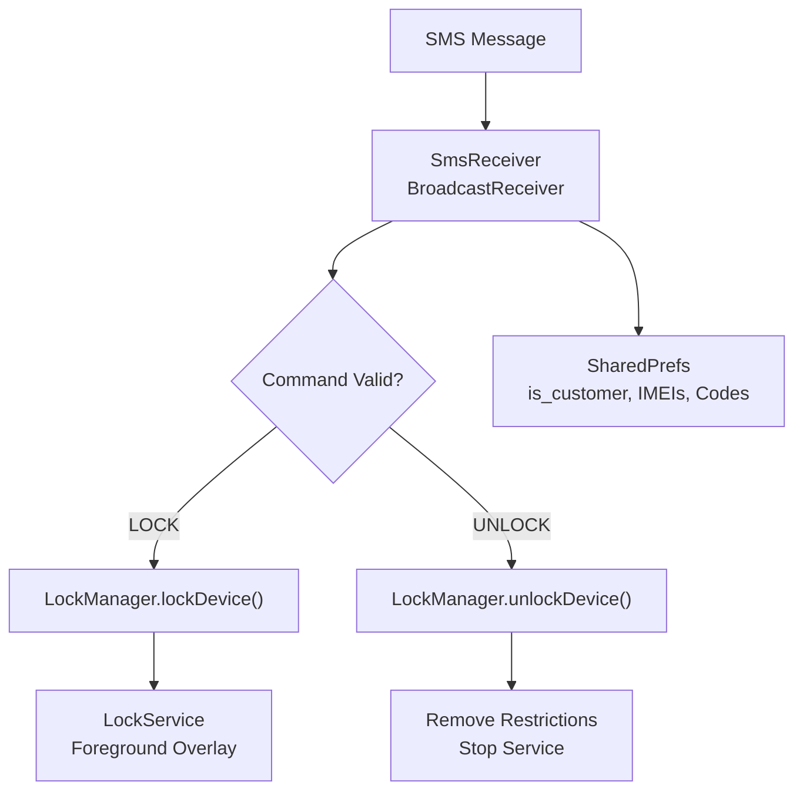
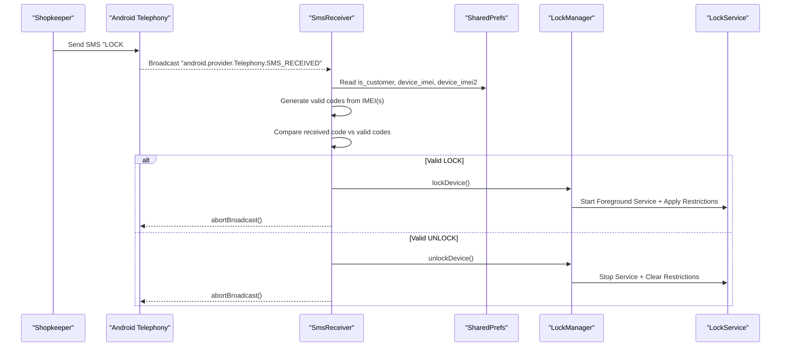
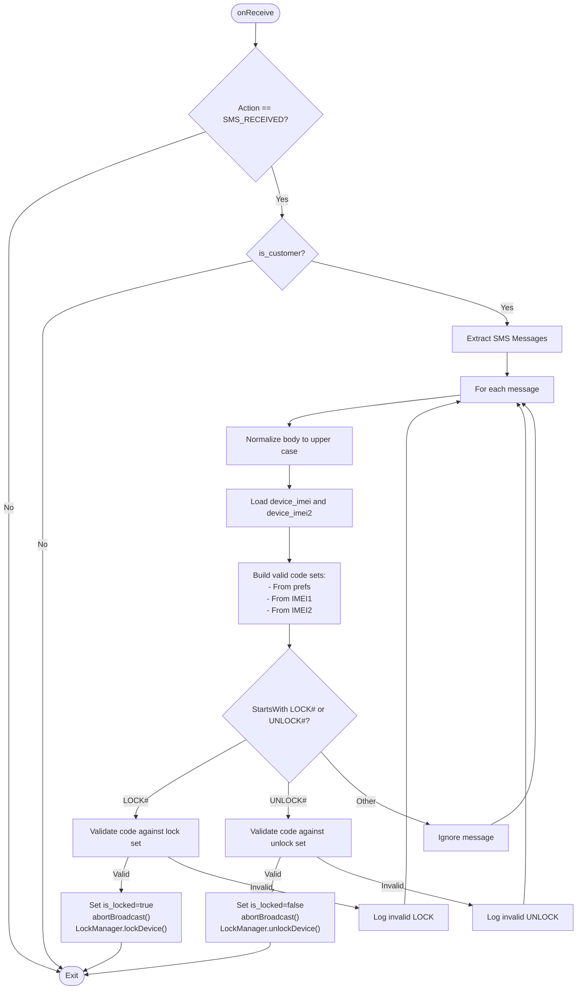
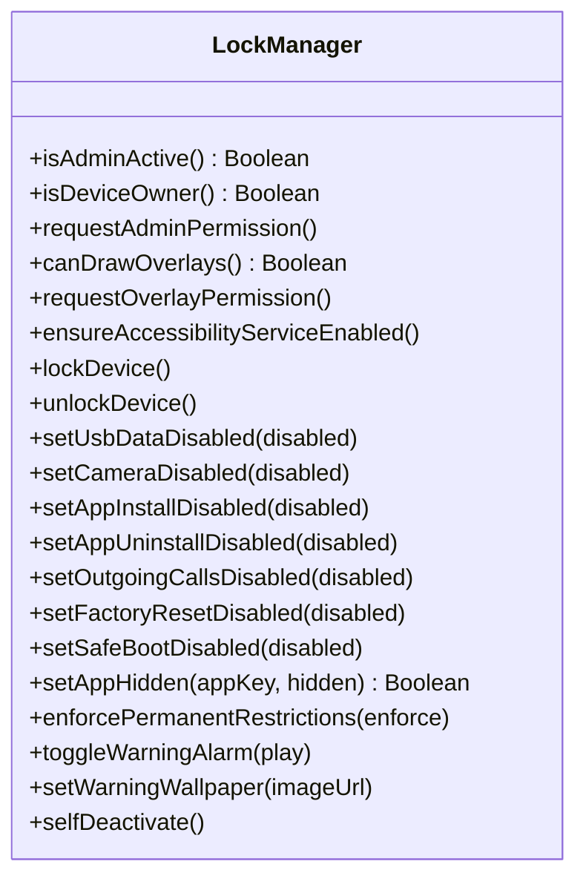
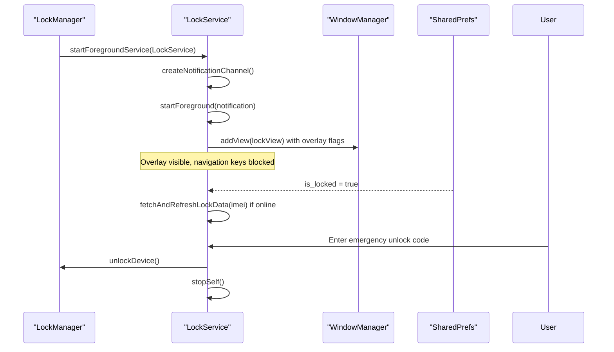
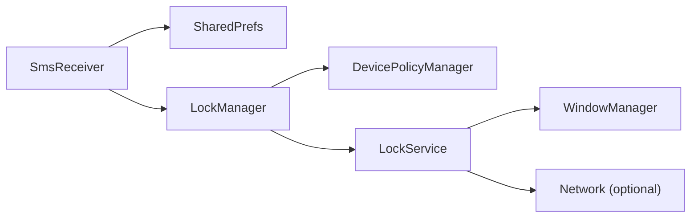

# SMS Command Processing

<cite>
**Referenced Files in This Document**
- [SmsReceiver.kt](file://app/src/main/java/com/pksafe/lock/manager/receiver/SmsReceiver.kt)
- [AndroidManifest.xml](file://app/src/main/AndroidManifest.xml)
- [LockManager.kt](file://app/src/main/java/com/pksafe/lock/manager/util/LockManager.kt)
- [LockService.kt](file://app/src/main/java/com/pksafe/lock/manager/service/LockService.kt)
- [MainActivity.kt](file://app/src/main/java/com/pksafe/lock/manager/MainActivity.kt)
- [AdminReceiver.kt](file://app/src/main/java/com/pksafe/lock/manager/receiver/AdminReceiver.kt)
</cite>

## Table of Contents
1. [Introduction](#introduction)
2. [Project Structure](#project-structure)
3. [Core Components](#core-components)
4. [Architecture Overview](#architecture-overview)
5. [Detailed Component Analysis](#detailed-component-analysis)
6. [Dependency Analysis](#dependency-analysis)
7. [Performance Considerations](#performance-considerations)
8. [Troubleshooting Guide](#troubleshooting-guide)
9. [Conclusion](#conclusion)

## Introduction
This document explains PK Locker’s offline SMS command processing system that allows shopkeepers to lock or unlock a customer device without internet connectivity. The system relies on an Android Broadcast Receiver that intercepts incoming SMS messages, validates the embedded security code using SHA-256 and the device IMEI(s), and triggers hardware-level locking via Device Policy Manager APIs. It also documents the dual IMEI fallback mechanism for devices with multiple SIM slots, message formats, code generation and validation flows, security considerations, and troubleshooting guidance.

## Project Structure
The SMS command flow spans several components:
- A broadcast receiver listens for incoming SMS and parses commands.
- A manager applies device restrictions and starts a persistent lock overlay service.
- A foreground service maintains the lock UI and enforces restrictions.
- Provisioning and admin setup store IMEIs and flags required by the receiver.

**Diagram sources**
- [SmsReceiver.kt:44-143](file://app/src/main/java/com/pksafe/lock/manager/receiver/SmsReceiver.kt#L44-L143)
- [LockManager.kt:111-148](file://app/src/main/java/com/pksafe/lock/manager/util/LockManager.kt#L111-L148)
- [LockService.kt:50-80](file://app/src/main/java/com/pksafe/lock/manager/service/LockService.kt#L50-L80)

**Section sources**
- [AndroidManifest.xml:132-140](file://app/src/main/AndroidManifest.xml#L132-L140)
- [SmsReceiver.kt:1-164](file://app/src/main/java/com/pksafe/lock/manager/receiver/SmsReceiver.kt#L1-L164)

## Core Components
- SmsReceiver: Intercepts SMS, extracts body, validates codes against stored or generated values, aborts broadcast to hide from default SMS app, updates lock state, and calls LockManager to enforce actions.
- LockManager: Applies Device Policy Manager restrictions (camera, USB, factory reset, safe boot, debugging, status bar, keyguard), starts/stops LockService, and manages device owner privileges.
- LockService: Runs as a foreground service, displays a persistent lock overlay, supports emergency unlock via dynamic master code, and refreshes lock data when online.
- AdminReceiver and MainActivity: During provisioning, capture device IMEI(s) and set is_customer flag; optionally persist server-provided SMS codes.

Key responsibilities:
- Offline operation: Code validation uses local IMEI(s) and deterministic hashing; no network required.
- Dual IMEI support: Accepts codes derived from either IMEI slot.
- Security: Uses SHA-256 over “PREFIX_IMEI” strings; broadcasts are aborted to prevent leakage; device restrictions are enforced at OS level.

**Section sources**
- [SmsReceiver.kt:31-42](file://app/src/main/java/com/pksafe/lock/manager/receiver/SmsReceiver.kt#L31-L42)
- [SmsReceiver.kt:64-92](file://app/src/main/java/com/pksafe/lock/manager/receiver/SmsReceiver.kt#L64-L92)
- [LockManager.kt:111-192](file://app/src/main/java/com/pksafe/lock/manager/util/LockManager.kt#L111-L192)
- [LockService.kt:50-80](file://app/src/main/java/com/pksafe/lock/manager/service/LockService.kt#L50-L80)
- [AdminReceiver.kt:80-90](file://app/src/main/java/com/pksafe/lock/manager/receiver/AdminReceiver.kt#L80-L90)
- [MainActivity.kt:540-565](file://app/src/main/java/com/pksafe/lock/manager/MainActivity.kt#L540-L565)

## Architecture Overview
The system is designed to operate fully offline once provisioned. The broadcast receiver is registered with high priority to intercept SMS before other apps. Validation is deterministic and based on device identity (IMEI). Enforcement uses enterprise-grade APIs available to Device Owner apps.

**Diagram sources**
- [AndroidManifest.xml:132-140](file://app/src/main/AndroidManifest.xml#L132-L140)
- [SmsReceiver.kt:44-143](file://app/src/main/java/com/pksafe/lock/manager/receiver/SmsReceiver.kt#L44-L143)
- [LockManager.kt:111-148](file://app/src/main/java/com/pksafe/lock/manager/util/LockManager.kt#L111-L148)
- [LockService.kt:50-80](file://app/src/main/java/com/pksafe/lock/manager/service/LockService.kt#L50-L80)

## Detailed Component Analysis

### SmsReceiver: Offline SMS Command Processor
- Registration and interception:
  - Declared in manifest with high priority intent filter for SMS_RECEIVED and BROADCAST_SMS permission.
  - Filters only customer devices via is_customer flag.
- Message parsing:
  - Extracts PDU-based SMS messages across Android versions.
  - Normalizes body to uppercase for command detection.
- Code validation:
  - Collects valid codes from two sources:
    - Persisted server-provided codes (if present).
    - Deterministically generated codes from one or both IMEIs using SHA-256 over “LOCK_{imei}” and “UNLOCK_{imei}”.
- Actions:
  - On valid LOCK: sets is_locked, aborts broadcast, calls LockManager.lockDevice().
  - On valid UNLOCK: clears is_locked, aborts broadcast, calls LockManager.unlockDevice().
  - Ignores non-matching messages.

**Diagram sources**
- [SmsReceiver.kt:44-143](file://app/src/main/java/com/pksafe/lock/manager/receiver/SmsReceiver.kt#L44-L143)

**Section sources**
- [AndroidManifest.xml:132-140](file://app/src/main/AndroidManifest.xml#L132-L140)
- [SmsReceiver.kt:145-162](file://app/src/main/java/com/pksafe/lock/manager/receiver/SmsReceiver.kt#L145-L162)

### LockManager: Device Policy Enforcement
- Enforces comprehensive restrictions when locked:
  - Camera disabled.
  - USB file transfer blocked.
  - Factory reset blocked.
  - Safe boot blocked.
  - Debugging features blocked.
  - Status bar disabled.
  - Keyguard disabled to show custom overlay.
- Starts/stops LockService and applies/clears restrictions accordingly.
- Provides granular controls for individual features (USB, camera, app install/uninstall, outgoing calls, etc.).
- Supports self-deactivation to remove all privileges when needed.

**Diagram sources**
- [LockManager.kt:27-406](file://app/src/main/java/com/pksafe/lock/manager/util/LockManager.kt#L27-L406)

**Section sources**
- [LockManager.kt:111-192](file://app/src/main/java/com/pksafe/lock/manager/util/LockManager.kt#L111-L192)
- [LockManager.kt:202-315](file://app/src/main/java/com/pksafe/lock/manager/util/LockManager.kt#L202-L315)
- [LockManager.kt:351-404](file://app/src/main/java/com/pksafe/lock/manager/util/LockManager.kt#L351-L404)

### LockService: Persistent Lock Overlay and Emergency Unlock
- Runs as a foreground service with a persistent notification.
- Displays an overlay view that blocks navigation keys and shows lock information.
- Supports emergency unlock using a dynamic master code derived from the last 6 digits of the stored IMEI (fallback to a hardcoded value if IMEI is missing).
- Refreshes lock overlay content from the server when online.

**Diagram sources**
- [LockService.kt:50-80](file://app/src/main/java/com/pksafe/lock/manager/service/LockService.kt#L50-L80)
- [LockService.kt:125-234](file://app/src/main/java/com/pksafe/lock/manager/service/LockService.kt#L125-L234)
- [LockService.kt:240-314](file://app/src/main/java/com/pksafe/lock/manager/service/LockService.kt#L240-L314)

**Section sources**
- [LockService.kt:50-80](file://app/src/main/java/com/pksafe/lock/manager/service/LockService.kt#L50-L80)
- [LockService.kt:125-234](file://app/src/main/java/com/pksafe/lock/manager/service/LockService.kt#L125-L234)
- [LockService.kt:240-314](file://app/src/main/java/com/pksafe/lock/manager/service/LockService.kt#L240-L314)

### Provisioning and IMEI Storage
- AdminReceiver captures device IMEI(s) during provisioning and stores them in shared preferences for later use by SmsReceiver.
- MainActivity may fetch and persist server-provided SMS codes for devices; otherwise, SmsReceiver falls back to generating codes from IMEI(s).

**Section sources**
- [AdminReceiver.kt:80-90](file://app/src/main/java/com/pksafe/lock/manager/receiver/AdminReceiver.kt#L80-L90)
- [MainActivity.kt:540-565](file://app/src/main/java/com/pksafe/lock/manager/MainActivity.kt#L540-L565)

## Dependency Analysis
- SmsReceiver depends on:
  - Shared Preferences for device role and identifiers.
  - LockManager for enforcement.
  - Android Telephony APIs for SMS parsing.
- LockManager depends on:
  - DevicePolicyManager for enterprise restrictions.
  - LockService for overlay and persistence.
- LockService depends on:
  - WindowManager for overlay.
  - Network APIs for live data refresh (optional).

**Diagram sources**
- [SmsReceiver.kt:44-143](file://app/src/main/java/com/pksafe/lock/manager/receiver/SmsReceiver.kt#L44-L143)
- [LockManager.kt:111-192](file://app/src/main/java/com/pksafe/lock/manager/util/LockManager.kt#L111-L192)
- [LockService.kt:125-234](file://app/src/main/java/com/pksafe/lock/manager/service/LockService.kt#L125-L234)

**Section sources**
- [AndroidManifest.xml:132-140](file://app/src/main/AndroidManifest.xml#L132-L140)
- [SmsReceiver.kt:64-92](file://app/src/main/java/com/pksafe/lock/manager/receiver/SmsReceiver.kt#L64-L92)

## Performance Considerations
- Broadcast interception priority: High-priority intent filter ensures early handling of SMS.
- Minimal CPU usage: SHA-256 hashing is lightweight; operations run synchronously in onReceive.
- Foreground service: LockService runs persistently to maintain overlay and enforce restrictions reliably.
- Optional network calls: Live refresh occurs only when online; does not block core offline functionality.

[No sources needed since this section provides general guidance]

## Troubleshooting Guide
Common issues and resolutions:
- SMS not intercepted:
  - Ensure RECEIVE_SMS and READ_SMS permissions are granted.
  - Verify SmsReceiver has high priority and BROADCAST_SMS permission in manifest.
  - Confirm is_customer flag is set to true for the device.
- Invalid code errors:
  - Check that device_imei and device_imei2 are stored correctly.
  - If server-provided codes exist, ensure they match lowercase normalization used by receiver.
  - Validate that the sender uses the correct format: LOCK#code or UNLOCK#code.
- Lock overlay not showing:
  - Confirm Device Owner privileges are active and LockService started.
  - Check overlay permissions and that the service is running in foreground mode.
- Emergency unlock:
  - Use the dynamic master code (last 6 digits of device_imei) if configured; otherwise, verify fallback behavior.

Debugging techniques:
- Inspect logs tagged with PKL_SMS for SMS reception and validation steps.
- Review LockManager logs for restriction application failures.
- Validate SharedPrefs entries: is_customer, device_imei, device_imei2, sms_lock_code, sms_unlock_code, is_locked.

**Section sources**
- [AndroidManifest.xml:18-20](file://app/src/main/AndroidManifest.xml#L18-L20)
- [AndroidManifest.xml:132-140](file://app/src/main/AndroidManifest.xml#L132-L140)
- [SmsReceiver.kt:44-143](file://app/src/main/java/com/pksafe/lock/manager/receiver/SmsReceiver.kt#L44-L143)
- [LockService.kt:200-218](file://app/src/main/java/com/pksafe/lock/manager/service/LockService.kt#L200-L218)

## Conclusion
PK Locker’s SMS command processing enables secure, offline device control through deterministic code validation based on device IMEI(s). The SmsReceiver handles message interception and validation, while LockManager and LockService enforce robust restrictions and maintain a persistent lock overlay. The dual IMEI fallback ensures compatibility across multi-SIM devices. Proper configuration of permissions, provisioning, and device owner privileges is essential for reliable operation.

[No sources needed since this section summarizes without analyzing specific files]