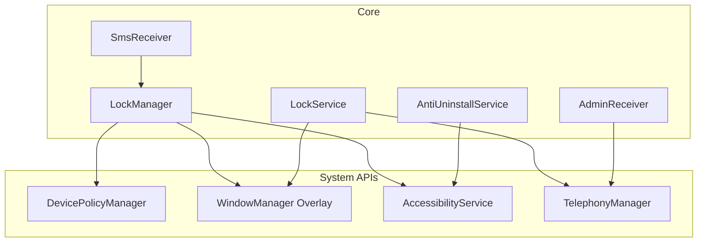
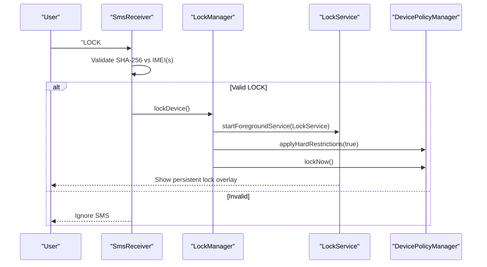
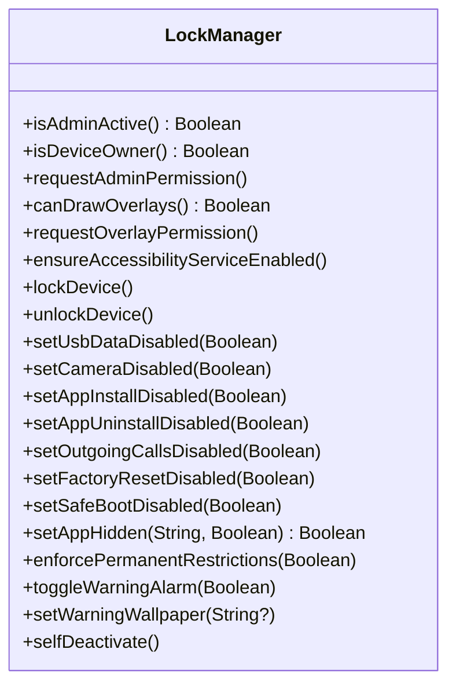
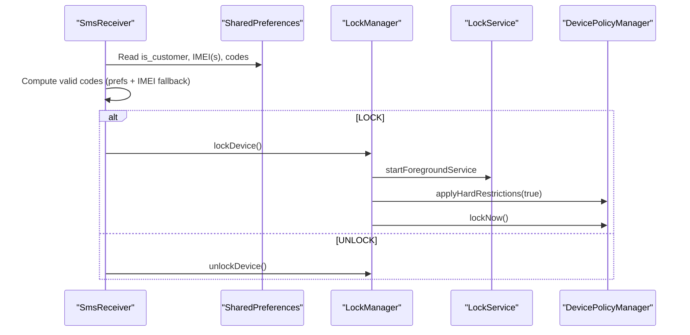
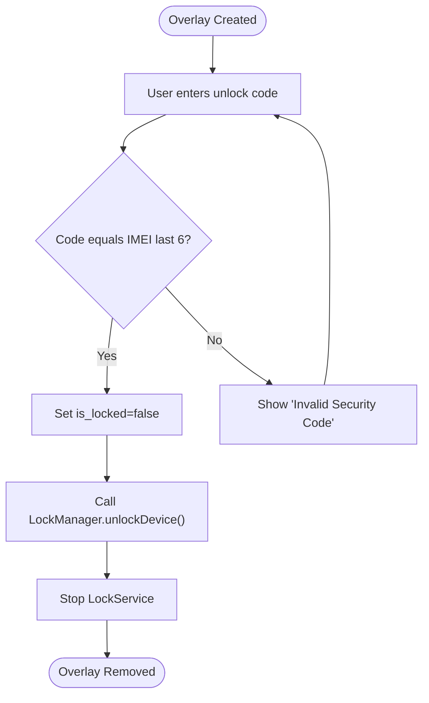
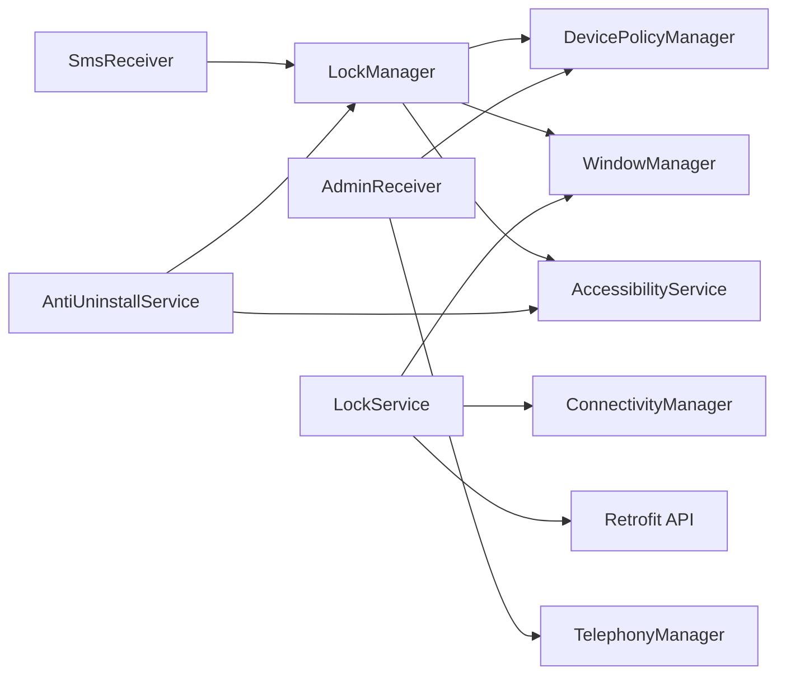

# Core Components

<cite>
**Referenced Files in This Document**
- [LockManager.kt](file://app/src/main/java/com/pksafe/lock\manager/util/LockManager.kt)
- [SmsReceiver.kt](file://app/src/main/java/com/pksafe/lock\manager/receiver/SmsReceiver.kt)
- [LockService.kt](file://app/src/main/java/com/pksafe/lock\manager/service/LockService.kt)
- [AntiUninstallService.kt](file://app/src/main/java/com/pksafe/lock\manager/service/AntiUninstallService.kt)
- [AdminReceiver.kt](file://app/src/main/java/com/pksafe/lock\manager/receiver/AdminReceiver.kt)
- [AndroidManifest.xml](file://app/src/main/AndroidManifest.xml)
- [accessibility_service_config.xml](file://app/src/main/res/xml/accessibility_service_config.xml)
- [device_admin_policies.xml](file://app/src/main/res/xml/device_admin_policies.xml)
</cite>

## Table of Contents
1. Introduction
2. Project Structure
3. Core Components
4. Architecture Overview
5. Detailed Component Analysis
6. Dependency Analysis
7. Performance Considerations
8. Troubleshooting Guide
9. Conclusion

## Introduction
This document explains PK Locker’s core components that enable device management and persistent lock functionality. It focuses on:
- LockManager as the central orchestrator for hardware restrictions via Device Policy Manager, enabling accessibility services for anti-tampering, and managing an overlay-based persistent lock screen.
- SmsReceiver for offline SMS command processing with SHA-256 validation and dual IMEI fallback.
- LockService foreground service for persistent background operations, system event handling, and overlay UI.

It also covers integration patterns, configuration options, error handling strategies, performance considerations, and troubleshooting approaches grounded in the actual codebase.

## Project Structure
PK Locker organizes its core device management logic across three primary modules:
- Utility layer (LockManager): Orchestrates Device Policy Manager actions, permissions, and overlays.
- System receivers (SmsReceiver, AdminReceiver): Handle boot-time provisioning, SMS commands, and admin lifecycle events.
- Background services (LockService, AntiUninstallService): Provide persistent foreground operation, overlay UI, and anti-tampering behavior.

**Diagram sources**
- [LockManager.kt:27-108](file://app/src/main/java/com/pksafe/lock\manager/util/LockManager.kt#L27-L108)
- [LockService.kt:41-123](file://app/src/main/java/com/pksafe/lock\manager/service/LockService.kt#L41-L123)
- [AntiUninstallService.kt:22-80](file://app/src/main/java/com/pksafe/lock\manager/service/AntiUninstallService.kt#L22-L80)
- [AdminReceiver.kt:14-103](file://app/src/main/java/com/pksafe/lock\manager/receiver/AdminReceiver.kt#L14-L103)
- [SmsReceiver.kt:29-163](file://app/src/main/java/com/pksafe/lock\manager/receiver/SmsReceiver.kt#L29-L163)

**Section sources**
- [AndroidManifest.xml:73-140](file://app/src/main/AndroidManifest.xml#L73-L140)

## Core Components
- LockManager: Central orchestrator that applies hardware restrictions, manages overlay permissions, enables accessibility services via Device Owner API, and triggers lock/unlock flows.
- SmsReceiver: Offline SMS command processor that validates codes using SHA-256 against stored or derived IMEIs and invokes LockManager to lock/unlock the device.
- LockService: Foreground service that renders a persistent lock overlay, handles unlock input, refreshes EMI data from backend, and monitors connectivity for auto-lock behavior.
- AntiUninstallService: Accessibility-based guard that blocks tampering attempts, enforces app hiding, and supports auto-lock on network loss.
- AdminReceiver: Device admin receiver that provisions the device owner, grants critical permissions, and captures IMEI(s) during setup.

**Section sources**
- [LockManager.kt:27-405](file://app/src/main/java/com/pksafe/lock\manager/util/LockManager.kt#L27-L405)
- [SmsReceiver.kt:29-163](file://app/src/main/java/com/pksafe/lock\manager/receiver/SmsReceiver.kt#L29-L163)
- [LockService.kt:41-329](file://app/src/main/java/com/pksafe/lock\manager/service/LockService.kt#L41-L329)
- [AntiUninstallService.kt:22-224](file://app/src/main/java/com/pksafe/lock\manager/service/AntiUninstallService.kt#L22-L224)
- [AdminReceiver.kt:14-103](file://app/src/main/java/com/pksafe/lock\manager/receiver/AdminReceiver.kt#L14-L103)

## Architecture Overview
The system combines enterprise-grade device controls with a resilient offline control plane:
- LockManager coordinates Device Policy Manager restrictions and overlay activation.
- SmsReceiver processes offline commands and delegates enforcement to LockManager.
- LockService maintains a persistent overlay and background tasks while enforcing user interactions.
- AntiUninstallService provides tamper resistance by intercepting settings navigation and blocking restricted actions.
- AdminReceiver ensures proper provisioning and permission granting at device owner level.

**Diagram sources**
- [SmsReceiver.kt:44-143](file://app/src/main/java/com/pksafe/lock\manager/receiver/SmsReceiver.kt#L44-L143)
- [LockManager.kt:111-148](file://app/src/main/java/com/pksafe/lock\manager/util/LockManager.kt#L111-L148)
- [LockService.kt:50-80](file://app/src/main/java/com/pksafe/lock\manager/service/LockService.kt#L50-L80)

## Detailed Component Analysis

### LockManager
Responsibilities:
- Enforce hardware restrictions via Device Policy Manager when locked.
- Manage overlay permissions and launch LockService for persistent lock UI.
- Enable/disable accessibility services through Device Owner API for anti-tampering.
- Provide granular controls for USB, camera, app install/uninstall, calls, factory reset, safe boot, status bar, and keyguard.
- Support permanent restrictions even when “unlocked” for security posture.
- Offer self-deactivation flow to remove privileges safely.

Key behaviors:
- Hardware restrictions are applied conditionally based on admin/device owner state and Android version checks.
- Overlay permission is requested if not granted; accessibility service is enabled via secure settings when device owner is active.
- Lock flow starts LockService, applies restrictions, then locks the device after a short delay.
- Unlock flow stops LockService, clears restrictions, and resets internal flags.

Configuration options:
- App hiding map for known packages (e.g., messaging, social, streaming).
- Permanent restrictions toggle for factory reset, USB transfer, and debugging features.
- Alarm and wallpaper toggles for warning states.

Error handling:
- Graceful logging and fallbacks when DPM calls fail.
- Defensive checks for admin/device owner presence before applying restrictions.

Integration patterns:
- Called by SmsReceiver for offline lock/unlock.
- Used by LockService for emergency unlock path.
- Invoked by AntiUninstallService for auto-lock on connectivity loss.

Performance considerations:
- Restriction application is lightweight but should be batched where possible.
- Avoid repeated overlay permission prompts by caching state.

Troubleshooting tips:
- Verify admin/device owner status before expecting restrictions to take effect.
- Ensure overlay permission is granted on modern Android versions.
- Check logs for DPM errors when restrictions do not apply.

**Section sources**
- [LockManager.kt:27-108](file://app/src/main/java/com/pksafe/lock\manager/util/LockManager.kt#L27-L108)
- [LockManager.kt:111-192](file://app/src/main/java/com/pksafe/lock\manager/util/LockManager.kt#L111-L192)
- [LockManager.kt:202-315](file://app/src/main/java/com/pksafe/lock\manager/util/LockManager.kt#L202-L315)
- [LockManager.kt:317-405](file://app/src/main/java/com/pksafe/lock\manager/util/LockManager.kt#L317-L405)

#### Class relationships

**Diagram sources**
- [LockManager.kt:27-405](file://app/src/main/java/com/pksafe/lock\manager/util/LockManager.kt#L27-L405)

### SmsReceiver
Responsibilities:
- Intercept incoming SMS messages.
- Validate commands using SHA-256 codes derived from device IMEI(s).
- Trigger lock/unlock via LockManager upon successful validation.

Processing logic:
- Extracts message bodies and normalizes case.
- Builds valid code sets from preferences and both IMEIs as fallback.
- Supports LOCK# and UNLOCK# prefixes.
- Aborts broadcast to hide messages from default SMS apps after processing.

Error handling:
- Logs invalid codes and missing IMEI conditions.
- Catches exceptions during PDU parsing and DPM calls.

Configuration options:
- Stores lock/unlock codes in preferences for override.
- Uses dual IMEI fallback to ensure robustness across SIM configurations.

Integration patterns:
- Delegates enforcement to LockManager to maintain single source of truth for locking state.

Performance considerations:
- Minimal CPU usage; runs only on SMS receipt.

Troubleshooting tips:
- Confirm IMEI values are saved during provisioning.
- Ensure SMS permissions are granted and receiver is registered.
- Validate that generated codes match backend expectations.

**Section sources**
- [SmsReceiver.kt:29-163](file://app/src/main/java/com/pksafe/lock\manager/receiver/SmsReceiver.kt#L29-L163)

#### Sequence diagram: Offline SMS lock

**Diagram sources**
- [SmsReceiver.kt:44-143](file://app/src/main/java/com/pksafe/lock\manager/receiver/SmsReceiver.kt#L44-L143)
- [LockManager.kt:111-148](file://app/src/main/java/com/pksafe/lock\manager/util/LockManager.kt#L111-L148)

### LockService
Responsibilities:
- Run as a foreground service to persist background operations.
- Display a persistent lock overlay with dynamic content and unlock entry.
- Monitor connectivity to trigger auto-lock when configured.
- Refresh EMI and shop details from backend and update overlay.

Key behaviors:
- Starts foreground with a high-priority notification channel.
- Creates an overlay view with flags to remain visible and interactable.
- Blocks back/home/recents/menu keys to prevent bypass.
- Validates unlock code dynamically using last digits of IMEI or master fallback.
- Fetches fresh device/EMI data and updates UI on main thread.

Error handling:
- Stops itself if running on admin/shopkeeper devices.
- Handles overlay addition failures and network errors gracefully.

Configuration options:
- Auto-lock on connectivity loss.
- Dynamic master unlock code derived from IMEI.

Integration patterns:
- Started by LockManager during lock flow.
- Calls LockManager.unlockDevice() on successful unlock.

Performance considerations:
- Network requests run on IO dispatcher; UI updates posted to main thread.
- Overlay creation uses minimal resources; avoid heavy work in UI thread.

Troubleshooting tips:
- Ensure SYSTEM_ALERT_WINDOW permission is granted.
- Check notification channel creation on newer Android versions.
- Validate overlay layout inflation and window manager parameters.

**Section sources**
- [LockService.kt:41-123](file://app/src/main/java/com/pksafe/lock\manager/service/LockService.kt#L41-L123)
- [LockService.kt:125-234](file://app/src/main/java/com/pksafe/lock\manager/service/LockService.kt#L125-L234)
- [LockService.kt:236-314](file://app/src/main/java/com/pksafe/lock\manager/service/LockService.kt#L236-L314)
- [LockService.kt:316-329](file://app/src/main/java/com/pksafe/lock\manager/service/LockService.kt#L316-L329)

#### Flowchart: Lock overlay unlock flow

**Diagram sources**
- [LockService.kt:190-218](file://app/src/main/java/com/pksafe/lock\manager/service/LockService.kt#L190-L218)

### AntiUninstallService
Responsibilities:
- Provide tamper protection by monitoring accessibility events.
- Block access to settings and uninstall flows when configured.
- Enforce app hiding via Device Policy Manager mappings.
- Trigger auto-lock on connectivity loss for customer devices.

Key behaviors:
- Scans event text and root window content for blocked keywords.
- Navigates away from restricted screens using global actions.
- Checks service status via Settings and AccessibilityManager.

Error handling:
- Logs errors when checking accessibility status.
- Safely unregisters receivers on destroy.

Configuration options:
- Blocked keyword list for settings and uninstall paths.
- Package mapping for known apps to hide/block.

Integration patterns:
- Enabled via LockManager.ensureAccessibilityServiceEnabled().
- Uses LockManager for auto-lock triggers.

Performance considerations:
- Event processing is lightweight; avoid deep recursion in text extraction.

Troubleshooting tips:
- Verify accessibility service is enabled and has required flags.
- Confirm device owner privileges for reliable enforcement.

**Section sources**
- [AntiUninstallService.kt:22-80](file://app/src/main/java/com/pksafe/lock\manager/service/AntiUninstallService.kt#L22-L80)
- [AntiUninstallService.kt:82-117](file://app/src/main/java/com/pksafe/lock\manager/service/AntiUninstallService.kt#L82-L117)
- [AntiUninstallService.kt:136-211](file://app/src/main/java/com/pksafe/lock\manager/service/AntiUninstallService.kt#L136-L211)
- [accessibility_service_config.xml:1-8](file://app/src/main/res/xml/accessibility_service_config.xml#L1-L8)

### AdminReceiver
Responsibilities:
- Handle device admin lifecycle events.
- Grant critical permissions to self when device owner is active.
- Capture IMEI(s) and mark provisioning complete.

Key behaviors:
- On profile provisioning complete, launches app to finalize setup.
- Attempts dual IMEI retrieval with fallback to single IMEI or serial.

Error handling:
- Logs warnings when IMEI fetch fails but still marks provisioning complete.

Integration patterns:
- Provides IMEI data used by SmsReceiver for code validation.
- Enables LockManager to operate with full privileges.

**Section sources**
- [AdminReceiver.kt:14-103](file://app/src/main/java/com/pksafe/lock\manager/receiver/AdminReceiver.kt#L14-L103)
- [device_admin_policies.xml:1-13](file://app/src/main/res/xml/device_admin_policies.xml#L1-L13)

## Dependency Analysis
Component coupling and external integrations:
- LockManager depends on DevicePolicyManager, WindowManager, TelephonyManager, and SharedPreferences.
- SmsReceiver depends on Telephony framework and SharedPreferences; delegates to LockManager.
- LockService depends on WindowManager overlay, NotificationManager, ConnectivityMonitor, and Retrofit for API calls.
- AntiUninstallService depends on AccessibilityService and SharedPreferences; integrates with LockManager for auto-lock.
- AdminReceiver depends on DevicePolicyManager and TelephonyManager for provisioning and permissions.

**Diagram sources**
- [LockManager.kt:27-108](file://app/src/main/java/com/pksafe/lock\manager/util/LockManager.kt#L27-L108)
- [SmsReceiver.kt:44-143](file://app/src/main/java/com/pksafe/lock\manager/receiver/SmsReceiver.kt#L44-L143)
- [LockService.kt:41-123](file://app/src/main/java/com/pksafe/lock\manager/service/LockService.kt#L41-L123)
- [AntiUninstallService.kt:22-80](file://app/src/main/java/com/pksafe/lock\manager/service/AntiUninstallService.kt#L22-L80)
- [AdminReceiver.kt:14-103](file://app/src/main/java/com/pksafe/lock\manager/receiver/AdminReceiver.kt#L14-L103)

**Section sources**
- [AndroidManifest.xml:73-140](file://app/src/main/AndroidManifest.xml#L73-L140)

## Performance Considerations
- Restriction application: Batch Device Policy Manager calls within lockDevice to minimize overhead.
- Overlay rendering: Keep overlay views lightweight; avoid heavy image decoding on main thread.
- Network calls: Use background dispatchers for API requests; cache results to reduce redundant calls.
- Accessibility scanning: Limit recursion depth and avoid excessive string concatenation in event handlers.
- Broadcast handling: Abort SMS broadcasts promptly to reduce system load.

[No sources needed since this section provides general guidance]

## Troubleshooting Guide
Common issues and resolutions:
- Restrictions not applied:
  - Verify admin/device owner status before calling restriction methods.
  - Check logs for DPM errors and ensure Android version compatibility.
- Overlay not showing:
  - Ensure SYSTEM_ALERT_WINDOW permission is granted.
  - Confirm overlay permission request flow completed successfully.
- SMS commands ignored:
  - Confirm IMEI values are present in preferences.
  - Validate that generated codes match backend expectations.
  - Check that SmsReceiver is registered with correct priority.
- Service killed or stopped:
  - Ensure foreground service notification is created and ongoing.
  - Verify special use foreground service type is declared in manifest.
- Accessibility guard ineffective:
  - Confirm accessibility service is enabled and has required flags.
  - Check device owner privileges for reliable enforcement.

**Section sources**
- [LockManager.kt:111-192](file://app/src/main/java/com/pksafe/lock\manager/util/LockManager.kt#L111-L192)
- [SmsReceiver.kt:44-143](file://app/src/main/java/com/pksafe/lock\manager/receiver/SmsReceiver.kt#L44-L143)
- [LockService.kt:50-123](file://app/src/main/java/com/pksafe/lock\manager/service/LockService.kt#L50-L123)
- [AntiUninstallService.kt:82-117](file://app/src/main/java/com/pksafe/lock\manager/service/AntiUninstallService.kt#L82-L117)
- [AndroidManifest.xml:73-140](file://app/src/main/AndroidManifest.xml#L73-L140)

## Conclusion
PK Locker’s core components form a cohesive device management system:
- LockManager centralizes policy enforcement and overlay orchestration.
- SmsReceiver provides a resilient offline control plane with strong validation.
- LockService ensures persistent, user-visible lock state with background updates.
- AntiUninstallService adds tamper resistance and auto-lock capabilities.
- AdminReceiver completes provisioning and secures critical permissions.

Together, these components deliver robust, enterprise-grade device control suitable for EMI and managed device scenarios, with clear integration points, configurable options, and comprehensive error handling.

[No sources needed since this section summarizes without analyzing specific files]