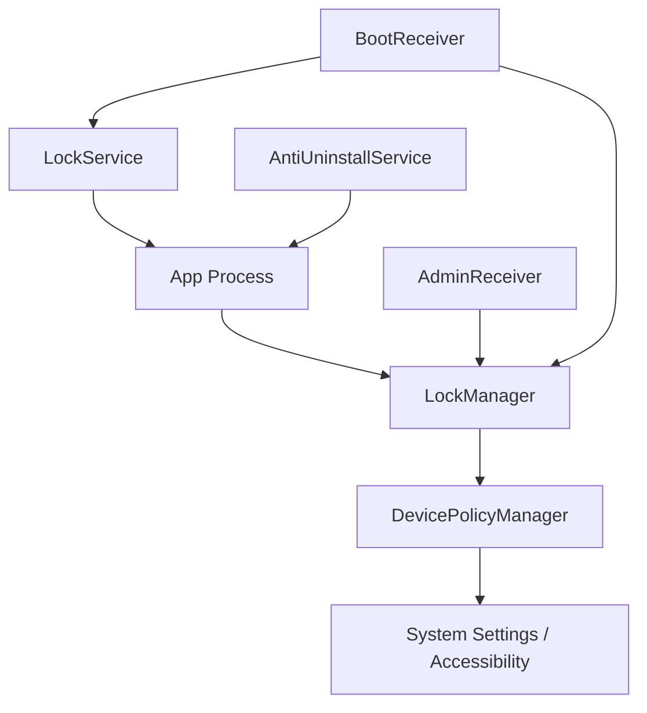
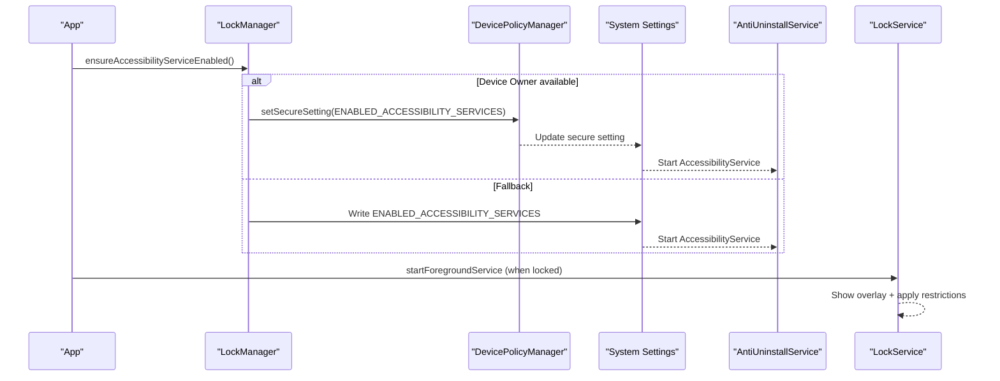
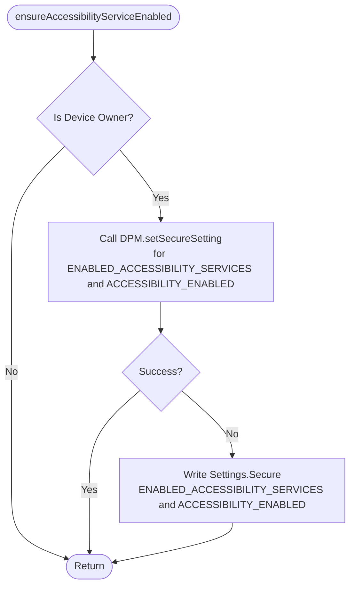
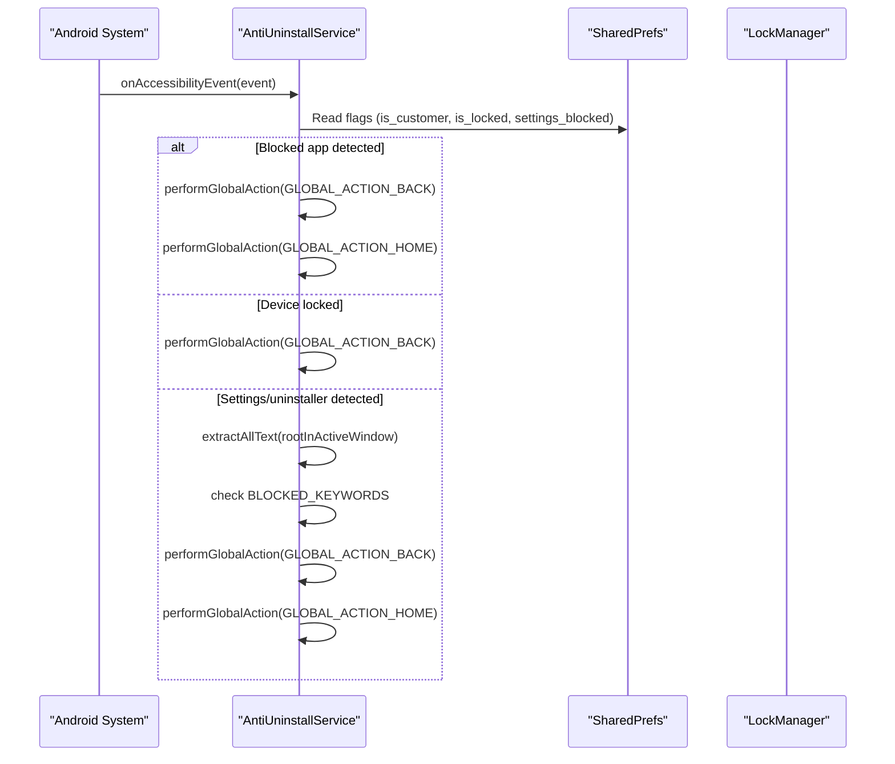
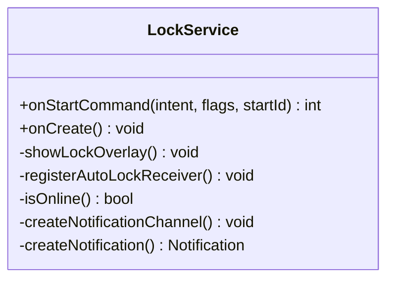
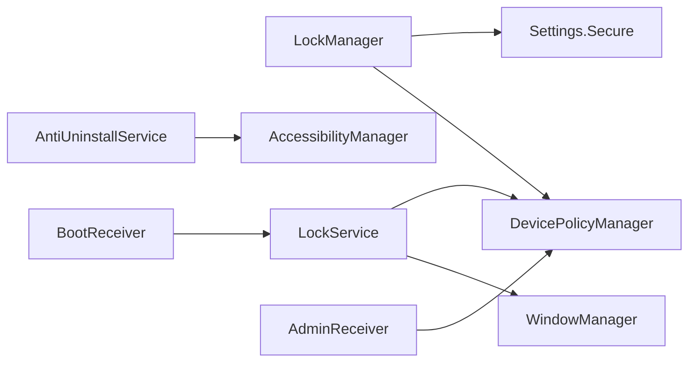

# Accessibility Protection

<cite>
**Referenced Files in This Document**
- [AntiUninstallService.kt](file://app/src/main/java/com/pksafe/lock/manager/service/AntiUninstallService.kt)
- [LockManager.kt](file://app/src/main/java/com/pksafe/lock/manager/util/LockManager.kt)
- [LockService.kt](file://app/src/main/java/com/pksafe/lock/manager/service/LockService.kt)
- [AdminReceiver.kt](file://app/src/main/java/com/pksafe/lock/manager/receiver/AdminReceiver.kt)
- [accessibility_service_config.xml](file://app/src/main/res/xml/accessibility_service_config.xml)
- [AndroidManifest.xml](file://app/src/main/AndroidManifest.xml)
- [BootReceiver.kt](file://app/src/main/java/com/pksafe/lock/manager/receiver/BootReceiver.kt)
</cite>

## Table of Contents
1. Introduction
2. Project Structure
3. Core Components
4. Architecture Overview
5. Detailed Component Analysis
6. Dependency Analysis
7. Performance Considerations
8. Troubleshooting Guide
9. Conclusion

## Introduction
This document explains PK Locker’s accessibility-based anti-uninstall protection system with a focus on:
- Ensuring the AntiUninstallService is enabled reliably using Device Policy Manager (DPM) setSecureSetting, especially on modern Android versions where direct Settings.Secure writes are unreliable.
- The dual-layer approach combining Device Owner APIs with fallback mechanisms for older Android versions.
- How AntiUninstallService monitors and prevents unauthorized uninstallation attempts via accessibility event inspection and global actions.
- Service activation workflows, error handling across Android versions (including Samsung Android 13/14), and troubleshooting startup failures.
- Security implications, battery optimization considerations, and user experience impact of persistent accessibility services.

## Project Structure
PK Locker implements its protection through a combination of:
- A foreground LockService that renders an overlay to enforce device lock state and block navigation.
- An AccessibilityService (AntiUninstallService) that intercepts UI events to prevent access to settings or uninstall flows.
- Device Admin/Device Owner capabilities managed by LockManager and AdminReceiver to apply restrictions and enable the accessibility service programmatically.
- Boot-time recovery via BootReceiver to re-establish protections after reboot.

**Diagram sources**
- [LockManager.kt:27-108](file://app/src/main/java/com/pksafe/lock/manager/util/LockManager.kt#L27-L108)
- [AdminReceiver.kt:14-41](file://app/src/main/java/com/pksafe/lock/manager/receiver/AdminReceiver.kt#L14-L41)
- [LockService.kt:41-80](file://app/src/main/java/com/pksafe/lock/manager/service/LockService.kt#L41-L80)
- [AntiUninstallService.kt:22-86](file://app/src/main/java/com/pksafe/lock/manager/service/AntiUninstallService.kt#L22-L86)
- [BootReceiver.kt:10-26](file://app/src/main/java/com/pksafe/lock/manager/receiver/BootReceiver.kt#L10-L26)

**Section sources**
- [AndroidManifest.xml:73-112](file://app/src/main/AndroidManifest.xml#L73-L112)
- [AndroidManifest.xml:114-121](file://app/src/main/AndroidManifest.xml#L114-L121)

## Core Components
- LockManager.ensureAccessibilityServiceEnabled: Uses DevicePolicyManager.setSecureSetting to enable the accessibility service when the app is Device Owner; falls back to direct Settings.Secure writes if needed.
- AntiUninstallService: An AccessibilityService that scans screen content for restricted keywords/actions and blocks them by performing global actions (Back/Home). It also supports dynamic app blocking and full device lock enforcement.
- LockService: Foreground service that displays a persistent lock overlay, enforces hardware restrictions via Device Admin/Owner, and integrates auto-lock based on connectivity.
- AdminReceiver: Handles device provisioning and admin enablement; grants critical permissions when in Device Owner mode and marks provisioning complete.
- BootReceiver: Restarts protective services after boot if conditions are met.

**Section sources**
- [LockManager.kt:75-108](file://app/src/main/java/com/pksafe/lock/manager/util/LockManager.kt#L75-L108)
- [AntiUninstallService.kt:22-213](file://app/src/main/java/com/pksafe/lock/manager/service/AntiUninstallService.kt#L22-L213)
- [LockService.kt:41-134](file://app/src/main/java/com/pksafe/lock/manager/service/LockService.kt#L41-L134)
- [AdminReceiver.kt:14-41](file://app/src/main/java/com/pksafe/lock/manager/receiver/AdminReceiver.kt#L14-L41)
- [BootReceiver.kt:10-26](file://app/src/main/java/com/pksafe/lock/manager/receiver/BootReceiver.kt#L10-L26)

## Architecture Overview
The protection architecture combines enterprise-grade controls with runtime monitoring:
- Device Owner path: LockManager uses DPM.setSecureSetting to enable the accessibility service reliably across Android versions, including Samsung devices on Android 13/14.
- Fallback path: If DPM fails, LockManager writes directly to Settings.Secure to enable the service.
- Runtime enforcement: AntiUninstallService observes accessibility events, extracts text from the active window, and blocks restricted actions.
- Overlay enforcement: LockService shows a persistent overlay and applies hardware restrictions to prevent bypasses.

**Diagram sources**
- [LockManager.kt:81-108](file://app/src/main/java/com/pksafe/lock/manager/util/LockManager.kt#L81-L108)
- [AndroidManifest.xml:101-112](file://app/src/main/AndroidManifest.xml#L101-L112)
- [LockService.kt:50-80](file://app/src/main/java/com/pksafe/lock/manager/service/LockService.kt#L50-L80)

## Detailed Component Analysis

### LockManager.ensureAccessibilityServiceEnabled
- Purpose: Programmatically enable the AntiUninstallService using the most reliable method available.
- Primary path: When the app is Device Owner, calls DevicePolicyManager.setSecureSetting to set both the enabled services list and the accessibility toggle.
- Fallback path: If DPM fails, writes directly to Settings.Secure to enable the service.
- Logging: Emits logs indicating success or failure of each path.

**Diagram sources**
- [LockManager.kt:81-108](file://app/src/main/java/com/pksafe/lock/manager/util/LockManager.kt#L81-L108)

**Section sources**
- [LockManager.kt:81-108](file://app/src/main/java/com/pksafe/lock/manager/util/LockManager.kt#L81-L108)

### AntiUninstallService
- Role: Monitors UI interactions to prevent users from reaching settings or uninstall flows.
- Event processing: Extracts text from the active window recursively and checks against blocked keywords.
- Actions: Performs global Back/Home actions to exit restricted screens; supports dynamic app blocking and full device lock enforcement.
- Connectivity integration: Registers a receiver to trigger auto-lock when internet disconnects under specific conditions.

**Diagram sources**
- [AntiUninstallService.kt:136-213](file://app/src/main/java/com/pksafe/lock/manager/service/AntiUninstallService.kt#L136-L213)
- [AntiUninstallService.kt:119-134](file://app/src/main/java/com/pksafe/lock/manager/service/AntiUninstallService.kt#L119-L134)

**Section sources**
- [AntiUninstallService.kt:22-213](file://app/src/main/java/com/pksafe/lock/manager/service/AntiUninstallService.kt#L22-L213)

### LockService
- Role: Foreground service that enforces device lock via overlay and hardware restrictions.
- Overlay: Displays a persistent view with input handling to prevent navigation away from the lock screen.
- Restrictions: Applies Device Admin/Owner restrictions such as disabling camera, USB file transfer, factory reset, safe boot, and debugging features.
- Auto-lock: Listens for connectivity changes to enforce locking when offline and auto-lock is enabled.

**Diagram sources**
- [LockService.kt:41-134](file://app/src/main/java/com/pksafe/lock/manager/service/LockService.kt#L41-L134)
- [LockService.kt:125-234](file://app/src/main/java/com/pksafe/lock/manager/service/LockService.kt#L125-L234)

**Section sources**
- [LockService.kt:41-134](file://app/src/main/java/com/pksafe/lock/manager/service/LockService.kt#L41-L134)
- [LockService.kt:125-234](file://app/src/main/java/com/pksafe/lock/manager/service/LockService.kt#L125-L234)

### AdminReceiver and Provisioning
- Role: Receives device admin lifecycle events and provisioning completion.
- Permissions: Grants critical permissions to self when in Device Owner mode.
- Provisioning: Supports QR-based provisioning flow to set up Device Owner securely.

**Section sources**
- [AdminReceiver.kt:14-41](file://app/src/main/java/com/pksafe/lock/manager/receiver/AdminReceiver.kt#L14-L41)
- [AdminReceiver.kt:43-102](file://app/src/main/java/com/pksafe/lock/manager/receiver/AdminReceiver.kt#L43-L102)

### Boot-time Recovery
- Role: Restarts protective services after boot if device admin is active and overlay permission is granted.

**Section sources**
- [BootReceiver.kt:10-26](file://app/src/main/java/com/pksafe/lock/manager/receiver/BootReceiver.kt#L10-L26)

## Dependency Analysis
- LockManager depends on DevicePolicyManager and Settings.Secure to enable the accessibility service.
- AntiUninstallService depends on AccessibilityManager and system accessibility events to monitor and block restricted actions.
- LockService depends on WindowManager for overlays and DevicePolicyManager for hardware restrictions.
- AdminReceiver integrates with DevicePolicyManager to manage admin privileges and grant permissions.
- BootReceiver ensures services restart post-boot.

**Diagram sources**
- [LockManager.kt:27-108](file://app/src/main/java/com/pksafe/lock/manager/util/LockManager.kt#L27-L108)
- [AntiUninstallService.kt:22-86](file://app/src/main/java/com/pksafe/lock/manager/service/AntiUninstallService.kt#L22-L86)
- [LockService.kt:41-134](file://app/src/main/java/com/pksafe/lock/manager/service/LockService.kt#L41-L134)
- [AdminReceiver.kt:14-41](file://app/src/main/java/com/pksafe/lock/manager/receiver/AdminReceiver.kt#L14-L41)
- [BootReceiver.kt:10-26](file://app/src/main/java/com/pksafe/lock/manager/receiver/BootReceiver.kt#L10-L26)

**Section sources**
- [AndroidManifest.xml:73-112](file://app/src/main/AndroidManifest.xml#L73-L112)
- [AndroidManifest.xml:114-121](file://app/src/main/AndroidManifest.xml#L114-L121)

## Performance Considerations
- Accessibility scanning: AntiUninstallService recursively traverses the view tree to collect text; this can be CPU-intensive on complex screens. Ensure efficient traversal and timely recycling of nodes to avoid memory pressure.
- Foreground service: LockService runs as a foreground service with a persistent notification; this increases reliability but may affect battery life. Use appropriate foreground service types and minimize work in the main thread.
- Network calls: LockService fetches EMI data asynchronously; ensure network requests are rate-limited and cached to reduce overhead.
- Battery optimization: On Android 12+, background execution limits may impact receivers and services. Consider using WorkManager for periodic tasks and ensure proper foreground notifications for long-running services.

[No sources needed since this section provides general guidance]

## Troubleshooting Guide
Common issues and resolutions:
- Accessibility service not starting:
  - Verify Device Owner status and call ensureAccessibilityServiceEnabled at app startup.
  - Check logs for DPM.setSecureSetting failures; if present, confirm fallback to Settings.Secure writes.
  - On Samsung Android 13/14, prefer DPM.setSecureSetting over direct Settings.Secure writes due to stricter enforcement.
- Overlay permission denied:
  - Ensure SYSTEM_ALERT_WINDOW permission is granted; prompt user via ACTION_MANAGE_OVERLAY_PERMISSION if missing.
- Boot-time service not restarting:
  - Confirm BootReceiver is registered and ACTION_BOOT_COMPLETED is received; verify device admin is active and overlay permission is granted before starting services.
- Auto-lock not triggering:
  - Validate connectivity receiver registration and isOnline checks; ensure auto_lock_enabled flag is set appropriately.
- Uninstallation attempts still succeed:
  - Confirm AntiUninstallService is enabled and running; check that blocked keywords match the target UI strings.
  - Ensure Device Owner restrictions like DISALLOW_UNINSTALL_APPS are applied when applicable.

**Section sources**
- [LockManager.kt:81-108](file://app/src/main/java/com/pksafe/lock/manager/util/LockManager.kt#L81-L108)
- [AntiUninstallService.kt:136-213](file://app/src/main/java/com/pksafe/lock/manager/service/AntiUninstallService.kt#L136-L213)
- [BootReceiver.kt:10-26](file://app/src/main/java/com/pksafe/lock/manager/receiver/BootReceiver.kt#L10-L26)
- [AndroidManifest.xml:73-112](file://app/src/main/AndroidManifest.xml#L73-L112)

## Conclusion
PK Locker’s accessibility-based protection leverages Device Owner capabilities to reliably enable and maintain an AccessibilityService that guards against unauthorized uninstallation and settings manipulation. The dual-layer approach—enterprise API first, fallback second—ensures robust operation across Android versions, including challenging OEM implementations like Samsung on Android 13/14. Combined with a persistent overlay and hardware restrictions, the system provides strong anti-tamper behavior while balancing performance and user experience. Proper configuration, logging, and troubleshooting steps are essential to maintain reliability in production environments.

[No sources needed since this section summarizes without analyzing specific files]